# Program Overview

This document describes the Commercial Policy Batch Processing (<SwmToken path="/base/src/LGAPDB01.cbl" pos="2:6:6" line-data="       PROGRAM-ID. LGAPDB01." repo-id="Z2l0aHViJTNBJTNBa3luZHJ5bC1jaWNzLWdlbmFwcCUzQSUzQVN3aW1tLURlbW8=" repo-name="kyndryl-cics-genapp">`LGAPDB01`</SwmToken> )batch job, which processes a file of property insurance policy applications. The job reads each policy record, validates if it is a commercial policy, and for valid records, coordinates risk assessment and premium calculation, writing results to an output file. Unsupported policy types are flagged with a rejection reason. At the end, the job closes files and displays a summary of records processed, errors, and totals.

Main steps:

- Initialize counters and output file
- Write header row
- For each input record:
  - Validate policy type
  - For commercial policies: assess risk, calculate risk score, determine verdict, compute premiums, and write results
  - For unsupported policies: mark as unsupported and write to output
- Close files
- Display summary

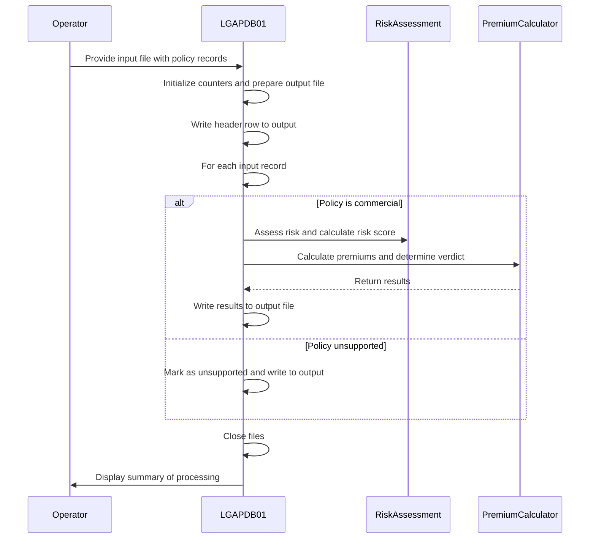

## Dependencies

### Programs

- <SwmToken path="/base/src/LGAPDB01.cbl" pos="116:4:4" line-data="           CALL &#39;LGAPDB02&#39; USING IN-PROPERTY-TYPE, IN-POSTCODE, WS-RISK-SCR." repo-id="Z2l0aHViJTNBJTNBa3luZHJ5bC1jaWNzLWdlbmFwcCUzQSUzQVN3aW1tLURlbW8=" repo-name="kyndryl-cics-genapp">`LGAPDB02`</SwmToken> (<SwmPath repo-id="Z2l0aHViJTNBJTNBa3luZHJ5bC1jaWNzLWdlbmFwcCUzQSUzQVN3aW1tLURlbW8=" repo-name="kyndryl-cics-genapp" path="/base/src/LGAPDB02.cbl">`(kyndryl-cics-genapp) base/src/LGAPDB02.cbl`</SwmPath>)
- <SwmToken path="/base/src/LGAPDB01.cbl" pos="119:4:4" line-data="           CALL &#39;LGAPDB03&#39; USING WS-RISK-SCR, IN-FIRE-PERIL, IN-CRIME-PERIL," repo-id="Z2l0aHViJTNBJTNBa3luZHJ5bC1jaWNzLWdlbmFwcCUzQSUzQVN3aW1tLURlbW8=" repo-name="kyndryl-cics-genapp">`LGAPDB03`</SwmToken> (<SwmPath repo-id="Z2l0aHViJTNBJTNBa3luZHJ5bC1jaWNzLWdlbmFwcCUzQSUzQVN3aW1tLURlbW8=" repo-name="kyndryl-cics-genapp" path="/base/src/LGAPDB03.cbl">`(kyndryl-cics-genapp) base/src/LGAPDB03.cbl`</SwmPath>)

### Copybooks

- SQLCA
- INPUTREC (<SwmPath repo-id="Z2l0aHViJTNBJTNBa3luZHJ5bC1jaWNzLWdlbmFwcCUzQSUzQVN3aW1tLURlbW8=" repo-name="kyndryl-cics-genapp" path="/base/src/INPUTREC.cpy">`(kyndryl-cics-genapp) base/src/INPUTREC.cpy`</SwmPath>)
- OUTPUTREC (<SwmPath repo-id="Z2l0aHViJTNBJTNBa3luZHJ5bC1jaWNzLWdlbmFwcCUzQSUzQVN3aW1tLURlbW8=" repo-name="kyndryl-cics-genapp" path="/base/src/OUTPUTREC.cpy">`(kyndryl-cics-genapp) base/src/OUTPUTREC.cpy`</SwmPath>)
- WORKSTOR (<SwmPath repo-id="Z2l0aHViJTNBJTNBa3luZHJ5bC1jaWNzLWdlbmFwcCUzQSUzQVN3aW1tLURlbW8=" repo-name="kyndryl-cics-genapp" path="/base/src/WORKSTOR.cpy">`(kyndryl-cics-genapp) base/src/WORKSTOR.cpy`</SwmPath>)

## Input and Output Tables/Files used in the Program

| Table / File Name                                                                                                                                                                                                                       | Type | Description                                            | Usage Mode | Key Fields / Layout Highlights |
| --------------------------------------------------------------------------------------------------------------------------------------------------------------------------------------------------------------------------------------- | ---- | ------------------------------------------------------ | ---------- | ------------------------------ |
| <SwmToken path="/base/src/LGAPDB01.cbl" pos="83:3:5" line-data="           READ INPUT-FILE" repo-id="Z2l0aHViJTNBJTNBa3luZHJ5bC1jaWNzLWdlbmFwcCUzQSUzQVN3aW1tLURlbW8=" repo-name="kyndryl-cics-genapp">`INPUT-FILE`</SwmToken>          | File | Insurance policy input records for premium calculation | Input      | File resource                  |
| <SwmToken path="/base/src/LGAPDB01.cbl" pos="52:5:7" line-data="           OPEN OUTPUT OUTPUT-FILE" repo-id="Z2l0aHViJTNBJTNBa3luZHJ5bC1jaWNzLWdlbmFwcCUzQSUzQVN3aW1tLURlbW8=" repo-name="kyndryl-cics-genapp">`OUTPUT-FILE`</SwmToken> | File | Calculated insurance premiums and processing results   | Output     | File resource                  |

&nbsp;

## Detailed View of the Program's Functionality

### a. Program Startup and Initialization

When the program starts, it first sets up the environment for batch processing. It defines the input and output files, their formats, and the working storage needed for counters and temporary values. The main procedure begins by displaying a startup message and resetting all counters for records read, processed, and errors to zero. This ensures that each run starts with a clean state, avoiding any leftover values from previous executions.

### b. File Opening and Output Header Preparation

The program then attempts to open the input file for reading and the output file for writing. If either file cannot be opened, it displays an error message and stops execution. Upon successful opening, it writes a header row to the output file, labeling each column (such as customer number, property type, postcode, risk score, various premiums, status, and rejection reason). This header ensures that the output file is properly structured for downstream processing or review.

### c. Main Record Processing Loop

After setup, the program enters its main processing loop. It reads the first record from the input file and then repeatedly processes records until the end of the file is reached. For each record, it increments the total records read counter and determines how to handle the record based on its policy type.

### d. Record Validation and Routing

Each input record is checked to see if it is a commercial policy. If it is, the program proceeds with full processing for that record and increments the processed counter. If not, it handles the record as an unsupported type, sets all premium and risk fields to zero, marks the status as unsupported, provides a rejection reason, and increments the error counter.

### e. Commercial Policy Processing Chain

For valid commercial policies, the program performs a series of steps:

1. It calls a separate module to assess the risk score for the property, using the property type and postcode. This involves fetching risk factors (such as fire and crime) from a database, with fallback to default values if the database is unavailable. The risk score is calculated by starting from a base value and adding increments based on property type and postcode patterns.
2. It then calls another module to determine the policy verdict (approved, pending, or rejected) based on the risk score, and to calculate the premiums for each peril (fire, crime, flood, weather) and the total premium. If all perils are covered, a discount is applied. The verdict and rejection reason are set according to the risk score thresholds.
3. A placeholder step is included for potential future logic.
4. Finally, all relevant fields (input and calculated) are copied into the output structure, and the record is written to the output file.

### f. Error Handling for Unsupported Policies

If a policy is not commercial, the program copies the basic input fields to the output, sets all calculated fields to zero, marks the status as unsupported, provides a rejection reason, and writes the record to the output file. This ensures unsupported records are clearly flagged and do not interfere with downstream processing.

### g. File Closure and Summary Reporting

After all records have been processed, the program closes both the input and output files. It then displays a summary of the batch run, showing the total number of records read, the number processed, and the number of errors. This provides a quick overview of the batch job's outcome for the operator or developer.

### h. End of Program

The program then stops execution, having completed its batch processing task. All output is now available in the designated output file, with a clear summary displayed for review.

# 

---

# Rule Definition

| Paragraph Name                                                                                                                                                                                                                                                                                                                                                                                                                                                                                                                                                                                                                                                                                                                                                                                                                                                                                                                                                                                                                                                                                                                                                                                                                                                                                                                                                                                                                                                                                                                                                                                                       | Rule ID | Category          | Description                                                                                                                                                                                                                                                                                                                                                                                                                                                                                                                                                                                                                                                                                                                                                                                                                                                                                                                                                                                                                                                                                                                                                                                                                                                                                                                                                                                                                                                                                                                                                                                                                                                                                                                                                                                                                                                                                                                                                            | Conditions                                                                                                                                                                                                                                                     | Remarks                                                                                                                                                                                                                                                                                                                                                                                                                                                                                                                                                                                                                                                                                                                                                                                                                                                                                                                                                                                                                                                                                                                                                                                                                                                                                                                                                                                                                                                                                                                                                                                                                                                                                                                                                                                                                                                                                                                                                                                                                                                                                                                                                                                                                                                                                                                                                                                                                                                                                                                                |
| -------------------------------------------------------------------------------------------------------------------------------------------------------------------------------------------------------------------------------------------------------------------------------------------------------------------------------------------------------------------------------------------------------------------------------------------------------------------------------------------------------------------------------------------------------------------------------------------------------------------------------------------------------------------------------------------------------------------------------------------------------------------------------------------------------------------------------------------------------------------------------------------------------------------------------------------------------------------------------------------------------------------------------------------------------------------------------------------------------------------------------------------------------------------------------------------------------------------------------------------------------------------------------------------------------------------------------------------------------------------------------------------------------------------------------------------------------------------------------------------------------------------------------------------------------------------------------------------------------------------- | ------- | ----------------- | ---------------------------------------------------------------------------------------------------------------------------------------------------------------------------------------------------------------------------------------------------------------------------------------------------------------------------------------------------------------------------------------------------------------------------------------------------------------------------------------------------------------------------------------------------------------------------------------------------------------------------------------------------------------------------------------------------------------------------------------------------------------------------------------------------------------------------------------------------------------------------------------------------------------------------------------------------------------------------------------------------------------------------------------------------------------------------------------------------------------------------------------------------------------------------------------------------------------------------------------------------------------------------------------------------------------------------------------------------------------------------------------------------------------------------------------------------------------------------------------------------------------------------------------------------------------------------------------------------------------------------------------------------------------------------------------------------------------------------------------------------------------------------------------------------------------------------------------------------------------------------------------------------------------------------------------------------------------------- | -------------------------------------------------------------------------------------------------------------------------------------------------------------------------------------------------------------------------------------------------------------- | -------------------------------------------------------------------------------------------------------------------------------------------------------------------------------------------------------------------------------------------------------------------------------------------------------------------------------------------------------------------------------------------------------------------------------------------------------------------------------------------------------------------------------------------------------------------------------------------------------------------------------------------------------------------------------------------------------------------------------------------------------------------------------------------------------------------------------------------------------------------------------------------------------------------------------------------------------------------------------------------------------------------------------------------------------------------------------------------------------------------------------------------------------------------------------------------------------------------------------------------------------------------------------------------------------------------------------------------------------------------------------------------------------------------------------------------------------------------------------------------------------------------------------------------------------------------------------------------------------------------------------------------------------------------------------------------------------------------------------------------------------------------------------------------------------------------------------------------------------------------------------------------------------------------------------------------------------------------------------------------------------------------------------------------------------------------------------------------------------------------------------------------------------------------------------------------------------------------------------------------------------------------------------------------------------------------------------------------------------------------------------------------------------------------------------------------------------------------------------------------------------------------------------------- |
| <SwmToken path="/base/src/LGAPDB01.cbl" pos="33:3:3" line-data="           PERFORM P003" repo-id="Z2l0aHViJTNBJTNBa3luZHJ5bC1jaWNzLWdlbmFwcCUzQSUzQVN3aW1tLURlbW8=" repo-name="kyndryl-cics-genapp">`P003`</SwmToken>, <SwmToken path="/base/src/LGAPDB01.cbl" pos="58:3:3" line-data="           PERFORM P004." repo-id="Z2l0aHViJTNBJTNBa3luZHJ5bC1jaWNzLWdlbmFwcCUzQSUzQVN3aW1tLURlbW8=" repo-name="kyndryl-cics-genapp">`P004`</SwmToken>, <SwmToken path="/base/src/LGAPDB01.cbl" pos="34:3:3" line-data="           PERFORM P005" repo-id="Z2l0aHViJTNBJTNBa3luZHJ5bC1jaWNzLWdlbmFwcCUzQSUzQVN3aW1tLURlbW8=" repo-name="kyndryl-cics-genapp">`P005`</SwmToken>, <SwmToken path="/base/src/LGAPDB01.cbl" pos="35:3:3" line-data="           PERFORM P014" repo-id="Z2l0aHViJTNBJTNBa3luZHJ5bC1jaWNzLWdlbmFwcCUzQSUzQVN3aW1tLURlbW8=" repo-name="kyndryl-cics-genapp">`P014`</SwmToken>                                                                                                                                                                                                                                                                                                                                                                                                                                                                                                                                                                                                                                                                                                                          | RL-001  | Data Assignment   | The program must read from a fixed-width, line sequential input file and write to a fixed-width, line sequential output file. The output file must begin with a header row, and all records (including the header) must strictly follow the specified field order, widths, and alignments.                                                                                                                                                                                                                                                                                                                                                                                                                                                                                                                                                                                                                                                                                                                                                                                                                                                                                                                                                                                                                                                                                                                                                                                                                                                                                                                                                                                                                                                                                                                                                                                                                                                                             | At program start, before any records are processed.                                                                                                                                                                                                            | Input file: <SwmToken path="/base/src/LGAPDB01.cbl" pos="9:12:14" line-data="           SELECT INPUT-FILE ASSIGN TO &#39;INPUT.DAT&#39;" repo-id="Z2l0aHViJTNBJTNBa3luZHJ5bC1jaWNzLWdlbmFwcCUzQSUzQVN3aW1tLURlbW8=" repo-name="kyndryl-cics-genapp">`INPUT.DAT`</SwmToken>, Output file: <SwmToken path="/base/src/LGAPDB01.cbl" pos="13:12:14" line-data="           SELECT OUTPUT-FILE ASSIGN TO &#39;OUTPUT.DAT&#39;" repo-id="Z2l0aHViJTNBJTNBa3luZHJ5bC1jaWNzLWdlbmFwcCUzQSUzQVN3aW1tLURlbW8=" repo-name="kyndryl-cics-genapp">`OUTPUT.DAT`</SwmToken>. All fields must be fixed-width, no delimiters. Header row fields: CUSTOMER (10), <SwmToken path="/base/src/LGAPDB01.cbl" pos="62:4:6" line-data="           MOVE &#39;PROPERTY-TYPE   &#39; TO OUT-PROPERTY-TYPE" repo-id="Z2l0aHViJTNBJTNBa3luZHJ5bC1jaWNzLWdlbmFwcCUzQSUzQVN3aW1tLURlbW8=" repo-name="kyndryl-cics-genapp">`PROPERTY-TYPE`</SwmToken> (15), POSTCODE (8), RSK (3), <SwmToken path="/base/src/LGAPDB01.cbl" pos="65:4:6" line-data="           MOVE &#39;FIRE-PREM&#39; TO OUT-FIRE-PREMIUM" repo-id="Z2l0aHViJTNBJTNBa3luZHJ5bC1jaWNzLWdlbmFwcCUzQSUzQVN3aW1tLURlbW8=" repo-name="kyndryl-cics-genapp">`FIRE-PREM`</SwmToken> (10, numeric, 2 decimals, right-aligned), <SwmToken path="/base/src/LGAPDB01.cbl" pos="66:4:6" line-data="           MOVE &#39;CRIME-PREM&#39; TO OUT-CRIME-PREMIUM" repo-id="Z2l0aHViJTNBJTNBa3luZHJ5bC1jaWNzLWdlbmFwcCUzQSUzQVN3aW1tLURlbW8=" repo-name="kyndryl-cics-genapp">`CRIME-PREM`</SwmToken> (10, numeric, 2 decimals, right-aligned), <SwmToken path="/base/src/LGAPDB01.cbl" pos="67:4:6" line-data="           MOVE &#39;FLOOD-PREM&#39; TO OUT-FLOOD-PREMIUM" repo-id="Z2l0aHViJTNBJTNBa3luZHJ5bC1jaWNzLWdlbmFwcCUzQSUzQVN3aW1tLURlbW8=" repo-name="kyndryl-cics-genapp">`FLOOD-PREM`</SwmToken> (10, numeric, 2 decimals, right-aligned), <SwmToken path="/base/src/LGAPDB01.cbl" pos="68:4:6" line-data="           MOVE &#39;WEATHER-PREM&#39; TO OUT-WEATHER-PREMIUM" repo-id="Z2l0aHViJTNBJTNBa3luZHJ5bC1jaWNzLWdlbmFwcCUzQSUzQVN3aW1tLURlbW8=" repo-name="kyndryl-cics-genapp">`WEATHER-PREM`</SwmToken> (10, numeric, 2 decimals, right-aligned), <SwmToken path="/base/src/LGAPDB01.cbl" pos="69:4:6" line-data="           MOVE &#39;TOTAL-PREMIUM&#39; TO OUT-TOTAL-PREMIUM" repo-id="Z2l0aHViJTNBJTNBa3luZHJ5bC1jaWNzLWdlbmFwcCUzQSUzQVN3aW1tLURlbW8=" repo-name="kyndryl-cics-genapp">`TOTAL-PREMIUM`</SwmToken> (11, numeric, 2 decimals, right-aligned), STATUS (20), REJECTION REASON (50). |
| <SwmToken path="/base/src/LGAPDB01.cbl" pos="32:3:3" line-data="           PERFORM P002" repo-id="Z2l0aHViJTNBJTNBa3luZHJ5bC1jaWNzLWdlbmFwcCUzQSUzQVN3aW1tLURlbW8=" repo-name="kyndryl-cics-genapp">`P002`</SwmToken>, <SwmToken path="/base/src/LGAPDB01.cbl" pos="33:3:3" line-data="           PERFORM P003" repo-id="Z2l0aHViJTNBJTNBa3luZHJ5bC1jaWNzLWdlbmFwcCUzQSUzQVN3aW1tLURlbW8=" repo-name="kyndryl-cics-genapp">`P003`</SwmToken>, <SwmToken path="/base/src/LGAPDB01.cbl" pos="34:3:3" line-data="           PERFORM P005" repo-id="Z2l0aHViJTNBJTNBa3luZHJ5bC1jaWNzLWdlbmFwcCUzQSUzQVN3aW1tLURlbW8=" repo-name="kyndryl-cics-genapp">`P005`</SwmToken>                                                                                                                                                                                                                                                                                                                                                                                                                                                                                                                                                                                                                                                                                                                                                                                                                                                                                                                                                  | RL-002  | Data Assignment   | All processing counters (records read, processed, errors) must be initialized to zero before any records are processed. No records are processed until counters are initialized and the output file is open and header written.                                                                                                                                                                                                                                                                                                                                                                                                                                                                                                                                                                                                                                                                                                                                                                                                                                                                                                                                                                                                                                                                                                                                                                                                                                                                                                                                                                                                                                                                                                                                                                                                                                                                                                                                        | At program startup, before processing any input records.                                                                                                                                                                                                       | Counters: total records read, processed (valid commercial), and errors (unsupported or error records).                                                                                                                                                                                                                                                                                                                                                                                                                                                                                                                                                                                                                                                                                                                                                                                                                                                                                                                                                                                                                                                                                                                                                                                                                                                                                                                                                                                                                                                                                                                                                                                                                                                                                                                                                                                                                                                                                                                                                                                                                                                                                                                                                                                                                                                                                                                                                                                                                                 |
| <SwmToken path="/base/src/LGAPDB01.cbl" pos="34:3:3" line-data="           PERFORM P005" repo-id="Z2l0aHViJTNBJTNBa3luZHJ5bC1jaWNzLWdlbmFwcCUzQSUzQVN3aW1tLURlbW8=" repo-name="kyndryl-cics-genapp">`P005`</SwmToken>, <SwmToken path="/base/src/LGAPDB01.cbl" pos="75:3:3" line-data="           PERFORM P006" repo-id="Z2l0aHViJTNBJTNBa3luZHJ5bC1jaWNzLWdlbmFwcCUzQSUzQVN3aW1tLURlbW8=" repo-name="kyndryl-cics-genapp">`P006`</SwmToken>                                                                                                                                                                                                                                                                                                                                                                                                                                                                                                                                                                                                                                                                                                                                                                                                                                                                                                                                                                                                                                                                                                                                                                         | RL-003  | Conditional Logic | Records are processed sequentially from the input file until end-of-file is reached. For each record, the read counter is incremented.                                                                                                                                                                                                                                                                                                                                                                                                                                                                                                                                                                                                                                                                                                                                                                                                                                                                                                                                                                                                                                                                                                                                                                                                                                                                                                                                                                                                                                                                                                                                                                                                                                                                                                                                                                                                                                 | While not end-of-file on input.                                                                                                                                                                                                                                | No records are skipped; processing stops only at end-of-file.                                                                                                                                                                                                                                                                                                                                                                                                                                                                                                                                                                                                                                                                                                                                                                                                                                                                                                                                                                                                                                                                                                                                                                                                                                                                                                                                                                                                                                                                                                                                                                                                                                                                                                                                                                                                                                                                                                                                                                                                                                                                                                                                                                                                                                                                                                                                                                                                                                                                          |
| <SwmToken path="/base/src/LGAPDB01.cbl" pos="78:3:3" line-data="               PERFORM P007" repo-id="Z2l0aHViJTNBJTNBa3luZHJ5bC1jaWNzLWdlbmFwcCUzQSUzQVN3aW1tLURlbW8=" repo-name="kyndryl-cics-genapp">`P007`</SwmToken>, <SwmToken path="/base/src/LGAPDB01.cbl" pos="88:3:3" line-data="               PERFORM P009" repo-id="Z2l0aHViJTNBJTNBa3luZHJ5bC1jaWNzLWdlbmFwcCUzQSUzQVN3aW1tLURlbW8=" repo-name="kyndryl-cics-genapp">`P009`</SwmToken>, <SwmToken path="/base/src/LGAPDB01.cbl" pos="110:3:3" line-data="           PERFORM P010" repo-id="Z2l0aHViJTNBJTNBa3luZHJ5bC1jaWNzLWdlbmFwcCUzQSUzQVN3aW1tLURlbW8=" repo-name="kyndryl-cics-genapp">`P010`</SwmToken>, <SwmPath repo-id="Z2l0aHViJTNBJTNBa3luZHJ5bC1jaWNzLWdlbmFwcCUzQSUzQVN3aW1tLURlbW8=" repo-name="kyndryl-cics-genapp" path="/base/src/LGAPDB02.cbl">`(kyndryl-cics-genapp) base/src/LGAPDB02.cbl`</SwmPath> <SwmToken path="/base/src/LGAPDB02.cbl" pos="26:1:3" line-data="       MAIN-LOGIC." repo-id="Z2l0aHViJTNBJTNBa3luZHJ5bC1jaWNzLWdlbmFwcCUzQSUzQVN3aW1tLURlbW8=" repo-name="kyndryl-cics-genapp">`MAIN-LOGIC`</SwmToken>, <SwmToken path="/base/src/LGAPDB02.cbl" pos="27:3:7" line-data="           PERFORM GET-RISK-FACTORS" repo-id="Z2l0aHViJTNBJTNBa3luZHJ5bC1jaWNzLWdlbmFwcCUzQSUzQVN3aW1tLURlbW8=" repo-name="kyndryl-cics-genapp">`GET-RISK-FACTORS`</SwmToken>, <SwmToken path="/base/src/LGAPDB02.cbl" pos="28:3:7" line-data="           PERFORM CALCULATE-RISK-SCORE" repo-id="Z2l0aHViJTNBJTNBa3luZHJ5bC1jaWNzLWdlbmFwcCUzQSUzQVN3aW1tLURlbW8=" repo-name="kyndryl-cics-genapp">`CALCULATE-RISK-SCORE`</SwmToken> | RL-004  | Computation       | If the policy type is 'C' (commercial), the record is processed as a commercial policy. The processed counter is incremented. Risk factors for FIRE and CRIME are fetched from a database (defaults: FIRE <SwmToken path="/base/src/LGAPDB02.cbl" pos="41:3:5" line-data="               MOVE 0.80 TO WS-FIRE-FACTOR" repo-id="Z2l0aHViJTNBJTNBa3luZHJ5bC1jaWNzLWdlbmFwcCUzQSUzQVN3aW1tLURlbW8=" repo-name="kyndryl-cics-genapp">`0.80`</SwmToken>, CRIME <SwmToken path="/base/src/LGAPDB02.cbl" pos="53:3:5" line-data="               MOVE 0.60 TO WS-CRIME-FACTOR" repo-id="Z2l0aHViJTNBJTNBa3luZHJ5bC1jaWNzLWdlbmFwcCUzQSUzQVN3aW1tLURlbW8=" repo-name="kyndryl-cics-genapp">`0.60`</SwmToken> if not found). The risk score is calculated: base 100, plus property type adjustment (WAREHOUSE +50, FACTORY +75, OFFICE +25, RETAIL +40, other +30), plus 30 if postcode starts with 'FL' or 'CR'.                                                                                                                                                                                                                                                                                                                                                                                                                                                                                                                                                                                                                                                                                                                                                                                                                                                                                                                                                                                                                                                                | <SwmToken path="/base/src/LGAPDB01.cbl" pos="87:3:7" line-data="           IF IN-POLICY-TYPE = &#39;C&#39;" repo-id="Z2l0aHViJTNBJTNBa3luZHJ5bC1jaWNzLWdlbmFwcCUzQSUzQVN3aW1tLURlbW8=" repo-name="kyndryl-cics-genapp">`IN-POLICY-TYPE`</SwmToken> is 'C'.     | Default risk factors: FIRE <SwmToken path="/base/src/LGAPDB02.cbl" pos="41:3:5" line-data="               MOVE 0.80 TO WS-FIRE-FACTOR" repo-id="Z2l0aHViJTNBJTNBa3luZHJ5bC1jaWNzLWdlbmFwcCUzQSUzQVN3aW1tLURlbW8=" repo-name="kyndryl-cics-genapp">`0.80`</SwmToken>, CRIME <SwmToken path="/base/src/LGAPDB02.cbl" pos="53:3:5" line-data="               MOVE 0.60 TO WS-CRIME-FACTOR" repo-id="Z2l0aHViJTNBJTNBa3luZHJ5bC1jaWNzLWdlbmFwcCUzQSUzQVN3aW1tLURlbW8=" repo-name="kyndryl-cics-genapp">`0.60`</SwmToken>. Property type adjustments as above. Postcode prefix adjustment: +30 for 'FL' or 'CR'.                                                                                                                                                                                                                                                                                                                                                                                                                                                                                                                                                                                                                                                                                                                                                                                                                                                                                                                                                                                                                                                                                                                                                                                                                                                                                                                                                                                                                                                                                                                                                                                                                                                                                                                                                                                                                                                                                                                            |
| <SwmPath repo-id="Z2l0aHViJTNBJTNBa3luZHJ5bC1jaWNzLWdlbmFwcCUzQSUzQVN3aW1tLURlbW8=" repo-name="kyndryl-cics-genapp" path="/base/src/LGAPDB03.cbl">`(kyndryl-cics-genapp) base/src/LGAPDB03.cbl`</SwmPath> <SwmToken path="/base/src/LGAPDB03.cbl" pos="44:3:5" line-data="           PERFORM CALCULATE-VERDICT" repo-id="Z2l0aHViJTNBJTNBa3luZHJ5bC1jaWNzLWdlbmFwcCUzQSUzQVN3aW1tLURlbW8=" repo-name="kyndryl-cics-genapp">`CALCULATE-VERDICT`</SwmToken>                                                                                                                                                                                                                                                                                                                                                                                                                                                                                                                                                                                                                                                                                                                                                                                                                                                                                                                                                                                                                                                                                                                                                            | RL-005  | Conditional Logic | The policy status and rejection reason are set based on the risk score: >200 = REJECTED/High Risk, 151-200 = PENDING/Medium Risk, <=150 = APPROVED/blank.                                                                                                                                                                                                                                                                                                                                                                                                                                                                                                                                                                                                                                                                                                                                                                                                                                                                                                                                                                                                                                                                                                                                                                                                                                                                                                                                                                                                                                                                                                                                                                                                                                                                                                                                                                                                              | After risk score is calculated for a commercial policy.                                                                                                                                                                                                        | Status values: 'REJECTED', 'PENDING', 'APPROVED'. Rejection reasons: 'High Risk Score - Manual Review Required', 'Medium Risk - Pending Review', blank.                                                                                                                                                                                                                                                                                                                                                                                                                                                                                                                                                                                                                                                                                                                                                                                                                                                                                                                                                                                                                                                                                                                                                                                                                                                                                                                                                                                                                                                                                                                                                                                                                                                                                                                                                                                                                                                                                                                                                                                                                                                                                                                                                                                                                                                                                                                                                                                |
| <SwmPath repo-id="Z2l0aHViJTNBJTNBa3luZHJ5bC1jaWNzLWdlbmFwcCUzQSUzQVN3aW1tLURlbW8=" repo-name="kyndryl-cics-genapp" path="/base/src/LGAPDB03.cbl">`(kyndryl-cics-genapp) base/src/LGAPDB03.cbl`</SwmPath> <SwmToken path="/base/src/LGAPDB03.cbl" pos="45:3:5" line-data="           PERFORM CALCULATE-PREMIUMS" repo-id="Z2l0aHViJTNBJTNBa3luZHJ5bC1jaWNzLWdlbmFwcCUzQSUzQVN3aW1tLURlbW8=" repo-name="kyndryl-cics-genapp">`CALCULATE-PREMIUMS`</SwmToken>                                                                                                                                                                                                                                                                                                                                                                                                                                                                                                                                                                                                                                                                                                                                                                                                                                                                                                                                                                                                                                                                                                                                                          | RL-006  | Conditional Logic | If all peril values (FIRE, CRIME, FLOOD, WEATHER) are greater than zero, discount factor is <SwmToken path="/base/src/LGAPDB03.cbl" pos="99:3:5" line-data="             MOVE 0.90 TO LK-DISC-FACT" repo-id="Z2l0aHViJTNBJTNBa3luZHJ5bC1jaWNzLWdlbmFwcCUzQSUzQVN3aW1tLURlbW8=" repo-name="kyndryl-cics-genapp">`0.90`</SwmToken>; otherwise, <SwmToken path="/base/src/LGAPDB03.cbl" pos="93:3:5" line-data="           MOVE 1.00 TO LK-DISC-FACT" repo-id="Z2l0aHViJTNBJTNBa3luZHJ5bC1jaWNzLWdlbmFwcCUzQSUzQVN3aW1tLURlbW8=" repo-name="kyndryl-cics-genapp">`1.00`</SwmToken>.                                                                                                                                                                                                                                                                                                                                                                                                                                                                                                                                                                                                                                                                                                                                                                                                                                                                                                                                                                                                                                                                                                                                                                                                                                                                                                                                                                                       | When calculating premiums for a commercial policy.                                                                                                                                                                                                             | Discount factor: <SwmToken path="/base/src/LGAPDB03.cbl" pos="99:3:5" line-data="             MOVE 0.90 TO LK-DISC-FACT" repo-id="Z2l0aHViJTNBJTNBa3luZHJ5bC1jaWNzLWdlbmFwcCUzQSUzQVN3aW1tLURlbW8=" repo-name="kyndryl-cics-genapp">`0.90`</SwmToken> if all perils > 0, else <SwmToken path="/base/src/LGAPDB03.cbl" pos="93:3:5" line-data="           MOVE 1.00 TO LK-DISC-FACT" repo-id="Z2l0aHViJTNBJTNBa3luZHJ5bC1jaWNzLWdlbmFwcCUzQSUzQVN3aW1tLURlbW8=" repo-name="kyndryl-cics-genapp">`1.00`</SwmToken>.                                                                                                                                                                                                                                                                                                                                                                                                                                                                                                                                                                                                                                                                                                                                                                                                                                                                                                                                                                                                                                                                                                                                                                                                                                                                                                                                                                                                                                                                                                                                                                                                                                                                                                                                                                                                                                                                                                                                                                                                                      |
| <SwmPath repo-id="Z2l0aHViJTNBJTNBa3luZHJ5bC1jaWNzLWdlbmFwcCUzQSUzQVN3aW1tLURlbW8=" repo-name="kyndryl-cics-genapp" path="/base/src/LGAPDB03.cbl">`(kyndryl-cics-genapp) base/src/LGAPDB03.cbl`</SwmPath> <SwmToken path="/base/src/LGAPDB03.cbl" pos="45:3:5" line-data="           PERFORM CALCULATE-PREMIUMS" repo-id="Z2l0aHViJTNBJTNBa3luZHJ5bC1jaWNzLWdlbmFwcCUzQSUzQVN3aW1tLURlbW8=" repo-name="kyndryl-cics-genapp">`CALCULATE-PREMIUMS`</SwmToken>                                                                                                                                                                                                                                                                                                                                                                                                                                                                                                                                                                                                                                                                                                                                                                                                                                                                                                                                                                                                                                                                                                                                                          | RL-007  | Computation       | Premiums for each peril are calculated as: FIRE = <SwmToken path="/base/src/LGAPDB01.cbl" pos="119:16:20" line-data="           CALL &#39;LGAPDB03&#39; USING WS-RISK-SCR, IN-FIRE-PERIL, IN-CRIME-PERIL," repo-id="Z2l0aHViJTNBJTNBa3luZHJ5bC1jaWNzLWdlbmFwcCUzQSUzQVN3aW1tLURlbW8=" repo-name="kyndryl-cics-genapp">`IN-FIRE-PERIL`</SwmToken> × FIRE risk factor × risk score × discount factor; CRIME = <SwmToken path="/base/src/LGAPDB01.cbl" pos="119:23:27" line-data="           CALL &#39;LGAPDB03&#39; USING WS-RISK-SCR, IN-FIRE-PERIL, IN-CRIME-PERIL," repo-id="Z2l0aHViJTNBJTNBa3luZHJ5bC1jaWNzLWdlbmFwcCUzQSUzQVN3aW1tLURlbW8=" repo-name="kyndryl-cics-genapp">`IN-CRIME-PERIL`</SwmToken> × CRIME risk factor × risk score × discount factor; FLOOD = <SwmToken path="/base/src/LGAPDB01.cbl" pos="120:1:5" line-data="                                IN-FLOOD-PERIL, IN-WEATHER-PERIL, WS-STAT," repo-id="Z2l0aHViJTNBJTNBa3luZHJ5bC1jaWNzLWdlbmFwcCUzQSUzQVN3aW1tLURlbW8=" repo-name="kyndryl-cics-genapp">`IN-FLOOD-PERIL`</SwmToken> × <SwmToken path="/base/src/LGAPDB02.cbl" pos="16:15:17" line-data="       01  WS-FLOOD-FACTOR             PIC V99 VALUE 1.20." repo-id="Z2l0aHViJTNBJTNBa3luZHJ5bC1jaWNzLWdlbmFwcCUzQSUzQVN3aW1tLURlbW8=" repo-name="kyndryl-cics-genapp">`1.20`</SwmToken> × risk score × discount factor; WEATHER = <SwmToken path="/base/src/LGAPDB01.cbl" pos="120:8:12" line-data="                                IN-FLOOD-PERIL, IN-WEATHER-PERIL, WS-STAT," repo-id="Z2l0aHViJTNBJTNBa3luZHJ5bC1jaWNzLWdlbmFwcCUzQSUzQVN3aW1tLURlbW8=" repo-name="kyndryl-cics-genapp">`IN-WEATHER-PERIL`</SwmToken> × <SwmToken path="/base/src/LGAPDB03.cbl" pos="99:3:5" line-data="             MOVE 0.90 TO LK-DISC-FACT" repo-id="Z2l0aHViJTNBJTNBa3luZHJ5bC1jaWNzLWdlbmFwcCUzQSUzQVN3aW1tLURlbW8=" repo-name="kyndryl-cics-genapp">`0.90`</SwmToken> × risk score × discount factor. Total premium is the sum of all four. | When processing a commercial policy.                                                                                                                                                                                                                           | FIRE risk factor: from DB or <SwmToken path="/base/src/LGAPDB02.cbl" pos="41:3:5" line-data="               MOVE 0.80 TO WS-FIRE-FACTOR" repo-id="Z2l0aHViJTNBJTNBa3luZHJ5bC1jaWNzLWdlbmFwcCUzQSUzQVN3aW1tLURlbW8=" repo-name="kyndryl-cics-genapp">`0.80`</SwmToken>; CRIME: from DB or <SwmToken path="/base/src/LGAPDB02.cbl" pos="53:3:5" line-data="               MOVE 0.60 TO WS-CRIME-FACTOR" repo-id="Z2l0aHViJTNBJTNBa3luZHJ5bC1jaWNzLWdlbmFwcCUzQSUzQVN3aW1tLURlbW8=" repo-name="kyndryl-cics-genapp">`0.60`</SwmToken>; FLOOD: <SwmToken path="/base/src/LGAPDB02.cbl" pos="16:15:17" line-data="       01  WS-FLOOD-FACTOR             PIC V99 VALUE 1.20." repo-id="Z2l0aHViJTNBJTNBa3luZHJ5bC1jaWNzLWdlbmFwcCUzQSUzQVN3aW1tLURlbW8=" repo-name="kyndryl-cics-genapp">`1.20`</SwmToken>; WEATHER: <SwmToken path="/base/src/LGAPDB03.cbl" pos="99:3:5" line-data="             MOVE 0.90 TO LK-DISC-FACT" repo-id="Z2l0aHViJTNBJTNBa3luZHJ5bC1jaWNzLWdlbmFwcCUzQSUzQVN3aW1tLURlbW8=" repo-name="kyndryl-cics-genapp">`0.90`</SwmToken>. All premiums: numeric, two decimal places, right-aligned, padded to field width (10 for each peril, 11 for total).                                                                                                                                                                                                                                                                                                                                                                                                                                                                                                                                                                                                                                                                                                                                                                                                                                                                                                                                                                                                                                                                                                                                                                                                                                                                                                                                                               |
| <SwmToken path="/base/src/LGAPDB01.cbl" pos="113:3:3" line-data="           PERFORM P013." repo-id="Z2l0aHViJTNBJTNBa3luZHJ5bC1jaWNzLWdlbmFwcCUzQSUzQVN3aW1tLURlbW8=" repo-name="kyndryl-cics-genapp">`P013`</SwmToken>                                                                                                                                                                                                                                                                                                                                                                                                                                                                                                                                                                                                                                                                                                                                                                                                                                                                                                                                                                                                                                                                                                                                                                                                                                                                                                                                                                                              | RL-008  | Data Assignment   | For commercial policies, the output record includes all input fields, calculated risk score, all premiums, total premium, status, and rejection reason, formatted as specified.                                                                                                                                                                                                                                                                                                                                                                                                                                                                                                                                                                                                                                                                                                                                                                                                                                                                                                                                                                                                                                                                                                                                                                                                                                                                                                                                                                                                                                                                                                                                                                                                                                                                                                                                                                                        | After all calculations for a commercial policy.                                                                                                                                                                                                                | Output fields: customer number (10), property type (15), postcode (8), risk score (3), each premium (10, numeric, 2 decimals), total premium (11, numeric, 2 decimals), status (20), rejection reason (50).                                                                                                                                                                                                                                                                                                                                                                                                                                                                                                                                                                                                                                                                                                                                                                                                                                                                                                                                                                                                                                                                                                                                                                                                                                                                                                                                                                                                                                                                                                                                                                                                                                                                                                                                                                                                                                                                                                                                                                                                                                                                                                                                                                                                                                                                                                                            |
| <SwmToken path="/base/src/LGAPDB01.cbl" pos="91:3:3" line-data="               PERFORM P008" repo-id="Z2l0aHViJTNBJTNBa3luZHJ5bC1jaWNzLWdlbmFwcCUzQSUzQVN3aW1tLURlbW8=" repo-name="kyndryl-cics-genapp">`P008`</SwmToken>                                                                                                                                                                                                                                                                                                                                                                                                                                                                                                                                                                                                                                                                                                                                                                                                                                                                                                                                                                                                                                                                                                                                                                                                                                                                                                                                                                                            | RL-009  | Conditional Logic | If the policy type is not 'C', the error counter is incremented. The output record includes input fields, risk score and all premiums set to zero, status set to 'UNSUPPORTED', and rejection reason set to 'Policy type not supported'.                                                                                                                                                                                                                                                                                                                                                                                                                                                                                                                                                                                                                                                                                                                                                                                                                                                                                                                                                                                                                                                                                                                                                                                                                                                                                                                                                                                                                                                                                                                                                                                                                                                                                                                               | <SwmToken path="/base/src/LGAPDB01.cbl" pos="87:3:7" line-data="           IF IN-POLICY-TYPE = &#39;C&#39;" repo-id="Z2l0aHViJTNBJTNBa3luZHJ5bC1jaWNzLWdlbmFwcCUzQSUzQVN3aW1tLURlbW8=" repo-name="kyndryl-cics-genapp">`IN-POLICY-TYPE`</SwmToken> is not 'C'. | Status: 'UNSUPPORTED'. Rejection reason: 'Policy type not supported'. All numeric fields zeroed.                                                                                                                                                                                                                                                                                                                                                                                                                                                                                                                                                                                                                                                                                                                                                                                                                                                                                                                                                                                                                                                                                                                                                                                                                                                                                                                                                                                                                                                                                                                                                                                                                                                                                                                                                                                                                                                                                                                                                                                                                                                                                                                                                                                                                                                                                                                                                                                                                                       |
| <SwmToken path="/base/src/LGAPDB01.cbl" pos="36:3:3" line-data="           PERFORM P015" repo-id="Z2l0aHViJTNBJTNBa3luZHJ5bC1jaWNzLWdlbmFwcCUzQSUzQVN3aW1tLURlbW8=" repo-name="kyndryl-cics-genapp">`P015`</SwmToken>                                                                                                                                                                                                                                                                                                                                                                                                                                                                                                                                                                                                                                                                                                                                                                                                                                                                                                                                                                                                                                                                                                                                                                                                                                                                                                                                                                                                | RL-010  | Data Assignment   | After all records are processed and files closed, a summary is displayed or output, showing total records read, processed, and with errors.                                                                                                                                                                                                                                                                                                                                                                                                                                                                                                                                                                                                                                                                                                                                                                                                                                                                                                                                                                                                                                                                                                                                                                                                                                                                                                                                                                                                                                                                                                                                                                                                                                                                                                                                                                                                                            | After file closure, at end of program.                                                                                                                                                                                                                         | Summary fields: total records read, processed, errors.                                                                                                                                                                                                                                                                                                                                                                                                                                                                                                                                                                                                                                                                                                                                                                                                                                                                                                                                                                                                                                                                                                                                                                                                                                                                                                                                                                                                                                                                                                                                                                                                                                                                                                                                                                                                                                                                                                                                                                                                                                                                                                                                                                                                                                                                                                                                                                                                                                                                                 |

# User Stories

## User Story 1: System initialization, file setup, and summary reporting

---

### Story Description:

As a system, I want to initialize all processing counters to zero, ensure the output file is opened and the header row is written in the correct fixed-width format before any records are processed, and display a summary of total records read, processed, and with errors after processing is complete, so that data integrity, output formatting, and reporting requirements are met.

---

### Business Rule Mapping:

| Rule ID | Paragraph Name                                                                                                                                                                                                                                                                                                                                                                                                                                                                                                                                                                                                                                                                                                                                                                                                                                                                              | Rule Description                                                                                                                                                                                                                                                                           |
| ------- | ------------------------------------------------------------------------------------------------------------------------------------------------------------------------------------------------------------------------------------------------------------------------------------------------------------------------------------------------------------------------------------------------------------------------------------------------------------------------------------------------------------------------------------------------------------------------------------------------------------------------------------------------------------------------------------------------------------------------------------------------------------------------------------------------------------------------------------------------------------------------------------------- | ------------------------------------------------------------------------------------------------------------------------------------------------------------------------------------------------------------------------------------------------------------------------------------------ |
| RL-002  | <SwmToken path="/base/src/LGAPDB01.cbl" pos="32:3:3" line-data="           PERFORM P002" repo-id="Z2l0aHViJTNBJTNBa3luZHJ5bC1jaWNzLWdlbmFwcCUzQSUzQVN3aW1tLURlbW8=" repo-name="kyndryl-cics-genapp">`P002`</SwmToken>, <SwmToken path="/base/src/LGAPDB01.cbl" pos="33:3:3" line-data="           PERFORM P003" repo-id="Z2l0aHViJTNBJTNBa3luZHJ5bC1jaWNzLWdlbmFwcCUzQSUzQVN3aW1tLURlbW8=" repo-name="kyndryl-cics-genapp">`P003`</SwmToken>, <SwmToken path="/base/src/LGAPDB01.cbl" pos="34:3:3" line-data="           PERFORM P005" repo-id="Z2l0aHViJTNBJTNBa3luZHJ5bC1jaWNzLWdlbmFwcCUzQSUzQVN3aW1tLURlbW8=" repo-name="kyndryl-cics-genapp">`P005`</SwmToken>                                                                                                                                                                                                                         | All processing counters (records read, processed, errors) must be initialized to zero before any records are processed. No records are processed until counters are initialized and the output file is open and header written.                                                            |
| RL-001  | <SwmToken path="/base/src/LGAPDB01.cbl" pos="33:3:3" line-data="           PERFORM P003" repo-id="Z2l0aHViJTNBJTNBa3luZHJ5bC1jaWNzLWdlbmFwcCUzQSUzQVN3aW1tLURlbW8=" repo-name="kyndryl-cics-genapp">`P003`</SwmToken>, <SwmToken path="/base/src/LGAPDB01.cbl" pos="58:3:3" line-data="           PERFORM P004." repo-id="Z2l0aHViJTNBJTNBa3luZHJ5bC1jaWNzLWdlbmFwcCUzQSUzQVN3aW1tLURlbW8=" repo-name="kyndryl-cics-genapp">`P004`</SwmToken>, <SwmToken path="/base/src/LGAPDB01.cbl" pos="34:3:3" line-data="           PERFORM P005" repo-id="Z2l0aHViJTNBJTNBa3luZHJ5bC1jaWNzLWdlbmFwcCUzQSUzQVN3aW1tLURlbW8=" repo-name="kyndryl-cics-genapp">`P005`</SwmToken>, <SwmToken path="/base/src/LGAPDB01.cbl" pos="35:3:3" line-data="           PERFORM P014" repo-id="Z2l0aHViJTNBJTNBa3luZHJ5bC1jaWNzLWdlbmFwcCUzQSUzQVN3aW1tLURlbW8=" repo-name="kyndryl-cics-genapp">`P014`</SwmToken> | The program must read from a fixed-width, line sequential input file and write to a fixed-width, line sequential output file. The output file must begin with a header row, and all records (including the header) must strictly follow the specified field order, widths, and alignments. |
| RL-010  | <SwmToken path="/base/src/LGAPDB01.cbl" pos="36:3:3" line-data="           PERFORM P015" repo-id="Z2l0aHViJTNBJTNBa3luZHJ5bC1jaWNzLWdlbmFwcCUzQSUzQVN3aW1tLURlbW8=" repo-name="kyndryl-cics-genapp">`P015`</SwmToken>                                                                                                                                                                                                                                                                                                                                                                                                                                                                                                                                                                                                                                                                       | After all records are processed and files closed, a summary is displayed or output, showing total records read, processed, and with errors.                                                                                                                                                |

---

### Relevant Functionality:

- <SwmToken path="/base/src/LGAPDB01.cbl" pos="32:3:3" line-data="           PERFORM P002" repo-id="Z2l0aHViJTNBJTNBa3luZHJ5bC1jaWNzLWdlbmFwcCUzQSUzQVN3aW1tLURlbW8=" repo-name="kyndryl-cics-genapp">`P002`</SwmToken>
  1. **RL-002:**
     - Set all counters to zero
     - Open input file; if error, abort
     - Open output file; if error, abort
     - Write header row before processing any records
- <SwmToken path="/base/src/LGAPDB01.cbl" pos="33:3:3" line-data="           PERFORM P003" repo-id="Z2l0aHViJTNBJTNBa3luZHJ5bC1jaWNzLWdlbmFwcCUzQSUzQVN3aW1tLURlbW8=" repo-name="kyndryl-cics-genapp">`P003`</SwmToken>
  1. **RL-001:**
     - Open input and output files in line sequential mode
     - Write header row to output file, padding each column name to its field width
     - For each record, write output fields in the specified order and width, ensuring numeric fields are right-aligned and have two decimal places
- <SwmToken path="/base/src/LGAPDB01.cbl" pos="36:3:3" line-data="           PERFORM P015" repo-id="Z2l0aHViJTNBJTNBa3luZHJ5bC1jaWNzLWdlbmFwcCUzQSUzQVN3aW1tLURlbW8=" repo-name="kyndryl-cics-genapp">`P015`</SwmToken>
  1. **RL-010:**
     - After closing files, display or output summary counters

## User Story 2: Commercial policy processing and premium calculation

---

### Story Description:

As a system, I want to process commercial policy records by fetching risk factors, calculating risk scores, determining policy status and rejection reasons, applying discount factors, calculating and formatting all premiums, and outputting all required fields in the specified format, so that commercial policies are evaluated and reported accurately.

---

### Business Rule Mapping:

| Rule ID | Paragraph Name                                                                                                                                                                                                                                                                                                                                                                                                                                                                                                                                                                                                                                                                                                                                                                                                                                                                                                                                                                                                                                                                                                                                                                                                                                                                                                                                                                                                                                                                                                                                                                                                       | Rule Description                                                                                                                                                                                                                                                                                                                                                                                                                                                                                                                                                                                                                                                                                                                                                                                                                                                                                                                                                                                                                                                                                                                                                                                                                                                                                                                                                                                                                                                                                                                                                                                                                                                                                                                                                                                                                                                                                                                                                       |
| ------- | -------------------------------------------------------------------------------------------------------------------------------------------------------------------------------------------------------------------------------------------------------------------------------------------------------------------------------------------------------------------------------------------------------------------------------------------------------------------------------------------------------------------------------------------------------------------------------------------------------------------------------------------------------------------------------------------------------------------------------------------------------------------------------------------------------------------------------------------------------------------------------------------------------------------------------------------------------------------------------------------------------------------------------------------------------------------------------------------------------------------------------------------------------------------------------------------------------------------------------------------------------------------------------------------------------------------------------------------------------------------------------------------------------------------------------------------------------------------------------------------------------------------------------------------------------------------------------------------------------------------- | ---------------------------------------------------------------------------------------------------------------------------------------------------------------------------------------------------------------------------------------------------------------------------------------------------------------------------------------------------------------------------------------------------------------------------------------------------------------------------------------------------------------------------------------------------------------------------------------------------------------------------------------------------------------------------------------------------------------------------------------------------------------------------------------------------------------------------------------------------------------------------------------------------------------------------------------------------------------------------------------------------------------------------------------------------------------------------------------------------------------------------------------------------------------------------------------------------------------------------------------------------------------------------------------------------------------------------------------------------------------------------------------------------------------------------------------------------------------------------------------------------------------------------------------------------------------------------------------------------------------------------------------------------------------------------------------------------------------------------------------------------------------------------------------------------------------------------------------------------------------------------------------------------------------------------------------------------------------------- |
| RL-004  | <SwmToken path="/base/src/LGAPDB01.cbl" pos="78:3:3" line-data="               PERFORM P007" repo-id="Z2l0aHViJTNBJTNBa3luZHJ5bC1jaWNzLWdlbmFwcCUzQSUzQVN3aW1tLURlbW8=" repo-name="kyndryl-cics-genapp">`P007`</SwmToken>, <SwmToken path="/base/src/LGAPDB01.cbl" pos="88:3:3" line-data="               PERFORM P009" repo-id="Z2l0aHViJTNBJTNBa3luZHJ5bC1jaWNzLWdlbmFwcCUzQSUzQVN3aW1tLURlbW8=" repo-name="kyndryl-cics-genapp">`P009`</SwmToken>, <SwmToken path="/base/src/LGAPDB01.cbl" pos="110:3:3" line-data="           PERFORM P010" repo-id="Z2l0aHViJTNBJTNBa3luZHJ5bC1jaWNzLWdlbmFwcCUzQSUzQVN3aW1tLURlbW8=" repo-name="kyndryl-cics-genapp">`P010`</SwmToken>, <SwmPath repo-id="Z2l0aHViJTNBJTNBa3luZHJ5bC1jaWNzLWdlbmFwcCUzQSUzQVN3aW1tLURlbW8=" repo-name="kyndryl-cics-genapp" path="/base/src/LGAPDB02.cbl">`(kyndryl-cics-genapp) base/src/LGAPDB02.cbl`</SwmPath> <SwmToken path="/base/src/LGAPDB02.cbl" pos="26:1:3" line-data="       MAIN-LOGIC." repo-id="Z2l0aHViJTNBJTNBa3luZHJ5bC1jaWNzLWdlbmFwcCUzQSUzQVN3aW1tLURlbW8=" repo-name="kyndryl-cics-genapp">`MAIN-LOGIC`</SwmToken>, <SwmToken path="/base/src/LGAPDB02.cbl" pos="27:3:7" line-data="           PERFORM GET-RISK-FACTORS" repo-id="Z2l0aHViJTNBJTNBa3luZHJ5bC1jaWNzLWdlbmFwcCUzQSUzQVN3aW1tLURlbW8=" repo-name="kyndryl-cics-genapp">`GET-RISK-FACTORS`</SwmToken>, <SwmToken path="/base/src/LGAPDB02.cbl" pos="28:3:7" line-data="           PERFORM CALCULATE-RISK-SCORE" repo-id="Z2l0aHViJTNBJTNBa3luZHJ5bC1jaWNzLWdlbmFwcCUzQSUzQVN3aW1tLURlbW8=" repo-name="kyndryl-cics-genapp">`CALCULATE-RISK-SCORE`</SwmToken> | If the policy type is 'C' (commercial), the record is processed as a commercial policy. The processed counter is incremented. Risk factors for FIRE and CRIME are fetched from a database (defaults: FIRE <SwmToken path="/base/src/LGAPDB02.cbl" pos="41:3:5" line-data="               MOVE 0.80 TO WS-FIRE-FACTOR" repo-id="Z2l0aHViJTNBJTNBa3luZHJ5bC1jaWNzLWdlbmFwcCUzQSUzQVN3aW1tLURlbW8=" repo-name="kyndryl-cics-genapp">`0.80`</SwmToken>, CRIME <SwmToken path="/base/src/LGAPDB02.cbl" pos="53:3:5" line-data="               MOVE 0.60 TO WS-CRIME-FACTOR" repo-id="Z2l0aHViJTNBJTNBa3luZHJ5bC1jaWNzLWdlbmFwcCUzQSUzQVN3aW1tLURlbW8=" repo-name="kyndryl-cics-genapp">`0.60`</SwmToken> if not found). The risk score is calculated: base 100, plus property type adjustment (WAREHOUSE +50, FACTORY +75, OFFICE +25, RETAIL +40, other +30), plus 30 if postcode starts with 'FL' or 'CR'.                                                                                                                                                                                                                                                                                                                                                                                                                                                                                                                                                                                                                                                                                                                                                                                                                                                                                                                                                                                                                                                                |
| RL-008  | <SwmToken path="/base/src/LGAPDB01.cbl" pos="113:3:3" line-data="           PERFORM P013." repo-id="Z2l0aHViJTNBJTNBa3luZHJ5bC1jaWNzLWdlbmFwcCUzQSUzQVN3aW1tLURlbW8=" repo-name="kyndryl-cics-genapp">`P013`</SwmToken>                                                                                                                                                                                                                                                                                                                                                                                                                                                                                                                                                                                                                                                                                                                                                                                                                                                                                                                                                                                                                                                                                                                                                                                                                                                                                                                                                                                              | For commercial policies, the output record includes all input fields, calculated risk score, all premiums, total premium, status, and rejection reason, formatted as specified.                                                                                                                                                                                                                                                                                                                                                                                                                                                                                                                                                                                                                                                                                                                                                                                                                                                                                                                                                                                                                                                                                                                                                                                                                                                                                                                                                                                                                                                                                                                                                                                                                                                                                                                                                                                        |
| RL-005  | <SwmPath repo-id="Z2l0aHViJTNBJTNBa3luZHJ5bC1jaWNzLWdlbmFwcCUzQSUzQVN3aW1tLURlbW8=" repo-name="kyndryl-cics-genapp" path="/base/src/LGAPDB03.cbl">`(kyndryl-cics-genapp) base/src/LGAPDB03.cbl`</SwmPath> <SwmToken path="/base/src/LGAPDB03.cbl" pos="44:3:5" line-data="           PERFORM CALCULATE-VERDICT" repo-id="Z2l0aHViJTNBJTNBa3luZHJ5bC1jaWNzLWdlbmFwcCUzQSUzQVN3aW1tLURlbW8=" repo-name="kyndryl-cics-genapp">`CALCULATE-VERDICT`</SwmToken>                                                                                                                                                                                                                                                                                                                                                                                                                                                                                                                                                                                                                                                                                                                                                                                                                                                                                                                                                                                                                                                                                                                                                            | The policy status and rejection reason are set based on the risk score: >200 = REJECTED/High Risk, 151-200 = PENDING/Medium Risk, <=150 = APPROVED/blank.                                                                                                                                                                                                                                                                                                                                                                                                                                                                                                                                                                                                                                                                                                                                                                                                                                                                                                                                                                                                                                                                                                                                                                                                                                                                                                                                                                                                                                                                                                                                                                                                                                                                                                                                                                                                              |
| RL-006  | <SwmPath repo-id="Z2l0aHViJTNBJTNBa3luZHJ5bC1jaWNzLWdlbmFwcCUzQSUzQVN3aW1tLURlbW8=" repo-name="kyndryl-cics-genapp" path="/base/src/LGAPDB03.cbl">`(kyndryl-cics-genapp) base/src/LGAPDB03.cbl`</SwmPath> <SwmToken path="/base/src/LGAPDB03.cbl" pos="45:3:5" line-data="           PERFORM CALCULATE-PREMIUMS" repo-id="Z2l0aHViJTNBJTNBa3luZHJ5bC1jaWNzLWdlbmFwcCUzQSUzQVN3aW1tLURlbW8=" repo-name="kyndryl-cics-genapp">`CALCULATE-PREMIUMS`</SwmToken>                                                                                                                                                                                                                                                                                                                                                                                                                                                                                                                                                                                                                                                                                                                                                                                                                                                                                                                                                                                                                                                                                                                                                          | If all peril values (FIRE, CRIME, FLOOD, WEATHER) are greater than zero, discount factor is <SwmToken path="/base/src/LGAPDB03.cbl" pos="99:3:5" line-data="             MOVE 0.90 TO LK-DISC-FACT" repo-id="Z2l0aHViJTNBJTNBa3luZHJ5bC1jaWNzLWdlbmFwcCUzQSUzQVN3aW1tLURlbW8=" repo-name="kyndryl-cics-genapp">`0.90`</SwmToken>; otherwise, <SwmToken path="/base/src/LGAPDB03.cbl" pos="93:3:5" line-data="           MOVE 1.00 TO LK-DISC-FACT" repo-id="Z2l0aHViJTNBJTNBa3luZHJ5bC1jaWNzLWdlbmFwcCUzQSUzQVN3aW1tLURlbW8=" repo-name="kyndryl-cics-genapp">`1.00`</SwmToken>.                                                                                                                                                                                                                                                                                                                                                                                                                                                                                                                                                                                                                                                                                                                                                                                                                                                                                                                                                                                                                                                                                                                                                                                                                                                                                                                                                                                       |
| RL-007  | <SwmPath repo-id="Z2l0aHViJTNBJTNBa3luZHJ5bC1jaWNzLWdlbmFwcCUzQSUzQVN3aW1tLURlbW8=" repo-name="kyndryl-cics-genapp" path="/base/src/LGAPDB03.cbl">`(kyndryl-cics-genapp) base/src/LGAPDB03.cbl`</SwmPath> <SwmToken path="/base/src/LGAPDB03.cbl" pos="45:3:5" line-data="           PERFORM CALCULATE-PREMIUMS" repo-id="Z2l0aHViJTNBJTNBa3luZHJ5bC1jaWNzLWdlbmFwcCUzQSUzQVN3aW1tLURlbW8=" repo-name="kyndryl-cics-genapp">`CALCULATE-PREMIUMS`</SwmToken>                                                                                                                                                                                                                                                                                                                                                                                                                                                                                                                                                                                                                                                                                                                                                                                                                                                                                                                                                                                                                                                                                                                                                          | Premiums for each peril are calculated as: FIRE = <SwmToken path="/base/src/LGAPDB01.cbl" pos="119:16:20" line-data="           CALL &#39;LGAPDB03&#39; USING WS-RISK-SCR, IN-FIRE-PERIL, IN-CRIME-PERIL," repo-id="Z2l0aHViJTNBJTNBa3luZHJ5bC1jaWNzLWdlbmFwcCUzQSUzQVN3aW1tLURlbW8=" repo-name="kyndryl-cics-genapp">`IN-FIRE-PERIL`</SwmToken> × FIRE risk factor × risk score × discount factor; CRIME = <SwmToken path="/base/src/LGAPDB01.cbl" pos="119:23:27" line-data="           CALL &#39;LGAPDB03&#39; USING WS-RISK-SCR, IN-FIRE-PERIL, IN-CRIME-PERIL," repo-id="Z2l0aHViJTNBJTNBa3luZHJ5bC1jaWNzLWdlbmFwcCUzQSUzQVN3aW1tLURlbW8=" repo-name="kyndryl-cics-genapp">`IN-CRIME-PERIL`</SwmToken> × CRIME risk factor × risk score × discount factor; FLOOD = <SwmToken path="/base/src/LGAPDB01.cbl" pos="120:1:5" line-data="                                IN-FLOOD-PERIL, IN-WEATHER-PERIL, WS-STAT," repo-id="Z2l0aHViJTNBJTNBa3luZHJ5bC1jaWNzLWdlbmFwcCUzQSUzQVN3aW1tLURlbW8=" repo-name="kyndryl-cics-genapp">`IN-FLOOD-PERIL`</SwmToken> × <SwmToken path="/base/src/LGAPDB02.cbl" pos="16:15:17" line-data="       01  WS-FLOOD-FACTOR             PIC V99 VALUE 1.20." repo-id="Z2l0aHViJTNBJTNBa3luZHJ5bC1jaWNzLWdlbmFwcCUzQSUzQVN3aW1tLURlbW8=" repo-name="kyndryl-cics-genapp">`1.20`</SwmToken> × risk score × discount factor; WEATHER = <SwmToken path="/base/src/LGAPDB01.cbl" pos="120:8:12" line-data="                                IN-FLOOD-PERIL, IN-WEATHER-PERIL, WS-STAT," repo-id="Z2l0aHViJTNBJTNBa3luZHJ5bC1jaWNzLWdlbmFwcCUzQSUzQVN3aW1tLURlbW8=" repo-name="kyndryl-cics-genapp">`IN-WEATHER-PERIL`</SwmToken> × <SwmToken path="/base/src/LGAPDB03.cbl" pos="99:3:5" line-data="             MOVE 0.90 TO LK-DISC-FACT" repo-id="Z2l0aHViJTNBJTNBa3luZHJ5bC1jaWNzLWdlbmFwcCUzQSUzQVN3aW1tLURlbW8=" repo-name="kyndryl-cics-genapp">`0.90`</SwmToken> × risk score × discount factor. Total premium is the sum of all four. |

---

### Relevant Functionality:

- <SwmToken path="/base/src/LGAPDB01.cbl" pos="78:3:3" line-data="               PERFORM P007" repo-id="Z2l0aHViJTNBJTNBa3luZHJ5bC1jaWNzLWdlbmFwcCUzQSUzQVN3aW1tLURlbW8=" repo-name="kyndryl-cics-genapp">`P007`</SwmToken>
  1. **RL-004:**
     - If policy type is 'C':
       - Increment processed counter
       - Fetch FIRE and CRIME risk factors from DB; use defaults if not found
       - Set risk score to 100
       - Add property type adjustment
       - If postcode starts with 'FL' or 'CR', add 30
- <SwmToken path="/base/src/LGAPDB01.cbl" pos="113:3:3" line-data="           PERFORM P013." repo-id="Z2l0aHViJTNBJTNBa3luZHJ5bC1jaWNzLWdlbmFwcCUzQSUzQVN3aW1tLURlbW8=" repo-name="kyndryl-cics-genapp">`P013`</SwmToken>
  1. **RL-008:**
     - Move input fields and calculated values to output fields
     - Format all fields as per output spec
     - Write output record
- <SwmPath repo-id="Z2l0aHViJTNBJTNBa3luZHJ5bC1jaWNzLWdlbmFwcCUzQSUzQVN3aW1tLURlbW8=" repo-name="kyndryl-cics-genapp" path="/base/src/LGAPDB03.cbl">`(kyndryl-cics-genapp) base/src/LGAPDB03.cbl`</SwmPath> <SwmToken path="/base/src/LGAPDB03.cbl" pos="44:3:5" line-data="           PERFORM CALCULATE-VERDICT" repo-id="Z2l0aHViJTNBJTNBa3luZHJ5bC1jaWNzLWdlbmFwcCUzQSUzQVN3aW1tLURlbW8=" repo-name="kyndryl-cics-genapp">`CALCULATE-VERDICT`</SwmToken>
  1. **RL-005:**
     - If risk score > 200:
       - Status = 'REJECTED', Reason = 'High Risk Score - Manual Review Required'
     - Else if risk score > 150:
       - Status = 'PENDING', Reason = 'Medium Risk - Pending Review'
     - Else:
       - Status = 'APPROVED', Reason = blank
- <SwmPath repo-id="Z2l0aHViJTNBJTNBa3luZHJ5bC1jaWNzLWdlbmFwcCUzQSUzQVN3aW1tLURlbW8=" repo-name="kyndryl-cics-genapp" path="/base/src/LGAPDB03.cbl">`(kyndryl-cics-genapp) base/src/LGAPDB03.cbl`</SwmPath> <SwmToken path="/base/src/LGAPDB03.cbl" pos="45:3:5" line-data="           PERFORM CALCULATE-PREMIUMS" repo-id="Z2l0aHViJTNBJTNBa3luZHJ5bC1jaWNzLWdlbmFwcCUzQSUzQVN3aW1tLURlbW8=" repo-name="kyndryl-cics-genapp">`CALCULATE-PREMIUMS`</SwmToken>
  1. **RL-006:**
     - Set discount factor to <SwmToken path="/base/src/LGAPDB03.cbl" pos="93:3:5" line-data="           MOVE 1.00 TO LK-DISC-FACT" repo-id="Z2l0aHViJTNBJTNBa3luZHJ5bC1jaWNzLWdlbmFwcCUzQSUzQVN3aW1tLURlbW8=" repo-name="kyndryl-cics-genapp">`1.00`</SwmToken>
     - If all peril values > 0, set discount factor to <SwmToken path="/base/src/LGAPDB03.cbl" pos="99:3:5" line-data="             MOVE 0.90 TO LK-DISC-FACT" repo-id="Z2l0aHViJTNBJTNBa3luZHJ5bC1jaWNzLWdlbmFwcCUzQSUzQVN3aW1tLURlbW8=" repo-name="kyndryl-cics-genapp">`0.90`</SwmToken>
  2. **RL-007:**
     - Calculate each peril premium using the formula
     - Sum all four premiums for total
     - Format all premiums as numeric, two decimals, right-aligned, padded

## User Story 3: Sequential record processing and policy type handling

---

### Story Description:

As a system, I want to process all records from the input file sequentially, incrementing the read counter for each record, and for each record determine if it is a commercial or unsupported policy type, so that all input data is handled without omission and each policy type is processed according to its rules.

---

### Business Rule Mapping:

| Rule ID | Paragraph Name                                                                                                                                                                                                                                                                                                                                                                                                                               | Rule Description                                                                                                                                                                                                                         |
| ------- | -------------------------------------------------------------------------------------------------------------------------------------------------------------------------------------------------------------------------------------------------------------------------------------------------------------------------------------------------------------------------------------------------------------------------------------------- | ---------------------------------------------------------------------------------------------------------------------------------------------------------------------------------------------------------------------------------------- |
| RL-003  | <SwmToken path="/base/src/LGAPDB01.cbl" pos="34:3:3" line-data="           PERFORM P005" repo-id="Z2l0aHViJTNBJTNBa3luZHJ5bC1jaWNzLWdlbmFwcCUzQSUzQVN3aW1tLURlbW8=" repo-name="kyndryl-cics-genapp">`P005`</SwmToken>, <SwmToken path="/base/src/LGAPDB01.cbl" pos="75:3:3" line-data="           PERFORM P006" repo-id="Z2l0aHViJTNBJTNBa3luZHJ5bC1jaWNzLWdlbmFwcCUzQSUzQVN3aW1tLURlbW8=" repo-name="kyndryl-cics-genapp">`P006`</SwmToken> | Records are processed sequentially from the input file until end-of-file is reached. For each record, the read counter is incremented.                                                                                                   |
| RL-009  | <SwmToken path="/base/src/LGAPDB01.cbl" pos="91:3:3" line-data="               PERFORM P008" repo-id="Z2l0aHViJTNBJTNBa3luZHJ5bC1jaWNzLWdlbmFwcCUzQSUzQVN3aW1tLURlbW8=" repo-name="kyndryl-cics-genapp">`P008`</SwmToken>                                                                                                                                                                                                                    | If the policy type is not 'C', the error counter is incremented. The output record includes input fields, risk score and all premiums set to zero, status set to 'UNSUPPORTED', and rejection reason set to 'Policy type not supported'. |

---

### Relevant Functionality:

- <SwmToken path="/base/src/LGAPDB01.cbl" pos="34:3:3" line-data="           PERFORM P005" repo-id="Z2l0aHViJTNBJTNBa3luZHJ5bC1jaWNzLWdlbmFwcCUzQSUzQVN3aW1tLURlbW8=" repo-name="kyndryl-cics-genapp">`P005`</SwmToken>
  1. **RL-003:**
     - Loop: read next input record
       - If not end-of-file, increment records read counter
       - Process record according to policy type
       - Repeat until end-of-file
- <SwmToken path="/base/src/LGAPDB01.cbl" pos="91:3:3" line-data="               PERFORM P008" repo-id="Z2l0aHViJTNBJTNBa3luZHJ5bC1jaWNzLWdlbmFwcCUzQSUzQVN3aW1tLURlbW8=" repo-name="kyndryl-cics-genapp">`P008`</SwmToken>
  1. **RL-009:**
     - Increment error counter
     - Set risk score and all premiums to zero
     - Set status and rejection reason as specified
     - Write output record

# Program Workflow

# Startup and Initialization Sequence

```mermaid
%%{init: {"flowchart": {"defaultRenderer": "elk"}} }%%
flowchart TD
    node1["Initialize batch process and counters"] --> node2["Read and validate policy records"]
    click node1 openCode "base/src/LGAPDB01.cbl:39:43"
    node2 --> node3["Calculate premiums and write output"]
    click node2 openCode "base/src/LGAPDB01.cbl:45:73"
    node3 --> node4["Close input and output files"]
    click node3 openCode "base/src/LGAPDB01.cbl:74:85"
    node4 --> node5["Display summary: Total Read (WS-REC-CNT), Processed (WS-PROC-CNT), Errors (WS-ERR-CNT)"]
    click node4 openCode "base/src/LGAPDB01.cbl:142:144"
    node5 --> node6["Batch processing complete"]
    click node5 openCode "base/src/LGAPDB01.cbl:146:150"
    click node6 openCode "base/src/LGAPDB01.cbl:31:37"

subgraph node2 [P003]
  node99["Open input and output files"]
end

subgraph node3 [P005]
  sgmain_2_node1["Read first record from input file"] --> sgmain_2_node2{"INPUT-EOF = '10'?"}
  click sgmain_2_node1 openCode "base/src/LGAPDB01.cbl:83:84"
  subgraph sgmain_2_loop1["For each record in input file until INPUT-EOF = '10'"]
  sgmain_2_node2 --|No|--> sgmain_2_node3["Increment record count (WS-REC-CNT)"]
  click sgmain_2_node3 openCode "base/src/LGAPDB01.cbl:77:77"
  sgmain_2_node3 --> sgmain_2_node4["Process record"]
  click sgmain_2_node4 openCode "base/src/LGAPDB01.cbl:78:78"
  sgmain_2_node4 --> sgmain_2_node5["Read next record"]
  click sgmain_2_node5 openCode "base/src/LGAPDB01.cbl:79:79"
  sgmain_2_node5 --> sgmain_2_node2
  end
  sgmain_2_node2 --|Yes|--> sgmain_2_node6["Finish processing"]
  click sgmain_2_node2 openCode "base/src/LGAPDB01.cbl:76:80"
  click sgmain_2_node6 openCode "base/src/LGAPDB01.cbl:80:80"
end

%% Swimm:
%% %%{init: {"flowchart": {"defaultRenderer": "elk"}} }%%
%% flowchart TD
%%     node1["Initialize batch process and counters"] --> node2["Read and validate policy records"]
%%     click node1 openCode "<SwmPath repo-id="Z2l0aHViJTNBJTNBa3luZHJ5bC1jaWNzLWdlbmFwcCUzQSUzQVN3aW1tLURlbW8=" repo-name="kyndryl-cics-genapp" path="/base/src/LGAPDB01.cbl">`(kyndryl-cics-genapp) base/src/LGAPDB01.cbl`</SwmPath>:39:43"
%%     node2 --> node3["Calculate premiums and write output"]
%%     click node2 openCode "<SwmPath repo-id="Z2l0aHViJTNBJTNBa3luZHJ5bC1jaWNzLWdlbmFwcCUzQSUzQVN3aW1tLURlbW8=" repo-name="kyndryl-cics-genapp" path="/base/src/LGAPDB01.cbl">`(kyndryl-cics-genapp) base/src/LGAPDB01.cbl`</SwmPath>:45:73"
%%     node3 --> node4["Close input and output files"]
%%     click node3 openCode "<SwmPath repo-id="Z2l0aHViJTNBJTNBa3luZHJ5bC1jaWNzLWdlbmFwcCUzQSUzQVN3aW1tLURlbW8=" repo-name="kyndryl-cics-genapp" path="/base/src/LGAPDB01.cbl">`(kyndryl-cics-genapp) base/src/LGAPDB01.cbl`</SwmPath>:74:85"
%%     node4 --> node5["Display summary: Total Read (<SwmToken path="/base/src/LGAPDB01.cbl" pos="41:3:7" line-data="           INITIALIZE WS-REC-CNT" repo-id="Z2l0aHViJTNBJTNBa3luZHJ5bC1jaWNzLWdlbmFwcCUzQSUzQVN3aW1tLURlbW8=" repo-name="kyndryl-cics-genapp">`WS-REC-CNT`</SwmToken>), Processed (<SwmToken path="/base/src/LGAPDB01.cbl" pos="43:3:7" line-data="           INITIALIZE WS-PROC-CNT." repo-id="Z2l0aHViJTNBJTNBa3luZHJ5bC1jaWNzLWdlbmFwcCUzQSUzQVN3aW1tLURlbW8=" repo-name="kyndryl-cics-genapp">`WS-PROC-CNT`</SwmToken>), Errors (<SwmToken path="/base/src/LGAPDB01.cbl" pos="42:3:7" line-data="           INITIALIZE WS-ERR-CNT" repo-id="Z2l0aHViJTNBJTNBa3luZHJ5bC1jaWNzLWdlbmFwcCUzQSUzQVN3aW1tLURlbW8=" repo-name="kyndryl-cics-genapp">`WS-ERR-CNT`</SwmToken>)"]
%%     click node4 openCode "<SwmPath repo-id="Z2l0aHViJTNBJTNBa3luZHJ5bC1jaWNzLWdlbmFwcCUzQSUzQVN3aW1tLURlbW8=" repo-name="kyndryl-cics-genapp" path="/base/src/LGAPDB01.cbl">`(kyndryl-cics-genapp) base/src/LGAPDB01.cbl`</SwmPath>:142:144"
%%     node5 --> node6["Batch processing complete"]
%%     click node5 openCode "<SwmPath repo-id="Z2l0aHViJTNBJTNBa3luZHJ5bC1jaWNzLWdlbmFwcCUzQSUzQVN3aW1tLURlbW8=" repo-name="kyndryl-cics-genapp" path="/base/src/LGAPDB01.cbl">`(kyndryl-cics-genapp) base/src/LGAPDB01.cbl`</SwmPath>:146:150"
%%     click node6 openCode "<SwmPath repo-id="Z2l0aHViJTNBJTNBa3luZHJ5bC1jaWNzLWdlbmFwcCUzQSUzQVN3aW1tLURlbW8=" repo-name="kyndryl-cics-genapp" path="/base/src/LGAPDB01.cbl">`(kyndryl-cics-genapp) base/src/LGAPDB01.cbl`</SwmPath>:31:37"
%% 
%% subgraph node2 [<SwmToken path="/base/src/LGAPDB01.cbl" pos="33:3:3" line-data="           PERFORM P003" repo-id="Z2l0aHViJTNBJTNBa3luZHJ5bC1jaWNzLWdlbmFwcCUzQSUzQVN3aW1tLURlbW8=" repo-name="kyndryl-cics-genapp">`P003`</SwmToken>]
%%   node99["Open input and output files"]
%% end
%% 
%% subgraph node3 [<SwmToken path="/base/src/LGAPDB01.cbl" pos="34:3:3" line-data="           PERFORM P005" repo-id="Z2l0aHViJTNBJTNBa3luZHJ5bC1jaWNzLWdlbmFwcCUzQSUzQVN3aW1tLURlbW8=" repo-name="kyndryl-cics-genapp">`P005`</SwmToken>]
%%   sgmain_2_node1["Read first record from input file"] --> sgmain_2_node2{"<SwmToken path="/base/src/LGAPDB01.cbl" pos="76:5:7" line-data="           PERFORM UNTIL INPUT-EOF" repo-id="Z2l0aHViJTNBJTNBa3luZHJ5bC1jaWNzLWdlbmFwcCUzQSUzQVN3aW1tLURlbW8=" repo-name="kyndryl-cics-genapp">`INPUT-EOF`</SwmToken> = '10'?"}
%%   click sgmain_2_node1 openCode "<SwmPath repo-id="Z2l0aHViJTNBJTNBa3luZHJ5bC1jaWNzLWdlbmFwcCUzQSUzQVN3aW1tLURlbW8=" repo-name="kyndryl-cics-genapp" path="/base/src/LGAPDB01.cbl">`(kyndryl-cics-genapp) base/src/LGAPDB01.cbl`</SwmPath>:83:84"
%%   subgraph sgmain_2_loop1["For each record in input file until <SwmToken path="/base/src/LGAPDB01.cbl" pos="76:5:7" line-data="           PERFORM UNTIL INPUT-EOF" repo-id="Z2l0aHViJTNBJTNBa3luZHJ5bC1jaWNzLWdlbmFwcCUzQSUzQVN3aW1tLURlbW8=" repo-name="kyndryl-cics-genapp">`INPUT-EOF`</SwmToken> = '10'"]
%%   sgmain_2_node2 --|No|--> sgmain_2_node3["Increment record count (<SwmToken path="/base/src/LGAPDB01.cbl" pos="41:3:7" line-data="           INITIALIZE WS-REC-CNT" repo-id="Z2l0aHViJTNBJTNBa3luZHJ5bC1jaWNzLWdlbmFwcCUzQSUzQVN3aW1tLURlbW8=" repo-name="kyndryl-cics-genapp">`WS-REC-CNT`</SwmToken>)"]
%%   click sgmain_2_node3 openCode "<SwmPath repo-id="Z2l0aHViJTNBJTNBa3luZHJ5bC1jaWNzLWdlbmFwcCUzQSUzQVN3aW1tLURlbW8=" repo-name="kyndryl-cics-genapp" path="/base/src/LGAPDB01.cbl">`(kyndryl-cics-genapp) base/src/LGAPDB01.cbl`</SwmPath>:77:77"
%%   sgmain_2_node3 --> sgmain_2_node4["Process record"]
%%   click sgmain_2_node4 openCode "<SwmPath repo-id="Z2l0aHViJTNBJTNBa3luZHJ5bC1jaWNzLWdlbmFwcCUzQSUzQVN3aW1tLURlbW8=" repo-name="kyndryl-cics-genapp" path="/base/src/LGAPDB01.cbl">`(kyndryl-cics-genapp) base/src/LGAPDB01.cbl`</SwmPath>:78:78"
%%   sgmain_2_node4 --> sgmain_2_node5["Read next record"]
%%   click sgmain_2_node5 openCode "<SwmPath repo-id="Z2l0aHViJTNBJTNBa3luZHJ5bC1jaWNzLWdlbmFwcCUzQSUzQVN3aW1tLURlbW8=" repo-name="kyndryl-cics-genapp" path="/base/src/LGAPDB01.cbl">`(kyndryl-cics-genapp) base/src/LGAPDB01.cbl`</SwmPath>:79:79"
%%   sgmain_2_node5 --> sgmain_2_node2
%%   end
%%   sgmain_2_node2 --|Yes|--> sgmain_2_node6["Finish processing"]
%%   click sgmain_2_node2 openCode "<SwmPath repo-id="Z2l0aHViJTNBJTNBa3luZHJ5bC1jaWNzLWdlbmFwcCUzQSUzQVN3aW1tLURlbW8=" repo-name="kyndryl-cics-genapp" path="/base/src/LGAPDB01.cbl">`(kyndryl-cics-genapp) base/src/LGAPDB01.cbl`</SwmPath>:76:80"
%%   click sgmain_2_node6 openCode "<SwmPath repo-id="Z2l0aHViJTNBJTNBa3luZHJ5bC1jaWNzLWdlbmFwcCUzQSUzQVN3aW1tLURlbW8=" repo-name="kyndryl-cics-genapp" path="/base/src/LGAPDB01.cbl">`(kyndryl-cics-genapp) base/src/LGAPDB01.cbl`</SwmPath>:80:80"
%% end
```

<SwmSnippet path="/base/src/LGAPDB01.cbl" line="31" repo-id="Z2l0aHViJTNBJTNBa3luZHJ5bC1jaWNzLWdlbmFwcCUzQSUzQVN3aW1tLURlbW8=">

---

In <SwmToken path="/base/src/LGAPDB01.cbl" pos="31:1:1" line-data="       P001." repo-id="Z2l0aHViJTNBJTNBa3luZHJ5bC1jaWNzLWdlbmFwcCUzQSUzQVN3aW1tLURlbW8=" repo-name="kyndryl-cics-genapp">`P001`</SwmToken>, we start by initializing counters and state via <SwmToken path="/base/src/LGAPDB01.cbl" pos="32:3:3" line-data="           PERFORM P002" repo-id="Z2l0aHViJTNBJTNBa3luZHJ5bC1jaWNzLWdlbmFwcCUzQSUzQVN3aW1tLURlbW8=" repo-name="kyndryl-cics-genapp">`P002`</SwmToken>, making sure everything is reset before moving on to file and record handling.

```cobol
       P001.
           PERFORM P002
           PERFORM P003
           PERFORM P005
           PERFORM P014
           PERFORM P015
           STOP RUN.
```

---

</SwmSnippet>

<SwmSnippet path="/base/src/LGAPDB01.cbl" line="39" repo-id="Z2l0aHViJTNBJTNBa3luZHJ5bC1jaWNzLWdlbmFwcCUzQSUzQVN3aW1tLURlbW8=">

---

<SwmToken path="/base/src/LGAPDB01.cbl" pos="39:1:1" line-data="       P002." repo-id="Z2l0aHViJTNBJTNBa3luZHJ5bC1jaWNzLWdlbmFwcCUzQSUzQVN3aW1tLURlbW8=" repo-name="kyndryl-cics-genapp">`P002`</SwmToken> just resets all the counters so we don't get leftover values from previous runs.

```cobol
       P002.
           DISPLAY 'Policy Premium Calculator Starting...'
           INITIALIZE WS-REC-CNT
           INITIALIZE WS-ERR-CNT
           INITIALIZE WS-PROC-CNT.
```

---

</SwmSnippet>

<SwmSnippet path="/base/src/LGAPDB01.cbl" line="31" repo-id="Z2l0aHViJTNBJTNBa3luZHJ5bC1jaWNzLWdlbmFwcCUzQSUzQVN3aW1tLURlbW8=">

---

Back in <SwmToken path="/base/src/LGAPDB01.cbl" pos="31:1:1" line-data="       P001." repo-id="Z2l0aHViJTNBJTNBa3luZHJ5bC1jaWNzLWdlbmFwcCUzQSUzQVN3aW1tLURlbW8=" repo-name="kyndryl-cics-genapp">`P001`</SwmToken>, after resetting counters in <SwmToken path="/base/src/LGAPDB01.cbl" pos="32:3:3" line-data="           PERFORM P002" repo-id="Z2l0aHViJTNBJTNBa3luZHJ5bC1jaWNzLWdlbmFwcCUzQSUzQVN3aW1tLURlbW8=" repo-name="kyndryl-cics-genapp">`P002`</SwmToken>, we move straight to <SwmToken path="/base/src/LGAPDB01.cbl" pos="33:3:3" line-data="           PERFORM P003" repo-id="Z2l0aHViJTNBJTNBa3luZHJ5bC1jaWNzLWdlbmFwcCUzQSUzQVN3aW1tLURlbW8=" repo-name="kyndryl-cics-genapp">`P003`</SwmToken> to set up the output file. This is needed before any data gets processed or written, so we don't run into file errors later.

```cobol
       P001.
           PERFORM P002
           PERFORM P003
           PERFORM P005
           PERFORM P014
           PERFORM P015
           STOP RUN.
```

---

</SwmSnippet>

## Output File Setup and Header Writing

<SwmSnippet path="/base/src/LGAPDB01.cbl" line="52" repo-id="Z2l0aHViJTNBJTNBa3luZHJ5bC1jaWNzLWdlbmFwcCUzQSUzQVN3aW1tLURlbW8=">

---

<SwmToken path="/base/src/LGAPDB01.cbl" pos="33:3:3" line-data="           PERFORM P003" repo-id="Z2l0aHViJTNBJTNBa3luZHJ5bC1jaWNzLWdlbmFwcCUzQSUzQVN3aW1tLURlbW8=" repo-name="kyndryl-cics-genapp">`P003`</SwmToken> opens the output file and checks if it worked. If not, it bails out with an error. If it succeeds, we go straight to <SwmToken path="/base/src/LGAPDB01.cbl" pos="58:3:3" line-data="           PERFORM P004." repo-id="Z2l0aHViJTNBJTNBa3luZHJ5bC1jaWNzLWdlbmFwcCUzQSUzQVN3aW1tLURlbW8=" repo-name="kyndryl-cics-genapp">`P004`</SwmToken> to write the header row, so the output file starts with the right column names.

```cobol
           OPEN OUTPUT OUTPUT-FILE
           IF NOT OUTPUT-OK
               DISPLAY 'Error opening output file: ' WS-OUT-STAT
               STOP RUN
           END-IF
           
           PERFORM P004.
```

---

</SwmSnippet>

<SwmSnippet path="/base/src/LGAPDB01.cbl" line="60" repo-id="Z2l0aHViJTNBJTNBa3luZHJ5bC1jaWNzLWdlbmFwcCUzQSUzQVN3aW1tLURlbW8=">

---

<SwmToken path="/base/src/LGAPDB01.cbl" pos="60:1:1" line-data="       P004." repo-id="Z2l0aHViJTNBJTNBa3luZHJ5bC1jaWNzLWdlbmFwcCUzQSUzQVN3aW1tLURlbW8=" repo-name="kyndryl-cics-genapp">`P004`</SwmToken> just sets up the output file's header row by moving the column names into the output fields and writing the record. This makes sure the output file starts with the right labels for each column.

```cobol
       P004.
           MOVE 'CUSTOMER   ' TO OUT-CUSTOMER-NUM
           MOVE 'PROPERTY-TYPE   ' TO OUT-PROPERTY-TYPE
           MOVE 'POSTCODE' TO OUT-POSTCODE
           MOVE 'RSK' TO OUT-RISK-SCORE
           MOVE 'FIRE-PREM' TO OUT-FIRE-PREMIUM
           MOVE 'CRIME-PREM' TO OUT-CRIME-PREMIUM
           MOVE 'FLOOD-PREM' TO OUT-FLOOD-PREMIUM
           MOVE 'WEATHER-PREM' TO OUT-WEATHER-PREMIUM
           MOVE 'TOTAL-PREMIUM' TO OUT-TOTAL-PREMIUM
           MOVE 'STATUS' TO OUT-STATUS
           MOVE 'REJECTION REASON' TO OUT-REJECT-REASON
           WRITE OUTPUT-RECORD.
```

---

</SwmSnippet>

## Record Processing Loop Entry

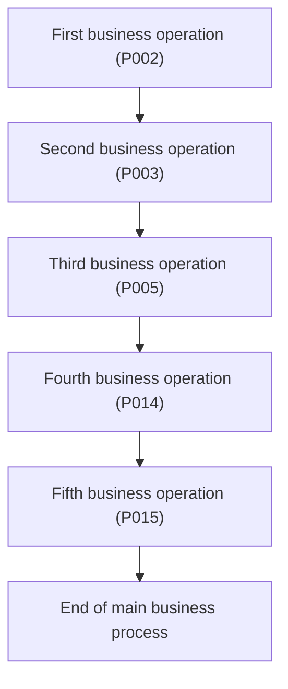

<SwmSnippet path="/base/src/LGAPDB01.cbl" line="31" repo-id="Z2l0aHViJTNBJTNBa3luZHJ5bC1jaWNzLWdlbmFwcCUzQSUzQVN3aW1tLURlbW8=">

---

After <SwmToken path="/base/src/LGAPDB01.cbl" pos="33:3:3" line-data="           PERFORM P003" repo-id="Z2l0aHViJTNBJTNBa3luZHJ5bC1jaWNzLWdlbmFwcCUzQSUzQVN3aW1tLURlbW8=" repo-name="kyndryl-cics-genapp">`P003`</SwmToken>, <SwmToken path="/base/src/LGAPDB01.cbl" pos="31:1:1" line-data="       P001." repo-id="Z2l0aHViJTNBJTNBa3luZHJ5bC1jaWNzLWdlbmFwcCUzQSUzQVN3aW1tLURlbW8=" repo-name="kyndryl-cics-genapp">`P001`</SwmToken> calls <SwmToken path="/base/src/LGAPDB01.cbl" pos="34:3:3" line-data="           PERFORM P005" repo-id="Z2l0aHViJTNBJTNBa3luZHJ5bC1jaWNzLWdlbmFwcCUzQSUzQVN3aW1tLURlbW8=" repo-name="kyndryl-cics-genapp">`P005`</SwmToken> to start the main record processing loop.

```cobol
       P001.
           PERFORM P002
           PERFORM P003
           PERFORM P005
           PERFORM P014
           PERFORM P015
           STOP RUN.
```

---

</SwmSnippet>

## Input Record Reading and Loop Control

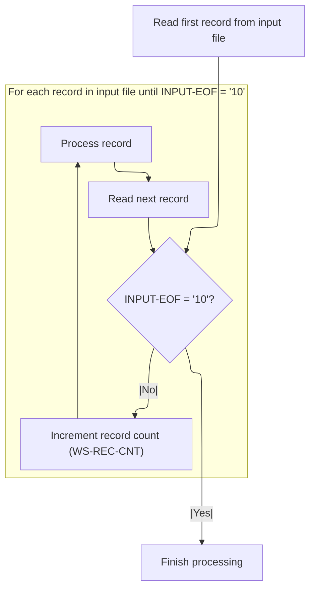

<SwmSnippet path="/base/src/LGAPDB01.cbl" line="74" repo-id="Z2l0aHViJTNBJTNBa3luZHJ5bC1jaWNzLWdlbmFwcCUzQSUzQVN3aW1tLURlbW8=">

---

In <SwmToken path="/base/src/LGAPDB01.cbl" pos="74:1:1" line-data="       P005." repo-id="Z2l0aHViJTNBJTNBa3luZHJ5bC1jaWNzLWdlbmFwcCUzQSUzQVN3aW1tLURlbW8=" repo-name="kyndryl-cics-genapp">`P005`</SwmToken>, we start by reading the first input record with <SwmToken path="/base/src/LGAPDB01.cbl" pos="75:3:3" line-data="           PERFORM P006" repo-id="Z2l0aHViJTNBJTNBa3luZHJ5bC1jaWNzLWdlbmFwcCUzQSUzQVN3aW1tLURlbW8=" repo-name="kyndryl-cics-genapp">`P006`</SwmToken>. This sets up the loop so we know if there's anything to process before we start counting and handling records.

```cobol
       P005.
           PERFORM P006
```

---

</SwmSnippet>

<SwmSnippet path="/base/src/LGAPDB01.cbl" line="82" repo-id="Z2l0aHViJTNBJTNBa3luZHJ5bC1jaWNzLWdlbmFwcCUzQSUzQVN3aW1tLURlbW8=">

---

<SwmToken path="/base/src/LGAPDB01.cbl" pos="82:1:1" line-data="       P006." repo-id="Z2l0aHViJTNBJTNBa3luZHJ5bC1jaWNzLWdlbmFwcCUzQSUzQVN3aW1tLURlbW8=" repo-name="kyndryl-cics-genapp">`P006`</SwmToken> reads the next input record and sets EOF if we're done.

```cobol
       P006.
           READ INPUT-FILE
           END-READ.
```

---

</SwmSnippet>

<SwmSnippet path="/base/src/LGAPDB01.cbl" line="76" repo-id="Z2l0aHViJTNBJTNBa3luZHJ5bC1jaWNzLWdlbmFwcCUzQSUzQVN3aW1tLURlbW8=">

---

Back in <SwmToken path="/base/src/LGAPDB01.cbl" pos="34:3:3" line-data="           PERFORM P005" repo-id="Z2l0aHViJTNBJTNBa3luZHJ5bC1jaWNzLWdlbmFwcCUzQSUzQVN3aW1tLURlbW8=" repo-name="kyndryl-cics-genapp">`P005`</SwmToken>, after reading a record, we increment the record count and call <SwmToken path="/base/src/LGAPDB01.cbl" pos="78:3:3" line-data="               PERFORM P007" repo-id="Z2l0aHViJTNBJTNBa3luZHJ5bC1jaWNzLWdlbmFwcCUzQSUzQVN3aW1tLURlbW8=" repo-name="kyndryl-cics-genapp">`P007`</SwmToken> to process or validate the record. This is where the main logic for each input happens before moving to the next record.

```cobol
           PERFORM UNTIL INPUT-EOF
               ADD 1 TO WS-REC-CNT
               PERFORM P007
               PERFORM P006
           END-PERFORM.
```

---

</SwmSnippet>

## Record Validation and Routing

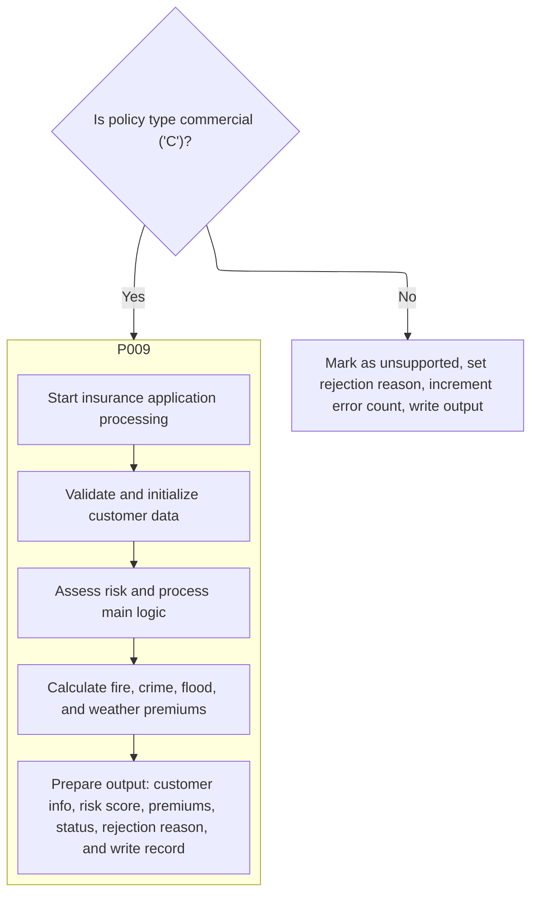

<SwmSnippet path="/base/src/LGAPDB01.cbl" line="86" repo-id="Z2l0aHViJTNBJTNBa3luZHJ5bC1jaWNzLWdlbmFwcCUzQSUzQVN3aW1tLURlbW8=">

---

In <SwmToken path="/base/src/LGAPDB01.cbl" pos="86:1:1" line-data="       P007." repo-id="Z2l0aHViJTNBJTNBa3luZHJ5bC1jaWNzLWdlbmFwcCUzQSUzQVN3aW1tLURlbW8=" repo-name="kyndryl-cics-genapp">`P007`</SwmToken>, we check the policy type. If it's 'C', we process the record further by calling <SwmToken path="/base/src/LGAPDB01.cbl" pos="88:3:3" line-data="               PERFORM P009" repo-id="Z2l0aHViJTNBJTNBa3luZHJ5bC1jaWNzLWdlbmFwcCUzQSUzQVN3aW1tLURlbW8=" repo-name="kyndryl-cics-genapp">`P009`</SwmToken> and increment the processed count. If not, we call <SwmToken path="/base/src/LGAPDB01.cbl" pos="91:3:3" line-data="               PERFORM P008" repo-id="Z2l0aHViJTNBJTNBa3luZHJ5bC1jaWNzLWdlbmFwcCUzQSUzQVN3aW1tLURlbW8=" repo-name="kyndryl-cics-genapp">`P008`</SwmToken> and bump the error count instead.

```cobol
       P007.
           IF IN-POLICY-TYPE = 'C'
               PERFORM P009
               ADD 1 TO WS-PROC-CNT
           ELSE
               PERFORM P008
               ADD 1 TO WS-ERR-CNT
           END-IF.
```

---

</SwmSnippet>

### Chained Processing for Valid Records

```mermaid
%%{init: {"flowchart": {"defaultRenderer": "elk"}} }%%
flowchart TD
    node1["Start insurance application processing"] --> node2["Validate and initialize customer data"]
    click node1 openCode "base/src/LGAPDB01.cbl:109:113"
    node2 --> node3["Assess risk and process main logic"]
    click node2 openCode "base/src/LGAPDB01.cbl:115:125"
    node3 --> node4["Calculate fire, crime, flood, and weather premiums"]
    click node3 openCode "base/src/LGAPDB03.cbl:42:92"
    node4 --> node5["Prepare output: customer info, risk score, premiums, status, rejection reason, and write record"]
    click node4 openCode "base/src/LGAPDB03.cbl:92:125"
    click node5 openCode "base/src/LGAPDB01.cbl:128:140"


subgraph node2 [P010]
  sgmain_1_node1["Assess property risk (type, postcode)"] --> sgmain_1_node2["Calculate risk score"]
  click sgmain_1_node1 openCode "base/src/LGAPDB01.cbl:115:117"
  sgmain_1_node2["Calculate risk score"] --> sgmain_1_node3["Calculate premiums (peril risks, risk score)"]
  click sgmain_1_node2 openCode "base/src/LGAPDB02.cbl:24:56"
  sgmain_1_node3["Calculate premiums (peril risks, risk score)"] --> sgmain_1_node4["Output premium quote and discount factor"]
  click sgmain_1_node3 openCode "base/src/LGAPDB02.cbl:56:118"
  click sgmain_1_node4 openCode "base/src/LGAPDB01.cbl:119:123"
end

subgraph node3 [MAIN-LOGIC]
  sgmain_2_node1["Gather risk factors"] --> sgmain_2_node2{"Risk score decision"}
  click sgmain_2_node1 openCode "base/src/LGAPDB03.cbl:43:43"
  sgmain_2_node2 -->|"> 200: Rejected (Manual Review Required)"| sgmain_2_node3["Calculate premiums"]
  sgmain_2_node2 -->|"151-200: Pending (Pending Review)"| sgmain_2_node3
  sgmain_2_node2 -->|"<= 150: Approved"| sgmain_2_node3
  click sgmain_2_node2 openCode "base/src/LGAPDB03.cbl:73:90"
  click sgmain_2_node3 openCode "base/src/LGAPDB03.cbl:45:45"
end

%% Swimm:
%% %%{init: {"flowchart": {"defaultRenderer": "elk"}} }%%
%% flowchart TD
%%     node1["Start insurance application processing"] --> node2["Validate and initialize customer data"]
%%     click node1 openCode "<SwmPath repo-id="Z2l0aHViJTNBJTNBa3luZHJ5bC1jaWNzLWdlbmFwcCUzQSUzQVN3aW1tLURlbW8=" repo-name="kyndryl-cics-genapp" path="/base/src/LGAPDB01.cbl">`(kyndryl-cics-genapp) base/src/LGAPDB01.cbl`</SwmPath>:109:113"
%%     node2 --> node3["Assess risk and process main logic"]
%%     click node2 openCode "<SwmPath repo-id="Z2l0aHViJTNBJTNBa3luZHJ5bC1jaWNzLWdlbmFwcCUzQSUzQVN3aW1tLURlbW8=" repo-name="kyndryl-cics-genapp" path="/base/src/LGAPDB01.cbl">`(kyndryl-cics-genapp) base/src/LGAPDB01.cbl`</SwmPath>:115:125"
%%     node3 --> node4["Calculate fire, crime, flood, and weather premiums"]
%%     click node3 openCode "<SwmPath repo-id="Z2l0aHViJTNBJTNBa3luZHJ5bC1jaWNzLWdlbmFwcCUzQSUzQVN3aW1tLURlbW8=" repo-name="kyndryl-cics-genapp" path="/base/src/LGAPDB03.cbl">`(kyndryl-cics-genapp) base/src/LGAPDB03.cbl`</SwmPath>:42:92"
%%     node4 --> node5["Prepare output: customer info, risk score, premiums, status, rejection reason, and write record"]
%%     click node4 openCode "<SwmPath repo-id="Z2l0aHViJTNBJTNBa3luZHJ5bC1jaWNzLWdlbmFwcCUzQSUzQVN3aW1tLURlbW8=" repo-name="kyndryl-cics-genapp" path="/base/src/LGAPDB03.cbl">`(kyndryl-cics-genapp) base/src/LGAPDB03.cbl`</SwmPath>:92:125"
%%     click node5 openCode "<SwmPath repo-id="Z2l0aHViJTNBJTNBa3luZHJ5bC1jaWNzLWdlbmFwcCUzQSUzQVN3aW1tLURlbW8=" repo-name="kyndryl-cics-genapp" path="/base/src/LGAPDB01.cbl">`(kyndryl-cics-genapp) base/src/LGAPDB01.cbl`</SwmPath>:128:140"
%% 
%% 
%% subgraph node2 [<SwmToken path="/base/src/LGAPDB01.cbl" pos="110:3:3" line-data="           PERFORM P010" repo-id="Z2l0aHViJTNBJTNBa3luZHJ5bC1jaWNzLWdlbmFwcCUzQSUzQVN3aW1tLURlbW8=" repo-name="kyndryl-cics-genapp">`P010`</SwmToken>]
%%   sgmain_1_node1["Assess property risk (type, postcode)"] --> sgmain_1_node2["Calculate risk score"]
%%   click sgmain_1_node1 openCode "<SwmPath repo-id="Z2l0aHViJTNBJTNBa3luZHJ5bC1jaWNzLWdlbmFwcCUzQSUzQVN3aW1tLURlbW8=" repo-name="kyndryl-cics-genapp" path="/base/src/LGAPDB01.cbl">`(kyndryl-cics-genapp) base/src/LGAPDB01.cbl`</SwmPath>:115:117"
%%   sgmain_1_node2["Calculate risk score"] --> sgmain_1_node3["Calculate premiums (peril risks, risk score)"]
%%   click sgmain_1_node2 openCode "<SwmPath repo-id="Z2l0aHViJTNBJTNBa3luZHJ5bC1jaWNzLWdlbmFwcCUzQSUzQVN3aW1tLURlbW8=" repo-name="kyndryl-cics-genapp" path="/base/src/LGAPDB02.cbl">`(kyndryl-cics-genapp) base/src/LGAPDB02.cbl`</SwmPath>:24:56"
%%   sgmain_1_node3["Calculate premiums (peril risks, risk score)"] --> sgmain_1_node4["Output premium quote and discount factor"]
%%   click sgmain_1_node3 openCode "<SwmPath repo-id="Z2l0aHViJTNBJTNBa3luZHJ5bC1jaWNzLWdlbmFwcCUzQSUzQVN3aW1tLURlbW8=" repo-name="kyndryl-cics-genapp" path="/base/src/LGAPDB02.cbl">`(kyndryl-cics-genapp) base/src/LGAPDB02.cbl`</SwmPath>:56:118"
%%   click sgmain_1_node4 openCode "<SwmPath repo-id="Z2l0aHViJTNBJTNBa3luZHJ5bC1jaWNzLWdlbmFwcCUzQSUzQVN3aW1tLURlbW8=" repo-name="kyndryl-cics-genapp" path="/base/src/LGAPDB01.cbl">`(kyndryl-cics-genapp) base/src/LGAPDB01.cbl`</SwmPath>:119:123"
%% end
%% 
%% subgraph node3 [<SwmToken path="/base/src/LGAPDB02.cbl" pos="26:1:3" line-data="       MAIN-LOGIC." repo-id="Z2l0aHViJTNBJTNBa3luZHJ5bC1jaWNzLWdlbmFwcCUzQSUzQVN3aW1tLURlbW8=" repo-name="kyndryl-cics-genapp">`MAIN-LOGIC`</SwmToken>]
%%   sgmain_2_node1["Gather risk factors"] --> sgmain_2_node2{"Risk score decision"}
%%   click sgmain_2_node1 openCode "<SwmPath repo-id="Z2l0aHViJTNBJTNBa3luZHJ5bC1jaWNzLWdlbmFwcCUzQSUzQVN3aW1tLURlbW8=" repo-name="kyndryl-cics-genapp" path="/base/src/LGAPDB03.cbl">`(kyndryl-cics-genapp) base/src/LGAPDB03.cbl`</SwmPath>:43:43"
%%   sgmain_2_node2 -->|"> 200: Rejected (Manual Review Required)"| sgmain_2_node3["Calculate premiums"]
%%   sgmain_2_node2 -->|"151-200: Pending (Pending Review)"| sgmain_2_node3
%%   sgmain_2_node2 -->|"<= 150: Approved"| sgmain_2_node3
%%   click sgmain_2_node2 openCode "<SwmPath repo-id="Z2l0aHViJTNBJTNBa3luZHJ5bC1jaWNzLWdlbmFwcCUzQSUzQVN3aW1tLURlbW8=" repo-name="kyndryl-cics-genapp" path="/base/src/LGAPDB03.cbl">`(kyndryl-cics-genapp) base/src/LGAPDB03.cbl`</SwmPath>:73:90"
%%   click sgmain_2_node3 openCode "<SwmPath repo-id="Z2l0aHViJTNBJTNBa3luZHJ5bC1jaWNzLWdlbmFwcCUzQSUzQVN3aW1tLURlbW8=" repo-name="kyndryl-cics-genapp" path="/base/src/LGAPDB03.cbl">`(kyndryl-cics-genapp) base/src/LGAPDB03.cbl`</SwmPath>:45:45"
%% end
```

<SwmSnippet path="/base/src/LGAPDB01.cbl" line="109" repo-id="Z2l0aHViJTNBJTNBa3luZHJ5bC1jaWNzLWdlbmFwcCUzQSUzQVN3aW1tLURlbW8=">

---

<SwmToken path="/base/src/LGAPDB01.cbl" pos="109:1:1" line-data="       P009." repo-id="Z2l0aHViJTNBJTNBa3luZHJ5bC1jaWNzLWdlbmFwcCUzQSUzQVN3aW1tLURlbW8=" repo-name="kyndryl-cics-genapp">`P009`</SwmToken> chains together multiple processing steps, starting with <SwmToken path="/base/src/LGAPDB01.cbl" pos="110:3:3" line-data="           PERFORM P010" repo-id="Z2l0aHViJTNBJTNBa3luZHJ5bC1jaWNzLWdlbmFwcCUzQSUzQVN3aW1tLURlbW8=" repo-name="kyndryl-cics-genapp">`P010`</SwmToken>.

```cobol
       P009.
           PERFORM P010
           PERFORM P011
           PERFORM P012
           PERFORM P013.
```

---

</SwmSnippet>

#### Risk and Premium Calculation Calls

```mermaid
%%{init: {"flowchart": {"defaultRenderer": "elk"}} }%%
flowchart TD
    node1["Assess property risk (type, postcode)"] --> node2["Calculate risk score"]
    click node1 openCode "base/src/LGAPDB01.cbl:115:117"
    node2["Calculate risk score"] --> node3["Calculate premiums (peril risks, risk score)"]
    click node2 openCode "base/src/LGAPDB02.cbl:24:56"
    node3["Calculate premiums (peril risks, risk score)"] --> node4["Output premium quote and discount factor"]
    click node3 openCode "base/src/LGAPDB02.cbl:56:118"
    click node4 openCode "base/src/LGAPDB01.cbl:119:123"


subgraph node2 [PROCEDURE-DIVISION]
  sgmain_1_node1["Start risk assessment (Input: Property Type, Postcode)"] --> sgmain_1_node2["Gather risk factors for property"]
  click sgmain_1_node1 openCode "base/src/LGAPDB02.cbl:24:29"
  sgmain_1_node2 --> sgmain_1_node3["Calculate risk score (Output: Risk Score)"]
  click sgmain_1_node2 openCode "base/src/LGAPDB02.cbl:31:31"
  click sgmain_1_node3 openCode "base/src/LGAPDB02.cbl:24:29"
end

subgraph node3 [CALCULATE-RISK-SCORE]
  sgmain_2_node1["Set LK-RISK-SCORE to 100"] --> sgmain_2_node2{"LK-PROPERTY-TYPE?"}
  click sgmain_2_node1 openCode "base/src/LGAPDB02.cbl:57:57"
  sgmain_2_node2 -->|"WAREHOUSE (+50)"| sgmain_2_node3["Add to LK-RISK-SCORE"]
  sgmain_2_node2 -->|"FACTORY (+75)"| sgmain_2_node3
  sgmain_2_node2 -->|"OFFICE (+25)"| sgmain_2_node3
  sgmain_2_node2 -->|"RETAIL (+40)"| sgmain_2_node3
  sgmain_2_node2 -->|"OTHER (+30)"| sgmain_2_node3
  click sgmain_2_node2 openCode "base/src/LGAPDB02.cbl:59:70"
  click sgmain_2_node3 openCode "base/src/LGAPDB02.cbl:61:69"
  sgmain_2_node3 --> sgmain_2_node4{"LK-POSTCODE starts with 'FL' or 'CR'?"}
  click sgmain_2_node4 openCode "base/src/LGAPDB02.cbl:72:74"
  sgmain_2_node4 -->|"Yes (+30)"| sgmain_2_node5["Add to LK-RISK-SCORE and return"]
  sgmain_2_node4 -->|"No"| sgmain_2_node6["Return LK-RISK-SCORE"]
  click sgmain_2_node5 openCode "base/src/LGAPDB02.cbl:74:75"
  click sgmain_2_node6 openCode "base/src/LGAPDB02.cbl:75:75"
end

%% Swimm:
%% %%{init: {"flowchart": {"defaultRenderer": "elk"}} }%%
%% flowchart TD
%%     node1["Assess property risk (type, postcode)"] --> node2["Calculate risk score"]
%%     click node1 openCode "<SwmPath repo-id="Z2l0aHViJTNBJTNBa3luZHJ5bC1jaWNzLWdlbmFwcCUzQSUzQVN3aW1tLURlbW8=" repo-name="kyndryl-cics-genapp" path="/base/src/LGAPDB01.cbl">`(kyndryl-cics-genapp) base/src/LGAPDB01.cbl`</SwmPath>:115:117"
%%     node2["Calculate risk score"] --> node3["Calculate premiums (peril risks, risk score)"]
%%     click node2 openCode "<SwmPath repo-id="Z2l0aHViJTNBJTNBa3luZHJ5bC1jaWNzLWdlbmFwcCUzQSUzQVN3aW1tLURlbW8=" repo-name="kyndryl-cics-genapp" path="/base/src/LGAPDB02.cbl">`(kyndryl-cics-genapp) base/src/LGAPDB02.cbl`</SwmPath>:24:56"
%%     node3["Calculate premiums (peril risks, risk score)"] --> node4["Output premium quote and discount factor"]
%%     click node3 openCode "<SwmPath repo-id="Z2l0aHViJTNBJTNBa3luZHJ5bC1jaWNzLWdlbmFwcCUzQSUzQVN3aW1tLURlbW8=" repo-name="kyndryl-cics-genapp" path="/base/src/LGAPDB02.cbl">`(kyndryl-cics-genapp) base/src/LGAPDB02.cbl`</SwmPath>:56:118"
%%     click node4 openCode "<SwmPath repo-id="Z2l0aHViJTNBJTNBa3luZHJ5bC1jaWNzLWdlbmFwcCUzQSUzQVN3aW1tLURlbW8=" repo-name="kyndryl-cics-genapp" path="/base/src/LGAPDB01.cbl">`(kyndryl-cics-genapp) base/src/LGAPDB01.cbl`</SwmPath>:119:123"
%% 
%% 
%% subgraph node2 [PROCEDURE-DIVISION]
%%   sgmain_1_node1["Start risk assessment (Input: Property Type, Postcode)"] --> sgmain_1_node2["Gather risk factors for property"]
%%   click sgmain_1_node1 openCode "<SwmPath repo-id="Z2l0aHViJTNBJTNBa3luZHJ5bC1jaWNzLWdlbmFwcCUzQSUzQVN3aW1tLURlbW8=" repo-name="kyndryl-cics-genapp" path="/base/src/LGAPDB02.cbl">`(kyndryl-cics-genapp) base/src/LGAPDB02.cbl`</SwmPath>:24:29"
%%   sgmain_1_node2 --> sgmain_1_node3["Calculate risk score (Output: Risk Score)"]
%%   click sgmain_1_node2 openCode "<SwmPath repo-id="Z2l0aHViJTNBJTNBa3luZHJ5bC1jaWNzLWdlbmFwcCUzQSUzQVN3aW1tLURlbW8=" repo-name="kyndryl-cics-genapp" path="/base/src/LGAPDB02.cbl">`(kyndryl-cics-genapp) base/src/LGAPDB02.cbl`</SwmPath>:31:31"
%%   click sgmain_1_node3 openCode "<SwmPath repo-id="Z2l0aHViJTNBJTNBa3luZHJ5bC1jaWNzLWdlbmFwcCUzQSUzQVN3aW1tLURlbW8=" repo-name="kyndryl-cics-genapp" path="/base/src/LGAPDB02.cbl">`(kyndryl-cics-genapp) base/src/LGAPDB02.cbl`</SwmPath>:24:29"
%% end
%% 
%% subgraph node3 [<SwmToken path="/base/src/LGAPDB02.cbl" pos="28:3:7" line-data="           PERFORM CALCULATE-RISK-SCORE" repo-id="Z2l0aHViJTNBJTNBa3luZHJ5bC1jaWNzLWdlbmFwcCUzQSUzQVN3aW1tLURlbW8=" repo-name="kyndryl-cics-genapp">`CALCULATE-RISK-SCORE`</SwmToken>]
%%   sgmain_2_node1["Set <SwmToken path="/base/src/LGAPDB02.cbl" pos="24:19:23" line-data="       PROCEDURE DIVISION USING LK-PROPERTY-TYPE, LK-POSTCODE, LK-RISK-SCORE." repo-id="Z2l0aHViJTNBJTNBa3luZHJ5bC1jaWNzLWdlbmFwcCUzQSUzQVN3aW1tLURlbW8=" repo-name="kyndryl-cics-genapp">`LK-RISK-SCORE`</SwmToken> to 100"] --> sgmain_2_node2{"<SwmToken path="/base/src/LGAPDB02.cbl" pos="24:7:11" line-data="       PROCEDURE DIVISION USING LK-PROPERTY-TYPE, LK-POSTCODE, LK-RISK-SCORE." repo-id="Z2l0aHViJTNBJTNBa3luZHJ5bC1jaWNzLWdlbmFwcCUzQSUzQVN3aW1tLURlbW8=" repo-name="kyndryl-cics-genapp">`LK-PROPERTY-TYPE`</SwmToken>?"}
%%   click sgmain_2_node1 openCode "<SwmPath repo-id="Z2l0aHViJTNBJTNBa3luZHJ5bC1jaWNzLWdlbmFwcCUzQSUzQVN3aW1tLURlbW8=" repo-name="kyndryl-cics-genapp" path="/base/src/LGAPDB02.cbl">`(kyndryl-cics-genapp) base/src/LGAPDB02.cbl`</SwmPath>:57:57"
%%   sgmain_2_node2 -->|"WAREHOUSE (+50)"| sgmain_2_node3["Add to <SwmToken path="/base/src/LGAPDB02.cbl" pos="24:19:23" line-data="       PROCEDURE DIVISION USING LK-PROPERTY-TYPE, LK-POSTCODE, LK-RISK-SCORE." repo-id="Z2l0aHViJTNBJTNBa3luZHJ5bC1jaWNzLWdlbmFwcCUzQSUzQVN3aW1tLURlbW8=" repo-name="kyndryl-cics-genapp">`LK-RISK-SCORE`</SwmToken>"]
%%   sgmain_2_node2 -->|"FACTORY (+75)"| sgmain_2_node3
%%   sgmain_2_node2 -->|"OFFICE (+25)"| sgmain_2_node3
%%   sgmain_2_node2 -->|"RETAIL (+40)"| sgmain_2_node3
%%   sgmain_2_node2 -->|"OTHER (+30)"| sgmain_2_node3
%%   click sgmain_2_node2 openCode "<SwmPath repo-id="Z2l0aHViJTNBJTNBa3luZHJ5bC1jaWNzLWdlbmFwcCUzQSUzQVN3aW1tLURlbW8=" repo-name="kyndryl-cics-genapp" path="/base/src/LGAPDB02.cbl">`(kyndryl-cics-genapp) base/src/LGAPDB02.cbl`</SwmPath>:59:70"
%%   click sgmain_2_node3 openCode "<SwmPath repo-id="Z2l0aHViJTNBJTNBa3luZHJ5bC1jaWNzLWdlbmFwcCUzQSUzQVN3aW1tLURlbW8=" repo-name="kyndryl-cics-genapp" path="/base/src/LGAPDB02.cbl">`(kyndryl-cics-genapp) base/src/LGAPDB02.cbl`</SwmPath>:61:69"
%%   sgmain_2_node3 --> sgmain_2_node4{"<SwmToken path="/base/src/LGAPDB02.cbl" pos="24:14:16" line-data="       PROCEDURE DIVISION USING LK-PROPERTY-TYPE, LK-POSTCODE, LK-RISK-SCORE." repo-id="Z2l0aHViJTNBJTNBa3luZHJ5bC1jaWNzLWdlbmFwcCUzQSUzQVN3aW1tLURlbW8=" repo-name="kyndryl-cics-genapp">`LK-POSTCODE`</SwmToken> starts with 'FL' or 'CR'?"}
%%   click sgmain_2_node4 openCode "<SwmPath repo-id="Z2l0aHViJTNBJTNBa3luZHJ5bC1jaWNzLWdlbmFwcCUzQSUzQVN3aW1tLURlbW8=" repo-name="kyndryl-cics-genapp" path="/base/src/LGAPDB02.cbl">`(kyndryl-cics-genapp) base/src/LGAPDB02.cbl`</SwmPath>:72:74"
%%   sgmain_2_node4 -->|"Yes (+30)"| sgmain_2_node5["Add to <SwmToken path="/base/src/LGAPDB02.cbl" pos="24:19:23" line-data="       PROCEDURE DIVISION USING LK-PROPERTY-TYPE, LK-POSTCODE, LK-RISK-SCORE." repo-id="Z2l0aHViJTNBJTNBa3luZHJ5bC1jaWNzLWdlbmFwcCUzQSUzQVN3aW1tLURlbW8=" repo-name="kyndryl-cics-genapp">`LK-RISK-SCORE`</SwmToken> and return"]
%%   sgmain_2_node4 -->|"No"| sgmain_2_node6["Return <SwmToken path="/base/src/LGAPDB02.cbl" pos="24:19:23" line-data="       PROCEDURE DIVISION USING LK-PROPERTY-TYPE, LK-POSTCODE, LK-RISK-SCORE." repo-id="Z2l0aHViJTNBJTNBa3luZHJ5bC1jaWNzLWdlbmFwcCUzQSUzQVN3aW1tLURlbW8=" repo-name="kyndryl-cics-genapp">`LK-RISK-SCORE`</SwmToken>"]
%%   click sgmain_2_node5 openCode "<SwmPath repo-id="Z2l0aHViJTNBJTNBa3luZHJ5bC1jaWNzLWdlbmFwcCUzQSUzQVN3aW1tLURlbW8=" repo-name="kyndryl-cics-genapp" path="/base/src/LGAPDB02.cbl">`(kyndryl-cics-genapp) base/src/LGAPDB02.cbl`</SwmPath>:74:75"
%%   click sgmain_2_node6 openCode "<SwmPath repo-id="Z2l0aHViJTNBJTNBa3luZHJ5bC1jaWNzLWdlbmFwcCUzQSUzQVN3aW1tLURlbW8=" repo-name="kyndryl-cics-genapp" path="/base/src/LGAPDB02.cbl">`(kyndryl-cics-genapp) base/src/LGAPDB02.cbl`</SwmPath>:75:75"
%% end
```

<SwmSnippet path="/base/src/LGAPDB01.cbl" line="115" repo-id="Z2l0aHViJTNBJTNBa3luZHJ5bC1jaWNzLWdlbmFwcCUzQSUzQVN3aW1tLURlbW8=">

---

In <SwmToken path="/base/src/LGAPDB01.cbl" pos="115:1:1" line-data="       P010." repo-id="Z2l0aHViJTNBJTNBa3luZHJ5bC1jaWNzLWdlbmFwcCUzQSUzQVN3aW1tLURlbW8=" repo-name="kyndryl-cics-genapp">`P010`</SwmToken>, we call <SwmToken path="/base/src/LGAPDB01.cbl" pos="116:4:4" line-data="           CALL &#39;LGAPDB02&#39; USING IN-PROPERTY-TYPE, IN-POSTCODE, WS-RISK-SCR." repo-id="Z2l0aHViJTNBJTNBa3luZHJ5bC1jaWNzLWdlbmFwcCUzQSUzQVN3aW1tLURlbW8=" repo-name="kyndryl-cics-genapp">`LGAPDB02`</SwmToken> to get the risk score for the current record using property type and postcode. This score is needed for the next step, which calculates premiums and verdicts.

```cobol
       P010.
           CALL 'LGAPDB02' USING IN-PROPERTY-TYPE, IN-POSTCODE, WS-RISK-SCR.

       P011.
           CALL 'LGAPDB03' USING WS-RISK-SCR, IN-FIRE-PERIL, IN-CRIME-PERIL,
                                IN-FLOOD-PERIL, IN-WEATHER-PERIL, WS-STAT,
                                WS-STAT-DESC, WS-REJ-RSN, WS-FR-PREM,
                                WS-CR-PREM, WS-FL-PREM, WS-WE-PREM,
                                WS-TOT-PREM, WS-DISC-FACT.
```

---

</SwmSnippet>

##### Risk Score Calculation Orchestration

```mermaid
%%{init: {"flowchart": {"defaultRenderer": "elk"}} }%%
flowchart TD
    node1["Start risk assessment (Input: Property Type, Postcode)"] --> node2["Gather risk factors for property"]
    click node1 openCode "base/src/LGAPDB02.cbl:24:29"
    node2 --> node3["Calculate risk score (Output: Risk Score)"]
    click node2 openCode "base/src/LGAPDB02.cbl:31:31"
    click node3 openCode "base/src/LGAPDB02.cbl:24:29"


subgraph node2 [GET-RISK-FACTORS]
  sgmain_1_node1["Determine FIRE risk factor"]
  click sgmain_1_node1 openCode "base/src/LGAPDB02.cbl:32:36"
  sgmain_1_node1 --> sgmain_1_node2{"FIRE factor found in database?"}
  click sgmain_1_node2 openCode "base/src/LGAPDB02.cbl:38:42"
  sgmain_1_node2 -->|"Yes"| sgmain_1_node3["Set FIRE factor from database"]
  click sgmain_1_node3 openCode "base/src/LGAPDB02.cbl:38:39"
  sgmain_1_node2 -->|"No"| sgmain_1_node4["Set FIRE factor to 0.80"]
  click sgmain_1_node4 openCode "base/src/LGAPDB02.cbl:41:41"
  sgmain_1_node3 --> sgmain_1_node5["Determine CRIME risk factor"]
  click sgmain_1_node5 openCode "base/src/LGAPDB02.cbl:44:48"
  sgmain_1_node4 --> sgmain_1_node5
  sgmain_1_node5 --> sgmain_1_node6{"CRIME factor found in database?"}
  click sgmain_1_node6 openCode "base/src/LGAPDB02.cbl:50:54"
  sgmain_1_node6 -->|"Yes"| sgmain_1_node7["Set CRIME factor from database"]
  click sgmain_1_node7 openCode "base/src/LGAPDB02.cbl:51:51"
  sgmain_1_node6 -->|"No"| sgmain_1_node8["Set CRIME factor to 0.60"]
  click sgmain_1_node8 openCode "base/src/LGAPDB02.cbl:53:53"
end

%% Swimm:
%% %%{init: {"flowchart": {"defaultRenderer": "elk"}} }%%
%% flowchart TD
%%     node1["Start risk assessment (Input: Property Type, Postcode)"] --> node2["Gather risk factors for property"]
%%     click node1 openCode "<SwmPath repo-id="Z2l0aHViJTNBJTNBa3luZHJ5bC1jaWNzLWdlbmFwcCUzQSUzQVN3aW1tLURlbW8=" repo-name="kyndryl-cics-genapp" path="/base/src/LGAPDB02.cbl">`(kyndryl-cics-genapp) base/src/LGAPDB02.cbl`</SwmPath>:24:29"
%%     node2 --> node3["Calculate risk score (Output: Risk Score)"]
%%     click node2 openCode "<SwmPath repo-id="Z2l0aHViJTNBJTNBa3luZHJ5bC1jaWNzLWdlbmFwcCUzQSUzQVN3aW1tLURlbW8=" repo-name="kyndryl-cics-genapp" path="/base/src/LGAPDB02.cbl">`(kyndryl-cics-genapp) base/src/LGAPDB02.cbl`</SwmPath>:31:31"
%%     click node3 openCode "<SwmPath repo-id="Z2l0aHViJTNBJTNBa3luZHJ5bC1jaWNzLWdlbmFwcCUzQSUzQVN3aW1tLURlbW8=" repo-name="kyndryl-cics-genapp" path="/base/src/LGAPDB02.cbl">`(kyndryl-cics-genapp) base/src/LGAPDB02.cbl`</SwmPath>:24:29"
%% 
%% 
%% subgraph node2 [<SwmToken path="/base/src/LGAPDB02.cbl" pos="27:3:7" line-data="           PERFORM GET-RISK-FACTORS" repo-id="Z2l0aHViJTNBJTNBa3luZHJ5bC1jaWNzLWdlbmFwcCUzQSUzQVN3aW1tLURlbW8=" repo-name="kyndryl-cics-genapp">`GET-RISK-FACTORS`</SwmToken>]
%%   sgmain_1_node1["Determine FIRE risk factor"]
%%   click sgmain_1_node1 openCode "<SwmPath repo-id="Z2l0aHViJTNBJTNBa3luZHJ5bC1jaWNzLWdlbmFwcCUzQSUzQVN3aW1tLURlbW8=" repo-name="kyndryl-cics-genapp" path="/base/src/LGAPDB02.cbl">`(kyndryl-cics-genapp) base/src/LGAPDB02.cbl`</SwmPath>:32:36"
%%   sgmain_1_node1 --> sgmain_1_node2{"FIRE factor found in database?"}
%%   click sgmain_1_node2 openCode "<SwmPath repo-id="Z2l0aHViJTNBJTNBa3luZHJ5bC1jaWNzLWdlbmFwcCUzQSUzQVN3aW1tLURlbW8=" repo-name="kyndryl-cics-genapp" path="/base/src/LGAPDB02.cbl">`(kyndryl-cics-genapp) base/src/LGAPDB02.cbl`</SwmPath>:38:42"
%%   sgmain_1_node2 -->|"Yes"| sgmain_1_node3["Set FIRE factor from database"]
%%   click sgmain_1_node3 openCode "<SwmPath repo-id="Z2l0aHViJTNBJTNBa3luZHJ5bC1jaWNzLWdlbmFwcCUzQSUzQVN3aW1tLURlbW8=" repo-name="kyndryl-cics-genapp" path="/base/src/LGAPDB02.cbl">`(kyndryl-cics-genapp) base/src/LGAPDB02.cbl`</SwmPath>:38:39"
%%   sgmain_1_node2 -->|"No"| sgmain_1_node4["Set FIRE factor to <SwmToken path="/base/src/LGAPDB02.cbl" pos="41:3:5" line-data="               MOVE 0.80 TO WS-FIRE-FACTOR" repo-id="Z2l0aHViJTNBJTNBa3luZHJ5bC1jaWNzLWdlbmFwcCUzQSUzQVN3aW1tLURlbW8=" repo-name="kyndryl-cics-genapp">`0.80`</SwmToken>"]
%%   click sgmain_1_node4 openCode "<SwmPath repo-id="Z2l0aHViJTNBJTNBa3luZHJ5bC1jaWNzLWdlbmFwcCUzQSUzQVN3aW1tLURlbW8=" repo-name="kyndryl-cics-genapp" path="/base/src/LGAPDB02.cbl">`(kyndryl-cics-genapp) base/src/LGAPDB02.cbl`</SwmPath>:41:41"
%%   sgmain_1_node3 --> sgmain_1_node5["Determine CRIME risk factor"]
%%   click sgmain_1_node5 openCode "<SwmPath repo-id="Z2l0aHViJTNBJTNBa3luZHJ5bC1jaWNzLWdlbmFwcCUzQSUzQVN3aW1tLURlbW8=" repo-name="kyndryl-cics-genapp" path="/base/src/LGAPDB02.cbl">`(kyndryl-cics-genapp) base/src/LGAPDB02.cbl`</SwmPath>:44:48"
%%   sgmain_1_node4 --> sgmain_1_node5
%%   sgmain_1_node5 --> sgmain_1_node6{"CRIME factor found in database?"}
%%   click sgmain_1_node6 openCode "<SwmPath repo-id="Z2l0aHViJTNBJTNBa3luZHJ5bC1jaWNzLWdlbmFwcCUzQSUzQVN3aW1tLURlbW8=" repo-name="kyndryl-cics-genapp" path="/base/src/LGAPDB02.cbl">`(kyndryl-cics-genapp) base/src/LGAPDB02.cbl`</SwmPath>:50:54"
%%   sgmain_1_node6 -->|"Yes"| sgmain_1_node7["Set CRIME factor from database"]
%%   click sgmain_1_node7 openCode "<SwmPath repo-id="Z2l0aHViJTNBJTNBa3luZHJ5bC1jaWNzLWdlbmFwcCUzQSUzQVN3aW1tLURlbW8=" repo-name="kyndryl-cics-genapp" path="/base/src/LGAPDB02.cbl">`(kyndryl-cics-genapp) base/src/LGAPDB02.cbl`</SwmPath>:51:51"
%%   sgmain_1_node6 -->|"No"| sgmain_1_node8["Set CRIME factor to <SwmToken path="/base/src/LGAPDB02.cbl" pos="53:3:5" line-data="               MOVE 0.60 TO WS-CRIME-FACTOR" repo-id="Z2l0aHViJTNBJTNBa3luZHJ5bC1jaWNzLWdlbmFwcCUzQSUzQVN3aW1tLURlbW8=" repo-name="kyndryl-cics-genapp">`0.60`</SwmToken>"]
%%   click sgmain_1_node8 openCode "<SwmPath repo-id="Z2l0aHViJTNBJTNBa3luZHJ5bC1jaWNzLWdlbmFwcCUzQSUzQVN3aW1tLURlbW8=" repo-name="kyndryl-cics-genapp" path="/base/src/LGAPDB02.cbl">`(kyndryl-cics-genapp) base/src/LGAPDB02.cbl`</SwmPath>:53:53"
%% end
```

<SwmSnippet path="/base/src/LGAPDB02.cbl" line="24" repo-id="Z2l0aHViJTNBJTNBa3luZHJ5bC1jaWNzLWdlbmFwcCUzQSUzQVN3aW1tLURlbW8=">

---

In `PROCEDURE-DIVISION`, we first fetch risk factors using <SwmToken path="/base/src/LGAPDB02.cbl" pos="27:3:7" line-data="           PERFORM GET-RISK-FACTORS" repo-id="Z2l0aHViJTNBJTNBa3luZHJ5bC1jaWNzLWdlbmFwcCUzQSUzQVN3aW1tLURlbW8=" repo-name="kyndryl-cics-genapp">`GET-RISK-FACTORS`</SwmToken>. This is needed before calculating the risk score, since the calculation uses these factors.

```cobol
       PROCEDURE DIVISION USING LK-PROPERTY-TYPE, LK-POSTCODE, LK-RISK-SCORE.
       
       MAIN-LOGIC.
           PERFORM GET-RISK-FACTORS
           PERFORM CALCULATE-RISK-SCORE
           GOBACK.
```

---

</SwmSnippet>

###### Database Risk Factor Fetch

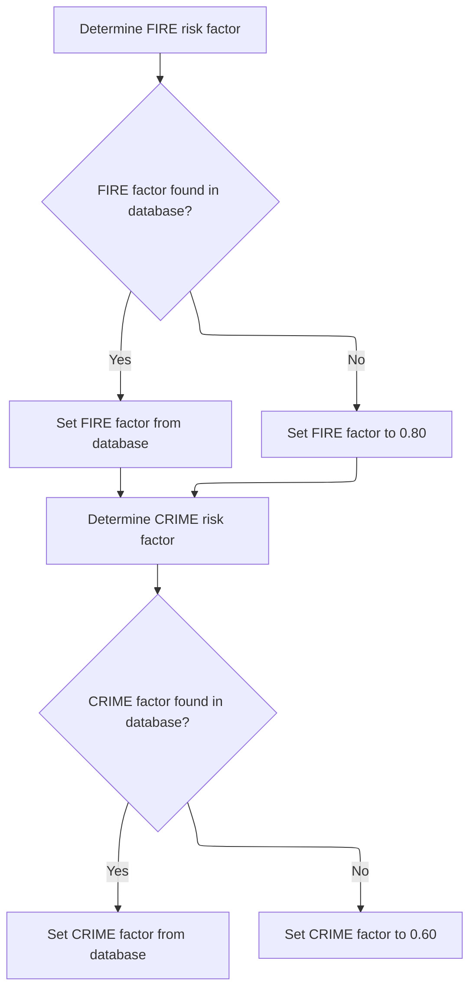

<SwmSnippet path="/base/src/LGAPDB02.cbl" line="31" repo-id="Z2l0aHViJTNBJTNBa3luZHJ5bC1jaWNzLWdlbmFwcCUzQSUzQVN3aW1tLURlbW8=">

---

After trying to fetch the FIRE risk factor, if the query fails, we just assign a default value. Then we move on to fetch the next risk factor.

```cobol
       GET-RISK-FACTORS.
           EXEC SQL
               SELECT FACTOR_VALUE INTO :WS-FIRE-FACTOR
               FROM RISK_FACTORS
               WHERE PERIL_TYPE = 'FIRE'
           END-EXEC.
```

---

</SwmSnippet>

<SwmSnippet path="/base/src/LGAPDB02.cbl" line="38" repo-id="Z2l0aHViJTNBJTNBa3luZHJ5bC1jaWNzLWdlbmFwcCUzQSUzQVN3aW1tLURlbW8=">

---

Right after handling FIRE, we run the same fetch for the CRIME risk factor. The logic is the same: try the DB, fall back to a default if needed.

```cobol
           IF SQLCODE = 0
               CONTINUE
           ELSE
               MOVE 0.80 TO WS-FIRE-FACTOR
           END-IF.
           
           EXEC SQL
               SELECT FACTOR_VALUE INTO :WS-CRIME-FACTOR
               FROM RISK_FACTORS
```

---

</SwmSnippet>

<SwmSnippet path="/base/src/LGAPDB02.cbl" line="47" repo-id="Z2l0aHViJTNBJTNBa3luZHJ5bC1jaWNzLWdlbmFwcCUzQSUzQVN3aW1tLURlbW8=">

---

After fetching both FIRE and CRIME risk factors (or using defaults), these values are ready for the risk score calculation that follows.

```cobol
               WHERE PERIL_TYPE = 'CRIME'
           END-EXEC.
           
           IF SQLCODE = 0
```

---

</SwmSnippet>

<SwmSnippet path="/base/src/LGAPDB02.cbl" line="51" repo-id="Z2l0aHViJTNBJTNBa3luZHJ5bC1jaWNzLWdlbmFwcCUzQSUzQVN3aW1tLURlbW8=">

---

Back in `PROCEDURE-DIVISION`, after getting the risk factors, we move on to <SwmToken path="/base/src/LGAPDB02.cbl" pos="28:3:7" line-data="           PERFORM CALCULATE-RISK-SCORE" repo-id="Z2l0aHViJTNBJTNBa3luZHJ5bC1jaWNzLWdlbmFwcCUzQSUzQVN3aW1tLURlbW8=" repo-name="kyndryl-cics-genapp">`CALCULATE-RISK-SCORE`</SwmToken>. This uses the factors we just fetched to compute the actual score.

```cobol
               CONTINUE
           ELSE
               MOVE 0.60 TO WS-CRIME-FACTOR
           END-IF.
```

---

</SwmSnippet>

###### Risk Score Computation Logic

<SwmSnippet path="/base/src/LGAPDB02.cbl" line="24" repo-id="Z2l0aHViJTNBJTNBa3luZHJ5bC1jaWNzLWdlbmFwcCUzQSUzQVN3aW1tLURlbW8=">

---

In <SwmToken path="/base/src/LGAPDB02.cbl" pos="28:3:7" line-data="           PERFORM CALCULATE-RISK-SCORE" repo-id="Z2l0aHViJTNBJTNBa3luZHJ5bC1jaWNzLWdlbmFwcCUzQSUzQVN3aW1tLURlbW8=" repo-name="kyndryl-cics-genapp">`CALCULATE-RISK-SCORE`</SwmToken>, we start with a base score and bump it up based on property type and postcode prefix. Each type and certain postcode patterns add a fixed amount to the score.

```cobol
       PROCEDURE DIVISION USING LK-PROPERTY-TYPE, LK-POSTCODE, LK-RISK-SCORE.
       
       MAIN-LOGIC.
           PERFORM GET-RISK-FACTORS
           PERFORM CALCULATE-RISK-SCORE
           GOBACK.
```

---

</SwmSnippet>

##### Risk Score Calculation Details

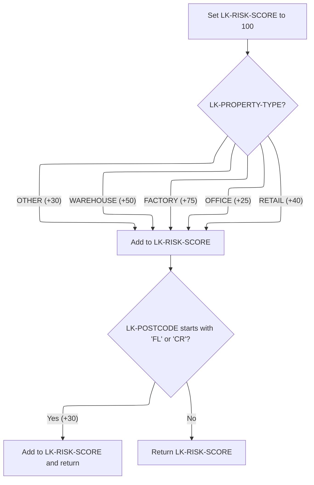

<SwmSnippet path="/base/src/LGAPDB02.cbl" line="56" repo-id="Z2l0aHViJTNBJTNBa3luZHJ5bC1jaWNzLWdlbmFwcCUzQSUzQVN3aW1tLURlbW8=">

---

Back in <SwmToken path="/base/src/LGAPDB01.cbl" pos="110:3:3" line-data="           PERFORM P010" repo-id="Z2l0aHViJTNBJTNBa3luZHJ5bC1jaWNzLWdlbmFwcCUzQSUzQVN3aW1tLURlbW8=" repo-name="kyndryl-cics-genapp">`P010`</SwmToken>, after getting the risk score from <SwmToken path="/base/src/LGAPDB01.cbl" pos="116:4:4" line-data="           CALL &#39;LGAPDB02&#39; USING IN-PROPERTY-TYPE, IN-POSTCODE, WS-RISK-SCR." repo-id="Z2l0aHViJTNBJTNBa3luZHJ5bC1jaWNzLWdlbmFwcCUzQSUzQVN3aW1tLURlbW8=" repo-name="kyndryl-cics-genapp">`LGAPDB02`</SwmToken>, we immediately call <SwmToken path="/base/src/LGAPDB01.cbl" pos="119:4:4" line-data="           CALL &#39;LGAPDB03&#39; USING WS-RISK-SCR, IN-FIRE-PERIL, IN-CRIME-PERIL," repo-id="Z2l0aHViJTNBJTNBa3luZHJ5bC1jaWNzLWdlbmFwcCUzQSUzQVN3aW1tLURlbW8=" repo-name="kyndryl-cics-genapp">`LGAPDB03`</SwmToken>. This uses the score to calculate premiums and other outputs for the record.

```cobol
       CALCULATE-RISK-SCORE.
           MOVE 100 TO LK-RISK-SCORE
```

---

</SwmSnippet>

<SwmSnippet path="/base/src/LGAPDB02.cbl" line="59" repo-id="Z2l0aHViJTNBJTNBa3luZHJ5bC1jaWNzLWdlbmFwcCUzQSUzQVN3aW1tLURlbW8=">

---

The risk score is finalized and sent back for the next step.

```cobol
           EVALUATE LK-PROPERTY-TYPE
             WHEN 'WAREHOUSE'
               ADD 50 TO LK-RISK-SCORE
             WHEN 'FACTORY' 
               ADD 75 TO LK-RISK-SCORE
             WHEN 'OFFICE'
               ADD 25 TO LK-RISK-SCORE
             WHEN 'RETAIL'
               ADD 40 TO LK-RISK-SCORE
             WHEN OTHER
               ADD 30 TO LK-RISK-SCORE
           END-EVALUATE

           IF LK-POSTCODE(1:2) = 'FL' OR
              LK-POSTCODE(1:2) = 'CR'
             ADD 30 TO LK-RISK-SCORE
           END-IF. 
```

---

</SwmSnippet>

##### Premium Calculation Call

<SwmSnippet path="/base/src/LGAPDB01.cbl" line="115" repo-id="Z2l0aHViJTNBJTNBa3luZHJ5bC1jaWNzLWdlbmFwcCUzQSUzQVN3aW1tLURlbW8=">

---

In <SwmToken path="/base/src/LGAPDB02.cbl" pos="26:1:3" line-data="       MAIN-LOGIC." repo-id="Z2l0aHViJTNBJTNBa3luZHJ5bC1jaWNzLWdlbmFwcCUzQSUzQVN3aW1tLURlbW8=" repo-name="kyndryl-cics-genapp">`MAIN-LOGIC`</SwmToken>, we start by fetching risk factors. This is needed before we can calculate verdicts or premiums, since those steps depend on the latest risk data.

```cobol
       P010.
           CALL 'LGAPDB02' USING IN-PROPERTY-TYPE, IN-POSTCODE, WS-RISK-SCR.

       P011.
           CALL 'LGAPDB03' USING WS-RISK-SCR, IN-FIRE-PERIL, IN-CRIME-PERIL,
                                IN-FLOOD-PERIL, IN-WEATHER-PERIL, WS-STAT,
                                WS-STAT-DESC, WS-REJ-RSN, WS-FR-PREM,
                                WS-CR-PREM, WS-FL-PREM, WS-WE-PREM,
                                WS-TOT-PREM, WS-DISC-FACT.
```

---

</SwmSnippet>

#### Premium Calculation Risk Factor Fetch

```mermaid
%%{init: {"flowchart": {"defaultRenderer": "elk"}} }%%
flowchart TD
    node1["Gather risk factors"] --> node2{"Risk score decision"}
    click node1 openCode "base/src/LGAPDB03.cbl:43:43"
    node2 -->|"> 200: Rejected (Manual Review Required)"| node3["Calculate premiums"]
    node2 -->|"151-200: Pending (Pending Review)"| node3
    node2 -->|"<= 150: Approved"| node3
    click node2 openCode "base/src/LGAPDB03.cbl:73:90"
    click node3 openCode "base/src/LGAPDB03.cbl:45:45"


subgraph node1 [GET-RISK-FACTORS]
  sgmain_1_node1["Get FIRE risk factor from database"]
  click sgmain_1_node1 openCode "base/src/LGAPDB03.cbl:50:53"
  sgmain_1_node1 --> sgmain_1_node2{"FIRE risk factor found?"}
  click sgmain_1_node2 openCode "base/src/LGAPDB03.cbl:55:59"
  sgmain_1_node2 -->|"Yes"| sgmain_1_node3["Use database value for FIRE"]
  click sgmain_1_node3 openCode "base/src/LGAPDB03.cbl:55:56"
  sgmain_1_node2 -->|"No"| sgmain_1_node4["Use default 0.80 for FIRE"]
  click sgmain_1_node4 openCode "base/src/LGAPDB03.cbl:57:58"
  sgmain_1_node3 --> sgmain_1_node5["Get CRIME risk factor from database"]
  click sgmain_1_node5 openCode "base/src/LGAPDB03.cbl:62:65"
  sgmain_1_node4 --> sgmain_1_node5
  sgmain_1_node5 --> sgmain_1_node6{"CRIME risk factor found?"}
  click sgmain_1_node6 openCode "base/src/LGAPDB03.cbl:67:71"
  sgmain_1_node6 -->|"Yes"| sgmain_1_node7["Use database value for CRIME"]
  click sgmain_1_node7 openCode "base/src/LGAPDB03.cbl:67:68"
  sgmain_1_node6 -->|"No"| sgmain_1_node8["Use default 0.60 for CRIME"]
  click sgmain_1_node8 openCode "base/src/LGAPDB03.cbl:69:70"
end

%% Swimm:
%% %%{init: {"flowchart": {"defaultRenderer": "elk"}} }%%
%% flowchart TD
%%     node1["Gather risk factors"] --> node2{"Risk score decision"}
%%     click node1 openCode "<SwmPath repo-id="Z2l0aHViJTNBJTNBa3luZHJ5bC1jaWNzLWdlbmFwcCUzQSUzQVN3aW1tLURlbW8=" repo-name="kyndryl-cics-genapp" path="/base/src/LGAPDB03.cbl">`(kyndryl-cics-genapp) base/src/LGAPDB03.cbl`</SwmPath>:43:43"
%%     node2 -->|"> 200: Rejected (Manual Review Required)"| node3["Calculate premiums"]
%%     node2 -->|"151-200: Pending (Pending Review)"| node3
%%     node2 -->|"<= 150: Approved"| node3
%%     click node2 openCode "<SwmPath repo-id="Z2l0aHViJTNBJTNBa3luZHJ5bC1jaWNzLWdlbmFwcCUzQSUzQVN3aW1tLURlbW8=" repo-name="kyndryl-cics-genapp" path="/base/src/LGAPDB03.cbl">`(kyndryl-cics-genapp) base/src/LGAPDB03.cbl`</SwmPath>:73:90"
%%     click node3 openCode "<SwmPath repo-id="Z2l0aHViJTNBJTNBa3luZHJ5bC1jaWNzLWdlbmFwcCUzQSUzQVN3aW1tLURlbW8=" repo-name="kyndryl-cics-genapp" path="/base/src/LGAPDB03.cbl">`(kyndryl-cics-genapp) base/src/LGAPDB03.cbl`</SwmPath>:45:45"
%% 
%% 
%% subgraph node1 [<SwmToken path="/base/src/LGAPDB02.cbl" pos="27:3:7" line-data="           PERFORM GET-RISK-FACTORS" repo-id="Z2l0aHViJTNBJTNBa3luZHJ5bC1jaWNzLWdlbmFwcCUzQSUzQVN3aW1tLURlbW8=" repo-name="kyndryl-cics-genapp">`GET-RISK-FACTORS`</SwmToken>]
%%   sgmain_1_node1["Get FIRE risk factor from database"]
%%   click sgmain_1_node1 openCode "<SwmPath repo-id="Z2l0aHViJTNBJTNBa3luZHJ5bC1jaWNzLWdlbmFwcCUzQSUzQVN3aW1tLURlbW8=" repo-name="kyndryl-cics-genapp" path="/base/src/LGAPDB03.cbl">`(kyndryl-cics-genapp) base/src/LGAPDB03.cbl`</SwmPath>:50:53"
%%   sgmain_1_node1 --> sgmain_1_node2{"FIRE risk factor found?"}
%%   click sgmain_1_node2 openCode "<SwmPath repo-id="Z2l0aHViJTNBJTNBa3luZHJ5bC1jaWNzLWdlbmFwcCUzQSUzQVN3aW1tLURlbW8=" repo-name="kyndryl-cics-genapp" path="/base/src/LGAPDB03.cbl">`(kyndryl-cics-genapp) base/src/LGAPDB03.cbl`</SwmPath>:55:59"
%%   sgmain_1_node2 -->|"Yes"| sgmain_1_node3["Use database value for FIRE"]
%%   click sgmain_1_node3 openCode "<SwmPath repo-id="Z2l0aHViJTNBJTNBa3luZHJ5bC1jaWNzLWdlbmFwcCUzQSUzQVN3aW1tLURlbW8=" repo-name="kyndryl-cics-genapp" path="/base/src/LGAPDB03.cbl">`(kyndryl-cics-genapp) base/src/LGAPDB03.cbl`</SwmPath>:55:56"
%%   sgmain_1_node2 -->|"No"| sgmain_1_node4["Use default <SwmToken path="/base/src/LGAPDB02.cbl" pos="41:3:5" line-data="               MOVE 0.80 TO WS-FIRE-FACTOR" repo-id="Z2l0aHViJTNBJTNBa3luZHJ5bC1jaWNzLWdlbmFwcCUzQSUzQVN3aW1tLURlbW8=" repo-name="kyndryl-cics-genapp">`0.80`</SwmToken> for FIRE"]
%%   click sgmain_1_node4 openCode "<SwmPath repo-id="Z2l0aHViJTNBJTNBa3luZHJ5bC1jaWNzLWdlbmFwcCUzQSUzQVN3aW1tLURlbW8=" repo-name="kyndryl-cics-genapp" path="/base/src/LGAPDB03.cbl">`(kyndryl-cics-genapp) base/src/LGAPDB03.cbl`</SwmPath>:57:58"
%%   sgmain_1_node3 --> sgmain_1_node5["Get CRIME risk factor from database"]
%%   click sgmain_1_node5 openCode "<SwmPath repo-id="Z2l0aHViJTNBJTNBa3luZHJ5bC1jaWNzLWdlbmFwcCUzQSUzQVN3aW1tLURlbW8=" repo-name="kyndryl-cics-genapp" path="/base/src/LGAPDB03.cbl">`(kyndryl-cics-genapp) base/src/LGAPDB03.cbl`</SwmPath>:62:65"
%%   sgmain_1_node4 --> sgmain_1_node5
%%   sgmain_1_node5 --> sgmain_1_node6{"CRIME risk factor found?"}
%%   click sgmain_1_node6 openCode "<SwmPath repo-id="Z2l0aHViJTNBJTNBa3luZHJ5bC1jaWNzLWdlbmFwcCUzQSUzQVN3aW1tLURlbW8=" repo-name="kyndryl-cics-genapp" path="/base/src/LGAPDB03.cbl">`(kyndryl-cics-genapp) base/src/LGAPDB03.cbl`</SwmPath>:67:71"
%%   sgmain_1_node6 -->|"Yes"| sgmain_1_node7["Use database value for CRIME"]
%%   click sgmain_1_node7 openCode "<SwmPath repo-id="Z2l0aHViJTNBJTNBa3luZHJ5bC1jaWNzLWdlbmFwcCUzQSUzQVN3aW1tLURlbW8=" repo-name="kyndryl-cics-genapp" path="/base/src/LGAPDB03.cbl">`(kyndryl-cics-genapp) base/src/LGAPDB03.cbl`</SwmPath>:67:68"
%%   sgmain_1_node6 -->|"No"| sgmain_1_node8["Use default <SwmToken path="/base/src/LGAPDB02.cbl" pos="53:3:5" line-data="               MOVE 0.60 TO WS-CRIME-FACTOR" repo-id="Z2l0aHViJTNBJTNBa3luZHJ5bC1jaWNzLWdlbmFwcCUzQSUzQVN3aW1tLURlbW8=" repo-name="kyndryl-cics-genapp">`0.60`</SwmToken> for CRIME"]
%%   click sgmain_1_node8 openCode "<SwmPath repo-id="Z2l0aHViJTNBJTNBa3luZHJ5bC1jaWNzLWdlbmFwcCUzQSUzQVN3aW1tLURlbW8=" repo-name="kyndryl-cics-genapp" path="/base/src/LGAPDB03.cbl">`(kyndryl-cics-genapp) base/src/LGAPDB03.cbl`</SwmPath>:69:70"
%% end
```

<SwmSnippet path="/base/src/LGAPDB03.cbl" line="42" repo-id="Z2l0aHViJTNBJTNBa3luZHJ5bC1jaWNzLWdlbmFwcCUzQSUzQVN3aW1tLURlbW8=">

---

If the FIRE risk factor fetch fails, we use a default value before moving on to the next peril. This keeps the flow going even if the DB is down.

```cobol
       MAIN-LOGIC.
           PERFORM GET-RISK-FACTORS
           PERFORM CALCULATE-VERDICT
           PERFORM CALCULATE-PREMIUMS
           GOBACK.
```

---

</SwmSnippet>

##### Verdict and Premium Risk Factor Fetch

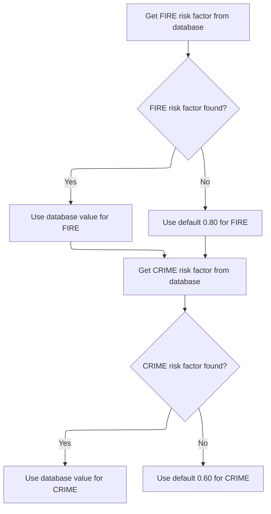

<SwmSnippet path="/base/src/LGAPDB03.cbl" line="48" repo-id="Z2l0aHViJTNBJTNBa3luZHJ5bC1jaWNzLWdlbmFwcCUzQSUzQVN3aW1tLURlbW8=">

---

<SwmToken path="/base/src/LGAPDB03.cbl" pos="48:1:5" line-data="       GET-RISK-FACTORS." repo-id="Z2l0aHViJTNBJTNBa3luZHJ5bC1jaWNzLWdlbmFwcCUzQSUzQVN3aW1tLURlbW8=" repo-name="kyndryl-cics-genapp">`GET-RISK-FACTORS`</SwmToken> in this context fetches FIRE and CRIME risk factors from the DB, just like in the risk score calculation module. Defaults are used if the DB fetch fails.

```cobol
       GET-RISK-FACTORS.
           EXEC SQL
               SELECT FACTOR_VALUE INTO :WS-FIRE-FACTOR
               FROM RISK_FACTORS
               WHERE PERIL_TYPE = 'FIRE'
           END-EXEC.
           
           IF SQLCODE = 0
               CONTINUE
```

---

</SwmSnippet>

<SwmSnippet path="/base/src/LGAPDB03.cbl" line="57" repo-id="Z2l0aHViJTNBJTNBa3luZHJ5bC1jaWNzLWdlbmFwcCUzQSUzQVN3aW1tLURlbW8=">

---

If the FIRE risk factor fetch fails, we use a default value before moving on to the next peril. This keeps the flow going even if the DB is down.

```cobol
           ELSE
               MOVE 0.80 TO WS-FIRE-FACTOR
```

---

</SwmSnippet>

<SwmSnippet path="/base/src/LGAPDB03.cbl" line="59" repo-id="Z2l0aHViJTNBJTNBa3luZHJ5bC1jaWNzLWdlbmFwcCUzQSUzQVN3aW1tLURlbW8=">

---

After fetching (or defaulting) both FIRE and CRIME risk factors, these values are used in the next steps for verdict and premium calculations.

```cobol
           END-IF.
           
           EXEC SQL
               SELECT FACTOR_VALUE INTO :WS-CRIME-FACTOR
               FROM RISK_FACTORS
               WHERE PERIL_TYPE = 'CRIME'
           END-EXEC.
           
           IF SQLCODE = 0
               CONTINUE
           ELSE
               MOVE 0.60 TO WS-CRIME-FACTOR
           END-IF.
```

---

</SwmSnippet>

##### Verdict Assignment and Premium Calculation Orchestration

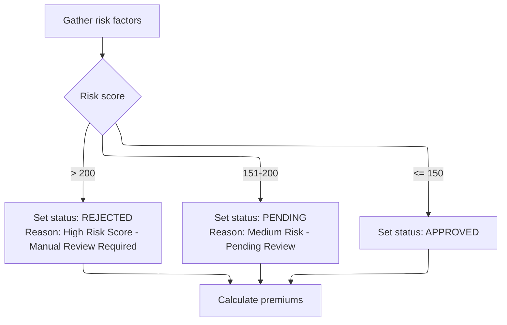

<SwmSnippet path="/base/src/LGAPDB03.cbl" line="42" repo-id="Z2l0aHViJTNBJTNBa3luZHJ5bC1jaWNzLWdlbmFwcCUzQSUzQVN3aW1tLURlbW8=">

---

Right after <SwmToken path="/base/src/LGAPDB03.cbl" pos="42:1:3" line-data="       MAIN-LOGIC." repo-id="Z2l0aHViJTNBJTNBa3luZHJ5bC1jaWNzLWdlbmFwcCUzQSUzQVN3aW1tLURlbW8=" repo-name="kyndryl-cics-genapp">`MAIN-LOGIC`</SwmToken> gets the risk factors, it immediately calls <SwmToken path="/base/src/LGAPDB03.cbl" pos="44:3:5" line-data="           PERFORM CALCULATE-VERDICT" repo-id="Z2l0aHViJTNBJTNBa3luZHJ5bC1jaWNzLWdlbmFwcCUzQSUzQVN3aW1tLURlbW8=" repo-name="kyndryl-cics-genapp">`CALCULATE-VERDICT`</SwmToken>. This step is needed to decide if the policy is approved, pending, or rejected based on the risk score. Only after setting this status does it move on to premium calculation, making sure the output reflects the correct decision for the record.

```cobol
       MAIN-LOGIC.
           PERFORM GET-RISK-FACTORS
           PERFORM CALCULATE-VERDICT
           PERFORM CALCULATE-PREMIUMS
           GOBACK.
```

---

</SwmSnippet>

<SwmSnippet path="/base/src/LGAPDB03.cbl" line="73" repo-id="Z2l0aHViJTNBJTNBa3luZHJ5bC1jaWNzLWdlbmFwcCUzQSUzQVN3aW1tLURlbW8=">

---

<SwmToken path="/base/src/LGAPDB03.cbl" pos="73:1:3" line-data="       CALCULATE-VERDICT." repo-id="Z2l0aHViJTNBJTNBa3luZHJ5bC1jaWNzLWdlbmFwcCUzQSUzQVN3aW1tLURlbW8=" repo-name="kyndryl-cics-genapp">`CALCULATE-VERDICT`</SwmToken> checks the risk score and sets the policy status and reason fields. If the score is high, it marks the record as rejected; if it's in the middle range, it sets it to pending; otherwise, it's approved. This sets up the output fields for later steps.

```cobol
       CALCULATE-VERDICT.
           IF LK-RISK-SCORE > 200
             MOVE 2 TO LK-STAT
             MOVE 'REJECTED' TO LK-STAT-DESC
             MOVE 'High Risk Score - Manual Review Required' 
               TO LK-REJ-RSN
           ELSE
             IF LK-RISK-SCORE > 150
               MOVE 1 TO LK-STAT
               MOVE 'PENDING' TO LK-STAT-DESC
               MOVE 'Medium Risk - Pending Review'
                 TO LK-REJ-RSN
             ELSE
               MOVE 0 TO LK-STAT
               MOVE 'APPROVED' TO LK-STAT-DESC
               MOVE SPACES TO LK-REJ-RSN
             END-IF
           END-IF.
```

---

</SwmSnippet>

<SwmSnippet path="/base/src/LGAPDB03.cbl" line="42" repo-id="Z2l0aHViJTNBJTNBa3luZHJ5bC1jaWNzLWdlbmFwcCUzQSUzQVN3aW1tLURlbW8=">

---

After <SwmToken path="/base/src/LGAPDB03.cbl" pos="42:1:3" line-data="       MAIN-LOGIC." repo-id="Z2l0aHViJTNBJTNBa3luZHJ5bC1jaWNzLWdlbmFwcCUzQSUzQVN3aW1tLURlbW8=" repo-name="kyndryl-cics-genapp">`MAIN-LOGIC`</SwmToken> sets the verdict, it moves on to <SwmToken path="/base/src/LGAPDB03.cbl" pos="45:3:5" line-data="           PERFORM CALCULATE-PREMIUMS" repo-id="Z2l0aHViJTNBJTNBa3luZHJ5bC1jaWNzLWdlbmFwcCUzQSUzQVN3aW1tLURlbW8=" repo-name="kyndryl-cics-genapp">`CALCULATE-PREMIUMS`</SwmToken>. This step figures out the actual premium amounts for each peril and the total, using the risk score and factors already set up. The verdict is already decided, so now we just need the numbers.

```cobol
       MAIN-LOGIC.
           PERFORM GET-RISK-FACTORS
           PERFORM CALCULATE-VERDICT
           PERFORM CALCULATE-PREMIUMS
           GOBACK.
```

---

</SwmSnippet>

#### Premium Calculation and Discount Application

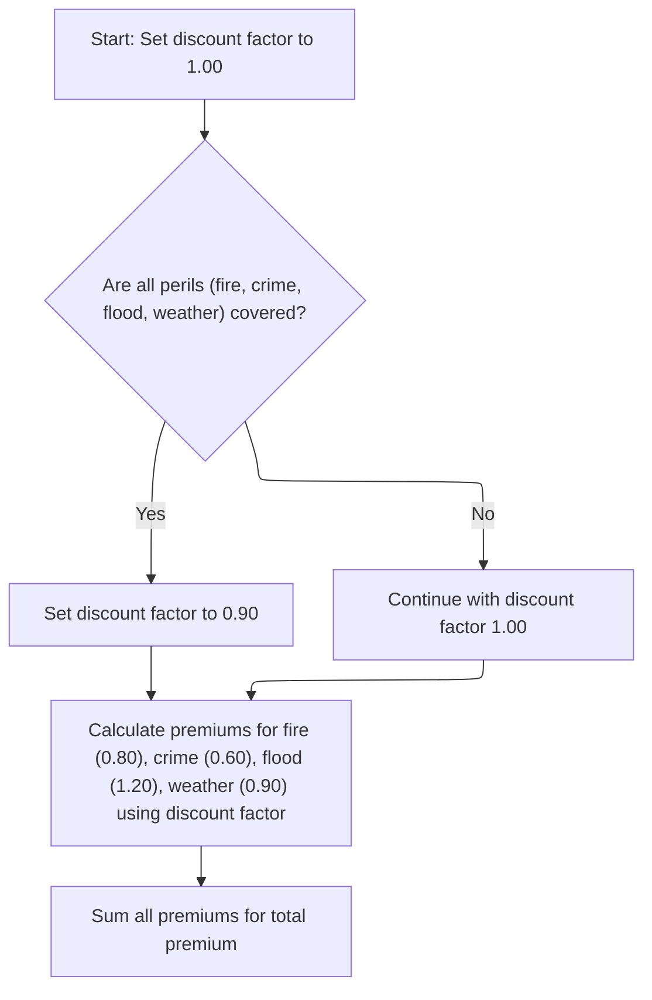

<SwmSnippet path="/base/src/LGAPDB03.cbl" line="92" repo-id="Z2l0aHViJTNBJTNBa3luZHJ5bC1jaWNzLWdlbmFwcCUzQSUzQVN3aW1tLURlbW8=">

---

In <SwmToken path="/base/src/LGAPDB03.cbl" pos="92:1:3" line-data="       CALCULATE-PREMIUMS." repo-id="Z2l0aHViJTNBJTNBa3luZHJ5bC1jaWNzLWdlbmFwcCUzQSUzQVN3aW1tLURlbW8=" repo-name="kyndryl-cics-genapp">`CALCULATE-PREMIUMS`</SwmToken>, we first set the discount factor to <SwmToken path="/base/src/LGAPDB03.cbl" pos="93:3:5" line-data="           MOVE 1.00 TO LK-DISC-FACT" repo-id="Z2l0aHViJTNBJTNBa3luZHJ5bC1jaWNzLWdlbmFwcCUzQSUzQVN3aW1tLURlbW8=" repo-name="kyndryl-cics-genapp">`1.00`</SwmToken>, then check if all peril values are greater than zero. If so, we apply a 10% discount. Then, we start calculating the fire and crime premiums using the risk score, peril factors, peril values, and the discount factor.

```cobol
       CALCULATE-PREMIUMS.
           MOVE 1.00 TO LK-DISC-FACT
           
           IF LK-FIRE-PERIL > 0 AND
              LK-CRIME-PERIL > 0 AND
              LK-FLOOD-PERIL > 0 AND
              LK-WEATHER-PERIL > 0
             MOVE 0.90 TO LK-DISC-FACT
           END-IF

           COMPUTE LK-FIRE-PREMIUM =
             ((LK-RISK-SCORE * WS-FIRE-FACTOR) * LK-FIRE-PERIL *
               LK-DISC-FACT)
           
           COMPUTE LK-CRIME-PREMIUM =
             ((LK-RISK-SCORE * WS-CRIME-FACTOR) * LK-CRIME-PERIL *
               LK-DISC-FACT)
```

---

</SwmSnippet>

<SwmSnippet path="/base/src/LGAPDB03.cbl" line="110" repo-id="Z2l0aHViJTNBJTNBa3luZHJ5bC1jaWNzLWdlbmFwcCUzQSUzQVN3aW1tLURlbW8=">

---

After fire and crime premiums, <SwmToken path="/base/src/LGAPDB03.cbl" pos="45:3:5" line-data="           PERFORM CALCULATE-PREMIUMS" repo-id="Z2l0aHViJTNBJTNBa3luZHJ5bC1jaWNzLWdlbmFwcCUzQSUzQVN3aW1tLURlbW8=" repo-name="kyndryl-cics-genapp">`CALCULATE-PREMIUMS`</SwmToken> continues with the same formula to compute the flood premium, using the same risk score, factor, peril value, and discount factor.

```cobol
           COMPUTE LK-FLOOD-PREMIUM =
             ((LK-RISK-SCORE * WS-FLOOD-FACTOR) * LK-FLOOD-PERIL *
               LK-DISC-FACT)
```

---

</SwmSnippet>

<SwmSnippet path="/base/src/LGAPDB03.cbl" line="114" repo-id="Z2l0aHViJTNBJTNBa3luZHJ5bC1jaWNzLWdlbmFwcCUzQSUzQVN3aW1tLURlbW8=">

---

<SwmToken path="/base/src/LGAPDB03.cbl" pos="45:3:5" line-data="           PERFORM CALCULATE-PREMIUMS" repo-id="Z2l0aHViJTNBJTNBa3luZHJ5bC1jaWNzLWdlbmFwcCUzQSUzQVN3aW1tLURlbW8=" repo-name="kyndryl-cics-genapp">`CALCULATE-PREMIUMS`</SwmToken> adds up all the individual premiums to get the total premium.

```cobol
           COMPUTE LK-WEATHER-PREMIUM =
             ((LK-RISK-SCORE * WS-WEATHER-FACTOR) * LK-WEATHER-PERIL *
               LK-DISC-FACT)

           COMPUTE LK-TOTAL-PREMIUM = 
             LK-FIRE-PREMIUM + LK-CRIME-PREMIUM + 
             LK-FLOOD-PREMIUM + LK-WEATHER-PREMIUM. 
```

---

</SwmSnippet>

#### Post-Premium Processing and Output Preparation

<SwmSnippet path="/base/src/LGAPDB01.cbl" line="109" repo-id="Z2l0aHViJTNBJTNBa3luZHJ5bC1jaWNzLWdlbmFwcCUzQSUzQVN3aW1tLURlbW8=">

---

After <SwmToken path="/base/src/LGAPDB01.cbl" pos="109:1:1" line-data="       P009." repo-id="Z2l0aHViJTNBJTNBa3luZHJ5bC1jaWNzLWdlbmFwcCUzQSUzQVN3aW1tLURlbW8=" repo-name="kyndryl-cics-genapp">`P009`</SwmToken> finishes calling <SwmToken path="/base/src/LGAPDB01.cbl" pos="110:3:3" line-data="           PERFORM P010" repo-id="Z2l0aHViJTNBJTNBa3luZHJ5bC1jaWNzLWdlbmFwcCUzQSUzQVN3aW1tLURlbW8=" repo-name="kyndryl-cics-genapp">`P010`</SwmToken> and <SwmToken path="/base/src/LGAPDB01.cbl" pos="111:3:3" line-data="           PERFORM P011" repo-id="Z2l0aHViJTNBJTNBa3luZHJ5bC1jaWNzLWdlbmFwcCUzQSUzQVN3aW1tLURlbW8=" repo-name="kyndryl-cics-genapp">`P011`</SwmToken>, it moves on to <SwmToken path="/base/src/LGAPDB01.cbl" pos="112:3:3" line-data="           PERFORM P012" repo-id="Z2l0aHViJTNBJTNBa3luZHJ5bC1jaWNzLWdlbmFwcCUzQSUzQVN3aW1tLURlbW8=" repo-name="kyndryl-cics-genapp">`P012`</SwmToken>. This step doesn't do anything right now, but it's included in the sequence, probably as a placeholder or for structure. After that, it goes to <SwmToken path="/base/src/LGAPDB01.cbl" pos="113:3:3" line-data="           PERFORM P013." repo-id="Z2l0aHViJTNBJTNBa3luZHJ5bC1jaWNzLWdlbmFwcCUzQSUzQVN3aW1tLURlbW8=" repo-name="kyndryl-cics-genapp">`P013`</SwmToken> to finish up the output.

```cobol
       P009.
           PERFORM P010
           PERFORM P011
           PERFORM P012
           PERFORM P013.
```

---

</SwmSnippet>

<SwmSnippet path="/base/src/LGAPDB01.cbl" line="125" repo-id="Z2l0aHViJTNBJTNBa3luZHJ5bC1jaWNzLWdlbmFwcCUzQSUzQVN3aW1tLURlbW8=">

---

<SwmToken path="/base/src/LGAPDB01.cbl" pos="125:1:1" line-data="       P012." repo-id="Z2l0aHViJTNBJTNBa3luZHJ5bC1jaWNzLWdlbmFwcCUzQSUzQVN3aW1tLURlbW8=" repo-name="kyndryl-cics-genapp">`P012`</SwmToken> is just a no-op. It doesn't do anything—it's there as a placeholder, maybe for future changes or to keep the structure tidy.

```cobol
       P012.
           CONTINUE.
```

---

</SwmSnippet>

<SwmSnippet path="/base/src/LGAPDB01.cbl" line="109" repo-id="Z2l0aHViJTNBJTNBa3luZHJ5bC1jaWNzLWdlbmFwcCUzQSUzQVN3aW1tLURlbW8=">

---

<SwmToken path="/base/src/LGAPDB01.cbl" pos="109:1:1" line-data="       P009." repo-id="Z2l0aHViJTNBJTNBa3luZHJ5bC1jaWNzLWdlbmFwcCUzQSUzQVN3aW1tLURlbW8=" repo-name="kyndryl-cics-genapp">`P009`</SwmToken> ends by calling <SwmToken path="/base/src/LGAPDB01.cbl" pos="113:3:3" line-data="           PERFORM P013." repo-id="Z2l0aHViJTNBJTNBa3luZHJ5bC1jaWNzLWdlbmFwcCUzQSUzQVN3aW1tLURlbW8=" repo-name="kyndryl-cics-genapp">`P013`</SwmToken> to write the output record.

```cobol
       P009.
           PERFORM P010
           PERFORM P011
           PERFORM P012
           PERFORM P013.
```

---

</SwmSnippet>

<SwmSnippet path="/base/src/LGAPDB01.cbl" line="128" repo-id="Z2l0aHViJTNBJTNBa3luZHJ5bC1jaWNzLWdlbmFwcCUzQSUzQVN3aW1tLURlbW8=">

---

<SwmToken path="/base/src/LGAPDB01.cbl" pos="128:1:1" line-data="       P013." repo-id="Z2l0aHViJTNBJTNBa3luZHJ5bC1jaWNzLWdlbmFwcCUzQSUzQVN3aW1tLURlbW8=" repo-name="kyndryl-cics-genapp">`P013`</SwmToken> copies all the input and calculated fields (customer, property type, postcode, risk score, premiums, status, and rejection reason) into the output structure and writes the output record. No transformations, just straight moves and a write.

```cobol
       P013.
           MOVE IN-CUSTOMER-NUM TO OUT-CUSTOMER-NUM
           MOVE IN-PROPERTY-TYPE TO OUT-PROPERTY-TYPE
           MOVE IN-POSTCODE TO OUT-POSTCODE
           MOVE WS-RISK-SCR TO OUT-RISK-SCORE
           MOVE WS-FR-PREM TO OUT-FIRE-PREMIUM
           MOVE WS-CR-PREM TO OUT-CRIME-PREMIUM
           MOVE WS-FL-PREM TO OUT-FLOOD-PREMIUM
           MOVE WS-WE-PREM TO OUT-WEATHER-PREMIUM
           MOVE WS-TOT-PREM TO OUT-TOTAL-PREMIUM
           MOVE WS-STAT-DESC TO OUT-STATUS
           MOVE WS-REJ-RSN TO OUT-REJECT-REASON
           WRITE OUTPUT-RECORD.
```

---

</SwmSnippet>

### Error Handling and Unsupported Policy Routing

<SwmSnippet path="/base/src/LGAPDB01.cbl" line="86" repo-id="Z2l0aHViJTNBJTNBa3luZHJ5bC1jaWNzLWdlbmFwcCUzQSUzQVN3aW1tLURlbW8=">

---

<SwmToken path="/base/src/LGAPDB01.cbl" pos="86:1:1" line-data="       P007." repo-id="Z2l0aHViJTNBJTNBa3luZHJ5bC1jaWNzLWdlbmFwcCUzQSUzQVN3aW1tLURlbW8=" repo-name="kyndryl-cics-genapp">`P007`</SwmToken> calls <SwmToken path="/base/src/LGAPDB01.cbl" pos="91:3:3" line-data="               PERFORM P008" repo-id="Z2l0aHViJTNBJTNBa3luZHJ5bC1jaWNzLWdlbmFwcCUzQSUzQVN3aW1tLURlbW8=" repo-name="kyndryl-cics-genapp">`P008`</SwmToken> for unsupported policy types to handle them separately.

```cobol
       P007.
           IF IN-POLICY-TYPE = 'C'
               PERFORM P009
               ADD 1 TO WS-PROC-CNT
           ELSE
               PERFORM P008
               ADD 1 TO WS-ERR-CNT
           END-IF.
```

---

</SwmSnippet>

<SwmSnippet path="/base/src/LGAPDB01.cbl" line="95" repo-id="Z2l0aHViJTNBJTNBa3luZHJ5bC1jaWNzLWdlbmFwcCUzQSUzQVN3aW1tLURlbW8=">

---

<SwmToken path="/base/src/LGAPDB01.cbl" pos="95:1:1" line-data="       P008." repo-id="Z2l0aHViJTNBJTNBa3luZHJ5bC1jaWNzLWdlbmFwcCUzQSUzQVN3aW1tLURlbW8=" repo-name="kyndryl-cics-genapp">`P008`</SwmToken> handles unsupported policy types by copying the basic input fields to output, zeroing out all premium and risk fields, and setting the status and rejection reason to flag the record as unsupported. Then it writes this to the output file.

```cobol
       P008.
           MOVE IN-CUSTOMER-NUM TO OUT-CUSTOMER-NUM
           MOVE IN-PROPERTY-TYPE TO OUT-PROPERTY-TYPE
           MOVE IN-POSTCODE TO OUT-POSTCODE
           MOVE ZERO TO OUT-RISK-SCORE
           MOVE ZERO TO OUT-FIRE-PREMIUM
           MOVE ZERO TO OUT-CRIME-PREMIUM
           MOVE ZERO TO OUT-FLOOD-PREMIUM
           MOVE ZERO TO OUT-WEATHER-PREMIUM
           MOVE ZERO TO OUT-TOTAL-PREMIUM
           MOVE 'UNSUPPORTED' TO OUT-STATUS
           MOVE 'Only Commercial policies supported' TO OUT-REJECT-REASON
           WRITE OUTPUT-RECORD.
```

---

</SwmSnippet>

## File Closure and Summary Reporting

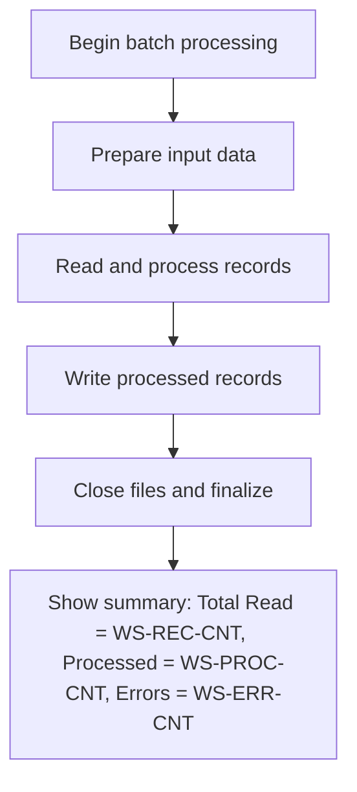

<SwmSnippet path="/base/src/LGAPDB01.cbl" line="31" repo-id="Z2l0aHViJTNBJTNBa3luZHJ5bC1jaWNzLWdlbmFwcCUzQSUzQVN3aW1tLURlbW8=">

---

<SwmToken path="/base/src/LGAPDB01.cbl" pos="31:1:1" line-data="       P001." repo-id="Z2l0aHViJTNBJTNBa3luZHJ5bC1jaWNzLWdlbmFwcCUzQSUzQVN3aW1tLURlbW8=" repo-name="kyndryl-cics-genapp">`P001`</SwmToken> calls <SwmToken path="/base/src/LGAPDB01.cbl" pos="35:3:3" line-data="           PERFORM P014" repo-id="Z2l0aHViJTNBJTNBa3luZHJ5bC1jaWNzLWdlbmFwcCUzQSUzQVN3aW1tLURlbW8=" repo-name="kyndryl-cics-genapp">`P014`</SwmToken> to close the files after processing.

```cobol
       P001.
           PERFORM P002
           PERFORM P003
           PERFORM P005
           PERFORM P014
           PERFORM P015
           STOP RUN.
```

---

</SwmSnippet>

<SwmSnippet path="/base/src/LGAPDB01.cbl" line="142" repo-id="Z2l0aHViJTNBJTNBa3luZHJ5bC1jaWNzLWdlbmFwcCUzQSUzQVN3aW1tLURlbW8=">

---

<SwmToken path="/base/src/LGAPDB01.cbl" pos="142:1:1" line-data="       P014." repo-id="Z2l0aHViJTNBJTNBa3luZHJ5bC1jaWNzLWdlbmFwcCUzQSUzQVN3aW1tLURlbW8=" repo-name="kyndryl-cics-genapp">`P014`</SwmToken> just closes the input and output files. There's no error handling here—just straight CLOSE statements for both files.

```cobol
       P014.
           CLOSE INPUT-FILE
           CLOSE OUTPUT-FILE.
```

---

</SwmSnippet>

<SwmSnippet path="/base/src/LGAPDB01.cbl" line="31" repo-id="Z2l0aHViJTNBJTNBa3luZHJ5bC1jaWNzLWdlbmFwcCUzQSUzQVN3aW1tLURlbW8=">

---

<SwmToken path="/base/src/LGAPDB01.cbl" pos="31:1:1" line-data="       P001." repo-id="Z2l0aHViJTNBJTNBa3luZHJ5bC1jaWNzLWdlbmFwcCUzQSUzQVN3aW1tLURlbW8=" repo-name="kyndryl-cics-genapp">`P001`</SwmToken> calls <SwmToken path="/base/src/LGAPDB01.cbl" pos="36:3:3" line-data="           PERFORM P015" repo-id="Z2l0aHViJTNBJTNBa3luZHJ5bC1jaWNzLWdlbmFwcCUzQSUzQVN3aW1tLURlbW8=" repo-name="kyndryl-cics-genapp">`P015`</SwmToken> to show the processing summary before stopping.

```cobol
       P001.
           PERFORM P002
           PERFORM P003
           PERFORM P005
           PERFORM P014
           PERFORM P015
           STOP RUN.
```

---

</SwmSnippet>

<SwmSnippet path="/base/src/LGAPDB01.cbl" line="146" repo-id="Z2l0aHViJTNBJTNBa3luZHJ5bC1jaWNzLWdlbmFwcCUzQSUzQVN3aW1tLURlbW8=">

---

<SwmToken path="/base/src/LGAPDB01.cbl" pos="146:1:1" line-data="       P015." repo-id="Z2l0aHViJTNBJTNBa3luZHJ5bC1jaWNzLWdlbmFwcCUzQSUzQVN3aW1tLURlbW8=" repo-name="kyndryl-cics-genapp">`P015`</SwmToken> just displays the total records read, processed, and error counts. It's a simple summary for whoever's running the job.

```cobol
       P015.
           DISPLAY 'Processing Complete:'
           DISPLAY 'Total Records Read: ' WS-REC-CNT
           DISPLAY 'Records Processed: ' WS-PROC-CNT
           DISPLAY 'Error Records: ' WS-ERR-CNT. 
```

---

</SwmSnippet>

&nbsp;

*This is an auto-generated document by Swimm 🌊 and has not yet been verified by a human*

<SwmMeta version="3.0.0"><sup>Powered by [Swimm](https://app.swimm.io/)</sup></SwmMeta>
