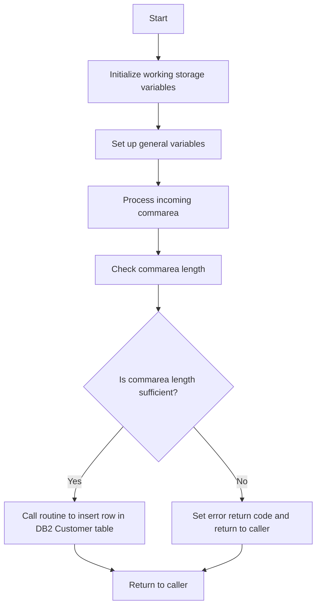

This document will cover the <SwmToken path="base/src/lgacus01.cbl" pos="11:6:6" line-data="       PROGRAM-ID. LGACUS01.">`LGACUS01`</SwmToken> program. We'll cover:

1. What the Program Does
2. Program Flow
3. Program Sections

## What the Program Does

The <SwmToken path="base/src/lgacus01.cbl" pos="11:6:6" line-data="       PROGRAM-ID. LGACUS01.">`LGACUS01`</SwmToken> program is designed to add a new customer to the database. It initializes working storage variables, processes the incoming communication area (commarea), checks the commarea length, and then calls a routine to insert a row in the <SwmToken path="base/src/lgacus01.cbl" pos="118:15:15" line-data="      * Call routine to Insert row in DB2 Customer table               *">`DB2`</SwmToken> Customer table. If no commarea is received, the program issues an ABEND (abnormal end). The program also initializes the commarea return code to zero and sets up general variables.

## Program Flow

The program flow of <SwmToken path="base/src/lgacus01.cbl" pos="11:6:6" line-data="       PROGRAM-ID. LGACUS01.">`LGACUS01`</SwmToken> is as follows:

1. Initialize working storage variables.
2. Set up general variables.
3. Process the incoming commarea.
4. Check the commarea length.
5. If the commarea length is less than required, set an error return code and return to the caller.
6. Call the routine to insert a row in the <SwmToken path="base/src/lgacus01.cbl" pos="118:15:15" line-data="      * Call routine to Insert row in DB2 Customer table               *">`DB2`</SwmToken> Customer table.
7. Return to the caller.



<SwmSnippet path="/base/src/lgacus01.cbl" line="78">

---

## Program Sections

First, the program initializes working storage variables and sets up general variables. This includes initializing the <SwmToken path="base/src/lgacus01.cbl" pos="84:3:5" line-data="           INITIALIZE WS-HEADER.">`WS-HEADER`</SwmToken> and moving values to <SwmToken path="base/src/lgacus01.cbl" pos="86:7:9" line-data="           MOVE EIBTRNID TO WS-TRANSID.">`WS-TRANSID`</SwmToken>, <SwmToken path="base/src/lgacus01.cbl" pos="87:7:9" line-data="           MOVE EIBTRMID TO WS-TERMID.">`WS-TERMID`</SwmToken>, and <SwmToken path="base/src/lgacus01.cbl" pos="88:7:9" line-data="           MOVE EIBTASKN TO WS-TASKNUM.">`WS-TASKNUM`</SwmToken>.

```cobol
       MAINLINE SECTION.

      *----------------------------------------------------------------*
      * Common code                                                    *
      *----------------------------------------------------------------*
      * initialize working storage variables
           INITIALIZE WS-HEADER.
      * set up general variable
           MOVE EIBTRNID TO WS-TRANSID.
           MOVE EIBTRMID TO WS-TERMID.
           MOVE EIBTASKN TO WS-TASKNUM.
      *----------------------------------------------------------------*
```

---

</SwmSnippet>

<SwmSnippet path="/base/src/lgacus01.cbl" line="92">

---

Now, the program processes the incoming commarea. If no commarea is received, it issues an ABEND. It also initializes the commarea return code to zero, moves the EIBCALEN to <SwmToken path="base/src/lgacus01.cbl" pos="104:7:9" line-data="           MOVE EIBCALEN TO WS-CALEN.">`WS-CALEN`</SwmToken>, and sets the address of DFHCOMMAREA.

```cobol
      * Process incoming commarea                                      *
      *----------------------------------------------------------------*
      * If NO commarea received issue an ABEND
           IF EIBCALEN IS EQUAL TO ZERO
               MOVE ' NO COMMAREA RECEIVED' TO EM-VARIABLE
               PERFORM WRITE-ERROR-MESSAGE
               EXEC CICS ABEND ABCODE('LGCA') NODUMP END-EXEC
           END-IF

      * initialize commarea return code to zero
           MOVE '00' TO CA-RETURN-CODE
           MOVE '00' TO CA-NUM-POLICIES
           MOVE EIBCALEN TO WS-CALEN.
           SET WS-ADDR-DFHCOMMAREA TO ADDRESS OF DFHCOMMAREA.

      * check commarea length
           ADD WS-CA-HEADER-LEN TO WS-REQUIRED-CA-LEN
           ADD WS-CUSTOMER-LEN  TO WS-REQUIRED-CA-LEN

      * if less set error return code and return to caller
           IF EIBCALEN IS LESS THAN WS-REQUIRED-CA-LEN
```

---

</SwmSnippet>

<SwmSnippet path="/base/src/lgacus01.cbl" line="118">

---

Then, the program calls the routine to insert a row in the <SwmToken path="base/src/lgacus01.cbl" pos="118:15:15" line-data="      * Call routine to Insert row in DB2 Customer table               *">`DB2`</SwmToken> Customer table by performing the <SwmToken path="base/src/lgacus01.cbl" pos="119:3:5" line-data="           PERFORM INSERT-CUSTOMER.">`INSERT-CUSTOMER`</SwmToken> section.

```cobol
      * Call routine to Insert row in DB2 Customer table               *
           PERFORM INSERT-CUSTOMER.
      
      *----------------------------------------------------------------*
      *
           EXEC CICS RETURN END-EXEC.

```

---

</SwmSnippet>

<SwmSnippet path="/base/src/lgacus01.cbl" line="130">

---

Going into the <SwmToken path="base/src/lgacus01.cbl" pos="132:1:3" line-data="       INSERT-CUSTOMER.">`INSERT-CUSTOMER`</SwmToken> section, the program executes a CICS LINK command to call the <SwmToken path="base/src/lgacus01.cbl" pos="134:9:9" line-data="           EXEC CICS LINK Program(LGACDB01)">`LGACDB01`</SwmToken> program with the commarea.

```cobol
      * DB2                                                            *
      *----------------------------------------------------------------*
       INSERT-CUSTOMER.

           EXEC CICS LINK Program(LGACDB01)
                Commarea(DFHCOMMAREA)
                LENGTH(32500)
           END-EXEC.
      **********

```

---

</SwmSnippet>

&nbsp;

*This is an auto-generated document by Swimm 🌊 and has not yet been verified by a human*

<SwmMeta version="3.0.0" repo-id="Z2l0aHViJTNBJTNBa3luZHJ5bC1jaWNzLWdlbmFwcCUzQSUzQVN3aW1tLURlbW8=" repo-name="kyndryl-cics-genapp"><sup>Powered by [Swimm](/)</sup></SwmMeta>
