This document will cover the <SwmToken path="base/src/lgacus01.cbl" pos="11:6:6" line-data="       PROGRAM-ID. LGACUS01.">`LGACUS01`</SwmToken> program, which is responsible for adding a new customer in the general insurance application. We'll cover:

1. What the Program Does
2. Program Flow
3. Program Sections

## What the Program Does

The <SwmToken path="base/src/lgacus01.cbl" pos="11:6:6" line-data="       PROGRAM-ID. LGACUS01.">`LGACUS01`</SwmToken> program is designed to add a new customer to the database. It initializes working storage variables, processes the incoming communication area (commarea), checks the commarea length, and calls the <SwmToken path="base/src/lgacus01.cbl" pos="58:3:3" line-data="       77  LGACDB01                    PIC X(8)       VALUE &#39;LGACDB01&#39;.">`LGACDB01`</SwmToken> program to insert the customer details into the database. If any errors occur, it writes error messages to the queues using the LGSTSQ program.

## Program Flow

The program follows these high-level steps:

1. Initialize working storage variables.
2. Process the incoming commarea.
3. Check the commarea length.
4. Call the <SwmToken path="base/src/lgacus01.cbl" pos="58:3:3" line-data="       77  LGACDB01                    PIC X(8)       VALUE &#39;LGACDB01&#39;.">`LGACDB01`</SwmToken> program to insert the customer details.
5. Return control to the caller.

```mermaid
graph TD
  A[Start] --> B[Initialize working storage variables]
  B --> C[Process incoming commarea]
  C --> D{Is commarea length valid?}
  D -->|Yes| E[Call LGACDB01 to insert customer details]
  D -->|No| F[Set error return code and return to caller]
  E --> G[Return control to caller]
  F --> G

%% Swimm:
%% graph TD
%%   A[Start] --> B[Initialize working storage variables]
%%   B --> C[Process incoming commarea]
%%   C --> D{Is commarea length valid?}
%%   D -->|Yes| E[Call <SwmToken path="base/src/lgacus01.cbl" pos="58:3:3" line-data="       77  LGACDB01                    PIC X(8)       VALUE &#39;LGACDB01&#39;.">`LGACDB01`</SwmToken> to insert customer details]
%%   D -->|No| F[Set error return code and return to caller]
%%   E --> G[Return control to caller]
%%   F --> G
```



<SwmSnippet path="/base/src/lgacus01.cbl" line="78">

---

## Program Sections

First, the program initializes the working storage variables. It sets up general variables like transaction ID, terminal ID, and task number.

```cobol
       MAINLINE SECTION.

      *----------------------------------------------------------------*
      * Common code                                                    *
      *----------------------------------------------------------------*
      * initialize working storage variables
           INITIALIZE WS-HEADER.
      * set up general variable
           MOVE EIBTRNID TO WS-TRANSID.
           MOVE EIBTRMID TO WS-TERMID.
           MOVE EIBTASKN TO WS-TASKNUM.
      *----------------------------------------------------------------*
```

---

</SwmSnippet>

<SwmSnippet path="/base/src/lgacus01.cbl" line="92">

---

Next, the program processes the incoming commarea. It checks if a commarea was received, initializes the commarea return code, and checks the commarea length. If the commarea length is less than the required length, it sets an error return code and returns to the caller.

```cobol
      * Process incoming commarea                                      *
      *----------------------------------------------------------------*
      * If NO commarea received issue an ABEND
           IF EIBCALEN IS EQUAL TO ZERO
               MOVE ' NO COMMAREA RECEIVED' TO EM-VARIABLE
               PERFORM WRITE-ERROR-MESSAGE
               EXEC CICS ABEND ABCODE('LGCA') NODUMP END-EXEC
           END-IF

      * initialize commarea return code to zero
           MOVE '00' TO CA-RETURN-CODE
           MOVE '00' TO CA-NUM-POLICIES
           MOVE EIBCALEN TO WS-CALEN.
           SET WS-ADDR-DFHCOMMAREA TO ADDRESS OF DFHCOMMAREA.

      * check commarea length
           ADD WS-CA-HEADER-LEN TO WS-REQUIRED-CA-LEN
           ADD WS-CUSTOMER-LEN  TO WS-REQUIRED-CA-LEN

      * if less set error return code and return to caller
           IF EIBCALEN IS LESS THAN WS-REQUIRED-CA-LEN
```

---

</SwmSnippet>

<SwmSnippet path="/base/src/lgacus01.cbl" line="118">

---

Then, the program calls the <SwmToken path="base/src/lgacus01.cbl" pos="58:3:3" line-data="       77  LGACDB01                    PIC X(8)       VALUE &#39;LGACDB01&#39;.">`LGACDB01`</SwmToken> program to insert the customer details into the database. The <SwmToken path="base/src/lgacus01.cbl" pos="58:3:3" line-data="       77  LGACDB01                    PIC X(8)       VALUE &#39;LGACDB01&#39;.">`LGACDB01`</SwmToken> program handles the insertion of customer details into the database.

```cobol
      * Call routine to Insert row in DB2 Customer table               *
           PERFORM INSERT-CUSTOMER.
      
      *----------------------------------------------------------------*
      *
           EXEC CICS RETURN END-EXEC.
```

---

</SwmSnippet>

<SwmSnippet path="/base/src/lgacus01.cbl" line="147">

---

Going into the error handling section, the program writes error messages to the queues using the LGSTSQ program. It includes the date, time, program name, customer number, policy number, and SQLCODE in the error message.

```cobol
       WRITE-ERROR-MESSAGE.
      * Save SQLCODE in message
      * Obtain and format current time and date
           EXEC CICS ASKTIME ABSTIME(WS-ABSTIME)
           END-EXEC
           EXEC CICS FORMATTIME ABSTIME(WS-ABSTIME)
                     MMDDYYYY(WS-DATE)
                     TIME(WS-TIME)
           END-EXEC
           MOVE WS-DATE TO EM-DATE
           MOVE WS-TIME TO EM-TIME
      * Write output message to TDQ
           EXEC CICS LINK PROGRAM('LGSTSQ')
                     COMMAREA(ERROR-MSG)
                     LENGTH(LENGTH OF ERROR-MSG)
           END-EXEC.
      * Write 90 bytes or as much as we have of commarea to TDQ
           IF EIBCALEN > 0 THEN
             IF EIBCALEN < 91 THEN
               MOVE DFHCOMMAREA(1:EIBCALEN) TO CA-DATA
               EXEC CICS LINK PROGRAM('LGSTSQ')
```

---

</SwmSnippet>

&nbsp;

*This is an auto-generated document by Swimm 🌊 and has not yet been verified by a human*

<SwmMeta version="3.0.0" repo-id="Z2l0aHViJTNBJTNBa3luZHJ5bC1jaWNzLWdlbmFwcCUzQSUzQVN3aW1tLURlbW8=" repo-name="kyndryl-cics-genapp"><sup>Powered by [Swimm](/)</sup></SwmMeta>
