This document will cover the <SwmToken path="base/src/lgacdb01.cbl" pos="13:6:6" line-data="       PROGRAM-ID. LGACDB01.">`LGACDB01`</SwmToken> program. We'll cover:

1. What the Program Does
2. Program Flow
3. Program Sections

## What the Program Does

The <SwmToken path="base/src/lgacdb01.cbl" pos="13:6:6" line-data="       PROGRAM-ID. LGACDB01.">`LGACDB01`</SwmToken> program is designed to add customer details to a <SwmToken path="base/src/lgacdb01.cbl" pos="142:5:5" line-data="      * initialize DB2 host variables">`DB2`</SwmToken> customer table, creating a new customer entry. It processes incoming data, validates it, and then inserts the customer information into the database. The program also handles the generation of a unique customer number and calls other programs to complete its tasks.

## Program Flow

```mermaid
graph TD
  A[Start] --> B[Initialize Variables]
  B --> C[Process Commarea]
  C --> D{Is Commarea Valid?}
  D -->|No| E[Return with Error]
  D -->|Yes| F[Obtain Customer Number]
  F --> G[Insert Customer Details]
  G --> H[Call LGACVS01 Program]
  H --> I[Prepare Data for LGACDB02]
  I --> J[Call LGACDB02 Program]
  J --> K[Return to Caller]

%% Swimm:
%% graph TD
%%   A[Start] --> B[Initialize Variables]
%%   B --> C[Process Commarea]
%%   C --> D{Is Commarea Valid?}
%%   D -->|No| E[Return with Error]
%%   D -->|Yes| F[Obtain Customer Number]
%%   F --> G[Insert Customer Details]
%%   G --> H[Call <SwmToken path="base/src/lgacdb01.cbl" pos="72:3:3" line-data="       77 LGACVS01                     PIC X(8)  VALUE &#39;LGACVS01&#39;.">`LGACVS01`</SwmToken> Program]
%%   H --> I[Prepare Data for LGACDB02]
%%   I --> J[Call <SwmToken path="base/src/lgacdb01.cbl" pos="71:3:3" line-data="       77 LGACDB02                     PIC X(8)  VALUE &#39;LGACDB02&#39;.">`LGACDB02`</SwmToken> Program]
%%   J --> K[Return to Caller]
```

The program follows a structured flow to achieve its purpose. It starts by initializing working storage variables and <SwmToken path="base/src/lgacdb01.cbl" pos="142:5:5" line-data="      * initialize DB2 host variables">`DB2`</SwmToken> host variables. It then processes the incoming communication area (commarea) and validates its length. If the commarea is valid, it proceeds to obtain a unique customer number and inserts the customer details into the <SwmToken path="base/src/lgacdb01.cbl" pos="142:5:5" line-data="      * initialize DB2 host variables">`DB2`</SwmToken> customer table. The program then calls the <SwmToken path="base/src/lgacdb01.cbl" pos="72:3:3" line-data="       77 LGACVS01                     PIC X(8)  VALUE &#39;LGACVS01&#39;.">`LGACVS01`</SwmToken> and <SwmToken path="base/src/lgacdb01.cbl" pos="71:3:3" line-data="       77 LGACDB02                     PIC X(8)  VALUE &#39;LGACDB02&#39;.">`LGACDB02`</SwmToken> programs to perform additional tasks before returning control to the caller.



<SwmSnippet path="/base/src/lgacdb01.cbl" line="128">

---

### MAINLINE SECTION

First, the MAINLINE SECTION initializes working storage variables and <SwmToken path="base/src/lgacdb01.cbl" pos="142:5:5" line-data="      * initialize DB2 host variables">`DB2`</SwmToken> host variables. It processes the incoming commarea, validates its length, and sets up the necessary variables for further processing.

```cobol
       MAINLINE SECTION.

      *----------------------------------------------------------------*
      * Common code                                                    *
      *----------------------------------------------------------------*
      * initialize working storage variables
           INITIALIZE WS-HEADER.
      * set up general variable
           MOVE EIBTRNID TO WS-TRANSID.
           MOVE EIBTRMID TO WS-TERMID.
           MOVE EIBTASKN TO WS-TASKNUM.
      *----------------------------------------------------------------*


      * initialize DB2 host variables
           INITIALIZE DB2-OUT-INTEGERS.

      *----------------------------------------------------------------*
      * Process incoming commarea                                      *
      *----------------------------------------------------------------*
      * If NO commarea received issue an ABEND
```

---

</SwmSnippet>

<SwmSnippet path="/base/src/lgacdb01.cbl" line="199">

---

### <SwmToken path="base/src/lgacdb01.cbl" pos="199:1:5" line-data="       Obtain-CUSTOMER-Number.">`Obtain-CUSTOMER-Number`</SwmToken>

Next, the <SwmToken path="base/src/lgacdb01.cbl" pos="199:1:5" line-data="       Obtain-CUSTOMER-Number.">`Obtain-CUSTOMER-Number`</SwmToken> section generates a unique customer number by calling the CICS Get Counter function. If the counter retrieval is successful, the customer number is stored in the <SwmToken path="base/src/lgacdb01.cbl" pos="208:3:3" line-data="             Initialize DB2-CUSTOMERNUM-INT">`DB2`</SwmToken> host variable.

```cobol
       Obtain-CUSTOMER-Number.

           Exec CICS Get Counter(GENAcount)
                         Pool(GENApool)
                         Value(LastCustNum)
                         Resp(WS-RESP)
           End-Exec.
           If WS-RESP Not = DFHRESP(NORMAL)
             MOVE 'NO' TO LGAC-NCS
             Initialize DB2-CUSTOMERNUM-INT
           ELSE
             Move LastCustNum  To DB2-CUSTOMERNUM-INT
           End-If.
```

---

</SwmSnippet>

<SwmSnippet path="/base/src/lgacdb01.cbl" line="214">

---

### <SwmToken path="base/src/lgacdb01.cbl" pos="215:1:3" line-data="       INSERT-CUSTOMER.">`INSERT-CUSTOMER`</SwmToken>

Then, the <SwmToken path="base/src/lgacdb01.cbl" pos="215:1:3" line-data="       INSERT-CUSTOMER.">`INSERT-CUSTOMER`</SwmToken> section inserts the customer details into the <SwmToken path="base/src/lgacdb01.cbl" pos="234:6:6" line-data="                  VALUES ( :DB2-CUSTOMERNUM-INT,">`DB2`</SwmToken> customer table. It uses an SQL INSERT statement to add the customer information. If the insertion is successful, the customer number is retrieved and stored in the commarea.

```cobol
      *================================================================*
       INSERT-CUSTOMER.
      *================================================================*
      * Insert row into Customer table based on customer number        *
      *================================================================*
           MOVE ' INSERT CUSTOMER' TO EM-SQLREQ
      *================================================================*
           IF LGAC-NCS = 'ON'
             EXEC SQL
               INSERT INTO CUSTOMER
                         ( CUSTOMERNUMBER,
                           FIRSTNAME,
                           LASTNAME,
                           DATEOFBIRTH,
                           HOUSENAME,
                           HOUSENUMBER,
                           POSTCODE,
                           PHONEMOBILE,
                           PHONEHOME,
                           EMAILADDRESS )
                  VALUES ( :DB2-CUSTOMERNUM-INT,
```

---

</SwmSnippet>

<SwmSnippet path="/base/src/lgacdb01.cbl" line="295">

---

### <SwmToken path="base/src/lgacdb01.cbl" pos="295:1:5" line-data="       WRITE-ERROR-MESSAGE.">`WRITE-ERROR-MESSAGE`</SwmToken>

Finally, the <SwmToken path="base/src/lgacdb01.cbl" pos="295:1:5" line-data="       WRITE-ERROR-MESSAGE.">`WRITE-ERROR-MESSAGE`</SwmToken> section handles error logging. It formats and writes error messages to the appropriate queues using the LGSTSQ program.

```cobol
       WRITE-ERROR-MESSAGE.
      * Save SQLCODE in message
           MOVE SQLCODE TO EM-SQLRC
      * Obtain and format current time and date
           EXEC CICS ASKTIME ABSTIME(WS-ABSTIME)
           END-EXEC
           EXEC CICS FORMATTIME ABSTIME(WS-ABSTIME)
                     MMDDYYYY(WS-DATE)
                     TIME(WS-TIME)
           END-EXEC
           MOVE WS-DATE TO EM-DATE
           MOVE WS-TIME TO EM-TIME
      * Write output message to TDQ
           EXEC CICS LINK PROGRAM('LGSTSQ')
                     COMMAREA(ERROR-MSG)
                     LENGTH(LENGTH OF ERROR-MSG)
           END-EXEC.
      * Write 90 bytes or as much as we have of commarea to TDQ
           IF EIBCALEN > 0 THEN
             IF EIBCALEN < 91 THEN
               MOVE DFHCOMMAREA(1:EIBCALEN) TO CA-DATA
```

---

</SwmSnippet>

&nbsp;

*This is an auto-generated document by Swimm 🌊 and has not yet been verified by a human*

<SwmMeta version="3.0.0" repo-id="Z2l0aHViJTNBJTNBa3luZHJ5bC1jaWNzLWdlbmFwcCUzQSUzQVN3aW1tLURlbW8=" repo-name="kyndryl-cics-genapp"><sup>Powered by [Swimm](/)</sup></SwmMeta>
