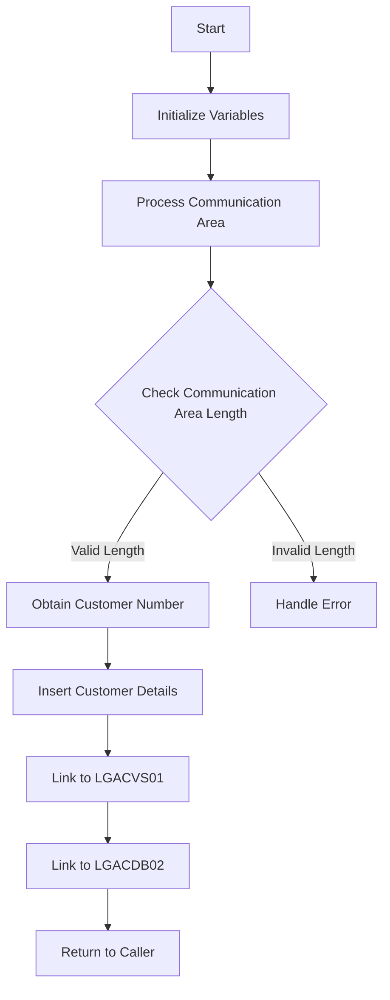

This doc will cover the <SwmToken path="base/src/lgacdb01.cbl" pos="13:6:6" line-data="       PROGRAM-ID. LGACDB01.">`LGACDB01`</SwmToken> program. We'll cover:

1. What the Program Does
2. Program Flow
3. Program Sections

## What the Program Does

The <SwmToken path="base/src/lgacdb01.cbl" pos="13:6:6" line-data="       PROGRAM-ID. LGACDB01.">`LGACDB01`</SwmToken> program is designed to add customer details to the <SwmToken path="base/src/lgacdb01.cbl" pos="142:5:5" line-data="      * initialize DB2 host variables">`DB2`</SwmToken> customer table, creating a new customer entry. It initializes necessary variables, processes the incoming communication area, obtains a customer number, inserts the customer details into the database, and links to other programs for further processing.

## Program Flow

The program follows a structured flow to achieve its purpose. It starts by initializing working storage variables and <SwmToken path="base/src/lgacdb01.cbl" pos="142:5:5" line-data="      * initialize DB2 host variables">`DB2`</SwmToken> host variables. It then processes the incoming communication area, checks its length, and handles errors if the communication area is not received or is of incorrect length. The program then obtains a customer number, inserts the customer details into the <SwmToken path="base/src/lgacdb01.cbl" pos="142:5:5" line-data="      * initialize DB2 host variables">`DB2`</SwmToken> table, and links to other programs for additional processing. Finally, it returns control to the caller.



<SwmSnippet path="/base/src/lgacdb01.cbl" line="128">

---

### MAINLINE SECTION

First, the MAINLINE SECTION initializes working storage variables and <SwmToken path="base/src/lgacdb01.cbl" pos="142:5:5" line-data="      * initialize DB2 host variables">`DB2`</SwmToken> host variables. It processes the incoming communication area, checks its length, and handles errors if the communication area is not received or is of incorrect length. It then calls routines to obtain a customer number and insert customer details into the <SwmToken path="base/src/lgacdb01.cbl" pos="142:5:5" line-data="      * initialize DB2 host variables">`DB2`</SwmToken> table. Finally, it links to other programs for further processing and returns control to the caller.

```cobol
       MAINLINE SECTION.

      *----------------------------------------------------------------*
      * Common code                                                    *
      *----------------------------------------------------------------*
      * initialize working storage variables
           INITIALIZE WS-HEADER.
      * set up general variable
           MOVE EIBTRNID TO WS-TRANSID.
           MOVE EIBTRMID TO WS-TERMID.
           MOVE EIBTASKN TO WS-TASKNUM.
      *----------------------------------------------------------------*


      * initialize DB2 host variables
           INITIALIZE DB2-OUT-INTEGERS.

      *----------------------------------------------------------------*
      * Process incoming commarea                                      *
      *----------------------------------------------------------------*
      * If NO commarea received issue an ABEND
```

---

</SwmSnippet>

<SwmSnippet path="/base/src/lgacdb01.cbl" line="199">

---

### <SwmToken path="base/src/lgacdb01.cbl" pos="199:1:5" line-data="       Obtain-CUSTOMER-Number.">`Obtain-CUSTOMER-Number`</SwmToken>

Now, the program obtains a customer number by calling the CICS Get Counter function. If the response is not normal, it initializes the customer number to zero. Otherwise, it moves the obtained customer number to the <SwmToken path="base/src/lgacdb01.cbl" pos="208:3:3" line-data="             Initialize DB2-CUSTOMERNUM-INT">`DB2`</SwmToken> host variable.

```cobol
       Obtain-CUSTOMER-Number.

           Exec CICS Get Counter(GENAcount)
                         Pool(GENApool)
                         Value(LastCustNum)
                         Resp(WS-RESP)
           End-Exec.
           If WS-RESP Not = DFHRESP(NORMAL)
             MOVE 'NO' TO LGAC-NCS
             Initialize DB2-CUSTOMERNUM-INT
           ELSE
             Move LastCustNum  To DB2-CUSTOMERNUM-INT
           End-If.
```

---

</SwmSnippet>

<SwmSnippet path="/base/src/lgacdb01.cbl" line="214">

---

### <SwmToken path="base/src/lgacdb01.cbl" pos="215:1:3" line-data="       INSERT-CUSTOMER.">`INSERT-CUSTOMER`</SwmToken>

Then, the program inserts the customer details into the <SwmToken path="base/src/lgacdb01.cbl" pos="234:6:6" line-data="                  VALUES ( :DB2-CUSTOMERNUM-INT,">`DB2`</SwmToken> customer table. It constructs the SQL INSERT statement based on whether the customer number counter is on or off. If the SQL execution is successful, it sets the customer number to the identity value assigned by <SwmToken path="base/src/lgacdb01.cbl" pos="234:6:6" line-data="                  VALUES ( :DB2-CUSTOMERNUM-INT,">`DB2`</SwmToken>. If there is an error, it handles the error and returns control to the caller.

```cobol
      *================================================================*
       INSERT-CUSTOMER.
      *================================================================*
      * Insert row into Customer table based on customer number        *
      *================================================================*
           MOVE ' INSERT CUSTOMER' TO EM-SQLREQ
      *================================================================*
           IF LGAC-NCS = 'ON'
             EXEC SQL
               INSERT INTO CUSTOMER
                         ( CUSTOMERNUMBER,
                           FIRSTNAME,
                           LASTNAME,
                           DATEOFBIRTH,
                           HOUSENAME,
                           HOUSENUMBER,
                           POSTCODE,
                           PHONEMOBILE,
                           PHONEHOME,
                           EMAILADDRESS )
                  VALUES ( :DB2-CUSTOMERNUM-INT,
```

---

</SwmSnippet>

<SwmSnippet path="/base/src/lgacdb01.cbl" line="295">

---

### <SwmToken path="base/src/lgacdb01.cbl" pos="295:1:5" line-data="       WRITE-ERROR-MESSAGE.">`WRITE-ERROR-MESSAGE`</SwmToken>

Going into the <SwmToken path="base/src/lgacdb01.cbl" pos="295:1:5" line-data="       WRITE-ERROR-MESSAGE.">`WRITE-ERROR-MESSAGE`</SwmToken> section, the program writes error messages to the queues. It includes the date, time, program name, customer number, policy number, and SQLCODE in the error message. It also writes the communication area data to the queue if it is available.

```cobol
       WRITE-ERROR-MESSAGE.
      * Save SQLCODE in message
           MOVE SQLCODE TO EM-SQLRC
      * Obtain and format current time and date
           EXEC CICS ASKTIME ABSTIME(WS-ABSTIME)
           END-EXEC
           EXEC CICS FORMATTIME ABSTIME(WS-ABSTIME)
                     MMDDYYYY(WS-DATE)
                     TIME(WS-TIME)
           END-EXEC
           MOVE WS-DATE TO EM-DATE
           MOVE WS-TIME TO EM-TIME
      * Write output message to TDQ
           EXEC CICS LINK PROGRAM('LGSTSQ')
                     COMMAREA(ERROR-MSG)
                     LENGTH(LENGTH OF ERROR-MSG)
           END-EXEC.
      * Write 90 bytes or as much as we have of commarea to TDQ
           IF EIBCALEN > 0 THEN
             IF EIBCALEN < 91 THEN
               MOVE DFHCOMMAREA(1:EIBCALEN) TO CA-DATA
```

---

</SwmSnippet>

&nbsp;

*This is an auto-generated document by Swimm 🌊 and has not yet been verified by a human*

<SwmMeta version="3.0.0" repo-id="Z2l0aHViJTNBJTNBa3luZHJ5bC1jaWNzLWdlbmFwcCUzQSUzQVN3aW1tLURlbW8=" repo-name="kyndryl-cics-genapp"><sup>Powered by [Swimm](/)</sup></SwmMeta>
