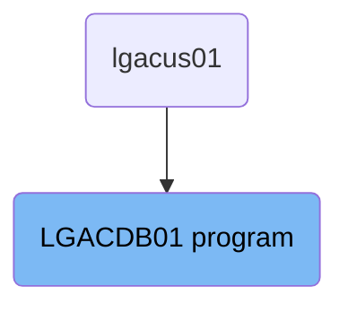
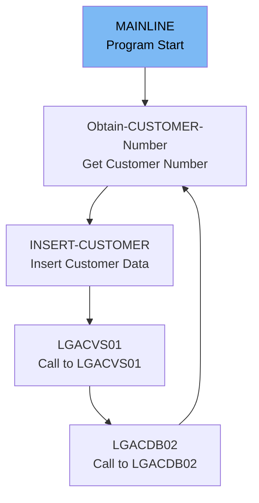

The <SwmToken path="base/src/lgacdb01.cbl" pos="13:6:6" line-data="       PROGRAM-ID. LGACDB01.">`LGACDB01`</SwmToken> program is responsible for inserting customer data into the database. It starts by initializing necessary variables and processing the incoming commarea. The program then obtains a customer number, inserts the customer data into the database, and calls other programs for additional processing.

The <SwmToken path="base/src/lgacdb01.cbl" pos="13:6:6" line-data="       PROGRAM-ID. LGACDB01.">`LGACDB01`</SwmToken> program initializes variables, processes the incoming commarea, retrieves a customer number, inserts customer data into the database, and calls other programs for further processing.

# Where is this program used?

This program is used once, in a flow starting from `lgacus01` as represented in the following diagram:



Lets' zoom into the flow:



<SwmSnippet path="/base/src/lgacdb01.cbl" line="128">

---

## MAINLINE Initialization

First, the <SwmToken path="base/src/lgacdb01.cbl" pos="128:1:1" line-data="       MAINLINE SECTION.">`MAINLINE`</SwmToken> section initializes working storage variables and <SwmToken path="base/src/lgacdb01.cbl" pos="142:5:5" line-data="      * initialize DB2 host variables">`DB2`</SwmToken> host variables. This sets up the necessary environment for the program to run.

```cobol
       MAINLINE SECTION.

      *----------------------------------------------------------------*
      * Common code                                                    *
      *----------------------------------------------------------------*
      * initialize working storage variables
           INITIALIZE WS-HEADER.
      * set up general variable
           MOVE EIBTRNID TO WS-TRANSID.
           MOVE EIBTRMID TO WS-TERMID.
           MOVE EIBTASKN TO WS-TASKNUM.
      *----------------------------------------------------------------*


      * initialize DB2 host variables
           INITIALIZE DB2-OUT-INTEGERS.

```

---

</SwmSnippet>

<SwmSnippet path="/base/src/lgacdb01.cbl" line="146">

---

## Processing Incoming Commarea

Next, the program processes the incoming commarea. If no commarea is received, it issues an ABEND. It also checks the commarea length and sets an error return code if the length is insufficient.

```cobol
      * Process incoming commarea                                      *
      *----------------------------------------------------------------*
      * If NO commarea received issue an ABEND
           IF EIBCALEN IS EQUAL TO ZERO
               MOVE ' NO COMMAREA RECEIVED' TO EM-VARIABLE
               PERFORM WRITE-ERROR-MESSAGE
               EXEC CICS ABEND ABCODE('LGCA') NODUMP END-EXEC
           END-IF

      * initialize commarea return code to zero
           MOVE '00' TO CA-RETURN-CODE
           MOVE EIBCALEN TO WS-CALEN.
           SET WS-ADDR-DFHCOMMAREA TO ADDRESS OF DFHCOMMAREA.

      * check commarea length
           ADD WS-CA-HEADER-LEN TO WS-REQUIRED-CA-LEN
           ADD WS-CUSTOMER-LEN  TO WS-REQUIRED-CA-LEN

      * if less set error return code and return to caller
           IF EIBCALEN IS LESS THAN WS-REQUIRED-CA-LEN
             MOVE '98' TO CA-RETURN-CODE
```

---

</SwmSnippet>

<SwmSnippet path="/base/src/lgacdb01.cbl" line="199">

---

## Obtaining Customer Number

Moving to the <SwmToken path="base/src/lgacdb01.cbl" pos="199:1:5" line-data="       Obtain-CUSTOMER-Number.">`Obtain-CUSTOMER-Number`</SwmToken> paragraph, the program retrieves the next customer number from a counter. If the retrieval is unsuccessful, it initializes the customer number to zero.

```cobol
       Obtain-CUSTOMER-Number.

           Exec CICS Get Counter(GENAcount)
                         Pool(GENApool)
                         Value(LastCustNum)
                         Resp(WS-RESP)
           End-Exec.
           If WS-RESP Not = DFHRESP(NORMAL)
             MOVE 'NO' TO LGAC-NCS
             Initialize DB2-CUSTOMERNUM-INT
           ELSE
             Move LastCustNum  To DB2-CUSTOMERNUM-INT
           End-If.
```

---

</SwmSnippet>

<SwmSnippet path="/base/src/lgacdb01.cbl" line="215">

---

## Inserting Customer Data

Then, in the <SwmToken path="base/src/lgacdb01.cbl" pos="215:1:3" line-data="       INSERT-CUSTOMER.">`INSERT-CUSTOMER`</SwmToken> paragraph, the program inserts a new row into the customer table using the obtained customer number. If the insertion fails, it sets an error return code and writes an error message.

```cobol
       INSERT-CUSTOMER.
      *================================================================*
      * Insert row into Customer table based on customer number        *
      *================================================================*
           MOVE ' INSERT CUSTOMER' TO EM-SQLREQ
      *================================================================*
           IF LGAC-NCS = 'ON'
             EXEC SQL
               INSERT INTO CUSTOMER
                         ( CUSTOMERNUMBER,
                           FIRSTNAME,
                           LASTNAME,
                           DATEOFBIRTH,
                           HOUSENAME,
                           HOUSENUMBER,
                           POSTCODE,
                           PHONEMOBILE,
                           PHONEHOME,
                           EMAILADDRESS )
                  VALUES ( :DB2-CUSTOMERNUM-INT,
                           :CA-FIRST-NAME,
```

---

</SwmSnippet>

<SwmSnippet path="/base/src/lgacdb01.cbl" line="174">

---

## Calling <SwmToken path="base/src/lgacdb01.cbl" pos="174:9:9" line-data="           EXEC CICS LINK Program(LGACVS01)">`LGACVS01`</SwmToken>

Next, the program calls <SwmToken path="base/src/lgacdb01.cbl" pos="174:9:9" line-data="           EXEC CICS LINK Program(LGACVS01)">`LGACVS01`</SwmToken> to perform additional processing related to the customer data.

More about LGACVS01: <SwmLink doc-title="Adding Customer Details (LGACVS01)">[Adding Customer Details (LGACVS01)](/.swm/adding-customer-details-lgacvs01.hw3htysm.sw.md)</SwmLink>

```cobol
           EXEC CICS LINK Program(LGACVS01)
                Commarea(DFHCOMMAREA)
                LENGTH(225)
           END-EXEC.
```

---

</SwmSnippet>

<SwmSnippet path="/base/src/lgacdb01.cbl" line="186">

---

## Calling <SwmToken path="base/src/lgacdb01.cbl" pos="186:9:9" line-data="           EXEC CICS LINK Program(LGACDB02)">`LGACDB02`</SwmToken>

Finally, the program calls <SwmToken path="base/src/lgacdb01.cbl" pos="186:9:9" line-data="           EXEC CICS LINK Program(LGACDB02)">`LGACDB02`</SwmToken> to finalize the customer data insertion process.

More about <SwmToken path="base/src/lgacdb01.cbl" pos="186:9:9" line-data="           EXEC CICS LINK Program(LGACDB02)">`LGACDB02`</SwmToken>: <SwmLink doc-title="Adding Customer Passwords (LGACDB02)">[Adding Customer Passwords (LGACDB02)](/.swm/adding-customer-passwords-lgacdb02.7l3ez3bb.sw.md)</SwmLink>

```cobol
           EXEC CICS LINK Program(LGACDB02)
                Commarea(CDB2AREA)
                LENGTH(32500)
           END-EXEC.
```

---

</SwmSnippet>

&nbsp;

*This is an auto-generated document by Swimm 🌊 and has not yet been verified by a human*

<SwmMeta version="3.0.0" repo-id="Z2l0aHViJTNBJTNBa3luZHJ5bC1jaWNzLWdlbmFwcCUzQSUzQVN3aW1tLURlbW8=" repo-name="kyndryl-cics-genapp"><sup>Powered by [Swimm](https://app.swimm.io/)</sup></SwmMeta>
