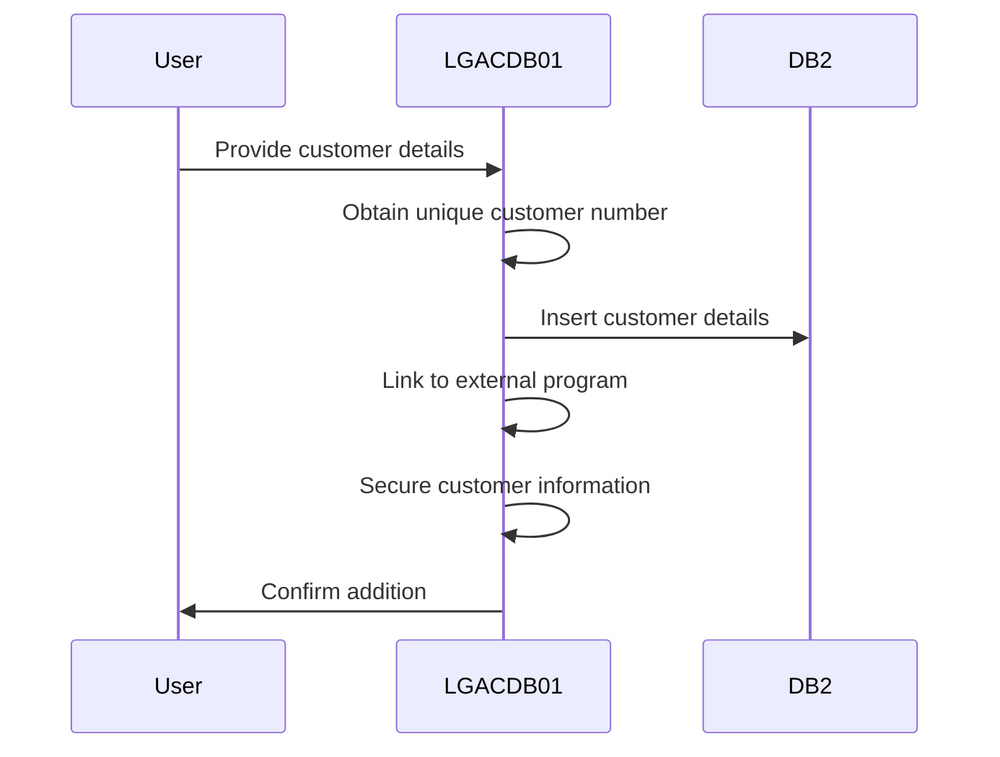
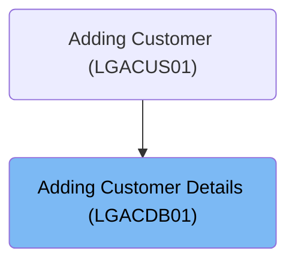
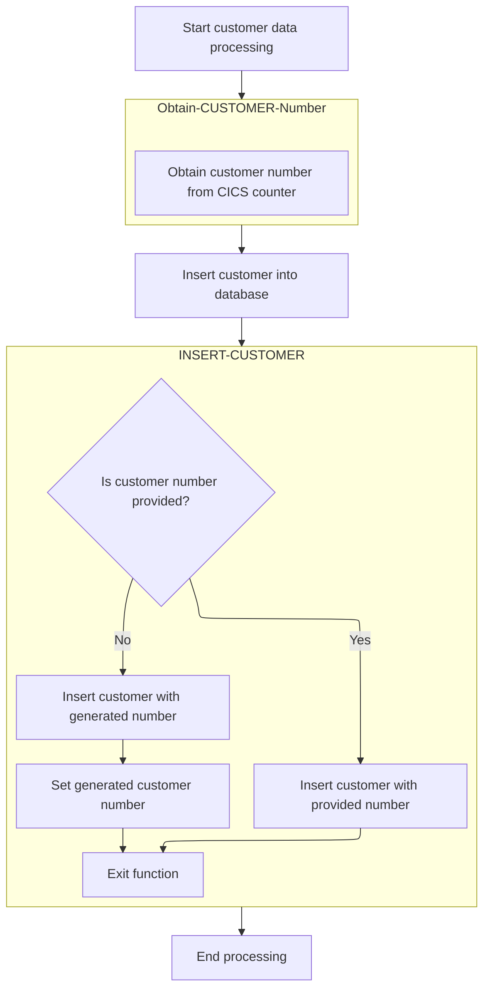
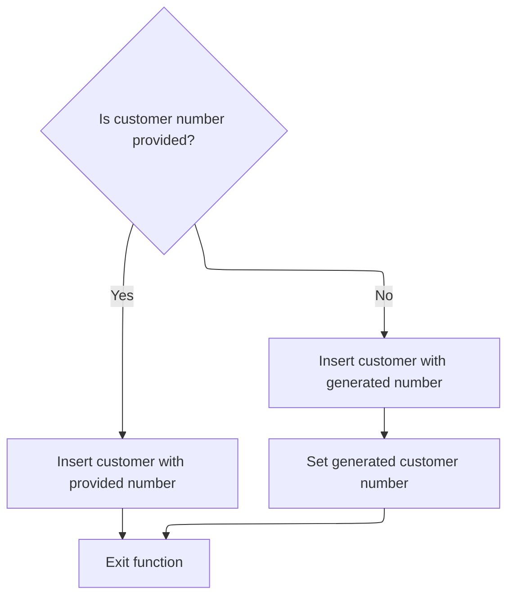

This document describes the process of adding customer details (<SwmToken path="base/src/lgacdb01.cbl" pos="13:6:6" line-data="       PROGRAM-ID. LGACDB01.">`LGACDB01`</SwmToken>). The program is responsible for inserting a new customer's name, address, and date of birth into the <SwmToken path="base/src/lgacdb01.cbl" pos="179:3:3" line-data="           MOVE DB2-CUSTOMERNUM-INT TO D2-CUSTOMER-NUM.">`DB2`</SwmToken> customer table, creating a new customer entry. For example, when a new customer named John Doe with address '123 Elm St' and date of birth '01/01/1980' is added, the program assigns a unique customer number and inserts these details into the <SwmToken path="base/src/lgacdb01.cbl" pos="179:3:3" line-data="           MOVE DB2-CUSTOMERNUM-INT TO D2-CUSTOMER-NUM.">`DB2`</SwmToken> customer table.

The main steps are:

- Obtain a unique customer number
- Insert customer details into the database
- Link to external program for further processing
- Secure customer information
- Return to caller



## Dependencies

### Programs

- <SwmToken path="base/src/lgacdb01.cbl" pos="174:9:9" line-data="           EXEC CICS LINK Program(LGACVS01)">`LGACVS01`</SwmToken> (<SwmPath>[base/src/lgacvs01.cbl](base/src/lgacvs01.cbl)</SwmPath>) - <SwmLink doc-title="Adding Customer Records (LGACVS01)">[Adding Customer Records (LGACVS01)](/.swm/adding-customer-records-lgacvs01.xkh0h9lw.sw.md)</SwmLink>
- LGSTSQ (<SwmPath>[base/src/lgstsq.cbl](base/src/lgstsq.cbl)</SwmPath>) - <SwmLink doc-title="Message Queue Handler (LGSTSQ)">[Message Queue Handler (LGSTSQ)](/.swm/message-queue-handler-lgstsq.e7y8uelv.sw.md)</SwmLink>
- <SwmToken path="base/src/lgacdb01.cbl" pos="186:9:9" line-data="           EXEC CICS LINK Program(LGACDB02)">`LGACDB02`</SwmToken> (<SwmPath>[base/src/lgacdb02.cbl](base/src/lgacdb02.cbl)</SwmPath>) - <SwmLink doc-title="Adding Customer Passwords (LGACDB02)">[Adding Customer Passwords (LGACDB02)](/.swm/adding-customer-passwords-lgacdb02.uhc1uwzy.sw.md)</SwmLink>

### Copybooks

- LGCMAREA (<SwmPath>[base/src/lgcmarea.cpy](base/src/lgcmarea.cpy)</SwmPath>)
- SQLCA
- LGPOLICY (<SwmPath>[base/src/lgpolicy.cpy](base/src/lgpolicy.cpy)</SwmPath>)

# Where is this program used?

This program is used once, as represented in the following diagram:



# Initiating Customer Creation



<SwmSnippet path="/base/src/lgacdb01.cbl" line="171">

---

In <SwmToken path="base/src/lgacdb01.cbl" pos="128:1:1" line-data="       MAINLINE SECTION.">`MAINLINE`</SwmToken>, we start by getting a customer number to uniquely identify the customer, then insert their data into the database, and finally link to <SwmToken path="base/src/lgacdb01.cbl" pos="174:9:9" line-data="           EXEC CICS LINK Program(LGACVS01)">`LGACVS01`</SwmToken> for further data handling.

```cobol
           PERFORM Obtain-CUSTOMER-Number.
           PERFORM INSERT-CUSTOMER.

           EXEC CICS LINK Program(LGACVS01)
                Commarea(DFHCOMMAREA)
                LENGTH(225)
           END-EXEC.
```

---

</SwmSnippet>

## Retrieving Unique Customer Identifier

<SwmSnippet path="/base/src/lgacdb01.cbl" line="199">

---

In <SwmToken path="base/src/lgacdb01.cbl" pos="199:1:5" line-data="       Obtain-CUSTOMER-Number.">`Obtain-CUSTOMER-Number`</SwmToken>, we grab a unique counter from <SwmToken path="base/src/lgacdb01.cbl" pos="202:3:3" line-data="                         Pool(GENApool)">`GENApool`</SwmToken> to ensure each customer has a distinct identifier.

```cobol
       Obtain-CUSTOMER-Number.

           Exec CICS Get Counter(GENAcount)
                         Pool(GENApool)
                         Value(LastCustNum)
                         Resp(WS-RESP)
           End-Exec.
```

---

</SwmSnippet>

<SwmSnippet path="/base/src/lgacdb01.cbl" line="209">

---

We move the counter to <SwmToken path="base/src/lgacdb01.cbl" pos="210:7:11" line-data="             Move LastCustNum  To DB2-CUSTOMERNUM-INT">`DB2-CUSTOMERNUM-INT`</SwmToken> if successful; otherwise, we flag an issue and reset the customer number.

```cobol
           ELSE
             Move LastCustNum  To DB2-CUSTOMERNUM-INT
           End-If.
```

---

</SwmSnippet>

## Inserting Customer Data

<SwmSnippet path="/base/src/lgacdb01.cbl" line="171">

---

After obtaining the customer number in <SwmToken path="base/src/lgacdb01.cbl" pos="128:1:1" line-data="       MAINLINE SECTION.">`MAINLINE`</SwmToken>, we insert their data into the database and link to <SwmToken path="base/src/lgacdb01.cbl" pos="174:9:9" line-data="           EXEC CICS LINK Program(LGACVS01)">`LGACVS01`</SwmToken> for more processing.

```cobol
           PERFORM Obtain-CUSTOMER-Number.
           PERFORM INSERT-CUSTOMER.

           EXEC CICS LINK Program(LGACVS01)
                Commarea(DFHCOMMAREA)
                LENGTH(225)
           END-EXEC.
```

---

</SwmSnippet>

## Adding Customer to Database



<SwmSnippet path="/base/src/lgacdb01.cbl" line="215">

---

In <SwmToken path="base/src/lgacdb01.cbl" pos="215:1:3" line-data="       INSERT-CUSTOMER.">`INSERT-CUSTOMER`</SwmToken>, we check <SwmToken path="base/src/lgacdb01.cbl" pos="221:3:5" line-data="           IF LGAC-NCS = &#39;ON&#39;">`LGAC-NCS`</SwmToken> to decide if we use a specific or default customer number for insertion. We then perform an SQL INSERT to add the customer details into the database using host variables.

```cobol
       INSERT-CUSTOMER.
      *================================================================*
      * Insert row into Customer table based on customer number        *
      *================================================================*
           MOVE ' INSERT CUSTOMER' TO EM-SQLREQ
      *================================================================*
           IF LGAC-NCS = 'ON'
             EXEC SQL
               INSERT INTO CUSTOMER
                         ( CUSTOMERNUMBER,
                           FIRSTNAME,
                           LASTNAME,
                           DATEOFBIRTH,
                           HOUSENAME,
                           HOUSENUMBER,
                           POSTCODE,
                           PHONEMOBILE,
                           PHONEHOME,
                           EMAILADDRESS )
                  VALUES ( :DB2-CUSTOMERNUM-INT,
                           :CA-FIRST-NAME,
                           :CA-LAST-NAME,
                           :CA-DOB,
                           :CA-HOUSE-NAME,
                           :CA-HOUSE-NUM,
                           :CA-POSTCODE,
                           :CA-PHONE-MOBILE,
                           :CA-PHONE-HOME,
                           :CA-EMAIL-ADDRESS )
             END-EXEC
```

---

</SwmSnippet>

<SwmSnippet path="/base/src/lgacdb01.cbl" line="250">

---

We use DEFAULT for customer number insertion when <SwmToken path="base/src/lgacdb01.cbl" pos="221:3:5" line-data="           IF LGAC-NCS = &#39;ON&#39;">`LGAC-NCS`</SwmToken> isn't 'ON', letting the database handle unique assignment.

```cobol
           ELSE
             EXEC SQL
               INSERT INTO CUSTOMER
                         ( CUSTOMERNUMBER,
                           FIRSTNAME,
                           LASTNAME,
                           DATEOFBIRTH,
                           HOUSENAME,
                           HOUSENUMBER,
                           POSTCODE,
                           PHONEMOBILE,
                           PHONEHOME,
                           EMAILADDRESS )
                  VALUES ( DEFAULT,
                           :CA-FIRST-NAME,
                           :CA-LAST-NAME,
                           :CA-DOB,
                           :CA-HOUSE-NAME,
                           :CA-HOUSE-NUM,
                           :CA-POSTCODE,
                           :CA-PHONE-MOBILE,
                           :CA-PHONE-HOME,
                           :CA-EMAIL-ADDRESS )
             END-EXEC
```

---

</SwmSnippet>

<SwmSnippet path="/base/src/lgacdb01.cbl" line="280">

---

We retrieve the assigned customer number using <SwmToken path="base/src/lgacdb01.cbl" pos="281:12:14" line-data="                 SET :DB2-CUSTOMERNUM-INT = IDENTITY_VAL_LOCAL()">`IDENTITY_VAL_LOCAL()`</SwmToken> after default insertion.

```cobol
               EXEC SQL
                 SET :DB2-CUSTOMERNUM-INT = IDENTITY_VAL_LOCAL()
               END-EXEC
           END-IF.

           MOVE DB2-CUSTOMERNUM-INT TO CA-CUSTOMER-NUM.

           EXIT.
```

---

</SwmSnippet>

## Securing Customer Information

<SwmSnippet path="/base/src/lgacdb01.cbl" line="179">

---

After customer insertion in <SwmToken path="base/src/lgacdb01.cbl" pos="128:1:1" line-data="       MAINLINE SECTION.">`MAINLINE`</SwmToken>, we link to <SwmToken path="base/src/lgacdb01.cbl" pos="186:9:9" line-data="           EXEC CICS LINK Program(LGACDB02)">`LGACDB02`</SwmToken> for secure handling of passwords and other security operations.

```cobol
           MOVE DB2-CUSTOMERNUM-INT TO D2-CUSTOMER-NUM.
           Move '02ACUS'     To  D2-REQUEST-ID.
           move '5732fec825535eeafb8fac50fee3a8aa'
                             To  D2-CUSTSECR-PASS.
           Move '0000'       To  D2-CUSTSECR-COUNT.
           Move 'N'          To  D2-CUSTSECR-STATE.

           EXEC CICS LINK Program(LGACDB02)
                Commarea(CDB2AREA)
                LENGTH(32500)
           END-EXEC.

      *    Return to caller
           EXEC CICS RETURN END-EXEC.
```

---

</SwmSnippet>

&nbsp;

*This is an auto-generated document by Swimm 🌊 and has not yet been verified by a human*

<SwmMeta version="3.0.0" repo-id="Z2l0aHViJTNBJTNBa3luZHJ5bC1jaWNzLWdlbmFwcCUzQSUzQVN3aW1tLURlbW8=" repo-name="kyndryl-cics-genapp"><sup>Powered by [Swimm](/)</sup></SwmMeta>
