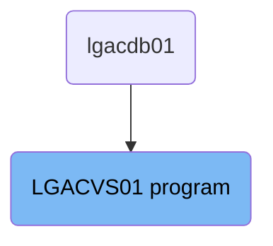
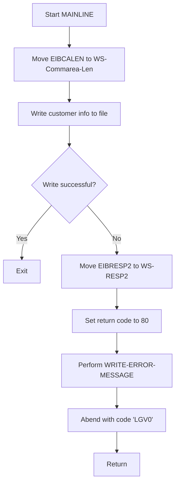

The <SwmToken path="base/src/lgacvs01.cbl" pos="11:6:6" line-data="       PROGRAM-ID. LGACVS01.">`LGACVS01`</SwmToken> program is responsible for writing customer information to a file and handling any errors that occur during this process. This is achieved by moving the length of the communication area, writing the customer information to the file, and performing error handling routines if the write operation fails.

The <SwmToken path="base/src/lgacvs01.cbl" pos="11:6:6" line-data="       PROGRAM-ID. LGACVS01.">`LGACVS01`</SwmToken> program starts by setting up the length of the communication area. It then attempts to write customer information to a file. If the write operation is successful, the program exits. If it fails, the program captures the error response code, sets a return code, performs an error message routine, and abends with a specific code before returning.

# Where is this program used?

This program is used once, in a flow starting from `lgacdb01` as represented in the following diagram:



Lets' zoom into the flow:



<SwmSnippet path="/base/src/lgacvs01.cbl" line="66">

---

## Moving EIBCALEN to <SwmToken path="base/src/lgacvs01.cbl" pos="66:7:11" line-data="           Move EIBCALEN To WS-Commarea-Len.">`WS-Commarea-Len`</SwmToken>

First, the length of the communication area (<SwmToken path="base/src/lgacvs01.cbl" pos="66:3:3" line-data="           Move EIBCALEN To WS-Commarea-Len.">`EIBCALEN`</SwmToken>) is moved to <SwmToken path="base/src/lgacvs01.cbl" pos="66:7:11" line-data="           Move EIBCALEN To WS-Commarea-Len.">`WS-Commarea-Len`</SwmToken>. This sets up the length of the communication area for further processing.

```cobol
           Move EIBCALEN To WS-Commarea-Len.
```

---

</SwmSnippet>

<SwmSnippet path="/base/src/lgacvs01.cbl" line="68">

---

## Writing Customer Information to File

Next, the customer information (<SwmToken path="base/src/lgacvs01.cbl" pos="69:3:7" line-data="                     From(CA-Customer-Num)">`CA-Customer-Num`</SwmToken>) is written to the file 'KSDSCUST'. The length of the record is specified by <SwmToken path="base/src/lgacvs01.cbl" pos="70:3:7" line-data="                     Length(CUSTOMER-RECORD-SIZE)">`CUSTOMER-RECORD-SIZE`</SwmToken>, and the response code is stored in <SwmToken path="base/src/lgacvs01.cbl" pos="73:3:5" line-data="                     RESP(WS-RESP)">`WS-RESP`</SwmToken>.

```cobol
           Exec CICS Write File('KSDSCUST')
                     From(CA-Customer-Num)
                     Length(CUSTOMER-RECORD-SIZE)
                     Ridfld(CA-Customer-Num)
                     KeyLength(10)
                     RESP(WS-RESP)
           End-Exec.
```

---

</SwmSnippet>

<SwmSnippet path="/base/src/lgacvs01.cbl" line="75">

---

## Handling Write Errors

If the write operation is not successful (<SwmToken path="base/src/lgacvs01.cbl" pos="75:3:5" line-data="           If WS-RESP Not = DFHRESP(NORMAL)">`WS-RESP`</SwmToken> is not equal to <SwmToken path="base/src/lgacvs01.cbl" pos="75:11:14" line-data="           If WS-RESP Not = DFHRESP(NORMAL)">`DFHRESP(NORMAL)`</SwmToken>), the error response code (<SwmToken path="base/src/lgacvs01.cbl" pos="76:3:3" line-data="             Move EIBRESP2 To WS-RESP2">`EIBRESP2`</SwmToken>) is moved to <SwmToken path="base/src/lgacvs01.cbl" pos="76:7:9" line-data="             Move EIBRESP2 To WS-RESP2">`WS-RESP2`</SwmToken>, and the return code is set to '80'. The <SwmToken path="base/src/lgacvs01.cbl" pos="78:3:7" line-data="             PERFORM WRITE-ERROR-MESSAGE">`WRITE-ERROR-MESSAGE`</SwmToken> routine is then performed, and the program abends with code <SwmToken path="base/src/lgacvs01.cbl" pos="79:10:10" line-data="             EXEC CICS ABEND ABCODE(&#39;LGV0&#39;) NODUMP END-EXEC">`LGV0`</SwmToken> before returning.

```cobol
           If WS-RESP Not = DFHRESP(NORMAL)
             Move EIBRESP2 To WS-RESP2
             MOVE '80' TO CA-RETURN-CODE
             PERFORM WRITE-ERROR-MESSAGE
             EXEC CICS ABEND ABCODE('LGV0') NODUMP END-EXEC
             EXEC CICS RETURN END-EXEC
           End-If.
```

---

</SwmSnippet>

<SwmSnippet path="/base/src/lgacvs01.cbl" line="89">

---

## Writing Error Message

The <SwmToken path="base/src/lgacvs01.cbl" pos="89:1:5" line-data="       WRITE-ERROR-MESSAGE.">`WRITE-ERROR-MESSAGE`</SwmToken> routine captures the current time and date, and moves these values along with the customer number and response codes into an error message structure. This error message is then linked to the 'LGSTSQ' program for further processing.

More about LGSTSQ: <SwmLink doc-title="Handling Messages (LGSTSQ)">[Handling Messages (LGSTSQ)](/.swm/handling-messages-lgstsq.o6o7rslw.sw.md)</SwmLink>

```cobol
       WRITE-ERROR-MESSAGE.
           EXEC CICS ASKTIME ABSTIME(WS-ABSTIME)
           END-EXEC
           EXEC CICS FORMATTIME ABSTIME(WS-ABSTIME)
                     MMDDYYYY(WS-DATE)
                     TIME(WS-TIME)
           END-EXEC
      *
           MOVE WS-DATE TO EM-DATE
           MOVE WS-TIME TO EM-TIME
           Move CA-Customer-Num To EM-Cusnum
           Move WS-RESP         To EM-RespRC
           Move WS-RESP2        To EM-Resp2RC
           EXEC CICS LINK PROGRAM('LGSTSQ')
                     COMMAREA(ERROR-MSG)
                     LENGTH(LENGTH OF ERROR-MSG)
           END-EXEC.
```

---

</SwmSnippet>

<SwmSnippet path="/base/src/lgacvs01.cbl" line="106">

---

## Handling Communication Area Length

If the communication area length (<SwmToken path="base/src/lgacvs01.cbl" pos="106:3:3" line-data="           IF EIBCALEN &gt; 0 THEN">`EIBCALEN`</SwmToken>) is greater than 0, it checks if it is less than 91. Depending on the length, it moves the appropriate portion of <SwmToken path="base/src/lgacvs01.cbl" pos="108:3:3" line-data="               MOVE DFHCOMMAREA(1:EIBCALEN) TO CA-DATA">`DFHCOMMAREA`</SwmToken> to <SwmToken path="base/src/lgacvs01.cbl" pos="108:12:14" line-data="               MOVE DFHCOMMAREA(1:EIBCALEN) TO CA-DATA">`CA-DATA`</SwmToken> and links this data to the 'LGSTSQ' program for error message processing.

More about LGSTSQ: <SwmLink doc-title="Handling Messages (LGSTSQ)">[Handling Messages (LGSTSQ)](/.swm/handling-messages-lgstsq.o6o7rslw.sw.md)</SwmLink>

```cobol
           IF EIBCALEN > 0 THEN
             IF EIBCALEN < 91 THEN
               MOVE DFHCOMMAREA(1:EIBCALEN) TO CA-DATA
               EXEC CICS LINK PROGRAM('LGSTSQ')
                         COMMAREA(CA-ERROR-MSG)
                         LENGTH(Length Of CA-ERROR-MSG)
               END-EXEC
             ELSE
               MOVE DFHCOMMAREA(1:90) TO CA-DATA
               EXEC CICS LINK PROGRAM('LGSTSQ')
                         COMMAREA(CA-ERROR-MSG)
                         LENGTH(Length Of CA-ERROR-MSG)
               END-EXEC
             END-IF
           END-IF.
```

---

</SwmSnippet>

&nbsp;

*This is an auto-generated document by Swimm 🌊 and has not yet been verified by a human*

<SwmMeta version="3.0.0" repo-id="Z2l0aHViJTNBJTNBa3luZHJ5bC1jaWNzLWdlbmFwcCUzQSUzQVN3aW1tLURlbW8=" repo-name="kyndryl-cics-genapp"><sup>Powered by [Swimm](/)</sup></SwmMeta>
