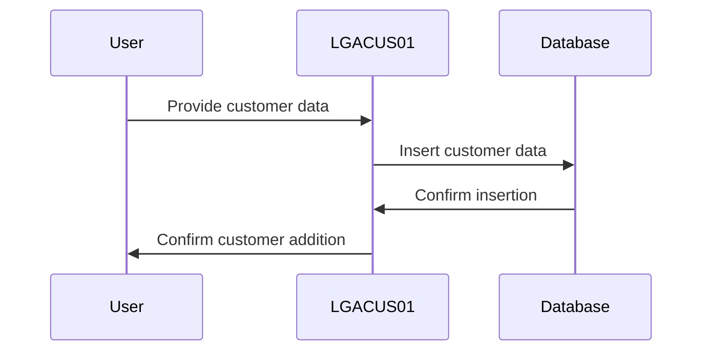
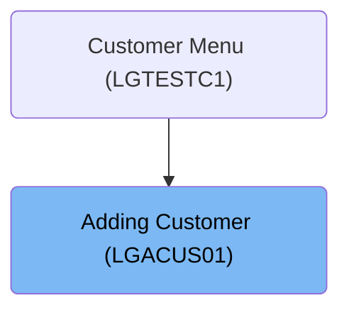

This document outlines the process of adding a new customer using the <SwmToken path="base/src/lgacus01.cbl" pos="11:6:6" line-data="       PROGRAM-ID. LGACUS01.">`LGACUS01`</SwmToken> program. The program is responsible for inserting customer data into the database and confirming the addition.

The main steps are:

- Initiate customer addition process
- Insert customer data into the database
- Confirm successful addition



## Dependencies

### Programs

- <SwmToken path="base/src/lgacus01.cbl" pos="134:9:9" line-data="           EXEC CICS LINK Program(LGACDB01)">`LGACDB01`</SwmToken> (<SwmPath>[base/src/lgacdb01.cbl](base/src/lgacdb01.cbl)</SwmPath>) - <SwmLink doc-title="Adding Customer Details (LGACDB01)">[Adding Customer Details (LGACDB01)](/.swm/adding-customer-details-lgacdb01.x0rajpje.sw.md)</SwmLink>
- LGACVS01 (<SwmPath>[base/src/lgacvs01.cbl](base/src/lgacvs01.cbl)</SwmPath>) - <SwmLink doc-title="Adding Customer Records (LGACVS01)">[Adding Customer Records (LGACVS01)](/.swm/adding-customer-records-lgacvs01.xkh0h9lw.sw.md)</SwmLink>
- LGSTSQ (<SwmPath>[base/src/lgstsq.cbl](base/src/lgstsq.cbl)</SwmPath>) - <SwmLink doc-title="Message Queue Handler (LGSTSQ)">[Message Queue Handler (LGSTSQ)](/.swm/message-queue-handler-lgstsq.e7y8uelv.sw.md)</SwmLink>
- LGACDB02 (<SwmPath>[base/src/lgacdb02.cbl](base/src/lgacdb02.cbl)</SwmPath>) - <SwmLink doc-title="Adding Customer Passwords (LGACDB02)">[Adding Customer Passwords (LGACDB02)](/.swm/adding-customer-passwords-lgacdb02.uhc1uwzy.sw.md)</SwmLink>

### Copybooks

- LGCMAREA (<SwmPath>[base/src/lgcmarea.cpy](base/src/lgcmarea.cpy)</SwmPath>)
- SQLCA
- LGPOLICY (<SwmPath>[base/src/lgpolicy.cpy](base/src/lgpolicy.cpy)</SwmPath>)

# Where is this program used?

This program is used once, as represented in the following diagram:



# Initiating Customer Addition Process

<SwmSnippet path="/base/src/lgacus01.cbl" line="119">

---

<SwmToken path="base/src/lgacus01.cbl" pos="78:1:1" line-data="       MAINLINE SECTION.">`MAINLINE`</SwmToken> starts the customer addition by calling <SwmToken path="base/src/lgacus01.cbl" pos="119:3:5" line-data="           PERFORM INSERT-CUSTOMER.">`INSERT-CUSTOMER`</SwmToken>, which inserts the customer into the <SwmToken path="base/src/lgacus01.cbl" pos="118:15:15" line-data="      * Call routine to Insert row in DB2 Customer table               *">`DB2`</SwmToken> table.

```cobol
           PERFORM INSERT-CUSTOMER.
      
      *----------------------------------------------------------------*
      *
           EXEC CICS RETURN END-EXEC.
```

---

</SwmSnippet>

<SwmSnippet path="/base/src/lgacus01.cbl" line="132">

---

<SwmToken path="base/src/lgacus01.cbl" pos="132:1:3" line-data="       INSERT-CUSTOMER.">`INSERT-CUSTOMER`</SwmToken> uses EXEC CICS LINK to call <SwmToken path="base/src/lgacus01.cbl" pos="134:9:9" line-data="           EXEC CICS LINK Program(LGACDB01)">`LGACDB01`</SwmToken>, passing customer data for <SwmToken path="base/src/lgacus01.cbl" pos="118:15:15" line-data="      * Call routine to Insert row in DB2 Customer table               *">`DB2`</SwmToken> insertion.

```cobol
       INSERT-CUSTOMER.

           EXEC CICS LINK Program(LGACDB01)
                Commarea(DFHCOMMAREA)
                LENGTH(32500)
           END-EXEC.
      **********

           EXIT.
```

---

</SwmSnippet>

&nbsp;

*This is an auto-generated document by Swimm 🌊 and has not yet been verified by a human*

<SwmMeta version="3.0.0" repo-id="Z2l0aHViJTNBJTNBa3luZHJ5bC1jaWNzLWdlbmFwcCUzQSUzQVN3aW1tLURlbW8=" repo-name="kyndryl-cics-genapp"><sup>Powered by [Swimm](/)</sup></SwmMeta>
