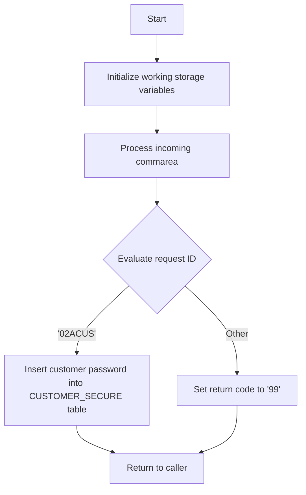

This document will cover the <SwmToken path="base/src/lgacdb02.cbl" pos="13:6:6" line-data="       PROGRAM-ID. LGACDB02.">`LGACDB02`</SwmToken> program. We'll cover:

1. What the Program Does
2. Program Flow
3. Program Sections

## What the Program Does

The <SwmToken path="base/src/lgacdb02.cbl" pos="13:6:6" line-data="       PROGRAM-ID. LGACDB02.">`LGACDB02`</SwmToken> program is designed to add a customer's password to the security table with details. The default password is a <SwmToken path="base/src/lgacdb02.cbl" pos="9:12:12" line-data="      *  details. Default password is BD5 checksum                     *">`BD5`</SwmToken> checksum. The program initializes working storage variables, processes the incoming communication area (commarea), and based on the request ID, it either inserts a new customer password into the <SwmToken path="base/src/lgacdb02.cbl" pos="167:5:5" line-data="             INSERT INTO CUSTOMER_SECURE">`CUSTOMER_SECURE`</SwmToken> table or returns an error code.

## Program Flow

The program follows these high-level steps:

1. Initialize working storage variables.
2. Process the incoming commarea.
3. Evaluate the request ID.
4. If the request ID is <SwmToken path="base/src/lgacdb02.cbl" pos="145:4:4" line-data="             When &#39;02ACUS&#39;">`02ACUS`</SwmToken>, insert the customer password into the <SwmToken path="base/src/lgacdb02.cbl" pos="167:5:5" line-data="             INSERT INTO CUSTOMER_SECURE">`CUSTOMER_SECURE`</SwmToken> table.
5. If the request ID is anything else, set the return code to '99' and return to the caller.
6. Return to the caller.



<SwmSnippet path="/base/src/lgacdb02.cbl" line="115">

---

### MAINLINE SECTION

First, the MAINLINE SECTION initializes working storage variables, processes the incoming commarea, and evaluates the request ID. If the request ID is <SwmToken path="base/src/lgacdb02.cbl" pos="145:4:4" line-data="             When &#39;02ACUS&#39;">`02ACUS`</SwmToken>, it performs the <SwmToken path="base/src/lgacdb02.cbl" pos="161:1:5" line-data="       INSERT-CUSTOMER-PASSWORD.">`INSERT-CUSTOMER-PASSWORD`</SwmToken> section. If the request ID is anything else, it sets the return code to '99' and returns to the caller.

```cobol
       MAINLINE SECTION.

      *----------------------------------------------------------------*
      * Common code                                                    *
      *----------------------------------------------------------------*
      * initialize working storage variables
           INITIALIZE WS-HEADER.
      * set up general variable
           MOVE EIBTRNID TO WS-TRANSID.
           MOVE EIBTRMID TO WS-TERMID.
           MOVE EIBTASKN TO WS-TASKNUM.

      *----------------------------------------------------------------*
      * Process incoming commarea                                      *
      *----------------------------------------------------------------*
      * If NO commarea received issue an ABEND
           IF EIBCALEN IS EQUAL TO ZERO
               MOVE ' NO COMMAREA RECEIVED' TO EM-VARIABLE
               PERFORM WRITE-ERROR-MESSAGE
               EXEC CICS ABEND ABCODE('LGCA') NODUMP END-EXEC
           END-IF
```

---

</SwmSnippet>

<SwmSnippet path="/base/src/lgacdb02.cbl" line="161">

---

### <SwmToken path="base/src/lgacdb02.cbl" pos="161:1:5" line-data="       INSERT-CUSTOMER-PASSWORD.">`INSERT-CUSTOMER-PASSWORD`</SwmToken>

Next, the <SwmToken path="base/src/lgacdb02.cbl" pos="161:1:5" line-data="       INSERT-CUSTOMER-PASSWORD.">`INSERT-CUSTOMER-PASSWORD`</SwmToken> section inserts a new row into the <SwmToken path="base/src/lgacdb02.cbl" pos="167:5:5" line-data="             INSERT INTO CUSTOMER_SECURE">`CUSTOMER_SECURE`</SwmToken> table with the customer number, password, state indicator, and password changes count. If the SQLCODE is not equal to 0, it sets the return code to '98', performs the <SwmToken path="base/src/lgacdb02.cbl" pos="180:3:7" line-data="             PERFORM WRITE-ERROR-MESSAGE">`WRITE-ERROR-MESSAGE`</SwmToken> section, and returns to the caller.

```cobol
       INSERT-CUSTOMER-PASSWORD.
      *================================================================*
      * Insert row into Customer Secure Table                          *
      *================================================================*
           MOVE ' INSERT SECURITY' TO EM-SQLREQ
           EXEC SQL
             INSERT INTO CUSTOMER_SECURE
                       ( customerNumber,
                         customerPass,
                         state_indicator,
                         pass_changes   )
                VALUES ( :DB2-CUSTOMERNUM-INT,
                         :D2-CUSTSECR-PASS,
                         :D2-CUSTSECR-STATE,
                         :DB2-CUSTOMERCNT-INT)
           END-EXEC

           IF SQLCODE NOT EQUAL 0
             MOVE '98' TO D2-RETURN-CODE
             PERFORM WRITE-ERROR-MESSAGE
             EXEC CICS RETURN END-EXEC
```

---

</SwmSnippet>

<SwmSnippet path="/base/src/lgacdb02.cbl" line="192">

---

### <SwmToken path="base/src/lgacdb02.cbl" pos="192:1:5" line-data="       WRITE-ERROR-MESSAGE.">`WRITE-ERROR-MESSAGE`</SwmToken>

Then, the <SwmToken path="base/src/lgacdb02.cbl" pos="192:1:5" line-data="       WRITE-ERROR-MESSAGE.">`WRITE-ERROR-MESSAGE`</SwmToken> section writes an error message to the queues. It saves the SQLCODE in the message, obtains and formats the current time and date, and writes the output message to the Transient Data Queue (TDQ) by calling the LGSTSQ program. If the commarea length is greater than 0, it writes up to 90 bytes of the commarea to the TDQ.

```cobol
       WRITE-ERROR-MESSAGE.
      * Save SQLCODE in message
           MOVE SQLCODE TO EM-SQLRC
      * Obtain and format current time and date
           EXEC CICS ASKTIME ABSTIME(WS-ABSTIME)
           END-EXEC
           EXEC CICS FORMATTIME ABSTIME(WS-ABSTIME)
                     MMDDYYYY(WS-DATE)
                     TIME(WS-TIME)
           END-EXEC
           MOVE WS-DATE TO EM-DATE
           MOVE WS-TIME TO EM-TIME
      * Write output message to TDQ
           EXEC CICS LINK PROGRAM('LGSTSQ')
                     COMMAREA(ERROR-MSG)
                     LENGTH(LENGTH OF ERROR-MSG)
           END-EXEC.
      * Write 90 bytes or as much as we have of commarea to TDQ
           IF EIBCALEN > 0 THEN
             IF EIBCALEN < 91 THEN
               MOVE DFHCOMMAREA(1:EIBCALEN) TO CA-DATA
```

---

</SwmSnippet>

&nbsp;

*This is an auto-generated document by Swimm 🌊 and has not yet been verified by a human*

<SwmMeta version="3.0.0" repo-id="Z2l0aHViJTNBJTNBa3luZHJ5bC1jaWNzLWdlbmFwcCUzQSUzQVN3aW1tLURlbW8=" repo-name="kyndryl-cics-genapp"><sup>Powered by [Swimm](/)</sup></SwmMeta>
