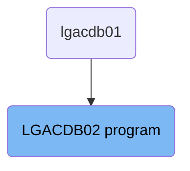
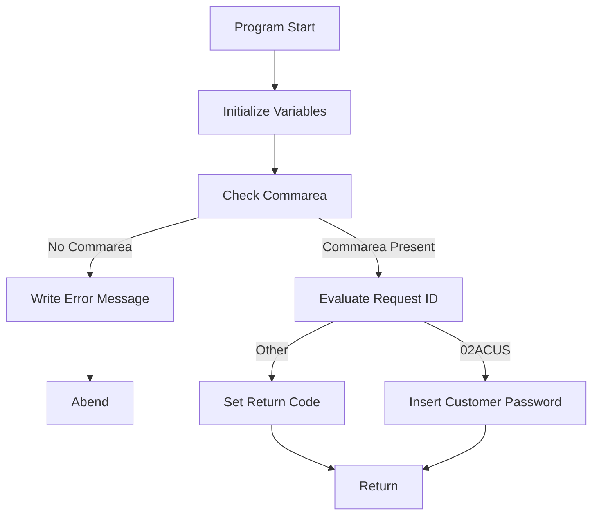

The <SwmToken path="base/src/lgacdb02.cbl" pos="13:6:6" line-data="       PROGRAM-ID. LGACDB02.">`LGACDB02`</SwmToken> program is responsible for handling customer password insertions in the insurance application. It initializes variables, checks for the presence of a commarea, evaluates the request ID, and inserts customer passwords into the database. If any errors occur during the process, it writes error messages and handles the abend.

The <SwmToken path="base/src/lgacdb02.cbl" pos="13:6:6" line-data="       PROGRAM-ID. LGACDB02.">`LGACDB02`</SwmToken> program starts by initializing necessary variables and checking if a commarea is present. If no commarea is found, it writes an error message and abends. If a commarea is present, it evaluates the request ID. For a specific request ID, it inserts customer password data into the database. If the insertion fails, it writes an error message and sets a return code. Finally, it returns control to the calling program.

# Where is this program used?

This program is used once, in a flow starting from `lgacdb01` as represented in the following diagram:



Lets' zoom into the flow:



<SwmSnippet path="/base/src/lgacdb02.cbl" line="120">

---

## Initialize Variables

First, the program initializes working storage variables and sets up general variables like <SwmToken path="base/src/lgacdb02.cbl" pos="123:7:9" line-data="           MOVE EIBTRNID TO WS-TRANSID.">`WS-TRANSID`</SwmToken>, <SwmToken path="base/src/lgacdb02.cbl" pos="124:7:9" line-data="           MOVE EIBTRMID TO WS-TERMID.">`WS-TERMID`</SwmToken>, and <SwmToken path="base/src/lgacdb02.cbl" pos="125:7:9" line-data="           MOVE EIBTASKN TO WS-TASKNUM.">`WS-TASKNUM`</SwmToken> to prepare for processing.

```cobol
      * initialize working storage variables
           INITIALIZE WS-HEADER.
      * set up general variable
           MOVE EIBTRNID TO WS-TRANSID.
           MOVE EIBTRMID TO WS-TERMID.
           MOVE EIBTASKN TO WS-TASKNUM.
```

---

</SwmSnippet>

<SwmSnippet path="/base/src/lgacdb02.cbl" line="130">

---

## Check Commarea

Next, the program checks if the <SwmToken path="base/src/lgacdb02.cbl" pos="131:3:3" line-data="           IF EIBCALEN IS EQUAL TO ZERO">`EIBCALEN`</SwmToken> is zero, indicating no commarea was received. If no commarea is present, it moves an error message to <SwmToken path="base/src/lgacdb02.cbl" pos="132:14:16" line-data="               MOVE &#39; NO COMMAREA RECEIVED&#39; TO EM-VARIABLE">`EM-VARIABLE`</SwmToken>, performs <SwmToken path="base/src/lgacdb02.cbl" pos="133:3:7" line-data="               PERFORM WRITE-ERROR-MESSAGE">`WRITE-ERROR-MESSAGE`</SwmToken>, and issues an ABEND with code 'LGCA'.

```cobol
      * If NO commarea received issue an ABEND
           IF EIBCALEN IS EQUAL TO ZERO
               MOVE ' NO COMMAREA RECEIVED' TO EM-VARIABLE
               PERFORM WRITE-ERROR-MESSAGE
               EXEC CICS ABEND ABCODE('LGCA') NODUMP END-EXEC
           END-IF
```

---

</SwmSnippet>

<SwmSnippet path="/base/src/lgacdb02.cbl" line="143">

---

## Evaluate Request ID

Then, the program evaluates the <SwmToken path="base/src/lgacdb02.cbl" pos="143:3:7" line-data="           Evaluate D2-REQUEST-ID">`D2-REQUEST-ID`</SwmToken>. If the ID is <SwmToken path="base/src/lgacdb02.cbl" pos="145:4:4" line-data="             When &#39;02ACUS&#39;">`02ACUS`</SwmToken>, it moves customer-related data to <SwmToken path="base/src/lgacdb02.cbl" pos="146:11:11" line-data="               Move D2-CUSTOMER-NUM    To DB2-CUSTOMERNUM-INT">`DB2`</SwmToken> variables and performs <SwmToken path="base/src/lgacdb02.cbl" pos="148:3:7" line-data="               Perform INSERT-CUSTOMER-PASSWORD">`INSERT-CUSTOMER-PASSWORD`</SwmToken>. For any other ID, it sets the return code to '99' and returns.

```cobol
           Evaluate D2-REQUEST-ID
      *      New Customer add
             When '02ACUS'
               Move D2-CUSTOMER-NUM    To DB2-CUSTOMERNUM-INT
               Move D2-CUSTSECR-COUNT  To DB2-CUSTOMERCNT-INT
               Perform INSERT-CUSTOMER-PASSWORD
             When Other
               Move '99' To D2-RETURN-CODE
               Exec CICS Return End-EXEC
           End-Evaluate
```

---

</SwmSnippet>

<SwmSnippet path="/base/src/lgacdb02.cbl" line="161">

---

## Insert Customer Password

Moving to the <SwmToken path="base/src/lgacdb02.cbl" pos="161:1:5" line-data="       INSERT-CUSTOMER-PASSWORD.">`INSERT-CUSTOMER-PASSWORD`</SwmToken> paragraph, the program inserts a new row into the <SwmToken path="base/src/lgacdb02.cbl" pos="167:5:5" line-data="             INSERT INTO CUSTOMER_SECURE">`CUSTOMER_SECURE`</SwmToken> table with customer number, password, state indicator, and password changes. If the SQL operation fails, it sets the return code to '98', performs <SwmToken path="base/src/lgacdb02.cbl" pos="180:3:7" line-data="             PERFORM WRITE-ERROR-MESSAGE">`WRITE-ERROR-MESSAGE`</SwmToken>, and returns.

```cobol
       INSERT-CUSTOMER-PASSWORD.
      *================================================================*
      * Insert row into Customer Secure Table                          *
      *================================================================*
           MOVE ' INSERT SECURITY' TO EM-SQLREQ
           EXEC SQL
             INSERT INTO CUSTOMER_SECURE
                       ( customerNumber,
                         customerPass,
                         state_indicator,
                         pass_changes   )
                VALUES ( :DB2-CUSTOMERNUM-INT,
                         :D2-CUSTSECR-PASS,
                         :D2-CUSTSECR-STATE,
                         :DB2-CUSTOMERCNT-INT)
           END-EXEC

           IF SQLCODE NOT EQUAL 0
             MOVE '98' TO D2-RETURN-CODE
             PERFORM WRITE-ERROR-MESSAGE
             EXEC CICS RETURN END-EXEC
```

---

</SwmSnippet>

<SwmSnippet path="/base/src/lgacdb02.cbl" line="192">

---

## Write Error Message

Diving into <SwmToken path="base/src/lgacdb02.cbl" pos="192:1:5" line-data="       WRITE-ERROR-MESSAGE.">`WRITE-ERROR-MESSAGE`</SwmToken>, the program saves the SQLCODE in the message, obtains and formats the current time and date, and writes the output message to the TDQ. If the commarea length is greater than zero, it writes up to 90 bytes of the commarea to the TDQ.

```cobol
       WRITE-ERROR-MESSAGE.
      * Save SQLCODE in message
           MOVE SQLCODE TO EM-SQLRC
      * Obtain and format current time and date
           EXEC CICS ASKTIME ABSTIME(WS-ABSTIME)
           END-EXEC
           EXEC CICS FORMATTIME ABSTIME(WS-ABSTIME)
                     MMDDYYYY(WS-DATE)
                     TIME(WS-TIME)
           END-EXEC
           MOVE WS-DATE TO EM-DATE
           MOVE WS-TIME TO EM-TIME
      * Write output message to TDQ
           EXEC CICS LINK PROGRAM('LGSTSQ')
                     COMMAREA(ERROR-MSG)
                     LENGTH(LENGTH OF ERROR-MSG)
           END-EXEC.
      * Write 90 bytes or as much as we have of commarea to TDQ
           IF EIBCALEN > 0 THEN
             IF EIBCALEN < 91 THEN
               MOVE DFHCOMMAREA(1:EIBCALEN) TO CA-DATA
```

---

</SwmSnippet>

&nbsp;

*This is an auto-generated document by Swimm 🌊 and has not yet been verified by a human*

<SwmMeta version="3.0.0" repo-id="Z2l0aHViJTNBJTNBa3luZHJ5bC1jaWNzLWdlbmFwcCUzQSUzQVN3aW1tLURlbW8=" repo-name="kyndryl-cics-genapp"><sup>Powered by [Swimm](/)</sup></SwmMeta>
