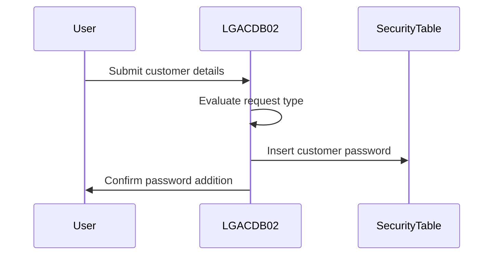
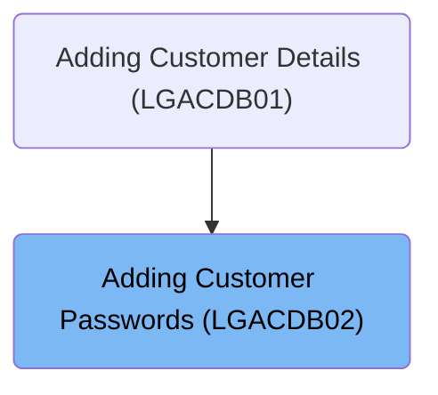

This document describes the process of adding customer passwords to the security table using the <SwmToken path="base/src/lgacdb02.cbl" pos="13:6:6" line-data="       PROGRAM-ID. LGACDB02.">`LGACDB02`</SwmToken> program. Within the customer management system, this program handles the addition of passwords to enhance security.

For example, for a new customer with ID <SwmToken path="base/src/lgacdb02.cbl" pos="145:4:4" line-data="             When &#39;02ACUS&#39;">`02ACUS`</SwmToken>, the program moves their details to <SwmToken path="base/src/lgacdb02.cbl" pos="146:11:11" line-data="               Move D2-CUSTOMER-NUM    To DB2-CUSTOMERNUM-INT">`DB2`</SwmToken> variables and inserts their password into the security table.

The main steps are:

- Evaluate request type
- Move customer details to <SwmToken path="base/src/lgacdb02.cbl" pos="146:11:11" line-data="               Move D2-CUSTOMER-NUM    To DB2-CUSTOMERNUM-INT">`DB2`</SwmToken> variables
- Insert customer password into the security table



## Dependencies

### Program

- LGSTSQ (<SwmPath>[base/src/lgstsq.cbl](base/src/lgstsq.cbl)</SwmPath>) - <SwmLink doc-title="Message Queue Handler (LGSTSQ)">[Message Queue Handler (LGSTSQ)](/.swm/message-queue-handler-lgstsq.e7y8uelv.sw.md)</SwmLink>

### Copybooks

- SQLCA
- LGPOLICY (<SwmPath>[base/src/lgpolicy.cpy](base/src/lgpolicy.cpy)</SwmPath>)

# Where is this program used?

This program is used once, as represented in the following diagram:



# Processing Customer Addition Requests

<SwmSnippet path="/base/src/lgacdb02.cbl" line="138">

---

<SwmToken path="base/src/lgacdb02.cbl" pos="115:1:1" line-data="       MAINLINE SECTION.">`MAINLINE`</SwmToken> kicks off the process by evaluating the request type using <SwmToken path="base/src/lgacdb02.cbl" pos="143:3:7" line-data="           Evaluate D2-REQUEST-ID">`D2-REQUEST-ID`</SwmToken>. If it's <SwmToken path="base/src/lgacdb02.cbl" pos="145:4:4" line-data="             When &#39;02ACUS&#39;">`02ACUS`</SwmToken>, it moves customer details to <SwmToken path="base/src/lgacdb02.cbl" pos="146:11:11" line-data="               Move D2-CUSTOMER-NUM    To DB2-CUSTOMERNUM-INT">`DB2`</SwmToken> variables and calls <SwmToken path="base/src/lgacdb02.cbl" pos="148:3:7" line-data="               Perform INSERT-CUSTOMER-PASSWORD">`INSERT-CUSTOMER-PASSWORD`</SwmToken> to handle password insertion. For other IDs, it sets a return code and exits.

```cobol
           MOVE '00' TO D2-RETURN-CODE
           MOVE EIBCALEN TO WS-CALEN.
           SET WS-ADDR-DFHCOMMAREA TO ADDRESS OF DFHCOMMAREA.

      * Different types of security add
           Evaluate D2-REQUEST-ID
      *      New Customer add
             When '02ACUS'
               Move D2-CUSTOMER-NUM    To DB2-CUSTOMERNUM-INT
               Move D2-CUSTSECR-COUNT  To DB2-CUSTOMERCNT-INT
               Perform INSERT-CUSTOMER-PASSWORD
             When Other
               Move '99' To D2-RETURN-CODE
               Exec CICS Return End-EXEC
           End-Evaluate

      *    Return to caller
           EXEC CICS RETURN END-EXEC.
```

---

</SwmSnippet>

<SwmSnippet path="/base/src/lgacdb02.cbl" line="161">

---

<SwmToken path="base/src/lgacdb02.cbl" pos="161:1:5" line-data="       INSERT-CUSTOMER-PASSWORD.">`INSERT-CUSTOMER-PASSWORD`</SwmToken> executes SQL to securely insert customer passwords into the database.

```cobol
       INSERT-CUSTOMER-PASSWORD.
      *================================================================*
      * Insert row into Customer Secure Table                          *
      *================================================================*
           MOVE ' INSERT SECURITY' TO EM-SQLREQ
           EXEC SQL
             INSERT INTO CUSTOMER_SECURE
                       ( customerNumber,
                         customerPass,
                         state_indicator,
                         pass_changes   )
                VALUES ( :DB2-CUSTOMERNUM-INT,
                         :D2-CUSTSECR-PASS,
                         :D2-CUSTSECR-STATE,
                         :DB2-CUSTOMERCNT-INT)
           END-EXEC
```

---

</SwmSnippet>

&nbsp;

*This is an auto-generated document by Swimm 🌊 and has not yet been verified by a human*

<SwmMeta version="3.0.0" repo-id="Z2l0aHViJTNBJTNBa3luZHJ5bC1jaWNzLWdlbmFwcCUzQSUzQVN3aW1tLURlbW8=" repo-name="kyndryl-cics-genapp"><sup>Powered by [Swimm](/)</sup></SwmMeta>
