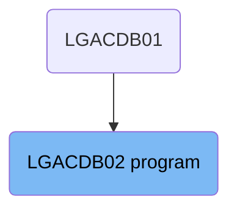

The <SwmToken path="base/src/lgacdb02.cbl" pos="13:6:6" line-data="       PROGRAM-ID. LGACDB02.">`LGACDB02`</SwmToken> program is responsible for handling different types of requests in the system. It evaluates the <SwmToken path="base/src/lgacdb02.cbl" pos="96:3:7" line-data="           03 D2-REQUEST-ID            PIC X(6).">`D2-REQUEST-ID`</SwmToken> to determine the type of request and directs the flow to the appropriate handling logic. For example, if the request ID is <SwmToken path="base/src/lgacdb02.cbl" pos="145:4:4" line-data="             When &#39;02ACUS&#39;">`02ACUS`</SwmToken>, it inserts the customer password.

The <SwmToken path="base/src/lgacdb02.cbl" pos="13:6:6" line-data="       PROGRAM-ID. LGACDB02.">`LGACDB02`</SwmToken> program first checks the type of request using the <SwmToken path="base/src/lgacdb02.cbl" pos="96:3:7" line-data="           03 D2-REQUEST-ID            PIC X(6).">`D2-REQUEST-ID`</SwmToken>. Depending on the request type, it either inserts a customer password or handles other types of requests accordingly.

# Where is this program used?

This program is used once, in a flow starting from `LGACDB01` as represented in the following diagram:



Lets' zoom into the flow:

<SwmSnippet path="/base/src/lgacdb02.cbl" line="221">

---

## Evaluating <SwmToken path="base/src/lgacdb02.cbl" pos="96:3:7" line-data="           03 D2-REQUEST-ID            PIC X(6).">`D2-REQUEST-ID`</SwmToken>

First, the program evaluates the <SwmToken path="base/src/lgacdb02.cbl" pos="96:3:7" line-data="           03 D2-REQUEST-ID            PIC X(6).">`D2-REQUEST-ID`</SwmToken> to determine the type of request being processed. This is crucial for directing the flow to the appropriate handling logic based on the request type.

```cobol
                         LENGTH(LENGTH OF CA-ERROR-MSG)
               END-EXEC
             END-IF
           END-IF.
           EXIT.

```

---

</SwmSnippet>

<SwmSnippet path="/base/src/lgacdb02.cbl" line="232">

---

## Handling <SwmToken path="base/src/lgacdb02.cbl" pos="145:4:4" line-data="             When &#39;02ACUS&#39;">`02ACUS`</SwmToken> Request

Next, if the <SwmToken path="base/src/lgacdb02.cbl" pos="96:3:7" line-data="           03 D2-REQUEST-ID            PIC X(6).">`D2-REQUEST-ID`</SwmToken> is <SwmToken path="base/src/lgacdb02.cbl" pos="145:4:4" line-data="             When &#39;02ACUS&#39;">`02ACUS`</SwmToken>, the program proceeds to insert the customer password. This involves calling the <SwmToken path="base/src/lgacdb02.cbl" pos="148:3:7" line-data="               Perform INSERT-CUSTOMER-PASSWORD">`INSERT-CUSTOMER-PASSWORD`</SwmToken> function, which manages the necessary operations for password insertion.

```cobol

```

---

</SwmSnippet>

<SwmSnippet path="/base/src/lgacdb02.cbl" line="242">

---

## Handling Other Requests

Then, if the <SwmToken path="base/src/lgacdb02.cbl" pos="96:3:7" line-data="           03 D2-REQUEST-ID            PIC X(6).">`D2-REQUEST-ID`</SwmToken> is not <SwmToken path="base/src/lgacdb02.cbl" pos="145:4:4" line-data="             When &#39;02ACUS&#39;">`02ACUS`</SwmToken>, the program handles other types of requests accordingly. This ensures that all possible request types are managed appropriately.

```cobol

```

---

</SwmSnippet>

&nbsp;

*This is an auto-generated document by Swimm 🌊 and has not yet been verified by a human*

<SwmMeta version="3.0.0" repo-id="Z2l0aHViJTNBJTNBa3luZHJ5bC1jaWNzLWdlbmFwcCUzQSUzQVN3aW1tLURlbW8=" repo-name="kyndryl-cics-genapp"><sup>Powered by [Swimm](https://app.swimm.io/)</sup></SwmMeta>
