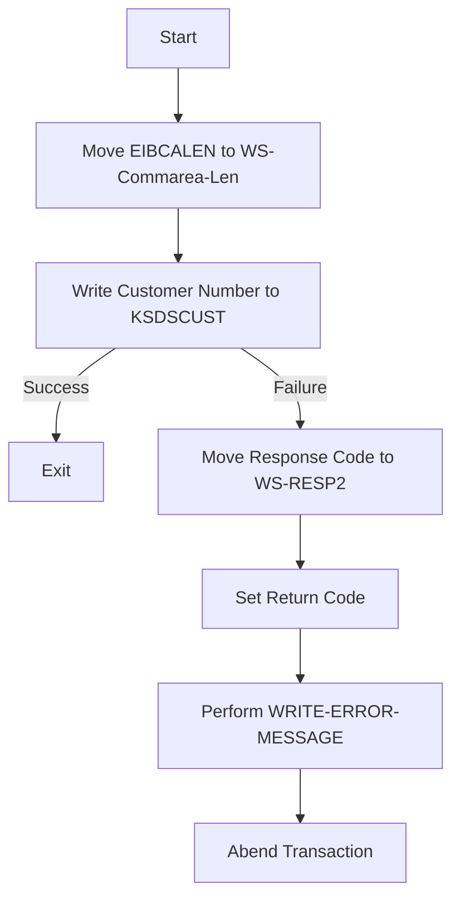

This document will cover the <SwmToken path="base/src/lgacvs01.cbl" pos="11:6:6" line-data="       PROGRAM-ID. LGACVS01.">`LGACVS01`</SwmToken> program. We'll cover:

1. What the Program Does
2. Program Flow
3. Program Sections

## What the Program Does

The <SwmToken path="base/src/lgacvs01.cbl" pos="11:6:6" line-data="       PROGRAM-ID. LGACVS01.">`LGACVS01`</SwmToken> program is designed to add a customer record to a VSAM KSDS file named 'KSDSCUST'. The program writes the customer number from the communication area <SwmToken path="base/src/lgacvs01.cbl" pos="69:2:7" line-data="                     From(CA-Customer-Num)">`(CA-Customer-Num`</SwmToken>) to the file. If the write operation is unsuccessful, it logs an error message and abends the transaction.

## Program Flow

The program flow of <SwmToken path="base/src/lgacvs01.cbl" pos="11:6:6" line-data="       PROGRAM-ID. LGACVS01.">`LGACVS01`</SwmToken> is as follows:

1. The program starts by moving the length of the communication area (EIBCALEN) to <SwmToken path="base/src/lgacvs01.cbl" pos="66:7:11" line-data="           Move EIBCALEN To WS-Commarea-Len.">`WS-Commarea-Len`</SwmToken>.
2. It then attempts to write the customer number to the 'KSDSCUST' file using the CICS WRITE FILE command.
3. If the write operation is not successful, it moves the response code to <SwmToken path="base/src/lgacvs01.cbl" pos="76:7:9" line-data="             Move EIBRESP2 To WS-RESP2">`WS-RESP2`</SwmToken>, sets a return code, performs the <SwmToken path="base/src/lgacvs01.cbl" pos="78:3:7" line-data="             PERFORM WRITE-ERROR-MESSAGE">`WRITE-ERROR-MESSAGE`</SwmToken> section, and abends the transaction.
4. If the write operation is successful, the program exits.



<SwmSnippet path="/base/src/lgacvs01.cbl" line="63">

---

### MAINLINE SECTION

First, the program moves the length of the communication area (EIBCALEN) to <SwmToken path="base/src/lgacvs01.cbl" pos="66:7:11" line-data="           Move EIBCALEN To WS-Commarea-Len.">`WS-Commarea-Len`</SwmToken>. Then, it attempts to write the customer number to the 'KSDSCUST' file using the CICS WRITE FILE command. If the write operation is not successful, it moves the response code to <SwmToken path="base/src/lgacvs01.cbl" pos="76:7:9" line-data="             Move EIBRESP2 To WS-RESP2">`WS-RESP2`</SwmToken>, sets a return code, performs the <SwmToken path="base/src/lgacvs01.cbl" pos="78:3:7" line-data="             PERFORM WRITE-ERROR-MESSAGE">`WRITE-ERROR-MESSAGE`</SwmToken> section, and abends the transaction.

```cobol
       MAINLINE SECTION.
      *
      *---------------------------------------------------------------*
           Move EIBCALEN To WS-Commarea-Len.
      *---------------------------------------------------------------*
           Exec CICS Write File('KSDSCUST')
                     From(CA-Customer-Num)
                     Length(CUSTOMER-RECORD-SIZE)
                     Ridfld(CA-Customer-Num)
                     KeyLength(10)
                     RESP(WS-RESP)
           End-Exec.
           If WS-RESP Not = DFHRESP(NORMAL)
             Move EIBRESP2 To WS-RESP2
             MOVE '80' TO CA-RETURN-CODE
             PERFORM WRITE-ERROR-MESSAGE
             EXEC CICS ABEND ABCODE('LGV0') NODUMP END-EXEC
             EXEC CICS RETURN END-EXEC
           End-If.
```

---

</SwmSnippet>

<SwmSnippet path="/base/src/lgacvs01.cbl" line="89">

---

### <SwmToken path="base/src/lgacvs01.cbl" pos="89:1:5" line-data="       WRITE-ERROR-MESSAGE.">`WRITE-ERROR-MESSAGE`</SwmToken>

Now, the program logs an error message by getting the current time and date, moving the relevant information to the error message structure, and linking to the 'LGSTSQ' program to handle the error. If the communication area length is greater than zero, it moves the data to <SwmToken path="base/src/lgacvs01.cbl" pos="108:12:14" line-data="               MOVE DFHCOMMAREA(1:EIBCALEN) TO CA-DATA">`CA-DATA`</SwmToken> and links to 'LGSTSQ' again to handle the error.

```cobol
       WRITE-ERROR-MESSAGE.
           EXEC CICS ASKTIME ABSTIME(WS-ABSTIME)
           END-EXEC
           EXEC CICS FORMATTIME ABSTIME(WS-ABSTIME)
                     MMDDYYYY(WS-DATE)
                     TIME(WS-TIME)
           END-EXEC
      *
           MOVE WS-DATE TO EM-DATE
           MOVE WS-TIME TO EM-TIME
           Move CA-Customer-Num To EM-Cusnum
           Move WS-RESP         To EM-RespRC
           Move WS-RESP2        To EM-Resp2RC
           EXEC CICS LINK PROGRAM('LGSTSQ')
                     COMMAREA(ERROR-MSG)
                     LENGTH(LENGTH OF ERROR-MSG)
           END-EXEC.
           IF EIBCALEN > 0 THEN
             IF EIBCALEN < 91 THEN
               MOVE DFHCOMMAREA(1:EIBCALEN) TO CA-DATA
               EXEC CICS LINK PROGRAM('LGSTSQ')
```

---

</SwmSnippet>

&nbsp;

*This is an auto-generated document by Swimm 🌊 and has not yet been verified by a human*

<SwmMeta version="3.0.0" repo-id="Z2l0aHViJTNBJTNBa3luZHJ5bC1jaWNzLWdlbmFwcCUzQSUzQVN3aW1tLURlbW8=" repo-name="kyndryl-cics-genapp"><sup>Powered by [Swimm](/)</sup></SwmMeta>
