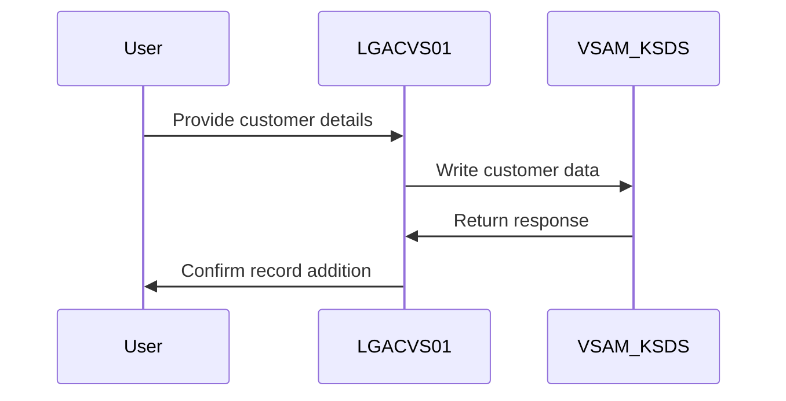
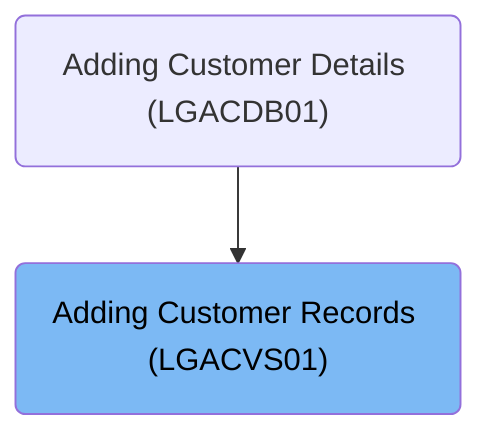

The <SwmToken path="base/src/lgacvs01.cbl" pos="11:6:6" line-data="       PROGRAM-ID. LGACVS01.">`LGACVS01`</SwmToken> program is responsible for adding customer records to a VSAM KSDS file. It starts by verifying the communication area length and then writes the customer data to the file. This program plays a key role in the customer management system by ensuring that customer information is stored accurately.

For example, when a new customer is added with a unique customer number, the program writes this information to the VSAM KSDS file, ensuring it is stored correctly for future retrieval.

The main steps are:

- Verify communication area length
- Write customer data to VSAM KSDS file
- Handle response from file operation



## Dependencies

### Program

- LGSTSQ (<SwmPath>[base/src/lgstsq.cbl](base/src/lgstsq.cbl)</SwmPath>) - <SwmLink doc-title="Message Queue Handler (LGSTSQ)">[Message Queue Handler (LGSTSQ)](/.swm/message-queue-handler-lgstsq.e7y8uelv.sw.md)</SwmLink>

### Copybook

- LGCMAREA (<SwmPath>[base/src/lgcmarea.cpy](base/src/lgcmarea.cpy)</SwmPath>)

# Where is this program used?

This program is used once, as represented in the following diagram:



# Initializing Communication and Writing Customer Data

<SwmSnippet path="/base/src/lgacvs01.cbl" line="63">

---

<SwmToken path="base/src/lgacvs01.cbl" pos="63:1:1" line-data="       MAINLINE SECTION.">`MAINLINE`</SwmToken> starts by verifying the communication area length and then writes customer data to a file

```cobol
       MAINLINE SECTION.
      *
      *---------------------------------------------------------------*
           Move EIBCALEN To WS-Commarea-Len.
      *---------------------------------------------------------------*
           Exec CICS Write File('KSDSCUST')
                     From(CA-Customer-Num)
                     Length(CUSTOMER-RECORD-SIZE)
                     Ridfld(CA-Customer-Num)
                     KeyLength(10)
                     RESP(WS-RESP)
           End-Exec.
```

---

</SwmSnippet>

&nbsp;

*This is an auto-generated document by Swimm 🌊 and has not yet been verified by a human*

<SwmMeta version="3.0.0" repo-id="Z2l0aHViJTNBJTNBa3luZHJ5bC1jaWNzLWdlbmFwcCUzQSUzQVN3aW1tLURlbW8=" repo-name="kyndryl-cics-genapp"><sup>Powered by [Swimm](/)</sup></SwmMeta>
