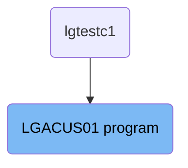
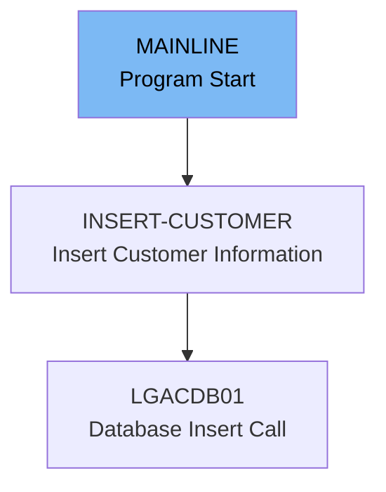

The <SwmToken path="base/src/lgacus01.cbl" pos="11:6:6" line-data="       PROGRAM-ID. LGACUS01.">`LGACUS01`</SwmToken> program is responsible for inserting customer information into the <SwmToken path="base/src/lgacus01.cbl" pos="118:15:15" line-data="      * Call routine to Insert row in DB2 Customer table               *">`DB2`</SwmToken> database. This is achieved by initializing working storage variables, processing the incoming commarea, validating the commarea length, and performing the <SwmToken path="base/src/lgacus01.cbl" pos="119:3:5" line-data="           PERFORM INSERT-CUSTOMER.">`INSERT-CUSTOMER`</SwmToken> routine which calls the <SwmToken path="base/src/lgacus01.cbl" pos="134:9:9" line-data="           EXEC CICS LINK Program(LGACDB01)">`LGACDB01`</SwmToken> program to insert the data.

The <SwmToken path="base/src/lgacus01.cbl" pos="11:6:6" line-data="       PROGRAM-ID. LGACUS01.">`LGACUS01`</SwmToken> program starts by setting up necessary variables and processing the incoming communication area. It then checks if the commarea has the required length. If everything is in order, it proceeds to insert the customer information into the <SwmToken path="base/src/lgacus01.cbl" pos="118:15:15" line-data="      * Call routine to Insert row in DB2 Customer table               *">`DB2`</SwmToken> database by calling the <SwmToken path="base/src/lgacus01.cbl" pos="134:9:9" line-data="           EXEC CICS LINK Program(LGACDB01)">`LGACDB01`</SwmToken> program. Finally, it returns control to CICS.

# Where is this program used?

This program is used once, in a flow starting from `lgtestc1` as represented in the following diagram:



Lets' zoom into the flow:



<SwmSnippet path="/base/src/lgacus01.cbl" line="83">

---

## Initializing Working Storage Variables

First, the program initializes working storage variables. This includes setting up general variables such as <SwmToken path="base/src/lgacus01.cbl" pos="86:7:9" line-data="           MOVE EIBTRNID TO WS-TRANSID.">`WS-TRANSID`</SwmToken>, <SwmToken path="base/src/lgacus01.cbl" pos="87:7:9" line-data="           MOVE EIBTRMID TO WS-TERMID.">`WS-TERMID`</SwmToken>, and <SwmToken path="base/src/lgacus01.cbl" pos="88:7:9" line-data="           MOVE EIBTASKN TO WS-TASKNUM.">`WS-TASKNUM`</SwmToken> to store transaction ID, terminal ID, and task number respectively. These variables are essential for tracking the transaction details.

```cobol
      * initialize working storage variables
           INITIALIZE WS-HEADER.
      * set up general variable
           MOVE EIBTRNID TO WS-TRANSID.
           MOVE EIBTRMID TO WS-TERMID.
           MOVE EIBTASKN TO WS-TASKNUM.
      *----------------------------------------------------------------*
```

---

</SwmSnippet>

<SwmSnippet path="/base/src/lgacus01.cbl" line="92">

---

## Processing Incoming Commarea

Next, the program processes the incoming commarea. If no commarea is received (<SwmToken path="base/src/lgacus01.cbl" pos="95:3:3" line-data="           IF EIBCALEN IS EQUAL TO ZERO">`EIBCALEN`</SwmToken> is zero), it moves an error message to <SwmToken path="base/src/lgacus01.cbl" pos="96:14:16" line-data="               MOVE &#39; NO COMMAREA RECEIVED&#39; TO EM-VARIABLE">`EM-VARIABLE`</SwmToken>, performs the <SwmToken path="base/src/lgacus01.cbl" pos="97:3:7" line-data="               PERFORM WRITE-ERROR-MESSAGE">`WRITE-ERROR-MESSAGE`</SwmToken> routine, and issues an ABEND with code 'LGCA'. This ensures that the program handles cases where the required communication area is missing.

```cobol
      * Process incoming commarea                                      *
      *----------------------------------------------------------------*
      * If NO commarea received issue an ABEND
           IF EIBCALEN IS EQUAL TO ZERO
               MOVE ' NO COMMAREA RECEIVED' TO EM-VARIABLE
               PERFORM WRITE-ERROR-MESSAGE
               EXEC CICS ABEND ABCODE('LGCA') NODUMP END-EXEC
           END-IF
```

---

</SwmSnippet>

<SwmSnippet path="/base/src/lgacus01.cbl" line="101">

---

## Initializing Commarea Return Code

Then, the program initializes the commarea return code to zero and sets up the address of the commarea. This step is crucial for ensuring that the communication area is correctly prepared for further processing.

```cobol
      * initialize commarea return code to zero
           MOVE '00' TO CA-RETURN-CODE
           MOVE '00' TO CA-NUM-POLICIES
           MOVE EIBCALEN TO WS-CALEN.
           SET WS-ADDR-DFHCOMMAREA TO ADDRESS OF DFHCOMMAREA.

```

---

</SwmSnippet>

<SwmSnippet path="/base/src/lgacus01.cbl" line="107">

---

## Checking Commarea Length

The program checks the length of the commarea. If the length is less than the required length (<SwmToken path="base/src/lgacus01.cbl" pos="108:13:19" line-data="           ADD WS-CA-HEADER-LEN TO WS-REQUIRED-CA-LEN">`WS-REQUIRED-CA-LEN`</SwmToken>), it sets an error return code '98' and returns to the caller. This validation step ensures that the commarea has the necessary length for processing.

```cobol
      * check commarea length
           ADD WS-CA-HEADER-LEN TO WS-REQUIRED-CA-LEN
           ADD WS-CUSTOMER-LEN  TO WS-REQUIRED-CA-LEN

      * if less set error return code and return to caller
           IF EIBCALEN IS LESS THAN WS-REQUIRED-CA-LEN
             MOVE '98' TO CA-RETURN-CODE
             EXEC CICS RETURN END-EXEC
           END-IF
```

---

</SwmSnippet>

<SwmSnippet path="/base/src/lgacus01.cbl" line="118">

---

## Inserting Customer Information

The program then performs the <SwmToken path="base/src/lgacus01.cbl" pos="119:3:5" line-data="           PERFORM INSERT-CUSTOMER.">`INSERT-CUSTOMER`</SwmToken> routine to insert a row in the <SwmToken path="base/src/lgacus01.cbl" pos="118:15:15" line-data="      * Call routine to Insert row in DB2 Customer table               *">`DB2`</SwmToken> Customer table. This is the main business logic where customer information is added to the database.

```cobol
      * Call routine to Insert row in DB2 Customer table               *
           PERFORM INSERT-CUSTOMER.
      
```

---

</SwmSnippet>

<SwmSnippet path="/base/src/lgacus01.cbl" line="123">

---

## Returning Control to CICS

Finally, the program returns control to CICS using the <SwmToken path="base/src/lgacus01.cbl" pos="123:1:5" line-data="           EXEC CICS RETURN END-EXEC.">`EXEC CICS RETURN`</SwmToken> statement. This marks the end of the mainline processing.

```cobol
           EXEC CICS RETURN END-EXEC.

       MAINLINE-EXIT.
           EXIT.
```

---

</SwmSnippet>

<SwmSnippet path="/base/src/lgacus01.cbl" line="132">

---

## Inserting Customer Information into <SwmToken path="base/src/lgacus01.cbl" pos="118:15:15" line-data="      * Call routine to Insert row in DB2 Customer table               *">`DB2`</SwmToken>

The <SwmToken path="base/src/lgacus01.cbl" pos="132:1:3" line-data="       INSERT-CUSTOMER.">`INSERT-CUSTOMER`</SwmToken> routine calls the <SwmToken path="base/src/lgacus01.cbl" pos="134:9:9" line-data="           EXEC CICS LINK Program(LGACDB01)">`LGACDB01`</SwmToken> program to insert customer information into the <SwmToken path="base/src/lgacus01.cbl" pos="118:15:15" line-data="      * Call routine to Insert row in DB2 Customer table               *">`DB2`</SwmToken> database. This step is crucial for persisting the customer data.

More about LGACDB01: <SwmLink doc-title="Adding Customer Details (LGACDB01)">[Adding Customer Details (LGACDB01)](/.swm/adding-customer-details-lgacdb01.tbc4xojj.sw.md)</SwmLink>

```cobol
       INSERT-CUSTOMER.

           EXEC CICS LINK Program(LGACDB01)
                Commarea(DFHCOMMAREA)
                LENGTH(32500)
           END-EXEC.
```

---

</SwmSnippet>

&nbsp;

*This is an auto-generated document by Swimm 🌊 and has not yet been verified by a human*

<SwmMeta version="3.0.0" repo-id="Z2l0aHViJTNBJTNBa3luZHJ5bC1jaWNzLWdlbmFwcCUzQSUzQVN3aW1tLURlbW8=" repo-name="kyndryl-cics-genapp"><sup>Powered by [Swimm](https://app.swimm.io/)</sup></SwmMeta>
