This document will cover the <SwmToken path="base/src/lgapdb01.cbl" pos="13:6:6" line-data="       PROGRAM-ID. LGAPDB01.">`LGAPDB01`</SwmToken> program. We'll cover:

1. What the Program Does
2. Program Flow
3. Program Sections

## What the Program Does

The <SwmToken path="base/src/lgapdb01.cbl" pos="13:6:6" line-data="       PROGRAM-ID. LGAPDB01.">`LGAPDB01`</SwmToken> program is designed to add full details of an individual policy, including Endowment, House, Motor, and Commercial policies. It initializes working storage variables, checks the communication area (commarea), converts customer and policy numbers to <SwmToken path="base/src/lgapdb01.cbl" pos="157:5:5" line-data="      * initialize DB2 host variables">`DB2`</SwmToken> integer format, and performs various SQL INSERT operations to add policy details to the database.

## Program Flow

The program flow of <SwmToken path="base/src/lgapdb01.cbl" pos="13:6:6" line-data="       PROGRAM-ID. LGAPDB01.">`LGAPDB01`</SwmToken> is as follows:

1. Initialize working storage variables.
2. Initialize <SwmToken path="base/src/lgapdb01.cbl" pos="157:5:5" line-data="      * initialize DB2 host variables">`DB2`</SwmToken> host variables.
3. Check the commarea and obtain required details.
4. Convert commarea customer and policy numbers to <SwmToken path="base/src/lgapdb01.cbl" pos="157:5:5" line-data="      * initialize DB2 host variables">`DB2`</SwmToken> integer format.
5. Check commarea length and set error return code if necessary.
6. Perform the INSERT operations against appropriate tables.
7. Call the <SwmToken path="base/src/lgapdb01.cbl" pos="119:3:3" line-data="       01  LGAPVS01                    PIC X(8)  VALUE &#39;LGAPVS01&#39;.">`LGAPVS01`</SwmToken> program.
8. Return to the caller.

```mermaid
graph TD
  A[Start] --> B[Initialize working storage variables]
  B --> C[Initialize DB2 host variables]
  C --> D[Check commarea and obtain required details]
  D --> E[Convert commarea customer and policy numbers to DB2 integer format]
  E --> F[Check commarea length]
  F --> G[Perform INSERT operations]
  G --> H[Call LGAPVS01 program]
  H --> I[Return to caller]

%% Swimm:
%% graph TD
%%   A[Start] --> B[Initialize working storage variables]
%%   B --> C[Initialize <SwmToken path="base/src/lgapdb01.cbl" pos="157:5:5" line-data="      * initialize DB2 host variables">`DB2`</SwmToken> host variables]
%%   C --> D[Check commarea and obtain required details]
%%   D --> E[Convert commarea customer and policy numbers to <SwmToken path="base/src/lgapdb01.cbl" pos="157:5:5" line-data="      * initialize DB2 host variables">`DB2`</SwmToken> integer format]
%%   E --> F[Check commarea length]
%%   F --> G[Perform INSERT operations]
%%   G --> H[Call <SwmToken path="base/src/lgapdb01.cbl" pos="119:3:3" line-data="       01  LGAPVS01                    PIC X(8)  VALUE &#39;LGAPVS01&#39;.">`LGAPVS01`</SwmToken> program]
%%   H --> I[Return to caller]
```



<SwmSnippet path="/base/src/lgapdb01.cbl" line="146">

---

### MAINLINE SECTION

First, the MAINLINE SECTION initializes working storage variables, sets up general variables, initializes <SwmToken path="base/src/lgapdb01.cbl" pos="157:5:5" line-data="      * initialize DB2 host variables">`DB2`</SwmToken> host variables, checks the commarea, converts customer and policy numbers to <SwmToken path="base/src/lgapdb01.cbl" pos="157:5:5" line-data="      * initialize DB2 host variables">`DB2`</SwmToken> integer format, and checks the commarea length. It then performs the INSERT operations against appropriate tables and calls the <SwmToken path="base/src/lgapdb01.cbl" pos="119:3:3" line-data="       01  LGAPVS01                    PIC X(8)  VALUE &#39;LGAPVS01&#39;.">`LGAPVS01`</SwmToken> program.

```cobol
       MAINLINE SECTION.

      * initialize working storage variables
           INITIALIZE WS-HEADER.
      * set up general variable
           MOVE EIBTRNID TO WS-TRANSID.
           MOVE EIBTRMID TO WS-TERMID.
           MOVE EIBTASKN TO WS-TASKNUM.
           MOVE EIBCALEN TO WS-CALEN.
      *----------------------------------------------------------------*

      * initialize DB2 host variables
           INITIALIZE DB2-IN-INTEGERS.
           INITIALIZE DB2-OUT-INTEGERS.

      *----------------------------------------------------------------*
      * Check commarea and obtain required details                     *
      *----------------------------------------------------------------*
      * If NO commarea received issue an ABEND
           IF EIBCALEN IS EQUAL TO ZERO
               MOVE ' NO COMMAREA RECEIVED' TO EM-VARIABLE
```

---

</SwmSnippet>

<SwmSnippet path="/base/src/lgapdb01.cbl" line="261">

---

### <SwmToken path="base/src/lgapdb01.cbl" pos="261:1:3" line-data="       INSERT-POLICY.">`INSERT-POLICY`</SwmToken>

Next, the <SwmToken path="base/src/lgapdb01.cbl" pos="261:1:3" line-data="       INSERT-POLICY.">`INSERT-POLICY`</SwmToken> section inserts a row into the policy table using values passed in the commarea. It sets the timestamp and allows <SwmToken path="base/src/lgapdb01.cbl" pos="264:9:9" line-data="           MOVE CA-BROKERID TO DB2-BROKERID-INT">`DB2`</SwmToken> to allocate a policy number. It also handles SQL errors and retrieves the assigned policy number and timestamp.

```cobol
       INSERT-POLICY.

      *    Move numeric fields to integer format
           MOVE CA-BROKERID TO DB2-BROKERID-INT
           MOVE CA-PAYMENT TO DB2-PAYMENT-INT

           MOVE ' INSERT POLICY' TO EM-SQLREQ
           EXEC SQL
             INSERT INTO POLICY
                       ( POLICYNUMBER,
                         CUSTOMERNUMBER,
                         ISSUEDATE,
                         EXPIRYDATE,
                         POLICYTYPE,
                         LASTCHANGED,
                         BROKERID,
                         BROKERSREFERENCE,
                         PAYMENT           )
                VALUES ( DEFAULT,
                         :DB2-CUSTOMERNUM-INT,
                         :CA-ISSUE-DATE,
```

---

</SwmSnippet>

<SwmSnippet path="/base/src/lgapdb01.cbl" line="327">

---

### <SwmToken path="base/src/lgapdb01.cbl" pos="327:1:3" line-data="       INSERT-ENDOW.">`INSERT-ENDOW`</SwmToken>

Then, the <SwmToken path="base/src/lgapdb01.cbl" pos="327:1:3" line-data="       INSERT-ENDOW.">`INSERT-ENDOW`</SwmToken> section inserts a row into the endowment table using values passed in the commarea. It handles both cases where the commarea contains data for the Varchar field and where it does not. It also handles SQL errors and issues an ABEND to cause backout of the update to the policy table if necessary.

```cobol
       INSERT-ENDOW.

      *    Move numeric fields to integer format
           MOVE CA-E-TERM        TO DB2-E-TERM-SINT
           MOVE CA-E-SUM-ASSURED TO DB2-E-SUMASSURED-INT

           MOVE ' INSERT ENDOW ' TO EM-SQLREQ
      *----------------------------------------------------------------*
      *    There are 2 versions of INSERT...                           *
      *      one which updates all fields including Varchar            *
      *      one which updates all fields Except Varchar               *
      *----------------------------------------------------------------*
           SUBTRACT WS-REQUIRED-CA-LEN FROM EIBCALEN
               GIVING WS-VARY-LEN

           IF WS-VARY-LEN IS GREATER THAN ZERO
      *       Commarea contains data for Varchar field
              MOVE CA-E-PADDING-DATA
                  TO WS-VARY-CHAR(1:WS-VARY-LEN)
              EXEC SQL
                INSERT INTO ENDOWMENT
```

---

</SwmSnippet>

<SwmSnippet path="/base/src/lgapdb01.cbl" line="402">

---

### <SwmToken path="base/src/lgapdb01.cbl" pos="402:1:3" line-data="       INSERT-HOUSE.">`INSERT-HOUSE`</SwmToken>

Next, the <SwmToken path="base/src/lgapdb01.cbl" pos="402:1:3" line-data="       INSERT-HOUSE.">`INSERT-HOUSE`</SwmToken> section inserts a row into the house table using values passed in the commarea. It handles SQL errors and issues an ABEND to cause backout of the update to the policy table if necessary.

```cobol
       INSERT-HOUSE.

      *    Move numeric fields to integer format
           MOVE CA-H-VALUE       TO DB2-H-VALUE-INT
           MOVE CA-H-BEDROOMS    TO DB2-H-BEDROOMS-SINT

           MOVE ' INSERT HOUSE ' TO EM-SQLREQ
           EXEC SQL
             INSERT INTO HOUSE
                       ( POLICYNUMBER,
                         PROPERTYTYPE,
                         BEDROOMS,
                         VALUE,
                         HOUSENAME,
                         HOUSENUMBER,
                         POSTCODE          )
                VALUES ( :DB2-POLICYNUM-INT,
                         :CA-H-PROPERTY-TYPE,
                         :DB2-H-BEDROOMS-SINT,
                         :DB2-H-VALUE-INT,
                         :CA-H-HOUSE-NAME,
```

---

</SwmSnippet>

<SwmSnippet path="/base/src/lgapdb01.cbl" line="440">

---

### <SwmToken path="base/src/lgapdb01.cbl" pos="440:1:3" line-data="       INSERT-MOTOR.">`INSERT-MOTOR`</SwmToken>

Then, the <SwmToken path="base/src/lgapdb01.cbl" pos="440:1:3" line-data="       INSERT-MOTOR.">`INSERT-MOTOR`</SwmToken> section inserts a row into the motor table using values passed in the commarea. It handles SQL errors and issues an ABEND to cause backout of the update to the policy table if necessary.

```cobol
       INSERT-MOTOR.

      *    Move numeric fields to integer format
           MOVE CA-M-VALUE       TO DB2-M-VALUE-INT
           MOVE CA-M-CC          TO DB2-M-CC-SINT
           MOVE CA-M-PREMIUM     TO DB2-M-PREMIUM-INT
           MOVE CA-M-ACCIDENTS   TO DB2-M-ACCIDENTS-INT

           MOVE ' INSERT MOTOR ' TO EM-SQLREQ
           EXEC SQL
             INSERT INTO MOTOR
                       ( POLICYNUMBER,
                         MAKE,
                         MODEL,
                         VALUE,
                         REGNUMBER,
                         COLOUR,
                         CC,
                         YEAROFMANUFACTURE,
                         PREMIUM,
                         ACCIDENTS )
```

---

</SwmSnippet>

<SwmSnippet path="/base/src/lgapdb01.cbl" line="486">

---

### <SwmToken path="base/src/lgapdb01.cbl" pos="486:1:3" line-data="       INSERT-COMMERCIAL.">`INSERT-COMMERCIAL`</SwmToken>

Finally, the <SwmToken path="base/src/lgapdb01.cbl" pos="486:1:3" line-data="       INSERT-COMMERCIAL.">`INSERT-COMMERCIAL`</SwmToken> section inserts a row into the commercial table using values passed in the commarea. It handles SQL errors and issues an ABEND to cause backout of the update to the policy table if necessary.

```cobol
       INSERT-COMMERCIAL.

           MOVE CA-B-FirePeril       To DB2-B-FirePeril-Int
           MOVE CA-B-FirePremium     To DB2-B-FirePremium-Int
           MOVE CA-B-CrimePeril      To DB2-B-CrimePeril-Int
           MOVE CA-B-CrimePremium    To DB2-B-CrimePremium-Int
           MOVE CA-B-FloodPeril      To DB2-B-FloodPeril-Int
           MOVE CA-B-FloodPremium    To DB2-B-FloodPremium-Int
           MOVE CA-B-WeatherPeril    To DB2-B-WeatherPeril-Int
           MOVE CA-B-WeatherPremium  To DB2-B-WeatherPremium-Int
           MOVE CA-B-Status          To DB2-B-Status-Int

           MOVE ' INSERT COMMER' TO EM-SQLREQ
           EXEC SQL
             INSERT INTO COMMERCIAL
                       (
                         PolicyNumber,
                         RequestDate,
                         StartDate,
                         RenewalDate,
                         Address,
```

---

</SwmSnippet>

<SwmSnippet path="/base/src/lgapdb01.cbl" line="562">

---

### <SwmToken path="base/src/lgapdb01.cbl" pos="562:1:5" line-data="       WRITE-ERROR-MESSAGE.">`WRITE-ERROR-MESSAGE`</SwmToken>

The <SwmToken path="base/src/lgapdb01.cbl" pos="562:1:5" line-data="       WRITE-ERROR-MESSAGE.">`WRITE-ERROR-MESSAGE`</SwmToken> section writes an error message to the queues. The message includes the date, time, program name, customer number, policy number, and SQLCODE. It calls the LGSTSQ program to handle the message.

```cobol
       WRITE-ERROR-MESSAGE.
      * Save SQLCODE in message
           MOVE SQLCODE TO EM-SQLRC
      * Obtain and format current time and date
           EXEC CICS ASKTIME ABSTIME(ABS-TIME)
           END-EXEC
           EXEC CICS FORMATTIME ABSTIME(ABS-TIME)
                     MMDDYYYY(DATE1)
                     TIME(TIME1)
           END-EXEC
           MOVE DATE1 TO EM-DATE
           MOVE TIME1 TO EM-TIME
      * Write output message to TDQ
           EXEC CICS LINK PROGRAM('LGSTSQ')
                     COMMAREA(ERROR-MSG)
                     LENGTH(LENGTH OF ERROR-MSG)
           END-EXEC.
      * Write 90 bytes or as much as we have of commarea to TDQ
           IF EIBCALEN > 0 THEN
             IF EIBCALEN < 91 THEN
               MOVE DFHCOMMAREA(1:EIBCALEN) TO CA-DATA
```

---

</SwmSnippet>

&nbsp;

*This is an auto-generated document by Swimm 🌊 and has not yet been verified by a human*

<SwmMeta version="3.0.0" repo-id="Z2l0aHViJTNBJTNBa3luZHJ5bC1jaWNzLWdlbmFwcCUzQSUzQVN3aW1tLURlbW8=" repo-name="kyndryl-cics-genapp"><sup>Powered by [Swimm](/)</sup></SwmMeta>
