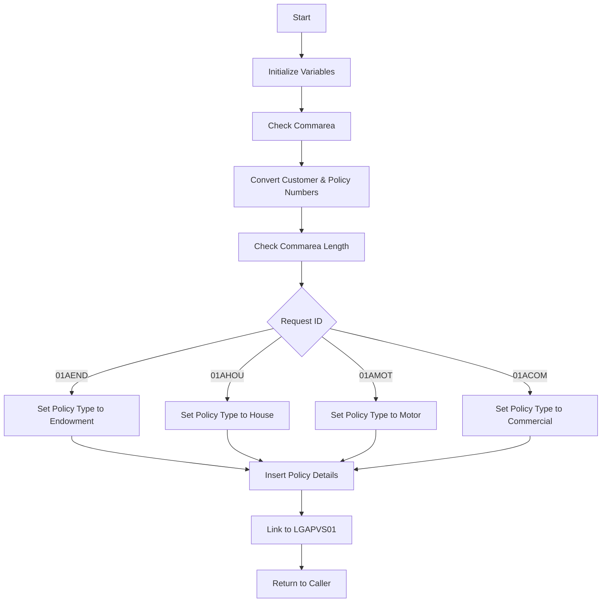

This document will cover the <SwmToken path="base/src/lgapdb01.cbl" pos="13:6:6" line-data="       PROGRAM-ID. LGAPDB01.">`LGAPDB01`</SwmToken> program. We'll cover:

1. What the Program Does
2. Program Flow
3. Program Sections

## What the Program Does

The <SwmToken path="base/src/lgapdb01.cbl" pos="13:6:6" line-data="       PROGRAM-ID. LGAPDB01.">`LGAPDB01`</SwmToken> program is designed to add full details of an individual policy, including Endowment, House, Motor, and Commercial policies. The program initializes working storage variables, checks the communication area (commarea), and performs various SQL INSERT operations to add policy details to the database. The program's functionality is accurately described in the comment header and matches the actual code.

## Program Flow

The program follows a structured flow to add policy details:

1. Initialize working storage variables and <SwmToken path="base/src/lgapdb01.cbl" pos="157:5:5" line-data="      * initialize DB2 host variables">`DB2`</SwmToken> host variables.
2. Check the commarea and obtain required details.
3. Convert commarea customer and policy numbers to <SwmToken path="base/src/lgapdb01.cbl" pos="157:5:5" line-data="      * initialize DB2 host variables">`DB2`</SwmToken> integer format.
4. Check commarea length and set the policy type based on the request ID.
5. Perform SQL INSERT operations to add policy details to the appropriate tables.
6. Link to another program <SwmToken path="base/src/lgapdb01.cbl" pos="243:8:9" line-data="             EXEC CICS Link Program(LGAPVS01)">`(LGAPVS01`</SwmToken>) and return to the caller.



<SwmSnippet path="/base/src/lgapdb01.cbl" line="146">

---

### MAINLINE SECTION

First, the program initializes working storage variables and <SwmToken path="base/src/lgapdb01.cbl" pos="157:5:5" line-data="      * initialize DB2 host variables">`DB2`</SwmToken> host variables. This sets up the necessary environment for the program to operate.

```cobol
       MAINLINE SECTION.

      * initialize working storage variables
           INITIALIZE WS-HEADER.
      * set up general variable
           MOVE EIBTRNID TO WS-TRANSID.
           MOVE EIBTRMID TO WS-TERMID.
           MOVE EIBTASKN TO WS-TASKNUM.
           MOVE EIBCALEN TO WS-CALEN.
      *----------------------------------------------------------------*

      * initialize DB2 host variables
           INITIALIZE DB2-IN-INTEGERS.
           INITIALIZE DB2-OUT-INTEGERS.
```

---

</SwmSnippet>

<SwmSnippet path="/base/src/lgapdb01.cbl" line="162">

---

### Check Commarea

Now, the program checks the commarea and obtains the required details. If no commarea is received, it issues an ABEND. It also converts commarea customer and policy numbers to <SwmToken path="base/src/lgapdb01.cbl" pos="175:17:17" line-data="      * Convert commarea customer &amp; policy nums to DB2 integer format">`DB2`</SwmToken> integer format and checks the commarea length.

```cobol
      * Check commarea and obtain required details                     *
      *----------------------------------------------------------------*
      * If NO commarea received issue an ABEND
           IF EIBCALEN IS EQUAL TO ZERO
               MOVE ' NO COMMAREA RECEIVED' TO EM-VARIABLE
               PERFORM WRITE-ERROR-MESSAGE
               EXEC CICS ABEND ABCODE('LGCA') NODUMP END-EXEC
           END-IF

      * initialize commarea return code to zero
           MOVE '00' TO CA-RETURN-CODE
           SET WS-ADDR-DFHCOMMAREA TO ADDRESS OF DFHCOMMAREA.

      * Convert commarea customer & policy nums to DB2 integer format
           MOVE CA-CUSTOMER-NUM TO DB2-CUSTOMERNUM-INT
           MOVE ZERO            TO DB2-C-PolicyNum-INT
      * and save in error msg field incase required
           MOVE CA-CUSTOMER-NUM TO EM-CUSNUM

      * Check commarea length
           ADD WS-CA-HEADER-LEN TO WS-REQUIRED-CA-LEN
```

---

</SwmSnippet>

<SwmSnippet path="/base/src/lgapdb01.cbl" line="216">

---

### Perform SQL INSERT Operations

Then, the program performs SQL INSERT operations to add policy details to the appropriate tables based on the request ID. It calls specific routines to insert rows into the policy type tables.

```cobol
      *    Perform the INSERTs against appropriate tables              *
      *----------------------------------------------------------------*
      *    Call procedure to Insert row in policy table
           PERFORM INSERT-POLICY

      *    Call appropriate routine to insert row to specific
      *    policy type table.
           EVALUATE CA-REQUEST-ID

             WHEN '01AEND'
               PERFORM INSERT-ENDOW

             WHEN '01AHOU'
               PERFORM INSERT-HOUSE

             WHEN '01AMOT'
               PERFORM INSERT-MOTOR

             WHEN '01ACOM'
               PERFORM INSERT-COMMERCIAL

```

---

</SwmSnippet>

<SwmSnippet path="/base/src/lgapdb01.cbl" line="243">

---

### Link to <SwmToken path="base/src/lgapdb01.cbl" pos="243:9:9" line-data="             EXEC CICS Link Program(LGAPVS01)">`LGAPVS01`</SwmToken>

Finally, the program links to another program <SwmToken path="base/src/lgapdb01.cbl" pos="243:8:9" line-data="             EXEC CICS Link Program(LGAPVS01)">`(LGAPVS01`</SwmToken>) and returns to the caller.

```cobol
             EXEC CICS Link Program(LGAPVS01)
                  Commarea(DFHCOMMAREA)
                LENGTH(32500)
             END-EXEC.


      * Return to caller
           EXEC CICS RETURN END-EXEC.
```

---

</SwmSnippet>

&nbsp;

*This is an auto-generated document by Swimm 🌊 and has not yet been verified by a human*

<SwmMeta version="3.0.0" repo-id="Z2l0aHViJTNBJTNBa3luZHJ5bC1jaWNzLWdlbmFwcCUzQSUzQVN3aW1tLURlbW8=" repo-name="kyndryl-cics-genapp"><sup>Powered by [Swimm](/)</sup></SwmMeta>
