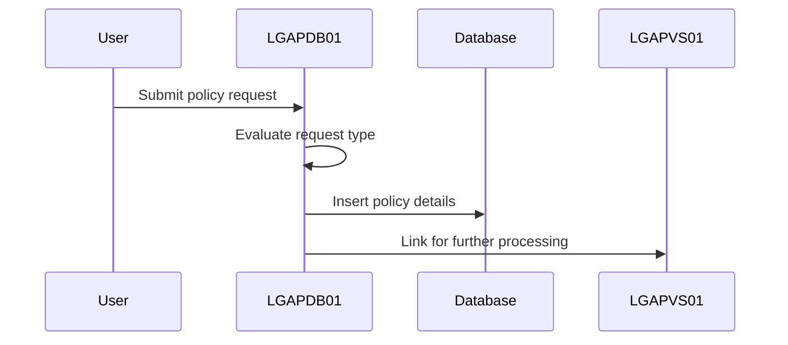
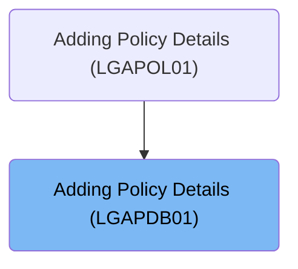
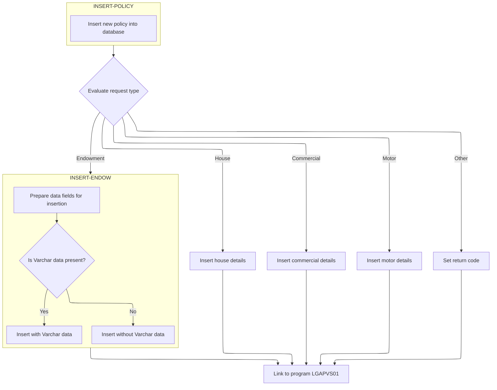
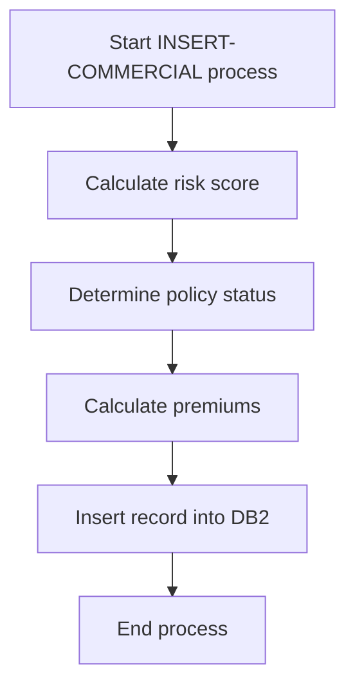
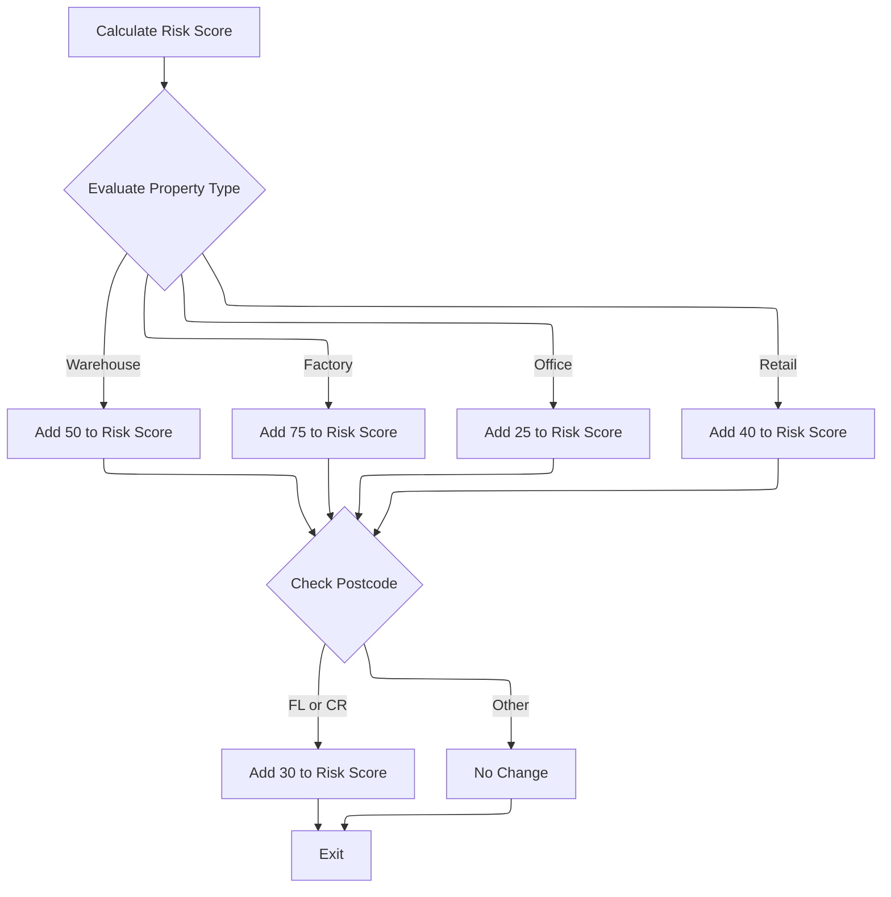

This document describes the process of adding policy details (<SwmToken path="base/src/lgapdb01.cbl" pos="13:6:6" line-data="       PROGRAM-ID. LGAPDB01.">`LGAPDB01`</SwmToken>). The program evaluates the request type to determine the policy category, inserts the policy details into the database, and links to the <SwmToken path="base/src/lgapdb01.cbl" pos="270:9:9" line-data="             EXEC CICS Link Program(LGAPVS01)">`LGAPVS01`</SwmToken> program for further processing.

For example, if a request to add a motor policy is received, the program evaluates the request type, inserts the motor policy details into the database, and links to <SwmToken path="base/src/lgapdb01.cbl" pos="270:9:9" line-data="             EXEC CICS Link Program(LGAPVS01)">`LGAPVS01`</SwmToken> for further processing.

The main steps are:

- Evaluate the request type to determine the policy category
- Insert policy details into the database
- Link to the <SwmToken path="base/src/lgapdb01.cbl" pos="270:9:9" line-data="             EXEC CICS Link Program(LGAPVS01)">`LGAPVS01`</SwmToken> program for further processing



## Dependencies

### Programs

- <SwmToken path="base/src/lgapdb01.cbl" pos="270:9:9" line-data="             EXEC CICS Link Program(LGAPVS01)">`LGAPVS01`</SwmToken> (<SwmPath>[base/src/lgapvs01.cbl](base/src/lgapvs01.cbl)</SwmPath>) - <SwmLink doc-title="Adding Policy Records (LGAPVS01)">[Adding Policy Records (LGAPVS01)](/.swm/adding-policy-records-lgapvs01.hs8lg2t7.sw.md)</SwmLink>
- LGSTSQ (<SwmPath>[base/src/lgstsq.cbl](base/src/lgstsq.cbl)</SwmPath>) - <SwmLink doc-title="Message Queue Handler (LGSTSQ)">[Message Queue Handler (LGSTSQ)](/.swm/message-queue-handler-lgstsq.e7y8uelv.sw.md)</SwmLink>

### Copybooks

- LGCMAREA (<SwmPath>[base/src/lgcmarea.cpy](base/src/lgcmarea.cpy)</SwmPath>)
- LGPOLICY (<SwmPath>[base/src/lgpolicy.cpy](base/src/lgpolicy.cpy)</SwmPath>)
- SQLCA

# Where is this program used?

This program is used once, as represented in the following diagram:



# Initiating Policy Insertion



&nbsp;

<SwmSnippet path="/base/src/lgapdb01.cbl" line="246">

---

In <SwmToken path="base/src/lgapdb01.cbl" pos="173:1:1" line-data="       MAINLINE SECTION.">`MAINLINE`</SwmToken>, we start by calling <SwmToken path="base/src/lgapdb01.cbl" pos="246:3:5" line-data="           PERFORM INSERT-POLICY">`INSERT-POLICY`</SwmToken> to insert a new policy into the database.

```cobol
           PERFORM INSERT-POLICY
```

---

</SwmSnippet>

## Executing Policy Database Insert

<SwmSnippet path="/base/src/lgapdb01.cbl" line="288">

---

In <SwmToken path="base/src/lgapdb01.cbl" pos="288:1:3" line-data="       INSERT-POLICY.">`INSERT-POLICY`</SwmToken>, we start by converting numeric fields from the communication area to integer format for <SwmToken path="base/src/lgapdb01.cbl" pos="291:9:9" line-data="           MOVE CA-BROKERID TO DB2-BROKERID-INT">`DB2`</SwmToken> compatibility. Then, we construct an SQL INSERT statement to add a new policy record into the POLICY table, using placeholders for values from program variables.

```cobol
       INSERT-POLICY.

      *    Move numeric fields to integer format
           MOVE CA-BROKERID TO DB2-BROKERID-INT
           MOVE CA-PAYMENT TO DB2-PAYMENT-INT

           MOVE ' INSERT POLICY' TO EM-SQLREQ
           EXEC SQL
             INSERT INTO POLICY
                       ( POLICYNUMBER,
                         CUSTOMERNUMBER,
                         ISSUEDATE,
                         EXPIRYDATE,
                         POLICYTYPE,
                         LASTCHANGED,
                         BROKERID,
                         BROKERSREFERENCE,
                         PAYMENT           )
                VALUES ( DEFAULT,
                         :DB2-CUSTOMERNUM-INT,
                         :CA-ISSUE-DATE,
                         :CA-EXPIRY-DATE,
                         :DB2-POLICYTYPE,
                         CURRENT TIMESTAMP,
                         :DB2-BROKERID-INT,
                         :CA-BROKERSREF,
                         :DB2-PAYMENT-INT      )
           END-EXEC
```

---

</SwmSnippet>

<SwmSnippet path="/base/src/lgapdb01.cbl" line="317">

---

We check SQLCODE to handle any errors after the SQL INSERT.

```cobol
           Evaluate SQLCODE

             When 0
               MOVE '00' TO CA-RETURN-CODE

```

---

</SwmSnippet>

<SwmSnippet path="/base/src/lgapdb01.cbl" line="335">

---

We get the new policy number with <SwmToken path="base/src/lgapdb01.cbl" pos="336:12:14" line-data="             SET :DB2-POLICYNUM-INT = IDENTITY_VAL_LOCAL()">`IDENTITY_VAL_LOCAL()`</SwmToken>.

```cobol
           EXEC SQL
             SET :DB2-POLICYNUM-INT = IDENTITY_VAL_LOCAL()
           END-EXEC
```

---

</SwmSnippet>

<SwmSnippet path="/base/src/lgapdb01.cbl" line="338">

---

We store the new policy number and fetch the timestamp for the record.

```cobol
           MOVE DB2-POLICYNUM-INT TO CA-POLICY-NUM
      *    and save in error msg field incase required
           MOVE CA-POLICY-NUM TO EM-POLNUM

      *    get value of assigned Timestamp
           EXEC SQL
             SELECT LASTCHANGED
               INTO :CA-LASTCHANGED
               FROM POLICY
               WHERE POLICYNUMBER = :DB2-POLICYNUM-INT
           END-EXEC.
           EXIT.
```

---

</SwmSnippet>

## Determining Policy Type for Further Insertion

<SwmSnippet path="/base/src/lgapdb01.cbl" line="250">

---

We check the request ID and call <SwmToken path="base/src/lgapdb01.cbl" pos="253:3:5" line-data="               PERFORM INSERT-ENDOW">`INSERT-ENDOW`</SwmToken> for endowment policies.

```cobol
           EVALUATE CA-REQUEST-ID

             WHEN '01AEND'
               PERFORM INSERT-ENDOW

             WHEN '01AHOU'
               PERFORM INSERT-HOUSE

             WHEN '01AMOT'
               PERFORM INSERT-MOTOR

             WHEN '01ACOM'
               PERFORM INSERT-COMMERCIAL

             WHEN OTHER
      *        Request is not recognised or supported
               MOVE '99' TO CA-RETURN-CODE

           END-EVALUATE
```

---

</SwmSnippet>

## Processing Endowment Policy Details

<SwmSnippet path="/base/src/lgapdb01.cbl" line="354">

---

We convert numeric fields and check Varchar data length for the SQL INSERT.

```cobol
       INSERT-ENDOW.

      *    Move numeric fields to integer format
           MOVE CA-E-TERM        TO DB2-E-TERM-SINT
           MOVE CA-E-SUM-ASSURED TO DB2-E-SUMASSURED-INT

           MOVE ' INSERT ENDOW ' TO EM-SQLREQ
      *----------------------------------------------------------------*
      *    There are 2 versions of INSERT...                           *
      *      one which updates all fields including Varchar            *
      *      one which updates all fields Except Varchar               *
      *----------------------------------------------------------------*
           SUBTRACT WS-REQUIRED-CA-LEN FROM EIBCALEN
               GIVING WS-VARY-LEN
```

---

</SwmSnippet>

<SwmSnippet path="/base/src/lgapdb01.cbl" line="369">

---

We conditionally include PADDINGDATA in the SQL INSERT based on Varchar data presence.

```cobol
           IF WS-VARY-LEN IS GREATER THAN ZERO
      *       Commarea contains data for Varchar field
              MOVE CA-E-PADDING-DATA
                  TO WS-VARY-CHAR(1:WS-VARY-LEN)
              EXEC SQL
                INSERT INTO ENDOWMENT
                          ( POLICYNUMBER,
                            WITHPROFITS,
                            EQUITIES,
                            MANAGEDFUND,
                            FUNDNAME,
                            TERM,
                            SUMASSURED,
                            LIFEASSURED,
                            PADDINGDATA    )
                   VALUES ( :DB2-POLICYNUM-INT,
                            :CA-E-WITH-PROFITS,
                            :CA-E-EQUITIES,
                            :CA-E-MANAGED-FUND,
                            :CA-E-FUND-NAME,
                            :DB2-E-TERM-SINT,
                            :DB2-E-SUMASSURED-INT,
                            :CA-E-LIFE-ASSURED,
                            :WS-VARY-FIELD )
              END-EXEC
```

---

</SwmSnippet>

<SwmSnippet path="/base/src/lgapdb01.cbl" line="394">

---

We insert endowment details without PADDINGDATA if Varchar data is absent.

```cobol
           ELSE
              EXEC SQL
                INSERT INTO ENDOWMENT
                          ( POLICYNUMBER,
                            WITHPROFITS,
                            EQUITIES,
                            MANAGEDFUND,
                            FUNDNAME,
                            TERM,
                            SUMASSURED,
                            LIFEASSURED    )
                   VALUES ( :DB2-POLICYNUM-INT,
                            :CA-E-WITH-PROFITS,
                            :CA-E-EQUITIES,
                            :CA-E-MANAGED-FUND,
                            :CA-E-FUND-NAME,
                            :DB2-E-TERM-SINT,
                            :DB2-E-SUMASSURED-INT,
                            :CA-E-LIFE-ASSURED )
              END-EXEC
```

---

</SwmSnippet>

## Handling House Policy Insertion

```mermaid
%%{init: {"flowchart": {"defaultRenderer": "elk"}} }%%
flowchart TD
    node1[Evaluate CA-REQUEST-ID]
    click node1 openCode "base/src/lgapdb01.cbl:250:268"
    node1 -->|01AEND| node2[Perform INSERT-ENDOW]
    click node2 openCode "base/src/lgapdb01.cbl:250:268"
    node1 -->|01AHOU| node3[Perform INSERT-HOUSE]
    click node3 openCode "base/src/lgapdb01.cbl:250:268"
    node1 -->|01AMOT| node4[Perform INSERT-MOTOR]
    click node4 openCode "base/src/lgapdb01.cbl:250:268"
    node1 -->|01ACOM| node5[Perform INSERT-COMMERCIAL]
    click node5 openCode "base/src/lgapdb01.cbl:250:268"
    node1 -->|Other| node6[Move '99' to CA-RETURN-CODE]
    click node6 openCode "base/src/lgapdb01.cbl:250:268"

%% Swimm:
%% %%{init: {"flowchart": {"defaultRenderer": "elk"}} }%%
%% flowchart TD
%%     node1[Evaluate <SwmToken path="base/src/lgapdb01.cbl" pos="250:3:7" line-data="           EVALUATE CA-REQUEST-ID">`CA-REQUEST-ID`</SwmToken>]
%%     click node1 openCode "<SwmPath>[base/src/lgapdb01.cbl](base/src/lgapdb01.cbl)</SwmPath>:250:268"
%%     node1 -->|<SwmToken path="base/src/lgapdb01.cbl" pos="252:4:4" line-data="             WHEN &#39;01AEND&#39;">`01AEND`</SwmToken>| node2[Perform <SwmToken path="base/src/lgapdb01.cbl" pos="253:3:5" line-data="               PERFORM INSERT-ENDOW">`INSERT-ENDOW`</SwmToken>]
%%     click node2 openCode "<SwmPath>[base/src/lgapdb01.cbl](base/src/lgapdb01.cbl)</SwmPath>:250:268"
%%     node1 -->|<SwmToken path="base/src/lgapdb01.cbl" pos="255:4:4" line-data="             WHEN &#39;01AHOU&#39;">`01AHOU`</SwmToken>| node3[Perform <SwmToken path="base/src/lgapdb01.cbl" pos="256:3:5" line-data="               PERFORM INSERT-HOUSE">`INSERT-HOUSE`</SwmToken>]
%%     click node3 openCode "<SwmPath>[base/src/lgapdb01.cbl](base/src/lgapdb01.cbl)</SwmPath>:250:268"
%%     node1 -->|<SwmToken path="base/src/lgapdb01.cbl" pos="258:4:4" line-data="             WHEN &#39;01AMOT&#39;">`01AMOT`</SwmToken>| node4[Perform <SwmToken path="base/src/lgapdb01.cbl" pos="259:3:5" line-data="               PERFORM INSERT-MOTOR">`INSERT-MOTOR`</SwmToken>]
%%     click node4 openCode "<SwmPath>[base/src/lgapdb01.cbl](base/src/lgapdb01.cbl)</SwmPath>:250:268"
%%     node1 -->|<SwmToken path="base/src/lgapdb01.cbl" pos="261:4:4" line-data="             WHEN &#39;01ACOM&#39;">`01ACOM`</SwmToken>| node5[Perform <SwmToken path="base/src/lgapdb01.cbl" pos="262:3:5" line-data="               PERFORM INSERT-COMMERCIAL">`INSERT-COMMERCIAL`</SwmToken>]
%%     click node5 openCode "<SwmPath>[base/src/lgapdb01.cbl](base/src/lgapdb01.cbl)</SwmPath>:250:268"
%%     node1 -->|Other| node6[Move '99' to <SwmToken path="base/src/lgapdb01.cbl" pos="266:9:13" line-data="               MOVE &#39;99&#39; TO CA-RETURN-CODE">`CA-RETURN-CODE`</SwmToken>]
%%     click node6 openCode "<SwmPath>[base/src/lgapdb01.cbl](base/src/lgapdb01.cbl)</SwmPath>:250:268"
```



<SwmSnippet path="/base/src/lgapdb01.cbl" line="250">

---

We check the request ID and call <SwmToken path="base/src/lgapdb01.cbl" pos="256:3:5" line-data="               PERFORM INSERT-HOUSE">`INSERT-HOUSE`</SwmToken> for house policies.

```cobol
           EVALUATE CA-REQUEST-ID

             WHEN '01AEND'
               PERFORM INSERT-ENDOW

             WHEN '01AHOU'
               PERFORM INSERT-HOUSE

             WHEN '01AMOT'
               PERFORM INSERT-MOTOR

             WHEN '01ACOM'
               PERFORM INSERT-COMMERCIAL

             WHEN OTHER
      *        Request is not recognised or supported
               MOVE '99' TO CA-RETURN-CODE

           END-EVALUATE
```

---

</SwmSnippet>

<SwmSnippet path="/base/src/lgapdb01.cbl" line="429">

---

In <SwmToken path="base/src/lgapdb01.cbl" pos="429:1:3" line-data="       INSERT-HOUSE.">`INSERT-HOUSE`</SwmToken>, we convert numeric fields to integer format for <SwmToken path="base/src/lgapdb01.cbl" pos="432:11:11" line-data="           MOVE CA-H-VALUE       TO DB2-H-VALUE-INT">`DB2`</SwmToken> and execute an SQL INSERT to add a new house record to the HOUSE table, using host variables for data transfer.

```cobol
       INSERT-HOUSE.

      *    Move numeric fields to integer format
           MOVE CA-H-VALUE       TO DB2-H-VALUE-INT
           MOVE CA-H-BEDROOMS    TO DB2-H-BEDROOMS-SINT

           MOVE ' INSERT HOUSE ' TO EM-SQLREQ
           EXEC SQL
             INSERT INTO HOUSE
                       ( POLICYNUMBER,
                         PROPERTYTYPE,
                         BEDROOMS,
                         VALUE,
                         HOUSENAME,
                         HOUSENUMBER,
                         POSTCODE          )
                VALUES ( :DB2-POLICYNUM-INT,
                         :CA-H-PROPERTY-TYPE,
                         :DB2-H-BEDROOMS-SINT,
                         :DB2-H-VALUE-INT,
                         :CA-H-HOUSE-NAME,
                         :CA-H-HOUSE-NUMBER,
                         :CA-H-POSTCODE      )
           END-EXEC
```

---

</SwmSnippet>

<SwmSnippet path="/base/src/lgapdb01.cbl" line="250">

---

We check the request ID and call <SwmToken path="base/src/lgapdb01.cbl" pos="259:3:5" line-data="               PERFORM INSERT-MOTOR">`INSERT-MOTOR`</SwmToken> for motor policies.

```cobol
           EVALUATE CA-REQUEST-ID

             WHEN '01AEND'
               PERFORM INSERT-ENDOW

             WHEN '01AHOU'
               PERFORM INSERT-HOUSE

             WHEN '01AMOT'
               PERFORM INSERT-MOTOR

             WHEN '01ACOM'
               PERFORM INSERT-COMMERCIAL

             WHEN OTHER
      *        Request is not recognised or supported
               MOVE '99' TO CA-RETURN-CODE

           END-EVALUATE
```

---

</SwmSnippet>

<SwmSnippet path="/base/src/lgapdb01.cbl" line="467">

---

In <SwmToken path="base/src/lgapdb01.cbl" pos="467:1:3" line-data="       INSERT-MOTOR.">`INSERT-MOTOR`</SwmToken>, we transform numeric fields to integer format for <SwmToken path="base/src/lgapdb01.cbl" pos="470:11:11" line-data="           MOVE CA-M-VALUE       TO DB2-M-VALUE-INT">`DB2`</SwmToken> and execute an SQL INSERT to add a new motor record to the MOTOR table, mapping commarea fields to database columns.

```cobol
       INSERT-MOTOR.

      *    Move numeric fields to integer format
           MOVE CA-M-VALUE       TO DB2-M-VALUE-INT
           MOVE CA-M-CC          TO DB2-M-CC-SINT
           MOVE CA-M-PREMIUM     TO DB2-M-PREMIUM-INT
           MOVE CA-M-ACCIDENTS   TO DB2-M-ACCIDENTS-INT

           MOVE ' INSERT MOTOR ' TO EM-SQLREQ
           EXEC SQL
             INSERT INTO MOTOR
                       ( POLICYNUMBER,
                         MAKE,
                         MODEL,
                         VALUE,
                         REGNUMBER,
                         COLOUR,
                         CC,
                         YEAROFMANUFACTURE,
                         PREMIUM,
                         ACCIDENTS )
                VALUES ( :DB2-POLICYNUM-INT,
                         :CA-M-MAKE,
                         :CA-M-MODEL,
                         :DB2-M-VALUE-INT,
                         :CA-M-REGNUMBER,
                         :CA-M-COLOUR,
                         :DB2-M-CC-SINT,
                         :CA-M-MANUFACTURED,
                         :DB2-M-PREMIUM-INT,
                         :DB2-M-ACCIDENTS-INT )
           END-EXEC
```

---

</SwmSnippet>

<SwmSnippet path="/base/src/lgapdb01.cbl" line="250">

---

We check the request ID and call <SwmToken path="base/src/lgapdb01.cbl" pos="262:3:5" line-data="               PERFORM INSERT-COMMERCIAL">`INSERT-COMMERCIAL`</SwmToken> for commercial policies.

```cobol
           EVALUATE CA-REQUEST-ID

             WHEN '01AEND'
               PERFORM INSERT-ENDOW

             WHEN '01AHOU'
               PERFORM INSERT-HOUSE

             WHEN '01AMOT'
               PERFORM INSERT-MOTOR

             WHEN '01ACOM'
               PERFORM INSERT-COMMERCIAL

             WHEN OTHER
      *        Request is not recognised or supported
               MOVE '99' TO CA-RETURN-CODE

           END-EVALUATE
```

---

</SwmSnippet>

## Inserting Commercial Policy Details



<SwmSnippet path="/base/src/lgapdb01.cbl" line="513">

---

We calculate the risk score first in <SwmToken path="base/src/lgapdb01.cbl" pos="513:1:3" line-data="       INSERT-COMMERCIAL SECTION.">`INSERT-COMMERCIAL`</SwmToken>.

```cobol
       INSERT-COMMERCIAL SECTION.
           PERFORM CALC-RISK-SCORE
           PERFORM DETERMINE-POLICY-STATUS
           PERFORM CALC-PREMIUMS
           PERFORM INSERT-DB2-RECORD
           EXIT.
```

---

</SwmSnippet>

### Assessing Risk for Commercial Policy



<SwmSnippet path="/base/src/lgapdb01.cbl" line="521">

---

In <SwmToken path="base/src/lgapdb01.cbl" pos="521:1:5" line-data="       CALC-RISK-SCORE.">`CALC-RISK-SCORE`</SwmToken>, we calculate the risk score starting with a base of 100. We adjust it based on property type, adding specific amounts for types like 'WAREHOUSE', 'FACTORY', 'OFFICE', and 'RETAIL'.

```cobol
       CALC-RISK-SCORE.
      * Initialize base risk score
           MOVE 100 TO WS-RISK-SCORE

      * Property type risk evaluation    
           EVALUATE CA-B-PropType
             WHEN 'WAREHOUSE'
               ADD 50 TO WS-RISK-SCORE
             WHEN 'FACTORY' 
               ADD 75 TO WS-RISK-SCORE
             WHEN 'OFFICE'
               ADD 25 TO WS-RISK-SCORE
             WHEN 'RETAIL'
               ADD 40 TO WS-RISK-SCORE
           END-EVALUATE
```

---

</SwmSnippet>

<SwmSnippet path="/base/src/lgapdb01.cbl" line="538">

---

We further adjust the risk score by checking the postcode. If it starts with 'FL' or 'CR', we add 30 to the score, accounting for higher risk areas.

```cobol
           IF CA-B-Postcode(1:2) = 'FL' OR
              CA-B-Postcode(1:2) = 'CR'
             ADD 30 TO WS-RISK-SCORE
           END-IF

           EXIT.
```

---

</SwmSnippet>

### Determining Policy Status Post Risk Assessment

<SwmSnippet path="/base/src/lgapdb01.cbl" line="513">

---

We determine policy status after risk score calculation.

```cobol
       INSERT-COMMERCIAL SECTION.
           PERFORM CALC-RISK-SCORE
           PERFORM DETERMINE-POLICY-STATUS
           PERFORM CALC-PREMIUMS
           PERFORM INSERT-DB2-RECORD
           EXIT.
```

---

</SwmSnippet>

### Evaluating Policy Status Based on Risk

<SwmSnippet path="/base/src/lgapdb01.cbl" line="546">

---

In <SwmToken path="base/src/lgapdb01.cbl" pos="546:1:5" line-data="       DETERMINE-POLICY-STATUS.">`DETERMINE-POLICY-STATUS`</SwmToken>, we evaluate the risk score to set the policy status. We categorize it into high, medium, or low risk, assigning a status and potential rejection reason accordingly.

```cobol
       DETERMINE-POLICY-STATUS.
      * Set status based on calculated risk
           IF WS-RISK-SCORE > 200
             MOVE 2 TO WS-STATUS
             MOVE 'High Risk Score - Manual Review Required' 
               TO WS-REJECT-REASON
           ELSE
             IF WS-RISK-SCORE > 150
               MOVE 1 TO WS-STATUS
               MOVE 'Medium Risk - Pending Review'
                 TO WS-REJECT-REASON
             ELSE
               MOVE 0 TO WS-STATUS
               MOVE SPACES TO WS-REJECT-REASON
             END-IF
```

---

</SwmSnippet>

<SwmSnippet path="/base/src/lgapdb01.cbl" line="561">

---

We update the policy status and rejection reason.

```cobol
           END-IF

           MOVE WS-STATUS TO CA-B-Status
           MOVE WS-REJECT-REASON TO CA-B-RejectReason

           EXIT.
```

---

</SwmSnippet>

### Calculating Premiums Post Status Evaluation

<SwmSnippet path="/base/src/lgapdb01.cbl" line="513">

---

We calculate premiums after setting the policy status.

```cobol
       INSERT-COMMERCIAL SECTION.
           PERFORM CALC-RISK-SCORE
           PERFORM DETERMINE-POLICY-STATUS
           PERFORM CALC-PREMIUMS
           PERFORM INSERT-DB2-RECORD
           EXIT.
```

---

</SwmSnippet>

### Premium Calculation for Commercial Policy

<SwmSnippet path="/base/src/lgapdb01.cbl" line="569">

---

In <SwmToken path="base/src/lgapdb01.cbl" pos="569:1:3" line-data="       CALC-PREMIUMS.">`CALC-PREMIUMS`</SwmToken>, we check for a <SwmToken path="base/src/lgapdb01.cbl" pos="570:7:9" line-data="      * Check for multi-peril discount     ">`multi-peril`</SwmToken> discount. If all four peril types are present, we apply a <SwmToken path="base/src/lgapdb01.cbl" pos="575:3:5" line-data="             MOVE 0.90 TO WS-DISCOUNT-FACTOR">`0.90`</SwmToken> discount factor to the premiums.

```cobol
       CALC-PREMIUMS.
      * Check for multi-peril discount     
           IF CA-B-FirePeril > 0 AND
              CA-B-CrimePeril > 0 AND
              CA-B-FloodPeril > 0 AND
              CA-B-WeatherPeril > 0
             MOVE 0.90 TO WS-DISCOUNT-FACTOR
           END-IF
```

---

</SwmSnippet>

<SwmSnippet path="/base/src/lgapdb01.cbl" line="579">

---

We calculate premiums for each peril type by multiplying the risk score, a peril-specific multiplier, and the discount factor. This adjusts the premium based on risk and applicable discounts.

```cobol
           COMPUTE CA-B-FirePremium =
             ((WS-RISK-SCORE * 0.8) * CA-B-FirePeril *
               WS-DISCOUNT-FACTOR)
           
           COMPUTE CA-B-CrimePremium =
             ((WS-RISK-SCORE * 0.6) * CA-B-CrimePeril *
               WS-DISCOUNT-FACTOR)
           
           COMPUTE CA-B-FloodPremium =
             ((WS-RISK-SCORE * 1.2) * CA-B-FloodPeril *
               WS-DISCOUNT-FACTOR)
           
           COMPUTE CA-B-WeatherPremium =
             ((WS-RISK-SCORE * 0.9) * CA-B-WeatherPeril *
               WS-DISCOUNT-FACTOR)

           EXIT.
```

---

</SwmSnippet>

### Finalizing Commercial Policy Insertion

<SwmSnippet path="/base/src/lgapdb01.cbl" line="513">

---

We insert all policy details into the database after premium calculation.

```cobol
       INSERT-COMMERCIAL SECTION.
           PERFORM CALC-RISK-SCORE
           PERFORM DETERMINE-POLICY-STATUS
           PERFORM CALC-PREMIUMS
           PERFORM INSERT-DB2-RECORD
           EXIT.
```

---

</SwmSnippet>

## Storing Commercial Policy in Database

<SwmSnippet path="/base/src/lgapdb01.cbl" line="598">

---

We convert commarea values to integer format for <SwmToken path="base/src/lgapdb01.cbl" pos="598:3:3" line-data="       INSERT-DB2-RECORD.">`DB2`</SwmToken>.

```cobol
       INSERT-DB2-RECORD.
      * Convert commarea values to DB2 integer format
           MOVE CA-B-FirePeril     TO DB2-B-FirePeril-Int
           MOVE CA-B-FirePremium   TO DB2-B-FirePremium-Int
           MOVE CA-B-CrimePeril    TO DB2-B-CrimePeril-Int
           MOVE CA-B-CrimePremium  TO DB2-B-CrimePremium-Int
           MOVE CA-B-FloodPeril    TO DB2-B-FloodPeril-Int
           MOVE CA-B-FloodPremium  TO DB2-B-FloodPremium-Int
           MOVE CA-B-WeatherPeril  TO DB2-B-WeatherPeril-Int
           MOVE CA-B-WeatherPremium TO DB2-B-WeatherPremium-Int
           MOVE CA-B-Status        TO DB2-B-Status-Int
           
           MOVE ' INSERT COMMER' TO EM-SQLREQ
```

---

</SwmSnippet>

<SwmSnippet path="/base/src/lgapdb01.cbl" line="611">

---

We insert the commercial policy record into the database.

```cobol
           EXEC SQL
             INSERT INTO COMMERCIAL
                       (PolicyNumber,
                        RequestDate,
                        StartDate,
                        RenewalDate,
                        Address,
                        Zipcode,
                        LatitudeN,
                        LongitudeW,
                        Customer,
                        PropertyType,
                        FirePeril,
                        FirePremium,
                        CrimePeril,
                        CrimePremium,
                        FloodPeril,
                        FloodPremium,
                        WeatherPeril,
                        WeatherPremium,
                        Status,
                        RejectionReason)
                VALUES (:DB2-POLICYNUM-INT,
                        :CA-LASTCHANGED,
                        :CA-ISSUE-DATE,
                        :CA-EXPIRY-DATE,
                        :CA-B-Address,
                        :CA-B-Postcode,
                        :CA-B-Latitude,
                        :CA-B-Longitude,
                        :CA-B-Customer,
                        :CA-B-PropType,
                        :DB2-B-FirePeril-Int,
                        :DB2-B-FirePremium-Int,
                        :DB2-B-CrimePeril-Int,
                        :DB2-B-CrimePremium-Int,
                        :DB2-B-FloodPeril-Int,
                        :DB2-B-FloodPremium-Int,
                        :DB2-B-WeatherPeril-Int,
                        :DB2-B-WeatherPremium-Int,
                        :DB2-B-Status-Int,
                        :CA-B-RejectReason)
           END-EXEC
```

---

</SwmSnippet>

## Linking to Policy Data Processing

<SwmSnippet path="/base/src/lgapdb01.cbl" line="270">

---

After <SwmToken path="base/src/lgapdb01.cbl" pos="262:3:5" line-data="               PERFORM INSERT-COMMERCIAL">`INSERT-COMMERCIAL`</SwmToken>, <SwmToken path="base/src/lgapdb01.cbl" pos="173:1:1" line-data="       MAINLINE SECTION.">`MAINLINE`</SwmToken> links to <SwmToken path="base/src/lgapdb01.cbl" pos="270:9:9" line-data="             EXEC CICS Link Program(LGAPVS01)">`LGAPVS01`</SwmToken> using <SwmToken path="base/src/lgapdb01.cbl" pos="270:1:5" line-data="             EXEC CICS Link Program(LGAPVS01)">`EXEC CICS Link`</SwmToken>, passing the commarea for further processing. Then, it returns to the caller.

```cobol
             EXEC CICS Link Program(LGAPVS01)
                  Commarea(DFHCOMMAREA)
                LENGTH(32500)
             END-EXEC.


      * Return to caller
           EXEC CICS RETURN END-EXEC.
```

---

</SwmSnippet>

&nbsp;

*This is an auto-generated document by Swimm 🌊 and has not yet been verified by a human*

<SwmMeta version="3.0.0" repo-id="Z2l0aHViJTNBJTNBa3luZHJ5bC1jaWNzLWdlbmFwcCUzQSUzQVN3aW1tLURlbW8=" repo-name="kyndryl-cics-genapp"><sup>Powered by [Swimm](https://app.swimm.io/)</sup></SwmMeta>
