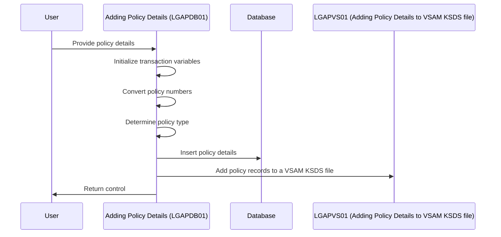
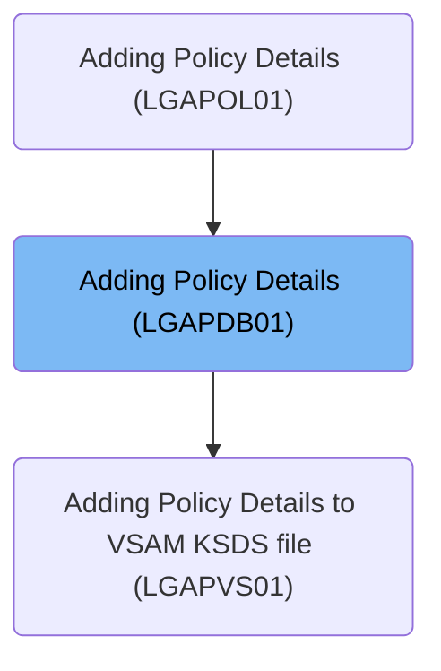
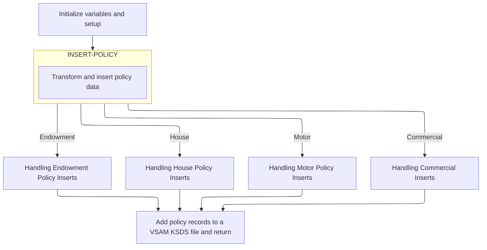

The <SwmToken path="base/src/lgapdb01.cbl" pos="13:6:6" line-data="       PROGRAM-ID. LGAPDB01.">`LGAPDB01`</SwmToken> program handles the insertion of various types of insurance policies into the database, including endowment, house, motor, and commercial policies.

The main steps are:

- Initialize transaction and <SwmToken path="base/src/lgapdb01.cbl" pos="157:5:5" line-data="      * initialize DB2 host variables">`DB2`</SwmToken> variables
- Convert customer and policy numbers to <SwmToken path="base/src/lgapdb01.cbl" pos="157:5:5" line-data="      * initialize DB2 host variables">`DB2`</SwmToken> format
- Determine policy type based on request ID
- Perform policy insertion into the database
- Call to external program for adding policy records to a VSAM KSDS file



# Dependencies

## Modules



## Copybooks

- <SwmToken path="/base/src/lgapdb01.cbl" pos="76:3:3" line-data="             INCLUDE LGPOLICY">`LGPOLICY`</SwmToken> - Customer Details Definition.
- <SwmToken path="/base/src/lgapdb01.cbl" pos="125:3:3" line-data="               INCLUDE SQLCA">`SQLCA`</SwmToken> - DB2 Communication area.
- <SwmToken path="/base/src/lgapdb01.cbl" pos="136:3:3" line-data="             INCLUDE LGCMAREA">`LGCMAREA`</SwmToken> - Commarea.

# Input / Output

- Commarea - defined in <SwmToken path="/base/src/lgapdb01.cbl" pos="136:3:3" line-data="             INCLUDE LGCMAREA">`LGCMAREA`</SwmToken> copybook.

| **Field**                                                                                                                                              | **Description**                              |
| ------------------------------------------------------------------------------------------------------------------------------------------------------ | -------------------------------------------- |
| <SwmToken path="/base/src/lgapdb01.cbl" pos="184:3:7" line-data="           EVALUATE CA-REQUEST-ID">`CA-REQUEST-ID`</SwmToken>                         | Request ID                                   |
| <SwmToken path="/base/src/lgapdb01.cbl" pos="172:9:13" line-data="           MOVE &#39;00&#39; TO CA-RETURN-CODE">`CA-RETURN-CODE`</SwmToken>          | Return code (passed as output)               |
| <SwmToken path="/base/src/lgapdb01.cbl" pos="176:3:7" line-data="           MOVE CA-CUSTOMER-NUM TO DB2-CUSTOMERNUM-INT">`CA-CUSTOMER-NUM`</SwmToken>  | Customer number                              |
| <SwmToken path="/base/src/lgcmarea.cpy" pos="13:3:7" line-data="           03 CA-REQUEST-SPECIFIC      PIC X(32482).">`CA-REQUEST-SPECIFIC`</SwmToken> | Request specific data depending on the input |

# Flow Chart



# Business Logic

## <SwmToken path="/base/src/lgapdb01.cbl" pos="146:1:1" line-data="       MAINLINE SECTION.">`MAINLINE`</SwmToken>

1. Get the transaction details (Transaction ID, Terminal ID, Task number) with the inputs entered by the user.
2. If no input is received, write the error message as 'NO COMMAREA RECEIVED' and terminate the program.
3. Pass the customer number details from the input to internal variables. Set <SwmToken path="/base/src/lgapdb01.cbl" pos="177:11:11" line-data="           MOVE ZERO            TO DB2-C-PolicyNum-INT">`PolicyNum`</SwmToken> as '0'.
4. Set the required field length to 28 initially.
5. Validate the request ID from the input and perform the required operation.
6. Below are the details of the requested operations:

| **Request ID Value**                                                                                                     | **Operation**                                                                                                        |
| ------------------------------------------------------------------------------------------------------------------------ | -------------------------------------------------------------------------------------------------------------------- |
| <SwmToken path="/base/src/lgapdb01.cbl" pos="186:4:4" line-data="             WHEN &#39;01AEND&#39;">`01AEND`</SwmToken> | Add 124 to Required field length.<br>Set the policy type as ‘E’.                                                     |
| <SwmToken path="/base/src/lgapdb01.cbl" pos="190:4:4" line-data="             WHEN &#39;01AHOU&#39;">`01AHOU`</SwmToken> | Add 130 to Required field length.<br>Set the policy type as ‘H’.                                                     |
| <SwmToken path="/base/src/lgapdb01.cbl" pos="194:4:4" line-data="             WHEN &#39;01AMOT&#39;">`01AMOT`</SwmToken> | Add 137 to Required field length.<br>Set the policy type as ‘M’.                                                     |
| <SwmToken path="/base/src/lgapdb01.cbl" pos="198:4:4" line-data="             WHEN &#39;01ACOM&#39;">`01ACOM`</SwmToken> | Add 1174 to Required field length.<br>Set the policy type as ‘C’.                                                    |
| Other&nbsp;                                                                                                              | Display message ‘Request is not recognised or supported’ to the user.<br>Return to the source with return code ‘99’. |

7. If the input data length received is less than the required length, set the return code as '98' and return to the source module.
8. Insert the values received from input into the <SwmToken path="/base/src/lgapdb01.cbl" pos="270:3:3" line-data="                       ( POLICYNUMBER,">`POLICYNUMBER`</SwmToken> table (<SwmToken path="/base/src/lgapdb01.cbl" pos="219:3:5" line-data="           PERFORM INSERT-POLICY">`INSERT-POLICY`</SwmToken>).

| **Table Value**                                                                                                                            | **Value from Input**                   |
| ------------------------------------------------------------------------------------------------------------------------------------------ | -------------------------------------- |
| <SwmToken path="/base/src/lgapdb01.cbl" pos="270:3:3" line-data="                       ( POLICYNUMBER,">`POLICYNUMBER`</SwmToken>         | Default value                          |
| <SwmToken path="/base/src/lgapdb01.cbl" pos="271:1:1" line-data="                         CUSTOMERNUMBER,">`CUSTOMERNUMBER`</SwmToken>     | From input converted into Integer form |
| <SwmToken path="/base/src/lgapdb01.cbl" pos="272:1:1" line-data="                         ISSUEDATE,">`ISSUEDATE`</SwmToken>               | From input                             |
| <SwmToken path="/base/src/lgapdb01.cbl" pos="273:1:1" line-data="                         EXPIRYDATE,">`EXPIRYDATE`</SwmToken>             | From input                             |
| <SwmToken path="/base/src/lgapdb01.cbl" pos="274:1:1" line-data="                         POLICYTYPE,">`POLICYTYPE`</SwmToken>             | Derived above based on the request id  |
| <SwmToken path="/base/src/lgapdb01.cbl" pos="275:1:1" line-data="                         LASTCHANGED,">`LASTCHANGED`</SwmToken>           | Current timestamp                      |
| <SwmToken path="/base/src/lgapdb01.cbl" pos="276:1:1" line-data="                         BROKERID,">`BROKERID`</SwmToken>                 | From input converted into Integer form |
| <SwmToken path="/base/src/lgapdb01.cbl" pos="277:1:1" line-data="                         BROKERSREFERENCE,">`BROKERSREFERENCE`</SwmToken> | From input                             |
| <SwmToken path="/base/src/lgapdb01.cbl" pos="278:1:1" line-data="                         PAYMENT           )">`PAYMENT`</SwmToken>        | From input converted into Integer form |

- Based on the return code of the SQL operation, continue the flow if successful. Return to the source module with return code '70' when SQLCODE is -530. For any other code, return to the source module with return code '90'. In both cases, write a record to the error file.
- Get the generated policy number from the table and move it to the policy number field. Retrieve the <SwmToken path="/base/src/lgapdb01.cbl" pos="317:3:3" line-data="             SELECT LASTCHANGED">`LASTCHANGED`</SwmToken> value from the table based on the policy number.

9. Based on the request ID, call the appropriate routine as follows:

### <SwmToken path="/base/src/lgapdb01.cbl" pos="225:4:4" line-data="             WHEN &#39;01AEND&#39;">`01AEND`</SwmToken> - call <SwmToken path="/base/src/lgapdb01.cbl" pos="327:1:3" line-data="       INSERT-ENDOW.">`INSERT-ENDOW`</SwmToken>

- Convert <SwmToken path="/base/src/lgapdb01.cbl" pos="330:7:7" line-data="           MOVE CA-E-TERM        TO DB2-E-TERM-SINT">`TERM`</SwmToken> and SUM ASSURED values from input to integer format.
- Calculate how many bytes of data to copy by subtracting the fixed control area length (<SwmToken path="/base/src/lgapdb01.cbl" pos="339:3:9" line-data="           SUBTRACT WS-REQUIRED-CA-LEN FROM EIBCALEN">`WS-REQUIRED-CA-LEN`</SwmToken>) from the total length of input data received (<SwmToken path="/base/src/lgapdb01.cbl" pos="339:13:13" line-data="           SUBTRACT WS-REQUIRED-CA-LEN FROM EIBCALEN">`EIBCALEN`</SwmToken>). This result is stored in <SwmToken path="/base/src/lgapdb01.cbl" pos="340:3:7" line-data="               GIVING WS-VARY-LEN">`WS-VARY-LEN`</SwmToken>, which represents the length of the variable portion of the data.
- If the result (<SwmToken path="/base/src/lgapdb01.cbl" pos="342:3:7" line-data="           IF WS-VARY-LEN IS GREATER THAN ZERO">`WS-VARY-LEN`</SwmToken>) is greater than 0, move that many bytes (<SwmToken path="/base/src/lgapdb01.cbl" pos="345:11:15" line-data="                  TO WS-VARY-CHAR(1:WS-VARY-LEN)">`WS-VARY-LEN`</SwmToken>) from the full input buffer (<SwmToken path="/base/src/lgapdb01.cbl" pos="344:3:9" line-data="              MOVE CA-E-PADDING-DATA">`CA-E-PADDING-DATA`</SwmToken>) into a working field (<SwmToken path="/base/src/lgapdb01.cbl" pos="345:3:7" line-data="                  TO WS-VARY-CHAR(1:WS-VARY-LEN)">`WS-VARY-CHAR`</SwmToken>), starting at position 1, and insert the details into the <SwmToken path="/base/src/lgapdb01.cbl" pos="369:5:5" line-data="                INSERT INTO ENDOWMENT">`ENDOWMENT`</SwmToken> table.

| **Table field**                                                                                                                         | **Value**                   |
| --------------------------------------------------------------------------------------------------------------------------------------- | --------------------------- |
| <SwmToken path="/base/src/lgapdb01.cbl" pos="348:3:3" line-data="                          ( POLICYNUMBER,">`POLICYNUMBER`</SwmToken>   | Policy number derived above |
| <SwmToken path="/base/src/lgapdb01.cbl" pos="349:1:1" line-data="                            WITHPROFITS,">`WITHPROFITS`</SwmToken>     | From input                  |
| <SwmToken path="/base/src/lgapdb01.cbl" pos="350:1:1" line-data="                            EQUITIES,">`EQUITIES`</SwmToken>           | From input                  |
| <SwmToken path="/base/src/lgapdb01.cbl" pos="351:1:1" line-data="                            MANAGEDFUND,">`MANAGEDFUND`</SwmToken>     | From input                  |
| <SwmToken path="/base/src/lgapdb01.cbl" pos="352:1:1" line-data="                            FUNDNAME,">`FUNDNAME`</SwmToken>           | From input                  |
| <SwmToken path="/base/src/lgapdb01.cbl" pos="353:1:1" line-data="                            TERM,">`TERM`</SwmToken>                   | From input converted above  |
| <SwmToken path="/base/src/lgapdb01.cbl" pos="354:1:1" line-data="                            SUMASSURED,">`SUMASSURED`</SwmToken>       | From input converted above  |
| <SwmToken path="/base/src/lgapdb01.cbl" pos="355:1:1" line-data="                            LIFEASSURED,">`LIFEASSURED`</SwmToken>     | From input                  |
| <SwmToken path="/base/src/lgapdb01.cbl" pos="356:1:1" line-data="                            PADDINGDATA    )">`PADDINGDATA`</SwmToken> | WS-VARY-CHAR from above     |

- If the result is not greater than zero, insert the following values into the <SwmToken path="/base/src/lgapdb01.cbl" pos="369:5:5" line-data="                INSERT INTO ENDOWMENT">`ENDOWMENT`</SwmToken> table.

| **Table Field**                                                                                                                         | **Values**                  |
| --------------------------------------------------------------------------------------------------------------------------------------- | --------------------------- |
| <SwmToken path="/base/src/lgapdb01.cbl" pos="370:3:3" line-data="                          ( POLICYNUMBER,">`POLICYNUMBER`</SwmToken>   | Policy number derived above |
| <SwmToken path="/base/src/lgapdb01.cbl" pos="371:1:1" line-data="                            WITHPROFITS,">`WITHPROFITS`</SwmToken>     | From input                  |
| <SwmToken path="/base/src/lgapdb01.cbl" pos="372:1:1" line-data="                            EQUITIES,">`EQUITIES`</SwmToken>           | From input                  |
| <SwmToken path="/base/src/lgapdb01.cbl" pos="373:1:1" line-data="                            MANAGEDFUND,">`MANAGEDFUND`</SwmToken>     | From input                  |
| <SwmToken path="/base/src/lgapdb01.cbl" pos="374:1:1" line-data="                            FUNDNAME,">`FUNDNAME`</SwmToken>           | From input                  |
| <SwmToken path="/base/src/lgapdb01.cbl" pos="375:1:1" line-data="                            TERM,">`TERM`</SwmToken>                   | From input converted above  |
| <SwmToken path="/base/src/lgapdb01.cbl" pos="376:1:1" line-data="                            SUMASSURED,">`SUMASSURED`</SwmToken>       | From input converted above  |
| <SwmToken path="/base/src/lgapdb01.cbl" pos="377:1:1" line-data="                            LIFEASSURED    )">`LIFEASSURED`</SwmToken> | From input                  |

- If the insert operation is not successful, return to the source module with return code '90' and write an error record.

### <SwmToken path="/base/src/lgapdb01.cbl" pos="228:4:4" line-data="             WHEN &#39;01AHOU&#39;">`01AHOU`</SwmToken> - call <SwmToken path="/base/src/lgapdb01.cbl" pos="229:3:5" line-data="               PERFORM INSERT-HOUSE">`INSERT-HOUSE`</SwmToken>

- Convert <SwmToken path="/base/src/lgapdb01.cbl" pos="405:3:7" line-data="           MOVE CA-H-VALUE       TO DB2-H-VALUE-INT">`CA-H-VALUE`</SwmToken> and <SwmToken path="/base/src/lgapdb01.cbl" pos="406:3:7" line-data="           MOVE CA-H-BEDROOMS    TO DB2-H-BEDROOMS-SINT">`CA-H-BEDROOMS`</SwmToken> values from input to integer format.
- Insert the following details into the <SwmToken path="/base/src/lgapdb01.cbl" pos="410:5:5" line-data="             INSERT INTO HOUSE">`HOUSE`</SwmToken> table.

| **Table Field**                                                                                                                      | **Value**                   |
| ------------------------------------------------------------------------------------------------------------------------------------ | --------------------------- |
| <SwmToken path="/base/src/lgapdb01.cbl" pos="411:3:3" line-data="                       ( POLICYNUMBER,">`POLICYNUMBER`</SwmToken>   | Policy number derived above |
| <SwmToken path="/base/src/lgapdb01.cbl" pos="412:1:1" line-data="                         PROPERTYTYPE,">`PROPERTYTYPE`</SwmToken>   | From input                  |
| <SwmToken path="/base/src/lgapdb01.cbl" pos="413:1:1" line-data="                         BEDROOMS,">`BEDROOMS`</SwmToken>           | From input converted above  |
| <SwmToken path="/base/src/lgapdb01.cbl" pos="414:1:1" line-data="                         VALUE,">`VALUE`</SwmToken>                 | From input converted above  |
| <SwmToken path="/base/src/lgapdb01.cbl" pos="415:1:1" line-data="                         HOUSENAME,">`HOUSENAME`</SwmToken>         | From input                  |
| <SwmToken path="/base/src/lgapdb01.cbl" pos="416:1:1" line-data="                         HOUSENUMBER,">`HOUSENUMBER`</SwmToken>     | From input                  |
| <SwmToken path="/base/src/lgapdb01.cbl" pos="417:1:1" line-data="                         POSTCODE          )">`POSTCODE`</SwmToken> | From input                  |

- If the insert operation is not successful, return to the source module with return code '90' and write an error record.

### <SwmToken path="/base/src/lgapdb01.cbl" pos="231:4:4" line-data="             WHEN &#39;01AMOT&#39;">`01AMOT`</SwmToken> - call <SwmToken path="/base/src/lgapdb01.cbl" pos="232:3:5" line-data="               PERFORM INSERT-MOTOR">`INSERT-MOTOR`</SwmToken>

- Convert <SwmToken path="/base/src/lgapdb01.cbl" pos="443:3:7" line-data="           MOVE CA-M-VALUE       TO DB2-M-VALUE-INT">`CA-M-VALUE`</SwmToken>, <SwmToken path="/base/src/lgapdb01.cbl" pos="444:3:7" line-data="           MOVE CA-M-CC          TO DB2-M-CC-SINT">`CA-M-CC`</SwmToken>, <SwmToken path="/base/src/lgapdb01.cbl" pos="445:3:7" line-data="           MOVE CA-M-PREMIUM     TO DB2-M-PREMIUM-INT">`CA-M-PREMIUM`</SwmToken>, and <SwmToken path="/base/src/lgapdb01.cbl" pos="446:3:7" line-data="           MOVE CA-M-ACCIDENTS   TO DB2-M-ACCIDENTS-INT">`CA-M-ACCIDENTS`</SwmToken> values from input to integer format.
- Insert the following details into the <SwmToken path="/base/src/lgapdb01.cbl" pos="450:5:5" line-data="             INSERT INTO MOTOR">`MOTOR`</SwmToken> table.

| **Table Field**                                                                                                                              | **Value**                   |
| -------------------------------------------------------------------------------------------------------------------------------------------- | --------------------------- |
| <SwmToken path="/base/src/lgapdb01.cbl" pos="451:3:3" line-data="                       ( POLICYNUMBER,">`POLICYNUMBER`</SwmToken>           | Policy number derived above |
| <SwmToken path="/base/src/lgapdb01.cbl" pos="452:1:1" line-data="                         MAKE,">`MAKE`</SwmToken>                           | From input                  |
| <SwmToken path="/base/src/lgapdb01.cbl" pos="453:1:1" line-data="                         MODEL,">`MODEL`</SwmToken>                         | From input                  |
| <SwmToken path="/base/src/lgapdb01.cbl" pos="454:1:1" line-data="                         VALUE,">`VALUE`</SwmToken>                         | From input converted above  |
| <SwmToken path="/base/src/lgapdb01.cbl" pos="455:1:1" line-data="                         REGNUMBER,">`REGNUMBER`</SwmToken>                 | From input                  |
| <SwmToken path="/base/src/lgapdb01.cbl" pos="456:1:1" line-data="                         COLOUR,">`COLOUR`</SwmToken>                       | From input                  |
| <SwmToken path="/base/src/lgapdb01.cbl" pos="457:1:1" line-data="                         CC,">`CC`</SwmToken>                               | From input converted above  |
| <SwmToken path="/base/src/lgapdb01.cbl" pos="458:1:1" line-data="                         YEAROFMANUFACTURE,">`YEAROFMANUFACTURE`</SwmToken> | From input                  |
| <SwmToken path="/base/src/lgapdb01.cbl" pos="459:1:1" line-data="                         PREMIUM,">`PREMIUM`</SwmToken>                     | From input converted above  |
| <SwmToken path="/base/src/lgapdb01.cbl" pos="460:1:1" line-data="                         ACCIDENTS )">`ACCIDENTS`</SwmToken>                | From input converted above  |

- If the insert operation is not successful, return to the source module with return code '90' and write an error record.

### <SwmToken path="/base/src/lgapdb01.cbl" pos="234:4:4" line-data="             WHEN &#39;01ACOM&#39;">`01ACOM`</SwmToken> - call <SwmToken path="/base/src/lgapdb01.cbl" pos="235:3:5" line-data="               PERFORM INSERT-COMMERCIAL">`INSERT-COMMERCIAL`</SwmToken>

- Convert <SwmToken path="/base/src/lgapdb01.cbl" pos="488:3:7" line-data="           MOVE CA-B-FirePeril       To DB2-B-FirePeril-Int">`CA-B-FirePeril`</SwmToken>, <SwmToken path="/base/src/lgapdb01.cbl" pos="489:3:7" line-data="           MOVE CA-B-FirePremium     To DB2-B-FirePremium-Int">`CA-B-FirePremium`</SwmToken>, <SwmToken path="/base/src/lgapdb01.cbl" pos="490:3:7" line-data="           MOVE CA-B-CrimePeril      To DB2-B-CrimePeril-Int">`CA-B-CrimePeril`</SwmToken>, <SwmToken path="/base/src/lgapdb01.cbl" pos="491:3:7" line-data="           MOVE CA-B-CrimePremium    To DB2-B-CrimePremium-Int">`CA-B-CrimePremium`</SwmToken>, <SwmToken path="/base/src/lgapdb01.cbl" pos="492:3:7" line-data="           MOVE CA-B-FloodPeril      To DB2-B-FloodPeril-Int">`CA-B-FloodPeril`</SwmToken>, <SwmToken path="/base/src/lgapdb01.cbl" pos="493:3:7" line-data="           MOVE CA-B-FloodPremium    To DB2-B-FloodPremium-Int">`CA-B-FloodPremium`</SwmToken>, <SwmToken path="/base/src/lgapdb01.cbl" pos="494:3:7" line-data="           MOVE CA-B-WeatherPeril    To DB2-B-WeatherPeril-Int">`CA-B-WeatherPeril`</SwmToken>, <SwmToken path="/base/src/lgapdb01.cbl" pos="495:3:7" line-data="           MOVE CA-B-WeatherPremium  To DB2-B-WeatherPremium-Int">`CA-B-WeatherPremium`</SwmToken>, and <SwmToken path="/base/src/lgapdb01.cbl" pos="496:3:7" line-data="           MOVE CA-B-Status          To DB2-B-Status-Int">`CA-B-Status`</SwmToken> values from input to integer format.
- Insert the following details into the <SwmToken path="/base/src/lgapdb01.cbl" pos="500:5:5" line-data="             INSERT INTO COMMERCIAL">`COMMERCIAL`</SwmToken> table.

| **Table Field**                                                                                                                         | **Value**                   |
| --------------------------------------------------------------------------------------------------------------------------------------- | --------------------------- |
| <SwmToken path="/base/src/lgapdb01.cbl" pos="502:1:1" line-data="                         PolicyNumber,">`PolicyNumber`</SwmToken>      | Policy number derived above |
| <SwmToken path="/base/src/lgapdb01.cbl" pos="503:1:1" line-data="                         RequestDate,">`RequestDate`</SwmToken>        | LASTCHANGED value derived   |
| <SwmToken path="/base/src/lgapdb01.cbl" pos="504:1:1" line-data="                         StartDate,">`StartDate`</SwmToken>            | From input                  |
| <SwmToken path="/base/src/lgapdb01.cbl" pos="505:1:1" line-data="                         RenewalDate,">`RenewalDate`</SwmToken>        | From input                  |
| <SwmToken path="/base/src/lgapdb01.cbl" pos="506:1:1" line-data="                         Address,">`Address`</SwmToken>                | From input                  |
| <SwmToken path="/base/src/lgapdb01.cbl" pos="507:1:1" line-data="                         Zipcode,">`Zipcode`</SwmToken>                | From input                  |
| <SwmToken path="/base/src/lgapdb01.cbl" pos="508:1:1" line-data="                         LatitudeN,">`LatitudeN`</SwmToken>            | From input                  |
| <SwmToken path="/base/src/lgapdb01.cbl" pos="509:1:1" line-data="                         LongitudeW,">`LongitudeW`</SwmToken>          | From input                  |
| <SwmToken path="/base/src/lgapdb01.cbl" pos="510:1:1" line-data="                         Customer,">`Customer`</SwmToken>              | From input                  |
| <SwmToken path="/base/src/lgapdb01.cbl" pos="511:1:1" line-data="                         PropertyType,">`PropertyType`</SwmToken>      | From input                  |
| <SwmToken path="/base/src/lgapdb01.cbl" pos="512:1:1" line-data="                         FirePeril,">`FirePeril`</SwmToken>            | From input derived above    |
| <SwmToken path="/base/src/lgapdb01.cbl" pos="513:1:1" line-data="                         FirePremium,">`FirePremium`</SwmToken>        | From input derived above    |
| <SwmToken path="/base/src/lgapdb01.cbl" pos="514:1:1" line-data="                         CrimePeril,">`CrimePeril`</SwmToken>          | From input derived above    |
| <SwmToken path="/base/src/lgapdb01.cbl" pos="515:1:1" line-data="                         CrimePremium,">`CrimePremium`</SwmToken>      | From input derived above    |
| <SwmToken path="/base/src/lgapdb01.cbl" pos="516:1:1" line-data="                         FloodPeril,">`FloodPeril`</SwmToken>          | From input derived above    |
| <SwmToken path="/base/src/lgapdb01.cbl" pos="517:1:1" line-data="                         FloodPremium,">`FloodPremium`</SwmToken>      | From input derived above    |
| <SwmToken path="/base/src/lgapdb01.cbl" pos="518:1:1" line-data="                         WeatherPeril,">`WeatherPeril`</SwmToken>      | From input derived above    |
| <SwmToken path="/base/src/lgapdb01.cbl" pos="519:1:1" line-data="                         WeatherPremium,">`WeatherPremium`</SwmToken>  | From input derived above    |
| <SwmToken path="/base/src/lgapdb01.cbl" pos="520:1:1" line-data="                         Status,">`Status`</SwmToken>                  | From input derived above    |
| <SwmToken path="/base/src/lgapdb01.cbl" pos="521:1:1" line-data="                         RejectionReason">`RejectionReason`</SwmToken> | From input                  |

- If the insert operation is not successful, return to the source module with return code '90' and write an error record.

### Other

- Display message ‘Request is not recognized or supported’ to the user. Return to the source with return code ‘99’.

10. Call the <SwmToken path="/base/src/lgapdb01.cbl" pos="243:9:9" line-data="             EXEC CICS Link Program(LGAPVS01)">`LGAPVS01`</SwmToken> module to add the policy details to Policy KSDS file.
11. Return the details to the source module.

## <SwmToken path="/base/src/lgapdb01.cbl" pos="562:1:5" line-data="       WRITE-ERROR-MESSAGE.">`WRITE-ERROR-MESSAGE`</SwmToken>

This paragraph is responsible for logging error information when something goes wrong during processing. It captures details about the error, including a code, the current date and time, and any additional data provided, and sends this information to a temporary storage area (called a Transient Data Queue, or TDQ) for later review or processing.

1. The program takes a specific error code (called SQLCODE), which indicates what went wrong in a database operation, and stores it in a field called <SwmToken path="/base/src/lgapdb01.cbl" pos="564:7:9" line-data="           MOVE SQLCODE TO EM-SQLRC">`EM-SQLRC`</SwmToken>. This helps identify the exact issue later.

2. The program asks the system for the current time in a special format (a numeric value called <SwmToken path="/base/src/lgapdb01.cbl" pos="568:9:11" line-data="           EXEC CICS FORMATTIME ABSTIME(ABS-TIME)">`ABS-TIME`</SwmToken>). It then converts this time into a readable format. The date is formatted as MMDDYYYY and stored in a field called <SwmToken path="/base/src/lgapdb01.cbl" pos="572:3:3" line-data="           MOVE DATE1 TO EM-DATE">`DATE1`</SwmToken>. The time is formatted and stored in a field called <SwmToken path="/base/src/lgapdb01.cbl" pos="573:3:3" line-data="           MOVE TIME1 TO EM-TIME">`TIME1`</SwmToken>. These formatted values are copied into fields <SwmToken path="/base/src/lgapdb01.cbl" pos="572:7:9" line-data="           MOVE DATE1 TO EM-DATE">`EM-DATE`</SwmToken> and <SwmToken path="/base/src/lgapdb01.cbl" pos="573:7:9" line-data="           MOVE TIME1 TO EM-TIME">`EM-TIME`</SwmToken> to include in the error message.

3. The program creates an error message that includes the error code, date, and time (stored in a structure called <SwmToken path="/base/src/lgapdb01.cbl" pos="576:3:5" line-data="                     COMMAREA(ERROR-MSG)">`ERROR-MSG`</SwmToken>). It calls another program named LGSTSQ to write this error message to a temporary storage area (the TDQ). The message is sent along with its size to ensure proper handling.

4. The program checks if there's any extra data related to the error (stored in a communication area called DFHCOMMAREA) by looking at its length (EIBCALEN).\
   If there is extra data:&nbsp;

   1. If the data is 90 bytes or less, the program copies all of it into a field called <SwmToken path="/base/src/lgapdb01.cbl" pos="588:12:14" line-data="               MOVE DFHCOMMAREA(1:90) TO CA-DATA">`CA-DATA`</SwmToken>.
   2. If the data is more than 90 bytes, the program copies only the first 90 bytes into <SwmToken path="/base/src/lgapdb01.cbl" pos="588:12:14" line-data="               MOVE DFHCOMMAREA(1:90) TO CA-DATA">`CA-DATA`</SwmToken> to avoid exceeding limits.&nbsp;
   3. This copied data is formatted into another message structure (<SwmToken path="/base/src/lgapdb01.cbl" pos="585:7:11" line-data="                         LENGTH(LENGTH OF CA-ERROR-MSG)">`CA-ERROR-MSG`</SwmToken>).
   4. The program again calls LGSTSQ to write this additional error information to the same temporary storage area, including the size of the message.
   5. If there's no extra data (i.e., EIBCALEN is 0), this step is skipped.

5. After completing the above steps, the program exits this section and returns control to the main program.

# Screens

## Customer selection screen


# Code walkthrough

## Initializing Transaction Variables

<SwmSnippet path="/base/src/lgapdb01.cbl" line="146">

---

We start by setting up transaction and <SwmToken path="base/src/lgapdb01.cbl" pos="157:5:5" line-data="      * initialize DB2 host variables">`DB2`</SwmToken> variables to prepare for the operations ahead.

```cobol
       MAINLINE SECTION.

      * initialize working storage variables
           INITIALIZE WS-HEADER.
      * set up general variable
           MOVE EIBTRNID TO WS-TRANSID.
           MOVE EIBTRMID TO WS-TERMID.
           MOVE EIBTASKN TO WS-TASKNUM.
           MOVE EIBCALEN TO WS-CALEN.
      *----------------------------------------------------------------*

      * initialize DB2 host variables
           INITIALIZE DB2-IN-INTEGERS.
           INITIALIZE DB2-OUT-INTEGERS.
```

---

</SwmSnippet>

<SwmSnippet path="/base/src/lgapdb01.cbl" line="172">

---

We convert customer and policy numbers to <SwmToken path="base/src/lgapdb01.cbl" pos="175:17:17" line-data="      * Convert commarea customer &amp; policy nums to DB2 integer format">`DB2`</SwmToken> format and check commarea length to prep for request ID evaluation.

```cobol
           MOVE '00' TO CA-RETURN-CODE
           SET WS-ADDR-DFHCOMMAREA TO ADDRESS OF DFHCOMMAREA.

      * Convert commarea customer & policy nums to DB2 integer format
           MOVE CA-CUSTOMER-NUM TO DB2-CUSTOMERNUM-INT
           MOVE ZERO            TO DB2-C-PolicyNum-INT
      * and save in error msg field incase required
           MOVE CA-CUSTOMER-NUM TO EM-CUSNUM

      * Check commarea length
           ADD WS-CA-HEADER-LEN TO WS-REQUIRED-CA-LEN
```

---

</SwmSnippet>

<SwmSnippet path="/base/src/lgapdb01.cbl" line="184">

---

This part uses an EVALUATE statement to determine the policy type based on <SwmToken path="base/src/lgapdb01.cbl" pos="184:3:7" line-data="           EVALUATE CA-REQUEST-ID">`CA-REQUEST-ID`</SwmToken>. It adjusts the required commarea length and sets the policy type for database operations.

```cobol
           EVALUATE CA-REQUEST-ID

             WHEN '01AEND'
               ADD WS-FULL-ENDOW-LEN TO WS-REQUIRED-CA-LEN
               MOVE 'E' TO DB2-POLICYTYPE

             WHEN '01AHOU'
               ADD WS-FULL-HOUSE-LEN TO WS-REQUIRED-CA-LEN
               MOVE 'H' TO DB2-POLICYTYPE

             WHEN '01AMOT'
               ADD WS-FULL-MOTOR-LEN TO WS-REQUIRED-CA-LEN
               MOVE 'M' TO DB2-POLICYTYPE

             WHEN '01ACOM'
               ADD WS-FULL-COMM-LEN TO WS-REQUIRED-CA-LEN
               MOVE 'C' TO DB2-POLICYTYPE
```

---

</SwmSnippet>

<SwmSnippet path="/base/src/lgapdb01.cbl" line="202">

---

We handle unsupported requests by setting a return code and exiting.

```cobol
             WHEN OTHER
      *        Request is not recognised or supported
               MOVE '99' TO CA-RETURN-CODE
               EXEC CICS RETURN END-EXEC

           END-EVALUATE
```

---

</SwmSnippet>

<SwmSnippet path="/base/src/lgapdb01.cbl" line="219">

---

This snippet performs <SwmToken path="base/src/lgapdb01.cbl" pos="219:3:5" line-data="           PERFORM INSERT-POLICY">`INSERT-POLICY`</SwmToken> to add a new policy to the database.

```cobol
           PERFORM INSERT-POLICY
```

---

</SwmSnippet>

<SwmSnippet path="/base/src/lgapdb01.cbl" line="223">

---

We evaluate request IDs to perform the correct policy insertion.

```cobol
           EVALUATE CA-REQUEST-ID

             WHEN '01AEND'
               PERFORM INSERT-ENDOW

             WHEN '01AHOU'
               PERFORM INSERT-HOUSE

             WHEN '01AMOT'
               PERFORM INSERT-MOTOR

             WHEN '01ACOM'
               PERFORM INSERT-COMMERCIAL

             WHEN OTHER
      *        Request is not recognised or supported
               MOVE '99' TO CA-RETURN-CODE

           END-EVALUATE
```

---

</SwmSnippet>

## Processing Endowment Policies

<SwmSnippet path="/base/src/lgapdb01.cbl" line="327">

---

In <SwmToken path="base/src/lgapdb01.cbl" pos="327:1:3" line-data="       INSERT-ENDOW.">`INSERT-ENDOW`</SwmToken>, we move numeric fields to integer format and calculate <SwmToken path="base/src/lgapdb01.cbl" pos="340:3:7" line-data="               GIVING WS-VARY-LEN">`WS-VARY-LEN`</SwmToken> to decide whether to include Varchar fields in the SQL INSERT statement.

```cobol
       INSERT-ENDOW.

      *    Move numeric fields to integer format
           MOVE CA-E-TERM        TO DB2-E-TERM-SINT
           MOVE CA-E-SUM-ASSURED TO DB2-E-SUMASSURED-INT

           MOVE ' INSERT ENDOW ' TO EM-SQLREQ
      *----------------------------------------------------------------*
      *    There are 2 versions of INSERT...                           *
      *      one which updates all fields including Varchar            *
      *      one which updates all fields Except Varchar               *
      *----------------------------------------------------------------*
           SUBTRACT WS-REQUIRED-CA-LEN FROM EIBCALEN
               GIVING WS-VARY-LEN
```

---

</SwmSnippet>

<SwmSnippet path="/base/src/lgapdb01.cbl" line="342">

---

If <SwmToken path="base/src/lgapdb01.cbl" pos="342:3:7" line-data="           IF WS-VARY-LEN IS GREATER THAN ZERO">`WS-VARY-LEN`</SwmToken> is greater than zero, we move Varchar data to <SwmToken path="base/src/lgapdb01.cbl" pos="345:3:7" line-data="                  TO WS-VARY-CHAR(1:WS-VARY-LEN)">`WS-VARY-CHAR`</SwmToken> and execute an SQL INSERT statement that includes this data.

```cobol
           IF WS-VARY-LEN IS GREATER THAN ZERO
      *       Commarea contains data for Varchar field
              MOVE CA-E-PADDING-DATA
                  TO WS-VARY-CHAR(1:WS-VARY-LEN)
              EXEC SQL
                INSERT INTO ENDOWMENT
                          ( POLICYNUMBER,
                            WITHPROFITS,
                            EQUITIES,
                            MANAGEDFUND,
                            FUNDNAME,
                            TERM,
                            SUMASSURED,
                            LIFEASSURED,
                            PADDINGDATA    )
                   VALUES ( :DB2-POLICYNUM-INT,
                            :CA-E-WITH-PROFITS,
                            :CA-E-EQUITIES,
                            :CA-E-MANAGED-FUND,
                            :CA-E-FUND-NAME,
                            :DB2-E-TERM-SINT,
                            :DB2-E-SUMASSURED-INT,
                            :CA-E-LIFE-ASSURED,
                            :WS-VARY-FIELD )
              END-EXEC
```

---

</SwmSnippet>

<SwmSnippet path="/base/src/lgapdb01.cbl" line="367">

---

We insert data without Varchar fields when <SwmToken path="base/src/lgapdb01.cbl" pos="340:3:7" line-data="               GIVING WS-VARY-LEN">`WS-VARY-LEN`</SwmToken> isn't positive.

```cobol
           ELSE
              EXEC SQL
                INSERT INTO ENDOWMENT
                          ( POLICYNUMBER,
                            WITHPROFITS,
                            EQUITIES,
                            MANAGEDFUND,
                            FUNDNAME,
                            TERM,
                            SUMASSURED,
                            LIFEASSURED    )
                   VALUES ( :DB2-POLICYNUM-INT,
                            :CA-E-WITH-PROFITS,
                            :CA-E-EQUITIES,
                            :CA-E-MANAGED-FUND,
                            :CA-E-FUND-NAME,
                            :DB2-E-TERM-SINT,
                            :DB2-E-SUMASSURED-INT,
                            :CA-E-LIFE-ASSURED )
              END-EXEC
```

---

</SwmSnippet>

## Inserting House Policies

<SwmSnippet path="/base/src/lgapdb01.cbl" line="402">

---

In <SwmToken path="base/src/lgapdb01.cbl" pos="402:1:3" line-data="       INSERT-HOUSE.">`INSERT-HOUSE`</SwmToken>, we prepare data by converting numeric fields to integer format, construct an SQL INSERT statement, and execute it to add a house record to the database.

```cobol
       INSERT-HOUSE.

      *    Move numeric fields to integer format
           MOVE CA-H-VALUE       TO DB2-H-VALUE-INT
           MOVE CA-H-BEDROOMS    TO DB2-H-BEDROOMS-SINT

           MOVE ' INSERT HOUSE ' TO EM-SQLREQ
           EXEC SQL
             INSERT INTO HOUSE
                       ( POLICYNUMBER,
                         PROPERTYTYPE,
                         BEDROOMS,
                         VALUE,
                         HOUSENAME,
                         HOUSENUMBER,
                         POSTCODE          )
                VALUES ( :DB2-POLICYNUM-INT,
                         :CA-H-PROPERTY-TYPE,
                         :DB2-H-BEDROOMS-SINT,
                         :DB2-H-VALUE-INT,
                         :CA-H-HOUSE-NAME,
                         :CA-H-HOUSE-NUMBER,
                         :CA-H-POSTCODE      )
           END-EXEC
```

---

</SwmSnippet>

## Storing Motor Policies

<SwmSnippet path="/base/src/lgapdb01.cbl" line="440">

---

In <SwmToken path="base/src/lgapdb01.cbl" pos="440:1:3" line-data="       INSERT-MOTOR.">`INSERT-MOTOR`</SwmToken>, we prepare data by converting values to integer formats, construct an SQL INSERT statement, and execute it to add a motor record to the database.

```cobol
       INSERT-MOTOR.

      *    Move numeric fields to integer format
           MOVE CA-M-VALUE       TO DB2-M-VALUE-INT
           MOVE CA-M-CC          TO DB2-M-CC-SINT
           MOVE CA-M-PREMIUM     TO DB2-M-PREMIUM-INT
           MOVE CA-M-ACCIDENTS   TO DB2-M-ACCIDENTS-INT

           MOVE ' INSERT MOTOR ' TO EM-SQLREQ
           EXEC SQL
             INSERT INTO MOTOR
                       ( POLICYNUMBER,
                         MAKE,
                         MODEL,
                         VALUE,
                         REGNUMBER,
                         COLOUR,
                         CC,
                         YEAROFMANUFACTURE,
                         PREMIUM,
                         ACCIDENTS )
                VALUES ( :DB2-POLICYNUM-INT,
                         :CA-M-MAKE,
                         :CA-M-MODEL,
                         :DB2-M-VALUE-INT,
                         :CA-M-REGNUMBER,
                         :CA-M-COLOUR,
                         :DB2-M-CC-SINT,
                         :CA-M-MANUFACTURED,
                         :DB2-M-PREMIUM-INT,
                         :DB2-M-ACCIDENTS-INT )
           END-EXEC
```

---

</SwmSnippet>

## Adding Commercial Policies

<SwmSnippet path="/base/src/lgapdb01.cbl" line="486">

---

In <SwmToken path="base/src/lgapdb01.cbl" pos="486:1:3" line-data="       INSERT-COMMERCIAL.">`INSERT-COMMERCIAL`</SwmToken>, we prepare data by moving it to integer formats, construct an SQL INSERT statement, and execute it to add a commercial record to the database.

```cobol
       INSERT-COMMERCIAL.

           MOVE CA-B-FirePeril       To DB2-B-FirePeril-Int
           MOVE CA-B-FirePremium     To DB2-B-FirePremium-Int
           MOVE CA-B-CrimePeril      To DB2-B-CrimePeril-Int
           MOVE CA-B-CrimePremium    To DB2-B-CrimePremium-Int
           MOVE CA-B-FloodPeril      To DB2-B-FloodPeril-Int
           MOVE CA-B-FloodPremium    To DB2-B-FloodPremium-Int
           MOVE CA-B-WeatherPeril    To DB2-B-WeatherPeril-Int
           MOVE CA-B-WeatherPremium  To DB2-B-WeatherPremium-Int
           MOVE CA-B-Status          To DB2-B-Status-Int

           MOVE ' INSERT COMMER' TO EM-SQLREQ
```

---

</SwmSnippet>

<SwmSnippet path="/base/src/lgapdb01.cbl" line="499">

---

This snippet constructs an SQL INSERT statement to add a new record to the COMMERCIAL table, specifying columns and values for correct data insertion.

```cobol
           EXEC SQL
             INSERT INTO COMMERCIAL
                       (
                         PolicyNumber,
                         RequestDate,
                         StartDate,
                         RenewalDate,
                         Address,
                         Zipcode,
                         LatitudeN,
                         LongitudeW,
                         Customer,
                         PropertyType,
                         FirePeril,
                         FirePremium,
                         CrimePeril,
                         CrimePremium,
                         FloodPeril,
                         FloodPremium,
                         WeatherPeril,
                         WeatherPremium,
                         Status,
                         RejectionReason
                                             )
                VALUES (
                         :DB2-POLICYNUM-INT,
                         :CA-LASTCHANGED,
                         :CA-ISSUE-DATE,
                         :CA-EXPIRY-DATE,
                         :CA-B-Address,
                         :CA-B-Postcode,
                         :CA-B-Latitude,
                         :CA-B-Longitude,
                         :CA-B-Customer,
                         :CA-B-PropType,
                         :DB2-B-FirePeril-Int,
                         :DB2-B-FirePremium-Int,
                         :DB2-B-CrimePeril-Int,
                         :DB2-B-CrimePremium-Int,
                         :DB2-B-FloodPeril-Int,
                         :DB2-B-FloodPremium-Int,
                         :DB2-B-WeatherPeril-Int,
                         :DB2-B-WeatherPremium-Int,
                         :DB2-B-Status-Int,
                         :CA-B-RejectReason
                                             )
           END-EXEC
```

---

</SwmSnippet>

## Finalizing Policy Insertion

<SwmSnippet path="/base/src/lgapdb01.cbl" line="243">

---

After returning from <SwmToken path="base/src/lgapdb01.cbl" pos="235:3:5" line-data="               PERFORM INSERT-COMMERCIAL">`INSERT-COMMERCIAL`</SwmToken>, MAINLINE links to <SwmToken path="base/src/lgapdb01.cbl" pos="243:9:9" line-data="             EXEC CICS Link Program(LGAPVS01)">`LGAPVS01`</SwmToken> to add policy records to a VSAM KSDS file.

```cobol
             EXEC CICS Link Program(LGAPVS01)
                  Commarea(DFHCOMMAREA)
                LENGTH(32500)
             END-EXEC.


      * Return to caller
           EXEC CICS RETURN END-EXEC.
```

---

</SwmSnippet>

&nbsp;

*This is an auto-generated document by Swimm 🌊 and has not yet been verified by a human*

<SwmMeta version="3.0.0" repo-id="Z2l0aHViJTNBJTNBa3luZHJ5bC1jaWNzLWdlbmFwcCUzQSUzQVN3aW1tLURlbW8=" repo-name="cics-genapp"><sup>Powered by [Swimm](https://app.swimm.io/)</sup></SwmMeta>
