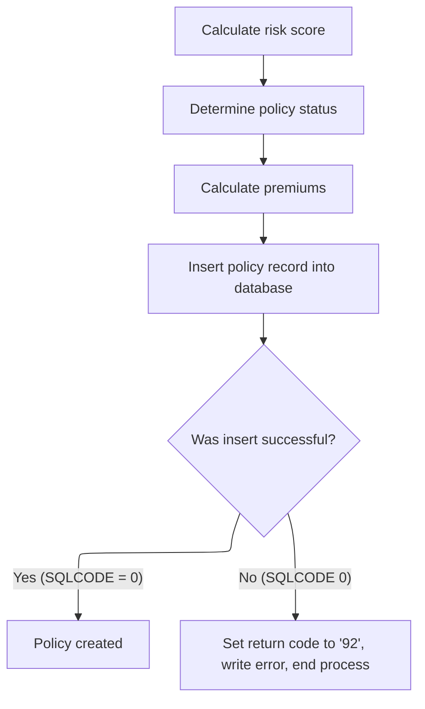

# Program Overview

This document describes the process for adding a new insurance policy (<SwmToken path="/base/src/lgapdb01.cbl" pos="13:6:6" line-data="       PROGRAM-ID. LGAPDB01." repo-id="Z2l0aHViJTNBJTNBa3luZHJ5bC1jaWNzLWdlbmFwcCUzQSUzQVN3aW1tLURlbW8=" repo-name="kyndryl-cics-genapp">`LGAPDB01`</SwmToken>). The flow receives a policy request, validates and inserts the base policy details, determines the policy type, and for commercial policies, calculates the risk score, assigns a status, computes premiums, and stores the policy record. The system retrieves the new policy number and timestamp, routes the request for final processing, and logs any errors. Main steps include: receiving and validating the request, inserting policy details, determining policy type, processing commercial policy calculations, retrieving identifiers, routing for final processing, and error logging.


## Dependencies

### Programs

- <SwmToken path="/base/src/lgapdb01.cbl" pos="270:9:9" line-data="             EXEC CICS Link Program(LGAPVS01)" repo-id="Z2l0aHViJTNBJTNBa3luZHJ5bC1jaWNzLWdlbmFwcCUzQSUzQVN3aW1tLURlbW8=" repo-name="kyndryl-cics-genapp">`LGAPVS01`</SwmToken> (<SwmPath repo-id="Z2l0aHViJTNBJTNBa3luZHJ5bC1jaWNzLWdlbmFwcCUzQSUzQVN3aW1tLURlbW8=" repo-name="kyndryl-cics-genapp" path="/base/src/lgapvs01.cbl">`(kyndryl-cics-genapp) base/src/lgapvs01.cbl`</SwmPath>)
- <SwmToken path="/base/src/lgapdb01.cbl" pos="681:10:10" line-data="           EXEC CICS LINK PROGRAM(&#39;LGSTSQ&#39;)" repo-id="Z2l0aHViJTNBJTNBa3luZHJ5bC1jaWNzLWdlbmFwcCUzQSUzQVN3aW1tLURlbW8=" repo-name="kyndryl-cics-genapp">`LGSTSQ`</SwmToken> (<SwmPath repo-id="Z2l0aHViJTNBJTNBa3luZHJ5bC1jaWNzLWdlbmFwcCUzQSUzQVN3aW1tLURlbW8=" repo-name="kyndryl-cics-genapp" path="/base/src/lgstsq.cbl">`(kyndryl-cics-genapp) base/src/lgstsq.cbl`</SwmPath>)

### Copybooks

- <SwmToken path="/base/src/lgapdb01.cbl" pos="163:3:3" line-data="             INCLUDE LGCMAREA" repo-id="Z2l0aHViJTNBJTNBa3luZHJ5bC1jaWNzLWdlbmFwcCUzQSUzQVN3aW1tLURlbW8=" repo-name="kyndryl-cics-genapp">`LGCMAREA`</SwmToken> (<SwmPath repo-id="Z2l0aHViJTNBJTNBa3luZHJ5bC1jaWNzLWdlbmFwcCUzQSUzQVN3aW1tLURlbW8=" repo-name="kyndryl-cics-genapp" path="/base/src/lgcmarea.cpy">`(kyndryl-cics-genapp) base/src/lgcmarea.cpy`</SwmPath>)
- <SwmToken path="/base/src/lgapdb01.cbl" pos="76:3:3" line-data="             INCLUDE LGPOLICY" repo-id="Z2l0aHViJTNBJTNBa3luZHJ5bC1jaWNzLWdlbmFwcCUzQSUzQVN3aW1tLURlbW8=" repo-name="kyndryl-cics-genapp">`LGPOLICY`</SwmToken> (<SwmPath repo-id="Z2l0aHViJTNBJTNBa3luZHJ5bC1jaWNzLWdlbmFwcCUzQSUzQVN3aW1tLURlbW8=" repo-name="kyndryl-cics-genapp" path="/base/src/lgpolicy.cpy">`(kyndryl-cics-genapp) base/src/lgpolicy.cpy`</SwmPath>)
- <SwmToken path="/base/src/lgapdb01.cbl" pos="152:3:3" line-data="               INCLUDE SQLCA" repo-id="Z2l0aHViJTNBJTNBa3luZHJ5bC1jaWNzLWdlbmFwcCUzQSUzQVN3aW1tLURlbW8=" repo-name="kyndryl-cics-genapp">`SQLCA`</SwmToken>

# Where is this program used?

This program is used once, as represented in the following diagram:


## Input and Output Tables/Files used in the Program

| Table / File Name | Type | Description                                   | Usage Mode   | Key Fields / Layout Highlights                                                                                                                                                                                                                                                                                                                                                                                                                                                                                                                                                                                                                                                                                                                                                                                                                                                                                                                                                                                                                                                                                                                                                                                                                                                                                                                                                                                                                                                                                                                                                                                                                                                                                                                                                                                                                                                                                                                                                                                                                                                                                                                                                                                                                                                                                                                                                                                                                                                                                                                                                                                                                                                                                                                                                                                                                                                                                                                                                                                        |
| ----------------- | ---- | --------------------------------------------- | ------------ | --------------------------------------------------------------------------------------------------------------------------------------------------------------------------------------------------------------------------------------------------------------------------------------------------------------------------------------------------------------------------------------------------------------------------------------------------------------------------------------------------------------------------------------------------------------------------------------------------------------------------------------------------------------------------------------------------------------------------------------------------------------------------------------------------------------------------------------------------------------------------------------------------------------------------------------------------------------------------------------------------------------------------------------------------------------------------------------------------------------------------------------------------------------------------------------------------------------------------------------------------------------------------------------------------------------------------------------------------------------------------------------------------------------------------------------------------------------------------------------------------------------------------------------------------------------------------------------------------------------------------------------------------------------------------------------------------------------------------------------------------------------------------------------------------------------------------------------------------------------------------------------------------------------------------------------------------------------------------------------------------------------------------------------------------------------------------------------------------------------------------------------------------------------------------------------------------------------------------------------------------------------------------------------------------------------------------------------------------------------------------------------------------------------------------------------------------------------------------------------------------------------------------------------------------------------------------------------------------------------------------------------------------------------------------------------------------------------------------------------------------------------------------------------------------------------------------------------------------------------------------------------------------------------------------------------------------------------------------------------------------------------------- |
| COMMERCIAL        | DB2  | Commercial policy-specific attributes         | Output       | <SwmToken path="/base/src/lgapdb01.cbl" pos="613:2:2" line-data="                       (PolicyNumber," repo-id="Z2l0aHViJTNBJTNBa3luZHJ5bC1jaWNzLWdlbmFwcCUzQSUzQVN3aW1tLURlbW8=" repo-name="kyndryl-cics-genapp">`PolicyNumber`</SwmToken> , <SwmToken path="/base/src/lgapdb01.cbl" pos="614:1:1" line-data="                        RequestDate," repo-id="Z2l0aHViJTNBJTNBa3luZHJ5bC1jaWNzLWdlbmFwcCUzQSUzQVN3aW1tLURlbW8=" repo-name="kyndryl-cics-genapp">`RequestDate`</SwmToken> (request timestamp), <SwmToken path="/base/src/lgapdb01.cbl" pos="615:1:1" line-data="                        StartDate," repo-id="Z2l0aHViJTNBJTNBa3luZHJ5bC1jaWNzLWdlbmFwcCUzQSUzQVN3aW1tLURlbW8=" repo-name="kyndryl-cics-genapp">`StartDate`</SwmToken> , <SwmToken path="/base/src/lgapdb01.cbl" pos="616:1:1" line-data="                        RenewalDate," repo-id="Z2l0aHViJTNBJTNBa3luZHJ5bC1jaWNzLWdlbmFwcCUzQSUzQVN3aW1tLURlbW8=" repo-name="kyndryl-cics-genapp">`RenewalDate`</SwmToken> , <SwmToken path="/base/src/lgapdb01.cbl" pos="617:1:1" line-data="                        Address," repo-id="Z2l0aHViJTNBJTNBa3luZHJ5bC1jaWNzLWdlbmFwcCUzQSUzQVN3aW1tLURlbW8=" repo-name="kyndryl-cics-genapp">`Address`</SwmToken> (property address), <SwmToken path="/base/src/lgapdb01.cbl" pos="618:1:1" line-data="                        Zipcode," repo-id="Z2l0aHViJTNBJTNBa3luZHJ5bC1jaWNzLWdlbmFwcCUzQSUzQVN3aW1tLURlbW8=" repo-name="kyndryl-cics-genapp">`Zipcode`</SwmToken> (postcode), <SwmToken path="/base/src/lgapdb01.cbl" pos="619:1:1" line-data="                        LatitudeN," repo-id="Z2l0aHViJTNBJTNBa3luZHJ5bC1jaWNzLWdlbmFwcCUzQSUzQVN3aW1tLURlbW8=" repo-name="kyndryl-cics-genapp">`LatitudeN`</SwmToken>, <SwmToken path="/base/src/lgapdb01.cbl" pos="620:1:1" line-data="                        LongitudeW," repo-id="Z2l0aHViJTNBJTNBa3luZHJ5bC1jaWNzLWdlbmFwcCUzQSUzQVN3aW1tLURlbW8=" repo-name="kyndryl-cics-genapp">`LongitudeW`</SwmToken> , <SwmToken path="/base/src/lgapdb01.cbl" pos="621:1:1" line-data="                        Customer," repo-id="Z2l0aHViJTNBJTNBa3luZHJ5bC1jaWNzLWdlbmFwcCUzQSUzQVN3aW1tLURlbW8=" repo-name="kyndryl-cics-genapp">`Customer`</SwmToken> (customer name), <SwmToken path="/base/src/lgapdb01.cbl" pos="622:1:1" line-data="                        PropertyType," repo-id="Z2l0aHViJTNBJTNBa3luZHJ5bC1jaWNzLWdlbmFwcCUzQSUzQVN3aW1tLURlbW8=" repo-name="kyndryl-cics-genapp">`PropertyType`</SwmToken> , <SwmToken path="/base/src/lgapdb01.cbl" pos="623:1:1" line-data="                        FirePeril," repo-id="Z2l0aHViJTNBJTNBa3luZHJ5bC1jaWNzLWdlbmFwcCUzQSUzQVN3aW1tLURlbW8=" repo-name="kyndryl-cics-genapp">`FirePeril`</SwmToken> (fire risk), <SwmToken path="/base/src/lgapdb01.cbl" pos="624:1:1" line-data="                        FirePremium," repo-id="Z2l0aHViJTNBJTNBa3luZHJ5bC1jaWNzLWdlbmFwcCUzQSUzQVN3aW1tLURlbW8=" repo-name="kyndryl-cics-genapp">`FirePremium`</SwmToken> (fire premium), ... |
| ENDOWMENT         | DB2  | Endowment policy-specific attributes          | Output       | <SwmToken path="/base/src/lgapdb01.cbl" pos="375:3:3" line-data="                          ( POLICYNUMBER," repo-id="Z2l0aHViJTNBJTNBa3luZHJ5bC1jaWNzLWdlbmFwcCUzQSUzQVN3aW1tLURlbW8=" repo-name="kyndryl-cics-genapp">`POLICYNUMBER`</SwmToken>, <SwmToken path="/base/src/lgapdb01.cbl" pos="376:1:1" line-data="                            WITHPROFITS," repo-id="Z2l0aHViJTNBJTNBa3luZHJ5bC1jaWNzLWdlbmFwcCUzQSUzQVN3aW1tLURlbW8=" repo-name="kyndryl-cics-genapp">`WITHPROFITS`</SwmToken>, <SwmToken path="/base/src/lgapdb01.cbl" pos="377:1:1" line-data="                            EQUITIES," repo-id="Z2l0aHViJTNBJTNBa3luZHJ5bC1jaWNzLWdlbmFwcCUzQSUzQVN3aW1tLURlbW8=" repo-name="kyndryl-cics-genapp">`EQUITIES`</SwmToken>, <SwmToken path="/base/src/lgapdb01.cbl" pos="378:1:1" line-data="                            MANAGEDFUND," repo-id="Z2l0aHViJTNBJTNBa3luZHJ5bC1jaWNzLWdlbmFwcCUzQSUzQVN3aW1tLURlbW8=" repo-name="kyndryl-cics-genapp">`MANAGEDFUND`</SwmToken>, <SwmToken path="/base/src/lgapdb01.cbl" pos="401:1:1" line-data="                            FUNDNAME," repo-id="Z2l0aHViJTNBJTNBa3luZHJ5bC1jaWNzLWdlbmFwcCUzQSUzQVN3aW1tLURlbW8=" repo-name="kyndryl-cics-genapp">`FUNDNAME`</SwmToken>, <SwmToken path="/base/src/lgapdb01.cbl" pos="380:1:1" line-data="                            TERM," repo-id="Z2l0aHViJTNBJTNBa3luZHJ5bC1jaWNzLWdlbmFwcCUzQSUzQVN3aW1tLURlbW8=" repo-name="kyndryl-cics-genapp">`TERM`</SwmToken> (Policy Term), <SwmToken path="/base/src/lgapdb01.cbl" pos="381:1:1" line-data="                            SUMASSURED," repo-id="Z2l0aHViJTNBJTNBa3luZHJ5bC1jaWNzLWdlbmFwcCUzQSUzQVN3aW1tLURlbW8=" repo-name="kyndryl-cics-genapp">`SUMASSURED`</SwmToken>, <SwmToken path="/base/src/lgapdb01.cbl" pos="382:1:1" line-data="                            LIFEASSURED," repo-id="Z2l0aHViJTNBJTNBa3luZHJ5bC1jaWNzLWdlbmFwcCUzQSUzQVN3aW1tLURlbW8=" repo-name="kyndryl-cics-genapp">`LIFEASSURED`</SwmToken>                                                                                                                                                                                                                                                                                                                                                                                                                                                                                                                                                                                                                                                                                                                                                                                                                                                                                                                                                                                                                                    |
| HOUSE             | DB2  | House insurance policy attributes             | Output       | <SwmToken path="/base/src/lgapdb01.cbl" pos="438:3:3" line-data="                       ( POLICYNUMBER," repo-id="Z2l0aHViJTNBJTNBa3luZHJ5bC1jaWNzLWdlbmFwcCUzQSUzQVN3aW1tLURlbW8=" repo-name="kyndryl-cics-genapp">`POLICYNUMBER`</SwmToken>, <SwmToken path="/base/src/lgapdb01.cbl" pos="439:1:1" line-data="                         PROPERTYTYPE," repo-id="Z2l0aHViJTNBJTNBa3luZHJ5bC1jaWNzLWdlbmFwcCUzQSUzQVN3aW1tLURlbW8=" repo-name="kyndryl-cics-genapp">`PROPERTYTYPE`</SwmToken>, <SwmToken path="/base/src/lgapdb01.cbl" pos="440:1:1" line-data="                         BEDROOMS," repo-id="Z2l0aHViJTNBJTNBa3luZHJ5bC1jaWNzLWdlbmFwcCUzQSUzQVN3aW1tLURlbW8=" repo-name="kyndryl-cics-genapp">`BEDROOMS`</SwmToken>, <SwmToken path="/base/src/lgapdb01.cbl" pos="441:1:1" line-data="                         VALUE," repo-id="Z2l0aHViJTNBJTNBa3luZHJ5bC1jaWNzLWdlbmFwcCUzQSUzQVN3aW1tLURlbW8=" repo-name="kyndryl-cics-genapp">`VALUE`</SwmToken>, <SwmToken path="/base/src/lgapdb01.cbl" pos="442:1:1" line-data="                         HOUSENAME," repo-id="Z2l0aHViJTNBJTNBa3luZHJ5bC1jaWNzLWdlbmFwcCUzQSUzQVN3aW1tLURlbW8=" repo-name="kyndryl-cics-genapp">`HOUSENAME`</SwmToken>, <SwmToken path="/base/src/lgapdb01.cbl" pos="443:1:1" line-data="                         HOUSENUMBER," repo-id="Z2l0aHViJTNBJTNBa3luZHJ5bC1jaWNzLWdlbmFwcCUzQSUzQVN3aW1tLURlbW8=" repo-name="kyndryl-cics-genapp">`HOUSENUMBER`</SwmToken>, <SwmToken path="/base/src/lgapdb01.cbl" pos="444:1:1" line-data="                         POSTCODE          )" repo-id="Z2l0aHViJTNBJTNBa3luZHJ5bC1jaWNzLWdlbmFwcCUzQSUzQVN3aW1tLURlbW8=" repo-name="kyndryl-cics-genapp">`POSTCODE`</SwmToken>                                                                                                                                                                                                                                                                                                                                                                                                                                                                                                                                                                                                                                                                                                                                                                                                                                                                                                                                                                                                                                                                                                                                                                                                                                                                                                           |
| MOTOR             | DB2  | Motor insurance policy attributes             | Output       | <SwmToken path="/base/src/lgapdb01.cbl" pos="478:3:3" line-data="                       ( POLICYNUMBER," repo-id="Z2l0aHViJTNBJTNBa3luZHJ5bC1jaWNzLWdlbmFwcCUzQSUzQVN3aW1tLURlbW8=" repo-name="kyndryl-cics-genapp">`POLICYNUMBER`</SwmToken>, <SwmToken path="/base/src/lgapdb01.cbl" pos="479:1:1" line-data="                         MAKE," repo-id="Z2l0aHViJTNBJTNBa3luZHJ5bC1jaWNzLWdlbmFwcCUzQSUzQVN3aW1tLURlbW8=" repo-name="kyndryl-cics-genapp">`MAKE`</SwmToken>, <SwmToken path="/base/src/lgapdb01.cbl" pos="480:1:1" line-data="                         MODEL," repo-id="Z2l0aHViJTNBJTNBa3luZHJ5bC1jaWNzLWdlbmFwcCUzQSUzQVN3aW1tLURlbW8=" repo-name="kyndryl-cics-genapp">`MODEL`</SwmToken>, <SwmToken path="/base/src/lgapdb01.cbl" pos="441:1:1" line-data="                         VALUE," repo-id="Z2l0aHViJTNBJTNBa3luZHJ5bC1jaWNzLWdlbmFwcCUzQSUzQVN3aW1tLURlbW8=" repo-name="kyndryl-cics-genapp">`VALUE`</SwmToken>, <SwmToken path="/base/src/lgapdb01.cbl" pos="482:1:1" line-data="                         REGNUMBER," repo-id="Z2l0aHViJTNBJTNBa3luZHJ5bC1jaWNzLWdlbmFwcCUzQSUzQVN3aW1tLURlbW8=" repo-name="kyndryl-cics-genapp">`REGNUMBER`</SwmToken> (vehicle registry number), <SwmToken path="/base/src/lgapdb01.cbl" pos="483:1:1" line-data="                         COLOUR," repo-id="Z2l0aHViJTNBJTNBa3luZHJ5bC1jaWNzLWdlbmFwcCUzQSUzQVN3aW1tLURlbW8=" repo-name="kyndryl-cics-genapp">`COLOUR`</SwmToken>, <SwmToken path="/base/src/lgapdb01.cbl" pos="484:1:1" line-data="                         CC," repo-id="Z2l0aHViJTNBJTNBa3luZHJ5bC1jaWNzLWdlbmFwcCUzQSUzQVN3aW1tLURlbW8=" repo-name="kyndryl-cics-genapp">`CC`</SwmToken>(engine capacity), <SwmToken path="/base/src/lgapdb01.cbl" pos="485:1:1" line-data="                         YEAROFMANUFACTURE," repo-id="Z2l0aHViJTNBJTNBa3luZHJ5bC1jaWNzLWdlbmFwcCUzQSUzQVN3aW1tLURlbW8=" repo-name="kyndryl-cics-genapp">`YEAROFMANUFACTURE`</SwmToken>, <SwmToken path="/base/src/lgapdb01.cbl" pos="486:1:1" line-data="                         PREMIUM," repo-id="Z2l0aHViJTNBJTNBa3luZHJ5bC1jaWNzLWdlbmFwcCUzQSUzQVN3aW1tLURlbW8=" repo-name="kyndryl-cics-genapp">`PREMIUM`</SwmToken>, <SwmToken path="/base/src/lgapdb01.cbl" pos="487:1:1" line-data="                         ACCIDENTS )" repo-id="Z2l0aHViJTNBJTNBa3luZHJ5bC1jaWNzLWdlbmFwcCUzQSUzQVN3aW1tLURlbW8=" repo-name="kyndryl-cics-genapp">`ACCIDENTS`</SwmToken>                                                                                                                                                                                                                                                                                                                                                                                                                                                                                                                                                                              |
| POLICY            | DB2  | Insurance policy core details and identifiers | Input/Output | <SwmToken path="/base/src/lgapdb01.cbl" pos="297:3:3" line-data="                       ( POLICYNUMBER," repo-id="Z2l0aHViJTNBJTNBa3luZHJ5bC1jaWNzLWdlbmFwcCUzQSUzQVN3aW1tLURlbW8=" repo-name="kyndryl-cics-genapp">`POLICYNUMBER`</SwmToken>,  <SwmToken path="/base/src/lgapdb01.cbl" pos="298:1:1" line-data="                         CUSTOMERNUMBER," repo-id="Z2l0aHViJTNBJTNBa3luZHJ5bC1jaWNzLWdlbmFwcCUzQSUzQVN3aW1tLURlbW8=" repo-name="kyndryl-cics-genapp">`CUSTOMERNUMBER`</SwmToken>, <SwmToken path="/base/src/lgapdb01.cbl" pos="299:1:1" line-data="                         ISSUEDATE," repo-id="Z2l0aHViJTNBJTNBa3luZHJ5bC1jaWNzLWdlbmFwcCUzQSUzQVN3aW1tLURlbW8=" repo-name="kyndryl-cics-genapp">`ISSUEDATE`</SwmToken>, <SwmToken path="/base/src/lgapdb01.cbl" pos="300:1:1" line-data="                         EXPIRYDATE," repo-id="Z2l0aHViJTNBJTNBa3luZHJ5bC1jaWNzLWdlbmFwcCUzQSUzQVN3aW1tLURlbW8=" repo-name="kyndryl-cics-genapp">`EXPIRYDATE`</SwmToken>, <SwmToken path="/base/src/lgapdb01.cbl" pos="301:1:1" line-data="                         POLICYTYPE," repo-id="Z2l0aHViJTNBJTNBa3luZHJ5bC1jaWNzLWdlbmFwcCUzQSUzQVN3aW1tLURlbW8=" repo-name="kyndryl-cics-genapp">`POLICYTYPE`</SwmToken>, <SwmToken path="/base/src/lgapdb01.cbl" pos="302:1:1" line-data="                         LASTCHANGED," repo-id="Z2l0aHViJTNBJTNBa3luZHJ5bC1jaWNzLWdlbmFwcCUzQSUzQVN3aW1tLURlbW8=" repo-name="kyndryl-cics-genapp">`LASTCHANGED`</SwmToken>, <SwmToken path="/base/src/lgapdb01.cbl" pos="303:1:1" line-data="                         BROKERID," repo-id="Z2l0aHViJTNBJTNBa3luZHJ5bC1jaWNzLWdlbmFwcCUzQSUzQVN3aW1tLURlbW8=" repo-name="kyndryl-cics-genapp">`BROKERID`</SwmToken>, <SwmToken path="/base/src/lgapdb01.cbl" pos="304:1:1" line-data="                         BROKERSREFERENCE," repo-id="Z2l0aHViJTNBJTNBa3luZHJ5bC1jaWNzLWdlbmFwcCUzQSUzQVN3aW1tLURlbW8=" repo-name="kyndryl-cics-genapp">`BROKERSREFERENCE`</SwmToken>, <SwmToken path="/base/src/lgapdb01.cbl" pos="305:1:1" line-data="                         PAYMENT           )" repo-id="Z2l0aHViJTNBJTNBa3luZHJ5bC1jaWNzLWdlbmFwcCUzQSUzQVN3aW1tLURlbW8=" repo-name="kyndryl-cics-genapp">`PAYMENT`</SwmToken>                                                                                                                                                                                                                                                                                                                                                                                                                                                                                                                                                                                                                                                                                                                                                                                           |

&nbsp;

## Detailed View of the Program's Functionality

### a. Initial Request Validation and Error Handling

When a request to add a new insurance policy arrives, the system first checks if the request data (commarea) is present. If no data is received, it prepares an error message indicating that no commarea was received, logs this error using a dedicated error logging routine, and then forcefully ends the transaction to prevent further processing. This ensures that every error, even at the earliest stage, is captured for later troubleshooting.

If the commarea is present, the system initializes the return code to indicate success and prepares to process the request. It then checks the type of policy being requested (endowment, house, motor, or commercial) and verifies that the commarea is long enough to contain all required data for that policy type. If the commarea is too short, it sets an error code and returns immediately.

If the policy type is not recognized, the system sets a specific error code for unsupported requests and returns without further processing.

### b. Error Message Logging and External Program Call

Whenever an error is detected, the system constructs a detailed error message that includes the current date and time, program name, customer and policy numbers, and the SQL error code if applicable. This message is sent to an external logging program, which writes the error to both a transient queue (for immediate review) and a temporary queue (for later analysis).

If there is additional data in the commarea, up to 90 bytes of this data are also sent to the logging program to provide more context about the error. This two-step logging ensures that both the main error and any relevant request data are preserved for troubleshooting.

The external logging program determines whether it was called directly or via a message receive, formats the message accordingly, and writes it to the appropriate queues. If the message starts with a special prefix, it handles queue naming extensions for special cases.

### c. Policy Insert Trigger

If no blocking errors are found, the system proceeds to insert the base policy details into the database. This is the foundational record that all specific policy types (endowment, house, motor, commercial) will reference.

### d. Policy Database Insert and Error Handling

The system attempts to insert the new policy into the database. If the insert is successful, it retrieves the newly assigned policy number and the timestamp of the record creation, storing these for use in subsequent steps.

If the insert fails due to a missing related record (foreign key error), it sets a specific error code, logs the error, and returns. For any other database error, it sets a general error code, logs the error, and returns as well.

### e. Policy Type Routing

After the base policy is inserted, the system checks the type of policy requested. Depending on the type, it routes processing to the appropriate routine:

- For endowment policies, it calls the endowment insert routine.
- For house policies, it calls the house insert routine.
- For motor policies, it calls the motor insert routine.
- For commercial policies, it calls the commercial insert routine.
- If the type is unrecognized, it sets an error code for unsupported requests.

### f. Endowment Policy Insert and Error Handling

For endowment policies, the system prepares the data, including any variable-length fields, and attempts to insert the record into the endowment table. If the insert fails, it sets an error code, logs the error, and abends the transaction to force a rollback, ensuring no partial data is left in the database.

### g. House Policy Insert Routing

For house policies, the system prepares the data and attempts to insert the record into the house table. If the insert fails, it sets an error code, logs the error, and abends the transaction to force a rollback.

### h. Motor Policy Insert Routing

For motor policies, the system prepares the data and attempts to insert the record into the motor table. If the insert fails, it sets an error code, logs the error, and abends the transaction to force a rollback.

### i. Commercial Policy Processing Sequence

For commercial policies, the system follows a multi-step process:

1. **Risk Score Calculation:**\
   The system starts with a base risk score and increases it based on the property type (warehouse, factory, office, retail) and the postcode prefix (certain prefixes add extra risk). This risk score is used to determine the policy's risk profile.

2. **Policy Status Determination:**\
   Based on the calculated risk score, the system assigns a status to the policy:

   - High risk scores require manual review.
   - Medium risk scores are marked as pending review.
   - Low risk scores are automatically approved. The status and any rejection reason are stored for later use.

3. **Premium Calculation:**\
   The system checks if all four perils (fire, crime, flood, weather) are covered. If so, it applies a discount to the premiums. It then calculates the premium for each peril by multiplying the risk score, a peril-specific factor, the peril value, and the discount factor if applicable.

4. **Database Insert:**\
   The system prepares all the calculated and input data, then attempts to insert the commercial policy record into the database. If the insert fails, it sets an error code, logs the error, and abends the transaction to prevent inconsistent data.

### j. Final Policy Processing and External Program Call

After all policy-specific processing is complete, the system calls an external program to perform final steps, such as writing the policy data to a file for downstream systems. Once this is done, the system returns control to the caller, completing the transaction.

### k. Policy Data Mapping and File Write with Error Handling

The external program receives the policy data, determines the type of policy, and maps the relevant fields to a standardized file record format. It then attempts to write this record to a file. If the write fails, it logs the error using the same error logging mechanism as before and exits, ensuring that any issues are traceable.

The error logging routine in this program also captures the current date and time, builds a detailed error message, and sends it to the logging program. If there is commarea data, up to 90 bytes are included for context.

### l. Program Exit

Both the main and external programs use standard exit routines to cleanly finish execution and return control to the system, ensuring that resources are released and the transaction is properly closed.

# Key Functionality

## 1\. Initial Request Validation and Error Handling

**Business Logic:**\
The system begins by validating that an insurance policy request has been received. If no request data is present, it logs an error and terminates the transaction to prevent further processing.

**Data Processed:**\
It checks for the presence of a communication area (commarea), which contains the request details. If missing, it prepares an error message including the current date, time, and relevant identifiers.

**Validations:**\
The main validation is whether the commarea length is zero, indicating no request was received. If so, it sets an error code and triggers error logging.

**External Interactions:**\
If an error is detected, the system calls an external error logging program to record the issue and then issues a command to abnormally end the transaction.

---

## 2\. Error Message Logging and External Program Call

**Business Logic:**\
Whenever an error occurs, the system constructs a detailed error message, including date, time, program name, customer and policy numbers, and error codes. This message is logged for traceability.

**Data Processed:**\
The error message includes static and dynamic fields such as timestamps, program identifiers, customer and policy numbers, and SQL or system return codes. If available, up to 90 bytes of the original request data are also logged for context.

**Validations:**\
It checks if additional data is present and whether it fits within the allowed length for logging. If the data is too long, only the first 90 characters are logged.

**External Interactions:**\
The error message is sent to an external logging program, which writes it to both a transient and a temporary queue for later analysis. This ensures all errors are consistently captured.

---

## 3\. Policy Insert Trigger

**Business Logic:**\
If the initial request is valid, the system proceeds to insert the base details of the new policy into the database.

**Data Processed:**\
It processes customer and broker identifiers, payment information, and policy dates, converting them to the appropriate formats for database insertion.

**Validations:**\
It checks that the commarea contains enough data for the requested policy type and that all required fields are present.

**External Interactions:**\
The system interacts with the database to insert the new policy record and later retrieves the assigned policy number and timestamp.

---

## 4\. Policy Database Insert and Error Handling

**Business Logic:**\
The system attempts to insert the new policy into the database. It handles different outcomes based on the database response.

**Data Processed:**\
It uses the policy details from the request, including customer, broker, payment, and date information.

**Validations:**\
After the insert, it checks the database response code:

- Success: Proceeds to retrieve the new policy number and timestamp.
- Foreign key error: Indicates a related record is missing, logs the error, and returns a specific error code.
- Other errors: Logs the error and returns a general error code.

**External Interactions:**\
On error, it logs the issue using the error logging mechanism and may terminate the transaction to prevent inconsistent data.

---

## 5\. Policy Type Routing

**Business Logic:**\
Based on the type of policy requested (endowment, house, motor, or commercial), the system routes processing to the appropriate handler for that policy type.

**Data Processed:**\
It examines the policy type identifier in the request and prepares to process the corresponding policy details.

**Validations:**\
If the policy type is not recognized, it sets an error code indicating an unsupported request.

**External Interactions:**\
Each policy type handler may interact with the database to insert additional details specific to that policy.

---

## 6\. Endowment Policy Insert and Error Handling

**Business Logic:**\
For endowment policies, the system inserts the relevant details into the endowment table. If the request contains extra data, it handles variable-length fields appropriately.

**Data Processed:**\
It processes fields such as term, sum assured, fund details, and any additional padding data.

**Validations:**\
It checks for successful database insertion. If the insert fails, it logs the error and forces a rollback to maintain data integrity.

**External Interactions:**\
On error, it logs the issue and abnormally ends the transaction to ensure no partial data is left in the database.

---

## 7\. House Policy Insert Routing

**Business Logic:**\
For house policies, the system inserts the relevant details into the house table.

**Data Processed:**\
It processes property type, number of bedrooms, value, house name, and postcode.

**Validations:**\
It checks for successful database insertion. If the insert fails, it logs the error and forces a rollback.

**External Interactions:**\
On error, it logs the issue and abnormally ends the transaction.

---

## 8\. Motor Policy Insert Routing

**Business Logic:**\
For motor policies, the system inserts the relevant details into the motor table.

**Data Processed:**\
It processes vehicle make, model, value, registration number, color, engine size, year of manufacture, premium, and accident history.

**Validations:**\
It checks for successful database insertion. If the insert fails, it logs the error and forces a rollback.

**External Interactions:**\
On error, it logs the issue and abnormally ends the transaction.

---

## 9\. Commercial Policy Processing Sequence

**Business Logic:**\
For commercial policies, the system performs a multi-step process: calculating risk, determining policy status, calculating premiums, and inserting the record into the database.

**Data Processed:**\
It uses property type, postcode, peril coverage values, and other risk-related data to compute risk scores and premiums.

**Validations:**\
Each step checks for valid input and successful completion. If any step fails, it logs the error and aborts the transaction.

**External Interactions:**\
The system interacts with the database to insert the commercial policy record. On error, it logs the issue and abnormally ends the transaction.

---

## 10\. Risk Score Calculation

**Business Logic:**\
The system calculates a risk score for commercial policies based on property type and postcode.

**Data Processed:**\
It starts with a base score and adds increments depending on the property type and whether the postcode is in a high-risk area.

**Validations:**\
It ensures that property type and postcode are present and valid for calculation.

**External Interactions:**\
None directly; this is an internal calculation step.

---

## 11\. Policy Status Assignment

**Business Logic:**\
Based on the calculated risk score, the system assigns a status to the policy: approved, pending review, or manual review required.

**Data Processed:**\
It uses the risk score to determine the status and, if necessary, a rejection reason.

**Validations:**\
It checks the risk score thresholds to assign the correct status.

**External Interactions:**\
None directly; results are stored for later use.

---

## 12\. Premium Calculation Logic

**Business Logic:**\
The system calculates premiums for each peril (fire, crime, flood, weather) based on the risk score and peril values. If all perils are covered, a discount is applied.

**Data Processed:**\
It uses the risk score, peril coverage values, and a discount factor if applicable.

**Validations:**\
It checks that peril values are present and positive to apply the discount.

**External Interactions:**\
None directly; results are stored for later use.

---

## 13\. Commercial Policy Database Insert

**Business Logic:**\
After all calculations, the system inserts the commercial policy record into the database.

**Data Processed:**\
It includes all calculated and provided fields: risk score, status, premiums, property details, and rejection reason.

**Validations:**\
It checks for successful database insertion. If the insert fails, it logs the error and forces a rollback.

**External Interactions:**\
On error, it logs the issue and abnormally ends the transaction.

---

## 14\. Final Policy Processing and External Program Call

**Business Logic:**\
After all policy-specific processing, the system calls an external program to perform final steps, such as writing the policy to a file.

**Data Processed:**\
It passes the complete policy data to the external program for further handling.

**Validations:**\
None at this step; assumes previous steps succeeded.

**External Interactions:**\
It links to an external program, passing the policy data for additional processing.

---

## 15\. Policy Data Mapping and File Write with Error Handling

**Business Logic:**\
The external program receives the policy data, maps it to the correct file format based on policy type, and writes it to a file. If the write fails, it logs the error.

**Data Processed:**\
It extracts and maps fields from the policy data for fire, equities, home, or motor policies, or handles unknown types by writing blanks.

**Validations:**\
It checks the response from the file write operation. If unsuccessful, it logs the error and returns a failure code.

**External Interactions:**\
It writes the policy data to a file and, on error, calls the error logging program to record the issue.

---

## 16\. Error Logging in External Program

**Business Logic:**\
If an error occurs during file writing, the external program constructs a detailed error message and logs it.

**Data Processed:**\
The error message includes date, time, policy and customer numbers, and response codes. Up to 90 bytes of the original request data are also logged if available.

**Validations:**\
It checks if additional data is present and whether it fits within the allowed length for logging.

**External Interactions:**\
The error message is sent to the error logging program, which writes it to the appropriate queues for later analysis.

---

## 17\. Error Logging Queue Handler

**Business Logic:**\
The error logging handler receives error messages and writes them to both a transient and a temporary queue for traceability.

**Data Processed:**\
It processes the error message, including system and program identifiers, and any additional data provided.

**Validations:**\
It checks if the message includes a special queue identifier and adjusts the queue name accordingly.

**External Interactions:**\
It writes the error message to the system's error queues and, if the message was received via a terminal, sends a minimal response back to the terminal before returning control.

# Data Definitions

| Table / Record Name | Type | Short Description                             | Usage Mode                      |
| ------------------- | ---- | --------------------------------------------- | ------------------------------- |
| COMMERCIAL          | DB2  | Commercial policy-specific attributes         | Output (INSERT)                 |
| ENDOWMENT           | DB2  | Endowment policy-specific attributes          | Output (INSERT)                 |
| HOUSE               | DB2  | House insurance policy attributes             | Output (INSERT)                 |
| MOTOR               | DB2  | Motor insurance policy attributes             | Output (INSERT)                 |
| POLICY              | DB2  | Insurance policy core details and identifiers | Input (SELECT), Output (INSERT) |

&nbsp;

# Rule Definition

| Paragraph Name                                                                                                                                                                                                                                                                                                                                                                                                                                                                                                                                                                                                                                                                                                                              | Rule ID | RULE_CATEGORY     | RULE_DESCRIPTION                                                                                                                                                                                                                                                                                                                                                                                                                                                                                                                                                                                                                                                                                                                                                                                                                                                                                                                                                                                                                                                                                                                                                                                                                                                                                                                                                                                                                                                                                                                                                                                                                                                                                                                                                                                                                                                                                                                                                                                                                                                                                                                                                                                                                                                                                                                                                                                                                            | CONDITIONS                                                                                                                                                                                                                                                                                  | REMARKS                                                                                                                                                                                                                                                                                                                                                                                                                                                                                                                                                                                                                                                                                                                                                                                                                                                                                                                                                                                                                                                                                                                                                                                                                                                                                                                                                                                                                                                                                                                                                                                                                                                                                                                                                                                                                                                                                                                                                                                                                                                                                                                                                                                                                                                                                                                                                                                                                                                                                                                                                                                                                                                                                                                                 |
| ------------------------------------------------------------------------------------------------------------------------------------------------------------------------------------------------------------------------------------------------------------------------------------------------------------------------------------------------------------------------------------------------------------------------------------------------------------------------------------------------------------------------------------------------------------------------------------------------------------------------------------------------------------------------------------------------------------------------------------------- | ------- | ----------------- | ------------------------------------------------------------------------------------------------------------------------------------------------------------------------------------------------------------------------------------------------------------------------------------------------------------------------------------------------------------------------------------------------------------------------------------------------------------------------------------------------------------------------------------------------------------------------------------------------------------------------------------------------------------------------------------------------------------------------------------------------------------------------------------------------------------------------------------------------------------------------------------------------------------------------------------------------------------------------------------------------------------------------------------------------------------------------------------------------------------------------------------------------------------------------------------------------------------------------------------------------------------------------------------------------------------------------------------------------------------------------------------------------------------------------------------------------------------------------------------------------------------------------------------------------------------------------------------------------------------------------------------------------------------------------------------------------------------------------------------------------------------------------------------------------------------------------------------------------------------------------------------------------------------------------------------------------------------------------------------------------------------------------------------------------------------------------------------------------------------------------------------------------------------------------------------------------------------------------------------------------------------------------------------------------------------------------------------------------------------------------------------------------------------------------------------------- | ------------------------------------------------------------------------------------------------------------------------------------------------------------------------------------------------------------------------------------------------------------------------------------------- | --------------------------------------------------------------------------------------------------------------------------------------------------------------------------------------------------------------------------------------------------------------------------------------------------------------------------------------------------------------------------------------------------------------------------------------------------------------------------------------------------------------------------------------------------------------------------------------------------------------------------------------------------------------------------------------------------------------------------------------------------------------------------------------------------------------------------------------------------------------------------------------------------------------------------------------------------------------------------------------------------------------------------------------------------------------------------------------------------------------------------------------------------------------------------------------------------------------------------------------------------------------------------------------------------------------------------------------------------------------------------------------------------------------------------------------------------------------------------------------------------------------------------------------------------------------------------------------------------------------------------------------------------------------------------------------------------------------------------------------------------------------------------------------------------------------------------------------------------------------------------------------------------------------------------------------------------------------------------------------------------------------------------------------------------------------------------------------------------------------------------------------------------------------------------------------------------------------------------------------------------------------------------------------------------------------------------------------------------------------------------------------------------------------------------------------------------------------------------------------------------------------------------------------------------------------------------------------------------------------------------------------------------------------------------------------------------------------------------------------- |
| MAINLINE SECTION                                                                                                                                                                                                                                                                                                                                                                                                                                                                                                                                                                                                                                                                                                                            | RL-001  | Conditional Logic | The system must check if the commarea is present and of sufficient length for the requested policy type. If missing or too short, set <SwmToken path="/base/src/lgapdb01.cbl" pos="238:9:13" line-data="             MOVE &#39;98&#39; TO CA-RETURN-CODE" repo-id="Z2l0aHViJTNBJTNBa3luZHJ5bC1jaWNzLWdlbmFwcCUzQSUzQVN3aW1tLURlbW8=" repo-name="kyndryl-cics-genapp">`CA-RETURN-CODE`</SwmToken> to <SwmToken path="/base/src/lgapdb01.cbl" pos="238:4:4" line-data="             MOVE &#39;98&#39; TO CA-RETURN-CODE" repo-id="Z2l0aHViJTNBJTNBa3luZHJ5bC1jaWNzLWdlbmFwcCUzQSUzQVN3aW1tLURlbW8=" repo-name="kyndryl-cics-genapp">`98`</SwmToken>, log an error, and return.                                                                                                                                                                                                                                                                                                                                                                                                                                                                                                                                                                                                                                                                                                                                                                                                                                                                                                                                                                                                                                                                                                                                                                                                                                                                                                                                                                                                                                                                                                                                                                                                                                                                                                                                                                | EIBCALEN is zero (no commarea) or less than required length for the policy type.                                                                                                                                                                                                            | If EIBCALEN is zero, abends with <SwmToken path="/base/src/lgapdb01.cbl" pos="195:10:10" line-data="               EXEC CICS ABEND ABCODE(&#39;LGCA&#39;) NODUMP END-EXEC" repo-id="Z2l0aHViJTNBJTNBa3luZHJ5bC1jaWNzLWdlbmFwcCUzQSUzQVN3aW1tLURlbW8=" repo-name="kyndryl-cics-genapp">`LGCA`</SwmToken>.<br><SwmToken path="/base/src/lgapdb01.cbl" pos="238:9:13" line-data="             MOVE &#39;98&#39; TO CA-RETURN-CODE" repo-id="Z2l0aHViJTNBJTNBa3luZHJ5bC1jaWNzLWdlbmFwcCUzQSUzQVN3aW1tLURlbW8=" repo-name="kyndryl-cics-genapp">`CA-RETURN-CODE`</SwmToken> <SwmToken path="/base/src/lgapdb01.cbl" pos="238:4:4" line-data="             MOVE &#39;98&#39; TO CA-RETURN-CODE" repo-id="Z2l0aHViJTNBJTNBa3luZHJ5bC1jaWNzLWdlbmFwcCUzQSUzQVN3aW1tLURlbW8=" repo-name="kyndryl-cics-genapp">`98`</SwmToken> indicates commarea too short. Error log includes date, time, program name, customer number, policy number, and up to 90 bytes of commarea data.                                                                                                                                                                                                                                                                                                                                                                                                                                                                                                                                                                                                                                                                                                                                                                                                                                                                                                                                                                                                                                                                                                                                                                                                                                                                                                                                                                                                                                                                                                                                                                                                                                                                                                                                                                    |
| MAINLINE SECTION                                                                                                                                                                                                                                                                                                                                                                                                                                                                                                                                                                                                                                                                                                                            | RL-002  | Conditional Logic | The system must check if <SwmToken path="/base/src/lgapdb01.cbl" pos="250:3:7" line-data="           EVALUATE CA-REQUEST-ID" repo-id="Z2l0aHViJTNBJTNBa3luZHJ5bC1jaWNzLWdlbmFwcCUzQSUzQVN3aW1tLURlbW8=" repo-name="kyndryl-cics-genapp">`CA-REQUEST-ID`</SwmToken> is one of the supported types (<SwmToken path="/base/src/lgapdb01.cbl" pos="252:4:4" line-data="             WHEN &#39;01AEND&#39;" repo-id="Z2l0aHViJTNBJTNBa3luZHJ5bC1jaWNzLWdlbmFwcCUzQSUzQVN3aW1tLURlbW8=" repo-name="kyndryl-cics-genapp">`01AEND`</SwmToken>, <SwmToken path="/base/src/lgapdb01.cbl" pos="255:4:4" line-data="             WHEN &#39;01AHOU&#39;" repo-id="Z2l0aHViJTNBJTNBa3luZHJ5bC1jaWNzLWdlbmFwcCUzQSUzQVN3aW1tLURlbW8=" repo-name="kyndryl-cics-genapp">`01AHOU`</SwmToken>, <SwmToken path="/base/src/lgapdb01.cbl" pos="258:4:4" line-data="             WHEN &#39;01AMOT&#39;" repo-id="Z2l0aHViJTNBJTNBa3luZHJ5bC1jaWNzLWdlbmFwcCUzQSUzQVN3aW1tLURlbW8=" repo-name="kyndryl-cics-genapp">`01AMOT`</SwmToken>, <SwmToken path="/base/src/lgapdb01.cbl" pos="261:4:4" line-data="             WHEN &#39;01ACOM&#39;" repo-id="Z2l0aHViJTNBJTNBa3luZHJ5bC1jaWNzLWdlbmFwcCUzQSUzQVN3aW1tLURlbW8=" repo-name="kyndryl-cics-genapp">`01ACOM`</SwmToken>). If not, set <SwmToken path="/base/src/lgapdb01.cbl" pos="266:9:13" line-data="               MOVE &#39;99&#39; TO CA-RETURN-CODE" repo-id="Z2l0aHViJTNBJTNBa3luZHJ5bC1jaWNzLWdlbmFwcCUzQSUzQVN3aW1tLURlbW8=" repo-name="kyndryl-cics-genapp">`CA-RETURN-CODE`</SwmToken> to <SwmToken path="/base/src/lgapdb01.cbl" pos="266:4:4" line-data="               MOVE &#39;99&#39; TO CA-RETURN-CODE" repo-id="Z2l0aHViJTNBJTNBa3luZHJ5bC1jaWNzLWdlbmFwcCUzQSUzQVN3aW1tLURlbW8=" repo-name="kyndryl-cics-genapp">`99`</SwmToken>, log an error, and return.                                                                                                                                                                                                                                                                                                                                                                                                                                                                                                                                                                                                                               | <SwmToken path="/base/src/lgapdb01.cbl" pos="250:3:7" line-data="           EVALUATE CA-REQUEST-ID" repo-id="Z2l0aHViJTNBJTNBa3luZHJ5bC1jaWNzLWdlbmFwcCUzQSUzQVN3aW1tLURlbW8=" repo-name="kyndryl-cics-genapp">`CA-REQUEST-ID`</SwmToken> is not one of the supported values.               | <SwmToken path="/base/src/lgapdb01.cbl" pos="266:9:13" line-data="               MOVE &#39;99&#39; TO CA-RETURN-CODE" repo-id="Z2l0aHViJTNBJTNBa3luZHJ5bC1jaWNzLWdlbmFwcCUzQSUzQVN3aW1tLURlbW8=" repo-name="kyndryl-cics-genapp">`CA-RETURN-CODE`</SwmToken> <SwmToken path="/base/src/lgapdb01.cbl" pos="266:4:4" line-data="               MOVE &#39;99&#39; TO CA-RETURN-CODE" repo-id="Z2l0aHViJTNBJTNBa3luZHJ5bC1jaWNzLWdlbmFwcCUzQSUzQVN3aW1tLURlbW8=" repo-name="kyndryl-cics-genapp">`99`</SwmToken> indicates unsupported request type. Error log as above.                                                                                                                                                                                                                                                                                                                                                                                                                                                                                                                                                                                                                                                                                                                                                                                                                                                                                                                                                                                                                                                                                                                                                                                                                                                                                                                                                                                                                                                                                                                                                                                                                                                                                                                                                                                                                                                                                                                                                                                                                                                                                                                                                                    |
| <SwmToken path="/base/src/lgapdb01.cbl" pos="246:3:5" line-data="           PERFORM INSERT-POLICY" repo-id="Z2l0aHViJTNBJTNBa3luZHJ5bC1jaWNzLWdlbmFwcCUzQSUzQVN3aW1tLURlbW8=" repo-name="kyndryl-cics-genapp">`INSERT-POLICY`</SwmToken>                                                                                                                                                                                                                                                                                                                                                                                                                                                                                                    | RL-003  | Data Assignment   | Insert the base policy details into the POLICY table, mapping commarea fields to DB columns. Retrieve the assigned policy number and last changed timestamp. Handle DB errors as specified.                                                                                                                                                                                                                                                                                                                                                                                                                                                                                                                                                                                                                                                                                                                                                                                                                                                                                                                                                                                                                                                                                                                                                                                                                                                                                                                                                                                                                                                                                                                                                                                                                                                                                                                                                                                                                                                                                                                                                                                                                                                                                                                                                                                                                                                 | Valid commarea and supported request type.                                                                                                                                                                                                                                                  | POLICYNUMBER is auto-generated. <SwmToken path="/base/src/lgapdb01.cbl" pos="238:9:13" line-data="             MOVE &#39;98&#39; TO CA-RETURN-CODE" repo-id="Z2l0aHViJTNBJTNBa3luZHJ5bC1jaWNzLWdlbmFwcCUzQSUzQVN3aW1tLURlbW8=" repo-name="kyndryl-cics-genapp">`CA-RETURN-CODE`</SwmToken> values: '70' for foreign key error (SQLCODE -530), '90' for other DB errors, '00' for success. Output: <SwmToken path="/base/src/lgapdb01.cbl" pos="338:11:15" line-data="           MOVE DB2-POLICYNUM-INT TO CA-POLICY-NUM" repo-id="Z2l0aHViJTNBJTNBa3luZHJ5bC1jaWNzLWdlbmFwcCUzQSUzQVN3aW1tLURlbW8=" repo-name="kyndryl-cics-genapp">`CA-POLICY-NUM`</SwmToken> (string, 10 bytes), <SwmToken path="/base/src/lgapdb01.cbl" pos="345:4:6" line-data="               INTO :CA-LASTCHANGED" repo-id="Z2l0aHViJTNBJTNBa3luZHJ5bC1jaWNzLWdlbmFwcCUzQSUzQVN3aW1tLURlbW8=" repo-name="kyndryl-cics-genapp">`CA-LASTCHANGED`</SwmToken> (string, 26 bytes).                                                                                                                                                                                                                                                                                                                                                                                                                                                                                                                                                                                                                                                                                                                                                                                                                                                                                                                                                                                                                                                                                                                                                                                                                                                                                                                                                                                                                                                                                                                                                                                                                                                                                                                                                                                     |
| MAINLINE SECTION                                                                                                                                                                                                                                                                                                                                                                                                                                                                                                                                                                                                                                                                                                                            | RL-004  | Conditional Logic | After base policy insertion, route processing to the appropriate policy-type-specific logic based on <SwmToken path="/base/src/lgapdb01.cbl" pos="250:3:7" line-data="           EVALUATE CA-REQUEST-ID" repo-id="Z2l0aHViJTNBJTNBa3luZHJ5bC1jaWNzLWdlbmFwcCUzQSUzQVN3aW1tLURlbW8=" repo-name="kyndryl-cics-genapp">`CA-REQUEST-ID`</SwmToken>.                                                                                                                                                                                                                                                                                                                                                                                                                                                                                                                                                                                                                                                                                                                                                                                                                                                                                                                                                                                                                                                                                                                                                                                                                                                                                                                                                                                                                                                                                                                                                                                                                                                                                                                                                                                                                                                                                                                                                                                                                                                                                             | Valid commarea, supported request type, and successful base policy insert.                                                                                                                                                                                                                  | Supported types: <SwmToken path="/base/src/lgapdb01.cbl" pos="252:4:4" line-data="             WHEN &#39;01AEND&#39;" repo-id="Z2l0aHViJTNBJTNBa3luZHJ5bC1jaWNzLWdlbmFwcCUzQSUzQVN3aW1tLURlbW8=" repo-name="kyndryl-cics-genapp">`01AEND`</SwmToken>, <SwmToken path="/base/src/lgapdb01.cbl" pos="255:4:4" line-data="             WHEN &#39;01AHOU&#39;" repo-id="Z2l0aHViJTNBJTNBa3luZHJ5bC1jaWNzLWdlbmFwcCUzQSUzQVN3aW1tLURlbW8=" repo-name="kyndryl-cics-genapp">`01AHOU`</SwmToken>, <SwmToken path="/base/src/lgapdb01.cbl" pos="258:4:4" line-data="             WHEN &#39;01AMOT&#39;" repo-id="Z2l0aHViJTNBJTNBa3luZHJ5bC1jaWNzLWdlbmFwcCUzQSUzQVN3aW1tLURlbW8=" repo-name="kyndryl-cics-genapp">`01AMOT`</SwmToken>, <SwmToken path="/base/src/lgapdb01.cbl" pos="261:4:4" line-data="             WHEN &#39;01ACOM&#39;" repo-id="Z2l0aHViJTNBJTNBa3luZHJ5bC1jaWNzLWdlbmFwcCUzQSUzQVN3aW1tLURlbW8=" repo-name="kyndryl-cics-genapp">`01ACOM`</SwmToken>.                                                                                                                                                                                                                                                                                                                                                                                                                                                                                                                                                                                                                                                                                                                                                                                                                                                                                                                                                                                                                                                                                                                                                                                                                                                                                                                                                                                                                                                                                                                                                                                                                                                                                                                                                                    |
| <SwmToken path="/base/src/lgapdb01.cbl" pos="253:3:5" line-data="               PERFORM INSERT-ENDOW" repo-id="Z2l0aHViJTNBJTNBa3luZHJ5bC1jaWNzLWdlbmFwcCUzQSUzQVN3aW1tLURlbW8=" repo-name="kyndryl-cics-genapp">`INSERT-ENDOW`</SwmToken>, <SwmToken path="/base/src/lgapdb01.cbl" pos="256:3:5" line-data="               PERFORM INSERT-HOUSE" repo-id="Z2l0aHViJTNBJTNBa3luZHJ5bC1jaWNzLWdlbmFwcCUzQSUzQVN3aW1tLURlbW8=" repo-name="kyndryl-cics-genapp">`INSERT-HOUSE`</SwmToken>, <SwmToken path="/base/src/lgapdb01.cbl" pos="259:3:5" line-data="               PERFORM INSERT-MOTOR" repo-id="Z2l0aHViJTNBJTNBa3luZHJ5bC1jaWNzLWdlbmFwcCUzQSUzQVN3aW1tLURlbW8=" repo-name="kyndryl-cics-genapp">`INSERT-MOTOR`</SwmToken>          | RL-005  | Data Assignment   | Insert policy-type-specific details into the corresponding table. If insert fails, set <SwmToken path="/base/src/lgapdb01.cbl" pos="238:9:13" line-data="             MOVE &#39;98&#39; TO CA-RETURN-CODE" repo-id="Z2l0aHViJTNBJTNBa3luZHJ5bC1jaWNzLWdlbmFwcCUzQSUzQVN3aW1tLURlbW8=" repo-name="kyndryl-cics-genapp">`CA-RETURN-CODE`</SwmToken> to '90', log error, and abort transaction.                                                                                                                                                                                                                                                                                                                                                                                                                                                                                                                                                                                                                                                                                                                                                                                                                                                                                                                                                                                                                                                                                                                                                                                                                                                                                                                                                                                                                                                                                                                                                                                                                                                                                                                                                                                                                                                                                                                                                                                                                                                | Policy type is endowment, house, or motor. Base policy insert succeeded.                                                                                                                                                                                                                    | <SwmToken path="/base/src/lgapdb01.cbl" pos="238:9:13" line-data="             MOVE &#39;98&#39; TO CA-RETURN-CODE" repo-id="Z2l0aHViJTNBJTNBa3luZHJ5bC1jaWNzLWdlbmFwcCUzQSUzQVN3aW1tLURlbW8=" repo-name="kyndryl-cics-genapp">`CA-RETURN-CODE`</SwmToken> '90' for DB error. Transaction is aborted to ensure rollback.                                                                                                                                                                                                                                                                                                                                                                                                                                                                                                                                                                                                                                                                                                                                                                                                                                                                                                                                                                                                                                                                                                                                                                                                                                                                                                                                                                                                                                                                                                                                                                                                                                                                                                                                                                                                                                                                                                                                                                                                                                                                                                                                                                                                                                                                                                                                                                                                                |
| <SwmToken path="/base/src/lgapdb01.cbl" pos="514:3:7" line-data="           PERFORM CALC-RISK-SCORE" repo-id="Z2l0aHViJTNBJTNBa3luZHJ5bC1jaWNzLWdlbmFwcCUzQSUzQVN3aW1tLURlbW8=" repo-name="kyndryl-cics-genapp">`CALC-RISK-SCORE`</SwmToken>                                                                                                                                                                                                                                                                                                                                                                                                                                                                                                | RL-006  | Computation       | Calculate the risk score for commercial policies based on property type and postcode.                                                                                                                                                                                                                                                                                                                                                                                                                                                                                                                                                                                                                                                                                                                                                                                                                                                                                                                                                                                                                                                                                                                                                                                                                                                                                                                                                                                                                                                                                                                                                                                                                                                                                                                                                                                                                                                                                                                                                                                                                                                                                                                                                                                                                                                                                                                                                       | Policy type is commercial (<SwmToken path="/base/src/lgapdb01.cbl" pos="261:4:4" line-data="             WHEN &#39;01ACOM&#39;" repo-id="Z2l0aHViJTNBJTNBa3luZHJ5bC1jaWNzLWdlbmFwcCUzQSUzQVN3aW1tLURlbW8=" repo-name="kyndryl-cics-genapp">`01ACOM`</SwmToken>).                            | Base risk score: 100. Add: WAREHOUSE +50, FACTORY +75, OFFICE +25, RETAIL +40. If postcode starts with 'FL' or 'CR', add 30.                                                                                                                                                                                                                                                                                                                                                                                                                                                                                                                                                                                                                                                                                                                                                                                                                                                                                                                                                                                                                                                                                                                                                                                                                                                                                                                                                                                                                                                                                                                                                                                                                                                                                                                                                                                                                                                                                                                                                                                                                                                                                                                                                                                                                                                                                                                                                                                                                                                                                                                                                                                                            |
| <SwmToken path="/base/src/lgapdb01.cbl" pos="515:3:7" line-data="           PERFORM DETERMINE-POLICY-STATUS" repo-id="Z2l0aHViJTNBJTNBa3luZHJ5bC1jaWNzLWdlbmFwcCUzQSUzQVN3aW1tLURlbW8=" repo-name="kyndryl-cics-genapp">`DETERMINE-POLICY-STATUS`</SwmToken>                                                                                                                                                                                                                                                                                                                                                                                                                                                                                | RL-007  | Conditional Logic | Set the policy status and reject reason based on the calculated risk score.                                                                                                                                                                                                                                                                                                                                                                                                                                                                                                                                                                                                                                                                                                                                                                                                                                                                                                                                                                                                                                                                                                                                                                                                                                                                                                                                                                                                                                                                                                                                                                                                                                                                                                                                                                                                                                                                                                                                                                                                                                                                                                                                                                                                                                                                                                                                                                 | Policy type is commercial (<SwmToken path="/base/src/lgapdb01.cbl" pos="261:4:4" line-data="             WHEN &#39;01ACOM&#39;" repo-id="Z2l0aHViJTNBJTNBa3luZHJ5bC1jaWNzLWdlbmFwcCUzQSUzQVN3aW1tLURlbW8=" repo-name="kyndryl-cics-genapp">`01ACOM`</SwmToken>). Risk score calculated.     | Status: >200 = 2 (manual review), >150 = 1 (pending review), else 0 (approved). Reject reasons: 'High Risk Score - Manual Review Required', 'Medium Risk - Pending Review', blank.                                                                                                                                                                                                                                                                                                                                                                                                                                                                                                                                                                                                                                                                                                                                                                                                                                                                                                                                                                                                                                                                                                                                                                                                                                                                                                                                                                                                                                                                                                                                                                                                                                                                                                                                                                                                                                                                                                                                                                                                                                                                                                                                                                                                                                                                                                                                                                                                                                                                                                                                                      |
| <SwmToken path="/base/src/lgapdb01.cbl" pos="516:3:5" line-data="           PERFORM CALC-PREMIUMS" repo-id="Z2l0aHViJTNBJTNBa3luZHJ5bC1jaWNzLWdlbmFwcCUzQSUzQVN3aW1tLURlbW8=" repo-name="kyndryl-cics-genapp">`CALC-PREMIUMS`</SwmToken>                                                                                                                                                                                                                                                                                                                                                                                                                                                                                                    | RL-008  | Computation       | Calculate premiums for each peril (Fire, Crime, Flood, Weather) using the risk score, peril-specific factors, peril values, and a bundled discount if all perils are present.                                                                                                                                                                                                                                                                                                                                                                                                                                                                                                                                                                                                                                                                                                                                                                                                                                                                                                                                                                                                                                                                                                                                                                                                                                                                                                                                                                                                                                                                                                                                                                                                                                                                                                                                                                                                                                                                                                                                                                                                                                                                                                                                                                                                                                                               | Policy type is commercial (<SwmToken path="/base/src/lgapdb01.cbl" pos="261:4:4" line-data="             WHEN &#39;01ACOM&#39;" repo-id="Z2l0aHViJTNBJTNBa3luZHJ5bC1jaWNzLWdlbmFwcCUzQSUzQVN3aW1tLURlbW8=" repo-name="kyndryl-cics-genapp">`01ACOM`</SwmToken>). Risk score calculated.     | Peril factors: Fire <SwmToken path="/base/src/lgapdb01.cbl" pos="580:11:13" line-data="             ((WS-RISK-SCORE * 0.8) * CA-B-FirePeril *" repo-id="Z2l0aHViJTNBJTNBa3luZHJ5bC1jaWNzLWdlbmFwcCUzQSUzQVN3aW1tLURlbW8=" repo-name="kyndryl-cics-genapp">`0.8`</SwmToken>, Crime <SwmToken path="/base/src/lgapdb01.cbl" pos="584:11:13" line-data="             ((WS-RISK-SCORE * 0.6) * CA-B-CrimePeril *" repo-id="Z2l0aHViJTNBJTNBa3luZHJ5bC1jaWNzLWdlbmFwcCUzQSUzQVN3aW1tLURlbW8=" repo-name="kyndryl-cics-genapp">`0.6`</SwmToken>, Flood <SwmToken path="/base/src/lgapdb01.cbl" pos="588:11:13" line-data="             ((WS-RISK-SCORE * 1.2) * CA-B-FloodPeril *" repo-id="Z2l0aHViJTNBJTNBa3luZHJ5bC1jaWNzLWdlbmFwcCUzQSUzQVN3aW1tLURlbW8=" repo-name="kyndryl-cics-genapp">`1.2`</SwmToken>, Weather <SwmToken path="/base/src/lgapdb01.cbl" pos="592:11:13" line-data="             ((WS-RISK-SCORE * 0.9) * CA-B-WeatherPeril *" repo-id="Z2l0aHViJTNBJTNBa3luZHJ5bC1jaWNzLWdlbmFwcCUzQSUzQVN3aW1tLURlbW8=" repo-name="kyndryl-cics-genapp">`0.9`</SwmToken>. Discount factor: <SwmToken path="/base/src/lgapdb01.cbl" pos="575:3:5" line-data="             MOVE 0.90 TO WS-DISCOUNT-FACTOR" repo-id="Z2l0aHViJTNBJTNBa3luZHJ5bC1jaWNzLWdlbmFwcCUzQSUzQVN3aW1tLURlbW8=" repo-name="kyndryl-cics-genapp">`0.90`</SwmToken> if all perils > 0, else <SwmToken path="/base/src/lgapdb01.cbl" pos="141:15:17" line-data="       01  WS-DISCOUNT-FACTOR         PIC V99 VALUE 1.00." repo-id="Z2l0aHViJTNBJTNBa3luZHJ5bC1jaWNzLWdlbmFwcCUzQSUzQVN3aW1tLURlbW8=" repo-name="kyndryl-cics-genapp">`1.00`</SwmToken>. Premium = risk score  factor  peril value  discount. Output: <SwmToken path="/base/src/lgapdb01.cbl" pos="579:3:7" line-data="           COMPUTE CA-B-FirePremium =" repo-id="Z2l0aHViJTNBJTNBa3luZHJ5bC1jaWNzLWdlbmFwcCUzQSUzQVN3aW1tLURlbW8=" repo-name="kyndryl-cics-genapp">`CA-B-FirePremium`</SwmToken>, <SwmToken path="/base/src/lgapdb01.cbl" pos="583:3:7" line-data="           COMPUTE CA-B-CrimePremium =" repo-id="Z2l0aHViJTNBJTNBa3luZHJ5bC1jaWNzLWdlbmFwcCUzQSUzQVN3aW1tLURlbW8=" repo-name="kyndryl-cics-genapp">`CA-B-CrimePremium`</SwmToken>, <SwmToken path="/base/src/lgapdb01.cbl" pos="587:3:7" line-data="           COMPUTE CA-B-FloodPremium =" repo-id="Z2l0aHViJTNBJTNBa3luZHJ5bC1jaWNzLWdlbmFwcCUzQSUzQVN3aW1tLURlbW8=" repo-name="kyndryl-cics-genapp">`CA-B-FloodPremium`</SwmToken>, <SwmToken path="/base/src/lgapdb01.cbl" pos="591:3:7" line-data="           COMPUTE CA-B-WeatherPremium =" repo-id="Z2l0aHViJTNBJTNBa3luZHJ5bC1jaWNzLWdlbmFwcCUzQSUzQVN3aW1tLURlbW8=" repo-name="kyndryl-cics-genapp">`CA-B-WeatherPremium`</SwmToken> (numbers, 8 bytes each). |
| <SwmToken path="/base/src/lgapdb01.cbl" pos="517:3:7" line-data="           PERFORM INSERT-DB2-RECORD" repo-id="Z2l0aHViJTNBJTNBa3luZHJ5bC1jaWNzLWdlbmFwcCUzQSUzQVN3aW1tLURlbW8=" repo-name="kyndryl-cics-genapp">`INSERT-DB2-RECORD`</SwmToken>                                                                                                                                                                                                                                                                                                                                                                                                                                                                                            | RL-009  | Data Assignment   | Insert the commercial policy record into the COMMERCIAL table, including all calculated and mapped fields. If insert fails, set <SwmToken path="/base/src/lgapdb01.cbl" pos="238:9:13" line-data="             MOVE &#39;98&#39; TO CA-RETURN-CODE" repo-id="Z2l0aHViJTNBJTNBa3luZHJ5bC1jaWNzLWdlbmFwcCUzQSUzQVN3aW1tLURlbW8=" repo-name="kyndryl-cics-genapp">`CA-RETURN-CODE`</SwmToken> to '92', log error, and abort transaction.                                                                                                                                                                                                                                                                                                                                                                                                                                                                                                                                                                                                                                                                                                                                                                                                                                                                                                                                                                                                                                                                                                                                                                                                                                                                                                                                                                                                                                                                                                                                                                                                                                                                                                                                                                                                                                                                                                                                                                                                       | Policy type is commercial (<SwmToken path="/base/src/lgapdb01.cbl" pos="261:4:4" line-data="             WHEN &#39;01ACOM&#39;" repo-id="Z2l0aHViJTNBJTNBa3luZHJ5bC1jaWNzLWdlbmFwcCUzQSUzQVN3aW1tLURlbW8=" repo-name="kyndryl-cics-genapp">`01ACOM`</SwmToken>). All calculations complete. | <SwmToken path="/base/src/lgapdb01.cbl" pos="238:9:13" line-data="             MOVE &#39;98&#39; TO CA-RETURN-CODE" repo-id="Z2l0aHViJTNBJTNBa3luZHJ5bC1jaWNzLWdlbmFwcCUzQSUzQVN3aW1tLURlbW8=" repo-name="kyndryl-cics-genapp">`CA-RETURN-CODE`</SwmToken> '92' for commercial policy DB insert error. Transaction is aborted to ensure rollback.                                                                                                                                                                                                                                                                                                                                                                                                                                                                                                                                                                                                                                                                                                                                                                                                                                                                                                                                                                                                                                                                                                                                                                                                                                                                                                                                                                                                                                                                                                                                                                                                                                                                                                                                                                                                                                                                                                                                                                                                                                                                                                                                                                                                                                                                                                                                                                                       |
| <SwmToken path="/base/src/lgapdb01.cbl" pos="270:9:9" line-data="             EXEC CICS Link Program(LGAPVS01)" repo-id="Z2l0aHViJTNBJTNBa3luZHJ5bC1jaWNzLWdlbmFwcCUzQSUzQVN3aW1tLURlbW8=" repo-name="kyndryl-cics-genapp">`LGAPVS01`</SwmToken> MAINLINE SECTION                                                                                                                                                                                                                                                                                                                                                                                                                                                                           | RL-010  | Data Assignment   | Write a record to the KSDSPOLY file for each processed policy, using a key composed of <SwmToken path="/base/src/lgapvs01.cbl" pos="104:16:20" line-data="           Move CA-Request-ID(4:1) To WF-Request-ID" repo-id="Z2l0aHViJTNBJTNBa3luZHJ5bC1jaWNzLWdlbmFwcCUzQSUzQVN3aW1tLURlbW8=" repo-name="kyndryl-cics-genapp">`WF-Request-ID`</SwmToken> + <SwmToken path="/base/src/lgapvs01.cbl" pos="106:11:15" line-data="           Move CA-Customer-Num    To WF-Customer-Num" repo-id="Z2l0aHViJTNBJTNBa3luZHJ5bC1jaWNzLWdlbmFwcCUzQSUzQVN3aW1tLURlbW8=" repo-name="kyndryl-cics-genapp">`WF-Customer-Num`</SwmToken> + <SwmToken path="/base/src/lgapvs01.cbl" pos="105:11:15" line-data="           Move CA-Policy-Num      To WF-Policy-Num" repo-id="Z2l0aHViJTNBJTNBa3luZHJ5bC1jaWNzLWdlbmFwcCUzQSUzQVN3aW1tLURlbW8=" repo-name="kyndryl-cics-genapp">`WF-Policy-Num`</SwmToken> (21 bytes) and data fields as mapped for the policy type (83 bytes). If the file write fails, set <SwmToken path="/base/src/lgapdb01.cbl" pos="238:9:13" line-data="             MOVE &#39;98&#39; TO CA-RETURN-CODE" repo-id="Z2l0aHViJTNBJTNBa3luZHJ5bC1jaWNzLWdlbmFwcCUzQSUzQVN3aW1tLURlbW8=" repo-name="kyndryl-cics-genapp">`CA-RETURN-CODE`</SwmToken> to '80', log error, and return.                                                                                                                                                                                                                                                                                                                                                                                                                                                                                                                                                                                                                                                                                                                                                                                                                                                                                                                                                                                                                                                                                                                                                       | Policy processed successfully.                                                                                                                                                                                                                                                              | File key: 21 bytes (1+10+10). Data: 83 bytes, format depends on policy type. <SwmToken path="/base/src/lgapdb01.cbl" pos="238:9:13" line-data="             MOVE &#39;98&#39; TO CA-RETURN-CODE" repo-id="Z2l0aHViJTNBJTNBa3luZHJ5bC1jaWNzLWdlbmFwcCUzQSUzQVN3aW1tLURlbW8=" repo-name="kyndryl-cics-genapp">`CA-RETURN-CODE`</SwmToken> '80' for file write error.                                                                                                                                                                                                                                                                                                                                                                                                                                                                                                                                                                                                                                                                                                                                                                                                                                                                                                                                                                                                                                                                                                                                                                                                                                                                                                                                                                                                                                                                                                                                                                                                                                                                                                                                                                                                                                                                                                                                                                                                                                                                                                                                                                                                                                                                                                                                                                      |
| <SwmToken path="/base/src/lgapdb01.cbl" pos="194:3:7" line-data="               PERFORM WRITE-ERROR-MESSAGE" repo-id="Z2l0aHViJTNBJTNBa3luZHJ5bC1jaWNzLWdlbmFwcCUzQSUzQVN3aW1tLURlbW8=" repo-name="kyndryl-cics-genapp">`WRITE-ERROR-MESSAGE`</SwmToken> (<SwmToken path="/base/src/lgapdb01.cbl" pos="13:6:6" line-data="       PROGRAM-ID. LGAPDB01." repo-id="Z2l0aHViJTNBJTNBa3luZHJ5bC1jaWNzLWdlbmFwcCUzQSUzQVN3aW1tLURlbW8=" repo-name="kyndryl-cics-genapp">`LGAPDB01`</SwmToken>, <SwmToken path="/base/src/lgapdb01.cbl" pos="270:9:9" line-data="             EXEC CICS Link Program(LGAPVS01)" repo-id="Z2l0aHViJTNBJTNBa3luZHJ5bC1jaWNzLWdlbmFwcCUzQSUzQVN3aW1tLURlbW8=" repo-name="kyndryl-cics-genapp">`LGAPVS01`</SwmToken>) | RL-011  | Data Assignment   | All errors must be logged with date, time, program name, customer number, policy number, SQLCODE or RESP/RESP2, operation description, and up to 90 bytes of commarea data.                                                                                                                                                                                                                                                                                                                                                                                                                                                                                                                                                                                                                                                                                                                                                                                                                                                                                                                                                                                                                                                                                                                                                                                                                                                                                                                                                                                                                                                                                                                                                                                                                                                                                                                                                                                                                                                                                                                                                                                                                                                                                                                                                                                                                                                                 | Any error condition.                                                                                                                                                                                                                                                                        | Error log format: date (8 bytes), time (6 bytes), program name (8 bytes), customer number (10 bytes), policy number (10 bytes), SQLCODE/RESP/RESP2 (5 bytes each), operation description (16 bytes), up to 90 bytes of commarea data.                                                                                                                                                                                                                                                                                                                                                                                                                                                                                                                                                                                                                                                                                                                                                                                                                                                                                                                                                                                                                                                                                                                                                                                                                                                                                                                                                                                                                                                                                                                                                                                                                                                                                                                                                                                                                                                                                                                                                                                                                                                                                                                                                                                                                                                                                                                                                                                                                                                                                                   |
| MAINLINE SECTION, <SwmToken path="/base/src/lgapdb01.cbl" pos="246:3:5" line-data="           PERFORM INSERT-POLICY" repo-id="Z2l0aHViJTNBJTNBa3luZHJ5bC1jaWNzLWdlbmFwcCUzQSUzQVN3aW1tLURlbW8=" repo-name="kyndryl-cics-genapp">`INSERT-POLICY`</SwmToken>, policy-type-specific inserts                                                                                                                                                                                                                                                                                                                                                                                                                                                    | RL-012  | Data Assignment   | Return all output fields in the same structure as the input commarea, with updated values for <SwmToken path="/base/src/lgapdb01.cbl" pos="238:9:13" line-data="             MOVE &#39;98&#39; TO CA-RETURN-CODE" repo-id="Z2l0aHViJTNBJTNBa3luZHJ5bC1jaWNzLWdlbmFwcCUzQSUzQVN3aW1tLURlbW8=" repo-name="kyndryl-cics-genapp">`CA-RETURN-CODE`</SwmToken>, <SwmToken path="/base/src/lgapdb01.cbl" pos="338:11:15" line-data="           MOVE DB2-POLICYNUM-INT TO CA-POLICY-NUM" repo-id="Z2l0aHViJTNBJTNBa3luZHJ5bC1jaWNzLWdlbmFwcCUzQSUzQVN3aW1tLURlbW8=" repo-name="kyndryl-cics-genapp">`CA-POLICY-NUM`</SwmToken>, <SwmToken path="/base/src/lgapdb01.cbl" pos="345:4:6" line-data="               INTO :CA-LASTCHANGED" repo-id="Z2l0aHViJTNBJTNBa3luZHJ5bC1jaWNzLWdlbmFwcCUzQSUzQVN3aW1tLURlbW8=" repo-name="kyndryl-cics-genapp">`CA-LASTCHANGED`</SwmToken>, and, for commercial policies, <SwmToken path="/base/src/lgapdb01.cbl" pos="563:9:13" line-data="           MOVE WS-STATUS TO CA-B-Status" repo-id="Z2l0aHViJTNBJTNBa3luZHJ5bC1jaWNzLWdlbmFwcCUzQSUzQVN3aW1tLURlbW8=" repo-name="kyndryl-cics-genapp">`CA-B-Status`</SwmToken>, <SwmToken path="/base/src/lgapdb01.cbl" pos="564:11:15" line-data="           MOVE WS-REJECT-REASON TO CA-B-RejectReason" repo-id="Z2l0aHViJTNBJTNBa3luZHJ5bC1jaWNzLWdlbmFwcCUzQSUzQVN3aW1tLURlbW8=" repo-name="kyndryl-cics-genapp">`CA-B-RejectReason`</SwmToken>, <SwmToken path="/base/src/lgapdb01.cbl" pos="579:3:7" line-data="           COMPUTE CA-B-FirePremium =" repo-id="Z2l0aHViJTNBJTNBa3luZHJ5bC1jaWNzLWdlbmFwcCUzQSUzQVN3aW1tLURlbW8=" repo-name="kyndryl-cics-genapp">`CA-B-FirePremium`</SwmToken>, <SwmToken path="/base/src/lgapdb01.cbl" pos="583:3:7" line-data="           COMPUTE CA-B-CrimePremium =" repo-id="Z2l0aHViJTNBJTNBa3luZHJ5bC1jaWNzLWdlbmFwcCUzQSUzQVN3aW1tLURlbW8=" repo-name="kyndryl-cics-genapp">`CA-B-CrimePremium`</SwmToken>, <SwmToken path="/base/src/lgapdb01.cbl" pos="587:3:7" line-data="           COMPUTE CA-B-FloodPremium =" repo-id="Z2l0aHViJTNBJTNBa3luZHJ5bC1jaWNzLWdlbmFwcCUzQSUzQVN3aW1tLURlbW8=" repo-name="kyndryl-cics-genapp">`CA-B-FloodPremium`</SwmToken>, <SwmToken path="/base/src/lgapdb01.cbl" pos="591:3:7" line-data="           COMPUTE CA-B-WeatherPremium =" repo-id="Z2l0aHViJTNBJTNBa3luZHJ5bC1jaWNzLWdlbmFwcCUzQSUzQVN3aW1tLURlbW8=" repo-name="kyndryl-cics-genapp">`CA-B-WeatherPremium`</SwmToken>. | Successful processing or after handling any error.                                                                                                                                                                                                                                          | Output commarea matches input structure. Updated fields: <SwmToken path="/base/src/lgapdb01.cbl" pos="238:9:13" line-data="             MOVE &#39;98&#39; TO CA-RETURN-CODE" repo-id="Z2l0aHViJTNBJTNBa3luZHJ5bC1jaWNzLWdlbmFwcCUzQSUzQVN3aW1tLURlbW8=" repo-name="kyndryl-cics-genapp">`CA-RETURN-CODE`</SwmToken> (2 bytes, alphanumeric), <SwmToken path="/base/src/lgapdb01.cbl" pos="338:11:15" line-data="           MOVE DB2-POLICYNUM-INT TO CA-POLICY-NUM" repo-id="Z2l0aHViJTNBJTNBa3luZHJ5bC1jaWNzLWdlbmFwcCUzQSUzQVN3aW1tLURlbW8=" repo-name="kyndryl-cics-genapp">`CA-POLICY-NUM`</SwmToken> (10 bytes), <SwmToken path="/base/src/lgapdb01.cbl" pos="345:4:6" line-data="               INTO :CA-LASTCHANGED" repo-id="Z2l0aHViJTNBJTNBa3luZHJ5bC1jaWNzLWdlbmFwcCUzQSUzQVN3aW1tLURlbW8=" repo-name="kyndryl-cics-genapp">`CA-LASTCHANGED`</SwmToken> (26 bytes), <SwmToken path="/base/src/lgapdb01.cbl" pos="563:9:13" line-data="           MOVE WS-STATUS TO CA-B-Status" repo-id="Z2l0aHViJTNBJTNBa3luZHJ5bC1jaWNzLWdlbmFwcCUzQSUzQVN3aW1tLURlbW8=" repo-name="kyndryl-cics-genapp">`CA-B-Status`</SwmToken> (1 byte), <SwmToken path="/base/src/lgapdb01.cbl" pos="564:11:15" line-data="           MOVE WS-REJECT-REASON TO CA-B-RejectReason" repo-id="Z2l0aHViJTNBJTNBa3luZHJ5bC1jaWNzLWdlbmFwcCUzQSUzQVN3aW1tLURlbW8=" repo-name="kyndryl-cics-genapp">`CA-B-RejectReason`</SwmToken> (50 bytes), <SwmToken path="/base/src/lgapdb01.cbl" pos="579:3:7" line-data="           COMPUTE CA-B-FirePremium =" repo-id="Z2l0aHViJTNBJTNBa3luZHJ5bC1jaWNzLWdlbmFwcCUzQSUzQVN3aW1tLURlbW8=" repo-name="kyndryl-cics-genapp">`CA-B-FirePremium`</SwmToken>, <SwmToken path="/base/src/lgapdb01.cbl" pos="583:3:7" line-data="           COMPUTE CA-B-CrimePremium =" repo-id="Z2l0aHViJTNBJTNBa3luZHJ5bC1jaWNzLWdlbmFwcCUzQSUzQVN3aW1tLURlbW8=" repo-name="kyndryl-cics-genapp">`CA-B-CrimePremium`</SwmToken>, <SwmToken path="/base/src/lgapdb01.cbl" pos="587:3:7" line-data="           COMPUTE CA-B-FloodPremium =" repo-id="Z2l0aHViJTNBJTNBa3luZHJ5bC1jaWNzLWdlbmFwcCUzQSUzQVN3aW1tLURlbW8=" repo-name="kyndryl-cics-genapp">`CA-B-FloodPremium`</SwmToken>, <SwmToken path="/base/src/lgapdb01.cbl" pos="591:3:7" line-data="           COMPUTE CA-B-WeatherPremium =" repo-id="Z2l0aHViJTNBJTNBa3luZHJ5bC1jaWNzLWdlbmFwcCUzQSUzQVN3aW1tLURlbW8=" repo-name="kyndryl-cics-genapp">`CA-B-WeatherPremium`</SwmToken> (8 bytes each, numeric).                                                                                                                                                                                                                                                                      |

# User Stories

## User Story 1: Validate and handle input requests

---

### Story Description:

As a system, I want to validate incoming requests for presence, length, and supported request types so that only valid and processable requests are handled, and errors are logged and communicated appropriately.

---

### Business Rule Mapping:

| Rule ID | Paragraph Name                                                                                                                                                                                                                                                                                                                                                                                                                                                                                                                                                                                                                                                                                                                              | Rule Description                                                                                                                                                                                                                                                                                                                                                                                                                                                                                                                                                                                                                                                                                                                                                                                                                                                                                                                                                                                                                                                                                                                                                                                                                                                                                                                                                                                                                                                                                                                                                 |
| ------- | ------------------------------------------------------------------------------------------------------------------------------------------------------------------------------------------------------------------------------------------------------------------------------------------------------------------------------------------------------------------------------------------------------------------------------------------------------------------------------------------------------------------------------------------------------------------------------------------------------------------------------------------------------------------------------------------------------------------------------------------- | ---------------------------------------------------------------------------------------------------------------------------------------------------------------------------------------------------------------------------------------------------------------------------------------------------------------------------------------------------------------------------------------------------------------------------------------------------------------------------------------------------------------------------------------------------------------------------------------------------------------------------------------------------------------------------------------------------------------------------------------------------------------------------------------------------------------------------------------------------------------------------------------------------------------------------------------------------------------------------------------------------------------------------------------------------------------------------------------------------------------------------------------------------------------------------------------------------------------------------------------------------------------------------------------------------------------------------------------------------------------------------------------------------------------------------------------------------------------------------------------------------------------------------------------------------------------- |
| RL-001  | MAINLINE SECTION                                                                                                                                                                                                                                                                                                                                                                                                                                                                                                                                                                                                                                                                                                                            | The system must check if the commarea is present and of sufficient length for the requested policy type. If missing or too short, set <SwmToken path="/base/src/lgapdb01.cbl" pos="238:9:13" line-data="             MOVE &#39;98&#39; TO CA-RETURN-CODE" repo-id="Z2l0aHViJTNBJTNBa3luZHJ5bC1jaWNzLWdlbmFwcCUzQSUzQVN3aW1tLURlbW8=" repo-name="kyndryl-cics-genapp">`CA-RETURN-CODE`</SwmToken> to '98', log an error, and return.                                                                                                                                                                                                                                                                                                                                                                                                                                                                                                                                                                                                                                                                                                                                                                                                                                                                                                                                                                                                                                                                                                                              |
| RL-002  | MAINLINE SECTION                                                                                                                                                                                                                                                                                                                                                                                                                                                                                                                                                                                                                                                                                                                            | The system must check if <SwmToken path="/base/src/lgapdb01.cbl" pos="250:3:7" line-data="           EVALUATE CA-REQUEST-ID" repo-id="Z2l0aHViJTNBJTNBa3luZHJ5bC1jaWNzLWdlbmFwcCUzQSUzQVN3aW1tLURlbW8=" repo-name="kyndryl-cics-genapp">`CA-REQUEST-ID`</SwmToken> is one of the supported types (<SwmToken path="/base/src/lgapdb01.cbl" pos="252:4:4" line-data="             WHEN &#39;01AEND&#39;" repo-id="Z2l0aHViJTNBJTNBa3luZHJ5bC1jaWNzLWdlbmFwcCUzQSUzQVN3aW1tLURlbW8=" repo-name="kyndryl-cics-genapp">`01AEND`</SwmToken>, <SwmToken path="/base/src/lgapdb01.cbl" pos="255:4:4" line-data="             WHEN &#39;01AHOU&#39;" repo-id="Z2l0aHViJTNBJTNBa3luZHJ5bC1jaWNzLWdlbmFwcCUzQSUzQVN3aW1tLURlbW8=" repo-name="kyndryl-cics-genapp">`01AHOU`</SwmToken>, <SwmToken path="/base/src/lgapdb01.cbl" pos="258:4:4" line-data="             WHEN &#39;01AMOT&#39;" repo-id="Z2l0aHViJTNBJTNBa3luZHJ5bC1jaWNzLWdlbmFwcCUzQSUzQVN3aW1tLURlbW8=" repo-name="kyndryl-cics-genapp">`01AMOT`</SwmToken>, <SwmToken path="/base/src/lgapdb01.cbl" pos="261:4:4" line-data="             WHEN &#39;01ACOM&#39;" repo-id="Z2l0aHViJTNBJTNBa3luZHJ5bC1jaWNzLWdlbmFwcCUzQSUzQVN3aW1tLURlbW8=" repo-name="kyndryl-cics-genapp">`01ACOM`</SwmToken>). If not, set <SwmToken path="/base/src/lgapdb01.cbl" pos="238:9:13" line-data="             MOVE &#39;98&#39; TO CA-RETURN-CODE" repo-id="Z2l0aHViJTNBJTNBa3luZHJ5bC1jaWNzLWdlbmFwcCUzQSUzQVN3aW1tLURlbW8=" repo-name="kyndryl-cics-genapp">`CA-RETURN-CODE`</SwmToken> to '99', log an error, and return. |
| RL-011  | <SwmToken path="/base/src/lgapdb01.cbl" pos="194:3:7" line-data="               PERFORM WRITE-ERROR-MESSAGE" repo-id="Z2l0aHViJTNBJTNBa3luZHJ5bC1jaWNzLWdlbmFwcCUzQSUzQVN3aW1tLURlbW8=" repo-name="kyndryl-cics-genapp">`WRITE-ERROR-MESSAGE`</SwmToken> (<SwmToken path="/base/src/lgapdb01.cbl" pos="13:6:6" line-data="       PROGRAM-ID. LGAPDB01." repo-id="Z2l0aHViJTNBJTNBa3luZHJ5bC1jaWNzLWdlbmFwcCUzQSUzQVN3aW1tLURlbW8=" repo-name="kyndryl-cics-genapp">`LGAPDB01`</SwmToken>, <SwmToken path="/base/src/lgapdb01.cbl" pos="270:9:9" line-data="             EXEC CICS Link Program(LGAPVS01)" repo-id="Z2l0aHViJTNBJTNBa3luZHJ5bC1jaWNzLWdlbmFwcCUzQSUzQVN3aW1tLURlbW8=" repo-name="kyndryl-cics-genapp">`LGAPVS01`</SwmToken>) | All errors must be logged with date, time, program name, customer number, policy number, SQLCODE or RESP/RESP2, operation description, and up to 90 bytes of commarea data.                                                                                                                                                                                                                                                                                                                                                                                                                                                                                                                                                                                                                                                                                                                                                                                                                                                                                                                                                                                                                                                                                                                                                                                                                                                                                                                                                                                      |

---

### Relevant Functionality:

- **MAINLINE SECTION**
  1. **RL-001:**
     - If commarea length is zero:
       - Set error message
       - Log error
       - ABEND with code 'LGCA'
     - Else, if commarea length is less than required for the policy type:
       - Set <SwmToken path="/base/src/lgapdb01.cbl" pos="238:9:13" line-data="             MOVE &#39;98&#39; TO CA-RETURN-CODE" repo-id="Z2l0aHViJTNBJTNBa3luZHJ5bC1jaWNzLWdlbmFwcCUzQSUzQVN3aW1tLURlbW8=" repo-name="kyndryl-cics-genapp">`CA-RETURN-CODE`</SwmToken> to '98'
       - Log error
       - Return
  2. **RL-002:**
     - Evaluate <SwmToken path="/base/src/lgapdb01.cbl" pos="250:3:7" line-data="           EVALUATE CA-REQUEST-ID" repo-id="Z2l0aHViJTNBJTNBa3luZHJ5bC1jaWNzLWdlbmFwcCUzQSUzQVN3aW1tLURlbW8=" repo-name="kyndryl-cics-genapp">`CA-REQUEST-ID`</SwmToken>:
       - If not in supported list:
         - Set <SwmToken path="/base/src/lgapdb01.cbl" pos="238:9:13" line-data="             MOVE &#39;98&#39; TO CA-RETURN-CODE" repo-id="Z2l0aHViJTNBJTNBa3luZHJ5bC1jaWNzLWdlbmFwcCUzQSUzQVN3aW1tLURlbW8=" repo-name="kyndryl-cics-genapp">`CA-RETURN-CODE`</SwmToken> to '99'
         - Log error
         - Return
- <SwmToken path="/base/src/lgapdb01.cbl" pos="194:3:7" line-data="               PERFORM WRITE-ERROR-MESSAGE" repo-id="Z2l0aHViJTNBJTNBa3luZHJ5bC1jaWNzLWdlbmFwcCUzQSUzQVN3aW1tLURlbW8=" repo-name="kyndryl-cics-genapp">`WRITE-ERROR-MESSAGE`</SwmToken> (<SwmToken path="/base/src/lgapdb01.cbl" pos="13:6:6" line-data="       PROGRAM-ID. LGAPDB01." repo-id="Z2l0aHViJTNBJTNBa3luZHJ5bC1jaWNzLWdlbmFwcCUzQSUzQVN3aW1tLURlbW8=" repo-name="kyndryl-cics-genapp">`LGAPDB01`</SwmToken>, <SwmToken path="/base/src/lgapdb01.cbl" pos="270:9:9" line-data="             EXEC CICS Link Program(LGAPVS01)" repo-id="Z2l0aHViJTNBJTNBa3luZHJ5bC1jaWNzLWdlbmFwcCUzQSUzQVN3aW1tLURlbW8=" repo-name="kyndryl-cics-genapp">`LGAPVS01`</SwmToken>)
  1. **RL-011:**
     - On error:
       - Gather date, time, program name, customer number, policy number, SQLCODE/RESP/RESP2, operation description
       - Copy up to 90 bytes of commarea data
       - Link to LGSTSQ to write error message

## User Story 2: Route and process policy-type-specific logic

---

### Story Description:

As a system, I want to route requests to the appropriate policy-type-specific processing logic after base policy insertion so that each policy type is handled according to its requirements.

---

### Business Rule Mapping:

| Rule ID | Paragraph Name                                                                                                                                                                                                                                                                                                                                                                                                                                                                                                                                                                                                                                                                                                                     | Rule Description                                                                                                                                                                                                                                                                                                                                                                             |
| ------- | ---------------------------------------------------------------------------------------------------------------------------------------------------------------------------------------------------------------------------------------------------------------------------------------------------------------------------------------------------------------------------------------------------------------------------------------------------------------------------------------------------------------------------------------------------------------------------------------------------------------------------------------------------------------------------------------------------------------------------------- | -------------------------------------------------------------------------------------------------------------------------------------------------------------------------------------------------------------------------------------------------------------------------------------------------------------------------------------------------------------------------------------------- |
| RL-005  | <SwmToken path="/base/src/lgapdb01.cbl" pos="253:3:5" line-data="               PERFORM INSERT-ENDOW" repo-id="Z2l0aHViJTNBJTNBa3luZHJ5bC1jaWNzLWdlbmFwcCUzQSUzQVN3aW1tLURlbW8=" repo-name="kyndryl-cics-genapp">`INSERT-ENDOW`</SwmToken>, <SwmToken path="/base/src/lgapdb01.cbl" pos="256:3:5" line-data="               PERFORM INSERT-HOUSE" repo-id="Z2l0aHViJTNBJTNBa3luZHJ5bC1jaWNzLWdlbmFwcCUzQSUzQVN3aW1tLURlbW8=" repo-name="kyndryl-cics-genapp">`INSERT-HOUSE`</SwmToken>, <SwmToken path="/base/src/lgapdb01.cbl" pos="259:3:5" line-data="               PERFORM INSERT-MOTOR" repo-id="Z2l0aHViJTNBJTNBa3luZHJ5bC1jaWNzLWdlbmFwcCUzQSUzQVN3aW1tLURlbW8=" repo-name="kyndryl-cics-genapp">`INSERT-MOTOR`</SwmToken> | Insert policy-type-specific details into the corresponding table. If insert fails, set <SwmToken path="/base/src/lgapdb01.cbl" pos="238:9:13" line-data="             MOVE &#39;98&#39; TO CA-RETURN-CODE" repo-id="Z2l0aHViJTNBJTNBa3luZHJ5bC1jaWNzLWdlbmFwcCUzQSUzQVN3aW1tLURlbW8=" repo-name="kyndryl-cics-genapp">`CA-RETURN-CODE`</SwmToken> to '90', log error, and abort transaction. |
| RL-004  | MAINLINE SECTION                                                                                                                                                                                                                                                                                                                                                                                                                                                                                                                                                                                                                                                                                                                   | After base policy insertion, route processing to the appropriate policy-type-specific logic based on <SwmToken path="/base/src/lgapdb01.cbl" pos="250:3:7" line-data="           EVALUATE CA-REQUEST-ID" repo-id="Z2l0aHViJTNBJTNBa3luZHJ5bC1jaWNzLWdlbmFwcCUzQSUzQVN3aW1tLURlbW8=" repo-name="kyndryl-cics-genapp">`CA-REQUEST-ID`</SwmToken>.                                              |

---

### Relevant Functionality:

- <SwmToken path="/base/src/lgapdb01.cbl" pos="253:3:5" line-data="               PERFORM INSERT-ENDOW" repo-id="Z2l0aHViJTNBJTNBa3luZHJ5bC1jaWNzLWdlbmFwcCUzQSUzQVN3aW1tLURlbW8=" repo-name="kyndryl-cics-genapp">`INSERT-ENDOW`</SwmToken>
  1. **RL-005:**
     - Map commarea fields to <SwmToken path="/base/src/lgapdb01.cbl" pos="336:4:4" line-data="             SET :DB2-POLICYNUM-INT = IDENTITY_VAL_LOCAL()" repo-id="Z2l0aHViJTNBJTNBa3luZHJ5bC1jaWNzLWdlbmFwcCUzQSUzQVN3aW1tLURlbW8=" repo-name="kyndryl-cics-genapp">`DB2`</SwmToken> host variables
     - Insert into policy-type-specific table
     - If SQLCODE not 0:
       - Set <SwmToken path="/base/src/lgapdb01.cbl" pos="238:9:13" line-data="             MOVE &#39;98&#39; TO CA-RETURN-CODE" repo-id="Z2l0aHViJTNBJTNBa3luZHJ5bC1jaWNzLWdlbmFwcCUzQSUzQVN3aW1tLURlbW8=" repo-name="kyndryl-cics-genapp">`CA-RETURN-CODE`</SwmToken> to '90'
       - Log error
       - ABEND with code 'LGSQ'
       - Return
- **MAINLINE SECTION**
  1. **RL-004:**
     - Evaluate <SwmToken path="/base/src/lgapdb01.cbl" pos="250:3:7" line-data="           EVALUATE CA-REQUEST-ID" repo-id="Z2l0aHViJTNBJTNBa3luZHJ5bC1jaWNzLWdlbmFwcCUzQSUzQVN3aW1tLURlbW8=" repo-name="kyndryl-cics-genapp">`CA-REQUEST-ID`</SwmToken>:
       - <SwmToken path="/base/src/lgapdb01.cbl" pos="252:4:4" line-data="             WHEN &#39;01AEND&#39;" repo-id="Z2l0aHViJTNBJTNBa3luZHJ5bC1jaWNzLWdlbmFwcCUzQSUzQVN3aW1tLURlbW8=" repo-name="kyndryl-cics-genapp">`01AEND`</SwmToken>: Perform <SwmToken path="/base/src/lgapdb01.cbl" pos="253:3:5" line-data="               PERFORM INSERT-ENDOW" repo-id="Z2l0aHViJTNBJTNBa3luZHJ5bC1jaWNzLWdlbmFwcCUzQSUzQVN3aW1tLURlbW8=" repo-name="kyndryl-cics-genapp">`INSERT-ENDOW`</SwmToken>
       - <SwmToken path="/base/src/lgapdb01.cbl" pos="255:4:4" line-data="             WHEN &#39;01AHOU&#39;" repo-id="Z2l0aHViJTNBJTNBa3luZHJ5bC1jaWNzLWdlbmFwcCUzQSUzQVN3aW1tLURlbW8=" repo-name="kyndryl-cics-genapp">`01AHOU`</SwmToken>: Perform <SwmToken path="/base/src/lgapdb01.cbl" pos="256:3:5" line-data="               PERFORM INSERT-HOUSE" repo-id="Z2l0aHViJTNBJTNBa3luZHJ5bC1jaWNzLWdlbmFwcCUzQSUzQVN3aW1tLURlbW8=" repo-name="kyndryl-cics-genapp">`INSERT-HOUSE`</SwmToken>
       - <SwmToken path="/base/src/lgapdb01.cbl" pos="258:4:4" line-data="             WHEN &#39;01AMOT&#39;" repo-id="Z2l0aHViJTNBJTNBa3luZHJ5bC1jaWNzLWdlbmFwcCUzQSUzQVN3aW1tLURlbW8=" repo-name="kyndryl-cics-genapp">`01AMOT`</SwmToken>: Perform <SwmToken path="/base/src/lgapdb01.cbl" pos="259:3:5" line-data="               PERFORM INSERT-MOTOR" repo-id="Z2l0aHViJTNBJTNBa3luZHJ5bC1jaWNzLWdlbmFwcCUzQSUzQVN3aW1tLURlbW8=" repo-name="kyndryl-cics-genapp">`INSERT-MOTOR`</SwmToken>
       - <SwmToken path="/base/src/lgapdb01.cbl" pos="261:4:4" line-data="             WHEN &#39;01ACOM&#39;" repo-id="Z2l0aHViJTNBJTNBa3luZHJ5bC1jaWNzLWdlbmFwcCUzQSUzQVN3aW1tLURlbW8=" repo-name="kyndryl-cics-genapp">`01ACOM`</SwmToken>: Perform <SwmToken path="/base/src/lgapdb01.cbl" pos="262:3:5" line-data="               PERFORM INSERT-COMMERCIAL" repo-id="Z2l0aHViJTNBJTNBa3luZHJ5bC1jaWNzLWdlbmFwcCUzQSUzQVN3aW1tLURlbW8=" repo-name="kyndryl-cics-genapp">`INSERT-COMMERCIAL`</SwmToken>
       - Other: Set <SwmToken path="/base/src/lgapdb01.cbl" pos="238:9:13" line-data="             MOVE &#39;98&#39; TO CA-RETURN-CODE" repo-id="Z2l0aHViJTNBJTNBa3luZHJ5bC1jaWNzLWdlbmFwcCUzQSUzQVN3aW1tLURlbW8=" repo-name="kyndryl-cics-genapp">`CA-RETURN-CODE`</SwmToken> to '99'

## User Story 3: Process commercial policy with risk and premium calculations

---

### Story Description:

As a system, I want to process commercial policy requests by calculating risk scores, determining policy status, calculating premiums, and inserting the commercial policy record so that commercial policies are evaluated and stored with all necessary computed data.

---

### Business Rule Mapping:

| Rule ID | Paragraph Name                                                                                                                                                                                                                                               | Rule Description                                                                                                                                                                                                                                                                                                                                                                                                                      |
| ------- | ------------------------------------------------------------------------------------------------------------------------------------------------------------------------------------------------------------------------------------------------------------ | ------------------------------------------------------------------------------------------------------------------------------------------------------------------------------------------------------------------------------------------------------------------------------------------------------------------------------------------------------------------------------------------------------------------------------------- |
| RL-006  | <SwmToken path="/base/src/lgapdb01.cbl" pos="514:3:7" line-data="           PERFORM CALC-RISK-SCORE" repo-id="Z2l0aHViJTNBJTNBa3luZHJ5bC1jaWNzLWdlbmFwcCUzQSUzQVN3aW1tLURlbW8=" repo-name="kyndryl-cics-genapp">`CALC-RISK-SCORE`</SwmToken>                 | Calculate the risk score for commercial policies based on property type and postcode.                                                                                                                                                                                                                                                                                                                                                 |
| RL-007  | <SwmToken path="/base/src/lgapdb01.cbl" pos="515:3:7" line-data="           PERFORM DETERMINE-POLICY-STATUS" repo-id="Z2l0aHViJTNBJTNBa3luZHJ5bC1jaWNzLWdlbmFwcCUzQSUzQVN3aW1tLURlbW8=" repo-name="kyndryl-cics-genapp">`DETERMINE-POLICY-STATUS`</SwmToken> | Set the policy status and reject reason based on the calculated risk score.                                                                                                                                                                                                                                                                                                                                                           |
| RL-008  | <SwmToken path="/base/src/lgapdb01.cbl" pos="516:3:5" line-data="           PERFORM CALC-PREMIUMS" repo-id="Z2l0aHViJTNBJTNBa3luZHJ5bC1jaWNzLWdlbmFwcCUzQSUzQVN3aW1tLURlbW8=" repo-name="kyndryl-cics-genapp">`CALC-PREMIUMS`</SwmToken>                     | Calculate premiums for each peril (Fire, Crime, Flood, Weather) using the risk score, peril-specific factors, peril values, and a bundled discount if all perils are present.                                                                                                                                                                                                                                                         |
| RL-009  | <SwmToken path="/base/src/lgapdb01.cbl" pos="517:3:7" line-data="           PERFORM INSERT-DB2-RECORD" repo-id="Z2l0aHViJTNBJTNBa3luZHJ5bC1jaWNzLWdlbmFwcCUzQSUzQVN3aW1tLURlbW8=" repo-name="kyndryl-cics-genapp">`INSERT-DB2-RECORD`</SwmToken>             | Insert the commercial policy record into the COMMERCIAL table, including all calculated and mapped fields. If insert fails, set <SwmToken path="/base/src/lgapdb01.cbl" pos="238:9:13" line-data="             MOVE &#39;98&#39; TO CA-RETURN-CODE" repo-id="Z2l0aHViJTNBJTNBa3luZHJ5bC1jaWNzLWdlbmFwcCUzQSUzQVN3aW1tLURlbW8=" repo-name="kyndryl-cics-genapp">`CA-RETURN-CODE`</SwmToken> to '92', log error, and abort transaction. |

---

### Relevant Functionality:

- <SwmToken path="/base/src/lgapdb01.cbl" pos="514:3:7" line-data="           PERFORM CALC-RISK-SCORE" repo-id="Z2l0aHViJTNBJTNBa3luZHJ5bC1jaWNzLWdlbmFwcCUzQSUzQVN3aW1tLURlbW8=" repo-name="kyndryl-cics-genapp">`CALC-RISK-SCORE`</SwmToken>
  1. **RL-006:**
     - Set risk score to 100
     - Add to risk score based on property type:
       - WAREHOUSE: +50
       - FACTORY: +75
       - OFFICE: +25
       - RETAIL: +40
     - If postcode starts with 'FL' or 'CR':
       - Add 30
- <SwmToken path="/base/src/lgapdb01.cbl" pos="515:3:7" line-data="           PERFORM DETERMINE-POLICY-STATUS" repo-id="Z2l0aHViJTNBJTNBa3luZHJ5bC1jaWNzLWdlbmFwcCUzQSUzQVN3aW1tLURlbW8=" repo-name="kyndryl-cics-genapp">`DETERMINE-POLICY-STATUS`</SwmToken>
  1. **RL-007:**
     - If risk score > 200:
       - Set status to 2
       - Set reject reason to 'High Risk Score - Manual Review Required'
     - Else if risk score > 150:
       - Set status to 1
       - Set reject reason to 'Medium Risk - Pending Review'
     - Else:
       - Set status to 0
       - Set reject reason to blank
     - Set <SwmToken path="/base/src/lgapdb01.cbl" pos="563:9:13" line-data="           MOVE WS-STATUS TO CA-B-Status" repo-id="Z2l0aHViJTNBJTNBa3luZHJ5bC1jaWNzLWdlbmFwcCUzQSUzQVN3aW1tLURlbW8=" repo-name="kyndryl-cics-genapp">`CA-B-Status`</SwmToken> and <SwmToken path="/base/src/lgapdb01.cbl" pos="564:11:15" line-data="           MOVE WS-REJECT-REASON TO CA-B-RejectReason" repo-id="Z2l0aHViJTNBJTNBa3luZHJ5bC1jaWNzLWdlbmFwcCUzQSUzQVN3aW1tLURlbW8=" repo-name="kyndryl-cics-genapp">`CA-B-RejectReason`</SwmToken> accordingly
- <SwmToken path="/base/src/lgapdb01.cbl" pos="516:3:5" line-data="           PERFORM CALC-PREMIUMS" repo-id="Z2l0aHViJTNBJTNBa3luZHJ5bC1jaWNzLWdlbmFwcCUzQSUzQVN3aW1tLURlbW8=" repo-name="kyndryl-cics-genapp">`CALC-PREMIUMS`</SwmToken>
  1. **RL-008:**
     - If all perils > 0:
       - Set discount factor to <SwmToken path="/base/src/lgapdb01.cbl" pos="575:3:5" line-data="             MOVE 0.90 TO WS-DISCOUNT-FACTOR" repo-id="Z2l0aHViJTNBJTNBa3luZHJ5bC1jaWNzLWdlbmFwcCUzQSUzQVN3aW1tLURlbW8=" repo-name="kyndryl-cics-genapp">`0.90`</SwmToken>
     - Else:
       - Set discount factor to <SwmToken path="/base/src/lgapdb01.cbl" pos="141:15:17" line-data="       01  WS-DISCOUNT-FACTOR         PIC V99 VALUE 1.00." repo-id="Z2l0aHViJTNBJTNBa3luZHJ5bC1jaWNzLWdlbmFwcCUzQSUzQVN3aW1tLURlbW8=" repo-name="kyndryl-cics-genapp">`1.00`</SwmToken>
     - For each peril:
       - Fire: risk score  <SwmToken path="/base/src/lgapdb01.cbl" pos="580:11:13" line-data="             ((WS-RISK-SCORE * 0.8) * CA-B-FirePeril *" repo-id="Z2l0aHViJTNBJTNBa3luZHJ5bC1jaWNzLWdlbmFwcCUzQSUzQVN3aW1tLURlbW8=" repo-name="kyndryl-cics-genapp">`0.8`</SwmToken>  <SwmToken path="/base/src/lgapdb01.cbl" pos="571:7:7" line-data="           IF CA-B-FirePeril &gt; 0 AND" repo-id="Z2l0aHViJTNBJTNBa3luZHJ5bC1jaWNzLWdlbmFwcCUzQSUzQVN3aW1tLURlbW8=" repo-name="kyndryl-cics-genapp">`FirePeril`</SwmToken>  discount
       - Crime: risk score  <SwmToken path="/base/src/lgapdb01.cbl" pos="584:11:13" line-data="             ((WS-RISK-SCORE * 0.6) * CA-B-CrimePeril *" repo-id="Z2l0aHViJTNBJTNBa3luZHJ5bC1jaWNzLWdlbmFwcCUzQSUzQVN3aW1tLURlbW8=" repo-name="kyndryl-cics-genapp">`0.6`</SwmToken>  <SwmToken path="/base/src/lgapdb01.cbl" pos="572:5:5" line-data="              CA-B-CrimePeril &gt; 0 AND" repo-id="Z2l0aHViJTNBJTNBa3luZHJ5bC1jaWNzLWdlbmFwcCUzQSUzQVN3aW1tLURlbW8=" repo-name="kyndryl-cics-genapp">`CrimePeril`</SwmToken>  discount
       - Flood: risk score  <SwmToken path="/base/src/lgapdb01.cbl" pos="588:11:13" line-data="             ((WS-RISK-SCORE * 1.2) * CA-B-FloodPeril *" repo-id="Z2l0aHViJTNBJTNBa3luZHJ5bC1jaWNzLWdlbmFwcCUzQSUzQVN3aW1tLURlbW8=" repo-name="kyndryl-cics-genapp">`1.2`</SwmToken>  <SwmToken path="/base/src/lgapdb01.cbl" pos="573:5:5" line-data="              CA-B-FloodPeril &gt; 0 AND" repo-id="Z2l0aHViJTNBJTNBa3luZHJ5bC1jaWNzLWdlbmFwcCUzQSUzQVN3aW1tLURlbW8=" repo-name="kyndryl-cics-genapp">`FloodPeril`</SwmToken>  discount
       - Weather: risk score  <SwmToken path="/base/src/lgapdb01.cbl" pos="592:11:13" line-data="             ((WS-RISK-SCORE * 0.9) * CA-B-WeatherPeril *" repo-id="Z2l0aHViJTNBJTNBa3luZHJ5bC1jaWNzLWdlbmFwcCUzQSUzQVN3aW1tLURlbW8=" repo-name="kyndryl-cics-genapp">`0.9`</SwmToken>  <SwmToken path="/base/src/lgapdb01.cbl" pos="574:5:5" line-data="              CA-B-WeatherPeril &gt; 0" repo-id="Z2l0aHViJTNBJTNBa3luZHJ5bC1jaWNzLWdlbmFwcCUzQSUzQVN3aW1tLURlbW8=" repo-name="kyndryl-cics-genapp">`WeatherPeril`</SwmToken>  discount
     - Set calculated premiums in commarea
- <SwmToken path="/base/src/lgapdb01.cbl" pos="517:3:7" line-data="           PERFORM INSERT-DB2-RECORD" repo-id="Z2l0aHViJTNBJTNBa3luZHJ5bC1jaWNzLWdlbmFwcCUzQSUzQVN3aW1tLURlbW8=" repo-name="kyndryl-cics-genapp">`INSERT-DB2-RECORD`</SwmToken>
  1. **RL-009:**
     - Map commarea and calculated fields to <SwmToken path="/base/src/lgapdb01.cbl" pos="336:4:4" line-data="             SET :DB2-POLICYNUM-INT = IDENTITY_VAL_LOCAL()" repo-id="Z2l0aHViJTNBJTNBa3luZHJ5bC1jaWNzLWdlbmFwcCUzQSUzQVN3aW1tLURlbW8=" repo-name="kyndryl-cics-genapp">`DB2`</SwmToken> host variables
     - Insert into COMMERCIAL table
     - If SQLCODE not 0:
       - Set <SwmToken path="/base/src/lgapdb01.cbl" pos="238:9:13" line-data="             MOVE &#39;98&#39; TO CA-RETURN-CODE" repo-id="Z2l0aHViJTNBJTNBa3luZHJ5bC1jaWNzLWdlbmFwcCUzQSUzQVN3aW1tLURlbW8=" repo-name="kyndryl-cics-genapp">`CA-RETURN-CODE`</SwmToken> to '92'
       - Log error
       - ABEND with code 'LGSQ'
       - Return

## User Story 4: Write processed policy to file and handle file errors

---

### Story Description:

As a system, I want to write each processed policy to the KSDSPOLY file and handle any file write errors so that all processed policies are auditable and errors are logged and communicated.

---

### Business Rule Mapping:

| Rule ID | Paragraph Name                                                                                                                                                                                                                                                                                                                                                                                                                                                                                                                                                                                                                                                                                                                              | Rule Description                                                                                                                                                                                                                                                                                                                                                                                                                                                                                                                                                                                                                                                                                                                                                                                                                                                                                                                                                                                                                                                                                                                                                                                                                                                                      |
| ------- | ------------------------------------------------------------------------------------------------------------------------------------------------------------------------------------------------------------------------------------------------------------------------------------------------------------------------------------------------------------------------------------------------------------------------------------------------------------------------------------------------------------------------------------------------------------------------------------------------------------------------------------------------------------------------------------------------------------------------------------------- | ------------------------------------------------------------------------------------------------------------------------------------------------------------------------------------------------------------------------------------------------------------------------------------------------------------------------------------------------------------------------------------------------------------------------------------------------------------------------------------------------------------------------------------------------------------------------------------------------------------------------------------------------------------------------------------------------------------------------------------------------------------------------------------------------------------------------------------------------------------------------------------------------------------------------------------------------------------------------------------------------------------------------------------------------------------------------------------------------------------------------------------------------------------------------------------------------------------------------------------------------------------------------------------- |
| RL-010  | <SwmToken path="/base/src/lgapdb01.cbl" pos="270:9:9" line-data="             EXEC CICS Link Program(LGAPVS01)" repo-id="Z2l0aHViJTNBJTNBa3luZHJ5bC1jaWNzLWdlbmFwcCUzQSUzQVN3aW1tLURlbW8=" repo-name="kyndryl-cics-genapp">`LGAPVS01`</SwmToken> MAINLINE SECTION                                                                                                                                                                                                                                                                                                                                                                                                                                                                           | Write a record to the KSDSPOLY file for each processed policy, using a key composed of <SwmToken path="/base/src/lgapvs01.cbl" pos="104:16:20" line-data="           Move CA-Request-ID(4:1) To WF-Request-ID" repo-id="Z2l0aHViJTNBJTNBa3luZHJ5bC1jaWNzLWdlbmFwcCUzQSUzQVN3aW1tLURlbW8=" repo-name="kyndryl-cics-genapp">`WF-Request-ID`</SwmToken> + <SwmToken path="/base/src/lgapvs01.cbl" pos="106:11:15" line-data="           Move CA-Customer-Num    To WF-Customer-Num" repo-id="Z2l0aHViJTNBJTNBa3luZHJ5bC1jaWNzLWdlbmFwcCUzQSUzQVN3aW1tLURlbW8=" repo-name="kyndryl-cics-genapp">`WF-Customer-Num`</SwmToken> + <SwmToken path="/base/src/lgapvs01.cbl" pos="105:11:15" line-data="           Move CA-Policy-Num      To WF-Policy-Num" repo-id="Z2l0aHViJTNBJTNBa3luZHJ5bC1jaWNzLWdlbmFwcCUzQSUzQVN3aW1tLURlbW8=" repo-name="kyndryl-cics-genapp">`WF-Policy-Num`</SwmToken> (21 bytes) and data fields as mapped for the policy type (83 bytes). If the file write fails, set <SwmToken path="/base/src/lgapdb01.cbl" pos="238:9:13" line-data="             MOVE &#39;98&#39; TO CA-RETURN-CODE" repo-id="Z2l0aHViJTNBJTNBa3luZHJ5bC1jaWNzLWdlbmFwcCUzQSUzQVN3aW1tLURlbW8=" repo-name="kyndryl-cics-genapp">`CA-RETURN-CODE`</SwmToken> to '80', log error, and return. |
| RL-011  | <SwmToken path="/base/src/lgapdb01.cbl" pos="194:3:7" line-data="               PERFORM WRITE-ERROR-MESSAGE" repo-id="Z2l0aHViJTNBJTNBa3luZHJ5bC1jaWNzLWdlbmFwcCUzQSUzQVN3aW1tLURlbW8=" repo-name="kyndryl-cics-genapp">`WRITE-ERROR-MESSAGE`</SwmToken> (<SwmToken path="/base/src/lgapdb01.cbl" pos="13:6:6" line-data="       PROGRAM-ID. LGAPDB01." repo-id="Z2l0aHViJTNBJTNBa3luZHJ5bC1jaWNzLWdlbmFwcCUzQSUzQVN3aW1tLURlbW8=" repo-name="kyndryl-cics-genapp">`LGAPDB01`</SwmToken>, <SwmToken path="/base/src/lgapdb01.cbl" pos="270:9:9" line-data="             EXEC CICS Link Program(LGAPVS01)" repo-id="Z2l0aHViJTNBJTNBa3luZHJ5bC1jaWNzLWdlbmFwcCUzQSUzQVN3aW1tLURlbW8=" repo-name="kyndryl-cics-genapp">`LGAPVS01`</SwmToken>) | All errors must be logged with date, time, program name, customer number, policy number, SQLCODE or RESP/RESP2, operation description, and up to 90 bytes of commarea data.                                                                                                                                                                                                                                                                                                                                                                                                                                                                                                                                                                                                                                                                                                                                                                                                                                                                                                                                                                                                                                                                                                           |

---

### Relevant Functionality:

- <SwmToken path="/base/src/lgapdb01.cbl" pos="270:9:9" line-data="             EXEC CICS Link Program(LGAPVS01)" repo-id="Z2l0aHViJTNBJTNBa3luZHJ5bC1jaWNzLWdlbmFwcCUzQSUzQVN3aW1tLURlbW8=" repo-name="kyndryl-cics-genapp">`LGAPVS01`</SwmToken> **MAINLINE SECTION**
  1. **RL-010:**
     - Build file key from request ID, customer number, policy number
     - Map policy-type-specific data to 83-byte data field
     - Write to KSDSPOLY file
     - If RESP not NORMAL:
       - Set <SwmToken path="/base/src/lgapdb01.cbl" pos="238:9:13" line-data="             MOVE &#39;98&#39; TO CA-RETURN-CODE" repo-id="Z2l0aHViJTNBJTNBa3luZHJ5bC1jaWNzLWdlbmFwcCUzQSUzQVN3aW1tLURlbW8=" repo-name="kyndryl-cics-genapp">`CA-RETURN-CODE`</SwmToken> to '80'
       - Log error
       - Return
- <SwmToken path="/base/src/lgapdb01.cbl" pos="194:3:7" line-data="               PERFORM WRITE-ERROR-MESSAGE" repo-id="Z2l0aHViJTNBJTNBa3luZHJ5bC1jaWNzLWdlbmFwcCUzQSUzQVN3aW1tLURlbW8=" repo-name="kyndryl-cics-genapp">`WRITE-ERROR-MESSAGE`</SwmToken> **(**<SwmToken path="/base/src/lgapdb01.cbl" pos="13:6:6" line-data="       PROGRAM-ID. LGAPDB01." repo-id="Z2l0aHViJTNBJTNBa3luZHJ5bC1jaWNzLWdlbmFwcCUzQSUzQVN3aW1tLURlbW8=" repo-name="kyndryl-cics-genapp">`LGAPDB01`</SwmToken>
  1. **RL-011:**
     - On error:
       - Gather date, time, program name, customer number, policy number, SQLCODE/RESP/RESP2, operation description
       - Copy up to 90 bytes of commarea data
       - Link to LGSTSQ to write error message

## User Story 5: Insert base policy, handle database errors, and return output

---

### Story Description:

As a system, I want to insert base policy details into the POLICY table, handle any database errors, and return all output fields in the same structure as the input commarea with updated values, so that policy records are created reliably and users receive consistent, informative responses.

---

### Business Rule Mapping:

| Rule ID | Paragraph Name                                                                                                                                                                                                                                                                           | Rule Description                                                                                                                                                                                                                                                                                                                                                                                                                                                                                                                                                                                                                                                                                                                                                                                                                                                                                                                                                                                                                                                                                                                                                                                                                                                                                                                                                                                                                                                                                                                                                                                                                                                                                                                                                                                                                                                                                                                                                                                                                                                                                                                                                                                                                                                                                                                                                                                                                            |
| ------- | ---------------------------------------------------------------------------------------------------------------------------------------------------------------------------------------------------------------------------------------------------------------------------------------- | ------------------------------------------------------------------------------------------------------------------------------------------------------------------------------------------------------------------------------------------------------------------------------------------------------------------------------------------------------------------------------------------------------------------------------------------------------------------------------------------------------------------------------------------------------------------------------------------------------------------------------------------------------------------------------------------------------------------------------------------------------------------------------------------------------------------------------------------------------------------------------------------------------------------------------------------------------------------------------------------------------------------------------------------------------------------------------------------------------------------------------------------------------------------------------------------------------------------------------------------------------------------------------------------------------------------------------------------------------------------------------------------------------------------------------------------------------------------------------------------------------------------------------------------------------------------------------------------------------------------------------------------------------------------------------------------------------------------------------------------------------------------------------------------------------------------------------------------------------------------------------------------------------------------------------------------------------------------------------------------------------------------------------------------------------------------------------------------------------------------------------------------------------------------------------------------------------------------------------------------------------------------------------------------------------------------------------------------------------------------------------------------------------------------------------------------- |
| RL-003  | <SwmToken path="/base/src/lgapdb01.cbl" pos="246:3:5" line-data="           PERFORM INSERT-POLICY" repo-id="Z2l0aHViJTNBJTNBa3luZHJ5bC1jaWNzLWdlbmFwcCUzQSUzQVN3aW1tLURlbW8=" repo-name="kyndryl-cics-genapp">`INSERT-POLICY`</SwmToken>                                                 | Insert the base policy details into the POLICY table, mapping commarea fields to DB columns. Retrieve the assigned policy number and last changed timestamp. Handle DB errors as specified.                                                                                                                                                                                                                                                                                                                                                                                                                                                                                                                                                                                                                                                                                                                                                                                                                                                                                                                                                                                                                                                                                                                                                                                                                                                                                                                                                                                                                                                                                                                                                                                                                                                                                                                                                                                                                                                                                                                                                                                                                                                                                                                                                                                                                                                 |
| RL-012  | MAINLINE SECTION, <SwmToken path="/base/src/lgapdb01.cbl" pos="246:3:5" line-data="           PERFORM INSERT-POLICY" repo-id="Z2l0aHViJTNBJTNBa3luZHJ5bC1jaWNzLWdlbmFwcCUzQSUzQVN3aW1tLURlbW8=" repo-name="kyndryl-cics-genapp">`INSERT-POLICY`</SwmToken>, policy-type-specific inserts | Return all output fields in the same structure as the input commarea, with updated values for <SwmToken path="/base/src/lgapdb01.cbl" pos="238:9:13" line-data="             MOVE &#39;98&#39; TO CA-RETURN-CODE" repo-id="Z2l0aHViJTNBJTNBa3luZHJ5bC1jaWNzLWdlbmFwcCUzQSUzQVN3aW1tLURlbW8=" repo-name="kyndryl-cics-genapp">`CA-RETURN-CODE`</SwmToken>, <SwmToken path="/base/src/lgapdb01.cbl" pos="338:11:15" line-data="           MOVE DB2-POLICYNUM-INT TO CA-POLICY-NUM" repo-id="Z2l0aHViJTNBJTNBa3luZHJ5bC1jaWNzLWdlbmFwcCUzQSUzQVN3aW1tLURlbW8=" repo-name="kyndryl-cics-genapp">`CA-POLICY-NUM`</SwmToken>, <SwmToken path="/base/src/lgapdb01.cbl" pos="345:4:6" line-data="               INTO :CA-LASTCHANGED" repo-id="Z2l0aHViJTNBJTNBa3luZHJ5bC1jaWNzLWdlbmFwcCUzQSUzQVN3aW1tLURlbW8=" repo-name="kyndryl-cics-genapp">`CA-LASTCHANGED`</SwmToken>, and, for commercial policies, <SwmToken path="/base/src/lgapdb01.cbl" pos="563:9:13" line-data="           MOVE WS-STATUS TO CA-B-Status" repo-id="Z2l0aHViJTNBJTNBa3luZHJ5bC1jaWNzLWdlbmFwcCUzQSUzQVN3aW1tLURlbW8=" repo-name="kyndryl-cics-genapp">`CA-B-Status`</SwmToken>, <SwmToken path="/base/src/lgapdb01.cbl" pos="564:11:15" line-data="           MOVE WS-REJECT-REASON TO CA-B-RejectReason" repo-id="Z2l0aHViJTNBJTNBa3luZHJ5bC1jaWNzLWdlbmFwcCUzQSUzQVN3aW1tLURlbW8=" repo-name="kyndryl-cics-genapp">`CA-B-RejectReason`</SwmToken>, <SwmToken path="/base/src/lgapdb01.cbl" pos="579:3:7" line-data="           COMPUTE CA-B-FirePremium =" repo-id="Z2l0aHViJTNBJTNBa3luZHJ5bC1jaWNzLWdlbmFwcCUzQSUzQVN3aW1tLURlbW8=" repo-name="kyndryl-cics-genapp">`CA-B-FirePremium`</SwmToken>, <SwmToken path="/base/src/lgapdb01.cbl" pos="583:3:7" line-data="           COMPUTE CA-B-CrimePremium =" repo-id="Z2l0aHViJTNBJTNBa3luZHJ5bC1jaWNzLWdlbmFwcCUzQSUzQVN3aW1tLURlbW8=" repo-name="kyndryl-cics-genapp">`CA-B-CrimePremium`</SwmToken>, <SwmToken path="/base/src/lgapdb01.cbl" pos="587:3:7" line-data="           COMPUTE CA-B-FloodPremium =" repo-id="Z2l0aHViJTNBJTNBa3luZHJ5bC1jaWNzLWdlbmFwcCUzQSUzQVN3aW1tLURlbW8=" repo-name="kyndryl-cics-genapp">`CA-B-FloodPremium`</SwmToken>, <SwmToken path="/base/src/lgapdb01.cbl" pos="591:3:7" line-data="           COMPUTE CA-B-WeatherPremium =" repo-id="Z2l0aHViJTNBJTNBa3luZHJ5bC1jaWNzLWdlbmFwcCUzQSUzQVN3aW1tLURlbW8=" repo-name="kyndryl-cics-genapp">`CA-B-WeatherPremium`</SwmToken>. |

---

### Relevant Functionality:

- <SwmToken path="/base/src/lgapdb01.cbl" pos="246:3:5" line-data="           PERFORM INSERT-POLICY" repo-id="Z2l0aHViJTNBJTNBa3luZHJ5bC1jaWNzLWdlbmFwcCUzQSUzQVN3aW1tLURlbW8=" repo-name="kyndryl-cics-genapp">`INSERT-POLICY`</SwmToken>
  1. **RL-003:**
     - Map commarea fields to <SwmToken path="/base/src/lgapdb01.cbl" pos="336:4:4" line-data="             SET :DB2-POLICYNUM-INT = IDENTITY_VAL_LOCAL()" repo-id="Z2l0aHViJTNBJTNBa3luZHJ5bC1jaWNzLWdlbmFwcCUzQSUzQVN3aW1tLURlbW8=" repo-name="kyndryl-cics-genapp">`DB2`</SwmToken> host variables
     - Insert into POLICY table
     - On SQLCODE 0:
       - Retrieve POLICYNUMBER and LASTCHANGED
       - Set <SwmToken path="/base/src/lgapdb01.cbl" pos="338:11:15" line-data="           MOVE DB2-POLICYNUM-INT TO CA-POLICY-NUM" repo-id="Z2l0aHViJTNBJTNBa3luZHJ5bC1jaWNzLWdlbmFwcCUzQSUzQVN3aW1tLURlbW8=" repo-name="kyndryl-cics-genapp">`CA-POLICY-NUM`</SwmToken> and <SwmToken path="/base/src/lgapdb01.cbl" pos="345:4:6" line-data="               INTO :CA-LASTCHANGED" repo-id="Z2l0aHViJTNBJTNBa3luZHJ5bC1jaWNzLWdlbmFwcCUzQSUzQVN3aW1tLURlbW8=" repo-name="kyndryl-cics-genapp">`CA-LASTCHANGED`</SwmToken>
     - On SQLCODE -530:
       - Set <SwmToken path="/base/src/lgapdb01.cbl" pos="238:9:13" line-data="             MOVE &#39;98&#39; TO CA-RETURN-CODE" repo-id="Z2l0aHViJTNBJTNBa3luZHJ5bC1jaWNzLWdlbmFwcCUzQSUzQVN3aW1tLURlbW8=" repo-name="kyndryl-cics-genapp">`CA-RETURN-CODE`</SwmToken> to '70'
       - Log error
       - Return
     - On other SQLCODE:
       - Set <SwmToken path="/base/src/lgapdb01.cbl" pos="238:9:13" line-data="             MOVE &#39;98&#39; TO CA-RETURN-CODE" repo-id="Z2l0aHViJTNBJTNBa3luZHJ5bC1jaWNzLWdlbmFwcCUzQSUzQVN3aW1tLURlbW8=" repo-name="kyndryl-cics-genapp">`CA-RETURN-CODE`</SwmToken> to '90'
       - Log error
       - Return
- **MAINLINE SECTION**
  1. **RL-012:**
     - On success:
       - Set <SwmToken path="/base/src/lgapdb01.cbl" pos="238:9:13" line-data="             MOVE &#39;98&#39; TO CA-RETURN-CODE" repo-id="Z2l0aHViJTNBJTNBa3luZHJ5bC1jaWNzLWdlbmFwcCUzQSUzQVN3aW1tLURlbW8=" repo-name="kyndryl-cics-genapp">`CA-RETURN-CODE`</SwmToken> to '00'
       - Set <SwmToken path="/base/src/lgapdb01.cbl" pos="338:11:15" line-data="           MOVE DB2-POLICYNUM-INT TO CA-POLICY-NUM" repo-id="Z2l0aHViJTNBJTNBa3luZHJ5bC1jaWNzLWdlbmFwcCUzQSUzQVN3aW1tLURlbW8=" repo-name="kyndryl-cics-genapp">`CA-POLICY-NUM`</SwmToken> and <SwmToken path="/base/src/lgapdb01.cbl" pos="345:4:6" line-data="               INTO :CA-LASTCHANGED" repo-id="Z2l0aHViJTNBJTNBa3luZHJ5bC1jaWNzLWdlbmFwcCUzQSUzQVN3aW1tLURlbW8=" repo-name="kyndryl-cics-genapp">`CA-LASTCHANGED`</SwmToken>
       - For commercial: set calculated fields
     - On error:
       - Set <SwmToken path="/base/src/lgapdb01.cbl" pos="238:9:13" line-data="             MOVE &#39;98&#39; TO CA-RETURN-CODE" repo-id="Z2l0aHViJTNBJTNBa3luZHJ5bC1jaWNzLWdlbmFwcCUzQSUzQVN3aW1tLURlbW8=" repo-name="kyndryl-cics-genapp">`CA-RETURN-CODE`</SwmToken> as appropriate
       - Return commarea with updated fields

# Program Workflow

# Initial Request Validation and Error Handling


<SwmSnippet path="/base/src/lgapdb01.cbl" line="192" repo-id="Z2l0aHViJTNBJTNBa3luZHJ5bC1jaWNzLWdlbmFwcCUzQSUzQVN3aW1tLURlbW8=">

---

In <SwmToken path="/base/src/lgapvs01.cbl" pos="99:1:1" line-data="       MAINLINE SECTION." repo-id="Z2l0aHViJTNBJTNBa3luZHJ5bC1jaWNzLWdlbmFwcCUzQSUzQVN3aW1tLURlbW8=" repo-name="kyndryl-cics-genapp">`MAINLINE`</SwmToken>, this is where the flow checks if a commarea was provided. If not, it sets up an error message and calls <SwmToken path="/base/src/lgapdb01.cbl" pos="194:3:7" line-data="               PERFORM WRITE-ERROR-MESSAGE" repo-id="Z2l0aHViJTNBJTNBa3luZHJ5bC1jaWNzLWdlbmFwcCUzQSUzQVN3aW1tLURlbW8=" repo-name="kyndryl-cics-genapp">`WRITE-ERROR-MESSAGE`</SwmToken> to log what went wrong before forcefully ending the transaction with a CICS abend. Calling <SwmToken path="/base/src/lgapdb01.cbl" pos="194:3:7" line-data="               PERFORM WRITE-ERROR-MESSAGE" repo-id="Z2l0aHViJTNBJTNBa3luZHJ5bC1jaWNzLWdlbmFwcCUzQSUzQVN3aW1tLURlbW8=" repo-name="kyndryl-cics-genapp">`WRITE-ERROR-MESSAGE`</SwmToken> here makes sure the error is captured for later troubleshooting, instead of just killing the transaction with no trace.

```cobol
           IF EIBCALEN IS EQUAL TO ZERO
               MOVE ' NO COMMAREA RECEIVED' TO EM-VARIABLE
               PERFORM WRITE-ERROR-MESSAGE
               EXEC CICS ABEND ABCODE('LGCA') NODUMP END-EXEC
           END-IF
```

---

</SwmSnippet>

## Error Message Logging and External Program Call


<SwmSnippet path="/base/src/lgapdb01.cbl" line="678" repo-id="Z2l0aHViJTNBJTNBa3luZHJ5bC1jaWNzLWdlbmFwcCUzQSUzQVN3aW1tLURlbW8=">

---

In <SwmToken path="/base/src/lgapdb01.cbl" pos="194:3:7" line-data="               PERFORM WRITE-ERROR-MESSAGE" repo-id="Z2l0aHViJTNBJTNBa3luZHJ5bC1jaWNzLWdlbmFwcCUzQSUzQVN3aW1tLURlbW8=" repo-name="kyndryl-cics-genapp">`WRITE-ERROR-MESSAGE`</SwmToken>, we prep the error message with the current date and time, then call LGSTSQ to handle the actual logging. This external call standardizes error handling and makes sure all errors are captured consistently. We move on to PROCEDURE-DIVISION to continue with the rest of the error handling logic.

```cobol
           MOVE DATE1 TO EM-DATE
           MOVE TIME1 TO EM-TIME
      * Write output message to TDQ
           EXEC CICS LINK PROGRAM('LGSTSQ')
                     COMMAREA(ERROR-MSG)
                     LENGTH(LENGTH OF ERROR-MSG)
           END-EXEC.
```

---

</SwmSnippet>

<SwmSnippet path="/base/src/lgstsq.cbl" line="55" repo-id="Z2l0aHViJTNBJTNBa3luZHJ5bC1jaWNzLWdlbmFwcCUzQSUzQVN3aW1tLURlbW8=">

---

<SwmToken path="/base/src/lgstsq.cbl" pos="55:1:1" line-data="       MAINLINE SECTION." repo-id="Z2l0aHViJTNBJTNBa3luZHJ5bC1jaWNzLWdlbmFwcCUzQSUzQVN3aW1tLURlbW8=" repo-name="kyndryl-cics-genapp">`MAINLINE`</SwmToken> here figures out if the program was called directly or via a receive, sets up the message accordingly, and writes it to both a transient and a temporary queue. If the message starts with 'Q=', it extracts a queue extension for special handling. If the message was received, it sends a quick response back. Finally, it returns control to the caller.

```cobol
       MAINLINE SECTION.

           MOVE SPACES TO WRITE-MSG.
           MOVE SPACES TO WS-RECV.

           EXEC CICS ASSIGN SYSID(WRITE-MSG-SYSID)
                RESP(WS-RESP)
           END-EXEC.

           EXEC CICS ASSIGN INVOKINGPROG(WS-INVOKEPROG)
                RESP(WS-RESP)
           END-EXEC.
           
           IF WS-INVOKEPROG NOT = SPACES
              MOVE 'C' To WS-FLAG
              MOVE COMMA-DATA  TO WRITE-MSG-MSG
              MOVE EIBCALEN    TO WS-RECV-LEN
           ELSE
              EXEC CICS RECEIVE INTO(WS-RECV)
                  LENGTH(WS-RECV-LEN)
                  RESP(WS-RESP)
              END-EXEC
              MOVE 'R' To WS-FLAG
              MOVE WS-RECV-DATA  TO WRITE-MSG-MSG
              SUBTRACT 5 FROM WS-RECV-LEN
           END-IF.

           MOVE 'GENAERRS' TO STSQ-NAME.
           IF WRITE-MSG-MSG(1:2) = 'Q=' THEN
              MOVE WRITE-MSG-MSG(3:4) TO STSQ-EXT
              MOVE WRITE-MSG-REST TO TEMPO
              MOVE TEMPO          TO WRITE-MSG-MSG
              SUBTRACT 7 FROM WS-RECV-LEN
           END-IF.

           ADD 5 TO WS-RECV-LEN.

      * Write output message to TDQ CSMT
      *
           EXEC CICS WRITEQ TD QUEUE(STDQ-NAME)
                     FROM(WRITE-MSG)
                     RESP(WS-RESP)
                     LENGTH(WS-RECV-LEN)

           END-EXEC.

      * Write output message to Genapp TSQ
      * If no space is available then the task will not wait for
      *  storage to become available but will ignore the request...
      *
           EXEC CICS WRITEQ TS QUEUE(STSQ-NAME)
                     FROM(WRITE-MSG)
                     RESP(WS-RESP)
                     NOSUSPEND
                     LENGTH(WS-RECV-LEN)

           END-EXEC.

           If WS-FLAG = 'R' Then
             EXEC CICS SEND TEXT FROM(FILLER-X)
              WAIT
              ERASE
              LENGTH(1)
              FREEKB
             END-EXEC.

           EXEC CICS RETURN
           END-EXEC.
```

---

</SwmSnippet>

<SwmSnippet path="/base/src/lgapdb01.cbl" line="686" repo-id="Z2l0aHViJTNBJTNBa3luZHJ5bC1jaWNzLWdlbmFwcCUzQSUzQVN3aW1tLURlbW8=">

---

After returning from PROCEDURE-DIVISION in <SwmToken path="/base/src/lgapdb01.cbl" pos="194:3:7" line-data="               PERFORM WRITE-ERROR-MESSAGE" repo-id="Z2l0aHViJTNBJTNBa3luZHJ5bC1jaWNzLWdlbmFwcCUzQSUzQVN3aW1tLURlbW8=" repo-name="kyndryl-cics-genapp">`WRITE-ERROR-MESSAGE`</SwmToken>, we check if there's any commarea data and, if so, send up to 90 bytes of it to LGSTSQ for extra context. This helps with post-mortem analysis of what went wrong. Then we exit the error handling routine.

```cobol
           IF EIBCALEN > 0 THEN
             IF EIBCALEN < 91 THEN
               MOVE DFHCOMMAREA(1:EIBCALEN) TO CA-DATA
               EXEC CICS LINK PROGRAM('LGSTSQ')
                         COMMAREA(CA-ERROR-MSG)
                         LENGTH(LENGTH OF CA-ERROR-MSG)
               END-EXEC
             ELSE
               MOVE DFHCOMMAREA(1:90) TO CA-DATA
               EXEC CICS LINK PROGRAM('LGSTSQ')
                         COMMAREA(CA-ERROR-MSG)
                         LENGTH(LENGTH OF CA-ERROR-MSG)
               END-EXEC
             END-IF
           END-IF.
           EXIT.
```

---

</SwmSnippet>

## Policy Insert Trigger

<SwmSnippet path="/base/src/lgapdb01.cbl" line="246" repo-id="Z2l0aHViJTNBJTNBa3luZHJ5bC1jaWNzLWdlbmFwcCUzQSUzQVN3aW1tLURlbW8=">

---

Just returned from <SwmToken path="/base/src/lgapdb01.cbl" pos="194:3:7" line-data="               PERFORM WRITE-ERROR-MESSAGE" repo-id="Z2l0aHViJTNBJTNBa3luZHJ5bC1jaWNzLWdlbmFwcCUzQSUzQVN3aW1tLURlbW8=" repo-name="kyndryl-cics-genapp">`WRITE-ERROR-MESSAGE`</SwmToken>, and now MAINLINE moves on to <SwmToken path="/base/src/lgapdb01.cbl" pos="246:3:5" line-data="           PERFORM INSERT-POLICY" repo-id="Z2l0aHViJTNBJTNBa3luZHJ5bC1jaWNzLWdlbmFwcCUzQSUzQVN3aW1tLURlbW8=" repo-name="kyndryl-cics-genapp">`INSERT-POLICY`</SwmToken> to start the actual policy creation process since no blocking errors were found.

```cobol
           PERFORM INSERT-POLICY
```

---

</SwmSnippet>

## Policy Database Insert and Error Handling


<SwmSnippet path="/base/src/lgapdb01.cbl" line="317" repo-id="Z2l0aHViJTNBJTNBa3luZHJ5bC1jaWNzLWdlbmFwcCUzQSUzQVN3aW1tLURlbW8=">

---

<SwmToken path="/base/src/lgapdb01.cbl" pos="246:3:5" line-data="           PERFORM INSERT-POLICY" repo-id="Z2l0aHViJTNBJTNBa3luZHJ5bC1jaWNzLWdlbmFwcCUzQSUzQVN3aW1tLURlbW8=" repo-name="kyndryl-cics-genapp">`INSERT-POLICY`</SwmToken> logs DB errors and exits if anything goes wrong.

```cobol
           Evaluate SQLCODE

             When 0
               MOVE '00' TO CA-RETURN-CODE

             When -530
               MOVE '70' TO CA-RETURN-CODE
               PERFORM WRITE-ERROR-MESSAGE
               EXEC CICS RETURN END-EXEC

             When Other
               MOVE '90' TO CA-RETURN-CODE
               PERFORM WRITE-ERROR-MESSAGE
               EXEC CICS RETURN END-EXEC

           END-Evaluate.
```

---

</SwmSnippet>

<SwmSnippet path="/base/src/lgapdb01.cbl" line="335" repo-id="Z2l0aHViJTNBJTNBa3luZHJ5bC1jaWNzLWdlbmFwcCUzQSUzQVN3aW1tLURlbW8=">

---

After returning from <SwmToken path="/base/src/lgapdb01.cbl" pos="194:3:7" line-data="               PERFORM WRITE-ERROR-MESSAGE" repo-id="Z2l0aHViJTNBJTNBa3luZHJ5bC1jaWNzLWdlbmFwcCUzQSUzQVN3aW1tLURlbW8=" repo-name="kyndryl-cics-genapp">`WRITE-ERROR-MESSAGE`</SwmToken> in <SwmToken path="/base/src/lgapdb01.cbl" pos="246:3:5" line-data="           PERFORM INSERT-POLICY" repo-id="Z2l0aHViJTNBJTNBa3luZHJ5bC1jaWNzLWdlbmFwcCUzQSUzQVN3aW1tLURlbW8=" repo-name="kyndryl-cics-genapp">`INSERT-POLICY`</SwmToken>, we grab the new policy number assigned by the DB using <SwmToken path="/base/src/lgapdb01.cbl" pos="336:12:14" line-data="             SET :DB2-POLICYNUM-INT = IDENTITY_VAL_LOCAL()" repo-id="Z2l0aHViJTNBJTNBa3luZHJ5bC1jaWNzLWdlbmFwcCUzQSUzQVN3aW1tLURlbW8=" repo-name="kyndryl-cics-genapp">`IDENTITY_VAL_LOCAL()`</SwmToken> and stash it for later steps.

```cobol
           EXEC SQL
             SET :DB2-POLICYNUM-INT = IDENTITY_VAL_LOCAL()
           END-EXEC
```

---

</SwmSnippet>

<SwmSnippet path="/base/src/lgapdb01.cbl" line="338" repo-id="Z2l0aHViJTNBJTNBa3luZHJ5bC1jaWNzLWdlbmFwcCUzQSUzQVN3aW1tLURlbW8=">

---

After inserting the policy, we move the new policy number to the commarea and error message fields, then fetch the LASTCHANGED timestamp from the DB for tracking. This info is ready for any later steps that need it.

```cobol
           MOVE DB2-POLICYNUM-INT TO CA-POLICY-NUM
      *    and save in error msg field incase required
           MOVE CA-POLICY-NUM TO EM-POLNUM

      *    get value of assigned Timestamp
           EXEC SQL
             SELECT LASTCHANGED
               INTO :CA-LASTCHANGED
               FROM POLICY
               WHERE POLICYNUMBER = :DB2-POLICYNUM-INT
           END-EXEC.
           EXIT.
```

---

</SwmSnippet>

## Policy Type Routing


<SwmSnippet path="/base/src/lgapdb01.cbl" line="250" repo-id="Z2l0aHViJTNBJTNBa3luZHJ5bC1jaWNzLWdlbmFwcCUzQSUzQVN3aW1tLURlbW8=">

---

Just returned from <SwmToken path="/base/src/lgapdb01.cbl" pos="246:3:5" line-data="           PERFORM INSERT-POLICY" repo-id="Z2l0aHViJTNBJTNBa3luZHJ5bC1jaWNzLWdlbmFwcCUzQSUzQVN3aW1tLURlbW8=" repo-name="kyndryl-cics-genapp">`INSERT-POLICY`</SwmToken>, MAINLINE checks <SwmToken path="/base/src/lgapdb01.cbl" pos="250:3:7" line-data="           EVALUATE CA-REQUEST-ID" repo-id="Z2l0aHViJTNBJTNBa3luZHJ5bC1jaWNzLWdlbmFwcCUzQSUzQVN3aW1tLURlbW8=" repo-name="kyndryl-cics-genapp">`CA-REQUEST-ID`</SwmToken> and branches to the right insert routine for the policy type. If it's <SwmToken path="/base/src/lgapdb01.cbl" pos="252:4:4" line-data="             WHEN &#39;01AEND&#39;" repo-id="Z2l0aHViJTNBJTNBa3luZHJ5bC1jaWNzLWdlbmFwcCUzQSUzQVN3aW1tLURlbW8=" repo-name="kyndryl-cics-genapp">`01AEND`</SwmToken>, we go to <SwmToken path="/base/src/lgapdb01.cbl" pos="253:3:5" line-data="               PERFORM INSERT-ENDOW" repo-id="Z2l0aHViJTNBJTNBa3luZHJ5bC1jaWNzLWdlbmFwcCUzQSUzQVN3aW1tLURlbW8=" repo-name="kyndryl-cics-genapp">`INSERT-ENDOW`</SwmToken> next.

```cobol
           EVALUATE CA-REQUEST-ID

             WHEN '01AEND'
               PERFORM INSERT-ENDOW

             WHEN '01AHOU'
               PERFORM INSERT-HOUSE

             WHEN '01AMOT'
               PERFORM INSERT-MOTOR

             WHEN '01ACOM'
               PERFORM INSERT-COMMERCIAL

             WHEN OTHER
      *        Request is not recognised or supported
               MOVE '99' TO CA-RETURN-CODE

           END-EVALUATE
```

---

</SwmSnippet>

## Endowment Policy Insert and Error Handling

<SwmSnippet path="/base/src/lgapdb01.cbl" line="417" repo-id="Z2l0aHViJTNBJTNBa3luZHJ5bC1jaWNzLWdlbmFwcCUzQSUzQVN3aW1tLURlbW8=">

---

In <SwmToken path="/base/src/lgapdb01.cbl" pos="253:3:5" line-data="               PERFORM INSERT-ENDOW" repo-id="Z2l0aHViJTNBJTNBa3luZHJ5bC1jaWNzLWdlbmFwcCUzQSUzQVN3aW1tLURlbW8=" repo-name="kyndryl-cics-genapp">`INSERT-ENDOW`</SwmToken>, if something goes wrong, we set the return code, log the error with <SwmToken path="/base/src/lgapdb01.cbl" pos="418:3:7" line-data="             PERFORM WRITE-ERROR-MESSAGE" repo-id="Z2l0aHViJTNBJTNBa3luZHJ5bC1jaWNzLWdlbmFwcCUzQSUzQVN3aW1tLURlbW8=" repo-name="kyndryl-cics-genapp">`WRITE-ERROR-MESSAGE`</SwmToken>, and prep for a forced rollback.

```cobol
             MOVE '90' TO CA-RETURN-CODE
             PERFORM WRITE-ERROR-MESSAGE
```

---

</SwmSnippet>

<SwmSnippet path="/base/src/lgapdb01.cbl" line="420" repo-id="Z2l0aHViJTNBJTNBa3luZHJ5bC1jaWNzLWdlbmFwcCUzQSUzQVN3aW1tLURlbW8=">

---

After logging the error in <SwmToken path="/base/src/lgapdb01.cbl" pos="253:3:5" line-data="               PERFORM INSERT-ENDOW" repo-id="Z2l0aHViJTNBJTNBa3luZHJ5bC1jaWNzLWdlbmFwcCUzQSUzQVN3aW1tLURlbW8=" repo-name="kyndryl-cics-genapp">`INSERT-ENDOW`</SwmToken>, we abend the transaction to force a rollback and then return control, making sure nothing inconsistent is left in the DB.

```cobol
             EXEC CICS ABEND ABCODE('LGSQ') NODUMP END-EXEC
             EXEC CICS RETURN END-EXEC
           END-IF.

           EXIT.
```

---

</SwmSnippet>

## House Policy Insert Routing


<SwmSnippet path="/base/src/lgapdb01.cbl" line="250" repo-id="Z2l0aHViJTNBJTNBa3luZHJ5bC1jaWNzLWdlbmFwcCUzQSUzQVN3aW1tLURlbW8=">

---

After finishing with <SwmToken path="/base/src/lgapdb01.cbl" pos="253:3:5" line-data="               PERFORM INSERT-ENDOW" repo-id="Z2l0aHViJTNBJTNBa3luZHJ5bC1jaWNzLWdlbmFwcCUzQSUzQVN3aW1tLURlbW8=" repo-name="kyndryl-cics-genapp">`INSERT-ENDOW`</SwmToken>, MAINLINE checks if the next policy type is house (<SwmToken path="/base/src/lgapdb01.cbl" pos="255:4:4" line-data="             WHEN &#39;01AHOU&#39;" repo-id="Z2l0aHViJTNBJTNBa3luZHJ5bC1jaWNzLWdlbmFwcCUzQSUzQVN3aW1tLURlbW8=" repo-name="kyndryl-cics-genapp">`01AHOU`</SwmToken>) and, if so, calls <SwmToken path="/base/src/lgapdb01.cbl" pos="256:3:5" line-data="               PERFORM INSERT-HOUSE" repo-id="Z2l0aHViJTNBJTNBa3luZHJ5bC1jaWNzLWdlbmFwcCUzQSUzQVN3aW1tLURlbW8=" repo-name="kyndryl-cics-genapp">`INSERT-HOUSE`</SwmToken> to process it.

```cobol
           EVALUATE CA-REQUEST-ID

             WHEN '01AEND'
               PERFORM INSERT-ENDOW

             WHEN '01AHOU'
               PERFORM INSERT-HOUSE

             WHEN '01AMOT'
               PERFORM INSERT-MOTOR

             WHEN '01ACOM'
               PERFORM INSERT-COMMERCIAL

             WHEN OTHER
      *        Request is not recognised or supported
               MOVE '99' TO CA-RETURN-CODE

           END-EVALUATE
```

---

</SwmSnippet>

<SwmSnippet path="/base/src/lgapdb01.cbl" line="416" repo-id="Z2l0aHViJTNBJTNBa3luZHJ5bC1jaWNzLWdlbmFwcCUzQSUzQVN3aW1tLURlbW8=" repo-name="kyndryl-cics-genapp">

---

In <SwmToken path="/base/src/lgapdb01.cbl" pos="256:3:5" line-data="               PERFORM INSERT-HOUSE" repo-id="Z2l0aHViJTNBJTNBa3luZHJ5bC1jaWNzLWdlbmFwcCUzQSUzQVN3aW1tLURlbW8=" repo-name="kyndryl-cics-genapp">`INSERT-HOUSE`</SwmToken>, if the DB insert fails, we set the error code, log the error, and abend the transaction to roll back any changes.

```cobol
           IF SQLCODE NOT EQUAL 0
             MOVE '90' TO CA-RETURN-CODE
             PERFORM WRITE-ERROR-MESSAGE
      *      Issue Abend to cause backout of update to Policy table
             EXEC CICS ABEND ABCODE('LGSQ') NODUMP END-EXEC
             EXEC CICS RETURN END-EXEC
           END-IF.

           EXIT.
```

---

</SwmSnippet>

<SwmSnippet path="/base/src/lgapdb01.cbl" line="250" repo-id="Z2l0aHViJTNBJTNBa3luZHJ5bC1jaWNzLWdlbmFwcCUzQSUzQVN3aW1tLURlbW8=">

---

After <SwmToken path="/base/src/lgapdb01.cbl" pos="256:3:5" line-data="               PERFORM INSERT-HOUSE" repo-id="Z2l0aHViJTNBJTNBa3luZHJ5bC1jaWNzLWdlbmFwcCUzQSUzQVN3aW1tLURlbW8=" repo-name="kyndryl-cics-genapp">`INSERT-HOUSE`</SwmToken>, MAINLINE looks for a motor policy request and, if found, calls <SwmToken path="/base/src/lgapdb01.cbl" pos="259:3:5" line-data="               PERFORM INSERT-MOTOR" repo-id="Z2l0aHViJTNBJTNBa3luZHJ5bC1jaWNzLWdlbmFwcCUzQSUzQVN3aW1tLURlbW8=" repo-name="kyndryl-cics-genapp">`INSERT-MOTOR`</SwmToken> to process it next.

```cobol
           EVALUATE CA-REQUEST-ID

             WHEN '01AEND'
               PERFORM INSERT-ENDOW

             WHEN '01AHOU'
               PERFORM INSERT-HOUSE

             WHEN '01AMOT'
               PERFORM INSERT-MOTOR

             WHEN '01ACOM'
               PERFORM INSERT-COMMERCIAL

             WHEN OTHER
      *        Request is not recognised or supported
               MOVE '99' TO CA-RETURN-CODE

           END-EVALUATE
```

---

</SwmSnippet>

<SwmSnippet path="/base/src/lgapdb01.cbl" line="416" repo-id="Z2l0aHViJTNBJTNBa3luZHJ5bC1jaWNzLWdlbmFwcCUzQSUzQVN3aW1tLURlbW8=" repo-name="kyndryl-cics-genapp">

---

In <SwmToken path="/base/src/lgapdb01.cbl" pos="259:3:5" line-data="               PERFORM INSERT-MOTOR" repo-id="Z2l0aHViJTNBJTNBa3luZHJ5bC1jaWNzLWdlbmFwcCUzQSUzQVN3aW1tLURlbW8=" repo-name="kyndryl-cics-genapp">`INSERT-MOTOR`</SwmToken>, if the DB insert fails, we set the error code, log the error, and abend the transaction to roll back any changes, just like with other policy types.

```cobol
           IF SQLCODE NOT EQUAL 0
             MOVE '90' TO CA-RETURN-CODE
             PERFORM WRITE-ERROR-MESSAGE
      *      Issue Abend to cause backout of update to Policy table
             EXEC CICS ABEND ABCODE('LGSQ') NODUMP END-EXEC
             EXEC CICS RETURN END-EXEC
           END-IF.

           EXIT.
```

---

</SwmSnippet>

<SwmSnippet path="/base/src/lgapdb01.cbl" line="250" repo-id="Z2l0aHViJTNBJTNBa3luZHJ5bC1jaWNzLWdlbmFwcCUzQSUzQVN3aW1tLURlbW8=">

---

After <SwmToken path="/base/src/lgapdb01.cbl" pos="259:3:5" line-data="               PERFORM INSERT-MOTOR" repo-id="Z2l0aHViJTNBJTNBa3luZHJ5bC1jaWNzLWdlbmFwcCUzQSUzQVN3aW1tLURlbW8=" repo-name="kyndryl-cics-genapp">`INSERT-MOTOR`</SwmToken>, MAINLINE checks if the next policy type is commercial (<SwmToken path="/base/src/lgapdb01.cbl" pos="261:4:4" line-data="             WHEN &#39;01ACOM&#39;" repo-id="Z2l0aHViJTNBJTNBa3luZHJ5bC1jaWNzLWdlbmFwcCUzQSUzQVN3aW1tLURlbW8=" repo-name="kyndryl-cics-genapp">`01ACOM`</SwmToken>) and, if so, calls <SwmToken path="/base/src/lgapdb01.cbl" pos="262:3:5" line-data="               PERFORM INSERT-COMMERCIAL" repo-id="Z2l0aHViJTNBJTNBa3luZHJ5bC1jaWNzLWdlbmFwcCUzQSUzQVN3aW1tLURlbW8=" repo-name="kyndryl-cics-genapp">`INSERT-COMMERCIAL`</SwmToken> to process it.

```cobol
           EVALUATE CA-REQUEST-ID

             WHEN '01AEND'
               PERFORM INSERT-ENDOW

             WHEN '01AHOU'
               PERFORM INSERT-HOUSE

             WHEN '01AMOT'
               PERFORM INSERT-MOTOR

             WHEN '01ACOM'
               PERFORM INSERT-COMMERCIAL

             WHEN OTHER
      *        Request is not recognised or supported
               MOVE '99' TO CA-RETURN-CODE

           END-EVALUATE
```

---

</SwmSnippet>

## Commercial Policy Processing Sequence


<SwmSnippet path="/base/src/lgapdb01.cbl" line="513" repo-id="Z2l0aHViJTNBJTNBa3luZHJ5bC1jaWNzLWdlbmFwcCUzQSUzQVN3aW1tLURlbW8=">

---

In <SwmToken path="/base/src/lgapdb01.cbl" pos="513:1:3" line-data="       INSERT-COMMERCIAL SECTION." repo-id="Z2l0aHViJTNBJTNBa3luZHJ5bC1jaWNzLWdlbmFwcCUzQSUzQVN3aW1tLURlbW8=" repo-name="kyndryl-cics-genapp">`INSERT-COMMERCIAL`</SwmToken>, we kick off the commercial policy flow by calculating the risk score first, since everything elsestatus, premiums, DB insertdepends on it.

```cobol
       INSERT-COMMERCIAL SECTION.
           PERFORM CALC-RISK-SCORE
           PERFORM DETERMINE-POLICY-STATUS
           PERFORM CALC-PREMIUMS
           PERFORM INSERT-DB2-RECORD
           EXIT.
```

---

</SwmSnippet>

### Risk Score Calculation


<SwmSnippet path="/base/src/lgapdb01.cbl" line="521" repo-id="Z2l0aHViJTNBJTNBa3luZHJ5bC1jaWNzLWdlbmFwcCUzQSUzQVN3aW1tLURlbW8=">

---

In <SwmToken path="/base/src/lgapdb01.cbl" pos="521:1:5" line-data="       CALC-RISK-SCORE." repo-id="Z2l0aHViJTNBJTNBa3luZHJ5bC1jaWNzLWdlbmFwcCUzQSUzQVN3aW1tLURlbW8=" repo-name="kyndryl-cics-genapp">`CALC-RISK-SCORE`</SwmToken>, we start with a base score and bump it up based on property type and postcode prefix. This sets up the risk profile for the policy.

```cobol
       CALC-RISK-SCORE.
      * Initialize base risk score
           MOVE 100 TO WS-RISK-SCORE

      * Property type risk evaluation    
           EVALUATE CA-B-PropType
             WHEN 'WAREHOUSE'
               ADD 50 TO WS-RISK-SCORE
             WHEN 'FACTORY' 
               ADD 75 TO WS-RISK-SCORE
             WHEN 'OFFICE'
               ADD 25 TO WS-RISK-SCORE
             WHEN 'RETAIL'
               ADD 40 TO WS-RISK-SCORE
           END-EVALUATE
```

---

</SwmSnippet>

<SwmSnippet path="/base/src/lgapdb01.cbl" line="538" repo-id="Z2l0aHViJTNBJTNBa3luZHJ5bC1jaWNzLWdlbmFwcCUzQSUzQVN3aW1tLURlbW8=">

---

After property type, we check if the postcode starts with 'FL' or 'CR' and add 30 if so. The final risk score is ready for use in the next steps.

```cobol
           IF CA-B-Postcode(1:2) = 'FL' OR
              CA-B-Postcode(1:2) = 'CR'
             ADD 30 TO WS-RISK-SCORE
           END-IF

           EXIT.
```

---

</SwmSnippet>

### Policy Status Determination Trigger


<SwmSnippet path="/base/src/lgapdb01.cbl" line="513" repo-id="Z2l0aHViJTNBJTNBa3luZHJ5bC1jaWNzLWdlbmFwcCUzQSUzQVN3aW1tLURlbW8=">

---

Just finished <SwmToken path="/base/src/lgapdb01.cbl" pos="514:3:7" line-data="           PERFORM CALC-RISK-SCORE" repo-id="Z2l0aHViJTNBJTNBa3luZHJ5bC1jaWNzLWdlbmFwcCUzQSUzQVN3aW1tLURlbW8=" repo-name="kyndryl-cics-genapp">`CALC-RISK-SCORE`</SwmToken> in <SwmToken path="/base/src/lgapdb01.cbl" pos="513:1:3" line-data="       INSERT-COMMERCIAL SECTION." repo-id="Z2l0aHViJTNBJTNBa3luZHJ5bC1jaWNzLWdlbmFwcCUzQSUzQVN3aW1tLURlbW8=" repo-name="kyndryl-cics-genapp">`INSERT-COMMERCIAL`</SwmToken>, so now we use that score to set the policy status and any reject reason before moving on.

```cobol
       INSERT-COMMERCIAL SECTION.
           PERFORM CALC-RISK-SCORE
           PERFORM DETERMINE-POLICY-STATUS
           PERFORM CALC-PREMIUMS
           PERFORM INSERT-DB2-RECORD
           EXIT.
```

---

</SwmSnippet>

### Policy Status Assignment


<SwmSnippet path="/base/src/lgapdb01.cbl" line="546" repo-id="Z2l0aHViJTNBJTNBa3luZHJ5bC1jaWNzLWdlbmFwcCUzQSUzQVN3aW1tLURlbW8=">

---

In <SwmToken path="/base/src/lgapdb01.cbl" pos="546:1:5" line-data="       DETERMINE-POLICY-STATUS." repo-id="Z2l0aHViJTNBJTNBa3luZHJ5bC1jaWNzLWdlbmFwcCUzQSUzQVN3aW1tLURlbW8=" repo-name="kyndryl-cics-genapp">`DETERMINE-POLICY-STATUS`</SwmToken>, we check the risk score and set the status and reject reason. High scores trigger manual review, medium scores get pending review, and low scores are auto-approved.

```cobol
       DETERMINE-POLICY-STATUS.
      * Set status based on calculated risk
           IF WS-RISK-SCORE > 200
             MOVE 2 TO WS-STATUS
             MOVE 'High Risk Score - Manual Review Required' 
               TO WS-REJECT-REASON
           ELSE
             IF WS-RISK-SCORE > 150
               MOVE 1 TO WS-STATUS
               MOVE 'Medium Risk - Pending Review'
                 TO WS-REJECT-REASON
             ELSE
               MOVE 0 TO WS-STATUS
               MOVE SPACES TO WS-REJECT-REASON
             END-IF
```

---

</SwmSnippet>

<SwmSnippet path="/base/src/lgapdb01.cbl" line="561" repo-id="Z2l0aHViJTNBJTNBa3luZHJ5bC1jaWNzLWdlbmFwcCUzQSUzQVN3aW1tLURlbW8=">

---

After setting the status and reject reason, we move them to the commarea fields so the rest of the system knows the policy's state and why.

```cobol
           END-IF

           MOVE WS-STATUS TO CA-B-Status
           MOVE WS-REJECT-REASON TO CA-B-RejectReason

           EXIT.
```

---

</SwmSnippet>

### Premium Calculation Trigger

<SwmSnippet path="/base/src/lgapdb01.cbl" line="513" repo-id="Z2l0aHViJTNBJTNBa3luZHJ5bC1jaWNzLWdlbmFwcCUzQSUzQVN3aW1tLURlbW8=">

---

Just finished setting policy status in <SwmToken path="/base/src/lgapdb01.cbl" pos="513:1:3" line-data="       INSERT-COMMERCIAL SECTION." repo-id="Z2l0aHViJTNBJTNBa3luZHJ5bC1jaWNzLWdlbmFwcCUzQSUzQVN3aW1tLURlbW8=" repo-name="kyndryl-cics-genapp">`INSERT-COMMERCIAL`</SwmToken>, so now we use the risk and peril data to calculate the actual premiums for each peril type.

```cobol
       INSERT-COMMERCIAL SECTION.
           PERFORM CALC-RISK-SCORE
           PERFORM DETERMINE-POLICY-STATUS
           PERFORM CALC-PREMIUMS
           PERFORM INSERT-DB2-RECORD
           EXIT.
```

---

</SwmSnippet>

### Premium Calculation Logic

<SwmSnippet path="/base/src/lgapdb01.cbl" line="569" repo-id="Z2l0aHViJTNBJTNBa3luZHJ5bC1jaWNzLWdlbmFwcCUzQSUzQVN3aW1tLURlbW8=">

---

In <SwmToken path="/base/src/lgapdb01.cbl" pos="569:1:3" line-data="       CALC-PREMIUMS." repo-id="Z2l0aHViJTNBJTNBa3luZHJ5bC1jaWNzLWdlbmFwcCUzQSUzQVN3aW1tLURlbW8=" repo-name="kyndryl-cics-genapp">`CALC-PREMIUMS`</SwmToken>, we check if all four perils are covered. If so, we set a discount factor to give a bundled discount on the premiums.

```cobol
       CALC-PREMIUMS.
      * Check for multi-peril discount     
           IF CA-B-FirePeril > 0 AND
              CA-B-CrimePeril > 0 AND
              CA-B-FloodPeril > 0 AND
              CA-B-WeatherPeril > 0
             MOVE 0.90 TO WS-DISCOUNT-FACTOR
           END-IF
```

---

</SwmSnippet>

<SwmSnippet path="/base/src/lgapdb01.cbl" line="579" repo-id="Z2l0aHViJTNBJTNBa3luZHJ5bC1jaWNzLWdlbmFwcCUzQSUzQVN3aW1tLURlbW8=">

---

We compute each peril's premium by multiplying the risk score, a factor for that peril, the peril value, and the discount if it applies. These values are ready for DB insert or response.

```cobol
           COMPUTE CA-B-FirePremium =
             ((WS-RISK-SCORE * 0.8) * CA-B-FirePeril *
               WS-DISCOUNT-FACTOR)
           
           COMPUTE CA-B-CrimePremium =
             ((WS-RISK-SCORE * 0.6) * CA-B-CrimePeril *
               WS-DISCOUNT-FACTOR)
           
           COMPUTE CA-B-FloodPremium =
             ((WS-RISK-SCORE * 1.2) * CA-B-FloodPeril *
               WS-DISCOUNT-FACTOR)
           
           COMPUTE CA-B-WeatherPremium =
             ((WS-RISK-SCORE * 0.9) * CA-B-WeatherPeril *
               WS-DISCOUNT-FACTOR)

           EXIT.
```

---

</SwmSnippet>

### DB Insert Trigger



<SwmSnippet path="/base/src/lgapdb01.cbl" line="513" repo-id="Z2l0aHViJTNBJTNBa3luZHJ5bC1jaWNzLWdlbmFwcCUzQSUzQVN3aW1tLURlbW8=">

---

After finishing all calculations in <SwmToken path="/base/src/lgapdb01.cbl" pos="513:1:3" line-data="       INSERT-COMMERCIAL SECTION." repo-id="Z2l0aHViJTNBJTNBa3luZHJ5bC1jaWNzLWdlbmFwcCUzQSUzQVN3aW1tLURlbW8=" repo-name="kyndryl-cics-genapp">`INSERT-COMMERCIAL`</SwmToken>, we finally insert everything into the DB so the policy record is complete and consistent.

```cobol
       INSERT-COMMERCIAL SECTION.
           PERFORM CALC-RISK-SCORE
           PERFORM DETERMINE-POLICY-STATUS
           PERFORM CALC-PREMIUMS
           PERFORM INSERT-DB2-RECORD
           EXIT.
```

---

</SwmSnippet>

<SwmSnippet path="/base/src/lgapdb01.cbl" line="655" repo-id="Z2l0aHViJTNBJTNBa3luZHJ5bC1jaWNzLWdlbmFwcCUzQSUzQVN3aW1tLURlbW8=">

---

<SwmToken path="/base/src/lgapdb01.cbl" pos="517:3:7" line-data="           PERFORM INSERT-DB2-RECORD" repo-id="Z2l0aHViJTNBJTNBa3luZHJ5bC1jaWNzLWdlbmFwcCUzQSUzQVN3aW1tLURlbW8=" repo-name="kyndryl-cics-genapp">`INSERT-DB2-RECORD`</SwmToken> handles the DB insert, and if it fails, it logs the error and abends to prevent bad data.

```cobol
           IF SQLCODE NOT = 0
              MOVE '92' TO CA-RETURN-CODE
              PERFORM WRITE-ERROR-MESSAGE
              EXEC CICS ABEND ABCODE('LGSQ') NODUMP END-EXEC
              EXEC CICS RETURN END-EXEC
           END-IF.
           
           EXIT.
```

---

</SwmSnippet>

## Final Policy Processing and External Program Call

<SwmSnippet path="/base/src/lgapdb01.cbl" line="270" repo-id="Z2l0aHViJTNBJTNBa3luZHJ5bC1jaWNzLWdlbmFwcCUzQSUzQVN3aW1tLURlbW8=">

---

MAINLINE hands off to <SwmToken path="/base/src/lgapdb01.cbl" pos="270:9:9" line-data="             EXEC CICS Link Program(LGAPVS01)" repo-id="Z2l0aHViJTNBJTNBa3luZHJ5bC1jaWNzLWdlbmFwcCUzQSUzQVN3aW1tLURlbW8=" repo-name="kyndryl-cics-genapp">`LGAPVS01`</SwmToken> for final steps, then exits.

```cobol
             EXEC CICS Link Program(LGAPVS01)
                  Commarea(DFHCOMMAREA)
                LENGTH(32500)
             END-EXEC.


      * Return to caller
           EXEC CICS RETURN END-EXEC.
```

---

</SwmSnippet>

# Policy Data Mapping and File Write with Error Handling


<SwmSnippet path="/base/src/lgapvs01.cbl" line="99" repo-id="Z2l0aHViJTNBJTNBa3luZHJ5bC1jaWNzLWdlbmFwcCUzQSUzQVN3aW1tLURlbW8=">

---

MAINLINE here takes the commarea, figures out the request type, maps the right fields, and writes the policy info to the KSDSPOLY file. If the write fails, it logs the error with <SwmToken path="/base/src/lgapvs01.cbl" pos="155:3:7" line-data="             PERFORM WRITE-ERROR-MESSAGE" repo-id="Z2l0aHViJTNBJTNBa3luZHJ5bC1jaWNzLWdlbmFwcCUzQSUzQVN3aW1tLURlbW8=" repo-name="kyndryl-cics-genapp">`WRITE-ERROR-MESSAGE`</SwmToken> and exits, so we don't lose track of what went wrong.

```cobol
       MAINLINE SECTION.
      *
      *---------------------------------------------------------------*
           Move EIBCALEN To WS-Commarea-Len.
      *---------------------------------------------------------------*
           Move CA-Request-ID(4:1) To WF-Request-ID
           Move CA-Policy-Num      To WF-Policy-Num
           Move CA-Customer-Num    To WF-Customer-Num

           Evaluate WF-Request-ID

             When 'C'
               Move CA-B-Postcode     To WF-B-Postcode
               Move CA-B-Status       To WF-B-Status
               Move CA-B-Customer     To WF-B-Customer
               Move WS-RISK-SCORE     To WF-B-Risk-Score
               Move CA-B-FirePremium  To WF-B-Fire-Premium
               Move CA-B-CrimePremium To WF-B-Crime-Premium
               Move CA-B-FloodPremium To WF-B-Flood-Premium
               Move CA-B-WeatherPremium To WF-B-Weather-Premium

             When 'E'
               Move CA-E-WITH-PROFITS To  WF-E-WITH-PROFITS
               Move CA-E-EQUITIES     To  WF-E-EQUITIES
               Move CA-E-MANAGED-FUND To  WF-E-MANAGED-FUND
               Move CA-E-FUND-NAME    To  WF-E-FUND-NAME
               Move CA-E-LIFE-ASSURED To  WF-E-LIFE-ASSURED

             When 'H'
               Move CA-H-PROPERTY-TYPE To  WF-H-PROPERTY-TYPE
               Move CA-H-BEDROOMS      To  WF-H-BEDROOMS
               Move CA-H-VALUE         To  WF-H-VALUE
               Move CA-H-POSTCODE      To  WF-H-POSTCODE
               Move CA-H-HOUSE-NAME    To  WF-H-HOUSE-NAME

             When 'M'
               Move CA-M-MAKE          To  WF-M-MAKE
               Move CA-M-MODEL         To  WF-M-MODEL
               Move CA-M-VALUE         To  WF-M-VALUE
               Move CA-M-REGNUMBER     To  WF-M-REGNUMBER

             When Other
               Move Spaces To WF-Policy-Data
           End-Evaluate

      *---------------------------------------------------------------*
           Exec CICS Write File('KSDSPOLY')
                     From(WF-Policy-Info)
                     Length(104)
                     Ridfld(WF-Policy-Key)
                     KeyLength(21)
                     RESP(WS-RESP)
           End-Exec.
           If WS-RESP Not = DFHRESP(NORMAL)
             Move EIBRESP2 To WS-RESP2
             MOVE '80' TO CA-RETURN-CODE
             PERFORM WRITE-ERROR-MESSAGE
             EXEC CICS RETURN END-EXEC
           End-If.
```

---

</SwmSnippet>

<SwmSnippet path="/base/src/lgapvs01.cbl" line="165" repo-id="Z2l0aHViJTNBJTNBa3luZHJ5bC1jaWNzLWdlbmFwcCUzQSUzQVN3aW1tLURlbW8=">

---

<SwmToken path="/base/src/lgapvs01.cbl" pos="165:1:5" line-data="       WRITE-ERROR-MESSAGE." repo-id="Z2l0aHViJTNBJTNBa3luZHJ5bC1jaWNzLWdlbmFwcCUzQSUzQVN3aW1tLURlbW8=" repo-name="kyndryl-cics-genapp">`WRITE-ERROR-MESSAGE`</SwmToken> grabs the current date and time, builds the error message, and calls LGSTSQ to log it. If there's commarea data, it sends up to 90 bytes of that too. This way, all error details end up in the same place for later review.

```cobol
       WRITE-ERROR-MESSAGE.
           EXEC CICS ASKTIME ABSTIME(WS-ABSTIME)
           END-EXEC
           EXEC CICS FORMATTIME ABSTIME(WS-ABSTIME)
                     MMDDYYYY(WS-DATE)
                     TIME(WS-TIME)
           END-EXEC
      *
           MOVE WS-DATE TO EM-DATE
           MOVE WS-TIME TO EM-TIME
           Move CA-Customer-Num To EM-Cusnum
           Move CA-Policy-Num   To EM-POLNUM 
           Move WS-RESP         To EM-RespRC
           Move WS-RESP2        To EM-Resp2RC
           EXEC CICS LINK PROGRAM('LGSTSQ')
                     COMMAREA(ERROR-MSG)
                     LENGTH(LENGTH OF ERROR-MSG)
           END-EXEC.
           IF EIBCALEN > 0 THEN
             IF EIBCALEN < 91 THEN
               MOVE DFHCOMMAREA(1:EIBCALEN) TO CA-DATA
               EXEC CICS LINK PROGRAM('LGSTSQ')
                         COMMAREA(CA-ERROR-MSG)
                         LENGTH(Length Of CA-ERROR-MSG)
               END-EXEC
             ELSE
               MOVE DFHCOMMAREA(1:90) TO CA-DATA
               EXEC CICS LINK PROGRAM('LGSTSQ')
                         COMMAREA(CA-ERROR-MSG)
                         LENGTH(Length Of CA-ERROR-MSG)
               END-EXEC
             END-IF
           END-IF.
           EXIT.
```

---

</SwmSnippet>

<SwmSnippet path="/base/src/lgapvs01.cbl" line="161" repo-id="Z2l0aHViJTNBJTNBa3luZHJ5bC1jaWNzLWdlbmFwcCUzQSUzQVN3aW1tLURlbW8=">

---

<SwmToken path="/base/src/lgapvs01.cbl" pos="161:1:3" line-data="       A-EXIT." repo-id="Z2l0aHViJTNBJTNBa3luZHJ5bC1jaWNzLWdlbmFwcCUzQSUzQVN3aW1tLURlbW8=" repo-name="kyndryl-cics-genapp">`A-EXIT`</SwmToken> just wraps up the programEXIT and GOBACK are standard COBOL ways to finish and return control cleanly.

```cobol
       A-EXIT.
           EXIT.
           GOBACK.
```

---

</SwmSnippet>

&nbsp;

*This is an auto-generated document by Swimm  and has not yet been verified by a human*

<SwmMeta version="3.0.0"><sup>Powered by [Swimm](https://app.swimm.io/)</sup></SwmMeta>
