This document will cover the <SwmToken path="base/src/lgapol01.cbl" pos="13:6:6" line-data="       PROGRAM-ID. LGAPOL01.">`LGAPOL01`</SwmToken> program. We'll cover:

1. What the Program Does
2. Program Flow
3. Program Sections

## What the Program Does

The <SwmToken path="base/src/lgapol01.cbl" pos="13:6:6" line-data="       PROGRAM-ID. LGAPOL01.">`LGAPOL01`</SwmToken> program is designed to add policy details for various types of insurance policies, including Endowment, House, Motor, and Commercial. The program initializes working storage variables, checks the communication area (commarea), and performs data inserts by calling another program, <SwmToken path="base/src/lgapol01.cbl" pos="51:3:3" line-data="       01  LGAPDB01                    PIC X(8)  VALUE &#39;LGAPDB01&#39;.">`LGAPDB01`</SwmToken>. If no commarea is received or if the commarea length is insufficient, the program handles these errors appropriately.

## Program Flow

The program flow of <SwmToken path="base/src/lgapol01.cbl" pos="13:6:6" line-data="       PROGRAM-ID. LGAPOL01.">`LGAPOL01`</SwmToken> is as follows:

1. Initialize working storage variables.
2. Set up general variables.
3. Check if the commarea is received; if not, issue an ABEND.
4. Initialize the commarea return code to zero.
5. Check the commarea length; if insufficient, set an error return code and return to the caller.
6. Perform data inserts by calling the <SwmToken path="base/src/lgapol01.cbl" pos="51:3:3" line-data="       01  LGAPDB01                    PIC X(8)  VALUE &#39;LGAPDB01&#39;.">`LGAPDB01`</SwmToken> program.
7. Return control to the caller.

```mermaid
graph TD
  A[Start] --> B[Initialize working storage variables]
  B --> C[Set up general variables]
  C --> D{Commarea received?}
  D --> |No| E[Issue ABEND]
  D --> |Yes| F[Initialize commarea return code to zero]
  F --> G{Commarea length sufficient?}
  G --> |No| H[Set error return code and return to caller]
  G --> |Yes| I[Call LGAPDB01 to perform data inserts]
  I --> J[Return control to caller]

%% Swimm:
%% graph TD
%%   A[Start] --> B[Initialize working storage variables]
%%   B --> C[Set up general variables]
%%   C --> D{Commarea received?}
%%   D --> |No| E[Issue ABEND]
%%   D --> |Yes| F[Initialize commarea return code to zero]
%%   F --> G{Commarea length sufficient?}
%%   G --> |No| H[Set error return code and return to caller]
%%   G --> |Yes| I[Call <SwmToken path="base/src/lgapol01.cbl" pos="51:3:3" line-data="       01  LGAPDB01                    PIC X(8)  VALUE &#39;LGAPDB01&#39;.">`LGAPDB01`</SwmToken> to perform data inserts]
%%   I --> J[Return control to caller]
```



<SwmSnippet path="/base/src/lgapol01.cbl" line="80">

---

### MAINLINE SECTION

First, the MAINLINE SECTION initializes working storage variables and sets up general variables. It then checks if the commarea is received; if not, it issues an ABEND. If the commarea is received, it initializes the commarea return code to zero and checks the commarea length. If the length is insufficient, it sets an error return code and returns to the caller. Finally, it calls the <SwmToken path="base/src/lgapol01.cbl" pos="51:3:3" line-data="       01  LGAPDB01                    PIC X(8)  VALUE &#39;LGAPDB01&#39;.">`LGAPDB01`</SwmToken> program to perform data inserts and returns control to the caller.

```cobol
       MAINLINE SECTION.

      *----------------------------------------------------------------*
      * Common code                                                    *
      *----------------------------------------------------------------*
      * initialize working storage variables
           INITIALIZE WS-HEADER.
      * set up general variable
           MOVE EIBTRNID TO WS-TRANSID.
           MOVE EIBTRMID TO WS-TERMID.
           MOVE EIBTASKN TO WS-TASKNUM.
           MOVE EIBCALEN TO WS-CALEN.
      *----------------------------------------------------------------*

      *----------------------------------------------------------------*
      * Check commarea and obtain required details                     *
      *----------------------------------------------------------------*
      * If NO commarea received issue an ABEND
           IF EIBCALEN IS EQUAL TO ZERO
               MOVE ' NO COMMAREA RECEIVED' TO EM-VARIABLE
               PERFORM WRITE-ERROR-MESSAGE
```

---

</SwmSnippet>

<SwmSnippet path="/base/src/lgapol01.cbl" line="137">

---

### <SwmToken path="base/src/lgapol01.cbl" pos="137:1:5" line-data="       WRITE-ERROR-MESSAGE.">`WRITE-ERROR-MESSAGE`</SwmToken>

Then, the <SwmToken path="base/src/lgapol01.cbl" pos="137:1:5" line-data="       WRITE-ERROR-MESSAGE.">`WRITE-ERROR-MESSAGE`</SwmToken> section handles error messages. It obtains and formats the current time and date, writes the output message to a Transient Data Queue (TDQ), and writes the commarea to the TDQ if it is received. This section calls the LGSTSQ program to handle the messages.

```cobol
       WRITE-ERROR-MESSAGE.
      * Save SQLCODE in message
      * Obtain and format current time and date
           EXEC CICS ASKTIME ABSTIME(ABS-TIME)
           END-EXEC
           EXEC CICS FORMATTIME ABSTIME(ABS-TIME)
                     MMDDYYYY(DATE1)
                     TIME(TIME1)
           END-EXEC
           MOVE DATE1 TO EM-DATE
           MOVE TIME1 TO EM-TIME
      * Write output message to TDQ
           EXEC CICS LINK PROGRAM('LGSTSQ')
                     COMMAREA(ERROR-MSG)
                     LENGTH(LENGTH OF ERROR-MSG)
           END-EXEC.
      * Write 90 bytes or as much as we have of commarea to TDQ
           IF EIBCALEN > 0 THEN
             IF EIBCALEN < 91 THEN
               MOVE DFHCOMMAREA(1:EIBCALEN) TO CA-DATA
               EXEC CICS LINK PROGRAM('LGSTSQ')
```

---

</SwmSnippet>

&nbsp;

*This is an auto-generated document by Swimm 🌊 and has not yet been verified by a human*

<SwmMeta version="3.0.0" repo-id="Z2l0aHViJTNBJTNBa3luZHJ5bC1jaWNzLWdlbmFwcCUzQSUzQVN3aW1tLURlbW8=" repo-name="kyndryl-cics-genapp"><sup>Powered by [Swimm](/)</sup></SwmMeta>
