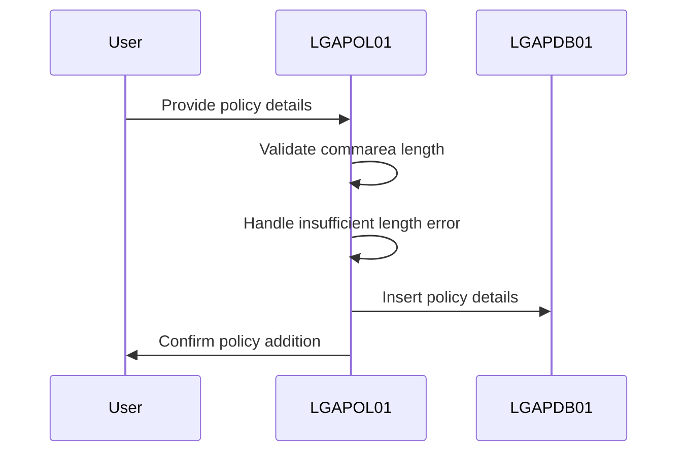

The document describes the process of adding policy details using the <SwmToken path="base/src/lgapol01.cbl" pos="13:6:6" line-data="       PROGRAM-ID. LGAPOL01.">`LGAPOL01`</SwmToken> program. This program is responsible for adding full details of an individual insurance policy, such as endowment, house, motor, and commercial policies. The flow involves validating the communication area length, handling errors related to insufficient length, and linking to <SwmToken path="base/src/lgapol01.cbl" pos="121:9:9" line-data="           EXEC CICS Link Program(LGAPDB01)">`LGAPDB01`</SwmToken> to insert policy details into the database.

For example, when adding a new motor policy, the program receives policy details and customer information, processes them, and confirms the addition of the policy.

The main steps are:

- Validate communication area length
- Handle insufficient commarea length error
- Link to <SwmToken path="base/src/lgapol01.cbl" pos="121:9:9" line-data="           EXEC CICS Link Program(LGAPDB01)">`LGAPDB01`</SwmToken> to insert policy details into the database



## Dependencies

### Programs

- <SwmToken path="base/src/lgapol01.cbl" pos="121:9:9" line-data="           EXEC CICS Link Program(LGAPDB01)">`LGAPDB01`</SwmToken> (<SwmPath>[base/src/lgapdb01.cbl](base/src/lgapdb01.cbl)</SwmPath>) - <SwmLink doc-title="Adding Policy Details (LGAPDB01)">[Adding Policy Details (LGAPDB01)](/.swm/adding-policy-details-lgapdb01.9o8n772r.sw.md)</SwmLink>
- LGAPVS01 (<SwmPath>[base/src/lgapvs01.cbl](base/src/lgapvs01.cbl)</SwmPath>) - <SwmLink doc-title="Adding Policy Records (LGAPVS01)">[Adding Policy Records (LGAPVS01)](/.swm/adding-policy-records-lgapvs01.hs8lg2t7.sw.md)</SwmLink>
- LGSTSQ (<SwmPath>[base/src/lgstsq.cbl](base/src/lgstsq.cbl)</SwmPath>) - <SwmLink doc-title="Message Queue Handler (LGSTSQ)">[Message Queue Handler (LGSTSQ)](/.swm/message-queue-handler-lgstsq.e7y8uelv.sw.md)</SwmLink>

### Copybooks

- LGCMAREA (<SwmPath>[base/src/lgcmarea.cpy](base/src/lgcmarea.cpy)</SwmPath>)
- LGPOLICY (<SwmPath>[base/src/lgpolicy.cpy](base/src/lgpolicy.cpy)</SwmPath>)
- SQLCA

# Where is this program used?

This program is used multiple times in the codebase as represented in the following diagram:

```mermaid
graph TD
  f79va("Commercial Policy Menu (LGTESTP4)") --> xsph3("Adding Policy Details (LGAPOL01)"):::currentEntity
click f79va openCode "base/src/lgtestp4.cbl:1"
ax26w("Motor Policy Menu (LGTESTP1)") --> xsph3("Adding Policy Details (LGAPOL01)"):::currentEntity
click ax26w openCode "base/src/lgtestp1.cbl:1"
sobsq("House Policy Transactions Menu (LGTESTP3)") --> xsph3("Adding Policy Details (LGAPOL01)"):::currentEntity
click sobsq openCode "base/src/lgtestp3.cbl:1"
tce9f("Endowment Policy Transactions (LGTESTP2)") --> xsph3("Adding Policy Details (LGAPOL01)"):::currentEntity
click tce9f openCode "base/src/lgtestp2.cbl:1"
  
  
click xsph3 openCode "base/src/lgapol01.cbl:1"
    classDef currentEntity color:#000000,fill:#7CB9F4

%% Swimm:
%% graph TD
%%   f79va("Commercial Policy Menu (LGTESTP4)") --> xsph3("Adding Policy Details (<SwmToken path="base/src/lgapol01.cbl" pos="13:6:6" line-data="       PROGRAM-ID. LGAPOL01.">`LGAPOL01`</SwmToken>)"):::currentEntity
%% click f79va openCode "<SwmPath>[base/src/lgtestp4.cbl](base/src/lgtestp4.cbl)</SwmPath>:1"
%% ax26w("Motor Policy Menu (LGTESTP1)") --> xsph3("Adding Policy Details (<SwmToken path="base/src/lgapol01.cbl" pos="13:6:6" line-data="       PROGRAM-ID. LGAPOL01.">`LGAPOL01`</SwmToken>)"):::currentEntity
%% click ax26w openCode "<SwmPath>[base/src/lgtestp1.cbl](base/src/lgtestp1.cbl)</SwmPath>:1"
%% sobsq("House Policy Transactions Menu (LGTESTP3)") --> xsph3("Adding Policy Details (<SwmToken path="base/src/lgapol01.cbl" pos="13:6:6" line-data="       PROGRAM-ID. LGAPOL01.">`LGAPOL01`</SwmToken>)"):::currentEntity
%% click sobsq openCode "<SwmPath>[base/src/lgtestp3.cbl](base/src/lgtestp3.cbl)</SwmPath>:1"
%% tce9f("Endowment Policy Transactions (LGTESTP2)") --> xsph3("Adding Policy Details (<SwmToken path="base/src/lgapol01.cbl" pos="13:6:6" line-data="       PROGRAM-ID. LGAPOL01.">`LGAPOL01`</SwmToken>)"):::currentEntity
%% click tce9f openCode "<SwmPath>[base/src/lgtestp2.cbl](base/src/lgtestp2.cbl)</SwmPath>:1"
%%   
%%   
%% click xsph3 openCode "<SwmPath>[base/src/lgapol01.cbl](base/src/lgapol01.cbl)</SwmPath>:1"
%%     classDef currentEntity color:#000000,fill:#7CB9F4
```



# Initialize and Validate Communication Area

<SwmSnippet path="/base/src/lgapol01.cbl" line="80">

---

In <SwmToken path="base/src/lgapol01.cbl" pos="80:1:1" line-data="       MAINLINE SECTION.">`MAINLINE`</SwmToken>, we kick off the flow by initializing working storage variables and setting up general transaction identifiers. This sets the stage for tracking transaction context throughout the program.

```cobol
       MAINLINE SECTION.

      *----------------------------------------------------------------*
      * Common code                                                    *
      *----------------------------------------------------------------*
      * initialize working storage variables
           INITIALIZE WS-HEADER.
      * set up general variable
           MOVE EIBTRNID TO WS-TRANSID.
           MOVE EIBTRMID TO WS-TERMID.
           MOVE EIBTASKN TO WS-TASKNUM.
           MOVE EIBCALEN TO WS-CALEN.
```

---

</SwmSnippet>

<SwmSnippet path="/base/src/lgapol01.cbl" line="105">

---

Next in <SwmToken path="base/src/lgapol01.cbl" pos="80:1:1" line-data="       MAINLINE SECTION.">`MAINLINE`</SwmToken>, we verify the commarea length to ensure it's adequate for processing.

```cobol
           MOVE '00' TO CA-RETURN-CODE
           SET WS-ADDR-DFHCOMMAREA TO ADDRESS OF DFHCOMMAREA.

      * Check commarea length
           ADD WS-CA-HEADER-LEN TO WS-REQUIRED-CA-LEN
```

---

</SwmSnippet>

<SwmSnippet path="/base/src/lgapol01.cbl" line="113">

---

This snippet in <SwmToken path="base/src/lgapol01.cbl" pos="80:1:1" line-data="       MAINLINE SECTION.">`MAINLINE`</SwmToken> handles the scenario where the commarea length is insufficient. It sets an error code and returns control to the caller to manage the issue.

```cobol
           IF EIBCALEN IS LESS THAN WS-REQUIRED-CA-LEN
             MOVE '98' TO CA-RETURN-CODE
             EXEC CICS RETURN END-EXEC
           END-IF
```

---

</SwmSnippet>

<SwmSnippet path="/base/src/lgapol01.cbl" line="121">

---

Finally in <SwmToken path="base/src/lgapol01.cbl" pos="80:1:1" line-data="       MAINLINE SECTION.">`MAINLINE`</SwmToken>, we call <SwmToken path="base/src/lgapol01.cbl" pos="121:9:9" line-data="           EXEC CICS Link Program(LGAPDB01)">`LGAPDB01`</SwmToken> to insert policy details into the database.

```cobol
           EXEC CICS Link Program(LGAPDB01)
                Commarea(DFHCOMMAREA)
                LENGTH(32500)
           END-EXEC.

           EXEC CICS RETURN END-EXEC.
```

---

</SwmSnippet>

&nbsp;

*This is an auto-generated document by Swimm 🌊 and has not yet been verified by a human*

<SwmMeta version="3.0.0" repo-id="Z2l0aHViJTNBJTNBa3luZHJ5bC1jaWNzLWdlbmFwcCUzQSUzQVN3aW1tLURlbW8=" repo-name="kyndryl-cics-genapp"><sup>Powered by [Swimm](/)</sup></SwmMeta>
