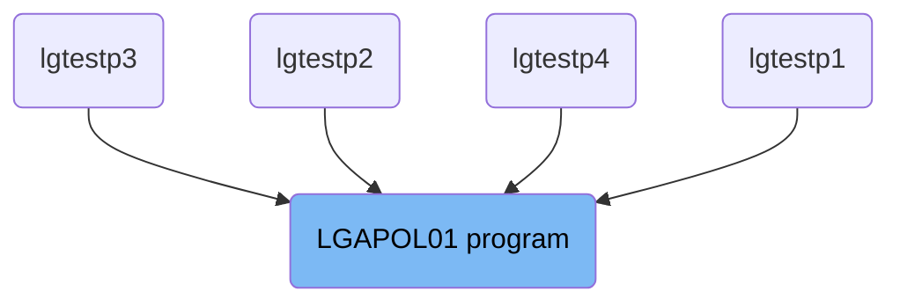
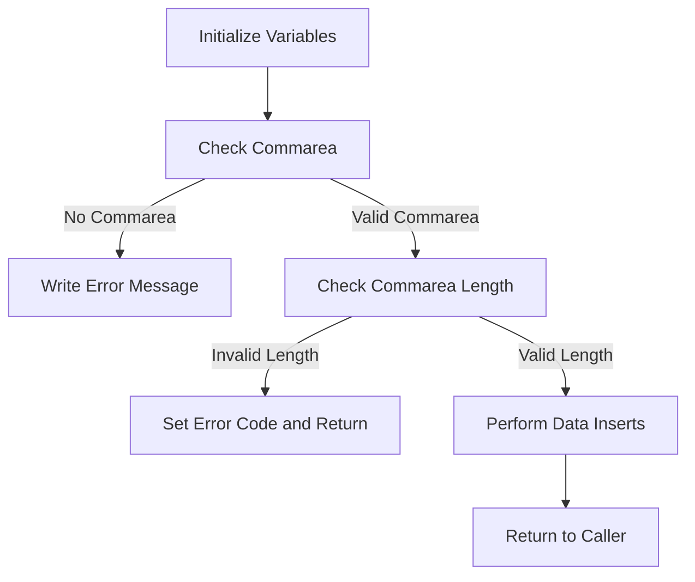

The <SwmToken path="base/src/lgapol01.cbl" pos="13:6:6" line-data="       PROGRAM-ID. LGAPOL01.">`LGAPOL01`</SwmToken> program is responsible for handling insurance policy operations within the system. It initializes variables, checks the communication area (commarea), validates the commarea length, and performs data inserts by linking to the <SwmToken path="base/src/lgapol01.cbl" pos="121:9:9" line-data="           EXEC CICS Link Program(LGAPDB01)">`LGAPDB01`</SwmToken> program. This ensures that insurance policy data is correctly processed and stored in the database.

The <SwmToken path="base/src/lgapol01.cbl" pos="13:6:6" line-data="       PROGRAM-ID. LGAPOL01.">`LGAPOL01`</SwmToken> program starts by initializing necessary variables and setting up transaction details. It then checks if the commarea is received and valid. If the commarea is missing or its length is insufficient, the program sets an error code and returns. If everything is in order, it proceeds to perform data inserts by linking to the <SwmToken path="base/src/lgapol01.cbl" pos="121:9:9" line-data="           EXEC CICS Link Program(LGAPDB01)">`LGAPDB01`</SwmToken> program, ensuring that the insurance policy data is properly inserted into the database.

# Where is this program used?

This program is used multiple times in the codebase as represented in the following diagram:



Lets' zoom into the flow:



<SwmSnippet path="/base/src/lgapol01.cbl" line="85">

---

## Initialize Variables

First, the program initializes working storage variables and sets up general variables by moving transaction details into working storage fields. This step ensures that all necessary variables are prepared for the subsequent operations.

```cobol
      * initialize working storage variables
           INITIALIZE WS-HEADER.
      * set up general variable
           MOVE EIBTRNID TO WS-TRANSID.
           MOVE EIBTRMID TO WS-TERMID.
           MOVE EIBTASKN TO WS-TASKNUM.
           MOVE EIBCALEN TO WS-CALEN.
      *----------------------------------------------------------------*
```

---

</SwmSnippet>

<SwmSnippet path="/base/src/lgapol01.cbl" line="95">

---

## Check Commarea

Next, the program checks if the communication area (commarea) is received. If no commarea is received, it moves an error message to <SwmToken path="base/src/lgapol01.cbl" pos="99:14:16" line-data="               MOVE &#39; NO COMMAREA RECEIVED&#39; TO EM-VARIABLE">`EM-VARIABLE`</SwmToken>, performs the <SwmToken path="base/src/lgapol01.cbl" pos="100:3:7" line-data="               PERFORM WRITE-ERROR-MESSAGE">`WRITE-ERROR-MESSAGE`</SwmToken> procedure, and issues an ABEND (abnormal end) with code 'LGCA'. This ensures that the program does not proceed without the necessary commarea data.

```cobol
      * Check commarea and obtain required details                     *
      *----------------------------------------------------------------*
      * If NO commarea received issue an ABEND
           IF EIBCALEN IS EQUAL TO ZERO
               MOVE ' NO COMMAREA RECEIVED' TO EM-VARIABLE
               PERFORM WRITE-ERROR-MESSAGE
               EXEC CICS ABEND ABCODE('LGCA') NODUMP END-EXEC
           END-IF
```

---

</SwmSnippet>

<SwmSnippet path="/base/src/lgapol01.cbl" line="104">

---

## Initialize Commarea Return Code

Then, the program initializes the commarea return code to zero and sets the address of the commarea. This step prepares the commarea for further processing and ensures that any return codes are reset.

```cobol
      * initialize commarea return code to zero
           MOVE '00' TO CA-RETURN-CODE
           SET WS-ADDR-DFHCOMMAREA TO ADDRESS OF DFHCOMMAREA.
```

---

</SwmSnippet>

<SwmSnippet path="/base/src/lgapol01.cbl" line="108">

---

## Check Commarea Length

Moving to the next step, the program checks the length of the commarea. If the length is less than the required length, it sets an error return code to '98' and returns to the caller. This validation ensures that the commarea has sufficient data for processing.

```cobol
      * Check commarea length
           ADD WS-CA-HEADER-LEN TO WS-REQUIRED-CA-LEN


      *    if less set error return code and return to caller
           IF EIBCALEN IS LESS THAN WS-REQUIRED-CA-LEN
             MOVE '98' TO CA-RETURN-CODE
             EXEC CICS RETURN END-EXEC
           END-IF
```

---

</SwmSnippet>

<SwmSnippet path="/base/src/lgapol01.cbl" line="118">

---

## Perform Data Inserts

Finally, the program performs data inserts by linking to the <SwmToken path="base/src/lgapol01.cbl" pos="121:9:9" line-data="           EXEC CICS Link Program(LGAPDB01)">`LGAPDB01`</SwmToken> program with the commarea and then returns to the caller. This step is crucial as it handles the actual data insertion operations required by the transaction.

More about <SwmToken path="base/src/lgapol01.cbl" pos="121:9:9" line-data="           EXEC CICS Link Program(LGAPDB01)">`LGAPDB01`</SwmToken>: <SwmLink doc-title="Adding Policy Information (LGAPDB01)">[Adding Policy Information (LGAPDB01)](/.swm/adding-policy-information-lgapdb01.iuyvorm7.sw.md)</SwmLink>

```cobol
      *----------------------------------------------------------------*
      *    Perform the data Inserts                                    *
      *----------------------------------------------------------------*
           EXEC CICS Link Program(LGAPDB01)
                Commarea(DFHCOMMAREA)
                LENGTH(32500)
           END-EXEC.

           EXEC CICS RETURN END-EXEC.
```

---

</SwmSnippet>

&nbsp;

*This is an auto-generated document by Swimm 🌊 and has not yet been verified by a human*

<SwmMeta version="3.0.0" repo-id="Z2l0aHViJTNBJTNBa3luZHJ5bC1jaWNzLWdlbmFwcCUzQSUzQVN3aW1tLURlbW8=" repo-name="kyndryl-cics-genapp"><sup>Powered by [Swimm](/)</sup></SwmMeta>
