The <SwmToken path="base/src/lgapdb01.cbl" pos="13:6:6" line-data="       PROGRAM-ID. LGAPDB01.">`LGAPDB01`</SwmToken> program is responsible for handling database operations related to insurance policies. It is used in a flow starting from the `lgapol01` program. The program initializes working storage variables, sets up general variables, and prepares <SwmToken path="base/src/lgapdb01.cbl" pos="158:3:3" line-data="           INITIALIZE DB2-IN-INTEGERS.">`DB2`</SwmToken> host variables for database operations. It also handles communication area checks and processes various types of insurance policy requests, such as Endowment, House, Motor, and Commercial policies.

The <SwmToken path="base/src/lgapdb01.cbl" pos="13:6:6" line-data="       PROGRAM-ID. LGAPDB01.">`LGAPDB01`</SwmToken> program starts by initializing necessary variables and checking the communication area. It then evaluates the type of insurance policy request and sets the appropriate policy type. The program proceeds to insert policy information into the database, handling different types of policies like Endowment, House, Motor, and Commercial. Finally, it returns control to the caller program.

# Where is this program used?

This program is used once, in a flow starting from `lgapol01` as represented in the following diagram:

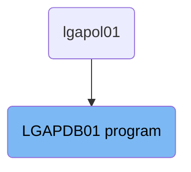

Here is a high level diagram of the program:

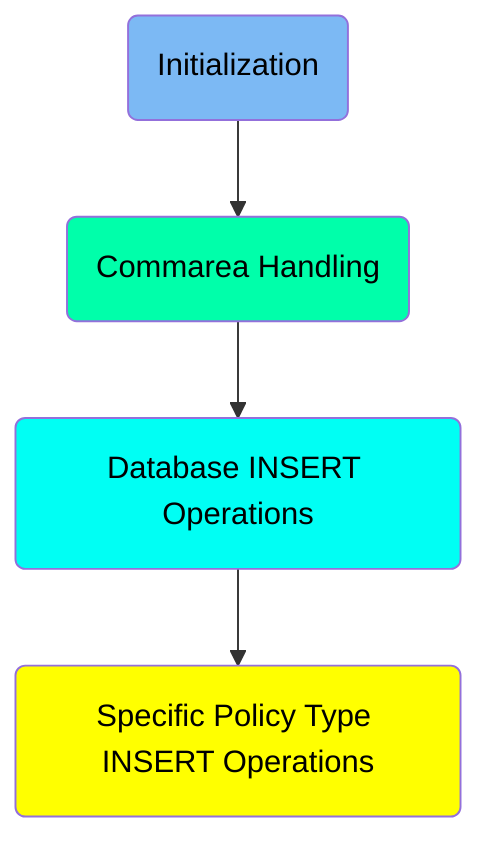

# Initialization

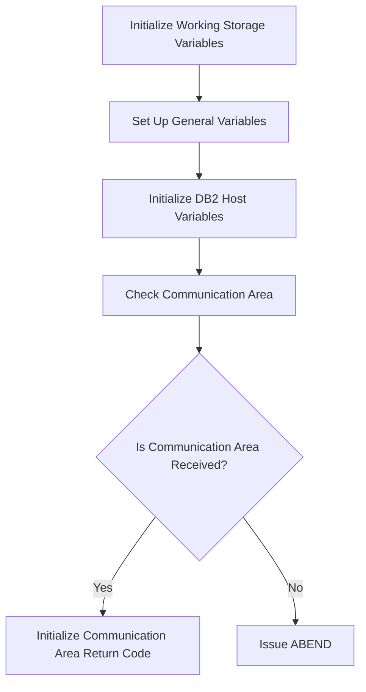

<SwmSnippet path="/base/src/lgapdb01.cbl" line="148">

---

## Initialize Working Storage Variables

First, we initialize the working storage variables by calling <SwmToken path="base/src/lgapdb01.cbl" pos="149:1:5" line-data="           INITIALIZE WS-HEADER.">`INITIALIZE WS-HEADER`</SwmToken>. This sets up the necessary storage for the transaction.

```cobol
      * initialize working storage variables
           INITIALIZE WS-HEADER.
```

---

</SwmSnippet>

<SwmSnippet path="/base/src/lgapdb01.cbl" line="151">

---

## Set Up General Variables

Moving to setting up general variables, we assign transaction-specific details such as transaction ID, terminal ID, task number, and communication area length to working storage variables. This ensures that the transaction has all the necessary identifiers for processing.

```cobol
           MOVE EIBTRNID TO WS-TRANSID.
           MOVE EIBTRMID TO WS-TERMID.
           MOVE EIBTASKN TO WS-TASKNUM.
           MOVE EIBCALEN TO WS-CALEN.
```

---

</SwmSnippet>

<SwmSnippet path="/base/src/lgapdb01.cbl" line="158">

---

## Initialize <SwmToken path="base/src/lgapdb01.cbl" pos="158:3:3" line-data="           INITIALIZE DB2-IN-INTEGERS.">`DB2`</SwmToken> Host Variables

Next, we initialize the <SwmToken path="base/src/lgapdb01.cbl" pos="158:3:3" line-data="           INITIALIZE DB2-IN-INTEGERS.">`DB2`</SwmToken> host variables by calling <SwmToken path="base/src/lgapdb01.cbl" pos="158:1:7" line-data="           INITIALIZE DB2-IN-INTEGERS.">`INITIALIZE DB2-IN-INTEGERS`</SwmToken> and <SwmToken path="base/src/lgapdb01.cbl" pos="159:1:7" line-data="           INITIALIZE DB2-OUT-INTEGERS.">`INITIALIZE DB2-OUT-INTEGERS`</SwmToken>. This prepares the <SwmToken path="base/src/lgapdb01.cbl" pos="158:3:3" line-data="           INITIALIZE DB2-IN-INTEGERS.">`DB2`</SwmToken> variables for any database operations that will be performed during the transaction.

```cobol
           INITIALIZE DB2-IN-INTEGERS.
           INITIALIZE DB2-OUT-INTEGERS.
```

---

</SwmSnippet>

<SwmSnippet path="/base/src/lgapdb01.cbl" line="164">

---

## Check Communication Area

Then, we check if the communication area (<SwmToken path="base/src/lgapdb01.cbl" pos="165:3:3" line-data="           IF EIBCALEN IS EQUAL TO ZERO">`EIBCALEN`</SwmToken>) is received. If it is not received (<SwmToken path="base/src/lgapdb01.cbl" pos="165:3:11" line-data="           IF EIBCALEN IS EQUAL TO ZERO">`EIBCALEN IS EQUAL TO ZERO`</SwmToken>), we move an error message to <SwmToken path="base/src/lgapdb01.cbl" pos="166:14:16" line-data="               MOVE &#39; NO COMMAREA RECEIVED&#39; TO EM-VARIABLE">`EM-VARIABLE`</SwmToken>, perform <SwmToken path="base/src/lgapdb01.cbl" pos="167:3:7" line-data="               PERFORM WRITE-ERROR-MESSAGE">`WRITE-ERROR-MESSAGE`</SwmToken>, and issue an ABEND with code 'LGCA'. This ensures that the transaction does not proceed without the necessary communication area.

```cobol
      * If NO commarea received issue an ABEND
           IF EIBCALEN IS EQUAL TO ZERO
               MOVE ' NO COMMAREA RECEIVED' TO EM-VARIABLE
               PERFORM WRITE-ERROR-MESSAGE
               EXEC CICS ABEND ABCODE('LGCA') NODUMP END-EXEC
           END-IF
```

---

</SwmSnippet>

<SwmSnippet path="/base/src/lgapdb01.cbl" line="171">

---

## Initialize Communication Area Return Code

If the communication area is received, we initialize the communication area return code to '00' and set the address of <SwmToken path="base/src/lgapdb01.cbl" pos="173:7:7" line-data="           SET WS-ADDR-DFHCOMMAREA TO ADDRESS OF DFHCOMMAREA.">`DFHCOMMAREA`</SwmToken> to <SwmToken path="base/src/lgapdb01.cbl" pos="173:3:7" line-data="           SET WS-ADDR-DFHCOMMAREA TO ADDRESS OF DFHCOMMAREA.">`WS-ADDR-DFHCOMMAREA`</SwmToken>. This prepares the communication area for further processing.

```cobol
      * initialize commarea return code to zero
           MOVE '00' TO CA-RETURN-CODE
           SET WS-ADDR-DFHCOMMAREA TO ADDRESS OF DFHCOMMAREA.
```

---

</SwmSnippet>

# Commarea Handling

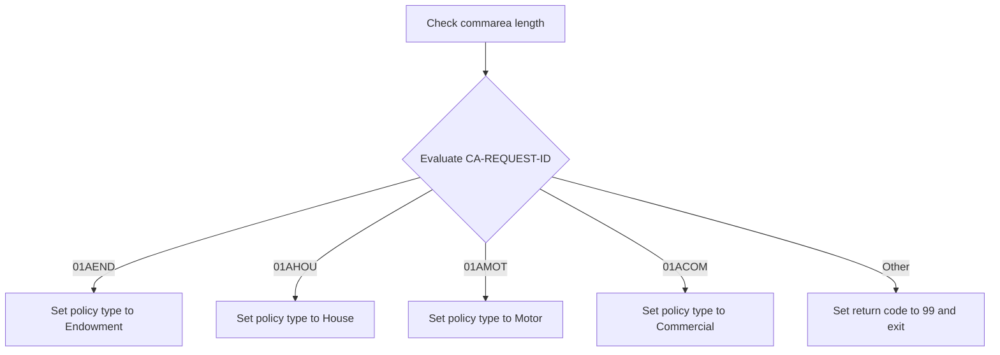

<SwmSnippet path="/base/src/lgapdb01.cbl" line="181">

---

## Check commarea length

First, the code checks the length of the commarea by adding <SwmToken path="base/src/lgapdb01.cbl" pos="182:3:9" line-data="           ADD WS-CA-HEADER-LEN TO WS-REQUIRED-CA-LEN">`WS-CA-HEADER-LEN`</SwmToken> to <SwmToken path="base/src/lgapdb01.cbl" pos="182:13:19" line-data="           ADD WS-CA-HEADER-LEN TO WS-REQUIRED-CA-LEN">`WS-REQUIRED-CA-LEN`</SwmToken>. This ensures that the commarea has the necessary length for further processing.

```cobol
      * Check commarea length
           ADD WS-CA-HEADER-LEN TO WS-REQUIRED-CA-LEN

```

---

</SwmSnippet>

<SwmSnippet path="/base/src/lgapdb01.cbl" line="184">

---

## Evaluate <SwmToken path="base/src/lgapdb01.cbl" pos="184:3:7" line-data="           EVALUATE CA-REQUEST-ID">`CA-REQUEST-ID`</SwmToken>

Moving to the evaluation of <SwmToken path="base/src/lgapdb01.cbl" pos="184:3:7" line-data="           EVALUATE CA-REQUEST-ID">`CA-REQUEST-ID`</SwmToken>, the code determines the type of insurance policy request. Depending on the value of <SwmToken path="base/src/lgapdb01.cbl" pos="184:3:7" line-data="           EVALUATE CA-REQUEST-ID">`CA-REQUEST-ID`</SwmToken>, it sets the required commarea length and the policy type. For <SwmToken path="base/src/lgapdb01.cbl" pos="186:4:4" line-data="             WHEN &#39;01AEND&#39;">`01AEND`</SwmToken>, it sets the policy type to Endowment. For <SwmToken path="base/src/lgapdb01.cbl" pos="190:4:4" line-data="             WHEN &#39;01AHOU&#39;">`01AHOU`</SwmToken>, it sets the policy type to House. For <SwmToken path="base/src/lgapdb01.cbl" pos="194:4:4" line-data="             WHEN &#39;01AMOT&#39;">`01AMOT`</SwmToken>, it sets the policy type to Motor. For <SwmToken path="base/src/lgapdb01.cbl" pos="198:4:4" line-data="             WHEN &#39;01ACOM&#39;">`01ACOM`</SwmToken>, it sets the policy type to Commercial. If the request ID is not recognized, it sets the return code to '99' and exits.

```cobol
           EVALUATE CA-REQUEST-ID

             WHEN '01AEND'
               ADD WS-FULL-ENDOW-LEN TO WS-REQUIRED-CA-LEN
               MOVE 'E' TO DB2-POLICYTYPE

             WHEN '01AHOU'
               ADD WS-FULL-HOUSE-LEN TO WS-REQUIRED-CA-LEN
               MOVE 'H' TO DB2-POLICYTYPE

             WHEN '01AMOT'
               ADD WS-FULL-MOTOR-LEN TO WS-REQUIRED-CA-LEN
               MOVE 'M' TO DB2-POLICYTYPE

             WHEN '01ACOM'
               ADD WS-FULL-COMM-LEN TO WS-REQUIRED-CA-LEN
               MOVE 'C' TO DB2-POLICYTYPE

             WHEN OTHER
      *        Request is not recognised or supported
               MOVE '99' TO CA-RETURN-CODE
```

---

</SwmSnippet>

<SwmSnippet path="/base/src/lgapdb01.cbl" line="186">

---

## Set policy type to Endowment

Next, if the <SwmToken path="base/src/lgapdb01.cbl" pos="184:3:7" line-data="           EVALUATE CA-REQUEST-ID">`CA-REQUEST-ID`</SwmToken> is <SwmToken path="base/src/lgapdb01.cbl" pos="186:4:4" line-data="             WHEN &#39;01AEND&#39;">`01AEND`</SwmToken>, the code adds <SwmToken path="base/src/lgapdb01.cbl" pos="187:3:9" line-data="               ADD WS-FULL-ENDOW-LEN TO WS-REQUIRED-CA-LEN">`WS-FULL-ENDOW-LEN`</SwmToken> to <SwmToken path="base/src/lgapdb01.cbl" pos="187:13:19" line-data="               ADD WS-FULL-ENDOW-LEN TO WS-REQUIRED-CA-LEN">`WS-REQUIRED-CA-LEN`</SwmToken> and sets the policy type to 'E' for Endowment.

```cobol
             WHEN '01AEND'
               ADD WS-FULL-ENDOW-LEN TO WS-REQUIRED-CA-LEN
               MOVE 'E' TO DB2-POLICYTYPE
```

---

</SwmSnippet>

<SwmSnippet path="/base/src/lgapdb01.cbl" line="190">

---

## Set policy type to House

Then, if the <SwmToken path="base/src/lgapdb01.cbl" pos="184:3:7" line-data="           EVALUATE CA-REQUEST-ID">`CA-REQUEST-ID`</SwmToken> is <SwmToken path="base/src/lgapdb01.cbl" pos="190:4:4" line-data="             WHEN &#39;01AHOU&#39;">`01AHOU`</SwmToken>, the code adds <SwmToken path="base/src/lgapdb01.cbl" pos="191:3:9" line-data="               ADD WS-FULL-HOUSE-LEN TO WS-REQUIRED-CA-LEN">`WS-FULL-HOUSE-LEN`</SwmToken> to <SwmToken path="base/src/lgapdb01.cbl" pos="191:13:19" line-data="               ADD WS-FULL-HOUSE-LEN TO WS-REQUIRED-CA-LEN">`WS-REQUIRED-CA-LEN`</SwmToken> and sets the policy type to 'H' for House.

```cobol
             WHEN '01AHOU'
               ADD WS-FULL-HOUSE-LEN TO WS-REQUIRED-CA-LEN
               MOVE 'H' TO DB2-POLICYTYPE
```

---

</SwmSnippet>

<SwmSnippet path="/base/src/lgapdb01.cbl" line="194">

---

## Set policy type to Motor

If the <SwmToken path="base/src/lgapdb01.cbl" pos="184:3:7" line-data="           EVALUATE CA-REQUEST-ID">`CA-REQUEST-ID`</SwmToken> is <SwmToken path="base/src/lgapdb01.cbl" pos="194:4:4" line-data="             WHEN &#39;01AMOT&#39;">`01AMOT`</SwmToken>, the code adds <SwmToken path="base/src/lgapdb01.cbl" pos="195:3:9" line-data="               ADD WS-FULL-MOTOR-LEN TO WS-REQUIRED-CA-LEN">`WS-FULL-MOTOR-LEN`</SwmToken> to <SwmToken path="base/src/lgapdb01.cbl" pos="195:13:19" line-data="               ADD WS-FULL-MOTOR-LEN TO WS-REQUIRED-CA-LEN">`WS-REQUIRED-CA-LEN`</SwmToken> and sets the policy type to 'M' for Motor.

```cobol
             WHEN '01AMOT'
               ADD WS-FULL-MOTOR-LEN TO WS-REQUIRED-CA-LEN
               MOVE 'M' TO DB2-POLICYTYPE
```

---

</SwmSnippet>

<SwmSnippet path="/base/src/lgapdb01.cbl" line="198">

---

## Set policy type to Commercial

If the <SwmToken path="base/src/lgapdb01.cbl" pos="184:3:7" line-data="           EVALUATE CA-REQUEST-ID">`CA-REQUEST-ID`</SwmToken> is <SwmToken path="base/src/lgapdb01.cbl" pos="198:4:4" line-data="             WHEN &#39;01ACOM&#39;">`01ACOM`</SwmToken>, the code adds <SwmToken path="base/src/lgapdb01.cbl" pos="199:3:9" line-data="               ADD WS-FULL-COMM-LEN TO WS-REQUIRED-CA-LEN">`WS-FULL-COMM-LEN`</SwmToken> to <SwmToken path="base/src/lgapdb01.cbl" pos="199:13:19" line-data="               ADD WS-FULL-COMM-LEN TO WS-REQUIRED-CA-LEN">`WS-REQUIRED-CA-LEN`</SwmToken> and sets the policy type to 'C' for Commercial.

```cobol
             WHEN '01ACOM'
               ADD WS-FULL-COMM-LEN TO WS-REQUIRED-CA-LEN
               MOVE 'C' TO DB2-POLICYTYPE
```

---

</SwmSnippet>

<SwmSnippet path="/base/src/lgapdb01.cbl" line="202">

---

## Handle unrecognized request

If the <SwmToken path="base/src/lgapdb01.cbl" pos="184:3:7" line-data="           EVALUATE CA-REQUEST-ID">`CA-REQUEST-ID`</SwmToken> does not match any of the recognized values, the code sets the return code to '99' and exits. This indicates that the request is not recognized or supported.

```cobol
             WHEN OTHER
      *        Request is not recognised or supported
               MOVE '99' TO CA-RETURN-CODE
               EXEC CICS RETURN END-EXEC
```

---

</SwmSnippet>

<SwmSnippet path="/base/src/lgapdb01.cbl" line="209">

---

## Check commarea length again

Finally, the code checks if the actual length of the commarea (<SwmToken path="base/src/lgapdb01.cbl" pos="210:3:3" line-data="           IF EIBCALEN IS LESS THAN WS-REQUIRED-CA-LEN">`EIBCALEN`</SwmToken>) is less than the required length (<SwmToken path="base/src/lgapdb01.cbl" pos="210:11:17" line-data="           IF EIBCALEN IS LESS THAN WS-REQUIRED-CA-LEN">`WS-REQUIRED-CA-LEN`</SwmToken>). If it is, the return code is set to '98' and the program exits. This ensures that the commarea has the necessary length for the request.

```cobol
      *    if less set error return code and return to caller
           IF EIBCALEN IS LESS THAN WS-REQUIRED-CA-LEN
             MOVE '98' TO CA-RETURN-CODE
             EXEC CICS RETURN END-EXEC
           END-IF
```

---

</SwmSnippet>

## Interim Summary

So far, we saw how the initialization process sets up working storage variables, general variables, and <SwmToken path="base/src/lgapdb01.cbl" pos="158:3:3" line-data="           INITIALIZE DB2-IN-INTEGERS.">`DB2`</SwmToken> host variables, and checks the communication area. Now, we will focus on handling the commarea, including evaluating the <SwmToken path="base/src/lgapdb01.cbl" pos="184:3:7" line-data="           EVALUATE CA-REQUEST-ID">`CA-REQUEST-ID`</SwmToken> and setting the appropriate policy type.

# Database INSERT Operations

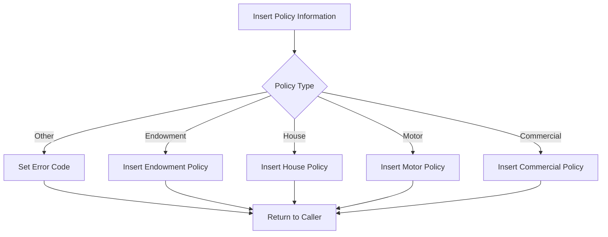

<SwmSnippet path="/base/src/lgapdb01.cbl" line="216">

---

## Inserting Policy Information

First, the code performs the insertion of a row into the policy table by calling the <SwmToken path="base/src/lgapdb01.cbl" pos="219:3:5" line-data="           PERFORM INSERT-POLICY">`INSERT-POLICY`</SwmToken> procedure. This step ensures that the basic policy information is recorded in the database.

```cobol
      *    Perform the INSERTs against appropriate tables              *
      *----------------------------------------------------------------*
      *    Call procedure to Insert row in policy table
           PERFORM INSERT-POLICY

```

---

</SwmSnippet>

<SwmSnippet path="/base/src/lgapdb01.cbl" line="223">

---

## Determining Policy Type

Next, the code evaluates the <SwmToken path="base/src/lgapdb01.cbl" pos="223:3:7" line-data="           EVALUATE CA-REQUEST-ID">`CA-REQUEST-ID`</SwmToken> to determine the type of policy being processed. Based on the policy type, it performs the appropriate insertion routine. For example, if the policy type is <SwmToken path="base/src/lgapdb01.cbl" pos="228:4:4" line-data="             WHEN &#39;01AHOU&#39;">`01AHOU`</SwmToken>, it calls the <SwmToken path="base/src/lgapdb01.cbl" pos="229:3:5" line-data="               PERFORM INSERT-HOUSE">`INSERT-HOUSE`</SwmToken> procedure to insert the house policy information into the database.

```cobol
           EVALUATE CA-REQUEST-ID

             WHEN '01AEND'
               PERFORM INSERT-ENDOW

             WHEN '01AHOU'
               PERFORM INSERT-HOUSE

             WHEN '01AMOT'
               PERFORM INSERT-MOTOR

             WHEN '01ACOM'
               PERFORM INSERT-COMMERCIAL

             WHEN OTHER
      *        Request is not recognised or supported
               MOVE '99' TO CA-RETURN-CODE

           END-EVALUATE
```

---

</SwmSnippet>

<SwmSnippet path="/base/src/lgapdb01.cbl" line="402">

---

### Inserting House Policy

The <SwmToken path="base/src/lgapdb01.cbl" pos="402:1:3" line-data="       INSERT-HOUSE.">`INSERT-HOUSE`</SwmToken> procedure handles the insertion of house policy information into the <SwmToken path="base/src/lgapdb01.cbl" pos="402:3:3" line-data="       INSERT-HOUSE.">`HOUSE`</SwmToken> table. It moves the necessary fields to the appropriate format and executes the SQL <SwmToken path="base/src/lgapdb01.cbl" pos="402:1:1" line-data="       INSERT-HOUSE.">`INSERT`</SwmToken> statement. If the insertion fails, it sets the return code to '90' and performs error handling.

```cobol
       INSERT-HOUSE.

      *    Move numeric fields to integer format
           MOVE CA-H-VALUE       TO DB2-H-VALUE-INT
           MOVE CA-H-BEDROOMS    TO DB2-H-BEDROOMS-SINT

           MOVE ' INSERT HOUSE ' TO EM-SQLREQ
           EXEC SQL
             INSERT INTO HOUSE
                       ( POLICYNUMBER,
                         PROPERTYTYPE,
                         BEDROOMS,
                         VALUE,
                         HOUSENAME,
                         HOUSENUMBER,
                         POSTCODE          )
                VALUES ( :DB2-POLICYNUM-INT,
                         :CA-H-PROPERTY-TYPE,
                         :DB2-H-BEDROOMS-SINT,
                         :DB2-H-VALUE-INT,
                         :CA-H-HOUSE-NAME,
```

---

</SwmSnippet>

<SwmSnippet path="/base/src/lgapdb01.cbl" line="440">

---

### Inserting Motor Policy

The <SwmToken path="base/src/lgapdb01.cbl" pos="440:1:3" line-data="       INSERT-MOTOR.">`INSERT-MOTOR`</SwmToken> procedure handles the insertion of motor policy information into the <SwmToken path="base/src/lgapdb01.cbl" pos="440:3:3" line-data="       INSERT-MOTOR.">`MOTOR`</SwmToken> table. Similar to the house policy insertion, it moves the necessary fields to the appropriate format and executes the SQL <SwmToken path="base/src/lgapdb01.cbl" pos="440:1:1" line-data="       INSERT-MOTOR.">`INSERT`</SwmToken> statement. If the insertion fails, it sets the return code to '90' and performs error handling.

```cobol
       INSERT-MOTOR.

      *    Move numeric fields to integer format
           MOVE CA-M-VALUE       TO DB2-M-VALUE-INT
           MOVE CA-M-CC          TO DB2-M-CC-SINT
           MOVE CA-M-PREMIUM     TO DB2-M-PREMIUM-INT
           MOVE CA-M-ACCIDENTS   TO DB2-M-ACCIDENTS-INT

           MOVE ' INSERT MOTOR ' TO EM-SQLREQ
           EXEC SQL
             INSERT INTO MOTOR
                       ( POLICYNUMBER,
                         MAKE,
                         MODEL,
                         VALUE,
                         REGNUMBER,
                         COLOUR,
                         CC,
                         YEAROFMANUFACTURE,
                         PREMIUM,
                         ACCIDENTS )
```

---

</SwmSnippet>

<SwmSnippet path="/base/src/lgapdb01.cbl" line="486">

---

### Inserting Commercial Policy

The <SwmToken path="base/src/lgapdb01.cbl" pos="486:1:3" line-data="       INSERT-COMMERCIAL.">`INSERT-COMMERCIAL`</SwmToken> procedure handles the insertion of commercial policy information into the <SwmToken path="base/src/lgapdb01.cbl" pos="486:3:3" line-data="       INSERT-COMMERCIAL.">`COMMERCIAL`</SwmToken> table. It moves the necessary fields to the appropriate format and executes the SQL <SwmToken path="base/src/lgapdb01.cbl" pos="486:1:1" line-data="       INSERT-COMMERCIAL.">`INSERT`</SwmToken> statement. If the insertion fails, it sets the return code to '90' and performs error handling.

```cobol
       INSERT-COMMERCIAL.

           MOVE CA-B-FirePeril       To DB2-B-FirePeril-Int
           MOVE CA-B-FirePremium     To DB2-B-FirePremium-Int
           MOVE CA-B-CrimePeril      To DB2-B-CrimePeril-Int
           MOVE CA-B-CrimePremium    To DB2-B-CrimePremium-Int
           MOVE CA-B-FloodPeril      To DB2-B-FloodPeril-Int
           MOVE CA-B-FloodPremium    To DB2-B-FloodPremium-Int
           MOVE CA-B-WeatherPeril    To DB2-B-WeatherPeril-Int
           MOVE CA-B-WeatherPremium  To DB2-B-WeatherPremium-Int
           MOVE CA-B-Status          To DB2-B-Status-Int

           MOVE ' INSERT COMMER' TO EM-SQLREQ
           EXEC SQL
             INSERT INTO COMMERCIAL
                       (
                         PolicyNumber,
                         RequestDate,
                         StartDate,
                         RenewalDate,
                         Address,
```

---

</SwmSnippet>

<SwmSnippet path="/base/src/lgapdb01.cbl" line="243">

---

## Returning to Caller

Finally, the code links to the <SwmToken path="base/src/lgapdb01.cbl" pos="243:9:9" line-data="             EXEC CICS Link Program(LGAPVS01)">`LGAPVS01`</SwmToken> program and then returns control to the caller. This step ensures that the process completes and the control is handed back to the calling program.

More about <SwmToken path="base/src/lgapdb01.cbl" pos="243:9:9" line-data="             EXEC CICS Link Program(LGAPVS01)">`LGAPVS01`</SwmToken>: <SwmLink doc-title="Adding Policy Records (LGAPVS01)">[Adding Policy Records (LGAPVS01)](/.swm/adding-policy-records-lgapvs01.c4crfwo7.sw.md)</SwmLink>

```cobol
             EXEC CICS Link Program(LGAPVS01)
                  Commarea(DFHCOMMAREA)
                LENGTH(32500)
             END-EXEC.


      * Return to caller
           EXEC CICS RETURN END-EXEC.
```

---

</SwmSnippet>

# Specific Policy Type INSERT Operations

Lets split this section into smaller parts:

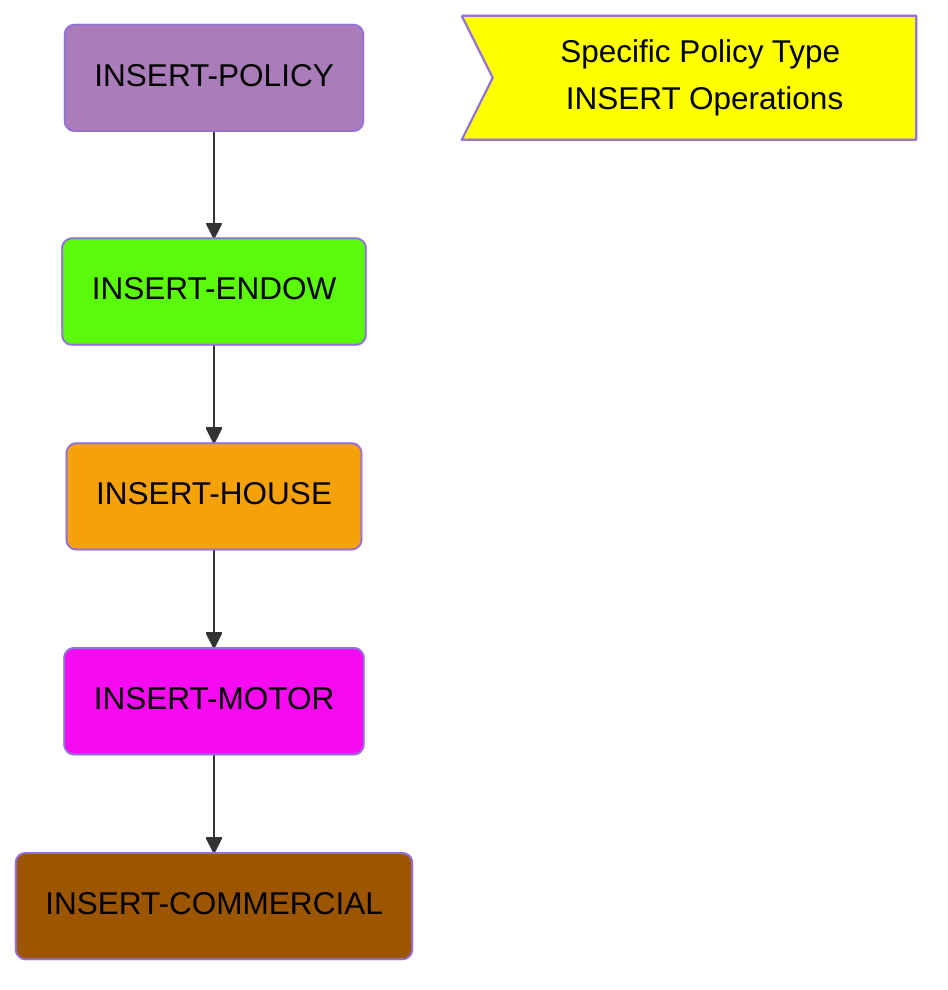

# <SwmToken path="base/src/lgapdb01.cbl" pos="219:3:5" line-data="           PERFORM INSERT-POLICY">`INSERT-POLICY`</SwmToken>

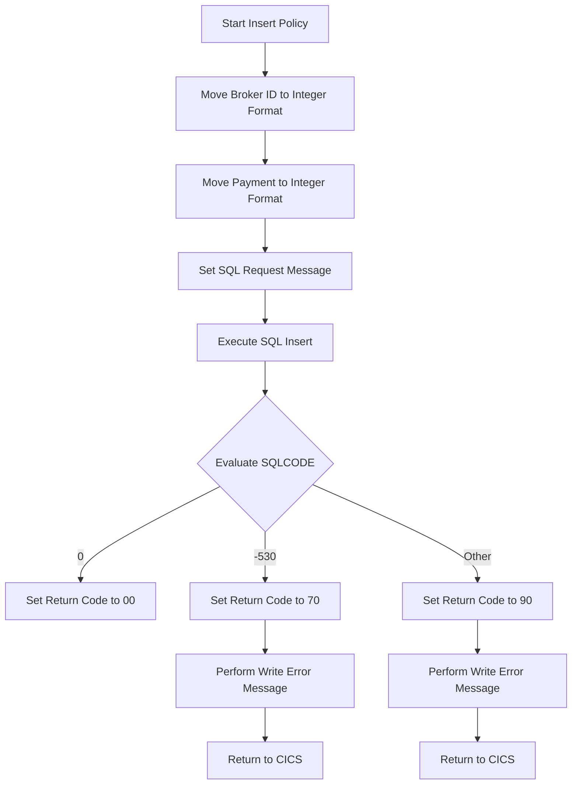

<SwmSnippet path="/base/src/lgapdb01.cbl" line="261">

---

## Start Insert Policy

The <SwmToken path="base/src/lgapdb01.cbl" pos="261:1:3" line-data="       INSERT-POLICY.">`INSERT-POLICY`</SwmToken> section begins the process of inserting a new policy into the database. This is the main entry point for this operation.

```cobol
       INSERT-POLICY.

      *    Move numeric fields to integer format
```

---

</SwmSnippet>

<SwmSnippet path="/base/src/lgapdb01.cbl" line="264">

---

## Move Broker ID to Integer Format

First, the broker ID from the communication area is moved to an integer format suitable for the database.

```cobol
           MOVE CA-BROKERID TO DB2-BROKERID-INT
```

---

</SwmSnippet>

<SwmSnippet path="/base/src/lgapdb01.cbl" line="265">

---

## Move Payment to Integer Format

Next, the payment amount from the communication area is also moved to an integer format for the database.

```cobol
           MOVE CA-PAYMENT TO DB2-PAYMENT-INT
```

---

</SwmSnippet>

<SwmSnippet path="/base/src/lgapdb01.cbl" line="267">

---

## Set SQL Request Message

The SQL request message is set to indicate that an insert operation is being performed.

```cobol
           MOVE ' INSERT POLICY' TO EM-SQLREQ
```

---

</SwmSnippet>

<SwmSnippet path="/base/src/lgapdb01.cbl" line="268">

---

## Execute SQL Insert

The SQL <SwmToken path="base/src/lgapdb01.cbl" pos="269:1:1" line-data="             INSERT INTO POLICY">`INSERT`</SwmToken> statement is executed to add the new policy to the <SwmToken path="base/src/lgapdb01.cbl" pos="269:5:5" line-data="             INSERT INTO POLICY">`POLICY`</SwmToken> table. Various fields are populated with values from the communication area and current timestamp.

```cobol
           EXEC SQL
             INSERT INTO POLICY
                       ( POLICYNUMBER,
                         CUSTOMERNUMBER,
                         ISSUEDATE,
                         EXPIRYDATE,
                         POLICYTYPE,
                         LASTCHANGED,
                         BROKERID,
                         BROKERSREFERENCE,
                         PAYMENT           )
                VALUES ( DEFAULT,
                         :DB2-CUSTOMERNUM-INT,
                         :CA-ISSUE-DATE,
                         :CA-EXPIRY-DATE,
                         :DB2-POLICYTYPE,
                         CURRENT TIMESTAMP,
                         :DB2-BROKERID-INT,
                         :CA-BROKERSREF,
                         :DB2-PAYMENT-INT      )
           END-EXEC
```

---

</SwmSnippet>

<SwmSnippet path="/base/src/lgapdb01.cbl" line="290">

---

## Evaluate SQLCODE

The <SwmToken path="base/src/lgapdb01.cbl" pos="290:3:3" line-data="           Evaluate SQLCODE">`SQLCODE`</SwmToken> is evaluated to determine the outcome of the SQL <SwmToken path="base/src/lgapdb01.cbl" pos="219:3:3" line-data="           PERFORM INSERT-POLICY">`INSERT`</SwmToken> operation. If the <SwmToken path="base/src/lgapdb01.cbl" pos="290:3:3" line-data="           Evaluate SQLCODE">`SQLCODE`</SwmToken> is 0, the return code is set to '00'. If the <SwmToken path="base/src/lgapdb01.cbl" pos="290:3:3" line-data="           Evaluate SQLCODE">`SQLCODE`</SwmToken> is -530, the return code is set to '70', an error message is written, and control is returned to CICS. For any other <SwmToken path="base/src/lgapdb01.cbl" pos="290:3:3" line-data="           Evaluate SQLCODE">`SQLCODE`</SwmToken>, the return code is set to '90', an error message is written, and control is returned to CICS.

```cobol
           Evaluate SQLCODE

             When 0
               MOVE '00' TO CA-RETURN-CODE

             When -530
               MOVE '70' TO CA-RETURN-CODE
               PERFORM WRITE-ERROR-MESSAGE
               EXEC CICS RETURN END-EXEC

             When Other
               MOVE '90' TO CA-RETURN-CODE
               PERFORM WRITE-ERROR-MESSAGE
               EXEC CICS RETURN END-EXEC

           END-Evaluate.
```

---

</SwmSnippet>

# <SwmToken path="base/src/lgapdb01.cbl" pos="226:3:5" line-data="               PERFORM INSERT-ENDOW">`INSERT-ENDOW`</SwmToken>

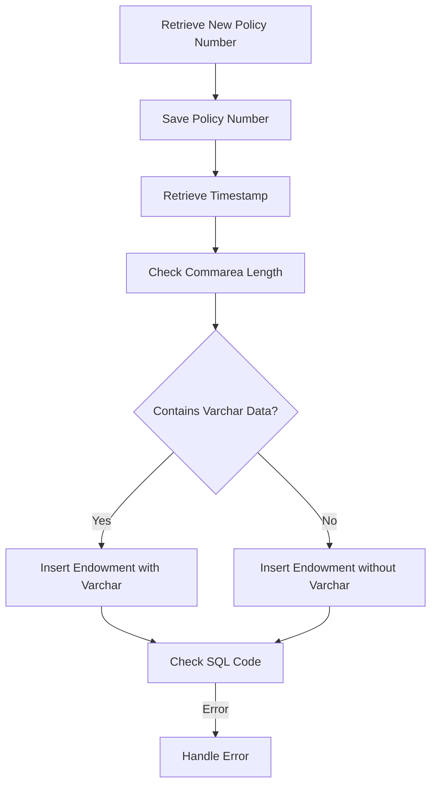

<SwmSnippet path="/base/src/lgapdb01.cbl" line="308">

---

## Retrieve New Policy Number

First, we retrieve the new policy number generated by the database using the <SwmToken path="base/src/lgapdb01.cbl" pos="309:12:14" line-data="             SET :DB2-POLICYNUM-INT = IDENTITY_VAL_LOCAL()">`IDENTITY_VAL_LOCAL()`</SwmToken> function. This value is stored in <SwmToken path="base/src/lgapdb01.cbl" pos="309:4:8" line-data="             SET :DB2-POLICYNUM-INT = IDENTITY_VAL_LOCAL()">`DB2-POLICYNUM-INT`</SwmToken>.

```cobol
           EXEC SQL
             SET :DB2-POLICYNUM-INT = IDENTITY_VAL_LOCAL()
           END-EXEC
```

---

</SwmSnippet>

<SwmSnippet path="/base/src/lgapdb01.cbl" line="311">

---

## Save Policy Number

Next, we save the retrieved policy number into <SwmToken path="base/src/lgapdb01.cbl" pos="311:11:15" line-data="           MOVE DB2-POLICYNUM-INT TO CA-POLICY-NUM">`CA-POLICY-NUM`</SwmToken> and <SwmToken path="base/src/lgapdb01.cbl" pos="313:11:13" line-data="           MOVE CA-POLICY-NUM TO EM-POLNUM">`EM-POLNUM`</SwmToken> for further use and error messaging.

```cobol
           MOVE DB2-POLICYNUM-INT TO CA-POLICY-NUM
      *    and save in error msg field incase required
           MOVE CA-POLICY-NUM TO EM-POLNUM
```

---

</SwmSnippet>

<SwmSnippet path="/base/src/lgapdb01.cbl" line="316">

---

## Retrieve Timestamp

Then, we retrieve the timestamp of the last change for the new policy number from the <SwmToken path="base/src/lgapdb01.cbl" pos="319:3:3" line-data="               FROM POLICY">`POLICY`</SwmToken> table and store it in <SwmToken path="base/src/lgapdb01.cbl" pos="318:4:6" line-data="               INTO :CA-LASTCHANGED">`CA-LASTCHANGED`</SwmToken>.

```cobol
           EXEC SQL
             SELECT LASTCHANGED
               INTO :CA-LASTCHANGED
               FROM POLICY
               WHERE POLICYNUMBER = :DB2-POLICYNUM-INT
           END-EXEC.
```

---

</SwmSnippet>

<SwmSnippet path="/base/src/lgapdb01.cbl" line="339">

---

## Check Commarea Length

Moving to the next step, we calculate the length of the commarea data to determine if it contains data for a varchar field.

```cobol
           SUBTRACT WS-REQUIRED-CA-LEN FROM EIBCALEN
               GIVING WS-VARY-LEN
```

---

</SwmSnippet>

<SwmSnippet path="/base/src/lgapdb01.cbl" line="342">

---

## Insert Endowment with Varchar

If the commarea contains varchar data, we move the padding data to <SwmToken path="base/src/lgapdb01.cbl" pos="345:3:7" line-data="                  TO WS-VARY-CHAR(1:WS-VARY-LEN)">`WS-VARY-CHAR`</SwmToken> and insert the new endowment policy into the <SwmToken path="base/src/lgapdb01.cbl" pos="347:5:5" line-data="                INSERT INTO ENDOWMENT">`ENDOWMENT`</SwmToken> table, including the varchar field.

```cobol
           IF WS-VARY-LEN IS GREATER THAN ZERO
      *       Commarea contains data for Varchar field
              MOVE CA-E-PADDING-DATA
                  TO WS-VARY-CHAR(1:WS-VARY-LEN)
              EXEC SQL
                INSERT INTO ENDOWMENT
                          ( POLICYNUMBER,
                            WITHPROFITS,
                            EQUITIES,
                            MANAGEDFUND,
                            FUNDNAME,
                            TERM,
                            SUMASSURED,
                            LIFEASSURED,
                            PADDINGDATA    )
                   VALUES ( :DB2-POLICYNUM-INT,
                            :CA-E-WITH-PROFITS,
                            :CA-E-EQUITIES,
                            :CA-E-MANAGED-FUND,
                            :CA-E-FUND-NAME,
                            :DB2-E-TERM-SINT,
```

---

</SwmSnippet>

<SwmSnippet path="/base/src/lgapdb01.cbl" line="368">

---

## Insert Endowment without Varchar

If the commarea does not contain varchar data, we insert the new endowment policy into the <SwmToken path="base/src/lgapdb01.cbl" pos="369:5:5" line-data="                INSERT INTO ENDOWMENT">`ENDOWMENT`</SwmToken> table without the varchar field.

```cobol
              EXEC SQL
                INSERT INTO ENDOWMENT
                          ( POLICYNUMBER,
                            WITHPROFITS,
                            EQUITIES,
                            MANAGEDFUND,
                            FUNDNAME,
                            TERM,
                            SUMASSURED,
                            LIFEASSURED    )
                   VALUES ( :DB2-POLICYNUM-INT,
                            :CA-E-WITH-PROFITS,
                            :CA-E-EQUITIES,
                            :CA-E-MANAGED-FUND,
                            :CA-E-FUND-NAME,
                            :DB2-E-TERM-SINT,
                            :DB2-E-SUMASSURED-INT,
                            :CA-E-LIFE-ASSURED )
              END-EXEC
```

---

</SwmSnippet>

<SwmSnippet path="/base/src/lgapdb01.cbl" line="389">

---

## Check SQL Code

Finally, we check the SQL code to ensure the insert operation was successful. If there is an error, we handle it by setting the return code, writing an error message, and issuing an abend to back out the update.

```cobol
           IF SQLCODE NOT EQUAL 0
             MOVE '90' TO CA-RETURN-CODE
             PERFORM WRITE-ERROR-MESSAGE
      *      Issue Abend to cause backout of update to Policy table
             EXEC CICS ABEND ABCODE('LGSQ') NODUMP END-EXEC
             EXEC CICS RETURN END-EXEC
           END-IF.
```

---

</SwmSnippet>

# <SwmToken path="base/src/lgapdb01.cbl" pos="229:3:5" line-data="               PERFORM INSERT-HOUSE">`INSERT-HOUSE`</SwmToken>

This is the next section of the flow.

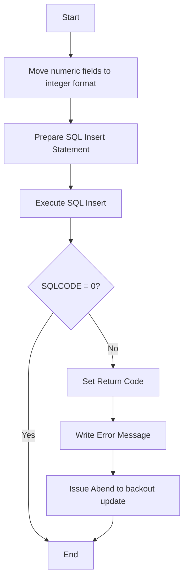

<SwmSnippet path="/base/src/lgapdb01.cbl" line="405">

---

## Moving Numeric Fields to Integer Format

First, the numeric fields <SwmToken path="base/src/lgapdb01.cbl" pos="405:3:7" line-data="           MOVE CA-H-VALUE       TO DB2-H-VALUE-INT">`CA-H-VALUE`</SwmToken> and <SwmToken path="base/src/lgapdb01.cbl" pos="406:3:7" line-data="           MOVE CA-H-BEDROOMS    TO DB2-H-BEDROOMS-SINT">`CA-H-BEDROOMS`</SwmToken> are moved to integer format fields <SwmToken path="base/src/lgapdb01.cbl" pos="405:11:17" line-data="           MOVE CA-H-VALUE       TO DB2-H-VALUE-INT">`DB2-H-VALUE-INT`</SwmToken> and <SwmToken path="base/src/lgapdb01.cbl" pos="406:11:17" line-data="           MOVE CA-H-BEDROOMS    TO DB2-H-BEDROOMS-SINT">`DB2-H-BEDROOMS-SINT`</SwmToken> respectively. This step ensures that the data is in the correct format for the database insertion.

```cobol
           MOVE CA-H-VALUE       TO DB2-H-VALUE-INT
           MOVE CA-H-BEDROOMS    TO DB2-H-BEDROOMS-SINT
```

---

</SwmSnippet>

<SwmSnippet path="/base/src/lgapdb01.cbl" line="408">

---

## Preparing SQL Insert Statement

Next, the SQL insert statement is prepared by moving the string 'INSERT HOUSE' to <SwmToken path="base/src/lgapdb01.cbl" pos="408:13:15" line-data="           MOVE &#39; INSERT HOUSE &#39; TO EM-SQLREQ">`EM-SQLREQ`</SwmToken>. This step sets up the SQL request for execution.

```cobol
           MOVE ' INSERT HOUSE ' TO EM-SQLREQ
```

---

</SwmSnippet>

<SwmSnippet path="/base/src/lgapdb01.cbl" line="409">

---

## Executing SQL Insert

Then, the SQL insert statement is executed to insert the house policy information into the <SwmToken path="base/src/lgapdb01.cbl" pos="410:5:5" line-data="             INSERT INTO HOUSE">`HOUSE`</SwmToken> table. The values for the columns are taken from the respective fields in the commarea and integer format fields.

```cobol
           EXEC SQL
             INSERT INTO HOUSE
                       ( POLICYNUMBER,
                         PROPERTYTYPE,
                         BEDROOMS,
                         VALUE,
                         HOUSENAME,
                         HOUSENUMBER,
                         POSTCODE          )
                VALUES ( :DB2-POLICYNUM-INT,
                         :CA-H-PROPERTY-TYPE,
                         :DB2-H-BEDROOMS-SINT,
                         :DB2-H-VALUE-INT,
                         :CA-H-HOUSE-NAME,
                         :CA-H-HOUSE-NUMBER,
                         :CA-H-POSTCODE      )
           END-EXEC
```

---

</SwmSnippet>

<SwmSnippet path="/base/src/lgapdb01.cbl" line="427">

---

## Handling SQL Execution Result

If the SQL execution does not return a code of 0, indicating an error, the return code <SwmToken path="base/src/lgapdb01.cbl" pos="428:9:13" line-data="             MOVE &#39;90&#39; TO CA-RETURN-CODE">`CA-RETURN-CODE`</SwmToken> is set to '90', and the <SwmToken path="base/src/lgapdb01.cbl" pos="429:3:7" line-data="             PERFORM WRITE-ERROR-MESSAGE">`WRITE-ERROR-MESSAGE`</SwmToken> routine is performed. An abend is then issued to back out the update to the <SwmToken path="base/src/lgapdb01.cbl" pos="430:19:19" line-data="      *      Issue Abend to cause backout of update to Policy table">`Policy`</SwmToken> table, and the transaction is returned.

```cobol
           IF SQLCODE NOT EQUAL 0
             MOVE '90' TO CA-RETURN-CODE
             PERFORM WRITE-ERROR-MESSAGE
      *      Issue Abend to cause backout of update to Policy table
             EXEC CICS ABEND ABCODE('LGSQ') NODUMP END-EXEC
             EXEC CICS RETURN END-EXEC
           END-IF.
```

---

</SwmSnippet>

# <SwmToken path="base/src/lgapdb01.cbl" pos="232:3:5" line-data="               PERFORM INSERT-MOTOR">`INSERT-MOTOR`</SwmToken>

This is the next section of the flow.

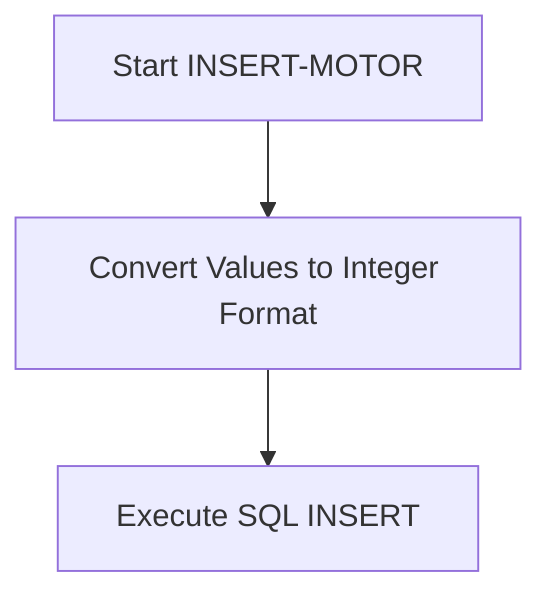

<SwmSnippet path="/base/src/lgapdb01.cbl" line="440">

---

## Start <SwmToken path="base/src/lgapdb01.cbl" pos="440:1:3" line-data="       INSERT-MOTOR.">`INSERT-MOTOR`</SwmToken>

The <SwmToken path="base/src/lgapdb01.cbl" pos="440:1:3" line-data="       INSERT-MOTOR.">`INSERT-MOTOR`</SwmToken> section begins the process of inserting motor policy information into the database. This is the entry point for handling the insertion of motor policy data.

```cobol
       INSERT-MOTOR.

```

---

</SwmSnippet>

<SwmSnippet path="/base/src/lgapdb01.cbl" line="443">

---

## Convert Values to Integer Format

First, the numeric fields from the communication area (<SwmToken path="base/src/lgapdb01.cbl" pos="443:3:7" line-data="           MOVE CA-M-VALUE       TO DB2-M-VALUE-INT">`CA-M-VALUE`</SwmToken>, <SwmToken path="base/src/lgapdb01.cbl" pos="444:3:7" line-data="           MOVE CA-M-CC          TO DB2-M-CC-SINT">`CA-M-CC`</SwmToken>, <SwmToken path="base/src/lgapdb01.cbl" pos="445:3:7" line-data="           MOVE CA-M-PREMIUM     TO DB2-M-PREMIUM-INT">`CA-M-PREMIUM`</SwmToken>) are converted to integer format (<SwmToken path="base/src/lgapdb01.cbl" pos="443:11:17" line-data="           MOVE CA-M-VALUE       TO DB2-M-VALUE-INT">`DB2-M-VALUE-INT`</SwmToken>, <SwmToken path="base/src/lgapdb01.cbl" pos="444:11:17" line-data="           MOVE CA-M-CC          TO DB2-M-CC-SINT">`DB2-M-CC-SINT`</SwmToken>, <SwmToken path="base/src/lgapdb01.cbl" pos="445:11:17" line-data="           MOVE CA-M-PREMIUM     TO DB2-M-PREMIUM-INT">`DB2-M-PREMIUM-INT`</SwmToken>). This conversion is necessary to ensure that the data is in the correct format for insertion into the database.

```cobol
           MOVE CA-M-VALUE       TO DB2-M-VALUE-INT
           MOVE CA-M-CC          TO DB2-M-CC-SINT
           MOVE CA-M-PREMIUM     TO DB2-M-PREMIUM-INT
```

---

</SwmSnippet>

<SwmSnippet path="/base/src/lgapdb01.cbl" line="347">

---

## Execute SQL INSERT

Next, the SQL <SwmToken path="base/src/lgapdb01.cbl" pos="347:1:1" line-data="                INSERT INTO ENDOWMENT">`INSERT`</SwmToken> statement is executed to insert the motor policy data into the database. The values are inserted into the appropriate columns of the <SwmToken path="base/src/lgapdb01.cbl" pos="195:7:7" line-data="               ADD WS-FULL-MOTOR-LEN TO WS-REQUIRED-CA-LEN">`MOTOR`</SwmToken> table. If the communication area contains data for a Varchar field, it is handled accordingly.

```cobol
                INSERT INTO ENDOWMENT
                          ( POLICYNUMBER,
                            WITHPROFITS,
                            EQUITIES,
                            MANAGEDFUND,
                            FUNDNAME,
                            TERM,
                            SUMASSURED,
                            LIFEASSURED,
                            PADDINGDATA    )
                   VALUES ( :DB2-POLICYNUM-INT,
                            :CA-E-WITH-PROFITS,
                            :CA-E-EQUITIES,
                            :CA-E-MANAGED-FUND,
                            :CA-E-FUND-NAME,
                            :DB2-E-TERM-SINT,
                            :DB2-E-SUMASSURED-INT,
                            :CA-E-LIFE-ASSURED,
                            :WS-VARY-FIELD )
              END-EXEC
           ELSE
```

---

</SwmSnippet>

# <SwmToken path="base/src/lgapdb01.cbl" pos="235:3:5" line-data="               PERFORM INSERT-COMMERCIAL">`INSERT-COMMERCIAL`</SwmToken>

This is the next section of the flow.

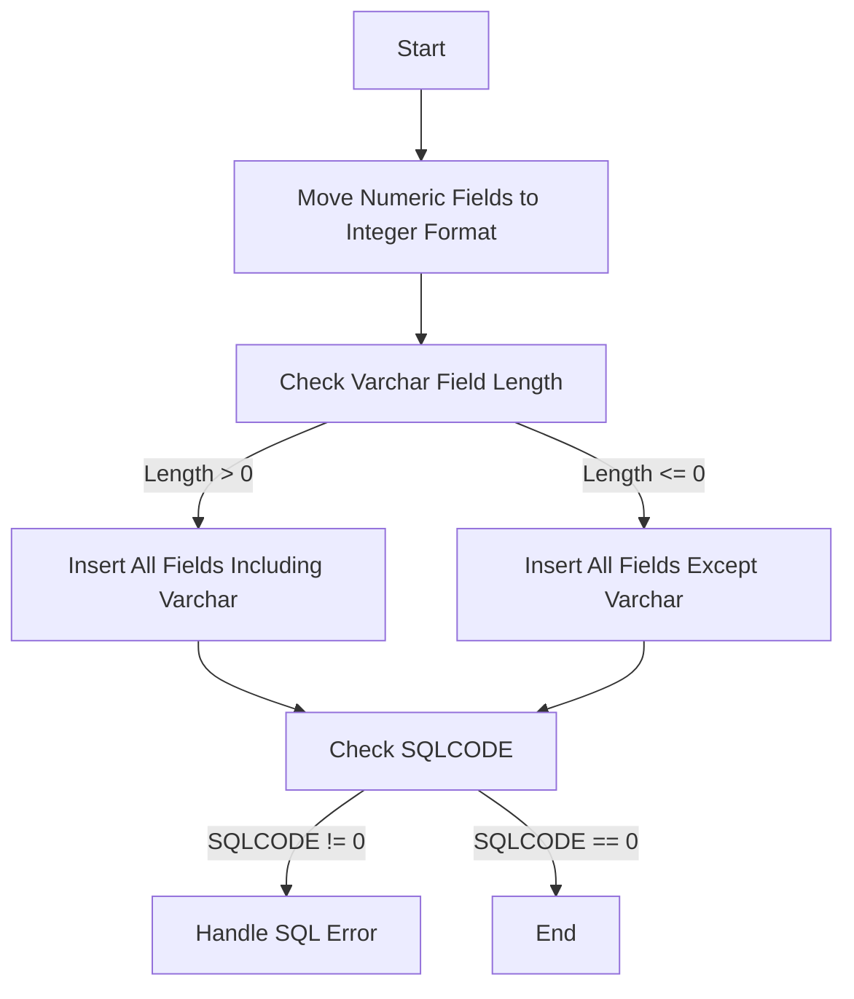

<SwmSnippet path="/base/src/lgapdb01.cbl" line="329">

---

## Moving Numeric Fields to Integer Format

First, the numeric fields <SwmToken path="base/src/lgapdb01.cbl" pos="330:3:7" line-data="           MOVE CA-E-TERM        TO DB2-E-TERM-SINT">`CA-E-TERM`</SwmToken> and <SwmToken path="base/src/lgapdb01.cbl" pos="331:3:9" line-data="           MOVE CA-E-SUM-ASSURED TO DB2-E-SUMASSURED-INT">`CA-E-SUM-ASSURED`</SwmToken> are moved to integer format fields <SwmToken path="base/src/lgapdb01.cbl" pos="330:11:17" line-data="           MOVE CA-E-TERM        TO DB2-E-TERM-SINT">`DB2-E-TERM-SINT`</SwmToken> and <SwmToken path="base/src/lgapdb01.cbl" pos="331:13:19" line-data="           MOVE CA-E-SUM-ASSURED TO DB2-E-SUMASSURED-INT">`DB2-E-SUMASSURED-INT`</SwmToken> respectively. This step ensures that the data is in the correct format for database insertion.

```cobol
      *    Move numeric fields to integer format
           MOVE CA-E-TERM        TO DB2-E-TERM-SINT
           MOVE CA-E-SUM-ASSURED TO DB2-E-SUMASSURED-INT
```

---

</SwmSnippet>

<SwmSnippet path="/base/src/lgapdb01.cbl" line="339">

---

## Check Varchar Field Length

Next, the length of the Varchar field is checked by subtracting the required length from <SwmToken path="base/src/lgapdb01.cbl" pos="339:13:13" line-data="           SUBTRACT WS-REQUIRED-CA-LEN FROM EIBCALEN">`EIBCALEN`</SwmToken> and storing the result in <SwmToken path="base/src/lgapdb01.cbl" pos="340:3:7" line-data="               GIVING WS-VARY-LEN">`WS-VARY-LEN`</SwmToken>. If <SwmToken path="base/src/lgapdb01.cbl" pos="340:3:7" line-data="               GIVING WS-VARY-LEN">`WS-VARY-LEN`</SwmToken> is greater than zero, it indicates that the Commarea contains data for the Varchar field.

```cobol
           SUBTRACT WS-REQUIRED-CA-LEN FROM EIBCALEN
               GIVING WS-VARY-LEN

           IF WS-VARY-LEN IS GREATER THAN ZERO
```

---

</SwmSnippet>

<SwmSnippet path="/base/src/lgapdb01.cbl" line="343">

---

## Insert All Fields Including Varchar

If the Varchar field length is greater than zero, the data for the Varchar field is moved to <SwmToken path="base/src/lgapdb01.cbl" pos="345:3:7" line-data="                  TO WS-VARY-CHAR(1:WS-VARY-LEN)">`WS-VARY-CHAR`</SwmToken>. Then, an SQL <SwmToken path="base/src/lgapdb01.cbl" pos="347:1:1" line-data="                INSERT INTO ENDOWMENT">`INSERT`</SwmToken> statement is executed to insert all fields, including the Varchar field, into the <SwmToken path="base/src/lgapdb01.cbl" pos="347:5:5" line-data="                INSERT INTO ENDOWMENT">`ENDOWMENT`</SwmToken> table.

```cobol
      *       Commarea contains data for Varchar field
              MOVE CA-E-PADDING-DATA
                  TO WS-VARY-CHAR(1:WS-VARY-LEN)
              EXEC SQL
                INSERT INTO ENDOWMENT
                          ( POLICYNUMBER,
                            WITHPROFITS,
                            EQUITIES,
                            MANAGEDFUND,
                            FUNDNAME,
                            TERM,
                            SUMASSURED,
                            LIFEASSURED,
                            PADDINGDATA    )
                   VALUES ( :DB2-POLICYNUM-INT,
                            :CA-E-WITH-PROFITS,
                            :CA-E-EQUITIES,
                            :CA-E-MANAGED-FUND,
                            :CA-E-FUND-NAME,
                            :DB2-E-TERM-SINT,
                            :DB2-E-SUMASSURED-INT,
```

---

</SwmSnippet>

<SwmSnippet path="/base/src/lgapdb01.cbl" line="367">

---

## Insert All Fields Except Varchar

If the Varchar field length is not greater than zero, an SQL <SwmToken path="base/src/lgapdb01.cbl" pos="369:1:1" line-data="                INSERT INTO ENDOWMENT">`INSERT`</SwmToken> statement is executed to insert all fields except the Varchar field into the <SwmToken path="base/src/lgapdb01.cbl" pos="369:5:5" line-data="                INSERT INTO ENDOWMENT">`ENDOWMENT`</SwmToken> table.

```cobol
           ELSE
              EXEC SQL
                INSERT INTO ENDOWMENT
                          ( POLICYNUMBER,
                            WITHPROFITS,
                            EQUITIES,
                            MANAGEDFUND,
                            FUNDNAME,
                            TERM,
                            SUMASSURED,
                            LIFEASSURED    )
                   VALUES ( :DB2-POLICYNUM-INT,
                            :CA-E-WITH-PROFITS,
                            :CA-E-EQUITIES,
                            :CA-E-MANAGED-FUND,
                            :CA-E-FUND-NAME,
                            :DB2-E-TERM-SINT,
                            :DB2-E-SUMASSURED-INT,
                            :CA-E-LIFE-ASSURED )
              END-EXEC
```

---

</SwmSnippet>

<SwmSnippet path="/base/src/lgapdb01.cbl" line="389">

---

## Check SQLCODE

After the <SwmToken path="base/src/lgapdb01.cbl" pos="219:3:3" line-data="           PERFORM INSERT-POLICY">`INSERT`</SwmToken> operation, the <SwmToken path="base/src/lgapdb01.cbl" pos="389:3:3" line-data="           IF SQLCODE NOT EQUAL 0">`SQLCODE`</SwmToken> is checked. If <SwmToken path="base/src/lgapdb01.cbl" pos="389:3:3" line-data="           IF SQLCODE NOT EQUAL 0">`SQLCODE`</SwmToken> is not equal to zero, an error handling routine is performed, which includes setting the return code to '90', writing an error message, and issuing an abend to cause a backout of the update to the Policy table.

```cobol
           IF SQLCODE NOT EQUAL 0
             MOVE '90' TO CA-RETURN-CODE
             PERFORM WRITE-ERROR-MESSAGE
      *      Issue Abend to cause backout of update to Policy table
             EXEC CICS ABEND ABCODE('LGSQ') NODUMP END-EXEC
             EXEC CICS RETURN END-EXEC
           END-IF.
```

---

</SwmSnippet>

&nbsp;

*This is an auto-generated document by Swimm 🌊 and has not yet been verified by a human*

<SwmMeta version="3.0.0" repo-id="Z2l0aHViJTNBJTNBa3luZHJ5bC1jaWNzLWdlbmFwcCUzQSUzQVN3aW1tLURlbW8=" repo-name="kyndryl-cics-genapp"><sup>Powered by [Swimm](/)</sup></SwmMeta>
