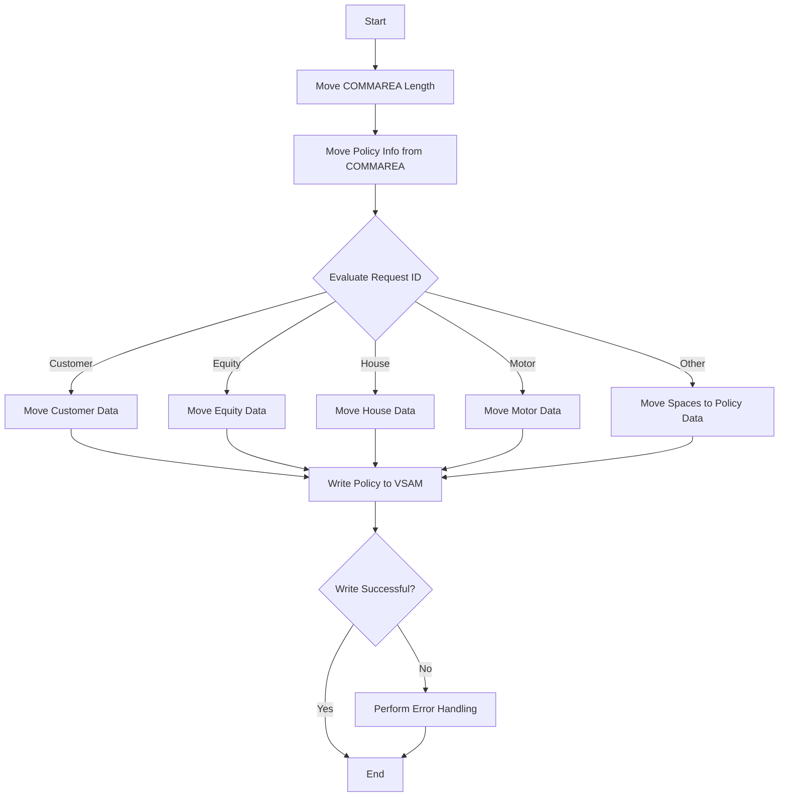

This document will cover the <SwmToken path="base/src/lgapvs01.cbl" pos="11:6:6" line-data="       PROGRAM-ID. LGAPVS01.">`LGAPVS01`</SwmToken> program. We'll cover:

1. What the Program Does
2. Program Flow
3. Program Sections

## What the Program Does

The <SwmToken path="base/src/lgapvs01.cbl" pos="11:6:6" line-data="       PROGRAM-ID. LGAPVS01.">`LGAPVS01`</SwmToken> program is designed to add policy information to a VSAM KSDS file. It reads policy data from the communication area (COMMAREA) and writes it to the VSAM file. The program handles different types of policies, such as customer, equity, house, and motor policies, based on the request ID provided in the COMMAREA.

## Program Flow

The program flow of <SwmToken path="base/src/lgapvs01.cbl" pos="11:6:6" line-data="       PROGRAM-ID. LGAPVS01.">`LGAPVS01`</SwmToken> involves several key steps:

1. Move the length of the COMMAREA to a working storage variable.
2. Move policy information from the COMMAREA to working storage variables based on the request ID.
3. Evaluate the request ID to determine the type of policy and move the corresponding data.
4. Write the policy information to the VSAM KSDS file.
5. If the write operation is not successful, perform error handling and return control to CICS.



<SwmSnippet path="/base/src/lgapvs01.cbl" line="94">

---

### MAINLINE SECTION

First, the program moves the length of the COMMAREA to a working storage variable and then moves policy information from the COMMAREA to working storage variables based on the request ID. It evaluates the request ID to determine the type of policy and moves the corresponding data.

```cobol
       MAINLINE SECTION.
      *
      *---------------------------------------------------------------*
           Move EIBCALEN To WS-Commarea-Len.
      *---------------------------------------------------------------*
           Move CA-Request-ID(4:1) To WF-Request-ID
           Move CA-Policy-Num      To WF-Policy-Num
           Move CA-Customer-Num    To WF-Customer-Num

           Evaluate WF-Request-ID

             When 'C'
               Move CA-B-Postcode  To WF-B-Postcode
               Move CA-B-Status    To WF-B-Status
               Move CA-B-Customer  To WF-B-Customer

             When 'E'
               Move CA-E-WITH-PROFITS To  WF-E-WITH-PROFITS
               Move CA-E-EQUITIES     To  WF-E-EQUITIES
               Move CA-E-MANAGED-FUND To  WF-E-MANAGED-FUND
               Move CA-E-FUND-NAME    To  WF-E-FUND-NAME
```

---

</SwmSnippet>

<SwmSnippet path="/base/src/lgapvs01.cbl" line="135">

---

### Write Policy to VSAM

Now, the program writes the policy information to the VSAM KSDS file. If the write operation is not successful, it moves the response code to a working storage variable, sets a return code, and performs error handling.

```cobol
           Exec CICS Write File('KSDSPOLY')
                     From(WF-Policy-Info)
                     Length(64)
                     Ridfld(WF-Policy-Key)
                     KeyLength(21)
                     RESP(WS-RESP)
           End-Exec.
           If WS-RESP Not = DFHRESP(NORMAL)
             Move EIBRESP2 To WS-RESP2
             MOVE '80' TO CA-RETURN-CODE
             PERFORM WRITE-ERROR-MESSAGE
             EXEC CICS RETURN END-EXEC
           End-If.
```

---

</SwmSnippet>

<SwmSnippet path="/base/src/lgapvs01.cbl" line="155">

---

### <SwmToken path="base/src/lgapvs01.cbl" pos="155:1:5" line-data="       WRITE-ERROR-MESSAGE.">`WRITE-ERROR-MESSAGE`</SwmToken>

Then, the program performs error handling by getting the current time and date, moving relevant information to the error message structure, and linking to another program (LGSTSQ) to handle the error message.

```cobol
       WRITE-ERROR-MESSAGE.
           EXEC CICS ASKTIME ABSTIME(WS-ABSTIME)
           END-EXEC
           EXEC CICS FORMATTIME ABSTIME(WS-ABSTIME)
                     MMDDYYYY(WS-DATE)
                     TIME(WS-TIME)
           END-EXEC
      *
           MOVE WS-DATE TO EM-DATE
           MOVE WS-TIME TO EM-TIME
           Move CA-Customer-Num To EM-Cusnum
           Move CA-Policy-Num   To EM-POLNUM 
           Move WS-RESP         To EM-RespRC
           Move WS-RESP2        To EM-Resp2RC
           EXEC CICS LINK PROGRAM('LGSTSQ')
                     COMMAREA(ERROR-MSG)
                     LENGTH(LENGTH OF ERROR-MSG)
           END-EXEC.
           IF EIBCALEN > 0 THEN
             IF EIBCALEN < 91 THEN
               MOVE DFHCOMMAREA(1:EIBCALEN) TO CA-DATA
```

---

</SwmSnippet>

&nbsp;

*This is an auto-generated document by Swimm 🌊 and has not yet been verified by a human*

<SwmMeta version="3.0.0" repo-id="Z2l0aHViJTNBJTNBa3luZHJ5bC1jaWNzLWdlbmFwcCUzQSUzQVN3aW1tLURlbW8=" repo-name="kyndryl-cics-genapp"><sup>Powered by [Swimm](/)</sup></SwmMeta>
