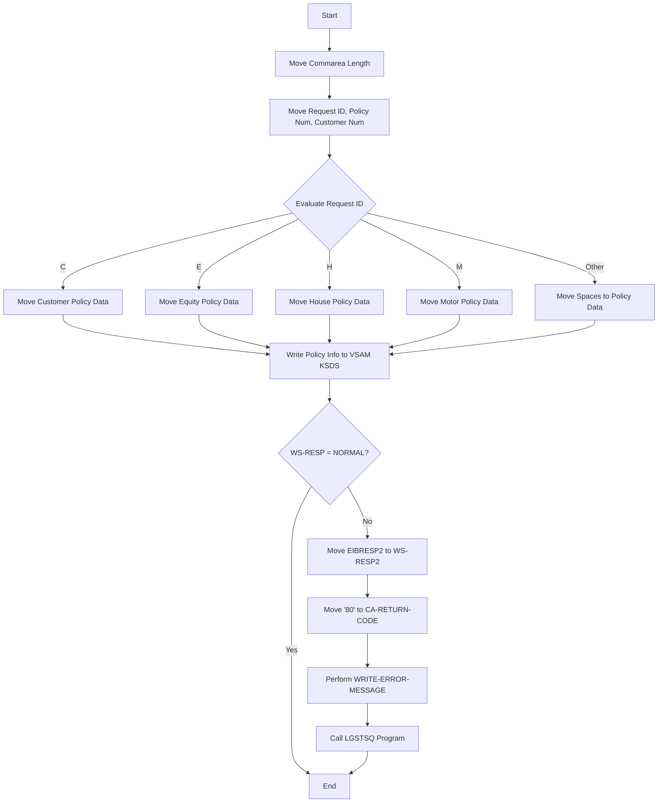

This document will cover the <SwmToken path="base/src/lgapvs01.cbl" pos="11:6:6" line-data="       PROGRAM-ID. LGAPVS01.">`LGAPVS01`</SwmToken> program. We'll cover:

1. What the Program Does
2. Program Flow
3. Program Sections

## What the Program Does

The <SwmToken path="base/src/lgapvs01.cbl" pos="11:6:6" line-data="       PROGRAM-ID. LGAPVS01.">`LGAPVS01`</SwmToken> program is designed to add a policy record to a VSAM KSDS file. It processes different types of policy data based on the request ID and writes the policy information to the file. The program handles various types of policies such as customer, equity, house, and motor policies.

## Program Flow

The program starts by moving the length of the communication area to a working storage variable. It then moves the request ID, policy number, and customer number from the communication area to working storage. Based on the request ID, it processes the corresponding policy data and moves it to the working storage. Finally, it writes the policy information to the VSAM KSDS file and handles any errors by calling the LGSTSQ program to log the error message.



<SwmSnippet path="/base/src/lgapvs01.cbl" line="91">

---

## Program Sections

First, the program moves the length of the communication area to a working storage variable <SwmToken path="base/src/lgapvs01.cbl" pos="97:7:11" line-data="           Move EIBCALEN To WS-Commarea-Len.">`WS-Commarea-Len`</SwmToken>.

```cobol
       PROCEDURE DIVISION.

      *---------------------------------------------------------------*
       MAINLINE SECTION.
      *
      *---------------------------------------------------------------*
           Move EIBCALEN To WS-Commarea-Len.
```

---

</SwmSnippet>

<SwmSnippet path="/base/src/lgapvs01.cbl" line="99">

---

Next, it moves the request ID, policy number, and customer number from the communication area to working storage variables <SwmToken path="base/src/lgapvs01.cbl" pos="99:16:20" line-data="           Move CA-Request-ID(4:1) To WF-Request-ID">`WF-Request-ID`</SwmToken>, <SwmToken path="base/src/lgapvs01.cbl" pos="100:11:15" line-data="           Move CA-Policy-Num      To WF-Policy-Num">`WF-Policy-Num`</SwmToken>, and <SwmToken path="base/src/lgapvs01.cbl" pos="101:11:15" line-data="           Move CA-Customer-Num    To WF-Customer-Num">`WF-Customer-Num`</SwmToken> respectively.

```cobol
           Move CA-Request-ID(4:1) To WF-Request-ID
           Move CA-Policy-Num      To WF-Policy-Num
           Move CA-Customer-Num    To WF-Customer-Num

```

---

</SwmSnippet>

<SwmSnippet path="/base/src/lgapvs01.cbl" line="103">

---

Then, based on the value of <SwmToken path="base/src/lgapvs01.cbl" pos="103:3:7" line-data="           Evaluate WF-Request-ID">`WF-Request-ID`</SwmToken>, it processes the corresponding policy data and moves it to the working storage. For example, if the request ID is 'C', it moves customer policy data from the communication area to working storage.

```cobol
           Evaluate WF-Request-ID

             When 'C'
               Move CA-B-Postcode  To WF-B-Postcode
               Move CA-B-Status    To WF-B-Status
               Move CA-B-Customer  To WF-B-Customer

             When 'E'
               Move CA-E-WITH-PROFITS To  WF-E-WITH-PROFITS
               Move CA-E-EQUITIES     To  WF-E-EQUITIES
               Move CA-E-MANAGED-FUND To  WF-E-MANAGED-FUND
               Move CA-E-FUND-NAME    To  WF-E-FUND-NAME
               Move CA-E-LIFE-ASSURED To  WF-E-LIFE-ASSURED

             When 'H'
               Move CA-H-PROPERTY-TYPE To  WF-H-PROPERTY-TYPE
               Move CA-H-BEDROOMS      To  WF-H-BEDROOMS
               Move CA-H-VALUE         To  WF-H-VALUE
               Move CA-H-POSTCODE      To  WF-H-POSTCODE
               Move CA-H-HOUSE-NAME    To  WF-H-HOUSE-NAME

```

---

</SwmSnippet>

<SwmSnippet path="/base/src/lgapvs01.cbl" line="135">

---

Going into the next step, the program writes the policy information from working storage to the VSAM KSDS file <SwmToken path="base/src/lgapvs01.cbl" pos="135:10:10" line-data="           Exec CICS Write File(&#39;KSDSPOLY&#39;)">`KSDSPOLY`</SwmToken>. If the write operation is not successful, it moves the response code to <SwmToken path="base/src/lgapvs01.cbl" pos="143:7:9" line-data="             Move EIBRESP2 To WS-RESP2">`WS-RESP2`</SwmToken>, sets the return code to '80', and performs the <SwmToken path="base/src/lgapvs01.cbl" pos="145:3:7" line-data="             PERFORM WRITE-ERROR-MESSAGE">`WRITE-ERROR-MESSAGE`</SwmToken> section.

```cobol
           Exec CICS Write File('KSDSPOLY')
                     From(WF-Policy-Info)
                     Length(64)
                     Ridfld(WF-Policy-Key)
                     KeyLength(21)
                     RESP(WS-RESP)
           End-Exec.
           If WS-RESP Not = DFHRESP(NORMAL)
             Move EIBRESP2 To WS-RESP2
             MOVE '80' TO CA-RETURN-CODE
             PERFORM WRITE-ERROR-MESSAGE
             EXEC CICS RETURN END-EXEC
           End-If.
```

---

</SwmSnippet>

<SwmSnippet path="/base/src/lgapvs01.cbl" line="155">

---

Finally, in the <SwmToken path="base/src/lgapvs01.cbl" pos="155:1:5" line-data="       WRITE-ERROR-MESSAGE.">`WRITE-ERROR-MESSAGE`</SwmToken> section, the program logs the error message by calling the <SwmToken path="base/src/lgapvs01.cbl" pos="169:10:10" line-data="           EXEC CICS LINK PROGRAM(&#39;LGSTSQ&#39;)">`LGSTSQ`</SwmToken> program. It formats the current date and time, moves relevant information to the error message structure, and calls <SwmToken path="base/src/lgapvs01.cbl" pos="169:10:10" line-data="           EXEC CICS LINK PROGRAM(&#39;LGSTSQ&#39;)">`LGSTSQ`</SwmToken> to log the error.

```cobol
       WRITE-ERROR-MESSAGE.
           EXEC CICS ASKTIME ABSTIME(WS-ABSTIME)
           END-EXEC
           EXEC CICS FORMATTIME ABSTIME(WS-ABSTIME)
                     MMDDYYYY(WS-DATE)
                     TIME(WS-TIME)
           END-EXEC
      *
           MOVE WS-DATE TO EM-DATE
           MOVE WS-TIME TO EM-TIME
           Move CA-Customer-Num To EM-Cusnum
           Move CA-Policy-Num   To EM-POLNUM 
           Move WS-RESP         To EM-RespRC
           Move WS-RESP2        To EM-Resp2RC
           EXEC CICS LINK PROGRAM('LGSTSQ')
                     COMMAREA(ERROR-MSG)
                     LENGTH(LENGTH OF ERROR-MSG)
           END-EXEC.
           IF EIBCALEN > 0 THEN
             IF EIBCALEN < 91 THEN
               MOVE DFHCOMMAREA(1:EIBCALEN) TO CA-DATA
```

---

</SwmSnippet>

&nbsp;

*This is an auto-generated document by Swimm 🌊 and has not yet been verified by a human*

<SwmMeta version="3.0.0" repo-id="Z2l0aHViJTNBJTNBa3luZHJ5bC1jaWNzLWdlbmFwcCUzQSUzQVN3aW1tLURlbW8=" repo-name="kyndryl-cics-genapp"><sup>Powered by [Swimm](/)</sup></SwmMeta>
