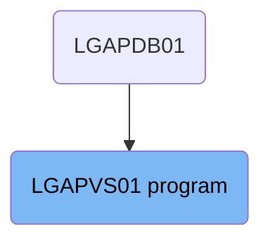
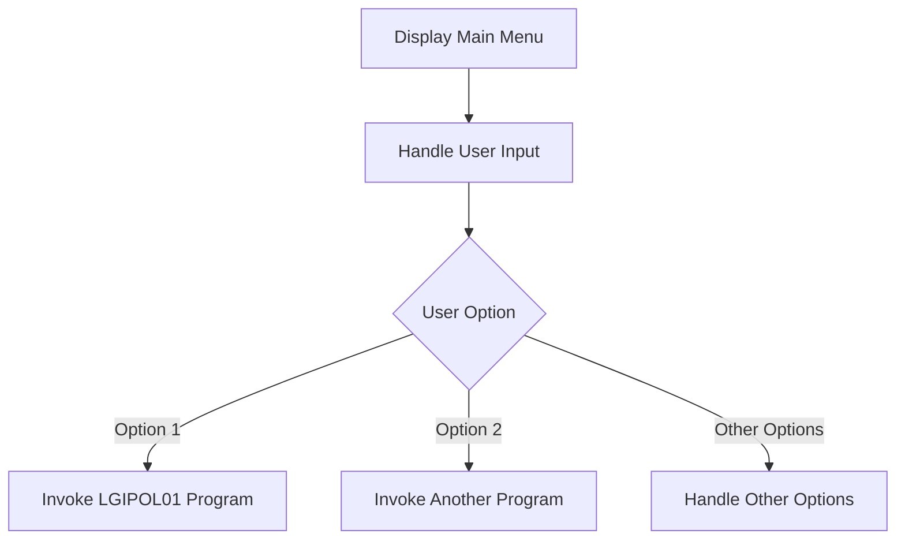

The <SwmToken path="base/src/lgapvs01.cbl" pos="11:6:6" line-data="       PROGRAM-ID. LGAPVS01.">`LGAPVS01`</SwmToken> program is responsible for displaying the main menu to the user and handling user input in the general insurance application. This is achieved by sending a map to the terminal, setting up handlers for different AID keys and conditions, receiving user input, and evaluating the user's option to determine the next action.

The <SwmToken path="base/src/lgapvs01.cbl" pos="11:6:6" line-data="       PROGRAM-ID. LGAPVS01.">`LGAPVS01`</SwmToken> program starts by displaying the main menu to the user. It then waits for the user to input their choice, sets up handlers for different keys and conditions, receives the user's input, and finally evaluates the user's option to decide the next step, such as invoking another program.

# Where is this program used?

This program is used once, in a flow starting from `LGAPDB01` as represented in the following diagram:



Lets' zoom into the flow:



<SwmSnippet path="/base/src/lgapvs01.cbl" line="196">

---

## Display Main Menu

First, the main menu is displayed to the user. This is done using the <SwmToken path="base/src/lgapvs01.cbl" pos="146:1:1" line-data="             EXEC CICS RETURN END-EXEC">`EXEC`</SwmToken>` `<SwmToken path="base/src/lgapvs01.cbl" pos="135:3:3" line-data="           Exec CICS Write File(&#39;KSDSPOLY&#39;)">`CICS`</SwmToken>` SEND MAP` command, which sends the map 'SSMAPP3' to the terminal.

```cobol

```

---

</SwmSnippet>

<SwmSnippet path="/base/src/lgapvs01.cbl" line="204">

---

## Handle User Input

Next, the program handles user input by setting up handlers for different AID keys and conditions using <SwmToken path="base/src/lgapvs01.cbl" pos="146:1:1" line-data="             EXEC CICS RETURN END-EXEC">`EXEC`</SwmToken>` `<SwmToken path="base/src/lgapvs01.cbl" pos="135:3:3" line-data="           Exec CICS Write File(&#39;KSDSPOLY&#39;)">`CICS`</SwmToken>` HANDLE AID` and <SwmToken path="base/src/lgapvs01.cbl" pos="146:1:1" line-data="             EXEC CICS RETURN END-EXEC">`EXEC`</SwmToken>` `<SwmToken path="base/src/lgapvs01.cbl" pos="135:3:3" line-data="           Exec CICS Write File(&#39;KSDSPOLY&#39;)">`CICS`</SwmToken>` HANDLE CONDITION` commands.

```cobol

```

---

</SwmSnippet>

<SwmSnippet path="/base/src/lgapvs01.cbl" line="212">

---

## Receive User Input

Then, the program receives the user input into the `SSMAPP3I` structure using the <SwmToken path="base/src/lgapvs01.cbl" pos="146:1:1" line-data="             EXEC CICS RETURN END-EXEC">`EXEC`</SwmToken>` `<SwmToken path="base/src/lgapvs01.cbl" pos="135:3:3" line-data="           Exec CICS Write File(&#39;KSDSPOLY&#39;)">`CICS`</SwmToken>` RECEIVE MAP` command.

```cobol

```

---

</SwmSnippet>

<SwmSnippet path="/base/src/lgapvs01.cbl" line="216">

---

## Evaluate User Option

Going into the evaluation of the user option, the program checks the value of `ENP3OPTO` to determine which action to take. For example, if the user selects option '1', the program prepares the necessary data and invokes the `LGIPOL01` program.

```cobol

```

---

</SwmSnippet>

&nbsp;

*This is an auto-generated document by Swimm 🌊 and has not yet been verified by a human*

<SwmMeta version="3.0.0" repo-id="Z2l0aHViJTNBJTNBa3luZHJ5bC1jaWNzLWdlbmFwcCUzQSUzQVN3aW1tLURlbW8=" repo-name="kyndryl-cics-genapp"><sup>Powered by [Swimm](https://app.swimm.io/)</sup></SwmMeta>
