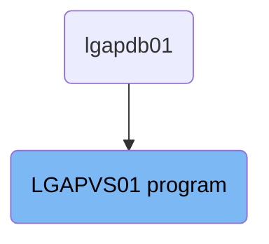
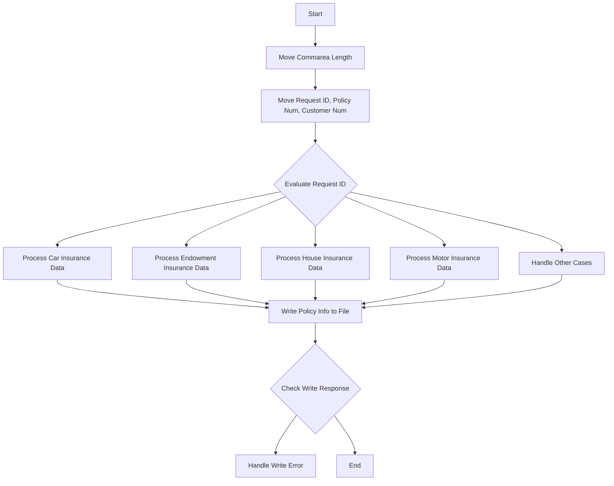

The <SwmToken path="base/src/lgapvs01.cbl" pos="11:6:6" line-data="       PROGRAM-ID. LGAPVS01.">`LGAPVS01`</SwmToken> program is responsible for processing various types of insurance policy data, including car, endowment, house, and motor insurance. The program achieves this by evaluating the request ID and moving the corresponding data to working storage fields, then writing the processed policy information to a file.

The <SwmToken path="base/src/lgapvs01.cbl" pos="11:6:6" line-data="       PROGRAM-ID. LGAPVS01.">`LGAPVS01`</SwmToken> program starts by moving the length of the communication area to a working storage variable. It then moves the request ID, policy number, and customer number to their respective fields. Based on the request ID, it processes the relevant insurance data and writes the policy information to a file. If there is an error during the write operation, it logs the error message.

# Where is this program used?

This program is used once, in a flow starting from `lgapdb01` as represented in the following diagram:



Lets' zoom into the flow:



<SwmSnippet path="/base/src/lgapvs01.cbl" line="97">

---

## Moving Commarea Length

First, the length of the communication area is moved to <SwmToken path="base/src/lgapvs01.cbl" pos="97:7:11" line-data="           Move EIBCALEN To WS-Commarea-Len.">`WS-Commarea-Len`</SwmToken>. This sets up the working storage variable for further processing.

```cobol
           Move EIBCALEN To WS-Commarea-Len.
```

---

</SwmSnippet>

<SwmSnippet path="/base/src/lgapvs01.cbl" line="99">

---

## Moving Request ID, Policy Number, and Customer Number

Next, the request ID, policy number, and customer number are moved to their respective working storage fields. This prepares the necessary data for evaluation.

```cobol
           Move CA-Request-ID(4:1) To WF-Request-ID
           Move CA-Policy-Num      To WF-Policy-Num
           Move CA-Customer-Num    To WF-Customer-Num
```

---

</SwmSnippet>

<SwmSnippet path="/base/src/lgapvs01.cbl" line="103">

---

## Evaluating Request ID

Then, the request ID is evaluated to determine the type of insurance policy data to process. Depending on the request ID, different sets of data are moved to the working storage fields.

```cobol
           Evaluate WF-Request-ID

             When 'C'
               Move CA-B-Postcode  To WF-B-Postcode
               Move CA-B-Status    To WF-B-Status
               Move CA-B-Customer  To WF-B-Customer

             When 'E'
               Move CA-E-WITH-PROFITS To  WF-E-WITH-PROFITS
               Move CA-E-EQUITIES     To  WF-E-EQUITIES
               Move CA-E-MANAGED-FUND To  WF-E-MANAGED-FUND
               Move CA-E-FUND-NAME    To  WF-E-FUND-NAME
               Move CA-E-LIFE-ASSURED To  WF-E-LIFE-ASSURED

             When 'H'
               Move CA-H-PROPERTY-TYPE To  WF-H-PROPERTY-TYPE
               Move CA-H-BEDROOMS      To  WF-H-BEDROOMS
               Move CA-H-VALUE         To  WF-H-VALUE
               Move CA-H-POSTCODE      To  WF-H-POSTCODE
               Move CA-H-HOUSE-NAME    To  WF-H-HOUSE-NAME

```

---

</SwmSnippet>

<SwmSnippet path="/base/src/lgapvs01.cbl" line="105">

---

### Processing Car Insurance Data

When the request ID is 'C', car insurance data such as postcode, status, and customer information are moved to the working storage fields.

```cobol
             When 'C'
               Move CA-B-Postcode  To WF-B-Postcode
               Move CA-B-Status    To WF-B-Status
               Move CA-B-Customer  To WF-B-Customer
```

---

</SwmSnippet>

<SwmSnippet path="/base/src/lgapvs01.cbl" line="110">

---

### Processing Endowment Insurance Data

When the request ID is 'E', endowment insurance data such as with-profits, equities, managed fund, fund name, and life assured are moved to the working storage fields.

```cobol
             When 'E'
               Move CA-E-WITH-PROFITS To  WF-E-WITH-PROFITS
               Move CA-E-EQUITIES     To  WF-E-EQUITIES
               Move CA-E-MANAGED-FUND To  WF-E-MANAGED-FUND
               Move CA-E-FUND-NAME    To  WF-E-FUND-NAME
               Move CA-E-LIFE-ASSURED To  WF-E-LIFE-ASSURED
```

---

</SwmSnippet>

<SwmSnippet path="/base/src/lgapvs01.cbl" line="117">

---

### Processing House Insurance Data

When the request ID is 'H', house insurance data such as property type, bedrooms, value, postcode, and house name are moved to the working storage fields.

```cobol
             When 'H'
               Move CA-H-PROPERTY-TYPE To  WF-H-PROPERTY-TYPE
               Move CA-H-BEDROOMS      To  WF-H-BEDROOMS
               Move CA-H-VALUE         To  WF-H-VALUE
               Move CA-H-POSTCODE      To  WF-H-POSTCODE
               Move CA-H-HOUSE-NAME    To  WF-H-HOUSE-NAME
```

---

</SwmSnippet>

<SwmSnippet path="/base/src/lgapvs01.cbl" line="124">

---

### Processing Motor Insurance Data

When the request ID is 'M', motor insurance data such as make, model, value, and registration number are moved to the working storage fields.

```cobol
             When 'M'
               Move CA-M-MAKE          To  WF-M-MAKE
               Move CA-M-MODEL         To  WF-M-MODEL
               Move CA-M-VALUE         To  WF-M-VALUE
               Move CA-M-REGNUMBER     To  WF-M-REGNUMBER
```

---

</SwmSnippet>

<SwmSnippet path="/base/src/lgapvs01.cbl" line="130">

---

### Handling Other Cases

For any other request ID, spaces are moved to the policy data field, indicating no specific data to process.

```cobol
             When Other
               Move Spaces To WF-Policy-Data
```

---

</SwmSnippet>

<SwmSnippet path="/base/src/lgapvs01.cbl" line="135">

---

## Writing Policy Info to File

The policy information is then written to the file 'KSDSPOLY'. This step ensures that the processed policy data is stored.

```cobol
           Exec CICS Write File('KSDSPOLY')
                     From(WF-Policy-Info)
                     Length(64)
                     Ridfld(WF-Policy-Key)
                     KeyLength(21)
                     RESP(WS-RESP)
           End-Exec.
```

---

</SwmSnippet>

<SwmSnippet path="/base/src/lgapvs01.cbl" line="142">

---

## Checking Write Response

The response of the write operation is checked. If the response is not normal, an error message is written, and the program returns control to the caller.

```cobol
           If WS-RESP Not = DFHRESP(NORMAL)
             Move EIBRESP2 To WS-RESP2
             MOVE '80' TO CA-RETURN-CODE
             PERFORM WRITE-ERROR-MESSAGE
             EXEC CICS RETURN END-EXEC
           End-If.
```

---

</SwmSnippet>

<SwmSnippet path="/base/src/lgapvs01.cbl" line="155">

---

## Handling Write Error

If there is an error during the write operation, the current date and time are obtained, and an error message is constructed and sent to the 'LGSTSQ' program for logging.

More about LGSTSQ: <SwmLink doc-title="Handling Messages (LGSTSQ)">[Handling Messages (LGSTSQ)](/.swm/handling-messages-lgstsq.o6o7rslw.sw.md)</SwmLink>

```cobol
       WRITE-ERROR-MESSAGE.
           EXEC CICS ASKTIME ABSTIME(WS-ABSTIME)
           END-EXEC
           EXEC CICS FORMATTIME ABSTIME(WS-ABSTIME)
                     MMDDYYYY(WS-DATE)
                     TIME(WS-TIME)
           END-EXEC
      *
           MOVE WS-DATE TO EM-DATE
           MOVE WS-TIME TO EM-TIME
           Move CA-Customer-Num To EM-Cusnum
           Move CA-Policy-Num   To EM-POLNUM 
           Move WS-RESP         To EM-RespRC
           Move WS-RESP2        To EM-Resp2RC
           EXEC CICS LINK PROGRAM('LGSTSQ')
                     COMMAREA(ERROR-MSG)
                     LENGTH(LENGTH OF ERROR-MSG)
           END-EXEC.
           IF EIBCALEN > 0 THEN
             IF EIBCALEN < 91 THEN
               MOVE DFHCOMMAREA(1:EIBCALEN) TO CA-DATA
```

---

</SwmSnippet>

&nbsp;

*This is an auto-generated document by Swimm 🌊 and has not yet been verified by a human*

<SwmMeta version="3.0.0" repo-id="Z2l0aHViJTNBJTNBa3luZHJ5bC1jaWNzLWdlbmFwcCUzQSUzQVN3aW1tLURlbW8=" repo-name="kyndryl-cics-genapp"><sup>Powered by [Swimm](/)</sup></SwmMeta>
