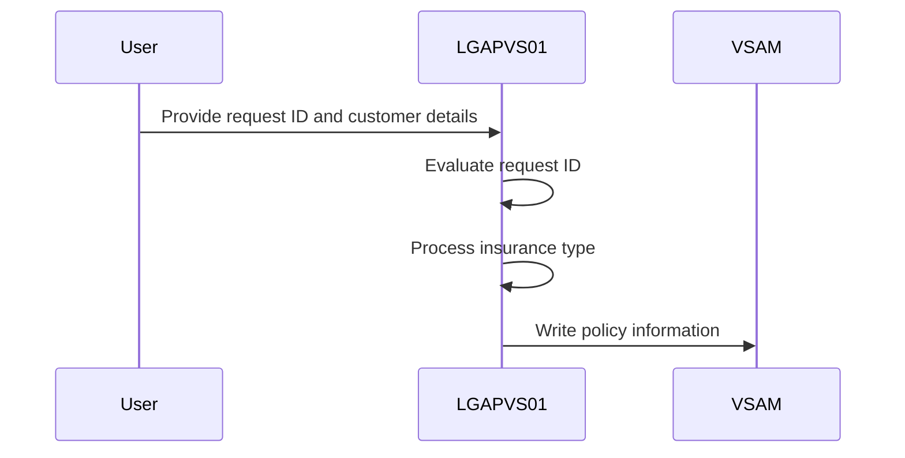
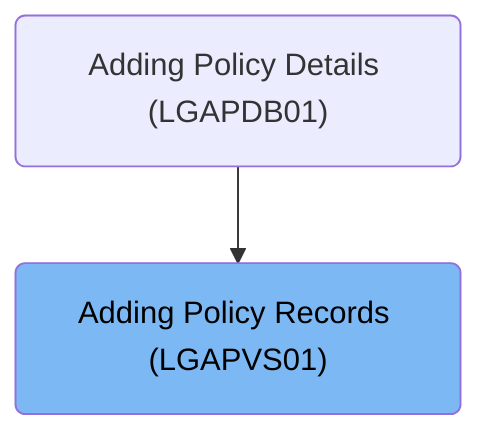
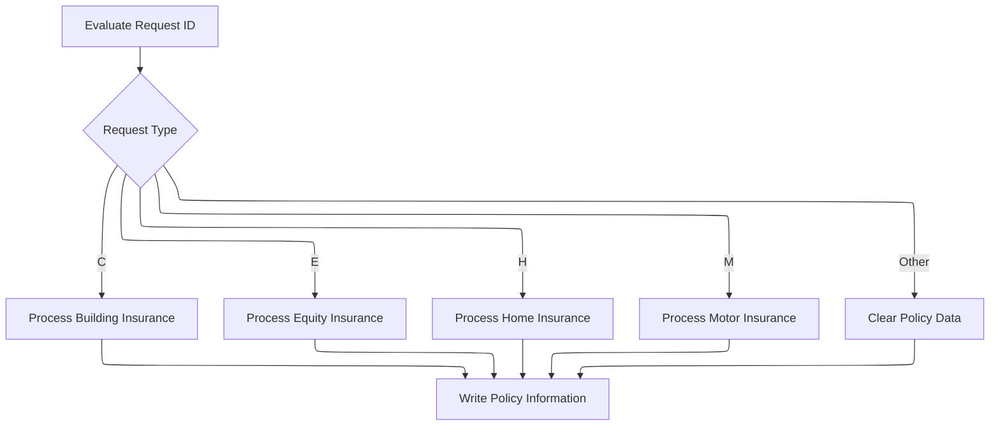

This document describes the process of adding policy records using the <SwmToken path="base/src/lgapvs01.cbl" pos="11:6:6" line-data="       PROGRAM-ID. LGAPVS01.">`LGAPVS01`</SwmToken> program. The program evaluates the request ID to determine the type of insurance policy to process and writes the policy information to the VSAM KSDS file.

For example, for a 'C' type request, the program processes building insurance details and writes the policy information to the VSAM KSDS file.

The main steps are:

- Evaluate request ID
- Process insurance type based on request ID
- Map relevant fields to working fields
- Write policy information to storage



## Dependencies

### Program

- LGSTSQ (<SwmPath>[base/src/lgstsq.cbl](base/src/lgstsq.cbl)</SwmPath>) - <SwmLink doc-title="Message Queue Handler (LGSTSQ)">[Message Queue Handler (LGSTSQ)](/.swm/message-queue-handler-lgstsq.e7y8uelv.sw.md)</SwmLink>

### Copybook

- LGCMAREA (<SwmPath>[base/src/lgcmarea.cpy](base/src/lgcmarea.cpy)</SwmPath>)

# Where is this program used?

This program is used once, as represented in the following diagram:



# Initiating Policy Data Processing



<SwmSnippet path="/base/src/lgapvs01.cbl" line="99">

---

In <SwmToken path="base/src/lgapvs01.cbl" pos="99:1:1" line-data="       MAINLINE SECTION.">`MAINLINE`</SwmToken>, we start the flow by moving initial values from the communication area to working fields. The <SwmToken path="base/src/lgapvs01.cbl" pos="104:16:20" line-data="           Move CA-Request-ID(4:1) To WF-Request-ID">`WF-Request-ID`</SwmToken> is evaluated to decide the type of policy data to process, acting like a switch-case to direct the flow based on its value.

```cobol
       MAINLINE SECTION.
      *
      *---------------------------------------------------------------*
           Move EIBCALEN To WS-Commarea-Len.
      *---------------------------------------------------------------*
           Move CA-Request-ID(4:1) To WF-Request-ID
           Move CA-Policy-Num      To WF-Policy-Num
           Move CA-Customer-Num    To WF-Customer-Num

           Evaluate WF-Request-ID
```

---

</SwmSnippet>

<SwmSnippet path="/base/src/lgapvs01.cbl" line="110">

---

For 'C' type requests, we map relevant fields to working fields to prepare for processing.

```cobol
             When 'C'
               Move CA-B-Postcode     To WF-B-Postcode
               Move CA-B-Status       To WF-B-Status
               Move CA-B-Customer     To WF-B-Customer
               Move WS-RISK-SCORE     To WF-B-Risk-Score
               Move CA-B-FirePremium  To WF-B-Fire-Premium
               Move CA-B-CrimePremium To WF-B-Crime-Premium
               Move CA-B-FloodPremium To WF-B-Flood-Premium
               Move CA-B-WeatherPremium To WF-B-Weather-Premium
```

---

</SwmSnippet>

<SwmSnippet path="/base/src/lgapvs01.cbl" line="120">

---

'E' type requests involve financial data, so we map these fields to working fields for processing.

```cobol
             When 'E'
               Move CA-E-WITH-PROFITS To  WF-E-WITH-PROFITS
               Move CA-E-EQUITIES     To  WF-E-EQUITIES
               Move CA-E-MANAGED-FUND To  WF-E-MANAGED-FUND
               Move CA-E-FUND-NAME    To  WF-E-FUND-NAME
               Move CA-E-LIFE-ASSURED To  WF-E-LIFE-ASSURED
```

---

</SwmSnippet>

<SwmSnippet path="/base/src/lgapvs01.cbl" line="127">

---

'H' type requests focus on property data, so we map these fields to working fields for processing.

```cobol
             When 'H'
               Move CA-H-PROPERTY-TYPE To  WF-H-PROPERTY-TYPE
               Move CA-H-BEDROOMS      To  WF-H-BEDROOMS
               Move CA-H-VALUE         To  WF-H-VALUE
               Move CA-H-POSTCODE      To  WF-H-POSTCODE
               Move CA-H-HOUSE-NAME    To  WF-H-HOUSE-NAME
```

---

</SwmSnippet>

<SwmSnippet path="/base/src/lgapvs01.cbl" line="134">

---

'M' type requests involve vehicle data, so we map these fields to working fields for processing.

```cobol
             When 'M'
               Move CA-M-MAKE          To  WF-M-MAKE
               Move CA-M-MODEL         To  WF-M-MODEL
               Move CA-M-VALUE         To  WF-M-VALUE
               Move CA-M-REGNUMBER     To  WF-M-REGNUMBER
```

---

</SwmSnippet>

<SwmSnippet path="/base/src/lgapvs01.cbl" line="140">

---

For unrecognized request IDs, we clear <SwmToken path="base/src/lgapvs01.cbl" pos="141:7:11" line-data="               Move Spaces To WF-Policy-Data">`WF-Policy-Data`</SwmToken> to prevent processing errors.

```cobol
             When Other
               Move Spaces To WF-Policy-Data
           End-Evaluate
```

---

</SwmSnippet>

<SwmSnippet path="/base/src/lgapvs01.cbl" line="145">

---

We write the processed policy data to 'KSDSPOLY' for persistent storage.

```cobol
           Exec CICS Write File('KSDSPOLY')
                     From(WF-Policy-Info)
                     Length(104)
                     Ridfld(WF-Policy-Key)
                     KeyLength(21)
                     RESP(WS-RESP)
           End-Exec.
```

---

</SwmSnippet>

&nbsp;

*This is an auto-generated document by Swimm 🌊 and has not yet been verified by a human*

<SwmMeta version="3.0.0" repo-id="Z2l0aHViJTNBJTNBa3luZHJ5bC1jaWNzLWdlbmFwcCUzQSUzQVN3aW1tLURlbW8=" repo-name="kyndryl-cics-genapp"><sup>Powered by [Swimm](/)</sup></SwmMeta>
