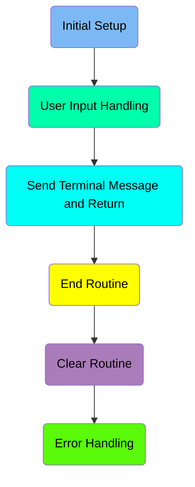
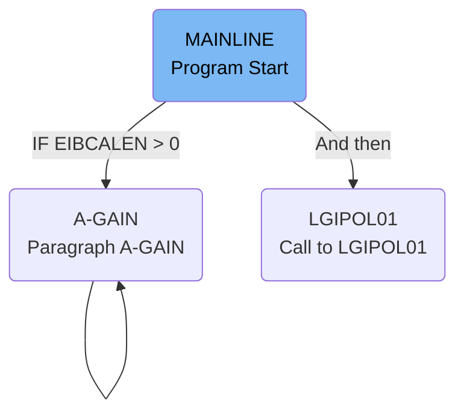
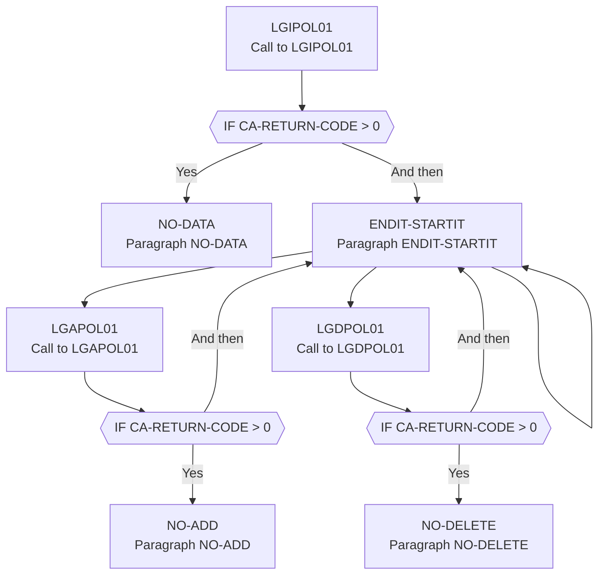
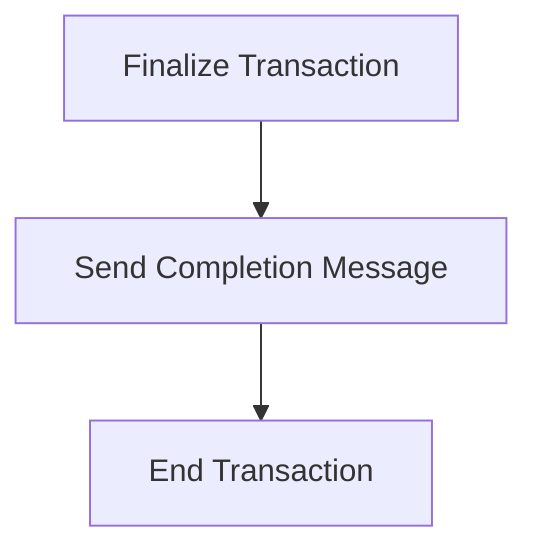
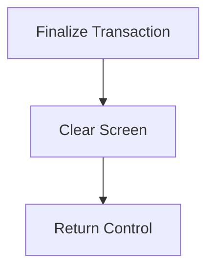
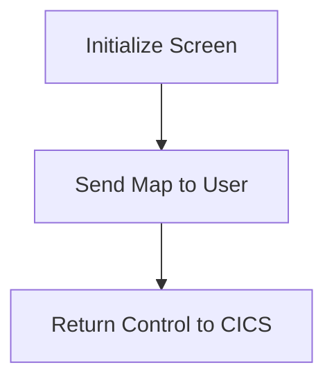
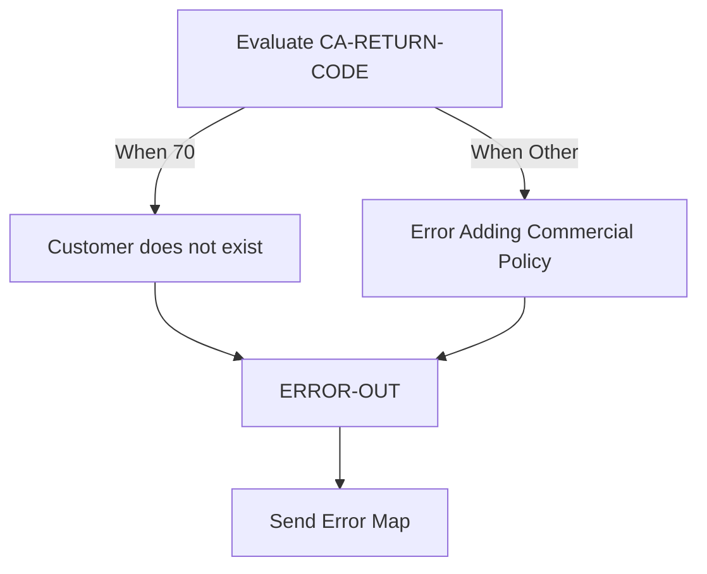

The <SwmToken path="base/src/lgtestp4.cbl" pos="11:6:6" line-data="       PROGRAM-ID. LGTESTP4.">`LGTESTP4`</SwmToken> program handles user interactions and processes insurance policy information in the IBM CICS Transaction Server for z/OS. It achieves this by initializing variables, handling user inputs, evaluating user options, and calling other programs like <SwmToken path="base/src/lgtestp4.cbl" pos="122:10:10" line-data="                 EXEC CICS LINK PROGRAM(&#39;LGIPOL01&#39;)">`LGIPOL01`</SwmToken> to fetch or manipulate policy data.

The <SwmToken path="base/src/lgtestp4.cbl" pos="11:6:6" line-data="       PROGRAM-ID. LGTESTP4.">`LGTESTP4`</SwmToken> program starts by initializing necessary variables and structures. It then handles user inputs by setting up handlers for different actions and receiving the user input into a map. Based on the user input, it evaluates the selected option and sets up the request ID and other relevant fields. The program then calls <SwmToken path="base/src/lgtestp4.cbl" pos="122:10:10" line-data="                 EXEC CICS LINK PROGRAM(&#39;LGIPOL01&#39;)">`LGIPOL01`</SwmToken> to process the insurance policy information. If data is returned, it is moved to the output fields and displayed to the user. The program also handles various error scenarios by setting appropriate error messages and sending them to the user interface.

Here is a high level diagram of the program:



# Initial Setup



<SwmSnippet path="/base/src/lgtestp4.cbl" line="32">

---

## Checking Communication Area Length

First, the program checks if the communication area length (<SwmToken path="base/src/lgtestp4.cbl" pos="32:3:3" line-data="           IF EIBCALEN &gt; 0">`EIBCALEN`</SwmToken>) is greater than 0. If it is, the program redirects to the <SwmToken path="base/src/lgtestp4.cbl" pos="33:5:7" line-data="              GO TO A-GAIN.">`A-GAIN`</SwmToken> paragraph.

```cobol
           IF EIBCALEN > 0
              GO TO A-GAIN.
```

---

</SwmSnippet>

<SwmSnippet path="/base/src/lgtestp4.cbl" line="35">

---

## Initializing Variables

Next, the program initializes several variables and structures such as <SwmToken path="base/src/lgtestp4.cbl" pos="35:3:3" line-data="           Initialize SSMAPP4I.">`SSMAPP4I`</SwmToken>, <SwmToken path="base/src/lgtestp4.cbl" pos="36:3:3" line-data="           Initialize SSMAPP4O.">`SSMAPP4O`</SwmToken>, and <SwmToken path="base/src/lgtestp4.cbl" pos="37:3:5" line-data="           Initialize COMM-AREA.">`COMM-AREA`</SwmToken>. It also sets various fields like <SwmToken path="base/src/lgtestp4.cbl" pos="38:9:9" line-data="           MOVE &#39;0000000000&#39;   To ENP4CNOO.">`ENP4CNOO`</SwmToken>, <SwmToken path="base/src/lgtestp4.cbl" pos="39:9:9" line-data="           MOVE &#39;0000000000&#39;   To ENP4PNOO.">`ENP4PNOO`</SwmToken>, and others to default values.

```cobol
           Initialize SSMAPP4I.
           Initialize SSMAPP4O.
           Initialize COMM-AREA.
           MOVE '0000000000'   To ENP4CNOO.
           MOVE '0000000000'   To ENP4PNOO.
           MOVE LOW-VALUES     To ENP4FPEO.
           MOVE LOW-VALUES     To ENP4FPRO.
           MOVE LOW-VALUES     To ENP4CPEO.
           MOVE LOW-VALUES     To ENP4CPRO.
           MOVE LOW-VALUES     To ENP4XPEO.
           MOVE LOW-VALUES     To ENP4XPRO.
           MOVE LOW-VALUES     To ENP4WPEO.
           MOVE LOW-VALUES     To ENP4WPRO.
           MOVE LOW-VALUES     To ENP4STAO.
```

---

</SwmSnippet>

<SwmSnippet path="/base/src/lgtestp4.cbl" line="57">

---

## Redirecting to <SwmToken path="base/src/lgtestp4.cbl" pos="57:1:3" line-data="       A-GAIN.">`A-GAIN`</SwmToken>

Moving to the <SwmToken path="base/src/lgtestp4.cbl" pos="57:1:3" line-data="       A-GAIN.">`A-GAIN`</SwmToken> paragraph, the program handles various conditions and user inputs. It sets up handlers for different AID keys and conditions, and then receives the map <SwmToken path="base/src/lgtestp4.cbl" pos="52:11:11" line-data="           EXEC CICS SEND MAP (&#39;SSMAPP4&#39;)">`SSMAPP4`</SwmToken> into <SwmToken path="base/src/lgtestp4.cbl" pos="35:3:3" line-data="           Initialize SSMAPP4I.">`SSMAPP4I`</SwmToken>.

```cobol
       A-GAIN.

           EXEC CICS HANDLE AID
                     CLEAR(CLEARIT)
                     PF3(ENDIT) END-EXEC.
           EXEC CICS HANDLE CONDITION
                     MAPFAIL(ENDIT)
                     END-EXEC.
```

---

</SwmSnippet>

# User Input Handling



<SwmSnippet path="/base/src/lgtestp4.cbl" line="52">

---

## Initializing the Map

First, the map <SwmToken path="base/src/lgtestp4.cbl" pos="52:11:11" line-data="           EXEC CICS SEND MAP (&#39;SSMAPP4&#39;)">`SSMAPP4`</SwmToken> is sent to the terminal to initialize the user interface. This prepares the screen for user input.

```cobol
           EXEC CICS SEND MAP ('SSMAPP4')
                     MAPSET ('SSMAP')
                     ERASE
                     END-EXEC.
```

---

</SwmSnippet>

<SwmSnippet path="/base/src/lgtestp4.cbl" line="57">

---

## Handling User Input

Next, the program handles user input by setting up handlers for different actions like clearing the screen or ending the session. It then receives the user input into the map <SwmToken path="base/src/lgtestp4.cbl" pos="67:3:3" line-data="                     INTO(SSMAPP4I)">`SSMAPP4I`</SwmToken>.

```cobol
       A-GAIN.

           EXEC CICS HANDLE AID
                     CLEAR(CLEARIT)
                     PF3(ENDIT) END-EXEC.
           EXEC CICS HANDLE CONDITION
                     MAPFAIL(ENDIT)
                     END-EXEC.

           EXEC CICS RECEIVE MAP('SSMAPP4')
                     INTO(SSMAPP4I)
                     MAPSET('SSMAP') END-EXEC.
```

---

</SwmSnippet>

<SwmSnippet path="/base/src/lgtestp4.cbl" line="71">

---

## Evaluating User Options

Then, the program evaluates the user option <SwmToken path="base/src/lgtestp4.cbl" pos="71:3:3" line-data="           EVALUATE ENP4OPTO">`ENP4OPTO`</SwmToken>. Depending on the option selected, it sets up the request ID and other relevant fields for further processing.

```cobol
           EVALUATE ENP4OPTO

             WHEN '1'
                 If (
                     ENP4CNOO Not = Spaces      AND
                     ENP4CNOO Not = Low-Values  AND
                     ENP4CNOO Not = 0           AND
                     ENP4CNOO Not = 0000000000
                                                   )
                                                    AND
                    (
                     ENP4PNOO Not = Spaces      AND
                     ENP4PNOO Not = Low-Values  AND
                     ENP4PNOO Not = 0           AND
                     ENP4PNOO Not = 0000000000
                                                   )
                        Move '01ICOM'   To CA-REQUEST-ID
                        Move ENP4CNOO   To CA-CUSTOMER-NUM
                        Move ENP4PNOO   To CA-POLICY-NUM
                 Else
                 If (
```

---

</SwmSnippet>

<SwmSnippet path="/base/src/lgtestp4.cbl" line="122">

---

## Calling <SwmToken path="base/src/lgtestp4.cbl" pos="122:10:10" line-data="                 EXEC CICS LINK PROGRAM(&#39;LGIPOL01&#39;)">`LGIPOL01`</SwmToken>

The program calls <SwmToken path="base/src/lgtestp4.cbl" pos="122:10:10" line-data="                 EXEC CICS LINK PROGRAM(&#39;LGIPOL01&#39;)">`LGIPOL01`</SwmToken> to process the insurance policy information. This is a critical step where the policy data is fetched or manipulated.

More about <SwmToken path="base/src/lgtestp4.cbl" pos="122:10:10" line-data="                 EXEC CICS LINK PROGRAM(&#39;LGIPOL01&#39;)">`LGIPOL01`</SwmToken>: <SwmLink doc-title="Inquiring Policy Details (LGIPOL01)">[Inquiring Policy Details (LGIPOL01)](/.swm/inquiring-policy-details-lgipol01.a4iime4v.sw.md)</SwmLink>

```cobol
                 EXEC CICS LINK PROGRAM('LGIPOL01')
                           COMMAREA(COMM-AREA)
                           LENGTH(32500)
                 END-EXEC
```

---

</SwmSnippet>

<SwmSnippet path="/base/src/lgtestp4.cbl" line="126">

---

## Handling No Data Scenario

If no data is returned from <SwmToken path="base/src/lgtestp4.cbl" pos="122:10:10" line-data="                 EXEC CICS LINK PROGRAM(&#39;LGIPOL01&#39;)">`LGIPOL01`</SwmToken>, the program goes to the <SwmToken path="base/src/lgtestp4.cbl" pos="127:5:7" line-data="                   GO TO NO-DATA">`NO-DATA`</SwmToken> paragraph to handle this scenario.

```cobol
                 IF CA-RETURN-CODE > 0
                   GO TO NO-DATA
                 END-IF
```

---

</SwmSnippet>

<SwmSnippet path="/base/src/lgtestp4.cbl" line="130">

---

## Moving Data to Output Fields

If data is returned, it is moved to the output fields to be displayed to the user. This includes policy number, customer number, issue date, expiry date, and other relevant details.

```cobol
                 Move CA-POLICY-NUM        To  ENP4PNOI
                 Move CA-CUSTOMER-NUM      To  ENP4CNOI
                 Move CA-ISSUE-DATE        To  ENP4IDAI
                 Move CA-EXPIRY-DATE       To  ENP4EDAI
                 Move CA-B-Address         To  ENP4ADDI
                 Move CA-B-Postcode        To  ENP4HPCI
                 Move CA-B-Latitude        To  ENP4LATI
                 Move CA-B-Longitude       To  ENP4LONI
                 Move CA-B-Customer        To  ENP4CUSI
                 Move CA-B-PropType        To  ENP4PTYI
                 Move CA-B-FirePeril       To  ENP4FPEI
                 Move CA-B-FirePremium     To  ENP4FPRI
                 Move CA-B-CrimePeril      To  ENP4CPEI
                 Move CA-B-CrimePremium    To  ENP4CPRI
                 Move CA-B-FloodPeril      To  ENP4XPEI
                 Move CA-B-FloodPremium    To  ENP4XPRI
                 Move CA-B-WeatherPeril    To  ENP4WPEI
                 Move CA-B-WeatherPremium  To  ENP4WPRI
                 Move CA-B-Status          To  ENP4STAI
                 Move CA-B-RejectReason    To  ENP4REJI
```

---

</SwmSnippet>

<SwmSnippet path="/base/src/lgtestp4.cbl" line="150">

---

## Sending the Map

The updated map <SwmToken path="base/src/lgtestp4.cbl" pos="150:11:11" line-data="                 EXEC CICS SEND MAP (&#39;SSMAPP4&#39;)">`SSMAPP4`</SwmToken> is sent back to the terminal to display the fetched or manipulated data to the user.

```cobol
                 EXEC CICS SEND MAP ('SSMAPP4')
                           FROM(SSMAPP4O)
                           MAPSET ('SSMAP')
                 END-EXEC
```

---

</SwmSnippet>

<SwmSnippet path="/base/src/lgtestp4.cbl" line="154">

---

## Reinitializing the Process

Finally, the program goes to <SwmToken path="base/src/lgtestp4.cbl" pos="154:5:7" line-data="                 GO TO ENDIT-STARTIT">`ENDIT-STARTIT`</SwmToken> to reinitialize the process and wait for the next user input.

```cobol
                 GO TO ENDIT-STARTIT

```

---

</SwmSnippet>

<SwmSnippet path="/base/src/lgtestp4.cbl" line="257">

---

## <SwmToken path="base/src/lgtestp4.cbl" pos="257:1:3" line-data="       ENDIT-STARTIT.">`ENDIT-STARTIT`</SwmToken>

The <SwmToken path="base/src/lgtestp4.cbl" pos="257:1:3" line-data="       ENDIT-STARTIT.">`ENDIT-STARTIT`</SwmToken> paragraph returns control to the CICS transaction, allowing the program to wait for the next user input.

```cobol
       ENDIT-STARTIT.
           EXEC CICS RETURN
                TRANSID('SSP4')
                COMMAREA(COMM-AREA)
                END-EXEC.
```

---

</SwmSnippet>

<SwmSnippet path="/base/src/lgtestp4.cbl" line="286">

---

## <SwmToken path="base/src/lgtestp4.cbl" pos="286:1:3" line-data="       NO-ADD.">`NO-ADD`</SwmToken>

The <SwmToken path="base/src/lgtestp4.cbl" pos="286:1:3" line-data="       NO-ADD.">`NO-ADD`</SwmToken> paragraph handles errors that occur when adding a new policy. It evaluates the return code and sets an appropriate error message.

```cobol
       NO-ADD.
           Evaluate CA-RETURN-CODE
             When 70
               Move 'Customer does not exist'        To  ERP4FLDO
               Go To ERROR-OUT
             When Other
               Move 'Error Adding Commercial Policy' To  ERP4FLDO
               Go To ERROR-OUT
           End-Evaluate.
```

---

</SwmSnippet>

<SwmSnippet path="/base/src/lgtestp4.cbl" line="304">

---

## <SwmToken path="base/src/lgtestp4.cbl" pos="304:1:3" line-data="       NO-DATA.">`NO-DATA`</SwmToken>

The <SwmToken path="base/src/lgtestp4.cbl" pos="304:1:3" line-data="       NO-DATA.">`NO-DATA`</SwmToken> paragraph sets an error message indicating that no data was returned from the policy lookup.

```cobol
       NO-DATA.
           Move 'No data was returned.'              To  ERP4FLDO
           Go To ERROR-OUT.
```

---

</SwmSnippet>

<SwmSnippet path="/base/src/lgtestp4.cbl" line="300">

---

## <SwmToken path="base/src/lgtestp4.cbl" pos="300:1:3" line-data="       NO-DELETE.">`NO-DELETE`</SwmToken>

The <SwmToken path="base/src/lgtestp4.cbl" pos="300:1:3" line-data="       NO-DELETE.">`NO-DELETE`</SwmToken> paragraph handles errors that occur when deleting a policy. It sets an appropriate error message.

```cobol
       NO-DELETE.
           Move 'Error Deleting Commercial Policy'   To  ERP4FLDO
           Go To ERROR-OUT.
```

---

</SwmSnippet>

# Send Terminal Message and Return

This is the next section of the flow.



<SwmSnippet path="/base/src/lgtestp4.cbl" line="254">

---

## Finalize Transaction

First, the transaction is finalized by executing the <SwmToken path="base/src/lgtestp4.cbl" pos="254:1:5" line-data="           EXEC CICS RETURN">`EXEC CICS RETURN`</SwmToken> command. This ensures that the transaction is properly closed and any resources are released.

```cobol
           EXEC CICS RETURN
           END-EXEC.

```

---

</SwmSnippet>

<SwmSnippet path="/base/src/lgtestp4.cbl" line="263">

---

## Send Completion Message

Next, the <SwmToken path="base/src/lgtestp4.cbl" pos="263:1:1" line-data="       ENDIT.">`ENDIT`</SwmToken> function is called to send a completion message to the user. This function uses the <SwmToken path="base/src/lgtestp4.cbl" pos="264:1:7" line-data="           EXEC CICS SEND TEXT">`EXEC CICS SEND TEXT`</SwmToken> command to display the message stored in <SwmToken path="base/src/lgtestp4.cbl" pos="265:3:3" line-data="                     FROM(MSGEND)">`MSGEND`</SwmToken> and then returns control to CICS.

```cobol
       ENDIT.
           EXEC CICS SEND TEXT
                     FROM(MSGEND)
                     LENGTH(LENGTH OF MSGEND)
                     ERASE
                     FREEKB
           END-EXEC
           EXEC CICS RETURN
           END-EXEC.
```

---

</SwmSnippet>

# End Routine



<SwmSnippet path="/base/src/lgtestp4.cbl" line="258">

---

## Finalize Transaction

First, the transaction is finalized by returning control to CICS with the <SwmToken path="base/src/lgtestp4.cbl" pos="258:1:5" line-data="           EXEC CICS RETURN">`EXEC CICS RETURN`</SwmToken> command. This ensures that the transaction identified by <SwmToken path="base/src/lgtestp4.cbl" pos="259:4:4" line-data="                TRANSID(&#39;SSP4&#39;)">`SSP4`</SwmToken> is properly concluded and the communication area (<SwmToken path="base/src/lgtestp4.cbl" pos="260:3:5" line-data="                COMMAREA(COMM-AREA)">`COMM-AREA`</SwmToken>) is passed back to CICS.

```cobol
           EXEC CICS RETURN
                TRANSID('SSP4')
                COMMAREA(COMM-AREA)
                END-EXEC.
```

---

</SwmSnippet>

<SwmSnippet path="/base/src/lgtestp4.cbl" line="263">

---

## Clear Screen

Next, the screen is cleared by sending a text message (<SwmToken path="base/src/lgtestp4.cbl" pos="265:3:3" line-data="                     FROM(MSGEND)">`MSGEND`</SwmToken>) to the terminal. The <SwmToken path="base/src/lgtestp4.cbl" pos="264:1:7" line-data="           EXEC CICS SEND TEXT">`EXEC CICS SEND TEXT`</SwmToken> command is used to send the message, specifying the length of the message and ensuring the screen is erased and the keyboard is freed.

```cobol
       ENDIT.
           EXEC CICS SEND TEXT
                     FROM(MSGEND)
                     LENGTH(LENGTH OF MSGEND)
                     ERASE
                     FREEKB
           END-EXEC
```

---

</SwmSnippet>

<SwmSnippet path="/base/src/lgtestp4.cbl" line="270">

---

## Return Control

Finally, control is returned to CICS again with another <SwmToken path="base/src/lgtestp4.cbl" pos="270:1:5" line-data="           EXEC CICS RETURN">`EXEC CICS RETURN`</SwmToken> command, ensuring that the transaction flow is properly concluded.

```cobol
           EXEC CICS RETURN
           END-EXEC.
```

---

</SwmSnippet>

<SwmSnippet path="/base/src/lgtestp4.cbl" line="273">

---

## Clear Screen Function

The <SwmToken path="base/src/lgtestp4.cbl" pos="273:1:1" line-data="       CLEARIT.">`CLEARIT`</SwmToken> function is called to initialize the screen map and send it to the terminal. This involves initializing the map (<SwmToken path="base/src/lgtestp4.cbl" pos="275:3:3" line-data="           Initialize SSMAPP4I.">`SSMAPP4I`</SwmToken>), sending the map (<SwmToken path="base/src/lgtestp4.cbl" pos="276:11:11" line-data="           EXEC CICS SEND MAP (&#39;SSMAPP4&#39;)">`SSMAPP4`</SwmToken>) with the <SwmToken path="base/src/lgtestp4.cbl" pos="276:1:7" line-data="           EXEC CICS SEND MAP (&#39;SSMAPP4&#39;)">`EXEC CICS SEND MAP`</SwmToken> command, and then returning control to CICS with the <SwmToken path="base/src/lgtestp4.cbl" pos="281:1:5" line-data="           EXEC CICS RETURN">`EXEC CICS RETURN`</SwmToken> command.

```cobol
       CLEARIT.

           Initialize SSMAPP4I.
           EXEC CICS SEND MAP ('SSMAPP4')
                     MAPSET ('SSMAP')
                     MAPONLY
           END-EXEC

           EXEC CICS RETURN
                TRANSID('SSP4')
                COMMAREA(COMM-AREA)
                END-EXEC.
```

---

</SwmSnippet>

# Clear Routine

This is the next section of the flow.



<SwmSnippet path="/base/src/lgtestp4.cbl" line="275">

---

## Initializing the Screen

First, the screen is initialized by calling <SwmToken path="base/src/lgtestp4.cbl" pos="275:1:3" line-data="           Initialize SSMAPP4I.">`Initialize SSMAPP4I`</SwmToken>. This sets up the necessary data structures and variables for the screen display.

```cobol
           Initialize SSMAPP4I.
```

---

</SwmSnippet>

<SwmSnippet path="/base/src/lgtestp4.cbl" line="276">

---

## Sending Map to User

Next, the map <SwmToken path="base/src/lgtestp4.cbl" pos="276:11:11" line-data="           EXEC CICS SEND MAP (&#39;SSMAPP4&#39;)">`SSMAPP4`</SwmToken> from the mapset <SwmToken path="base/src/lgtestp4.cbl" pos="277:5:5" line-data="                     MAPSET (&#39;SSMAP&#39;)">`SSMAP`</SwmToken> is sent to the user using the <SwmToken path="base/src/lgtestp4.cbl" pos="276:1:7" line-data="           EXEC CICS SEND MAP (&#39;SSMAPP4&#39;)">`EXEC CICS SEND MAP`</SwmToken> command. This displays the insurance policy information screen to the user.

```cobol
           EXEC CICS SEND MAP ('SSMAPP4')
                     MAPSET ('SSMAP')
                     MAPONLY
           END-EXEC
```

---

</SwmSnippet>

<SwmSnippet path="/base/src/lgtestp4.cbl" line="281">

---

## Returning Control to CICS

Then, control is returned to CICS with the <SwmToken path="base/src/lgtestp4.cbl" pos="281:1:5" line-data="           EXEC CICS RETURN">`EXEC CICS RETURN`</SwmToken> command. The transaction ID <SwmToken path="base/src/lgtestp4.cbl" pos="282:4:4" line-data="                TRANSID(&#39;SSP4&#39;)">`SSP4`</SwmToken> and the communication area <SwmToken path="base/src/lgtestp4.cbl" pos="283:3:5" line-data="                COMMAREA(COMM-AREA)">`COMM-AREA`</SwmToken> are specified to ensure that the correct transaction and data are used when the user interacts with the screen.

```cobol
           EXEC CICS RETURN
                TRANSID('SSP4')
                COMMAREA(COMM-AREA)
                END-EXEC.
```

---

</SwmSnippet>

## Interim Summary

So far, we saw how the program handles user input, evaluates user options, and processes insurance policy information. We also covered how the program sends the updated map back to the terminal and reinitializes the process for the next user input. Now, we will focus on error handling, where the program evaluates return codes and sets appropriate error messages.

# Error Handling



<SwmSnippet path="/base/src/lgtestp4.cbl" line="287">

---

## Evaluating <SwmToken path="base/src/lgtestp4.cbl" pos="287:3:7" line-data="           Evaluate CA-RETURN-CODE">`CA-RETURN-CODE`</SwmToken>

First, the code evaluates the <SwmToken path="base/src/lgtestp4.cbl" pos="287:3:7" line-data="           Evaluate CA-RETURN-CODE">`CA-RETURN-CODE`</SwmToken> to determine the type of error that occurred. If the code is 70, it indicates that the customer does not exist, and an appropriate error message is set. For any other code, a generic error message for adding a commercial policy is set.

```cobol
           Evaluate CA-RETURN-CODE
             When 70
               Move 'Customer does not exist'        To  ERP4FLDO
               Go To ERROR-OUT
             When Other
               Move 'Error Adding Commercial Policy' To  ERP4FLDO
               Go To ERROR-OUT
           End-Evaluate.
```

---

</SwmSnippet>

<SwmSnippet path="/base/src/lgtestp4.cbl" line="296">

---

## Handling <SwmToken path="base/src/lgtestp4.cbl" pos="296:1:3" line-data="       NO-UPD.">`NO-UPD`</SwmToken>

Next, the <SwmToken path="base/src/lgtestp4.cbl" pos="296:1:3" line-data="       NO-UPD.">`NO-UPD`</SwmToken> section handles errors related to updating a commercial policy. It sets an error message indicating the failure to update the policy and then directs the flow to the <SwmToken path="base/src/lgtestp4.cbl" pos="298:5:7" line-data="           Go To ERROR-OUT.">`ERROR-OUT`</SwmToken> section.

```cobol
       NO-UPD.
           Move 'Error Updating Commercial Policy'   To  ERP4FLDO
           Go To ERROR-OUT.
```

---

</SwmSnippet>

<SwmSnippet path="/base/src/lgtestp4.cbl" line="300">

---

## Handling <SwmToken path="base/src/lgtestp4.cbl" pos="300:1:3" line-data="       NO-DELETE.">`NO-DELETE`</SwmToken>

Then, the <SwmToken path="base/src/lgtestp4.cbl" pos="300:1:3" line-data="       NO-DELETE.">`NO-DELETE`</SwmToken> section manages errors related to deleting a commercial policy. It sets an error message indicating the failure to delete the policy and then directs the flow to the <SwmToken path="base/src/lgtestp4.cbl" pos="302:5:7" line-data="           Go To ERROR-OUT.">`ERROR-OUT`</SwmToken> section.

```cobol
       NO-DELETE.
           Move 'Error Deleting Commercial Policy'   To  ERP4FLDO
           Go To ERROR-OUT.
```

---

</SwmSnippet>

<SwmSnippet path="/base/src/lgtestp4.cbl" line="304">

---

## Handling <SwmToken path="base/src/lgtestp4.cbl" pos="304:1:3" line-data="       NO-DATA.">`NO-DATA`</SwmToken>

Moving to the <SwmToken path="base/src/lgtestp4.cbl" pos="304:1:3" line-data="       NO-DATA.">`NO-DATA`</SwmToken> section, it handles cases where no data was returned from a query. It sets an error message indicating the absence of data and then directs the flow to the <SwmToken path="base/src/lgtestp4.cbl" pos="306:5:7" line-data="           Go To ERROR-OUT.">`ERROR-OUT`</SwmToken> section.

```cobol
       NO-DATA.
           Move 'No data was returned.'              To  ERP4FLDO
           Go To ERROR-OUT.
```

---

</SwmSnippet>

<SwmSnippet path="/base/src/lgtestp4.cbl" line="308">

---

## <SwmToken path="base/src/lgtestp4.cbl" pos="308:1:3" line-data="       ERROR-OUT.">`ERROR-OUT`</SwmToken> Section

Finally, the <SwmToken path="base/src/lgtestp4.cbl" pos="308:1:3" line-data="       ERROR-OUT.">`ERROR-OUT`</SwmToken> section sends an error map to the user interface to display the error message. It initializes the necessary maps and communication area before ending the error handling process.

```cobol
       ERROR-OUT.
           EXEC CICS SEND MAP ('SSMAPP4')
                     FROM(SSMAPP4O)
                     MAPSET ('SSMAP')
           END-EXEC.

           Initialize SSMAPP4I.
           Initialize SSMAPP4O.
           Initialize COMM-AREA.
```

---

</SwmSnippet>

&nbsp;

*This is an auto-generated document by Swimm 🌊 and has not yet been verified by a human*

<SwmMeta version="3.0.0" repo-id="Z2l0aHViJTNBJTNBa3luZHJ5bC1jaWNzLWdlbmFwcCUzQSUzQVN3aW1tLURlbW8=" repo-name="kyndryl-cics-genapp"><sup>Powered by [Swimm](/)</sup></SwmMeta>
