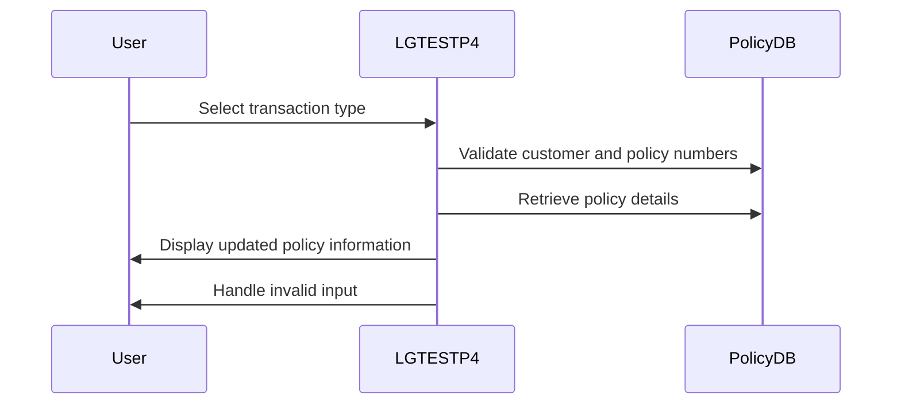

This document describes the <SwmToken path="base/src/lgtestp4.cbl" pos="11:6:6" line-data="       PROGRAM-ID. LGTESTP4.">`LGTESTP4`</SwmToken> program, which manages commercial policy transactions within the GenApp system. Users can select transaction types such as inquiry, addition, or deletion of policies. The program validates inputs, retrieves policy details, updates records, and displays the results.

For example, if a user selects '1' for policy inquiry, the system retrieves and displays the policy details based on the provided customer and policy numbers.

The main steps are:

- Display commercial policy menu
- Handle user input for transaction type
- Validate customer and policy numbers
- Retrieve policy details
- Update policy details
- Display updated policy information
- Handle invalid input



## Dependencies

### Programs

- <SwmToken path="base/src/lgtestp4.cbl" pos="122:10:10" line-data="                 EXEC CICS LINK PROGRAM(&#39;LGIPOL01&#39;)">`LGIPOL01`</SwmToken> (<SwmPath>[base/src/lgipol01.cbl](base/src/lgipol01.cbl)</SwmPath>) - <SwmLink doc-title="Policy Inquiry Logic (LGIPOL01)">[Policy Inquiry Logic (LGIPOL01)](/.swm/policy-inquiry-logic-lgipol01.9ezlc51y.sw.md)</SwmLink>
- LGIPDB01 (<SwmPath>[base/src/lgipdb01.cbl](base/src/lgipdb01.cbl)</SwmPath>) - <SwmLink doc-title="Policy Inquiry (LGIPDB01)">[Policy Inquiry (LGIPDB01)](/.swm/policy-inquiry-lgipdb01.183np482.sw.md)</SwmLink>
- LGSTSQ (<SwmPath>[base/src/lgstsq.cbl](base/src/lgstsq.cbl)</SwmPath>) - <SwmLink doc-title="Message Queue Handler (LGSTSQ)">[Message Queue Handler (LGSTSQ)](/.swm/message-queue-handler-lgstsq.e7y8uelv.sw.md)</SwmLink>
- <SwmToken path="base/src/lgtestp4.cbl" pos="178:10:10" line-data="                 EXEC CICS LINK PROGRAM(&#39;LGAPOL01&#39;)">`LGAPOL01`</SwmToken> (<SwmPath>[base/src/lgapol01.cbl](base/src/lgapol01.cbl)</SwmPath>) - <SwmLink doc-title="Adding Policy Details (LGAPOL01)">[Adding Policy Details (LGAPOL01)](/.swm/adding-policy-details-lgapol01.kinp27r0.sw.md)</SwmLink>
- LGAPDB01 (<SwmPath>[base/src/lgapdb01.cbl](base/src/lgapdb01.cbl)</SwmPath>) - <SwmLink doc-title="Adding Policy Details (LGAPDB01)">[Adding Policy Details (LGAPDB01)](/.swm/adding-policy-details-lgapdb01.9o8n772r.sw.md)</SwmLink>
- LGAPVS01 (<SwmPath>[base/src/lgapvs01.cbl](base/src/lgapvs01.cbl)</SwmPath>) - <SwmLink doc-title="Adding Policy Records (LGAPVS01)">[Adding Policy Records (LGAPVS01)](/.swm/adding-policy-records-lgapvs01.hs8lg2t7.sw.md)</SwmLink>
- <SwmToken path="base/src/lgtestp4.cbl" pos="201:10:10" line-data="                 EXEC CICS LINK PROGRAM(&#39;LGDPOL01&#39;)">`LGDPOL01`</SwmToken> (<SwmPath>[base/src/lgdpol01.cbl](base/src/lgdpol01.cbl)</SwmPath>) - <SwmLink doc-title="Deleting Policy (LGDPOL01)">[Deleting Policy (LGDPOL01)](/.swm/deleting-policy-lgdpol01.m4xoedhy.sw.md)</SwmLink>
- LGDPDB01 (<SwmPath>[base/src/lgdpdb01.cbl](base/src/lgdpdb01.cbl)</SwmPath>) - <SwmLink doc-title="Deleting Policy Records (LGDPDB01)">[Deleting Policy Records (LGDPDB01)](/.swm/deleting-policy-records-lgdpdb01.t1v6h4u2.sw.md)</SwmLink>
- LGDPVS01 (<SwmPath>[base/src/lgdpvs01.cbl](base/src/lgdpvs01.cbl)</SwmPath>) - <SwmLink doc-title="Deleting Policy Records (LGDPVS01)">[Deleting Policy Records (LGDPVS01)](/.swm/deleting-policy-records-lgdpvs01.c9cypss1.sw.md)</SwmLink>

### Copybooks

- SQLCA
- LGPOLICY (<SwmPath>[base/src/lgpolicy.cpy](base/src/lgpolicy.cpy)</SwmPath>)
- LGCMAREA (<SwmPath>[base/src/lgcmarea.cpy](base/src/lgcmarea.cpy)</SwmPath>)
- SSMAP

# Initializing Transaction Flow

## Handling User Inputs and Transaction Completion

<SwmSnippet path="/base/src/lgtestp4.cbl" line="257">

---

<SwmToken path="base/src/lgtestp4.cbl" pos="257:1:3" line-data="       ENDIT-STARTIT.">`ENDIT-STARTIT`</SwmToken> uses EXEC CICS RETURN to end the transaction and set it up for re-entry with <SwmToken path="base/src/lgtestp4.cbl" pos="259:4:4" line-data="                TRANSID(&#39;SSP4&#39;)">`SSP4`</SwmToken>.

```cobol
       ENDIT-STARTIT.
           EXEC CICS RETURN
                TRANSID('SSP4')
                COMMAREA(COMM-AREA)
                END-EXEC.
```

---

</SwmSnippet>

<SwmSnippet path="/base/src/lgtestp4.cbl" line="57">

---

In <SwmToken path="base/src/lgtestp4.cbl" pos="57:1:3" line-data="       A-GAIN.">`A-GAIN`</SwmToken>, HANDLE AID and CONDITION manage inputs and exceptions, and RECEIVE MAP collects user data.

```cobol
       A-GAIN.

           EXEC CICS HANDLE AID
                     CLEAR(CLEARIT)
                     PF3(ENDIT) END-EXEC.
           EXEC CICS HANDLE CONDITION
                     MAPFAIL(ENDIT)
                     END-EXEC.

           EXEC CICS RECEIVE MAP('SSMAPP4')
                     INTO(SSMAPP4I)
                     MAPSET('SSMAP') END-EXEC.
```

---

</SwmSnippet>

<SwmSnippet path="/base/src/lgtestp4.cbl" line="71">

---

EVALUATE <SwmToken path="base/src/lgtestp4.cbl" pos="71:3:3" line-data="           EVALUATE ENP4OPTO">`ENP4OPTO`</SwmToken> checks user selection. For '1', it verifies customer and policy numbers before calling <SwmToken path="base/src/lgtestp4.cbl" pos="122:10:10" line-data="                 EXEC CICS LINK PROGRAM(&#39;LGIPOL01&#39;)">`LGIPOL01`</SwmToken> to get policy details.

```cobol
           EVALUATE ENP4OPTO

             WHEN '1'
                 If (
                     ENP4CNOO Not = Spaces      AND
                     ENP4CNOO Not = Low-Values  AND
                     ENP4CNOO Not = 0           AND
                     ENP4CNOO Not = 0000000000
                                                   )
                                                    AND
                    (
                     ENP4PNOO Not = Spaces      AND
                     ENP4PNOO Not = Low-Values  AND
                     ENP4PNOO Not = 0           AND
                     ENP4PNOO Not = 0000000000
                                                   )
                        Move '01ICOM'   To CA-REQUEST-ID
                        Move ENP4CNOO   To CA-CUSTOMER-NUM
                        Move ENP4PNOO   To CA-POLICY-NUM
```

---

</SwmSnippet>

<SwmSnippet path="/base/src/lgtestp4.cbl" line="90">

---

If <SwmToken path="base/src/lgtestp4.cbl" pos="92:1:1" line-data="                     ENP4PNOO Not = Spaces      AND">`ENP4PNOO`</SwmToken> is valid, <SwmToken path="base/src/lgtestp4.cbl" pos="97:4:4" line-data="                        Move &#39;02ICOM&#39;   To CA-REQUEST-ID">`02ICOM`</SwmToken> is set as the request ID, focusing on policy number without customer validation.

```cobol
                 Else
                 If (
                     ENP4PNOO Not = Spaces      AND
                     ENP4PNOO Not = Low-Values  AND
                     ENP4PNOO Not = 0           AND
                     ENP4PNOO Not = 0000000000
                                                   )
                        Move '02ICOM'   To CA-REQUEST-ID
                        Move ENP4PNOO   To CA-POLICY-NUM
```

---

</SwmSnippet>

<SwmSnippet path="/base/src/lgtestp4.cbl" line="99">

---

<SwmToken path="base/src/lgtestp4.cbl" pos="106:4:4" line-data="                        Move &#39;03ICOM&#39;   To CA-REQUEST-ID">`03ICOM`</SwmToken> is set when <SwmToken path="base/src/lgtestp4.cbl" pos="101:1:1" line-data="                     ENP4CNOO Not = Spaces      AND">`ENP4CNOO`</SwmToken> is valid, prioritizing customer number over policy validation.

```cobol
                 Else
                 If (
                     ENP4CNOO Not = Spaces      AND
                     ENP4CNOO Not = Low-Values  AND
                     ENP4CNOO Not = 0           AND
                     ENP4CNOO Not = 0000000000
                                                   )
                        Move '03ICOM'   To CA-REQUEST-ID
                        Move ENP4CNOO   To CA-CUSTOMER-NUM
```

---

</SwmSnippet>

<SwmSnippet path="/base/src/lgtestp4.cbl" line="108">

---

<SwmToken path="base/src/lgtestp4.cbl" pos="115:4:4" line-data="                        Move &#39;05ICOM&#39;   To CA-REQUEST-ID">`05ICOM`</SwmToken> is set when <SwmToken path="base/src/lgtestp4.cbl" pos="110:1:1" line-data="                     ENP4HPCO NOT = Spaces      AND">`ENP4HPCO`</SwmToken> is valid, focusing on postcode without other checks.

```cobol
                 Else
                 If (
                     ENP4HPCO NOT = Spaces      AND
                     ENP4HPCO NOT = Low-Values  AND
                     ENP4HPCO Not = 0           AND
                     ENP4HPCO NOT = 00000000
                                                   )
                        Move '05ICOM'   To CA-REQUEST-ID
                        Move ENP4HPCO   To CA-B-PostCode
                 End-If
```

---

</SwmSnippet>

<SwmSnippet path="/base/src/lgtestp4.cbl" line="119">

---

EXEC CICS LINK PROGRAM calls <SwmToken path="base/src/lgtestp4.cbl" pos="122:10:10" line-data="                 EXEC CICS LINK PROGRAM(&#39;LGIPOL01&#39;)">`LGIPOL01`</SwmToken>, passing <SwmToken path="base/src/lgtestp4.cbl" pos="123:3:5" line-data="                           COMMAREA(COMM-AREA)">`COMM-AREA`</SwmToken> with request ID and numbers for policy retrieval.

```cobol
                 End-If
                 End-If

                 EXEC CICS LINK PROGRAM('LGIPOL01')
                           COMMAREA(COMM-AREA)
                           LENGTH(32500)
                 END-EXEC
```

---

</SwmSnippet>

<SwmSnippet path="/base/src/lgtestp4.cbl" line="130">

---

After <SwmToken path="base/src/lgtestp4.cbl" pos="122:10:10" line-data="                 EXEC CICS LINK PROGRAM(&#39;LGIPOL01&#39;)">`LGIPOL01`</SwmToken>, fields like policy and customer numbers are updated with retrieved data.

```cobol
                 Move CA-POLICY-NUM        To  ENP4PNOI
                 Move CA-CUSTOMER-NUM      To  ENP4CNOI
                 Move CA-ISSUE-DATE        To  ENP4IDAI
                 Move CA-EXPIRY-DATE       To  ENP4EDAI
                 Move CA-B-Address         To  ENP4ADDI
                 Move CA-B-Postcode        To  ENP4HPCI
                 Move CA-B-Latitude        To  ENP4LATI
                 Move CA-B-Longitude       To  ENP4LONI
                 Move CA-B-Customer        To  ENP4CUSI
                 Move CA-B-PropType        To  ENP4PTYI
                 Move CA-B-FirePeril       To  ENP4FPEI
                 Move CA-B-FirePremium     To  ENP4FPRI
                 Move CA-B-CrimePeril      To  ENP4CPEI
                 Move CA-B-CrimePremium    To  ENP4CPRI
                 Move CA-B-FloodPeril      To  ENP4XPEI
                 Move CA-B-FloodPremium    To  ENP4XPRI
                 Move CA-B-WeatherPeril    To  ENP4WPEI
                 Move CA-B-WeatherPremium  To  ENP4WPRI
                 Move CA-B-Status          To  ENP4STAI
                 Move CA-B-RejectReason    To  ENP4REJI
```

---

</SwmSnippet>

<SwmSnippet path="/base/src/lgtestp4.cbl" line="150">

---

EXEC CICS SEND MAP displays updated policy details to the user, showing retrieval results.

```cobol
                 EXEC CICS SEND MAP ('SSMAPP4')
                           FROM(SSMAPP4O)
                           MAPSET ('SSMAP')
                 END-EXEC
```

---

</SwmSnippet>

<SwmSnippet path="/base/src/lgtestp4.cbl" line="156">

---

For adding a policy, fields like customer number and issue date are prepared for insertion.

```cobol
             WHEN '2'
                 Move '01ACOM'             To  CA-REQUEST-ID
                 Move ENP4CNOO             To  CA-CUSTOMER-NUM
                 Move ENP4IDAO             To  CA-ISSUE-DATE
                 Move ENP4EDAO             To  CA-EXPIRY-DATE
                 Move ENP4ADDO             To  CA-B-Address
                 Move ENP4HPCO             To  CA-B-Postcode
                 Move ENP4LATO             To  CA-B-Latitude
                 Move ENP4LONO             To  CA-B-Longitude
                 Move ENP4CUSO             To  CA-B-Customer
                 Move ENP4PTYO             To  CA-B-PropType
                 Move ENP4FPEO             To  CA-B-FirePeril
                 Move ENP4FPRO             To  CA-B-FirePremium
                 Move ENP4CPEO             To  CA-B-CrimePeril
                 Move ENP4CPRO             To  CA-B-CrimePremium
                 Move ENP4XPEO             To  CA-B-FloodPeril
                 Move ENP4XPRO             To  CA-B-FloodPremium
                 Move ENP4WPEO             To  CA-B-WeatherPeril
                 Move ENP4WPRO             To  CA-B-WeatherPremium
                 Move ENP4STAO             To  CA-B-Status
                 Move ENP4REJO             To  CA-B-RejectReason
```

---

</SwmSnippet>

<SwmSnippet path="/base/src/lgtestp4.cbl" line="178">

---

EXEC CICS LINK PROGRAM calls <SwmToken path="base/src/lgtestp4.cbl" pos="178:10:10" line-data="                 EXEC CICS LINK PROGRAM(&#39;LGAPOL01&#39;)">`LGAPOL01`</SwmToken>, passing <SwmToken path="base/src/lgtestp4.cbl" pos="179:3:5" line-data="                           COMMAREA(COMM-AREA)">`COMM-AREA`</SwmToken> with fields for policy insertion.

```cobol
                 EXEC CICS LINK PROGRAM('LGAPOL01')
                           COMMAREA(COMM-AREA)
                           LENGTH(32500)
                 END-EXEC
```

---

</SwmSnippet>

<SwmSnippet path="/base/src/lgtestp4.cbl" line="186">

---

After <SwmToken path="base/src/lgtestp4.cbl" pos="178:10:10" line-data="                 EXEC CICS LINK PROGRAM(&#39;LGAPOL01&#39;)">`LGAPOL01`</SwmToken>, fields like customer and policy numbers are updated with new insertion data.

```cobol
                 Move CA-CUSTOMER-NUM To ENP4CNOI
                 Move CA-POLICY-NUM   To ENP4PNOI
                 Move ' '             To ENP4OPTI
                 Move 'New Commercial Policy Inserted'
                   To  ERP4FLDO
                 EXEC CICS SEND MAP ('SSMAPP4')
                           FROM(SSMAPP4O)
                           MAPSET ('SSMAP')
                 END-EXEC
```

---

</SwmSnippet>

<SwmSnippet path="/base/src/lgtestp4.cbl" line="197">

---

For deleting a policy, fields like customer and policy numbers are prepared for deletion.

```cobol
             WHEN '3'
                 Move '01DCOM'   To CA-REQUEST-ID
                 Move ENP4CNOO   To CA-CUSTOMER-NUM
                 Move ENP4PNOO   To CA-POLICY-NUM
                 EXEC CICS LINK PROGRAM('LGDPOL01')
                           COMMAREA(COMM-AREA)
                           LENGTH(32500)
                 END-EXEC
```

---

</SwmSnippet>

<SwmSnippet path="/base/src/lgtestp4.cbl" line="210">

---

EXEC CICS LINK PROGRAM calls <SwmToken path="base/src/lgtestp4.cbl" pos="201:10:10" line-data="                 EXEC CICS LINK PROGRAM(&#39;LGDPOL01&#39;)">`LGDPOL01`</SwmToken>, passing <SwmToken path="base/src/lgtestp4.cbl" pos="37:3:5" line-data="           Initialize COMM-AREA.">`COMM-AREA`</SwmToken> with fields for policy deletion.

```cobol
                 Move Spaces             To ENP4EDAI
                 Move Spaces             To ENP4ADDI
                 Move Spaces             To ENP4HPCI
                 Move Spaces             To ENP4LATI
                 Move Spaces             To ENP4LONI
                 Move Spaces             To ENP4CUSI
                 Move Spaces             To ENP4PTYI
                 Move Spaces             To ENP4FPEI
                 Move Spaces             To ENP4FPRI
                 Move Spaces             To ENP4CPEI
                 Move Spaces             To ENP4CPRI
                 Move Spaces             To ENP4XPEI
                 Move Spaces             To ENP4XPRI
                 Move Spaces             To ENP4WPEI
                 Move Spaces             To ENP4WPRI
                 Move Spaces             To ENP4STAI
                 Move Spaces             To ENP4REJI
                 Move ' '             To ENP4OPTI
                 Move 'Commercial Policy Deleted'
                   To  ERP4FLDO
```

---

</SwmSnippet>

<SwmSnippet path="/base/src/lgtestp4.cbl" line="230">

---

After <SwmToken path="base/src/lgtestp4.cbl" pos="201:10:10" line-data="                 EXEC CICS LINK PROGRAM(&#39;LGDPOL01&#39;)">`LGDPOL01`</SwmToken>, fields are cleared to show policy deletion.

```cobol
                 EXEC CICS SEND MAP ('SSMAPP4')
                           FROM(SSMAPP4O)
                           MAPSET ('SSMAP')
                 END-EXEC
```

---

</SwmSnippet>

<SwmSnippet path="/base/src/lgtestp4.cbl" line="236">

---

If <SwmToken path="base/src/lgtestp4.cbl" pos="71:3:3" line-data="           EVALUATE ENP4OPTO">`ENP4OPTO`</SwmToken> is invalid, an error message is sent, and control returns to CICS, ending the transaction.

```cobol
             WHEN OTHER

                 Move 'Please enter a valid option'
                   To  ERP4FLDO
                 Move -1 To ENP4OPTL

                 EXEC CICS SEND MAP ('SSMAPP4')
                           FROM(SSMAPP4O)
                           MAPSET ('SSMAP')
                           CURSOR
                 END-EXEC
                 GO TO ENDIT-STARTIT

           END-EVALUATE.


      *    Send message to terminal and return

           EXEC CICS RETURN
           END-EXEC.
```

---

</SwmSnippet>

## Main Transaction Logic

<SwmSnippet path="/base/src/lgtestp4.cbl" line="30">

---

In <SwmToken path="base/src/lgtestp4.cbl" pos="30:1:1" line-data="       MAINLINE SECTION.">`MAINLINE`</SwmToken>, if EIBCALEN > 0, it transitions to <SwmToken path="base/src/lgtestp4.cbl" pos="33:5:7" line-data="              GO TO A-GAIN.">`A-GAIN`</SwmToken> for handling previous transaction data.

```cobol
       MAINLINE SECTION.

           IF EIBCALEN > 0
              GO TO A-GAIN.
```

---

</SwmSnippet>

<SwmSnippet path="/base/src/lgtestp4.cbl" line="35">

---

MAINLINE initializes fields like customer and policy numbers to default values for transaction setup.

```cobol
           Initialize SSMAPP4I.
           Initialize SSMAPP4O.
           Initialize COMM-AREA.
           MOVE '0000000000'   To ENP4CNOO.
           MOVE '0000000000'   To ENP4PNOO.
           MOVE LOW-VALUES     To ENP4FPEO.
           MOVE LOW-VALUES     To ENP4FPRO.
           MOVE LOW-VALUES     To ENP4CPEO.
           MOVE LOW-VALUES     To ENP4CPRO.
           MOVE LOW-VALUES     To ENP4XPEO.
           MOVE LOW-VALUES     To ENP4XPRO.
           MOVE LOW-VALUES     To ENP4WPEO.
           MOVE LOW-VALUES     To ENP4WPRO.
           MOVE LOW-VALUES     To ENP4STAO.
```

---

</SwmSnippet>

<SwmSnippet path="/base/src/lgtestp4.cbl" line="52">

---

EXEC CICS SEND MAP displays the main menu, erasing previous content for new transactions.

```cobol
           EXEC CICS SEND MAP ('SSMAPP4')
                     MAPSET ('SSMAP')
                     ERASE
                     END-EXEC.
```

---

</SwmSnippet>

&nbsp;

*This is an auto-generated document by Swimm 🌊 and has not yet been verified by a human*

<SwmMeta version="3.0.0" repo-id="Z2l0aHViJTNBJTNBa3luZHJ5bC1jaWNzLWdlbmFwcCUzQSUzQVN3aW1tLURlbW8=" repo-name="kyndryl-cics-genapp"><sup>Powered by [Swimm](/)</sup></SwmMeta>
