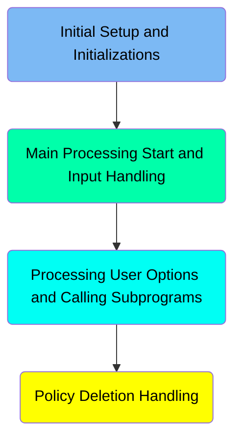
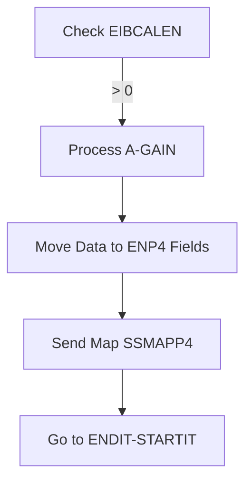
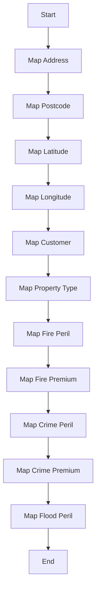
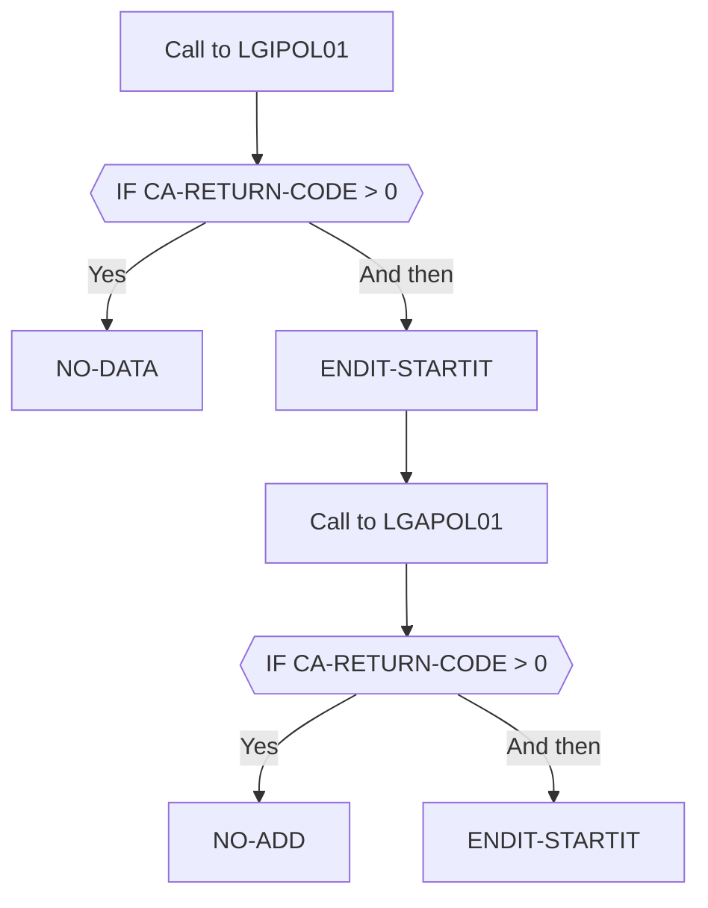

The <SwmToken path="base/src/lgtestp4.cbl" pos="11:6:6" line-data="       PROGRAM-ID. LGTESTP4.">`LGTESTP4`</SwmToken> program handles various user options related to policy management, including insertion, deletion, and querying of policy information. The program achieves this by initializing fields, mapping user inputs to internal structures, and calling subprograms to perform the necessary operations.

The flow starts with initial setup and initializations, followed by handling user inputs and mapping them to internal structures. Depending on the user option selected, the program either inserts, deletes, or queries policy information by calling the appropriate subprograms. Finally, it handles any errors and updates the user interface accordingly.

Here is a high level diagram of the program:



# Initial Setup and Initializations



<SwmSnippet path="/base/src/lgtestp4.cbl" line="30">

---

## Handling user options

First, the code checks if <SwmToken path="base/src/lgtestp4.cbl" pos="32:3:3" line-data="           IF EIBCALEN &gt; 0">`EIBCALEN`</SwmToken> is greater than 0, which indicates that there is data in the communication area. If true, it proceeds to the <SwmToken path="base/src/lgtestp4.cbl" pos="33:5:7" line-data="              GO TO A-GAIN.">`A-GAIN`</SwmToken> section for further processing.

```cobol
       MAINLINE SECTION.

           IF EIBCALEN > 0
              GO TO A-GAIN.

           Initialize SSMAPP4I.
           Initialize SSMAPP4O.
           Initialize COMM-AREA.
           MOVE '0000000000'   To ENP4CNOO.
           MOVE '0000000000'   To ENP4PNOO.
           MOVE LOW-VALUES     To ENP4FPEO.
           MOVE LOW-VALUES     To ENP4FPRO.
           MOVE LOW-VALUES     To ENP4CPEO.
           MOVE LOW-VALUES     To ENP4CPRO.
           MOVE LOW-VALUES     To ENP4XPEO.
           MOVE LOW-VALUES     To ENP4XPRO.
           MOVE LOW-VALUES     To ENP4WPEO.
           MOVE LOW-VALUES     To ENP4WPRO.
           MOVE LOW-VALUES     To ENP4STAO.


```

---

</SwmSnippet>

<SwmSnippet path="/base/src/lgtestp4.cbl" line="30">

---

## Moving data to ENP4 fields

Next, the code moves various data fields from <SwmToken path="base/src/lgtestp4.cbl" pos="134:3:5" line-data="                 Move CA-B-Address         To  ENP4ADDI">`CA-B`</SwmToken> to `ENP4` fields. This step is crucial for preparing the data to be displayed or processed further.

```cobol
       MAINLINE SECTION.

           IF EIBCALEN > 0
              GO TO A-GAIN.

           Initialize SSMAPP4I.
           Initialize SSMAPP4O.
           Initialize COMM-AREA.
           MOVE '0000000000'   To ENP4CNOO.
           MOVE '0000000000'   To ENP4PNOO.
           MOVE LOW-VALUES     To ENP4FPEO.
           MOVE LOW-VALUES     To ENP4FPRO.
           MOVE LOW-VALUES     To ENP4CPEO.
           MOVE LOW-VALUES     To ENP4CPRO.
           MOVE LOW-VALUES     To ENP4XPEO.
           MOVE LOW-VALUES     To ENP4XPRO.
           MOVE LOW-VALUES     To ENP4WPEO.
```

---

</SwmSnippet>

<SwmSnippet path="/base/src/lgtestp4.cbl" line="47">

---

## Sending map <SwmToken path="base/src/lgtestp4.cbl" pos="66:10:10" line-data="           EXEC CICS RECEIVE MAP(&#39;SSMAPP4&#39;)">`SSMAPP4`</SwmToken>

Then, the code sends the map <SwmToken path="base/src/lgtestp4.cbl" pos="66:10:10" line-data="           EXEC CICS RECEIVE MAP(&#39;SSMAPP4&#39;)">`SSMAPP4`</SwmToken> to the terminal using the <SwmToken path="base/src/lgtestp4.cbl" pos="52:1:7" line-data="           EXEC CICS SEND MAP (&#39;SSMAPP4&#39;)">`EXEC CICS SEND MAP`</SwmToken> command. This updates the user interface with the current data.

```cobol
           MOVE LOW-VALUES     To ENP4WPRO.
           MOVE LOW-VALUES     To ENP4STAO.


```

---

</SwmSnippet>

<SwmSnippet path="/base/src/lgtestp4.cbl" line="51">

---

## Going to <SwmToken path="base/src/lgtestp4.cbl" pos="154:5:7" line-data="                 GO TO ENDIT-STARTIT">`ENDIT-STARTIT`</SwmToken>

Finally, the code directs the flow to <SwmToken path="base/src/lgtestp4.cbl" pos="154:5:7" line-data="                 GO TO ENDIT-STARTIT">`ENDIT-STARTIT`</SwmToken>, which likely handles the next steps or concludes the current transaction.

```cobol
      * Display Main Menu
```

---

</SwmSnippet>

# Main Processing Start and Input Handling

This is the next section of the flow.



<SwmSnippet path="/base/src/lgtestp4.cbl" line="58">

---

## Mapping Address

First, the user's address input <SwmToken path="base/src/lgtestp4.cbl" pos="161:3:3" line-data="                 Move ENP4ADDO             To  CA-B-Address">`ENP4ADDO`</SwmToken> is mapped to the internal structure <SwmToken path="base/src/lgtestp4.cbl" pos="134:3:7" line-data="                 Move CA-B-Address         To  ENP4ADDI">`CA-B-Address`</SwmToken>. This ensures that the address is correctly stored for further processing.

```cobol

```

---

</SwmSnippet>

<SwmSnippet path="/base/src/lgtestp4.cbl" line="59">

---

## Mapping Postcode

Next, the user's postcode input <SwmToken path="base/src/lgtestp4.cbl" pos="110:1:1" line-data="                     ENP4HPCO NOT = Spaces      AND">`ENP4HPCO`</SwmToken> is mapped to the internal structure <SwmToken path="base/src/lgtestp4.cbl" pos="135:3:7" line-data="                 Move CA-B-Postcode        To  ENP4HPCI">`CA-B-Postcode`</SwmToken>. This step is crucial for location-based processing.

```cobol
           EXEC CICS HANDLE AID
```

---

</SwmSnippet>

<SwmSnippet path="/base/src/lgtestp4.cbl" line="60">

---

## Mapping Latitude and Longitude

Then, the latitude <SwmToken path="base/src/lgtestp4.cbl" pos="163:3:3" line-data="                 Move ENP4LATO             To  CA-B-Latitude">`ENP4LATO`</SwmToken> and longitude <SwmToken path="base/src/lgtestp4.cbl" pos="164:3:3" line-data="                 Move ENP4LONO             To  CA-B-Longitude">`ENP4LONO`</SwmToken> inputs are mapped to <SwmToken path="base/src/lgtestp4.cbl" pos="136:3:7" line-data="                 Move CA-B-Latitude        To  ENP4LATI">`CA-B-Latitude`</SwmToken> and <SwmToken path="base/src/lgtestp4.cbl" pos="137:3:7" line-data="                 Move CA-B-Longitude       To  ENP4LONI">`CA-B-Longitude`</SwmToken> respectively. These coordinates are used for geographical analysis.

```cobol
                     CLEAR(CLEARIT)
                     PF3(ENDIT) END-EXEC.
```

---

</SwmSnippet>

<SwmSnippet path="/base/src/lgtestp4.cbl" line="62">

---

## Mapping Customer Information

Moving to customer information, the input <SwmToken path="base/src/lgtestp4.cbl" pos="165:3:3" line-data="                 Move ENP4CUSO             To  CA-B-Customer">`ENP4CUSO`</SwmToken> is mapped to <SwmToken path="base/src/lgtestp4.cbl" pos="138:3:7" line-data="                 Move CA-B-Customer        To  ENP4CUSI">`CA-B-Customer`</SwmToken>. This links the policy to the correct customer.

```cobol
           EXEC CICS HANDLE CONDITION
```

---

</SwmSnippet>

<SwmSnippet path="/base/src/lgtestp4.cbl" line="63">

---

## Mapping Property Type

Next, the property type input <SwmToken path="base/src/lgtestp4.cbl" pos="166:3:3" line-data="                 Move ENP4PTYO             To  CA-B-PropType">`ENP4PTYO`</SwmToken> is mapped to <SwmToken path="base/src/lgtestp4.cbl" pos="139:3:7" line-data="                 Move CA-B-PropType        To  ENP4PTYI">`CA-B-PropType`</SwmToken>. This helps in categorizing the property for policy rules.

```cobol
                     MAPFAIL(ENDIT)
```

---

</SwmSnippet>

<SwmSnippet path="/base/src/lgtestp4.cbl" line="64">

---

## Mapping Fire Peril and Premium

Then, the fire peril <SwmToken path="base/src/lgtestp4.cbl" pos="40:9:9" line-data="           MOVE LOW-VALUES     To ENP4FPEO.">`ENP4FPEO`</SwmToken> and fire premium <SwmToken path="base/src/lgtestp4.cbl" pos="41:9:9" line-data="           MOVE LOW-VALUES     To ENP4FPRO.">`ENP4FPRO`</SwmToken> inputs are mapped to <SwmToken path="base/src/lgtestp4.cbl" pos="140:3:7" line-data="                 Move CA-B-FirePeril       To  ENP4FPEI">`CA-B-FirePeril`</SwmToken> and <SwmToken path="base/src/lgtestp4.cbl" pos="141:3:7" line-data="                 Move CA-B-FirePremium     To  ENP4FPRI">`CA-B-FirePremium`</SwmToken>. This is essential for calculating fire-related risks and premiums.

```cobol
                     END-EXEC.

```

---

</SwmSnippet>

<SwmSnippet path="/base/src/lgtestp4.cbl" line="66">

---

## Mapping Crime Peril and Premium

Next, the crime peril <SwmToken path="base/src/lgtestp4.cbl" pos="42:9:9" line-data="           MOVE LOW-VALUES     To ENP4CPEO.">`ENP4CPEO`</SwmToken> and crime premium <SwmToken path="base/src/lgtestp4.cbl" pos="43:9:9" line-data="           MOVE LOW-VALUES     To ENP4CPRO.">`ENP4CPRO`</SwmToken> inputs are mapped to <SwmToken path="base/src/lgtestp4.cbl" pos="142:3:7" line-data="                 Move CA-B-CrimePeril      To  ENP4CPEI">`CA-B-CrimePeril`</SwmToken> and <SwmToken path="base/src/lgtestp4.cbl" pos="143:3:7" line-data="                 Move CA-B-CrimePremium    To  ENP4CPRI">`CA-B-CrimePremium`</SwmToken>. This step is crucial for assessing crime-related risks and premiums.

```cobol
           EXEC CICS RECEIVE MAP('SSMAPP4')
                     INTO(SSMAPP4I)
```

---

</SwmSnippet>

<SwmSnippet path="/base/src/lgtestp4.cbl" line="68">

---

## Mapping Flood Peril

Finally, the flood peril input <SwmToken path="base/src/lgtestp4.cbl" pos="44:9:9" line-data="           MOVE LOW-VALUES     To ENP4XPEO.">`ENP4XPEO`</SwmToken> is mapped to <SwmToken path="base/src/lgtestp4.cbl" pos="144:3:7" line-data="                 Move CA-B-FloodPeril      To  ENP4XPEI">`CA-B-FloodPeril`</SwmToken>. This ensures that flood risks are considered in the policy.

```cobol
                     MAPSET('SSMAP') END-EXEC.
```

---

</SwmSnippet>

## Interim Summary

So far, we saw how the program initializes various fields and sends the map to the terminal. This ensures that the user interface is updated with the current data. Now, we will focus on the main processing start and input handling, where the user's inputs are mapped to the internal structures for further processing.

# Processing User Options and Calling Subprograms



<SwmSnippet path="/base/src/lgtestp4.cbl" line="71">

---

## Handling policy insertion

First, the program moves various input fields to the communication area before calling the <SwmToken path="base/src/lgtestp4.cbl" pos="178:10:10" line-data="                 EXEC CICS LINK PROGRAM(&#39;LGAPOL01&#39;)">`LGAPOL01`</SwmToken> program to insert a new policy. If the return code is greater than 0, it rolls back the transaction and goes to the <SwmToken path="base/src/lgtestp4.cbl" pos="184:5:7" line-data="                   GO TO NO-ADD">`NO-ADD`</SwmToken> section. Otherwise, it updates the display with a success message indicating that a new commercial policy has been inserted.

More about <SwmToken path="base/src/lgtestp4.cbl" pos="178:10:10" line-data="                 EXEC CICS LINK PROGRAM(&#39;LGAPOL01&#39;)">`LGAPOL01`</SwmToken>: <SwmLink doc-title="Handling Main Menu and User Input (LGAPOL01)">[Handling Main Menu and User Input (LGAPOL01)](/.swm/handling-main-menu-and-user-input-lgapol01.ju6hxncq.sw.md)</SwmLink>

```cobol
           EVALUATE ENP4OPTO

             WHEN '1'
                 If (
                     ENP4CNOO Not = Spaces      AND
                     ENP4CNOO Not = Low-Values  AND
                     ENP4CNOO Not = 0           AND
                     ENP4CNOO Not = 0000000000
                                                   )
                                                    AND
                    (
                     ENP4PNOO Not = Spaces      AND
                     ENP4PNOO Not = Low-Values  AND
                     ENP4PNOO Not = 0           AND
                     ENP4PNOO Not = 0000000000
                                                   )
                        Move '01ICOM'   To CA-REQUEST-ID
                        Move ENP4CNOO   To CA-CUSTOMER-NUM
                        Move ENP4PNOO   To CA-POLICY-NUM
                 Else
                 If (
```

---

</SwmSnippet>

<SwmSnippet path="/base/src/lgtestp4.cbl" line="94">

---

## Handling policy deletion

Next, when the option '3' is selected, the program prepares the communication area and calls the <SwmToken path="base/src/lgtestp4.cbl" pos="201:10:10" line-data="                 EXEC CICS LINK PROGRAM(&#39;LGDPOL01&#39;)">`LGDPOL01`</SwmToken> program to delete an existing policy. If the return code is greater than 0, it rolls back the transaction and goes to the <SwmToken path="base/src/lgtestp4.cbl" pos="207:5:7" line-data="                   GO TO NO-DELETE">`NO-DELETE`</SwmToken> section. Otherwise, it clears various input fields and updates the display with a success message indicating that a commercial policy has been deleted.

More about <SwmToken path="base/src/lgtestp4.cbl" pos="201:10:10" line-data="                 EXEC CICS LINK PROGRAM(&#39;LGDPOL01&#39;)">`LGDPOL01`</SwmToken>: <SwmLink doc-title="Deleting Policy Information (LGDPOL01)">[Deleting Policy Information (LGDPOL01)](/.swm/deleting-policy-information-lgdpol01.sf6u0vqb.sw.md)</SwmLink>

```cobol
                     ENP4PNOO Not = 0           AND
                     ENP4PNOO Not = 0000000000
                                                   )
                        Move '02ICOM'   To CA-REQUEST-ID
                        Move ENP4PNOO   To CA-POLICY-NUM
                 Else
                 If (
                     ENP4CNOO Not = Spaces      AND
                     ENP4CNOO Not = Low-Values  AND
                     ENP4CNOO Not = 0           AND
                     ENP4CNOO Not = 0000000000
                                                   )
                        Move '03ICOM'   To CA-REQUEST-ID
                        Move ENP4CNOO   To CA-CUSTOMER-NUM
                 Else
                 If (
                     ENP4HPCO NOT = Spaces      AND
                     ENP4HPCO NOT = Low-Values  AND
                     ENP4HPCO Not = 0           AND
                     ENP4HPCO NOT = 00000000
                                                   )
```

---

</SwmSnippet>

<SwmSnippet path="/base/src/lgtestp4.cbl" line="133">

---

## Handling invalid options

Then, for any other options, the program displays an error message prompting the user to enter a valid option. This ensures that the user is aware of the invalid input and can correct it.

```cobol
                 Move CA-EXPIRY-DATE       To  ENP4EDAI
                 Move CA-B-Address         To  ENP4ADDI
                 Move CA-B-Postcode        To  ENP4HPCI
                 Move CA-B-Latitude        To  ENP4LATI
                 Move CA-B-Longitude       To  ENP4LONI
                 Move CA-B-Customer        To  ENP4CUSI
                 Move CA-B-PropType        To  ENP4PTYI
                 Move CA-B-FirePeril       To  ENP4FPEI
                 Move CA-B-FirePremium     To  ENP4FPRI
                 Move CA-B-CrimePeril      To  ENP4CPEI
                 Move CA-B-CrimePremium    To  ENP4CPRI
                 Move CA-B-FloodPeril      To  ENP4XPEI
                 Move CA-B-FloodPremium    To  ENP4XPRI
```

---

</SwmSnippet>

<SwmSnippet path="/base/src/lgtestp4.cbl" line="154">

---

## Ending the transaction

Finally, the <SwmToken path="base/src/lgtestp4.cbl" pos="154:5:7" line-data="                 GO TO ENDIT-STARTIT">`ENDIT-STARTIT`</SwmToken> section is called to end the transaction and return control to the terminal. This ensures that the transaction is properly closed and the user can start a new operation.

```cobol
                 GO TO ENDIT-STARTIT

             WHEN '2'
                 Move '01ACOM'             To  CA-REQUEST-ID
                 Move ENP4CNOO             To  CA-CUSTOMER-NUM
```

---

</SwmSnippet>

# Policy Deletion Handling

```mermaid
graph TD
  A[Call to LGDPOL01] --> B{{IF CA-RETURN-CODE > 0}}
  B -->|Yes| C[Move 'Error Deleting Commercial Policy' To ERP4FLDO]
  C --> D[Go To ERROR-OUT]
  B -->|No| E[Move 'No data was returned.' To ERP4FLDO]
  E --> F[Go To ERROR-OUT]
  D --> G[EXEC CICS SEND MAP ('SSMAPP4')]
  G --> H[FROM(SSMAPP4O)]
  H --> I[MAPSET ('SSMAP')]
  I --> J[END-EXEC]
  J --> K[Initialize SSMAPP4I]
  K --> L[Initialize SSMAPP4O]
  L --> M[Initialize COMM-AREA]
  M --> N[GO TO ENDIT-STARTIT]

%% Swimm:
%% graph TD
%%   A[Call to LGDPOL01] --> B{{IF <SwmToken path="base/src/lgtestp4.cbl" pos="205:3:7" line-data="                 IF CA-RETURN-CODE &gt; 0">`CA-RETURN-CODE`</SwmToken> > 0}}
%%   B -->|Yes| C[Move 'Error Deleting Commercial Policy' To ERP4FLDO]
%%   C --> D[Go To ERROR-OUT]
%%   B -->|No| E[Move 'No data was returned.' To ERP4FLDO]
%%   E --> F[Go To ERROR-OUT]
%%   D --> G[EXEC CICS SEND MAP ('SSMAPP4')]
%%   G --> H[FROM(SSMAPP4O)]
%%   H --> I[MAPSET ('SSMAP')]
%%   I --> J[END-EXEC]
%%   J --> K[Initialize SSMAPP4I]
%%   K --> L[Initialize SSMAPP4O]
%%   L --> M[Initialize COMM-AREA]
%%   M --> N[GO TO ENDIT-STARTIT]
```

<SwmSnippet path="/base/src/lgtestp4.cbl" line="198">

---

## Handling errors and sending map

First, if there is an error deleting the commercial policy, we move the error message 'Error Deleting Commercial Policy' to <SwmToken path="base/src/lgtestp4.cbl" pos="190:3:3" line-data="                   To  ERP4FLDO">`ERP4FLDO`</SwmToken> and go to the <SwmToken path="base/src/lgtestp4.cbl" pos="290:5:7" line-data="               Go To ERROR-OUT">`ERROR-OUT`</SwmToken> section. This ensures that the user is informed about the error.

```cobol
                 Move '01DCOM'   To CA-REQUEST-ID
                 Move ENP4CNOO   To CA-CUSTOMER-NUM
                 Move ENP4PNOO   To CA-POLICY-NUM
                 EXEC CICS LINK PROGRAM('LGDPOL01')
                           COMMAREA(COMM-AREA)
                           LENGTH(32500)
                 END-EXEC
                 IF CA-RETURN-CODE > 0
                   Exec CICS Syncpoint Rollback End-Exec
                   GO TO NO-DELETE
                 END-IF

                 Move Spaces             To ENP4EDAI
                 Move Spaces             To ENP4ADDI
                 Move Spaces             To ENP4HPCI
                 Move Spaces             To ENP4LATI
                 Move Spaces             To ENP4LONI
                 Move Spaces             To ENP4CUSI
                 Move Spaces             To ENP4PTYI
```

---

</SwmSnippet>

<SwmSnippet path="/base/src/lgtestp4.cbl" line="201">

---

Next, if no data is returned, we move the message 'No data was returned.' to <SwmToken path="base/src/lgtestp4.cbl" pos="190:3:3" line-data="                   To  ERP4FLDO">`ERP4FLDO`</SwmToken> and go to the <SwmToken path="base/src/lgtestp4.cbl" pos="290:5:7" line-data="               Go To ERROR-OUT">`ERROR-OUT`</SwmToken> section. This informs the user that no data was found.

```cobol
                 EXEC CICS LINK PROGRAM('LGDPOL01')
                           COMMAREA(COMM-AREA)
                           LENGTH(32500)
```

---

</SwmSnippet>

<SwmSnippet path="/base/src/lgtestp4.cbl" line="205">

---

Then, in the <SwmToken path="base/src/lgtestp4.cbl" pos="290:5:7" line-data="               Go To ERROR-OUT">`ERROR-OUT`</SwmToken> section, we send the map <SwmToken path="base/src/lgtestp4.cbl" pos="66:10:10" line-data="           EXEC CICS RECEIVE MAP(&#39;SSMAPP4&#39;)">`SSMAPP4`</SwmToken> from <SwmToken path="base/src/lgtestp4.cbl" pos="36:3:3" line-data="           Initialize SSMAPP4O.">`SSMAPP4O`</SwmToken> and specify the mapset 'SSMAP'. This displays the appropriate map to the user, showing the error message.

```cobol
                 IF CA-RETURN-CODE > 0
                   Exec CICS Syncpoint Rollback End-Exec
                   GO TO NO-DELETE
                 END-IF

```

---

</SwmSnippet>

<SwmSnippet path="/base/src/lgtestp4.cbl" line="211">

---

Finally, we initialize <SwmToken path="base/src/lgtestp4.cbl" pos="35:3:3" line-data="           Initialize SSMAPP4I.">`SSMAPP4I`</SwmToken>, <SwmToken path="base/src/lgtestp4.cbl" pos="36:3:3" line-data="           Initialize SSMAPP4O.">`SSMAPP4O`</SwmToken>, and <SwmToken path="base/src/lgtestp4.cbl" pos="37:3:5" line-data="           Initialize COMM-AREA.">`COMM-AREA`</SwmToken> before going to <SwmToken path="base/src/lgtestp4.cbl" pos="154:5:7" line-data="                 GO TO ENDIT-STARTIT">`ENDIT-STARTIT`</SwmToken>. This prepares the program for the next operation.

```cobol
                 Move Spaces             To ENP4ADDI
                 Move Spaces             To ENP4HPCI
                 Move Spaces             To ENP4LATI
                 Move Spaces             To ENP4LONI
                 Move Spaces             To ENP4CUSI
```

---

</SwmSnippet>

&nbsp;

*This is an auto-generated document by Swimm 🌊 and has not yet been verified by a human*

<SwmMeta version="3.0.0" repo-id="Z2l0aHViJTNBJTNBa3luZHJ5bC1jaWNzLWdlbmFwcCUzQSUzQVN3aW1tLURlbW8=" repo-name="kyndryl-cics-genapp"><sup>Powered by [Swimm](https://app.swimm.io/)</sup></SwmMeta>
