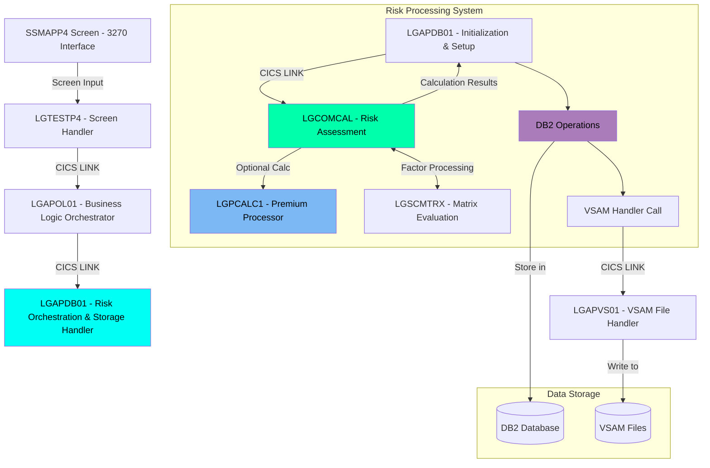

The Commercial Property Policy Management System provides a streamlined process for handling commercial insurance policies. The system implements sophisticated business rules for risk assessment and premium calculations based on property characteristics and selected perils (Fire, Crime, Flood, and Weather). Through its 3270-style interface, users can inquire about existing policies, add new policies, or delete policies.

## Screen preview

The screen looks roughly like this:

<p align="center"></p>

## Add Policy Business Logic Flow


## Technical Flow Diagram

In high level, these are the main components:



## Technical Flow Code Walkthrough

### Reading Information and Orchestrating

<SwmSnippet path="/base/src/lgtestp4.cbl" line="156">

---

Within the Screen Handler, when the user selects <SwmToken path="/base/src/lgtestp4.cbl" pos="156:4:4" line-data="             WHEN &#39;2&#39;">`2`</SwmToken> (<SwmToken path="/base/src/ssmap.bms" pos="457:7:9" line-data="               INITIAL=&#39;2. Policy Add     &#39;">`Policy Add`</SwmToken>), the fields provided by the user are set:

```cobol
             WHEN '2'
                 Move '01ACOM'             To  CA-REQUEST-ID
                 Move ENP4CNOO             To  CA-CUSTOMER-NUM
                 Move ENP4IDAO             To  CA-ISSUE-DATE
                 Move ENP4EDAO             To  CA-EXPIRY-DATE
                 Move ENP4ADDO             To  CA-B-Address
                 Move ENP4HPCO             To  CA-B-Postcode
                 Move ENP4LATO             To  CA-B-Latitude
```

---

</SwmSnippet>

<SwmSnippet path="/base/src/lgtestp4.cbl" line="178">

---

Then <SwmToken path="/base/src/lgtestp4.cbl" pos="178:10:10" line-data="                 EXEC CICS LINK PROGRAM(&#39;LGAPOL01&#39;)">`LGAPOL01`</SwmToken> (the Business Logic Orchestrator) is invoked:

```cobol
                 EXEC CICS LINK PROGRAM('LGAPOL01')
                           COMMAREA(COMM-AREA)
                           LENGTH(32500)
                 END-EXEC
```

---

</SwmSnippet>

<SwmSnippet path="/base/src/lgapol01.cbl" line="121">

---

<SwmToken path="/base/src/lgtestp4.cbl" pos="178:10:10" line-data="                 EXEC CICS LINK PROGRAM(&#39;LGAPOL01&#39;)">`LGAPOL01`</SwmToken> acts as an intermediary between the screen handler (<SwmToken path="/base/src/lgtestp4.cbl" pos="11:6:6" line-data="       PROGRAM-ID. LGTESTP4.">`LGTESTP4`</SwmToken>) and the DB2/business logic handler (<SwmToken path="/base/src/lgapdb01.cbl" pos="13:6:6" line-data="       PROGRAM-ID. LGAPDB01.">`LGAPDB01`</SwmToken>). It delegates the actual work to <SwmToken path="/base/src/lgapdb01.cbl" pos="13:6:6" line-data="       PROGRAM-ID. LGAPDB01.">`LGAPDB01`</SwmToken>:

```cobol
           EXEC CICS Link Program(LGAPDB01)
                Commarea(DFHCOMMAREA)
                LENGTH(32500)
           END-EXEC.
```

---

</SwmSnippet>

<SwmSnippet path="base/src/lgapdb01.cbl" line="513">

---

Here we initialize the business data and delegate the logic to the risk calculation module:

```
       P500-BIZ SECTION.
           MOVE CA-CUSTOMER-NUM TO WS-XCUSTID
           MOVE CA-POLICY-NUM TO WS-XPOLNUM
           MOVE CA-B-PropType TO WS-XPROPTYPE
           MOVE CA-B-PST TO WS-XPOSTCODE
           MOVE CA-B-FP TO WS-XFP-FACTOR
           MOVE CA-B-CP TO WS-XCP-FACTOR
           MOVE CA-B-FLP TO WS-XFLP-FACTOR
           MOVE CA-B-WP TO WS-XWP-FACTOR
           MOVE CA-B-Address TO WS-XADDRESS
           MOVE CA-B-Latitude TO WS-XLAT
           MOVE CA-B-Longitude TO WS-XLONG
           MOVE CA-B-Customer TO WS-XCUSTNAME
           MOVE CA-ISSUE-DATE TO WS-XISSUE
           MOVE CA-EXPIRY-DATE TO WS-XEXPIRY
           MOVE CA-LASTCHANGED TO WS-XLASTCHG
           
      * Call the Commercial Insurance Calculation and Processing Module
           EXEC CICS LINK PROGRAM('LGCOMCAL')
                COMMAREA(WS-COMM-RISK-AREA)
                LENGTH(LENGTH OF WS-COMM-RISK-AREA)
           END-EXEC
```

---

</SwmSnippet>

### Risk Score Calculation System

The risk scoring logic is distributed across a network of programs for modularity and maintainability.

<SwmSnippet path="base/src/lgcomcal.cbl" line="332">

---

The main risk processing occurs in LGCOMCAL, which initializes the risk matrix structure:

```
       PROCESS-RISK-SCORE.
      * Set the base risk score (obfuscated implementation)
      * This indirectly sets WS-RC-BASE-VAL to 100 through multiple calculations
           MOVE WS-TM-BASE TO WS-TEMP-SCORE.
           DIVIDE 2 INTO WS-TEMP-SCORE GIVING WS-SUB-1.
           MULTIPLY 2 BY WS-SUB-1 GIVING WS-RC-BASE-VAL.
           
      * Process property type factor (obfuscated but functionally equivalent)
           MOVE 0 TO WS-RC-PROP-FACT.
           
      * Initialize risk matrix structure to make it appear we're using it
           MOVE 'COMMERCIAL' TO RMS-TYPE
           MOVE '1.0.5' TO RMS-VERSION
           MOVE 100 TO RMS-BASE
```

---

</SwmSnippet>

<SwmSnippet path="base/src/lgcomcal.cbl" line="347">

---

Property type evaluation is performed through matrix lookups:

```
      * Use a mix of direct values and copybook values to confuse analysis
           EVALUATE CA-XPROPTYPE
               WHEN 'WAREHOUSE'
                   MOVE RMS-PF-W-VAL TO RMS-PF-WAREHOUSE
                   COMPUTE WS-TEMP-CALC = RMS-PF-WAREHOUSE
                   ADD WS-TEMP-CALC TO WS-RC-PROP-FACT
               WHEN 'FACTORY'
                   MOVE RMS-PF-F-VAL TO RMS-PF-FACTORY
                   COMPUTE WS-TEMP-CALC = RMS-PF-FACTORY
                   ADD WS-TEMP-CALC TO WS-RC-PROP-FACT
               WHEN 'OFFICE'
                   MOVE RMS-PF-O-VAL TO RMS-PF-OFFICE
                   COMPUTE WS-TEMP-CALC = RMS-PF-OFFICE
                   ADD WS-TEMP-CALC TO WS-RC-PROP-FACT
               WHEN 'RETAIL'
                   MOVE RMS-PF-R-VAL TO RMS-PF-RETAIL
                   COMPUTE WS-TEMP-CALC = RMS-PF-RETAIL
                   ADD WS-TEMP-CALC TO WS-RC-PROP-FACT
```

---

</SwmSnippet>

<SwmSnippet path="base/src/lgcomcal.cbl" line="367">

---

Geographic risk factors are processed via a specialized matrix:

```
      * Process geographical risk factor
           MOVE 0 TO WS-RC-GEO-FACT.
           
      * Initialize geo factor values in copybook structure
           MOVE RMS-GF-FL-VAL TO RMS-GF-FL
           MOVE RMS-GF-CR-VAL TO RMS-GF-CR
           
           IF CA-XPOSTCODE(1:2) = 'FL'
              MOVE RMS-GF-FL TO WS-RC-GEO-FACT
           ELSE
              IF CA-XPOSTCODE(1:2) = 'CR'
                 MOVE RMS-GF-CR TO WS-RC-GEO-FACT
              END-IF
           END-IF.
```

---

</SwmSnippet>

### Determine Policy Status

<SwmSnippet path="base/src/lgcomcal.cbl" line="394">

---

Status determination uses threshold values from the risk matrix structure:

```
       DETERMINE-POLICY-STATUS.
      * Determine policy status based on risk score threshold
      * 0 = Auto-approved, 1 = Pending Review, 2 = Manual Review
           
      * For obfuscation, use indirect logic with same outcome
           MOVE 0 TO WS-RC-STATUS.
           MOVE SPACES TO WS-RC-REASON.
           
      * Initialize threshold values from copybook references
           MOVE RMS-TH-L1-VAL TO RMS-TH-LEVEL-1
           MOVE RMS-TH-L2-VAL TO RMS-TH-LEVEL-2
           
           IF WS-SA-RISK > RMS-TH-LEVEL-2
              MOVE 2 TO WS-RC-STATUS
              MOVE 'High Risk Score - Manual Review Required' 
                TO WS-RC-REASON
```

---

</SwmSnippet>

### Premium Calculation

<SwmSnippet path="base/src/lgcomcal.cbl" line="429">

---

Premium calculation starts by initializing peril factors and discount:

```
       CALCULATE-PREMIUMS.
      * Calculate premium for each requested peril
      * First determine if all perils are selected for the discount
           MOVE 1.00 TO WS-RC-DISCOUNT.
           
      * Initialize peril factor values from copybook
           MOVE RMS-PERF-F-VAL TO RMS-PERF-FIRE
           MOVE RMS-PERF-C-VAL TO RMS-PERF-CRIME
           MOVE RMS-PERF-FL-VAL TO RMS-PERF-FLOOD
           MOVE RMS-PERF-W-VAL TO RMS-PERF-WEATHER
           
      * Use discount factor from risk matrix instead of hardcoded value
           IF CA-XFP-FACTOR > 0 AND
              CA-XCP-FACTOR > 0 AND
              CA-XFLP-FACTOR > 0 AND
              CA-XWP-FACTOR > 0
              MOVE RMS-DISCOUNT-FACTOR TO WS-RC-DISCOUNT
              MOVE RMS-DISCOUNT-FACTOR TO CID-DISCOUNT-PCT
           END-IF.
```

---

</SwmSnippet>

<SwmSnippet path="base/src/lgcomcal.cbl" line="456">

---

Each peril premium is calculated using the appropriate risk factor:

```
      * Fire Premium
           IF CA-XFP-FACTOR > 0
              COMPUTE WS-TEMP-CALC = 
                 WS-SA-RISK * RMS-PERF-FIRE
              COMPUTE WS-RC-PREM-FIRE =
                 (WS-TEMP-CALC * CA-XFP-FACTOR * WS-RC-DISCOUNT)
              MOVE WS-RC-PREM-FIRE TO CID-FIRE-PREMIUM
           ELSE
              MOVE 0 TO WS-RC-PREM-FIRE
              MOVE 0 TO CID-FIRE-PREMIUM
           END-IF.
```

---

</SwmSnippet>

### Writing to Storage

<SwmSnippet path="/base/src/lgapdb01.cbl" line="597">

---

After processing by LGCOMCAL, the values are returned to LGAPDB01 for DB2 storage:

```cobol
      * Convert commarea values to DB2 integer format
           MOVE CA-B-FP     TO DB2-B-P1-Int
           MOVE CA-B-CA-B-FPR   TO DB2-B-P1A-Int
           MOVE CA-B-CP    TO DB2-B-P2-Int
           MOVE CA-B-CPR  TO DB2-B-P2A-Int
           MOVE CA-B-FLP    TO DB2-B-P3-Int
           MOVE CA-B-FLPR  TO DB2-B-P3A-Int
           MOVE CA-B-WP  TO DB2-B-P4-Int
           MOVE CA-B-WPR TO DB2-B-P4A-Int
           MOVE CA-B-ST        TO DB2-B-Z9-Int
```

---

</SwmSnippet>

<SwmSnippet path="/base/src/lgapdb01.cbl" line="270">

---

And VSAM persistence is handled by calling <SwmToken path="/base/src/lgapdb01.cbl" pos="270:9:9" line-data="             EXEC CICS Link Program(LGAPVS01)">`LGAPVS01`</SwmToken>:

```cobol
             EXEC CICS Link Program(LGAPVS01)
                  Commarea(DFHCOMMAREA)
                LENGTH(32500)
             END-EXEC.
```

---

</SwmSnippet>

<SwmSnippet path="/base/src/lgapvs01.cbl" line="110">

---

LGAPVS01 handles writing the calculated values to VSAM:

```cobol
             When 'C'
               Move CA-B-PST     To V2-C-PCD
               Move CA-B-ST       To V2-C-Z9
               Move CA-B-Customer     To V2-C-CUST
               Move WS-RISK-SCORE     To V2-C-VAL
               Move CA-B-CA-B-FPR  To V2-C-P1VAL
               Move CA-B-CPR To V2-C-P2VAL
               Move CA-B-FLPR To V2-C-P3VAL
               Move CA-B-WPR To V2-C-P4VAL
```

---

</SwmSnippet>

<SwmSnippet path="/base/src/lgapvs01.cbl" line="145">

---

The final persistence to VSAM completes the process:

```cobol
           Exec CICS Write File('KSDSPOLY')
                     From(V2-RECORD)
                     Length(104)
                     Ridfld(V2-KEY)
                     KeyLength(21)
                     RESP(V1-RCD1)
           End-Exec.
```

---

</SwmSnippet>

<SwmMeta version="3.0.0" repo-id="Z2l0aHViJTNBJTNBa3luZHJ5bC1jaWNzLWdlbmFwcCUzQSUzQVN3aW1tLURlbW8=" repo-name="kyndryl-cics-genapp"><sup>Powered by [Swimm](https://app.swimm.io/)</sup></SwmMeta>
