The Commercial Property Policy Management System provides a streamlined process for handling commercial insurance policies. The system implements sophisticated business rules for risk assessment and premium calculations based on property characteristics and selected perils (Fire, Crime, Flood, and Weather). Through its 3270-style interface, users can inquire about existing policies, add new policies, or delete policies.

## Screen preview

The screen looks roughly like this:

<p align="center"></p>

## Add Policy Business Logic Flow

```mermaid
flowchart TD
    A[Start INSERT-COMMERCIAL] --> B[CALC-RISK-SCORE]:::a261ec6c4
    label>LGAPDB01 - Combined Business Rules & Storage Handler]:::a4f5fbfea
    subgraph Risk Score Calculation
        B --> C[Set Base Score: 100 ]
        C --> D{Property Type?}
        D -->|Warehouse| E[+50]
        D -->|Factory| F[+75]
        D -->|Office| G[+25]
        D -->|Retail| H[+40]
        E & F & G & H --> I{High Risk Postcode?}
        I -->|Yes FL/CR| J[+30]
        I -->|No| K[No Addition]
    end

    J & K --> L[DETERMINE-POLICY-STATUS]:::a4271316e 

    subgraph Status Determination
        L --> M{Final Risk Score}
        M -->|>200| N[Status 2: Manual Review]
        M -->|151-200| O[Status 1: Pending Review]
        M -->|≤150| P[Status 0: Auto-Approved]
    end

    N & O & P --> Q[CALC-PREMIUMS]:::a0b8c7d0e

    subgraph Premium Calculation
        Q --> R{Check All Perils}
        R -->|All Selected| S[Set Discount 0.90]
        R -->|Not All| T[No Discount]
        S & T --> U[Calculate Premiums]
        U --> V1[Fire: Risk x 0.8]
        U --> V2[Crime: Risk x 0.6]
        U --> V3[Flood: Risk x 1.2]
        U --> V4[Weather: Risk x 0.9]
    end

    V1 & V2 & V3 & V4 --> W[INSERT-DB2-RECORD]:::a0298c687
    W --> X[Store in DB2]
    W --> Y[Call LGAPVS01 to write to VSAM]

classDef a0b8c7d0e color:#000000,fill:#7CB9F4
classDef a261ec6c4 color:#000000,fill:#00FFAA
classDef a4f5fbfea color:#000000,fill:#00FFF4
classDef a4271316e color:#000000,fill:#FFFF00
classDef a0298c687 color:#000000,fill:#AA7CB9
classDef a911b8d83 color:#000000,fill:#5afa0a

%% Swimm:
%% flowchart TD
%%     A[Start <SwmToken path="/base/src/lgapdb01.cbl" pos="513:1:3" line-data="       INSERT-COMMERCIAL SECTION.">`INSERT-COMMERCIAL`</SwmToken>] --> B[<SwmToken path="/base/src/lgapdb01.cbl" pos="514:3:7" line-data="           PERFORM CALC-RISK-SCORE">`CALC-RISK-SCORE`</SwmToken>]:::a261ec6c4
%%     label><SwmToken path="/base/src/lgapdb01.cbl" pos="13:6:6" line-data="       PROGRAM-ID. LGAPDB01.">`LGAPDB01`</SwmToken> - Combined Business Rules & Storage Handler]:::a4f5fbfea
%%     subgraph Risk Score Calculation
%%         B --> C[Set Base Score: <SwmToken path="/base/src/lgapdb01.cbl" pos="523:3:3" line-data="           MOVE 100 TO WS-RISK-SCORE">`100`</SwmToken> ]
%%         C --> D{Property Type?}
%%         D -->|Warehouse| E[+<SwmToken path="/base/src/lgapdb01.cbl" pos="528:3:3" line-data="               ADD 50 TO WS-RISK-SCORE">`50`</SwmToken>]
%%         D -->|Factory| F[+<SwmToken path="/base/src/lgapdb01.cbl" pos="530:3:3" line-data="               ADD 75 TO WS-RISK-SCORE">`75`</SwmToken>]
%%         D -->|Office| G[+25]
%%         D -->|Retail| H[+40]
%%         E & F & G & H --> I{High Risk Postcode?}
%%         I -->|Yes FL/CR| J[+30]
%%         I -->|No| K[No Addition]
%%     end
%% 
%%     J & K --> L[<SwmToken path="/base/src/lgapdb01.cbl" pos="515:3:7" line-data="           PERFORM DETERMINE-POLICY-STATUS">`DETERMINE-POLICY-STATUS`</SwmToken>]:::a4271316e 
%% 
%%     subgraph Status Determination
%%         L --> M{Final Risk Score}
%%         M -->|>200| N[Status 2: Manual Review]
%%         M -->|151-200| O[Status 1: Pending Review]
%%         M -->|≤150| P[Status 0: Auto-Approved]
%%     end
%% 
%%     N & O & P --> Q[<SwmToken path="/base/src/lgapdb01.cbl" pos="516:3:5" line-data="           PERFORM CALC-PREMIUMS">`CALC-PREMIUMS`</SwmToken>]:::a0b8c7d0e
%% 
%%     subgraph Premium Calculation
%%         Q --> R{Check All Perils}
%%         R -->|All Selected| S[Set Discount <SwmToken path="/base/src/lgapdb01.cbl" pos="575:3:5" line-data="             MOVE 0.90 TO WS-DISCOUNT-FACTOR">`0.90`</SwmToken>]
%%         R -->|Not All| T[No Discount]
%%         S & T --> U[Calculate Premiums]
%%         U --> V1[Fire: Risk x <SwmToken path="/base/src/lgapdb01.cbl" pos="580:11:13" line-data="             ((WS-RISK-SCORE * 0.8) * CA-B-FirePeril *">`0.8`</SwmToken>]
%%         U --> V2[Crime: Risk x <SwmToken path="/base/src/lgapdb01.cbl" pos="584:11:13" line-data="             ((WS-RISK-SCORE * 0.6) * CA-B-CrimePeril *">`0.6`</SwmToken>]
%%         U --> V3[Flood: Risk x <SwmToken path="/base/src/lgapdb01.cbl" pos="588:11:13" line-data="             ((WS-RISK-SCORE * 1.2) * CA-B-FloodPeril *">`1.2`</SwmToken>]
%%         U --> V4[Weather: Risk x <SwmToken path="/base/src/lgapdb01.cbl" pos="592:11:13" line-data="             ((WS-RISK-SCORE * 0.9) * CA-B-WeatherPeril *">`0.9`</SwmToken>]
%%     end
%% 
%%     V1 & V2 & V3 & V4 --> W[<SwmToken path="/base/src/lgapdb01.cbl" pos="517:3:7" line-data="           PERFORM INSERT-DB2-RECORD">`INSERT-DB2-RECORD`</SwmToken>]:::a0298c687
%%     W --> X[Store in <SwmToken path="/base/src/lgapdb01.cbl" pos="598:3:3" line-data="       INSERT-DB2-RECORD.">`DB2`</SwmToken>]
%%     W --> Y[Call <SwmToken path="/base/src/lgapdb01.cbl" pos="270:9:9" line-data="             EXEC CICS Link Program(LGAPVS01)">`LGAPVS01`</SwmToken> to write to VSAM]
%% 
%% classDef a0b8c7d0e color:#000000,fill:#7CB9F4
%% classDef a261ec6c4 color:#000000,fill:#00FFAA
%% classDef a4f5fbfea color:#000000,fill:#00FFF4
%% classDef a4271316e color:#000000,fill:#FFFF00
%% classDef a0298c687 color:#000000,fill:#AA7CB9
%% classDef a911b8d83 color:#000000,fill:#5afa0a
```



## Technical Flow Diagram

In high level, these are the main components:

```mermaid
flowchart TD
    A[SSMAPP4 Screen - 3270 Interface] -->|Screen Input| B[LGTESTP4 - Screen Handler]
    B -->|CICS LINK| C[LGAPOL01 - Business Logic Orchestrator]
    C -->|CICS LINK| D[LGAPDB01 - Combined Business Rules & Storage Handler]:::a4f5fbfea
    
    subgraph LGAPDB01[LGAPDB01 Processing]
        D1[Risk Score Calculation]:::a261ec6c4 --> D11[Status Determination]:::a4271316e -->
        D2[Premium Calculation Logic]:::a0b8c7d0e 
        D3[DB2 Operations]:::a0298c687
        D4[Call VSAM Handler]
        D2 --> D3
        D3 --> D4
    end

    D4 -->|CICS LINK| E[LGAPVS01 - VSAM File Handler]

    subgraph Storage[Data Storage]
        F[(DB2 Database)]
        G[(VSAM Files)]
    end

    D3 -->|Store in| F
    E -->|Write to| G

classDef a0b8c7d0e color:#000000,fill:#7CB9F4
classDef a261ec6c4 color:#000000,fill:#00FFAA
classDef a4f5fbfea color:#000000,fill:#00FFF4
classDef a4271316e color:#000000,fill:#FFFF00
classDef a0298c687 color:#000000,fill:#AA7CB9
classDef a911b8d83 color:#000000,fill:#5afa0a

%% Swimm:
%% flowchart TD
%%     A[<SwmToken path="/base/src/lgtestp4.cbl" pos="52:11:11" line-data="           EXEC CICS SEND MAP (&#39;SSMAPP4&#39;)">`SSMAPP4`</SwmToken> Screen - 3270 Interface] -->|Screen Input| B[<SwmToken path="/base/src/lgtestp4.cbl" pos="11:6:6" line-data="       PROGRAM-ID. LGTESTP4.">`LGTESTP4`</SwmToken> - Screen Handler]
%%     B -->|CICS LINK| C[<SwmToken path="/base/src/lgtestp4.cbl" pos="178:10:10" line-data="                 EXEC CICS LINK PROGRAM(&#39;LGAPOL01&#39;)">`LGAPOL01`</SwmToken> - Business Logic Orchestrator]
%%     C -->|CICS LINK| D[<SwmToken path="/base/src/lgapdb01.cbl" pos="13:6:6" line-data="       PROGRAM-ID. LGAPDB01.">`LGAPDB01`</SwmToken> - Combined Business Rules & Storage Handler]:::a4f5fbfea
%%     
%%     subgraph <SwmToken path="/base/src/lgapdb01.cbl" pos="13:6:6" line-data="       PROGRAM-ID. LGAPDB01.">`LGAPDB01`</SwmToken>[<SwmToken path="/base/src/lgapdb01.cbl" pos="13:6:6" line-data="       PROGRAM-ID. LGAPDB01.">`LGAPDB01`</SwmToken> Processing]
%%         D1[Risk Score Calculation]:::a261ec6c4 --> D11[Status Determination]:::a4271316e -->
%%         D2[Premium Calculation Logic]:::a0b8c7d0e 
%%         D3[DB2 Operations]:::a0298c687
%%         D4[Call VSAM Handler]
%%         D2 --> D3
%%         D3 --> D4
%%     end
%% 
%%     D4 -->|CICS LINK| E[LGAPVS01 - VSAM File Handler]
%% 
%%     subgraph Storage[Data Storage]
%%         F[(DB2 Database)]
%%         G[(VSAM Files)]
%%     end
%% 
%%     D3 -->|Store in| F
%%     E -->|Write to| G
%% 
%% classDef a0b8c7d0e color:#000000,fill:#7CB9F4
%% classDef a261ec6c4 color:#000000,fill:#00FFAA
%% classDef a4f5fbfea color:#000000,fill:#00FFF4
%% classDef a4271316e color:#000000,fill:#FFFF00
%% classDef a0298c687 color:#000000,fill:#AA7CB9
%% classDef a911b8d83 color:#000000,fill:#5afa0a
```



## Technical Flow Code Walkthrough

### Reading Information and Orchestrating

<SwmSnippet path="/base/src/lgtestp4.cbl" line="156">

---

Within the Screen Handler, when the user selects <SwmToken path="/base/src/lgtestp4.cbl" pos="156:4:4" line-data="             WHEN &#39;2&#39;">`2`</SwmToken> (<SwmToken path="/base/src/ssmap.bms" pos="457:7:9" line-data="               INITIAL=&#39;2. Policy Add     &#39;">`Policy Add`</SwmToken>), the fields provided by the user are set:

```cobol
             WHEN '2'
                 Move '01ACOM'             To  CA-REQUEST-ID
                 Move ENP4CNOO             To  CA-CUSTOMER-NUM
                 Move ENP4IDAO             To  CA-ISSUE-DATE
                 Move ENP4EDAO             To  CA-EXPIRY-DATE
                 Move ENP4ADDO             To  CA-B-Address
                 Move ENP4HPCO             To  CA-B-Postcode
                 Move ENP4LATO             To  CA-B-Latitude
```

---

</SwmSnippet>

<SwmSnippet path="/base/src/lgtestp4.cbl" line="178">

---

Then <SwmToken path="/base/src/lgtestp4.cbl" pos="178:10:10" line-data="                 EXEC CICS LINK PROGRAM(&#39;LGAPOL01&#39;)">`LGAPOL01`</SwmToken> (the Business Logic Orchestrator) is invoked:

```cobol
                 EXEC CICS LINK PROGRAM('LGAPOL01')
                           COMMAREA(COMM-AREA)
                           LENGTH(32500)
                 END-EXEC
```

---

</SwmSnippet>

<SwmSnippet path="/base/src/lgapol01.cbl" line="121">

---

<SwmToken path="/base/src/lgtestp4.cbl" pos="178:10:10" line-data="                 EXEC CICS LINK PROGRAM(&#39;LGAPOL01&#39;)">`LGAPOL01`</SwmToken> acts as an intermediary between the screen handler (<SwmToken path="/base/src/lgtestp4.cbl" pos="11:6:6" line-data="       PROGRAM-ID. LGTESTP4.">`LGTESTP4`</SwmToken>) and the DB2/business logic handler (<SwmToken path="/base/src/lgapdb01.cbl" pos="13:6:6" line-data="       PROGRAM-ID. LGAPDB01.">`LGAPDB01`</SwmToken>). It delegates the actual work to <SwmToken path="/base/src/lgapdb01.cbl" pos="13:6:6" line-data="       PROGRAM-ID. LGAPDB01.">`LGAPDB01`</SwmToken>:

```cobol
           EXEC CICS Link Program(LGAPDB01)
                Commarea(DFHCOMMAREA)
                LENGTH(32500)
           END-EXEC.
```

---

</SwmSnippet>

<SwmSnippet path="base/src/lgapdb01.cbl" line="513">

---

Here we initialize the business data and then call risk assessment:

```
       INSERT-COMMERCIAL SECTION.
           PERFORM CALC-RISK-SCORE
           PERFORM DETERMINE-POLICY-STATUS
           PERFORM CALC-PREMIUMS
           PERFORM INSERT-DB2-RECORD
           EXIT.
```

---

</SwmSnippet>

### Calculating Risk Score

<SwmSnippet path="base/src/lgapdb01.cbl" line="523">

---

Where the property type is evaluated, and the risk factor is assigned accordingly:

```
           MOVE 100 TO WS-RISK-SCORE

      * Property type risk evaluation    
           EVALUATE CA-B-PropType
             WHEN 'WAREHOUSE'
               ADD 50 TO WS-RISK-SCORE
             WHEN 'FACTORY' 
               ADD 75 TO WS-RISK-SCORE
             WHEN 'OFFICE'
               ADD 25 TO WS-RISK-SCORE
             WHEN 'RETAIL'
               ADD 40 TO WS-RISK-SCORE
           END-EVALUATE
```

---

</SwmSnippet>

<SwmSnippet path="base/src/lgapdb01.cbl" line="538">

---

In case of a high-risk post code, there is an additional risk factor:

```
           IF CA-B-Postcode(1:2) = 'FL' OR
              CA-B-Postcode(1:2) = 'CR'
             ADD 30 TO WS-RISK-SCORE
           END-IF
```

---

</SwmSnippet>

### Determine Policy Status

<SwmSnippet path="base/src/lgapdb01.cbl" line="548">

---

The risk score leads to accepting or rejecting:

```
           IF WS-RISK-SCORE > 200
             MOVE 2 TO WS-STATUS
             MOVE 'High Risk Score - Manual Review Required' 
               TO WS-REJECT-REASON
           ELSE
             IF WS-RISK-SCORE > 150
               MOVE 1 TO WS-STATUS
               MOVE 'Medium Risk - Pending Review'
                 TO WS-REJECT-REASON
             ELSE
               MOVE 0 TO WS-STATUS
               MOVE SPACES TO WS-REJECT-REASON
             END-IF
           END-IF
```

---

</SwmSnippet>

### Premium Calculation

<SwmSnippet path="base/src/lgapdb01.cbl" line="141">

---

The default discount factor is <SwmToken path="/base/src/lgapdb01.cbl" pos="141:15:17" line-data="       01  WS-DISCOUNT-FACTOR         PIC V99 VALUE 1.00.">`1.00`</SwmToken> - that is, no discount.

```
       01  WS-DISCOUNT-FACTOR         PIC V99 VALUE 1.00.
```

---

</SwmSnippet>

<SwmSnippet path="base/src/lgapdb01.cbl" line="571">

---

If all perils are selected - a discount is provided:

```
           IF CA-B-FirePeril > 0 AND
              CA-B-CrimePeril > 0 AND
              CA-B-FloodPeril > 0 AND
              CA-B-WeatherPeril > 0
             MOVE 0.90 TO WS-DISCOUNT-FACTOR
           END-IF
```

---

</SwmSnippet>

<SwmSnippet path="base/src/lgapdb01.cbl" line="579">

---

The Premium is calculated based on the risk:

```
           COMPUTE CA-B-FirePremium =
             ((WS-RISK-SCORE * 0.8) * CA-B-FirePeril *
               WS-DISCOUNT-FACTOR)
           
           COMPUTE CA-B-CrimePremium =
             ((WS-RISK-SCORE * 0.6) * CA-B-CrimePeril *
               WS-DISCOUNT-FACTOR)
           
           COMPUTE CA-B-FloodPremium =
             ((WS-RISK-SCORE * 1.2) * CA-B-FloodPeril *
               WS-DISCOUNT-FACTOR)
           
           COMPUTE CA-B-WeatherPremium =
             ((WS-RISK-SCORE * 0.9) * CA-B-WeatherPeril *
               WS-DISCOUNT-FACTOR)
```

---

</SwmSnippet>

### Writing to Storage

<SwmSnippet path="/base/src/lgapdb01.cbl" line="598">

---

The Premium is written to <SwmToken path="/base/src/lgapdb01.cbl" pos="598:3:3" line-data="       INSERT-DB2-RECORD.">`DB2`</SwmToken>:

```cobol
       INSERT-DB2-RECORD.
      * Convert commarea values to DB2 integer format
           MOVE CA-B-FirePeril     TO DB2-B-FirePeril-Int
           MOVE CA-B-FirePremium   TO DB2-B-FirePremium-Int
           MOVE CA-B-CrimePeril    TO DB2-B-CrimePeril-Int
           MOVE CA-B-CrimePremium  TO DB2-B-CrimePremium-Int
           MOVE CA-B-FloodPeril    TO DB2-B-FloodPeril-Int
           MOVE CA-B-FloodPremium  TO DB2-B-FloodPremium-Int
           MOVE CA-B-WeatherPeril  TO DB2-B-WeatherPeril-Int
           MOVE CA-B-WeatherPremium TO DB2-B-WeatherPremium-Int
           MOVE CA-B-Status        TO DB2-B-Status-Int
```

---

</SwmSnippet>

<SwmSnippet path="/base/src/lgapdb01.cbl" line="270">

---

And to VSAM by calling <SwmToken path="/base/src/lgapdb01.cbl" pos="270:9:9" line-data="             EXEC CICS Link Program(LGAPVS01)">`LGAPVS01`</SwmToken>:

```cobol
             EXEC CICS Link Program(LGAPVS01)
                  Commarea(DFHCOMMAREA)
                LENGTH(32500)
             END-EXEC.
```

---

</SwmSnippet>

<SwmSnippet path="/base/src/lgapvs01.cbl" line="110">

---

We set all parameters as calculated by the Risk Assessment and Premium Calculation programs:

```cobol
             When 'C'
               Move CA-B-Postcode     To WF-B-Postcode
               Move CA-B-Status       To WF-B-Status
               Move CA-B-Customer     To WF-B-Customer
               Move WS-RISK-SCORE     To WF-B-Risk-Score
               Move CA-B-FirePremium  To WF-B-Fire-Premium
               Move CA-B-CrimePremium To WF-B-Crime-Premium
               Move CA-B-FloodPremium To WF-B-Flood-Premium
               Move CA-B-WeatherPremium To WF-B-Weather-Premium
```

---

</SwmSnippet>

<SwmSnippet path="/base/src/lgapvs01.cbl" line="145">

---

The information is then written to VSAM (the file <SwmToken path="/base/src/lgapvs01.cbl" pos="145:10:10" line-data="           Exec CICS Write File(&#39;KSDSPOLY&#39;)">`KSDSPOLY`</SwmToken>):

```cobol
           Exec CICS Write File('KSDSPOLY')
                     From(WF-Policy-Info)
                     Length(104)
                     Ridfld(WF-Policy-Key)
                     KeyLength(21)
                     RESP(WS-RESP)
           End-Exec.
```

---

</SwmSnippet>

<SwmMeta version="3.0.0" repo-id="Z2l0aHViJTNBJTNBa3luZHJ5bC1jaWNzLWdlbmFwcCUzQSUzQVN3aW1tLURlbW8=" repo-name="kyndryl-cics-genapp"><sup>Powered by [Swimm](https://app.swimm.io/)</sup></SwmMeta>
