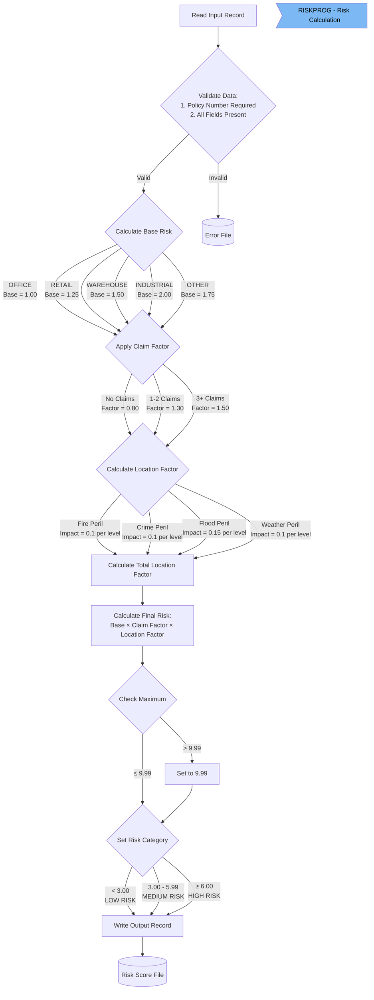

The Commercial Property Risk Assessment batch process evaluates risk scores for active insurance policies monthly. It combines property data and claims history to generate standardized risk scores that inform policy decisions.

Key components:

- Data extraction from policy and claims databases

- Risk calculation based on property type, claims, and location hazards

- Risk categorization (low/medium/high) and database updates

The process runs through two linked JCL jobs and a COBOL program that applies the business rules to calculate final risk scores between 1.00-9.99.

&nbsp;

# High Level Flow Diagram


# Risk Calculation Business Flow Diagram



# Technical Flow Code Walkthrough

## <SwmToken path="/base/cntl/comrisk1.jcl" pos="1:1:1" line-data="//COMRISK1 JOB 241901,&#39;RISK CALC&#39;,NOTIFY=&amp;SYSUID,CLASS=A,MSGCLASS=H">`COMRISK1`</SwmToken>

<SwmSnippet path="/base/cntl/comrisk1.jcl" line="6">

---

First, we delete the temporary dataset if it exists (<SwmToken path="/base/cntl/comrisk1.jcl" pos="6:1:1" line-data="//STEP010  EXEC PGM=IDCAMS ">`STEP010`</SwmToken>)

```jcl
//STEP010  EXEC PGM=IDCAMS 
//SYSPRINT DD SYSOUT=*
//SYSIN    DD *
  DELETE <USRHLQ>.RISK.TEMPDATA
  IF MAXCC=8 THEN SET MAXCC=0
/*
```

---

</SwmSnippet>

<SwmSnippet path="/base/cntl/comrisk1.jcl" line="12">

---

Then, we create a new temporary dataset (<SwmToken path="/base/cntl/comrisk1.jcl" pos="12:1:1" line-data="//STEP020  EXEC PGM=IEFBR14">`STEP020`</SwmToken>)

```jcl
//STEP020  EXEC PGM=IEFBR14
//DD1      DD DSN=<USRHLQ>.RISK.TEMPDATA,
//            DISP=(NEW,CATLG,DELETE),
//            SPACE=(CYL,(10,5)),
//            DCB=(RECFM=FB,LRECL=400,BLKSIZE=0)
```

---

</SwmSnippet>

<SwmSnippet path="/base/cntl/comrisk1.jcl" line="18">

---

Next, we extract data from DB2 into the temporary dataset (<SwmToken path="/base/cntl/comrisk1.jcl" pos="18:1:1" line-data="//STEP030  EXEC PGM=IKJEFT01,DYNAMNBR=20">`STEP030`</SwmToken>)

```jcl
//STEP030  EXEC PGM=IKJEFT01,DYNAMNBR=20
//STEPLIB  DD DSN=<DB2HLQ>.SDSNLOAD,DISP=SHR
//SYSTSPRT DD SYSOUT=*
//SYSTSIN  DD *
   DSN SYSTEM(<DB2SSID>)
   RUN PROGRAM(DSNTIAD) PLAN(<DB2PLAN>)
//SYSPRINT DD SYSOUT=*
//SYSOUT   DD SYSOUT=*
//SYSIN    DD *
  UNLOAD DATA FROM TABLE
  (SELECT CAST(DIGITS(C.PolicyNumber) AS CHAR(10)) AS PolicyNumber,
         CAST(C.PropertyType AS CHAR(15)) AS PropertyType,
         CAST(C.Address AS CHAR(255)) AS Address,
         CAST(C.Zipcode AS CHAR(8)) AS Zipcode,
         CAST(DIGITS(C.FirePeril) AS CHAR(2)) AS FirePeril,
         CAST(DIGITS(C.CrimePeril) AS CHAR(2)) AS CrimePeril,
         CAST(DIGITS(C.FloodPeril) AS CHAR(2)) AS FloodPeril,
         CAST(DIGITS(C.WeatherPeril) AS CHAR(2)) AS WeatherPeril,
         CAST(DIGITS(COUNT(CL.ClaimNumber)) AS CHAR(3)) AS ClaimCount,
         CAST(DIGITS(COALESCE(SUM(CL.Value), 0)) AS CHAR(9)) AS TotalClaimValue
    FROM <DB2DBID>.COMMERCIAL C
    LEFT JOIN <DB2DBID>.CLAIM CL 
         ON C.PolicyNumber = CL.PolicyNumber
         AND CL.ClaimDate >= CURRENT DATE - 2 YEARS
    WHERE C.Status = 1
    GROUP BY C.PolicyNumber, C.PropertyType, C.Address,
             C.Zipcode, C.FirePeril, C.CrimePeril,
             C.FloodPeril, C.WeatherPeril)
  INTO <USRHLQ>.RISK.TEMPDATA;
```

---

</SwmSnippet>

<SwmSnippet path="/base/cntl/comrisk1.jcl" line="51">

---

Lastly we submit <SwmToken path="/base/cntl/comrisk1.jcl" pos="53:1:1" line-data="//COMRISK2 JOB 241901,&#39;UPDATE DB&#39;,NOTIFY=&amp;SYSUID,CLASS=A,MSGCLASS=H">`COMRISK2`</SwmToken> (<SwmToken path="/base/cntl/comrisk1.jcl" pos="51:1:1" line-data="//STEP040  EXEC PGM=IEBGENER">`STEP040`</SwmToken>)

```jcl
//STEP040  EXEC PGM=IEBGENER
//SYSUT1   DD *
//COMRISK2 JOB 241901,'UPDATE DB',NOTIFY=&SYSUID,CLASS=A,MSGCLASS=H
/*
//SYSUT2   DD SYSOUT=(A,INTRDR)
//SYSPRINT DD SYSOUT=*
//SYSIN    DD DUMMY
```

---

</SwmSnippet>

## Risk Calculation

<SwmSnippet path="/base/src/lgarsk01.cbl" line="70">

---

### Initialization and Data Validation

```cobol
       1000-INIT.
           OPEN INPUT  INPUT-FILE
                OUTPUT OUTPUT-FILE
                OUTPUT ERROR-FILE
           IF WS-INPUT-STATUS NOT = '00'
               DISPLAY 'INPUT FILE OPEN ERROR: ' WS-INPUT-STATUS
               MOVE 'Y' TO WS-EOF
           END-IF.

       2000-PROCESS.
           READ INPUT-FILE
               AT END MOVE 'Y' TO WS-EOF
               GO TO 2000-EXIT
           END-READ

           IF WS-INPUT-STATUS NOT = '00'
               MOVE IN-POLICY-NUM TO ERR-POLICY-NUM
               MOVE 'ERROR READING RECORD' TO ERR-MESSAGE
               WRITE ERROR-RECORD
               GO TO 2000-EXIT
           END-IF

           PERFORM 2100-VALIDATE-DATA
```

---

</SwmSnippet>

<SwmSnippet path="/base/src/lgarsk01.cbl" line="100">

---

Data validation is done here:

```cobol
       2100-VALIDATE-DATA.
           IF IN-POLICY-NUM = SPACES
               MOVE 'INVALID POLICY NUMBER' TO ERR-MESSAGE
               WRITE ERROR-RECORD
               GO TO 2000-EXIT
           END-IF.
```

---

</SwmSnippet>

### 

<SwmSnippet path="/base/src/lgarsk01.cbl" line="109">

---

### Calculate Base Risk

Based on the property type, we calculate the base risk:

```cobol
           EVALUATE IN-PROPERTY-TYPE
               WHEN 'OFFICE'
                   MOVE 1.00 TO WS-BASE-RISK
               WHEN 'RETAIL'
                   MOVE 1.25 TO WS-BASE-RISK
               WHEN 'WAREHOUSE'
                   MOVE 1.50 TO WS-BASE-RISK
               WHEN 'INDUSTRIAL'
                   MOVE 2.00 TO WS-BASE-RISK
               WHEN OTHER
                   MOVE 1.75 TO WS-BASE-RISK
           END-EVALUATE
```

---

</SwmSnippet>

### 

<SwmSnippet path="/base/src/lgarsk01.cbl" line="123">

---

### Apply Claim Factor

```cobol
           IF IN-CLAIM-COUNT = 0
               MOVE 0.80 TO WS-CLAIM-FACTOR
           ELSE IF IN-CLAIM-COUNT <= 2
               MOVE 1.30 TO WS-CLAIM-FACTOR
           ELSE
               MOVE 1.50 TO WS-CLAIM-FACTOR
           END-IF
```

---

</SwmSnippet>

### 

<SwmSnippet path="/base/src/lgarsk01.cbl" line="132">

---

### Calculate Location Factor

```cobol
           COMPUTE WS-LOCATION-FACTOR = 1 +
               (IN-FIRE-PERIL * 0.1) +
               (IN-CRIME-PERIL * 0.1) +
               (IN-FLOOD-PERIL * 0.15) +
               (IN-WEATHER-PERIL * 0.1)
```

---

</SwmSnippet>

### 

<SwmSnippet path="/base/src/lgarsk01.cbl" line="139">

---

### Calculate Final Risk

Note there is a maximum of <SwmToken path="/base/src/lgarsk01.cbl" pos="143:11:13" line-data="           IF WS-FINAL-RISK &gt; 9.99">`9.99`</SwmToken>

```
           COMPUTE WS-FINAL-RISK ROUNDED =
               WS-BASE-RISK * WS-CLAIM-FACTOR * WS-LOCATION-FACTOR

      * Ensure risk score doesn't exceed maximum
           IF WS-FINAL-RISK > 9.99
               MOVE 9.99 TO WS-FINAL-RISK
           END-IF.
```

---

</SwmSnippet>

### 

<SwmSnippet path="/base/src/lgarsk01.cbl" line="151">

---

### Set Risk Category

```cobol
           EVALUATE TRUE
               WHEN WS-FINAL-RISK < 3.00
                   MOVE 'LOW      ' TO OUT-RISK-CATEGORY
               WHEN WS-FINAL-RISK < 6.00
                   MOVE 'MEDIUM   ' TO OUT-RISK-CATEGORY
               WHEN OTHER
                   MOVE 'HIGH     ' TO OUT-RISK-CATEGORY
           END-EVALUATE
```

---

</SwmSnippet>

## <SwmToken path="/base/cntl/comrisk1.jcl" pos="53:1:1" line-data="//COMRISK2 JOB 241901,&#39;UPDATE DB&#39;,NOTIFY=&amp;SYSUID,CLASS=A,MSGCLASS=H">`COMRISK2`</SwmToken>

<SwmSnippet path="/base/cntl/comrisk2.jcl" line="6">

---

We execute <SwmToken path="/base/cntl/comrisk2.jcl" pos="6:7:7" line-data="//STEP010  EXEC PGM=RISKPROG">`RISKPROG`</SwmToken> to calculate the risk:

```jcl
//STEP010  EXEC PGM=RISKPROG
//STEPLIB  DD DSN=<LOADLIB>,DISP=SHR
//INFILE   DD DSN=<USRHLQ>.RISK.TEMPDATA,DISP=SHR
//OUTFILE  DD DSN=<USRHLQ>.RISK.RISKOUT,
//            DISP=(NEW,CATLG,DELETE),
//            SPACE=(CYL,(5,2)),
//            DCB=(RECFM=FB,LRECL=100,BLKSIZE=0)
//ERRFILE  DD SYSOUT=*
//SYSOUT   DD SYSOUT=*
//SYSPRINT DD SYSOUT=*
```

---

</SwmSnippet>

<SwmSnippet path="/base/cntl/comrisk2.jcl" line="17">

---

Then we update the DB with the results:

```jcl
//STEP020  EXEC PGM=IKJEFT01,DYNAMNBR=20
//STEPLIB  DD DSN=<DB2HLQ>.SDSNLOAD,DISP=SHR
//SYSTSPRT DD SYSOUT=*
//SYSTSIN  DD *
   DSN SYSTEM(<DB2SSID>)
   RUN PROGRAM(DSNTIAD) PLAN(<DB2PLAN>)
//SYSPRINT DD SYSOUT=*
//SYSIN    DD *
  UPDATE <DB2DBID>.COMMERCIAL C
  SET (RiskScore, LastRiskAssessment) =
      (SELECT DECIMAL(SUBSTR(R.OUT_RISK_SCORE,1,3) || '.' ||
              SUBSTR(R.OUT_RISK_SCORE,4,2), 5, 2),
              CURRENT DATE
       FROM SYSIBM.SYSDUMMY1,
       <USRHLQ>.RISK.RISKOUT R
       WHERE C.PolicyNumber = INTEGER(R.OUT_POLICY_NUM));

  INSERT INTO <DB2DBID>.RISK_HISTORY
      (PolicyNumber, 
       AssessmentDate, 
       RiskScore, 
       RiskCategory)
  SELECT INTEGER(OUT_POLICY_NUM),
         CURRENT TIMESTAMP,
         DECIMAL(SUBSTR(OUT_RISK_SCORE,1,3) || '.' ||
                SUBSTR(OUT_RISK_SCORE,4,2), 5, 2),
         RTRIM(OUT_RISK_CATEGORY)
  FROM <USRHLQ>.RISK.RISKOUT;
```

---

</SwmSnippet>

<SwmSnippet path="/base/cntl/comrisk2.jcl" line="46">

---

And generate the report:

```jcl
//STEP030  EXEC PGM=SORT
//SYSOUT   DD SYSOUT=*
//SORTIN   DD DSN=<USRHLQ>.RISK.RISKOUT,DISP=SHR
//SORTOUT  DD SYSOUT=*,DCB=(RECFM=FBA,LRECL=133)
//SYSIN    DD *
  SORT FIELDS=(12,10,CH,D)    * Sort by risk score descending
  OUTFIL BUILD=(1:1,10,       * Policy Number
                12:12,5,      * Risk Score
                18:22,10,     * Risk Category
                30:'Report Date: ',
                42:&DATE,
                120:X)        * New line
  HEADER1=('Commercial Policy Risk Assessment Report',
           ' ',
           'Policy     Risk   Risk',
           'Number     Score  Category',
           ' ')
  TRAILER1=(' ',
           'End of Report',
           ' ',
           'Total Policies Processed: ',
           COUNT=(M11,LENGTH=6))
```

---

</SwmSnippet>

<SwmSnippet path="/base/cntl/comrisk2.jcl" line="69">

---

Lastly we cleanup temporary files:

```jcl
//STEP040  EXEC PGM=IDCAMS
//SYSPRINT DD SYSOUT=*
//SYSIN    DD *
  DELETE <USRHLQ>.RISK.TEMPDATA
  DELETE <USRHLQ>.RISK.RISKOUT
  IF MAXCC=8 THEN SET MAXCC=0
/*
//
```

---

</SwmSnippet>

<SwmMeta version="3.0.0" repo-id="Z2l0aHViJTNBJTNBa3luZHJ5bC1jaWNzLWdlbmFwcCUzQSUzQVN3aW1tLURlbW8=" repo-name="kyndryl-cics-genapp"><sup>Powered by [Swimm](https://app.swimm.io/)</sup></SwmMeta>
