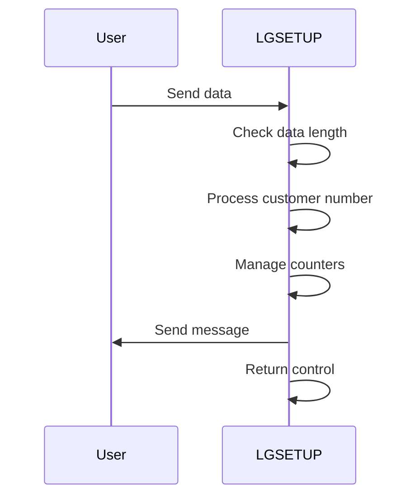
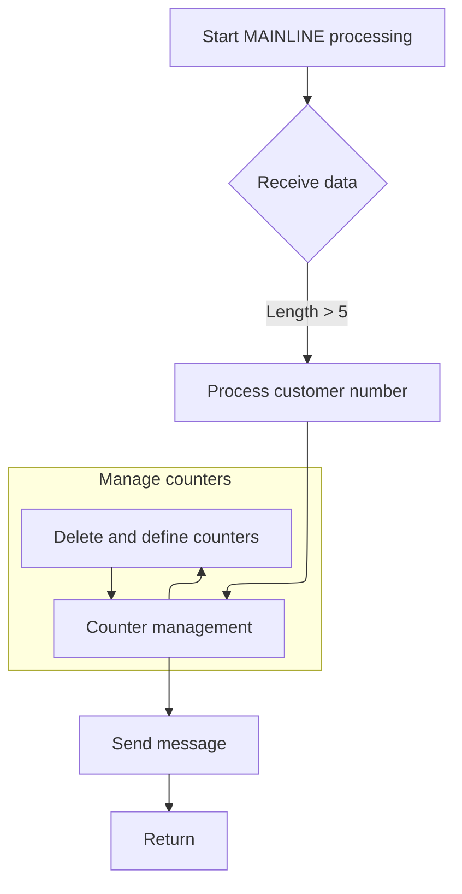

The LGSETUP program (LGSETUP) is designed to initialize customer-related counters and send messages based on received data. It begins by receiving data, processing customer numbers, managing counters, and finally sending messages to the terminal.

For example, if the received data length is greater than 5, the program processes the customer number and updates counters accordingly, then sends a message to the terminal.

The main steps are:

- Receive data and check its length
- Process customer number
- Manage counters by deleting and defining them
- Send messages to terminal
- Return control



## Dependencies

# Initiating Data Reception



<SwmSnippet path="/base/src/lgsetup.cbl" line="126">

---

In <SwmToken path="base/src/lgsetup.cbl" pos="126:1:1" line-data="       MAINLINE SECTION.">`MAINLINE`</SwmToken>, the flow starts with the CICS RECEIVE command, which grabs data into <SwmToken path="base/src/lgsetup.cbl" pos="128:9:11" line-data="           EXEC CICS RECEIVE INTO(WS-RECV)">`WS-RECV`</SwmToken>. It checks if the data length is more than 5, subtracts 5, and moves the data to <SwmToken path="base/src/lgsetup.cbl" pos="134:20:20" line-data="             Move WS-RECV-DATA(1:WS-RECV-LEN)  To LastCustNum">`LastCustNum`</SwmToken>.

```cobol
       MAINLINE SECTION.
      *
           EXEC CICS RECEIVE INTO(WS-RECV)
               LENGTH(WS-RECV-LEN)
               RESP(WS-RESP)
           END-EXEC
```

---

</SwmSnippet>

<SwmSnippet path="/base/src/lgsetup.cbl" line="132">

---

Next in <SwmToken path="base/src/lgsetup.cbl" pos="126:1:1" line-data="       MAINLINE SECTION.">`MAINLINE`</SwmToken>, if the received data length exceeds 5, it subtracts 5 and moves the relevant data to <SwmToken path="base/src/lgsetup.cbl" pos="134:20:20" line-data="             Move WS-RECV-DATA(1:WS-RECV-LEN)  To LastCustNum">`LastCustNum`</SwmToken> for further use.

```cobol
           If WS-RECV-LEN > 5
             Subtract 5 From WS-RECV-LEN
             Move WS-RECV-DATA(1:WS-RECV-LEN)  To LastCustNum
           End-if
```

---

</SwmSnippet>

<SwmSnippet path="/base/src/lgsetup.cbl" line="138">

---

This is the implementation of deleting the <SwmToken path="base/src/lgsetup.cbl" pos="138:11:13" line-data="           Exec CICS DeleteQ TS Queue(STSQ-ERRS)">`STSQ-ERRS`</SwmToken> queue to clear old data before new data is written.

```cobol
           Exec CICS DeleteQ TS Queue(STSQ-ERRS)
                     Resp(WS-RESP)
           End-Exec.
```

---

</SwmSnippet>

<SwmSnippet path="/base/src/lgsetup.cbl" line="142">

---

This snippet clears the <SwmToken path="base/src/lgsetup.cbl" pos="142:11:13" line-data="           Exec CICS DeleteQ TS Queue(STSQ-STRT)">`STSQ-STRT`</SwmToken> queue.

```cobol
           Exec CICS DeleteQ TS Queue(STSQ-STRT)
                     Resp(WS-RESP)
           End-Exec.
```

---

</SwmSnippet>

<SwmSnippet path="/base/src/lgsetup.cbl" line="146">

---

This snippet deletes the <SwmToken path="base/src/lgsetup.cbl" pos="146:11:13" line-data="           Exec CICS DeleteQ TS Queue(STSQ-STAT)">`STSQ-STAT`</SwmToken> queue, resetting any status data to avoid conflicts with new data.

```cobol
           Exec CICS DeleteQ TS Queue(STSQ-STAT)
                     Resp(WS-RESP)
           End-Exec.
```

---

</SwmSnippet>

<SwmSnippet path="/base/src/lgsetup.cbl" line="150">

---

This snippet clears the <SwmToken path="base/src/lgsetup.cbl" pos="150:11:13" line-data="           Exec CICS DeleteQ TS Queue(STSQ-NAME)">`STSQ-NAME`</SwmToken> queue.

```cobol
           Exec CICS DeleteQ TS Queue(STSQ-NAME)
                     Resp(WS-RESP)
           End-Exec.
```

---

</SwmSnippet>

<SwmSnippet path="/base/src/lgsetup.cbl" line="154">

---

This snippet writes three messages to the <SwmToken path="base/src/lgsetup.cbl" pos="157:11:13" line-data="             EXEC CICS WRITEQ TS QUEUE(STSQ-NAME)">`STSQ-NAME`</SwmToken> queue, each with different lengths and using the NOSUSPEND option to avoid task suspension.

```cobol
           Move FrstCustNum  to WRITE-MSG-LOW
           Move LastCustNum  to WRITE-MSG-HIGH

             EXEC CICS WRITEQ TS QUEUE(STSQ-NAME)
                       FROM(WRITE-MSG-E)
                       RESP(WS-RESP)
                       NOSUSPEND
                       LENGTH(20)
             END-EXEC

             EXEC CICS WRITEQ TS QUEUE(STSQ-NAME)
                       FROM(WRITE-MSG-L)
                       RESP(WS-RESP)
                       NOSUSPEND
                       LENGTH(23)
             END-EXEC

             EXEC CICS WRITEQ TS QUEUE(STSQ-NAME)
                       FROM(WRITE-MSG-H)
                       RESP(WS-RESP)
                       NOSUSPEND
                       LENGTH(24)
             END-EXEC
```

---

</SwmSnippet>

<SwmSnippet path="/base/src/lgsetup.cbl" line="179">

---

This snippet resets the <SwmToken path="base/src/lgsetup.cbl" pos="179:9:9" line-data="           Exec CICS Delete Counter(GENAcount)">`GENAcount`</SwmToken> counter to <SwmToken path="base/src/lgsetup.cbl" pos="185:3:3" line-data="                            Value(LastCustNum)">`LastCustNum`</SwmToken>.

```cobol
           Exec CICS Delete Counter(GENAcount)
                            Pool(GENApool)
                            Resp(WS-RESP)
           End-Exec.
           Exec CICS Define Counter(GENAcount)
                            Pool(GENApool)
                            Value(LastCustNum)
                            Resp(WS-RESP)
           End-Exec.
```

---

</SwmSnippet>

<SwmSnippet path="/base/src/lgsetup.cbl" line="189">

---

This snippet resets the <SwmToken path="base/src/lgsetup.cbl" pos="189:9:9" line-data="           Exec CICS Delete Counter(GENACNT100)">`GENACNT100`</SwmToken> counter to zero, clearing any previous counts.

```cobol
           Exec CICS Delete Counter(GENACNT100)
                            Pool(GENApool)
                            Resp(WS-RESP)
           End-Exec.
           Exec CICS Define Counter(GENACNT100)
                            Pool(GENApool)
                            Value(0)
                            Resp(WS-RESP)
           End-Exec.
           Exec CICS Delete Counter(GENACNT199)
                            Pool(GENApool)
                            Resp(WS-RESP)
           End-Exec.
           Exec CICS Define Counter(GENACNT199)
                            Pool(GENApool)
                            Value(0)
                            Resp(WS-RESP)
           End-Exec.
```

---

</SwmSnippet>

<SwmSnippet path="/base/src/lgsetup.cbl" line="207">

---

This snippet resets <SwmToken path="base/src/lgsetup.cbl" pos="198:9:9" line-data="           Exec CICS Delete Counter(GENACNT199)">`GENACNT199`</SwmToken> to zero.

```cobol
           Exec CICS Delete Counter(GENACNT200)
                            Pool(GENApool)
                            Resp(WS-RESP)
           End-Exec.
           Exec CICS Define Counter(GENACNT200)
                            Pool(GENApool)
                            Value(0)
                            Resp(WS-RESP)
           End-Exec.
           Exec CICS Delete Counter(GENACNT299)
                            Pool(GENApool)
                            Resp(WS-RESP)
           End-Exec.
           Exec CICS Define Counter(GENACNT299)
                            Pool(GENApool)
                            Value(0)
                            Resp(WS-RESP)
           End-Exec.
```

---

</SwmSnippet>

<SwmSnippet path="/base/src/lgsetup.cbl" line="226">

---

This snippet resets the <SwmToken path="base/src/lgsetup.cbl" pos="207:9:9" line-data="           Exec CICS Delete Counter(GENACNT200)">`GENACNT200`</SwmToken> counter to zero, preparing it for new operations.

```cobol
           Exec CICS Delete Counter(GENACNT300)
                            Pool(GENApool)
                            Resp(WS-RESP)
           End-Exec.
           Exec CICS Define Counter(GENACNT300)
                            Pool(GENApool)
                            Value(0)
                            Resp(WS-RESP)
           End-Exec.
           Exec CICS Delete Counter(GENACNT399)
                            Pool(GENApool)
                            Resp(WS-RESP)
           End-Exec.
           Exec CICS Define Counter(GENACNT399)
                            Pool(GENApool)
                            Value(0)
                            Resp(WS-RESP)
           End-Exec.
```

---

</SwmSnippet>

<SwmSnippet path="/base/src/lgsetup.cbl" line="244">

---

This snippet resets <SwmToken path="base/src/lgsetup.cbl" pos="216:9:9" line-data="           Exec CICS Delete Counter(GENACNT299)">`GENACNT299`</SwmToken> to zero.

```cobol
           Exec CICS Delete Counter(GENACNT400)
                            Pool(GENApool)
                            Resp(WS-RESP)
           End-Exec.
           Exec CICS Define Counter(GENACNT400)
                            Pool(GENApool)
                            Value(0)
                            Resp(WS-RESP)
           End-Exec.
           Exec CICS Delete Counter(GENACNT499)
                            Pool(GENApool)
                            Resp(WS-RESP)
           End-Exec.
           Exec CICS Define Counter(GENACNT499)
                            Pool(GENApool)
                            Value(0)
                            Resp(WS-RESP)
           End-Exec.
```

---

</SwmSnippet>

<SwmSnippet path="/base/src/lgsetup.cbl" line="262">

---

This snippet resets <SwmToken path="base/src/lgsetup.cbl" pos="226:9:9" line-data="           Exec CICS Delete Counter(GENACNT300)">`GENACNT300`</SwmToken> to zero.

```cobol
           Exec CICS Delete Counter(GENACNT500)
                            Pool(GENApool)
                            Resp(WS-RESP)
           End-Exec.
           Exec CICS Define Counter(GENACNT500)
                            Pool(GENApool)
                            Value(0)
                            Resp(WS-RESP)
           End-Exec.
           Exec CICS Delete Counter(GENACNT599)
                            Pool(GENApool)
                            Resp(WS-RESP)
           End-Exec.
           Exec CICS Define Counter(GENACNT599)
                            Pool(GENApool)
                            Value(0)
                            Resp(WS-RESP)
           End-Exec.
```

---

</SwmSnippet>

<SwmSnippet path="/base/src/lgsetup.cbl" line="280">

---

This snippet resets <SwmToken path="base/src/lgsetup.cbl" pos="235:9:9" line-data="           Exec CICS Delete Counter(GENACNT399)">`GENACNT399`</SwmToken> to zero.

```cobol
           Exec CICS Delete Counter(GENACNT600)
                            Pool(GENApool)
                            Resp(WS-RESP)
           End-Exec.
           Exec CICS Define Counter(GENACNT600)
                            Pool(GENApool)
                            Value(0)
                            Resp(WS-RESP)
           End-Exec.
           Exec CICS Delete Counter(GENACNT699)
                            Pool(GENApool)
                            Resp(WS-RESP)
           End-Exec.
           Exec CICS Define Counter(GENACNT699)
                            Pool(GENApool)
                            Value(0)
                            Resp(WS-RESP)
           End-Exec.
```

---

</SwmSnippet>

<SwmSnippet path="/base/src/lgsetup.cbl" line="299">

---

This snippet resets <SwmToken path="base/src/lgsetup.cbl" pos="244:9:9" line-data="           Exec CICS Delete Counter(GENACNT400)">`GENACNT400`</SwmToken> to zero.

```cobol
           Exec CICS Delete Counter(GENACNT700)
                            Pool(GENApool)
                            Resp(WS-RESP)
           End-Exec.
           Exec CICS Define Counter(GENACNT700)
                            Pool(GENApool)
                            Value(0)
                            Resp(WS-RESP)
           End-Exec.
           Exec CICS Delete Counter(GENACNT799)
                            Pool(GENApool)
                            Resp(WS-RESP)
           End-Exec.
           Exec CICS Define Counter(GENACNT799)
                            Pool(GENApool)
                            Value(0)
                            Resp(WS-RESP)
           End-Exec.
```

---

</SwmSnippet>

<SwmSnippet path="/base/src/lgsetup.cbl" line="317">

---

This snippet resets <SwmToken path="base/src/lgsetup.cbl" pos="253:9:9" line-data="           Exec CICS Delete Counter(GENACNT499)">`GENACNT499`</SwmToken> to zero.

```cobol
           Exec CICS Delete Counter(GENACNT800)
                            Pool(GENApool)
                            Resp(WS-RESP)
           End-Exec.
           Exec CICS Define Counter(GENACNT800)
                            Pool(GENApool)
                            Value(0)
                            Resp(WS-RESP)
           End-Exec.
           Exec CICS Delete Counter(GENACNT899)
                            Pool(GENApool)
                            Resp(WS-RESP)
           End-Exec.
           Exec CICS Define Counter(GENACNT899)
                            Pool(GENApool)
                            Value(0)
                            Resp(WS-RESP)
           End-Exec.
```

---

</SwmSnippet>

<SwmSnippet path="/base/src/lgsetup.cbl" line="335">

---

This snippet resets <SwmToken path="base/src/lgsetup.cbl" pos="262:9:9" line-data="           Exec CICS Delete Counter(GENACNT500)">`GENACNT500`</SwmToken> to zero.

```cobol
           Exec CICS Delete Counter(GENACNT900)
                            Pool(GENApool)
                            Resp(WS-RESP)
           End-Exec.
           Exec CICS Define Counter(GENACNT900)
                            Pool(GENApool)
                            Value(0)
                            Resp(WS-RESP)
           End-Exec.
           Exec CICS Delete Counter(GENACNT999)
                            Pool(GENApool)
                            Resp(WS-RESP)
           End-Exec.
           Exec CICS Define Counter(GENACNT999)
                            Pool(GENApool)
                            Value(0)
                            Resp(WS-RESP)
           End-Exec.
```

---

</SwmSnippet>

<SwmSnippet path="/base/src/lgsetup.cbl" line="353">

---

This snippet resets <SwmToken path="base/src/lgsetup.cbl" pos="271:9:9" line-data="           Exec CICS Delete Counter(GENACNT599)">`GENACNT599`</SwmToken> to zero.

```cobol
           Exec CICS Delete Counter(GENACNTA00)
                            Pool(GENApool)
                            Resp(WS-RESP)
           End-Exec.
           Exec CICS Define Counter(GENACNTA00)
                            Pool(GENApool)
                            Value(0)
                            Resp(WS-RESP)
           End-Exec.
           Exec CICS Delete Counter(GENACNTA99)
                            Pool(GENApool)
                            Resp(WS-RESP)
           End-Exec.
           Exec CICS Define Counter(GENACNTA99)
                            Pool(GENApool)
                            Value(0)
                            Resp(WS-RESP)
           End-Exec.
```

---

</SwmSnippet>

<SwmSnippet path="/base/src/lgsetup.cbl" line="372">

---

This snippet resets <SwmToken path="base/src/lgsetup.cbl" pos="280:9:9" line-data="           Exec CICS Delete Counter(GENACNT600)">`GENACNT600`</SwmToken> to zero.

```cobol
           Exec CICS Delete Counter(GENACNTB00)
                            Pool(GENApool)
                            Resp(WS-RESP)
           End-Exec.
           Exec CICS Define Counter(GENACNTB00)
                            Pool(GENApool)
                            Value(0)
                            Resp(WS-RESP)
           End-Exec.
           Exec CICS Delete Counter(GENACNTB99)
                            Pool(GENApool)
                            Resp(WS-RESP)
           End-Exec.
           Exec CICS Define Counter(GENACNTB99)
                            Pool(GENApool)
                            Value(0)
                            Resp(WS-RESP)
           End-Exec.
```

---

</SwmSnippet>

<SwmSnippet path="/base/src/lgsetup.cbl" line="390">

---

This snippet resets <SwmToken path="base/src/lgsetup.cbl" pos="289:9:9" line-data="           Exec CICS Delete Counter(GENACNT699)">`GENACNT699`</SwmToken> to zero.

```cobol
           Exec CICS Delete Counter(GENACNTC00)
                            Pool(GENApool)
                            Resp(WS-RESP)
           End-Exec.
           Exec CICS Define Counter(GENACNTC00)
                            Pool(GENApool)
                            Value(0)
                            Resp(WS-RESP)
           End-Exec.
           Exec CICS Delete Counter(GENACNTC99)
                            Pool(GENApool)
                            Resp(WS-RESP)
           End-Exec.
           Exec CICS Define Counter(GENACNTC99)
                            Pool(GENApool)
                            Value(0)
                            Resp(WS-RESP)
           End-Exec.
```

---

</SwmSnippet>

<SwmSnippet path="/base/src/lgsetup.cbl" line="408">

---

This snippet resets <SwmToken path="base/src/lgsetup.cbl" pos="299:9:9" line-data="           Exec CICS Delete Counter(GENACNT700)">`GENACNT700`</SwmToken> to zero.

```cobol
           Exec CICS Delete Counter(GENACNTD00)
                            Pool(GENApool)
                            Resp(WS-RESP)
           End-Exec.
           Exec CICS Define Counter(GENACNTD00)
                            Pool(GENApool)
                            Value(0)
                            Resp(WS-RESP)
           End-Exec.
           Exec CICS Delete Counter(GENACNTD99)
                            Pool(GENApool)
                            Resp(WS-RESP)
           End-Exec.
           Exec CICS Define Counter(GENACNTD99)
                            Pool(GENApool)
                            Value(0)
                            Resp(WS-RESP)
           End-Exec.
```

---

</SwmSnippet>

<SwmSnippet path="/base/src/lgsetup.cbl" line="426">

---

This snippet resets <SwmToken path="base/src/lgsetup.cbl" pos="308:9:9" line-data="           Exec CICS Delete Counter(GENACNT799)">`GENACNT799`</SwmToken> to zero.

```cobol
           Exec CICS Delete Counter(GENACNTE00)
                            Pool(GENApool)
                            Resp(WS-RESP)
           End-Exec.
           Exec CICS Define Counter(GENACNTE00)
                            Pool(GENApool)
                            Value(0)
                            Resp(WS-RESP)
           End-Exec.
           Exec CICS Delete Counter(GENACNTE99)
                            Pool(GENApool)
                            Resp(WS-RESP)
           End-Exec.
           Exec CICS Define Counter(GENACNTE99)
                            Pool(GENApool)
                            Value(0)
                            Resp(WS-RESP)
           End-Exec.
```

---

</SwmSnippet>

<SwmSnippet path="/base/src/lgsetup.cbl" line="445">

---

This snippet resets <SwmToken path="base/src/lgsetup.cbl" pos="317:9:9" line-data="           Exec CICS Delete Counter(GENACNT800)">`GENACNT800`</SwmToken> to zero.

```cobol
           Exec CICS Delete Counter(GENACNTF00)
                            Pool(GENApool)
                            Resp(WS-RESP)
           End-Exec.
           Exec CICS Define Counter(GENACNTF00)
                            Pool(GENApool)
                            Value(0)
                            Resp(WS-RESP)
           End-Exec.
           Exec CICS Delete Counter(GENACNTF99)
                            Pool(GENApool)
                            Resp(WS-RESP)
           End-Exec.
           Exec CICS Define Counter(GENACNTF99)
                            Pool(GENApool)
                            Value(0)
                            Resp(WS-RESP)
           End-Exec.
```

---

</SwmSnippet>

<SwmSnippet path="/base/src/lgsetup.cbl" line="463">

---

This snippet resets <SwmToken path="base/src/lgsetup.cbl" pos="326:9:9" line-data="           Exec CICS Delete Counter(GENACNT899)">`GENACNT899`</SwmToken> to zero.

```cobol
           Exec CICS Delete Counter(GENACNTG00)
                            Pool(GENApool)
                            Resp(WS-RESP)
           End-Exec.
           Exec CICS Define Counter(GENACNTG00)
                            Pool(GENApool)
                            Value(0)
                            Resp(WS-RESP)
           End-Exec.
           Exec CICS Delete Counter(GENACNTG99)
                            Pool(GENApool)
                            Resp(WS-RESP)
           End-Exec.
           Exec CICS Define Counter(GENACNTG99)
                            Pool(GENApool)
                            Value(0)
                            Resp(WS-RESP)
           End-Exec.
```

---

</SwmSnippet>

<SwmSnippet path="/base/src/lgsetup.cbl" line="481">

---

This snippet resets <SwmToken path="base/src/lgsetup.cbl" pos="335:9:9" line-data="           Exec CICS Delete Counter(GENACNT900)">`GENACNT900`</SwmToken> to zero.

```cobol
           Exec CICS Delete Counter(GENACNTH00)
                            Pool(GENApool)
                            Resp(WS-RESP)
           End-Exec.
           Exec CICS Define Counter(GENACNTH00)
                            Pool(GENApool)
                            Value(0)
                            Resp(WS-RESP)
           End-Exec.
           Exec CICS Delete Counter(GENACNTH99)
                            Pool(GENApool)
                            Resp(WS-RESP)
           End-Exec.
           Exec CICS Define Counter(GENACNTH99)
                            Pool(GENApool)
                            Value(0)
                            Resp(WS-RESP)
           End-Exec.
```

---

</SwmSnippet>

<SwmSnippet path="/base/src/lgsetup.cbl" line="499">

---

This snippet resets <SwmToken path="base/src/lgsetup.cbl" pos="344:9:9" line-data="           Exec CICS Delete Counter(GENACNT999)">`GENACNT999`</SwmToken> to zero.

```cobol
           Exec CICS Delete Counter(GENACNTI00)
                            Pool(GENApool)
                            Resp(WS-RESP)
           End-Exec.
           Exec CICS Define Counter(GENACNTI00)
                            Pool(GENApool)
                            Value(0)
                            Resp(WS-RESP)
           End-Exec.
           Exec CICS Delete Counter(GENACNTI99)
                            Pool(GENApool)
                            Resp(WS-RESP)
           End-Exec.
           Exec CICS Define Counter(GENACNTI99)
                            Pool(GENApool)
                            Value(0)
                            Resp(WS-RESP)
           End-Exec.
```

---

</SwmSnippet>

<SwmSnippet path="/base/src/lgsetup.cbl" line="520">

---

Finally, the flow sends <SwmToken path="base/src/lgsetup.cbl" pos="520:11:15" line-data="             EXEC CICS SEND TEXT FROM(WRITE-MSG-H)">`WRITE-MSG-H`</SwmToken> to the terminal, erasing the screen and freeing the keyboard, then returns control.

```cobol
             EXEC CICS SEND TEXT FROM(WRITE-MSG-H)
              WAIT
              ERASE
              LENGTH(24)
              FREEKB
             END-EXEC

           EXEC CICS RETURN
           END-EXEC.
```

---

</SwmSnippet>

&nbsp;

*This is an auto-generated document by Swimm 🌊 and has not yet been verified by a human*

<SwmMeta version="3.0.0" repo-id="Z2l0aHViJTNBJTNBa3luZHJ5bC1jaWNzLWdlbmFwcCUzQSUzQVN3aW1tLURlbW8=" repo-name="kyndryl-cics-genapp"><sup>Powered by [Swimm](/)</sup></SwmMeta>
