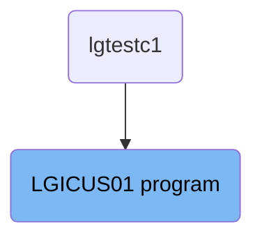
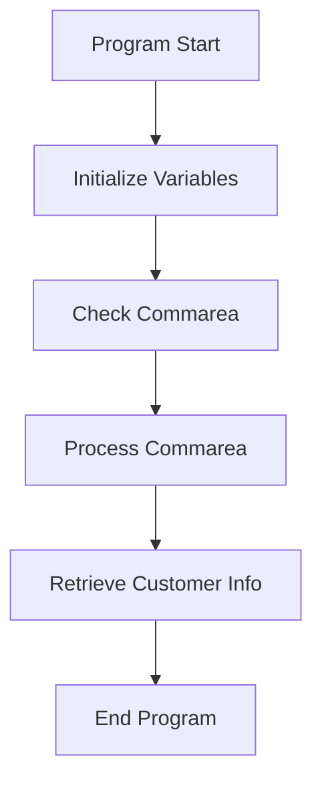

The <SwmToken path="base/src/lgicus01.cbl" pos="13:6:6" line-data="       PROGRAM-ID. LGICUS01.">`LGICUS01`</SwmToken> program is responsible for initializing variables, checking the communication area, processing the communication area, retrieving customer information, and ending the program. This flow ensures that customer information is accurately retrieved and processed within the system.

The flow starts with initializing variables needed for processing. It then checks if a communication area was received, and if not, it logs an error and ends the transaction. If the communication area is present, it processes the data, retrieves customer information by linking to another program (<SwmToken path="base/src/lgicus01.cbl" pos="122:9:9" line-data="           EXEC CICS LINK Program(LGICDB01)">`LGICDB01`</SwmToken>), and finally ends the program by returning control to CICS.

# Where is this program used?

This program is used once, in a flow starting from `lgtestc1` as represented in the following diagram:



Lets' zoom into the flow:



<SwmSnippet path="/base/src/lgicus01.cbl" line="77">

---

## Initialize Variables

First, the program initializes several working storage variables such as <SwmToken path="base/src/lgicus01.cbl" pos="79:3:5" line-data="           INITIALIZE WS-HEADER.">`WS-HEADER`</SwmToken>, <SwmToken path="base/src/lgicus01.cbl" pos="81:7:9" line-data="           MOVE EIBTRNID TO WS-TRANSID.">`WS-TRANSID`</SwmToken>, <SwmToken path="base/src/lgicus01.cbl" pos="82:7:9" line-data="           MOVE EIBTRMID TO WS-TERMID.">`WS-TERMID`</SwmToken>, and <SwmToken path="base/src/lgicus01.cbl" pos="83:7:9" line-data="           MOVE EIBTASKN TO WS-TASKNUM.">`WS-TASKNUM`</SwmToken> to prepare for processing.

```cobol
       MAINLINE SECTION.
      *
           INITIALIZE WS-HEADER.
      *
           MOVE EIBTRNID TO WS-TRANSID.
           MOVE EIBTRMID TO WS-TERMID.
           MOVE EIBTASKN TO WS-TASKNUM.
```

---

</SwmSnippet>

<SwmSnippet path="/base/src/lgicus01.cbl" line="84">

---

## Check Commarea

Next, the program checks if the <SwmToken path="base/src/lgicus01.cbl" pos="87:3:3" line-data="           IF EIBCALEN IS EQUAL TO ZERO">`EIBCALEN`</SwmToken> is zero, indicating no communication area was received. If true, it moves an error message to <SwmToken path="base/src/lgicus01.cbl" pos="88:14:16" line-data="               MOVE &#39; NO COMMAREA RECEIVED&#39; TO EM-VARIABLE">`EM-VARIABLE`</SwmToken>, performs the <SwmToken path="base/src/lgicus01.cbl" pos="89:3:7" line-data="               PERFORM WRITE-ERROR-MESSAGE">`WRITE-ERROR-MESSAGE`</SwmToken> procedure, and abends the transaction with code 'LGCA'.

```cobol
      *----------------------------------------------------------------*
      * Check commarea and obtain required details                     *
      *----------------------------------------------------------------*
           IF EIBCALEN IS EQUAL TO ZERO
               MOVE ' NO COMMAREA RECEIVED' TO EM-VARIABLE
               PERFORM WRITE-ERROR-MESSAGE
               EXEC CICS ABEND ABCODE('LGCA') NODUMP END-EXEC
           END-IF
```

---

</SwmSnippet>

<SwmSnippet path="/base/src/lgicus01.cbl" line="92">

---

## Process Commarea

Then, the program processes the incoming commarea by setting initial values for <SwmToken path="base/src/lgicus01.cbl" pos="93:9:13" line-data="           MOVE &#39;00&#39; TO CA-RETURN-CODE">`CA-RETURN-CODE`</SwmToken> and <SwmToken path="base/src/lgicus01.cbl" pos="94:9:13" line-data="           MOVE &#39;00&#39; TO CA-NUM-POLICIES">`CA-NUM-POLICIES`</SwmToken>, and checks if the commarea length is less than the required length. If true, it sets the return code to '98' and returns control to CICS.

```cobol

           MOVE '00' TO CA-RETURN-CODE
           MOVE '00' TO CA-NUM-POLICIES
           MOVE EIBCALEN TO WS-CALEN.
           SET WS-ADDR-DFHCOMMAREA TO ADDRESS OF DFHCOMMAREA.

      *----------------------------------------------------------------*
      * Process incoming commarea                                      *
      *----------------------------------------------------------------*
      * check commarea length
           MOVE WS-CUSTOMER-LEN        TO WS-REQUIRED-CA-LEN
           ADD WS-CA-HEADERTRAILER-LEN TO WS-REQUIRED-CA-LEN
           IF EIBCALEN IS LESS THAN WS-REQUIRED-CA-LEN
             MOVE '98' TO CA-RETURN-CODE
             EXEC CICS RETURN END-EXEC
           END-IF
```

---

</SwmSnippet>

<SwmSnippet path="/base/src/lgicus01.cbl" line="108">

---

## Retrieve Customer Info

Moving to the next step, the program performs the <SwmToken path="base/src/lgicus01.cbl" pos="109:3:7" line-data="           PERFORM GET-CUSTOMER-INFO.">`GET-CUSTOMER-INFO`</SwmToken> paragraph to retrieve customer information.

```cobol

           PERFORM GET-CUSTOMER-INFO.
```

---

</SwmSnippet>

<SwmSnippet path="/base/src/lgicus01.cbl" line="110">

---

## End Program

Finally, the program reaches the <SwmToken path="base/src/lgicus01.cbl" pos="114:1:3" line-data="       MAINLINE-END.">`MAINLINE-END`</SwmToken> paragraph and returns control to CICS, ending the program.

```cobol

      *----------------------------------------------------------------*
      * END PROGRAM and return to caller                               *
      *----------------------------------------------------------------*
       MAINLINE-END.
           EXEC CICS RETURN END-EXEC.

```

---

</SwmSnippet>

<SwmSnippet path="/base/src/lgicus01.cbl" line="120">

---

### <SwmToken path="base/src/lgicus01.cbl" pos="120:1:5" line-data="       GET-CUSTOMER-INFO.">`GET-CUSTOMER-INFO`</SwmToken>

The <SwmToken path="base/src/lgicus01.cbl" pos="120:1:5" line-data="       GET-CUSTOMER-INFO.">`GET-CUSTOMER-INFO`</SwmToken> paragraph links to the <SwmToken path="base/src/lgicus01.cbl" pos="122:9:9" line-data="           EXEC CICS LINK Program(LGICDB01)">`LGICDB01`</SwmToken> program, passing the commarea to retrieve customer information from the database.

More about <SwmToken path="base/src/lgicus01.cbl" pos="122:9:9" line-data="           EXEC CICS LINK Program(LGICDB01)">`LGICDB01`</SwmToken>: <SwmLink doc-title="Retrieving Customer Details (LGICDB01)">[Retrieving Customer Details (LGICDB01)](/.swm/retrieving-customer-details-lgicdb01.mx84ber5.sw.md)</SwmLink>

```cobol
       GET-CUSTOMER-INFO.

           EXEC CICS LINK Program(LGICDB01)
               Commarea(DFHCOMMAREA)
               LENGTH(32500)
           END-EXEC
      

           EXIT.
```

---

</SwmSnippet>

&nbsp;

*This is an auto-generated document by Swimm 🌊 and has not yet been verified by a human*

<SwmMeta version="3.0.0" repo-id="Z2l0aHViJTNBJTNBa3luZHJ5bC1jaWNzLWdlbmFwcCUzQSUzQVN3aW1tLURlbW8=" repo-name="kyndryl-cics-genapp"><sup>Powered by [Swimm](/)</sup></SwmMeta>
