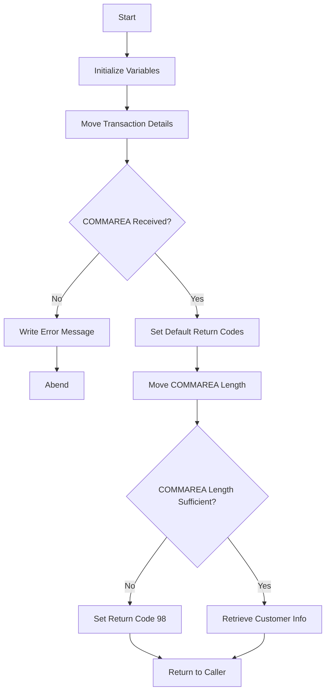

This document will cover the <SwmToken path="base/src/lgicus01.cbl" pos="13:6:6" line-data="       PROGRAM-ID. LGICUS01.">`LGICUS01`</SwmToken> program. We'll cover:

1. What the Program Does
2. Program Flow
3. Program Sections

## What the Program Does

The <SwmToken path="base/src/lgicus01.cbl" pos="13:6:6" line-data="       PROGRAM-ID. LGICUS01.">`LGICUS01`</SwmToken> program is designed to inquire about customer details from a database. It initializes necessary variables, checks the communication area (COMMAREA), processes incoming data, and retrieves customer information by linking to another program, <SwmToken path="base/src/lgicus01.cbl" pos="52:3:3" line-data="       01 LGICDB01                  PIC X(8) Value &#39;LGICDB01&#39;.">`LGICDB01`</SwmToken>.

## Program Flow

The program follows these high-level steps:

1. Initialize working storage variables.
2. Move transaction details to working storage.
3. Check if the COMMAREA is received.
4. Set default return codes and move COMMAREA length to working storage.
5. Check if the COMMAREA length is sufficient.
6. Retrieve customer information by linking to the <SwmToken path="base/src/lgicus01.cbl" pos="52:3:3" line-data="       01 LGICDB01                  PIC X(8) Value &#39;LGICDB01&#39;.">`LGICDB01`</SwmToken> program.
7. Return control to the caller.



<SwmSnippet path="/base/src/lgicus01.cbl" line="77">

---

## Program Sections

First, the program initializes the working storage variables and moves transaction details to the working storage.

```cobol
       MAINLINE SECTION.
      *
           INITIALIZE WS-HEADER.
      *
           MOVE EIBTRNID TO WS-TRANSID.
           MOVE EIBTRMID TO WS-TERMID.
           MOVE EIBTASKN TO WS-TASKNUM.
      *----------------------------------------------------------------*
      * Check commarea and obtain required details                     *
      *----------------------------------------------------------------*
           IF EIBCALEN IS EQUAL TO ZERO
               MOVE ' NO COMMAREA RECEIVED' TO EM-VARIABLE
               PERFORM WRITE-ERROR-MESSAGE
               EXEC CICS ABEND ABCODE('LGCA') NODUMP END-EXEC
           END-IF
```

---

</SwmSnippet>

<SwmSnippet path="/base/src/lgicus01.cbl" line="92">

---

Now, it sets default return codes and moves the COMMAREA length to the working storage.

```cobol

           MOVE '00' TO CA-RETURN-CODE
           MOVE '00' TO CA-NUM-POLICIES
           MOVE EIBCALEN TO WS-CALEN.
           SET WS-ADDR-DFHCOMMAREA TO ADDRESS OF DFHCOMMAREA.

```

---

</SwmSnippet>

<SwmSnippet path="/base/src/lgicus01.cbl" line="98">

---

Then, it checks if the COMMAREA length is sufficient. If not, it sets the return code to 98 and returns control to the caller.

```cobol
      *----------------------------------------------------------------*
      * Process incoming commarea                                      *
      *----------------------------------------------------------------*
      * check commarea length
           MOVE WS-CUSTOMER-LEN        TO WS-REQUIRED-CA-LEN
           ADD WS-CA-HEADERTRAILER-LEN TO WS-REQUIRED-CA-LEN
           IF EIBCALEN IS LESS THAN WS-REQUIRED-CA-LEN
             MOVE '98' TO CA-RETURN-CODE
             EXEC CICS RETURN END-EXEC
           END-IF
```

---

</SwmSnippet>

<SwmSnippet path="/base/src/lgicus01.cbl" line="109">

---

Going into the next step, it retrieves customer information by linking to the <SwmToken path="base/src/lgicus01.cbl" pos="52:3:3" line-data="       01 LGICDB01                  PIC X(8) Value &#39;LGICDB01&#39;.">`LGICDB01`</SwmToken> program.

```cobol
           PERFORM GET-CUSTOMER-INFO.

      *----------------------------------------------------------------*
      * END PROGRAM and return to caller                               *
      *----------------------------------------------------------------*
       MAINLINE-END.
           EXEC CICS RETURN END-EXEC.
```

---

</SwmSnippet>

&nbsp;

*This is an auto-generated document by Swimm 🌊 and has not yet been verified by a human*

<SwmMeta version="3.0.0" repo-id="Z2l0aHViJTNBJTNBa3luZHJ5bC1jaWNzLWdlbmFwcCUzQSUzQVN3aW1tLURlbW8=" repo-name="kyndryl-cics-genapp"><sup>Powered by [Swimm](/)</sup></SwmMeta>
