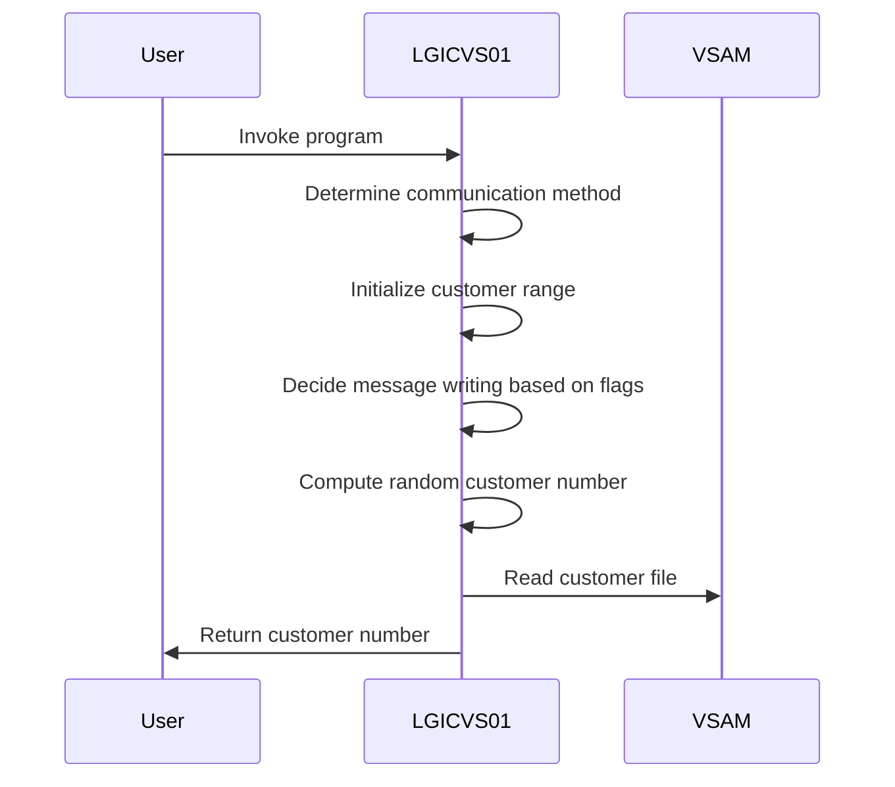

The <SwmToken path="base/src/lgicvs01.cbl" pos="17:6:6" line-data="       PROGRAM-ID. LGICVS01.">`LGICVS01`</SwmToken> program returns a random customer number from the VSAM KSDS Customer dataset, using a control TSQ for the random seed. It can be invoked via LINK or TRAN, returning data through Commarea or Screen display.

For example, the program might receive a control TSQ, compute a random seed, and output a customer number like '0001234567'.

The main steps are:

- Determine communication method
- Initialize customer range
- Decide message writing based on flags
- Compute random customer number
- Read customer file
- Send message or prepare data for communication area



## Dependencies

# Initializing System Variables

```mermaid
%%{init: {"flowchart": {"defaultRenderer": "elk"}} }%%
flowchart TD
    node1[Start MAINLINE processing] --> node2{Determine communication method}
    click node1 openCode "base/src/lgicvs01.cbl:93:107"
    node2 -->|Direct| node3[Move data to communication area]
    click node2 openCode "base/src/lgicvs01.cbl:108:121"
    node2 -->|Receive| node4[Receive data into workspace]
    click node4 openCode "base/src/lgicvs01.cbl:114:121"
    node3 --> node5[Initialize customer range]
    click node3 openCode "base/src/lgicvs01.cbl:123:127"
    node4 --> node5
    click node5 openCode "base/src/lgicvs01.cbl:123:127"

    subgraph loop1[Decide message writing based on flags]
        node5 --> node6{Flag TSQE?}
        click node6 openCode "base/src/lgicvs01.cbl:162:169"
        node6 -->|Yes| node7[Write message E to queue]
        click node7 openCode "base/src/lgicvs01.cbl:163:169"
        node6 -->|No| node8{Flag TSQL?}
        click node8 openCode "base/src/lgicvs01.cbl:171:178"
        node8 -->|Yes| node9[Write message L to queue]
        click node9 openCode "base/src/lgicvs01.cbl:172:178"
        node8 -->|No| node10{Flag TSQH?}
        click node10 openCode "base/src/lgicvs01.cbl:180:187"
        node10 -->|Yes| node11[Write message H to queue]
        click node11 openCode "base/src/lgicvs01.cbl:181:187"
        node10 -->|No| node5
    end

    node5 --> node12[Compute random customer number]
    click node12 openCode "base/src/lgicvs01.cbl:193:197"
    node12 --> node13[Read customer file]
    click node13 openCode "base/src/lgicvs01.cbl:199:206"
    node13 --> node14{Flag R?}
    click node14 openCode "base/src/lgicvs01.cbl:211:222"
    node14 -->|Yes| node15[Send message H]
    click node15 openCode "base/src/lgicvs01.cbl:212:217"
    node14 -->|No| node16[Move data to communication area]
    click node16 openCode "base/src/lgicvs01.cbl:219:221"
    node16 --> node17[Return from MAINLINE]
    click node17 openCode "base/src/lgicvs01.cbl:224:225"

%% Swimm:
%% %%{init: {"flowchart": {"defaultRenderer": "elk"}} }%%
%% flowchart TD
%%     node1[Start MAINLINE processing] --> node2{Determine communication method}
%%     click node1 openCode "<SwmPath>[base/src/lgicvs01.cbl](base/src/lgicvs01.cbl)</SwmPath>:93:107"
%%     node2 -->|Direct| node3[Move data to communication area]
%%     click node2 openCode "<SwmPath>[base/src/lgicvs01.cbl](base/src/lgicvs01.cbl)</SwmPath>:108:121"
%%     node2 -->|Receive| node4[Receive data into workspace]
%%     click node4 openCode "<SwmPath>[base/src/lgicvs01.cbl](base/src/lgicvs01.cbl)</SwmPath>:114:121"
%%     node3 --> node5[Initialize customer range]
%%     click node3 openCode "<SwmPath>[base/src/lgicvs01.cbl](base/src/lgicvs01.cbl)</SwmPath>:123:127"
%%     node4 --> node5
%%     click node5 openCode "<SwmPath>[base/src/lgicvs01.cbl](base/src/lgicvs01.cbl)</SwmPath>:123:127"
%% 
%%     subgraph loop1[Decide message writing based on flags]
%%         node5 --> node6{Flag TSQE?}
%%         click node6 openCode "<SwmPath>[base/src/lgicvs01.cbl](base/src/lgicvs01.cbl)</SwmPath>:162:169"
%%         node6 -->|Yes| node7[Write message E to queue]
%%         click node7 openCode "<SwmPath>[base/src/lgicvs01.cbl](base/src/lgicvs01.cbl)</SwmPath>:163:169"
%%         node6 -->|No| node8{Flag TSQL?}
%%         click node8 openCode "<SwmPath>[base/src/lgicvs01.cbl](base/src/lgicvs01.cbl)</SwmPath>:171:178"
%%         node8 -->|Yes| node9[Write message L to queue]
%%         click node9 openCode "<SwmPath>[base/src/lgicvs01.cbl](base/src/lgicvs01.cbl)</SwmPath>:172:178"
%%         node8 -->|No| node10{Flag TSQH?}
%%         click node10 openCode "<SwmPath>[base/src/lgicvs01.cbl](base/src/lgicvs01.cbl)</SwmPath>:180:187"
%%         node10 -->|Yes| node11[Write message H to queue]
%%         click node11 openCode "<SwmPath>[base/src/lgicvs01.cbl](base/src/lgicvs01.cbl)</SwmPath>:181:187"
%%         node10 -->|No| node5
%%     end
%% 
%%     node5 --> node12[Compute random customer number]
%%     click node12 openCode "<SwmPath>[base/src/lgicvs01.cbl](base/src/lgicvs01.cbl)</SwmPath>:193:197"
%%     node12 --> node13[Read customer file]
%%     click node13 openCode "<SwmPath>[base/src/lgicvs01.cbl](base/src/lgicvs01.cbl)</SwmPath>:199:206"
%%     node13 --> node14{Flag R?}
%%     click node14 openCode "<SwmPath>[base/src/lgicvs01.cbl](base/src/lgicvs01.cbl)</SwmPath>:211:222"
%%     node14 -->|Yes| node15[Send message H]
%%     click node15 openCode "<SwmPath>[base/src/lgicvs01.cbl](base/src/lgicvs01.cbl)</SwmPath>:212:217"
%%     node14 -->|No| node16[Move data to communication area]
%%     click node16 openCode "<SwmPath>[base/src/lgicvs01.cbl](base/src/lgicvs01.cbl)</SwmPath>:219:221"
%%     node16 --> node17[Return from MAINLINE]
%%     click node17 openCode "<SwmPath>[base/src/lgicvs01.cbl](base/src/lgicvs01.cbl)</SwmPath>:224:225"
```



<SwmSnippet path="/base/src/lgicvs01.cbl" line="93">

---

In <SwmToken path="base/src/lgicvs01.cbl" pos="93:1:1" line-data="       MAINLINE SECTION.">`MAINLINE`</SwmToken>, we start by assigning system-related info to variables, which sets up the initial conditions for the program's flow.

```cobol
       MAINLINE SECTION.
      *
           MOVE SPACES TO WS-RECV.

           EXEC CICS ASSIGN SYSID(WS-SYSID)
                RESP(WS-RESP)
           END-EXEC.

           EXEC CICS ASSIGN STARTCODE(WS-STARTCODE)
                RESP(WS-RESP)
           END-EXEC.

           EXEC CICS ASSIGN Invokingprog(WS-Invokeprog)
                RESP(WS-RESP)
           END-EXEC.
```

---

</SwmSnippet>

<SwmSnippet path="/base/src/lgicvs01.cbl" line="108">

---

Here the program checks the start code and invoking program. If the start code is 'D' or the invoking program isn't spaces, it sets a flag and moves data to the communication area. Otherwise, it receives data from the terminal, setting up for the next steps.

```cobol
           IF WS-STARTCODE(1:1) = 'D' or
              WS-Invokeprog Not = Spaces
              MOVE 'C' To WS-FLAG
              MOVE COMMA-DATA  TO WS-COMMAREA
              MOVE EIBCALEN    TO WS-RECV-LEN
           ELSE
              EXEC CICS RECEIVE INTO(WS-RECV)
                  LENGTH(WS-RECV-LEN)
                  RESP(WS-RESP)
              END-EXEC
              MOVE 'R' To WS-FLAG
              MOVE WS-RECV-DATA  TO WS-COMMAREA
              SUBTRACT 5 FROM WS-RECV-LEN
           END-IF.
```

---

</SwmSnippet>

<SwmSnippet path="/base/src/lgicvs01.cbl" line="123">

---

It locks a resource, reads a message from the TSQ, and updates flags for further processing.

```cobol
           Move 0001000001 to WS-Cust-Low
           Move 0001000001 to WS-Cust-High
           Move 'Y'        to WS-FLAG-TSQE
           Move 'Y'        to WS-FLAG-TSQH
           Move 'Y'        to WS-FLAG-TSQL
      *
           EXEC CICS ENQ Resource(STSQ-NAME)
                         Length(Length Of STSQ-NAME)
           END-EXEC.
           Exec CICS ReadQ TS Queue(STSQ-NAME)
                     Into(READ-MSG)
                     Resp(WS-RESP)
                     Item(1)
           End-Exec.
```

---

</SwmSnippet>

<SwmSnippet path="/base/src/lgicvs01.cbl" line="158">

---

It writes messages to the TSQ based on flags

```cobol
           Move WS-Cust-Low to WRITE-MSG-LOW
           Move WS-Cust-High to WRITE-MSG-HIGH
      *
      *
           If WS-FLAG-TSQE = 'Y'
             EXEC CICS WRITEQ TS QUEUE(STSQ-NAME)
                       FROM(WRITE-MSG-E)
                       RESP(WS-RESP)
                       NOSUSPEND
                       LENGTH(20)
             END-EXEC
           End-If.
```

---

</SwmSnippet>

<SwmSnippet path="/base/src/lgicvs01.cbl" line="171">

---

It writes a message to the TSQ based on a specific flag condition.

```cobol
           If WS-FLAG-TSQL = 'Y'
             EXEC CICS WRITEQ TS QUEUE(STSQ-NAME)
                       FROM(WRITE-MSG-L)
                       RESP(WS-RESP)
                       NOSUSPEND
                       LENGTH(23)
             END-EXEC
           End-If.
```

---

</SwmSnippet>

<SwmSnippet path="/base/src/lgicvs01.cbl" line="180">

---

It conditionally writes a message to the TSQ based on a flag.

```cobol
           If WS-FLAG-TSQH = 'Y'
             EXEC CICS WRITEQ TS QUEUE(STSQ-NAME)
                       FROM(WRITE-MSG-H)
                       RESP(WS-RESP)
                       NOSUSPEND
                       LENGTH(24)
             END-EXEC
           End-If.
```

---

</SwmSnippet>

<SwmSnippet path="/base/src/lgicvs01.cbl" line="189">

---

It releases the resource lock to allow access by other transactions.

```cobol
           EXEC CICS DEQ Resource(STSQ-NAME)
                         Length(Length Of STSQ-NAME)
           END-EXEC.
```

---

</SwmSnippet>

<SwmSnippet path="/base/src/lgicvs01.cbl" line="193">

---

Here the program generates a random number to use as a key for reading a record from the KSDSCUST file. This updates the message with customer-specific data, integrating it into the flow.

```cobol
           Compute WS-Random-Number = Function Integer((
                     Function Random(EIBTASKN) *
                       (ws-cust-high - ws-cust-low)) +
                          WS-Cust-Low)
           Move WS-Random-Number to WRITE-MSG-HIGH

           Exec CICS Read File('KSDSCUST')
                     Into(CA-AREA)
                     Length(F82)
                     Ridfld(WRITE-MSG-HIGH)
                     KeyLength(F10)
                     RESP(WS-RESP)
                     GTEQ
           End-Exec.
```

---

</SwmSnippet>

<SwmSnippet path="/base/src/lgicvs01.cbl" line="211">

---

Finally, based on <SwmToken path="base/src/lgicvs01.cbl" pos="211:3:5" line-data="           If WS-FLAG = &#39;R&#39; Then">`WS-FLAG`</SwmToken>, the program either sends a message to the terminal or prepares data for the communication area. This concludes the flow by determining the output destination.

```cobol
           If WS-FLAG = 'R' Then
             EXEC CICS SEND TEXT FROM(WRITE-MSG-H)
              WAIT
              ERASE
              LENGTH(24)
              FREEKB
             END-EXEC
           Else
             Move Spaces To COMMA-Data
             Move Write-Msg-H    To COMMA-Data-H
             Move Write-Msg-High To COMMA-Data-High
           End-If.

           EXEC CICS RETURN
           END-EXEC.
```

---

</SwmSnippet>

&nbsp;

*This is an auto-generated document by Swimm 🌊 and has not yet been verified by a human*

<SwmMeta version="3.0.0" repo-id="Z2l0aHViJTNBJTNBa3luZHJ5bC1jaWNzLWdlbmFwcCUzQSUzQVN3aW1tLURlbW8=" repo-name="kyndryl-cics-genapp"><sup>Powered by [Swimm](/)</sup></SwmMeta>
