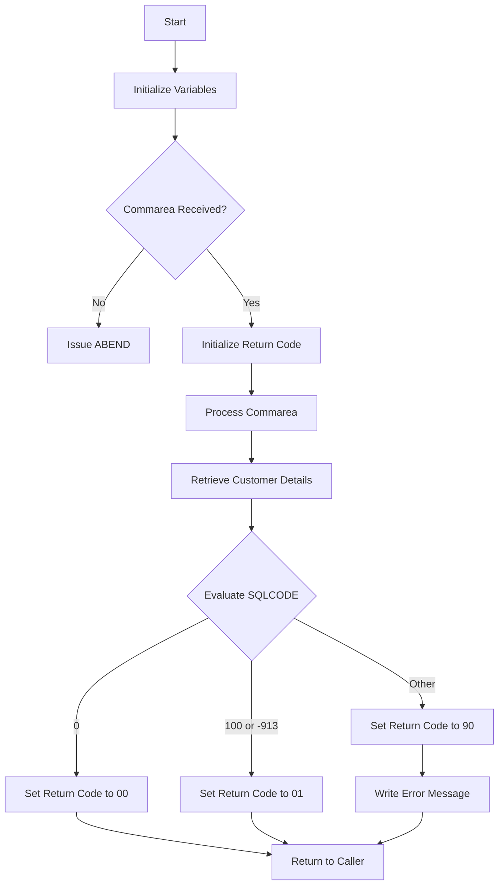

This document will cover the <SwmToken path="base/src/lgicdb01.cbl" pos="12:6:6" line-data="       PROGRAM-ID. LGICDB01.">`LGICDB01`</SwmToken> program. We'll cover:

1. What the Program Does
2. Program Flow
3. Program Sections

## What the Program Does

The <SwmToken path="base/src/lgicdb01.cbl" pos="12:6:6" line-data="       PROGRAM-ID. LGICDB01.">`LGICDB01`</SwmToken> program is designed to inquire customer details from a <SwmToken path="base/src/lgicdb01.cbl" pos="8:11:11" line-data="      * Select customer details from DB2 table                         *">`DB2`</SwmToken> table. It initializes necessary variables, checks the communication area (commarea), processes the incoming commarea to convert the customer number to <SwmToken path="base/src/lgicdb01.cbl" pos="8:11:11" line-data="      * Select customer details from DB2 table                         *">`DB2`</SwmToken> integer format, and then retrieves customer details from the <SwmToken path="base/src/lgicdb01.cbl" pos="8:11:11" line-data="      * Select customer details from DB2 table                         *">`DB2`</SwmToken> table. If any errors occur, it writes an error message to the queues.

## Program Flow

The program follows these high-level steps:

1. Initialize working storage variables and general variables.
2. Check if the commarea is received; if not, issue an ABEND.
3. Initialize the commarea return code and <SwmToken path="base/src/lgicdb01.cbl" pos="8:11:11" line-data="      * Select customer details from DB2 table                         *">`DB2`</SwmToken> host variables.
4. Process the incoming commarea to convert the customer number to <SwmToken path="base/src/lgicdb01.cbl" pos="8:11:11" line-data="      * Select customer details from DB2 table                         *">`DB2`</SwmToken> integer format.
5. Retrieve customer details from the <SwmToken path="base/src/lgicdb01.cbl" pos="8:11:11" line-data="      * Select customer details from DB2 table                         *">`DB2`</SwmToken> table.
6. Evaluate the SQLCODE to determine the outcome of the <SwmToken path="base/src/lgicdb01.cbl" pos="8:11:11" line-data="      * Select customer details from DB2 table                         *">`DB2`</SwmToken> query.
7. Write error messages to the queues if necessary.
8. Return to the caller.



<SwmSnippet path="/base/src/lgicdb01.cbl" line="102">

---

### MAINLINE SECTION

First, the MAINLINE SECTION initializes working storage variables and general variables. It then checks if the commarea is received; if not, it issues an ABEND. If the commarea is received, it initializes the commarea return code and <SwmToken path="base/src/lgicdb01.cbl" pos="8:11:11" line-data="      * Select customer details from DB2 table                         *">`DB2`</SwmToken> host variables.

```cobol
       MAINLINE SECTION.

      *----------------------------------------------------------------*
      * Common code                                                    *
      *----------------------------------------------------------------*
      * initialize working storage variables
           INITIALIZE WS-HEADER.
      * set up general variable
           MOVE EIBTRNID TO WS-TRANSID.
           MOVE EIBTRMID TO WS-TERMID.
           MOVE EIBTASKN TO WS-TASKNUM.
      *----------------------------------------------------------------*

      *----------------------------------------------------------------*
      * Check commarea and obtain required details                     *
      *----------------------------------------------------------------*
      * If NO commarea received issue an ABEND
           IF EIBCALEN IS EQUAL TO ZERO
               MOVE ' NO COMMAREA RECEIVED' TO EM-VARIABLE
               PERFORM WRITE-ERROR-MESSAGE
               EXEC CICS ABEND ABCODE('LGCA') NODUMP END-EXEC
```

---

</SwmSnippet>

<SwmSnippet path="/base/src/lgicdb01.cbl" line="167">

---

### <SwmToken path="base/src/lgicdb01.cbl" pos="167:1:5" line-data="       GET-CUSTOMER-INFO.">`GET-CUSTOMER-INFO`</SwmToken>

Next, the <SwmToken path="base/src/lgicdb01.cbl" pos="167:1:5" line-data="       GET-CUSTOMER-INFO.">`GET-CUSTOMER-INFO`</SwmToken> section retrieves customer details from the <SwmToken path="base/src/lgicdb01.cbl" pos="8:11:11" line-data="      * Select customer details from DB2 table                         *">`DB2`</SwmToken> table using an SQL SELECT statement. It then evaluates the SQLCODE to determine the outcome of the <SwmToken path="base/src/lgicdb01.cbl" pos="8:11:11" line-data="      * Select customer details from DB2 table                         *">`DB2`</SwmToken> query and sets the appropriate return code.

```cobol
       GET-CUSTOMER-INFO.

           EXEC SQL
               SELECT FIRSTNAME,
                      LASTNAME,
                      DATEOFBIRTH,
                      HOUSENAME,
                      HOUSENUMBER,
                      POSTCODE,
                      PHONEMOBILE,
                      PHONEHOME,
                      EMAILADDRESS
               INTO  :CA-FIRST-NAME,
                     :CA-LAST-NAME,
                     :CA-DOB,
                     :CA-HOUSE-NAME,
                     :CA-HOUSE-NUM,
                     :CA-POSTCODE,
                     :CA-PHONE-MOBILE,
                     :CA-PHONE-HOME,
                     :CA-EMAIL-ADDRESS
```

---

</SwmSnippet>

<SwmSnippet path="/base/src/lgicdb01.cbl" line="212">

---

### <SwmToken path="base/src/lgicdb01.cbl" pos="212:1:5" line-data="       WRITE-ERROR-MESSAGE.">`WRITE-ERROR-MESSAGE`</SwmToken>

Finally, the <SwmToken path="base/src/lgicdb01.cbl" pos="212:1:5" line-data="       WRITE-ERROR-MESSAGE.">`WRITE-ERROR-MESSAGE`</SwmToken> section writes error messages to the queues if necessary. It saves the SQLCODE in the message, obtains and formats the current time and date, and writes the output message to the Transient Data Queue (TDQ) and Temporary Storage Queue (TSQ) by calling the LGSTSQ program.

```cobol
       WRITE-ERROR-MESSAGE.
      * Save SQLCODE in message
           MOVE SQLCODE TO EM-SQLRC
      * Obtain and format current time and date
           EXEC CICS ASKTIME ABSTIME(WS-ABSTIME)
           END-EXEC
           EXEC CICS FORMATTIME ABSTIME(WS-ABSTIME)
                     MMDDYYYY(WS-DATE)
                     TIME(WS-TIME)
           END-EXEC
           MOVE WS-DATE TO EM-DATE
           MOVE WS-TIME TO EM-TIME
      * Write output message to TDQ
           EXEC CICS LINK PROGRAM('LGSTSQ')
                     COMMAREA(ERROR-MSG)
                     LENGTH(LENGTH OF ERROR-MSG)
           END-EXEC.
      * Write 90 bytes or as much as we have of commarea to TDQ
           IF EIBCALEN > 0 THEN
             IF EIBCALEN < 91 THEN
               MOVE DFHCOMMAREA(1:EIBCALEN) TO CA-DATA
```

---

</SwmSnippet>

&nbsp;

*This is an auto-generated document by Swimm 🌊 and has not yet been verified by a human*

<SwmMeta version="3.0.0" repo-id="Z2l0aHViJTNBJTNBa3luZHJ5bC1jaWNzLWdlbmFwcCUzQSUzQVN3aW1tLURlbW8=" repo-name="kyndryl-cics-genapp"><sup>Powered by [Swimm](/)</sup></SwmMeta>
