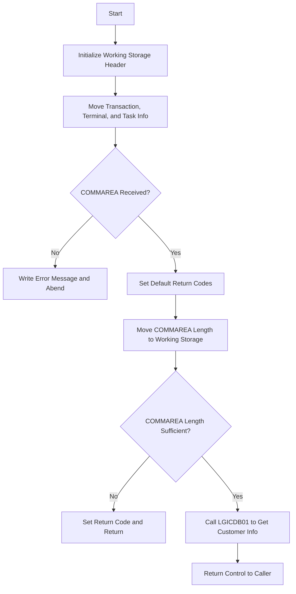

This document will cover the <SwmToken path="base/src/lgicus01.cbl" pos="13:6:6" line-data="       PROGRAM-ID. LGICUS01.">`LGICUS01`</SwmToken> program. We'll cover:

1. What the Program Does
2. Program Flow
3. Program Sections

## What the Program Does

The <SwmToken path="base/src/lgicus01.cbl" pos="13:6:6" line-data="       PROGRAM-ID. LGICUS01.">`LGICUS01`</SwmToken> program is designed to inquire customer details from a database. It initializes necessary variables, checks the communication area (COMMAREA), processes the incoming COMMAREA, and retrieves customer information by calling another program, <SwmToken path="base/src/lgicus01.cbl" pos="122:9:9" line-data="           EXEC CICS LINK Program(LGICDB01)">`LGICDB01`</SwmToken>.

## Program Flow

The program flow of <SwmToken path="base/src/lgicus01.cbl" pos="13:6:6" line-data="       PROGRAM-ID. LGICUS01.">`LGICUS01`</SwmToken> is as follows:

1. Initialize the working storage header.
2. Move transaction, terminal, and task information to working storage.
3. Check if the COMMAREA is received.
4. Set default return codes and move the length of the COMMAREA to working storage.
5. Check if the COMMAREA length is sufficient.
6. Call the <SwmToken path="base/src/lgicus01.cbl" pos="122:9:9" line-data="           EXEC CICS LINK Program(LGICDB01)">`LGICDB01`</SwmToken> program to get customer information.
7. Return control to the caller.



<SwmSnippet path="/base/src/lgicus01.cbl" line="77">

---

### MAINLINE SECTION

First, the MAINLINE SECTION initializes the working storage header and moves transaction, terminal, and task information to working storage. It then checks if the COMMAREA is received. If not, it writes an error message and abends the transaction. If the COMMAREA is received, it sets default return codes, moves the length of the COMMAREA to working storage, and checks if the COMMAREA length is sufficient. If the length is insufficient, it sets a return code and returns control to the caller. Otherwise, it performs the <SwmToken path="base/src/lgicus01.cbl" pos="120:1:5" line-data="       GET-CUSTOMER-INFO.">`GET-CUSTOMER-INFO`</SwmToken> section.

```cobol
       MAINLINE SECTION.
      *
           INITIALIZE WS-HEADER.
      *
           MOVE EIBTRNID TO WS-TRANSID.
           MOVE EIBTRMID TO WS-TERMID.
           MOVE EIBTASKN TO WS-TASKNUM.
      *----------------------------------------------------------------*
      * Check commarea and obtain required details                     *
      *----------------------------------------------------------------*
           IF EIBCALEN IS EQUAL TO ZERO
               MOVE ' NO COMMAREA RECEIVED' TO EM-VARIABLE
               PERFORM WRITE-ERROR-MESSAGE
               EXEC CICS ABEND ABCODE('LGCA') NODUMP END-EXEC
           END-IF

           MOVE '00' TO CA-RETURN-CODE
           MOVE '00' TO CA-NUM-POLICIES
           MOVE EIBCALEN TO WS-CALEN.
           SET WS-ADDR-DFHCOMMAREA TO ADDRESS OF DFHCOMMAREA.

```

---

</SwmSnippet>

<SwmSnippet path="/base/src/lgicus01.cbl" line="120">

---

### <SwmToken path="base/src/lgicus01.cbl" pos="120:1:5" line-data="       GET-CUSTOMER-INFO.">`GET-CUSTOMER-INFO`</SwmToken>

Next, the <SwmToken path="base/src/lgicus01.cbl" pos="120:1:5" line-data="       GET-CUSTOMER-INFO.">`GET-CUSTOMER-INFO`</SwmToken> section calls the <SwmToken path="base/src/lgicus01.cbl" pos="122:9:9" line-data="           EXEC CICS LINK Program(LGICDB01)">`LGICDB01`</SwmToken> program to retrieve customer information using the COMMAREA.

```cobol
       GET-CUSTOMER-INFO.

           EXEC CICS LINK Program(LGICDB01)
               Commarea(DFHCOMMAREA)
               LENGTH(32500)
           END-EXEC
      

           EXIT.
```

---

</SwmSnippet>

<SwmSnippet path="/base/src/lgicus01.cbl" line="135">

---

### <SwmToken path="base/src/lgicus01.cbl" pos="135:1:5" line-data="       WRITE-ERROR-MESSAGE.">`WRITE-ERROR-MESSAGE`</SwmToken>

Then, the <SwmToken path="base/src/lgicus01.cbl" pos="135:1:5" line-data="       WRITE-ERROR-MESSAGE.">`WRITE-ERROR-MESSAGE`</SwmToken> section obtains and formats the current time and date, writes an error message to a Transient Data Queue (TDQ), and writes the COMMAREA data to the TDQ if it is present. It calls the LGSTSQ program to handle the message writing.

```cobol
       WRITE-ERROR-MESSAGE.
      * Obtain and format current time and date
           EXEC CICS ASKTIME ABSTIME(WS-ABSTIME)
           END-EXEC
           EXEC CICS FORMATTIME ABSTIME(WS-ABSTIME)
                     MMDDYYYY(WS-DATE)
                     TIME(WS-TIME)
           END-EXEC
           MOVE WS-DATE TO EM-DATE
           MOVE WS-TIME TO EM-TIME
      * Write output message to TDQ
           EXEC CICS LINK PROGRAM('LGSTSQ')
                     COMMAREA(ERROR-MSG)
                     LENGTH(LENGTH OF ERROR-MSG)
           END-EXEC.
      * Write 90 bytes or as much as we have of commarea to TDQ
           IF EIBCALEN > 0 THEN
             IF EIBCALEN < 91 THEN
               MOVE DFHCOMMAREA(1:EIBCALEN) TO CA-DATA
               EXEC CICS LINK PROGRAM('LGSTSQ')
                         COMMAREA(CA-ERROR-MSG)
```

---

</SwmSnippet>

&nbsp;

*This is an auto-generated document by Swimm 🌊 and has not yet been verified by a human*

<SwmMeta version="3.0.0" repo-id="Z2l0aHViJTNBJTNBa3luZHJ5bC1jaWNzLWdlbmFwcCUzQSUzQVN3aW1tLURlbW8=" repo-name="kyndryl-cics-genapp"><sup>Powered by [Swimm](/)</sup></SwmMeta>
