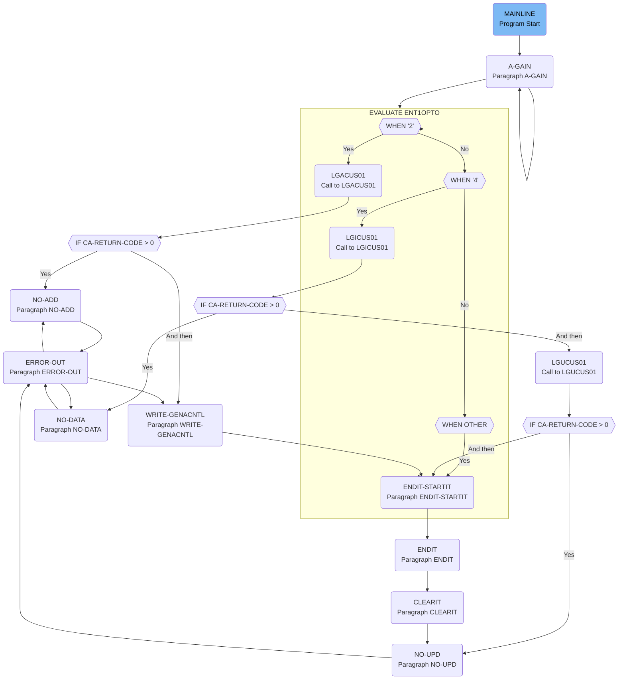

The <SwmToken path="base/src/lgtestc1.cbl" pos="11:6:6" line-data="       PROGRAM-ID. LGTESTC1.">`LGTESTC1`</SwmToken> program is responsible for handling user interactions and managing customer data within the insurance application. It achieves this by evaluating user inputs and performing operations such as querying, adding, and updating customer information through various subprograms.

The flow starts with the MAINLINE section, which initializes the program and displays the main menu. The <SwmToken path="base/src/lgtestc1.cbl" pos="56:5:7" line-data="              GO TO A-GAIN.">`A-GAIN`</SwmToken> paragraph handles user inputs and conditions. Depending on the user's option, the program calls different subprograms to query, add, or update customer information. If an error occurs, specific paragraphs handle the error by setting an error message and directing the flow to the <SwmToken path="base/src/lgtestc1.cbl" pos="261:5:7" line-data="           Go To ERROR-OUT.">`ERROR-OUT`</SwmToken> paragraph. Finally, the <SwmToken path="base/src/lgtestc1.cbl" pos="220:5:7" line-data="                 GO TO ENDIT-STARTIT">`ENDIT-STARTIT`</SwmToken> paragraph ensures the program returns control to the terminal and prepares for the next transaction.

Lets' zoom into the flow:



<SwmSnippet path="/base/src/lgtestc1.cbl" line="53">

---

## MAINLINE Section

First, the <SwmToken path="base/src/lgtestc1.cbl" pos="53:1:1" line-data="       MAINLINE SECTION.">`MAINLINE`</SwmToken> section initializes the program by setting up the necessary variables and displaying the main menu to the user. This sets the stage for user interaction.

```cobol
       MAINLINE SECTION.

           IF EIBCALEN > 0
              GO TO A-GAIN.

           Initialize SSMAPC1I.
           Initialize SSMAPC1O.
           Initialize COMM-AREA.
           MOVE '0000000000'   To ENT1CNOO

      * Display Main Menu
           EXEC CICS SEND MAP ('SSMAPC1')
                     FROM(SSMAPC1O)
                     MAPSET ('SSMAP')
                     ERASE
                     END-EXEC.

```

---

</SwmSnippet>

<SwmSnippet path="/base/src/lgtestc1.cbl" line="70">

---

## <SwmToken path="base/src/lgtestc1.cbl" pos="70:1:3" line-data="       A-GAIN.">`A-GAIN`</SwmToken> Paragraph

Moving to the <SwmToken path="base/src/lgtestc1.cbl" pos="70:1:3" line-data="       A-GAIN.">`A-GAIN`</SwmToken> paragraph, the program handles user inputs and conditions. It waits for user actions and processes them accordingly.

```cobol
       A-GAIN.

           EXEC CICS HANDLE AID
                     CLEAR(CLEARIT)
                     PF3(ENDIT) END-EXEC.
           EXEC CICS HANDLE CONDITION
                     MAPFAIL(ENDIT)
                     END-EXEC.

           EXEC CICS RECEIVE MAP('SSMAPC1')
                     INTO(SSMAPC1I) ASIS
                     MAPSET('SSMAP') END-EXEC.

```

---

</SwmSnippet>

<SwmSnippet path="/base/src/lgtestc1.cbl" line="84">

---

## EVALUATE <SwmToken path="base/src/lgtestc1.cbl" pos="84:3:3" line-data="           EVALUATE ENT1OPTO">`ENT1OPTO`</SwmToken>

Next, the program evaluates the user's option (<SwmToken path="base/src/lgtestc1.cbl" pos="84:3:3" line-data="           EVALUATE ENT1OPTO">`ENT1OPTO`</SwmToken>). Depending on the option selected, it performs different operations such as querying customer data, adding a new customer, or updating existing customer information.

```cobol
           EVALUATE ENT1OPTO

             WHEN '1'
                 Move '01ICUS'   To CA-REQUEST-ID
                 Move ENT1CNOO   To CA-CUSTOMER-NUM
                 EXEC CICS LINK PROGRAM('LGICUS01')
                           COMMAREA(COMM-AREA)
                           LENGTH(32500)
                 END-EXEC

                 IF CA-RETURN-CODE > 0
                   GO TO NO-DATA
                 END-IF

                 Move CA-FIRST-NAME to ENT1FNAI
                 Move CA-LAST-NAME  to ENT1LNAI
                 Move CA-DOB        to ENT1DOBI
                 Move CA-HOUSE-NAME to ENT1HNMI
                 Move CA-HOUSE-NUM  to ENT1HNOI
                 Move CA-POSTCODE   to ENT1HPCI
                 Move CA-PHONE-HOME    to ENT1HP1I
```

---

</SwmSnippet>

<SwmSnippet path="/base/src/lgtestc1.cbl" line="86">

---

### Handling Option '1'

When the user selects option '1', the program retrieves customer information by calling the <SwmToken path="base/src/lgtestc1.cbl" pos="89:10:10" line-data="                 EXEC CICS LINK PROGRAM(&#39;LGICUS01&#39;)">`LGICUS01`</SwmToken> program. If successful, it displays the customer details.\
More about <SwmToken path="base/src/lgtestc1.cbl" pos="128:10:10" line-data="                 EXEC CICS LINK PROGRAM(&#39;LGACUS01&#39;)">`LGACUS01`</SwmToken>: <SwmLink doc-title="Adding New Customers (LGACUS01)">[Adding New Customers (LGACUS01)](/.swm/adding-new-customers-lgacus01.xye3ga8o.sw.md)</SwmLink>

```cobol
             WHEN '1'
                 Move '01ICUS'   To CA-REQUEST-ID
                 Move ENT1CNOO   To CA-CUSTOMER-NUM
                 EXEC CICS LINK PROGRAM('LGICUS01')
                           COMMAREA(COMM-AREA)
                           LENGTH(32500)
                 END-EXEC

                 IF CA-RETURN-CODE > 0
                   GO TO NO-DATA
                 END-IF

                 Move CA-FIRST-NAME to ENT1FNAI
                 Move CA-LAST-NAME  to ENT1LNAI
                 Move CA-DOB        to ENT1DOBI
                 Move CA-HOUSE-NAME to ENT1HNMI
                 Move CA-HOUSE-NUM  to ENT1HNOI
                 Move CA-POSTCODE   to ENT1HPCI
                 Move CA-PHONE-HOME    to ENT1HP1I
                 Move CA-PHONE-MOBILE  to ENT1HP2I
                 Move CA-EMAIL-ADDRESS to ENT1HMOI
```

---

</SwmSnippet>

<SwmSnippet path="/base/src/lgtestc1.cbl" line="113">

---

### Handling Option '2'

When the user selects option '2', the program adds a new customer by calling the <SwmToken path="base/src/lgtestc1.cbl" pos="128:10:10" line-data="                 EXEC CICS LINK PROGRAM(&#39;LGACUS01&#39;)">`LGACUS01`</SwmToken> program. If successful, it confirms the addition and displays a success message.

More about <SwmToken path="base/src/lgtestc1.cbl" pos="128:10:10" line-data="                 EXEC CICS LINK PROGRAM(&#39;LGACUS01&#39;)">`LGACUS01`</SwmToken>: <SwmLink doc-title="Adding New Customers (LGACUS01)">[Adding New Customers (LGACUS01)](/.swm/adding-new-customers-lgacus01.xye3ga8o.sw.md)</SwmLink>

```cobol
             WHEN '2'
                 Move '01ACUS'   To CA-REQUEST-ID
                 Move 0          To CA-CUSTOMER-NUM
                 Move ENT1FNAI   To CA-FIRST-NAME
                 Move ENT1LNAI   To CA-LAST-NAME
                 Move ENT1DOBI   To CA-DOB
                 Move ENT1HNMI   To CA-HOUSE-NAME
                 Move ENT1HNOI   To CA-HOUSE-NUM
                 Move ENT1HPCI   To CA-POSTCODE
                 Move ENT1HP1I   To CA-PHONE-HOME
                 Move ENT1HP2I   To CA-PHONE-MOBILE
                 Move ENT1HMOI   To CA-EMAIL-ADDRESS
                 Inspect COMM-AREA Replacing All x'00'  by x'40'
                 Move Function UPPER-CASE(CA-POSTCODE)
                      TO CA-POSTCODE
                 EXEC CICS LINK PROGRAM('LGACUS01')
                           COMMAREA(COMM-AREA)
                           LENGTH(32500)
                 END-EXEC
                 IF CA-RETURN-CODE > 0
                   Exec CICS Syncpoint Rollback End-Exec
```

---

</SwmSnippet>

<SwmSnippet path="/base/src/lgtestc1.cbl" line="148">

---

### Handling Option '4'

When the user selects option '4', the program updates existing customer information by calling the <SwmToken path="base/src/lgtestc1.cbl" pos="190:10:10" line-data="                 EXEC CICS LINK PROGRAM(&#39;LGUCUS01&#39;)">`LGUCUS01`</SwmToken> program. If successful, it confirms the update and displays a success message.

```cobol
             WHEN '4'
                 Move '01ICUS'   To CA-REQUEST-ID
                 Move ENT1CNOO   To CA-CUSTOMER-NUM
                 EXEC CICS LINK PROGRAM('LGICUS01')
                           COMMAREA(COMM-AREA)
                           LENGTH(32500)
                 END-EXEC
                 IF CA-RETURN-CODE > 0
                   GO TO NO-DATA
                 END-IF

                 Move CA-FIRST-NAME to ENT1FNAI
                 Move CA-LAST-NAME  to ENT1LNAI
                 Move CA-DOB        to ENT1DOBI
                 Move CA-HOUSE-NAME to ENT1HNMI
                 Move CA-HOUSE-NUM  to ENT1HNOI
                 Move CA-POSTCODE   to ENT1HPCI
                 Move CA-PHONE-HOME    to ENT1HP1I
                 Move CA-PHONE-MOBILE  to ENT1HP2I
                 Move CA-EMAIL-ADDRESS to ENT1HMOI
                 EXEC CICS SEND MAP ('SSMAPC1')
```

---

</SwmSnippet>

<SwmSnippet path="/base/src/lgtestc1.cbl" line="209">

---

### Handling Invalid Options

When the user selects an invalid option, the program prompts the user to enter a valid option and redisplays the main menu.

```cobol
             WHEN OTHER

                 Move 'Please enter a valid option'
                   To  ERRFLDO
                 Move -1 To ENT1OPTL

                 EXEC CICS SEND MAP ('SSMAPC1')
                           FROM(SSMAPC1O)
                           MAPSET ('SSMAP')
                           CURSOR
                 END-EXEC
                 GO TO ENDIT-STARTIT

```

---

</SwmSnippet>

<SwmSnippet path="/base/src/lgtestc1.cbl" line="230">

---

## <SwmToken path="base/src/lgtestc1.cbl" pos="230:1:3" line-data="       ENDIT-STARTIT.">`ENDIT-STARTIT`</SwmToken> Paragraph

Then, the <SwmToken path="base/src/lgtestc1.cbl" pos="230:1:3" line-data="       ENDIT-STARTIT.">`ENDIT-STARTIT`</SwmToken> paragraph ensures the program returns control to the terminal and prepares for the next transaction.

```cobol
       ENDIT-STARTIT.
           EXEC CICS RETURN
                TRANSID('SSC1')
                COMMAREA(COMM-AREA)
                END-EXEC.
```

---

</SwmSnippet>

<SwmSnippet path="/base/src/lgtestc1.cbl" line="263">

---

## <SwmToken path="base/src/lgtestc1.cbl" pos="263:1:3" line-data="       NO-ADD.">`NO-ADD`</SwmToken> Paragraph

If there is an error adding a customer, the <SwmToken path="base/src/lgtestc1.cbl" pos="263:1:3" line-data="       NO-ADD.">`NO-ADD`</SwmToken> paragraph sets an error message and directs the flow to the <SwmToken path="base/src/lgtestc1.cbl" pos="265:5:7" line-data="           Go To ERROR-OUT.">`ERROR-OUT`</SwmToken> paragraph.

```cobol
       NO-ADD.
           Move 'Error Adding Customer'            To  ERRFLDO.
           Go To ERROR-OUT.
```

---

</SwmSnippet>

<SwmSnippet path="/base/src/lgtestc1.cbl" line="267">

---

## <SwmToken path="base/src/lgtestc1.cbl" pos="267:1:3" line-data="       NO-DATA.">`NO-DATA`</SwmToken> Paragraph

If no data is returned from a query, the <SwmToken path="base/src/lgtestc1.cbl" pos="267:1:3" line-data="       NO-DATA.">`NO-DATA`</SwmToken> paragraph sets an error message and directs the flow to the <SwmToken path="base/src/lgtestc1.cbl" pos="269:5:7" line-data="           Go To ERROR-OUT.">`ERROR-OUT`</SwmToken> paragraph.

```cobol
       NO-DATA.
           Move 'No data was returned.'            To  ERRFLDO.
           Go To ERROR-OUT.
```

---

</SwmSnippet>

<SwmSnippet path="/base/src/lgtestc1.cbl" line="259">

---

## <SwmToken path="base/src/lgtestc1.cbl" pos="259:1:3" line-data="       NO-UPD.">`NO-UPD`</SwmToken> Paragraph

If there is an error updating customer information, the <SwmToken path="base/src/lgtestc1.cbl" pos="259:1:3" line-data="       NO-UPD.">`NO-UPD`</SwmToken> paragraph sets an error message and directs the flow to the <SwmToken path="base/src/lgtestc1.cbl" pos="261:5:7" line-data="           Go To ERROR-OUT.">`ERROR-OUT`</SwmToken> paragraph.

```cobol
       NO-UPD.
           Move 'Error Updating Customer'          To  ERRFLDO.
           Go To ERROR-OUT.
```

---

</SwmSnippet>

<SwmSnippet path="/base/src/lgtestc1.cbl" line="271">

---

## <SwmToken path="base/src/lgtestc1.cbl" pos="271:1:3" line-data="       ERROR-OUT.">`ERROR-OUT`</SwmToken> Paragraph

The <SwmToken path="base/src/lgtestc1.cbl" pos="271:1:3" line-data="       ERROR-OUT.">`ERROR-OUT`</SwmToken> paragraph handles error conditions by displaying an error message and reinitializing the necessary variables before returning control to the terminal.

```cobol
       ERROR-OUT.
           EXEC CICS SEND MAP ('SSMAPC1')
                     FROM(SSMAPC1O)
                     MAPSET ('SSMAP')
           END-EXEC.

           Initialize SSMAPC1I.
           Initialize SSMAPC1O.
           Initialize COMM-AREA.

           GO TO ENDIT-STARTIT.
```

---

</SwmSnippet>

<SwmSnippet path="/base/src/lgtestc1.cbl" line="283">

---

## <SwmToken path="base/src/lgtestc1.cbl" pos="283:1:3" line-data="       WRITE-GENACNTL.">`WRITE-GENACNTL`</SwmToken> Paragraph

The <SwmToken path="base/src/lgtestc1.cbl" pos="283:1:3" line-data="       WRITE-GENACNTL.">`WRITE-GENACNTL`</SwmToken> paragraph manages the writing of control information to a temporary storage queue. This ensures that customer data is correctly stored and managed.

```cobol
       WRITE-GENACNTL.

           EXEC CICS ENQ Resource(STSQ-NAME)
                         Length(Length Of STSQ-NAME)
           END-EXEC.
           Move 'Y' To WS-FLAG-TSQH
           Move 1   To WS-Item-Count
           Exec CICS ReadQ TS Queue(STSQ-NAME)
                     Into(READ-MSG)
                     Resp(WS-RESP)
                     Item(1)
           End-Exec.
           If WS-RESP = DFHRESP(NORMAL)
              Perform With Test after Until WS-RESP > 0
                 Exec CICS ReadQ TS Queue(STSQ-NAME)
                     Into(READ-MSG)
                     Resp(WS-RESP)
                     Next
                 End-Exec
                 Add 1 To WS-Item-Count
                 If WS-RESP = DFHRESP(NORMAL) And
```

---

</SwmSnippet>

&nbsp;

*This is an auto-generated document by Swimm 🌊 and has not yet been verified by a human*

<SwmMeta version="3.0.0" repo-id="Z2l0aHViJTNBJTNBa3luZHJ5bC1jaWNzLWdlbmFwcCUzQSUzQVN3aW1tLURlbW8=" repo-name="kyndryl-cics-genapp"><sup>Powered by [Swimm](https://staging.swimm.cloud/)</sup></SwmMeta>
