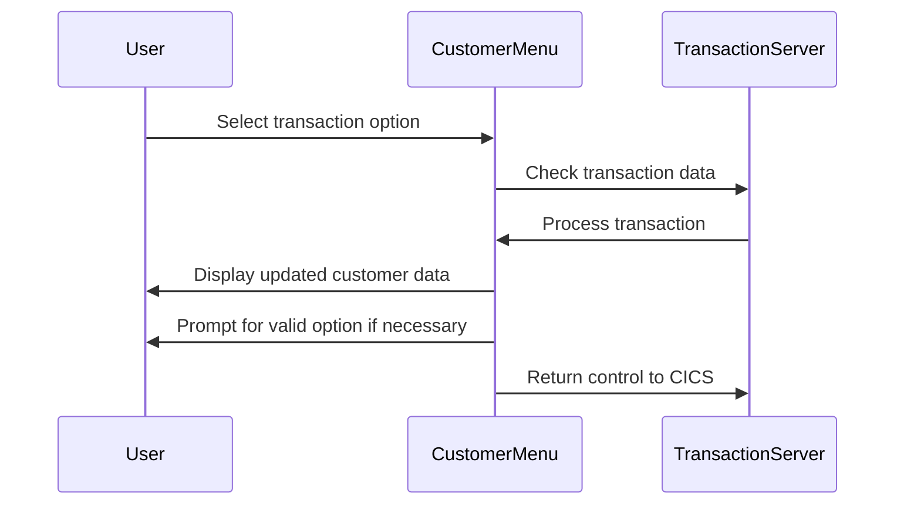
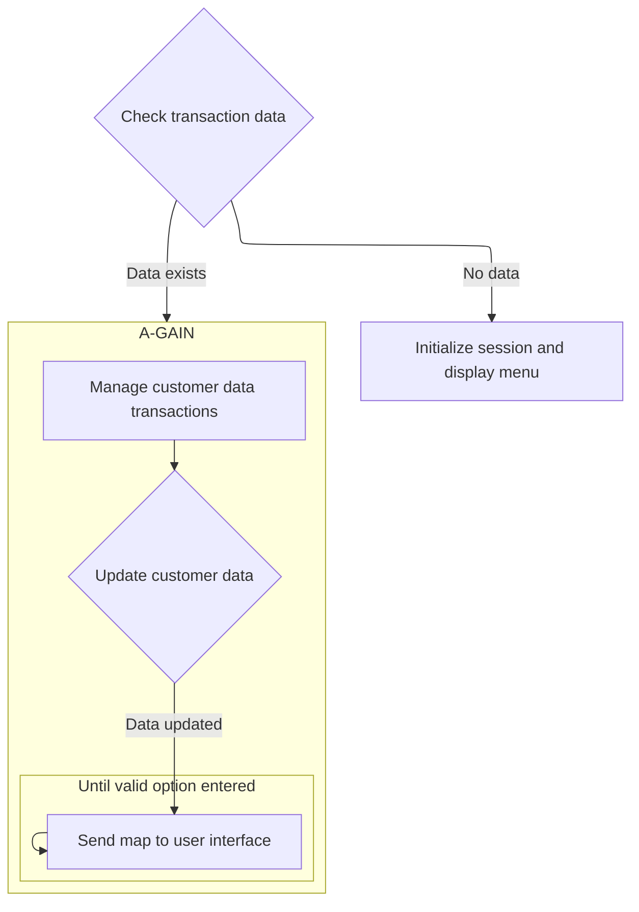

This document describes the customer transaction management flow (<SwmToken path="base/src/lgtestc1.cbl" pos="11:6:6" line-data="       PROGRAM-ID. LGTESTC1.">`LGTESTC1`</SwmToken>). Within the customer menu system, this flow handles customer transactions and updates customer data in the insurance application.

For example, if a user selects to update customer details, the system processes the transaction, updates the customer data, and displays the updated information.

The main steps are:

- Check transaction data
- Initialize session and display menu
- Manage customer data transactions
- Update customer data
- Send map to user interface
- Prompt for valid option if necessary
- Return control to CICS



## Dependencies

### Programs

- <SwmToken path="base/src/lgtestc1.cbl" pos="151:10:10" line-data="                 EXEC CICS LINK PROGRAM(&#39;LGICUS01&#39;)">`LGICUS01`</SwmToken> (<SwmPath>[base/src/lgicus01.cbl](base/src/lgicus01.cbl)</SwmPath>) - <SwmLink doc-title="Inquiring Customer Details (LGICUS01)">[Inquiring Customer Details (LGICUS01)](/.swm/inquiring-customer-details-lgicus01.atl4keei.sw.md)</SwmLink>
- LGICDB01 (<SwmPath>[base/src/lgicdb01.cbl](base/src/lgicdb01.cbl)</SwmPath>) - <SwmLink doc-title="Inquiring Customer Details (LGICDB01)">[Inquiring Customer Details (LGICDB01)](/.swm/inquiring-customer-details-lgicdb01.vmdteps1.sw.md)</SwmLink>
- LGSTSQ (<SwmPath>[base/src/lgstsq.cbl](base/src/lgstsq.cbl)</SwmPath>) - <SwmLink doc-title="Message Queue Handler (LGSTSQ)">[Message Queue Handler (LGSTSQ)](/.swm/message-queue-handler-lgstsq.e7y8uelv.sw.md)</SwmLink>
- <SwmToken path="base/src/lgtestc1.cbl" pos="128:10:10" line-data="                 EXEC CICS LINK PROGRAM(&#39;LGACUS01&#39;)">`LGACUS01`</SwmToken> (<SwmPath>[base/src/lgacus01.cbl](base/src/lgacus01.cbl)</SwmPath>) - <SwmLink doc-title="Adding Customer (LGACUS01)">[Adding Customer (LGACUS01)](/.swm/adding-customer-lgacus01.x8h4czn6.sw.md)</SwmLink>
- LGACDB01 (<SwmPath>[base/src/lgacdb01.cbl](base/src/lgacdb01.cbl)</SwmPath>) - <SwmLink doc-title="Adding Customer Details (LGACDB01)">[Adding Customer Details (LGACDB01)](/.swm/adding-customer-details-lgacdb01.x0rajpje.sw.md)</SwmLink>
- LGACVS01 (<SwmPath>[base/src/lgacvs01.cbl](base/src/lgacvs01.cbl)</SwmPath>) - <SwmLink doc-title="Adding Customer Records (LGACVS01)">[Adding Customer Records (LGACVS01)](/.swm/adding-customer-records-lgacvs01.xkh0h9lw.sw.md)</SwmLink>
- LGACDB02 (<SwmPath>[base/src/lgacdb02.cbl](base/src/lgacdb02.cbl)</SwmPath>) - <SwmLink doc-title="Adding Customer Passwords (LGACDB02)">[Adding Customer Passwords (LGACDB02)](/.swm/adding-customer-passwords-lgacdb02.uhc1uwzy.sw.md)</SwmLink>
- <SwmToken path="base/src/lgtestc1.cbl" pos="190:10:10" line-data="                 EXEC CICS LINK PROGRAM(&#39;LGUCUS01&#39;)">`LGUCUS01`</SwmToken> (<SwmPath>[base/src/lgucus01.cbl](base/src/lgucus01.cbl)</SwmPath>) - <SwmLink doc-title="Updating Customer Details (LGUCUS01)">[Updating Customer Details (LGUCUS01)](/.swm/updating-customer-details-lgucus01.iionb5y6.sw.md)</SwmLink>
- LGUCDB01 (<SwmPath>[base/src/lgucdb01.cbl](base/src/lgucdb01.cbl)</SwmPath>) - <SwmLink doc-title="Updating Customer Details (LGUCDB01)">[Updating Customer Details (LGUCDB01)](/.swm/updating-customer-details-lgucdb01.p59nnsyv.sw.md)</SwmLink>
- LGUCVS01 (<SwmPath>[base/src/lgucvs01.cbl](base/src/lgucvs01.cbl)</SwmPath>) - <SwmLink doc-title="Updating Customer Records (LGUCVS01)">[Updating Customer Records (LGUCVS01)](/.swm/updating-customer-records-lgucvs01.tajsj7ju.sw.md)</SwmLink>

### Copybooks

- SQLCA
- LGCMAREA (<SwmPath>[base/src/lgcmarea.cpy](base/src/lgcmarea.cpy)</SwmPath>)
- LGPOLICY (<SwmPath>[base/src/lgpolicy.cpy](base/src/lgpolicy.cpy)</SwmPath>)
- SSMAP

# Initialize and Return Control



## Transaction Continuation and Return

```mermaid
%%{init: {"flowchart": {"defaultRenderer": "elk"}} }%%
flowchart TD
    node1[Manage customer data transactions] --> node2{Update customer data}
    click node1 openCode "base/src/lgtestc1.cbl:230:234"
    node2 -->|Data updated| node3[Send map to user interface]
    click node2 openCode "base/src/lgtestc1.cbl:137:137"
    click node3 openCode "base/src/lgtestc1.cbl:138:220"

    subgraph loop1[Until valid option entered]
        node3 --> node3
    end


subgraph node2 [WRITE-GENACNTL]
  sgmain_1_node1[Start WRITE-GENACNTL process] --> sgmain_1_node2[Enqueue resource STSQ-NAME]
  click sgmain_1_node1 openCode "base/src/lgtestc1.cbl:283:284"
  click sgmain_1_node2 openCode "base/src/lgtestc1.cbl:285:287"
  sgmain_1_node2 --> sgmain_1_node3{Check WS-FLAG-TSQH}
  click sgmain_1_node3 openCode "base/src/lgtestc1.cbl:320:321"
  sgmain_1_node3 -->|Yes| sgmain_1_node4[Write customer data to TSQ]
  click sgmain_1_node4 openCode "base/src/lgtestc1.cbl:327:341"
  sgmain_1_node3 -->|No| sgmain_1_node5[Skip writing to TSQ]
  sgmain_1_node4 --> sgmain_1_node6[Dequeue resource STSQ-NAME]
  click sgmain_1_node6 openCode "base/src/lgtestc1.cbl:343:345"
  sgmain_1_node5 --> sgmain_1_node6
  sgmain_1_node6 --> sgmain_1_node7[Exit function]
  click sgmain_1_node7 openCode "base/src/lgtestc1.cbl:347:347"
end

%% Swimm:
%% %%{init: {"flowchart": {"defaultRenderer": "elk"}} }%%
%% flowchart TD
%%     node1[Manage customer data transactions] --> node2{Update customer data}
%%     click node1 openCode "<SwmPath>[base/src/lgtestc1.cbl](base/src/lgtestc1.cbl)</SwmPath>:230:234"
%%     node2 -->|Data updated| node3[Send map to user interface]
%%     click node2 openCode "<SwmPath>[base/src/lgtestc1.cbl](base/src/lgtestc1.cbl)</SwmPath>:137:137"
%%     click node3 openCode "<SwmPath>[base/src/lgtestc1.cbl](base/src/lgtestc1.cbl)</SwmPath>:138:220"
%% 
%%     subgraph loop1[Until valid option entered]
%%         node3 --> node3
%%     end
%% 
%% 
%% subgraph node2 [<SwmToken path="base/src/lgtestc1.cbl" pos="137:3:5" line-data="                 Perform WRITE-GENACNTL">`WRITE-GENACNTL`</SwmToken>]
%%   sgmain_1_node1[Start <SwmToken path="base/src/lgtestc1.cbl" pos="137:3:5" line-data="                 Perform WRITE-GENACNTL">`WRITE-GENACNTL`</SwmToken> process] --> sgmain_1_node2[Enqueue resource <SwmToken path="base/src/lgtestc1.cbl" pos="285:9:11" line-data="           EXEC CICS ENQ Resource(STSQ-NAME)">`STSQ-NAME`</SwmToken>]
%%   click sgmain_1_node1 openCode "<SwmPath>[base/src/lgtestc1.cbl](base/src/lgtestc1.cbl)</SwmPath>:283:284"
%%   click sgmain_1_node2 openCode "<SwmPath>[base/src/lgtestc1.cbl](base/src/lgtestc1.cbl)</SwmPath>:285:287"
%%   sgmain_1_node2 --> sgmain_1_node3{Check <SwmToken path="base/src/lgtestc1.cbl" pos="288:9:13" line-data="           Move &#39;Y&#39; To WS-FLAG-TSQH">`WS-FLAG-TSQH`</SwmToken>}
%%   click sgmain_1_node3 openCode "<SwmPath>[base/src/lgtestc1.cbl](base/src/lgtestc1.cbl)</SwmPath>:320:321"
%%   sgmain_1_node3 -->|Yes| sgmain_1_node4[Write customer data to TSQ]
%%   click sgmain_1_node4 openCode "<SwmPath>[base/src/lgtestc1.cbl](base/src/lgtestc1.cbl)</SwmPath>:327:341"
%%   sgmain_1_node3 -->|No| sgmain_1_node5[Skip writing to TSQ]
%%   sgmain_1_node4 --> sgmain_1_node6[Dequeue resource <SwmToken path="base/src/lgtestc1.cbl" pos="285:9:11" line-data="           EXEC CICS ENQ Resource(STSQ-NAME)">`STSQ-NAME`</SwmToken>]
%%   click sgmain_1_node6 openCode "<SwmPath>[base/src/lgtestc1.cbl](base/src/lgtestc1.cbl)</SwmPath>:343:345"
%%   sgmain_1_node5 --> sgmain_1_node6
%%   sgmain_1_node6 --> sgmain_1_node7[Exit function]
%%   click sgmain_1_node7 openCode "<SwmPath>[base/src/lgtestc1.cbl](base/src/lgtestc1.cbl)</SwmPath>:347:347"
%% end
```



<SwmSnippet path="/base/src/lgtestc1.cbl" line="230">

---

<SwmToken path="base/src/lgtestc1.cbl" pos="230:1:3" line-data="       ENDIT-STARTIT.">`ENDIT-STARTIT`</SwmToken> returns control to CICS with transaction ID <SwmToken path="base/src/lgtestc1.cbl" pos="232:4:4" line-data="                TRANSID(&#39;SSC1&#39;)">`SSC1`</SwmToken>, using the communication area for data sharing.

```cobol
       ENDIT-STARTIT.
           EXEC CICS RETURN
                TRANSID('SSC1')
                COMMAREA(COMM-AREA)
                END-EXEC.
```

---

</SwmSnippet>

<SwmSnippet path="/base/src/lgtestc1.cbl" line="137">

---

In <SwmToken path="base/src/lgtestc1.cbl" pos="56:5:7" line-data="              GO TO A-GAIN.">`A-GAIN`</SwmToken>, we call <SwmToken path="base/src/lgtestc1.cbl" pos="137:3:5" line-data="                 Perform WRITE-GENACNTL">`WRITE-GENACNTL`</SwmToken> to handle customer data updates in the transaction server queues.

```cobol
                 Perform WRITE-GENACNTL
```

---

</SwmSnippet>

### Customer Data Management

```mermaid
%%{init: {"flowchart": {"defaultRenderer": "elk"}} }%%
flowchart TD
    node1[Start WRITE-GENACNTL process] --> node2[Enqueue resource STSQ-NAME]
    click node1 openCode "base/src/lgtestc1.cbl:283:284"
    click node2 openCode "base/src/lgtestc1.cbl:285:287"
    node2 --> node3{Check WS-FLAG-TSQH}
    click node3 openCode "base/src/lgtestc1.cbl:320:321"
    node3 -->|Yes| node4[Write customer data to TSQ]
    click node4 openCode "base/src/lgtestc1.cbl:327:341"
    node3 -->|No| node5[Skip writing to TSQ]
    node4 --> node6[Dequeue resource STSQ-NAME]
    click node6 openCode "base/src/lgtestc1.cbl:343:345"
    node5 --> node6
    node6 --> node7[Exit function]
    click node7 openCode "base/src/lgtestc1.cbl:347:347"

%% Swimm:
%% %%{init: {"flowchart": {"defaultRenderer": "elk"}} }%%
%% flowchart TD
%%     node1[Start <SwmToken path="base/src/lgtestc1.cbl" pos="137:3:5" line-data="                 Perform WRITE-GENACNTL">`WRITE-GENACNTL`</SwmToken> process] --> node2[Enqueue resource <SwmToken path="base/src/lgtestc1.cbl" pos="285:9:11" line-data="           EXEC CICS ENQ Resource(STSQ-NAME)">`STSQ-NAME`</SwmToken>]
%%     click node1 openCode "<SwmPath>[base/src/lgtestc1.cbl](base/src/lgtestc1.cbl)</SwmPath>:283:284"
%%     click node2 openCode "<SwmPath>[base/src/lgtestc1.cbl](base/src/lgtestc1.cbl)</SwmPath>:285:287"
%%     node2 --> node3{Check <SwmToken path="base/src/lgtestc1.cbl" pos="288:9:13" line-data="           Move &#39;Y&#39; To WS-FLAG-TSQH">`WS-FLAG-TSQH`</SwmToken>}
%%     click node3 openCode "<SwmPath>[base/src/lgtestc1.cbl](base/src/lgtestc1.cbl)</SwmPath>:320:321"
%%     node3 -->|Yes| node4[Write customer data to TSQ]
%%     click node4 openCode "<SwmPath>[base/src/lgtestc1.cbl](base/src/lgtestc1.cbl)</SwmPath>:327:341"
%%     node3 -->|No| node5[Skip writing to TSQ]
%%     node4 --> node6[Dequeue resource <SwmToken path="base/src/lgtestc1.cbl" pos="285:9:11" line-data="           EXEC CICS ENQ Resource(STSQ-NAME)">`STSQ-NAME`</SwmToken>]
%%     click node6 openCode "<SwmPath>[base/src/lgtestc1.cbl](base/src/lgtestc1.cbl)</SwmPath>:343:345"
%%     node5 --> node6
%%     node6 --> node7[Exit function]
%%     click node7 openCode "<SwmPath>[base/src/lgtestc1.cbl](base/src/lgtestc1.cbl)</SwmPath>:347:347"
```



<SwmSnippet path="/base/src/lgtestc1.cbl" line="283">

---

In <SwmToken path="base/src/lgtestc1.cbl" pos="283:1:3" line-data="       WRITE-GENACNTL.">`WRITE-GENACNTL`</SwmToken>, we lock <SwmToken path="base/src/lgtestc1.cbl" pos="285:9:11" line-data="           EXEC CICS ENQ Resource(STSQ-NAME)">`STSQ-NAME`</SwmToken> to ensure only one task accesses it at a time.

```cobol
       WRITE-GENACNTL.

           EXEC CICS ENQ Resource(STSQ-NAME)
                         Length(Length Of STSQ-NAME)
           END-EXEC.
```

---

</SwmSnippet>

<SwmSnippet path="/base/src/lgtestc1.cbl" line="288">

---

After locking the resource, we initialize <SwmToken path="base/src/lgtestc1.cbl" pos="288:9:13" line-data="           Move &#39;Y&#39; To WS-FLAG-TSQH">`WS-FLAG-TSQH`</SwmToken> and <SwmToken path="base/src/lgtestc1.cbl" pos="289:7:11" line-data="           Move 1   To WS-Item-Count">`WS-Item-Count`</SwmToken>. Then, we read the first message from the TSQ to check for 'HIGH CUSTOMER' entries.

```cobol
           Move 'Y' To WS-FLAG-TSQH
           Move 1   To WS-Item-Count
           Exec CICS ReadQ TS Queue(STSQ-NAME)
                     Into(READ-MSG)
                     Resp(WS-RESP)
                     Item(1)
           End-Exec.
```

---

</SwmSnippet>

<SwmSnippet path="/base/src/lgtestc1.cbl" line="320">

---

We write extra messages to the TSQ without waiting if it's busy.

```cobol
           If WS-FLAG-TSQH = 'Y'
             EXEC CICS WRITEQ TS QUEUE(STSQ-NAME)
                       FROM(WRITE-MSG-E)
                       RESP(WS-RESP)
                       NOSUSPEND
                       LENGTH(20)
             END-EXEC
```

---

</SwmSnippet>

<SwmSnippet path="/base/src/lgtestc1.cbl" line="327">

---

We update 'HIGH CUSTOMER' messages and write them back to the TSQ.

```cobol
             Move CA-Customer-Num To Write-Msg-Low
             Move CA-Customer-Num To Write-Msg-High
             EXEC CICS WRITEQ TS QUEUE(STSQ-NAME)
                       FROM(WRITE-MSG-L)
                       RESP(WS-RESP)
                       NOSUSPEND
                       LENGTH(23)
             END-EXEC
             EXEC CICS WRITEQ TS QUEUE(STSQ-NAME)
                       FROM(WRITE-MSG-H)
                       RESP(WS-RESP)
                       NOSUSPEND
                       LENGTH(24)
             END-EXEC
           End-If.
```

---

</SwmSnippet>

<SwmSnippet path="/base/src/lgtestc1.cbl" line="343">

---

We unlock <SwmToken path="base/src/lgtestc1.cbl" pos="343:9:11" line-data="           EXEC CICS DEQ Resource(STSQ-NAME)">`STSQ-NAME`</SwmToken> and exit the section.

```cobol
           EXEC CICS DEQ Resource(STSQ-NAME)
                         Length(Length Of STSQ-NAME)
           END-EXEC.

           EXIT.
```

---

</SwmSnippet>

### Post-Data Management Actions

<SwmSnippet path="/base/src/lgtestc1.cbl" line="138">

---

After returning from <SwmToken path="base/src/lgtestc1.cbl" pos="137:3:5" line-data="                 Perform WRITE-GENACNTL">`WRITE-GENACNTL`</SwmToken> in <SwmToken path="base/src/lgtestc1.cbl" pos="56:5:7" line-data="              GO TO A-GAIN.">`A-GAIN`</SwmToken>, we update the customer number and send the map <SwmToken path="base/src/lgtestc1.cbl" pos="142:11:11" line-data="                 EXEC CICS SEND MAP (&#39;SSMAPC1&#39;)">`SSMAPC1`</SwmToken> to display the latest customer info.

```cobol
                 Move CA-CUSTOMER-NUM To ENT1CNOI
                 Move ' '             To ENT1OPTI
                 Move 'New Customer Inserted'
                   To  ERRFLDO
                 EXEC CICS SEND MAP ('SSMAPC1')
                           FROM(SSMAPC1O)
                           MAPSET ('SSMAP')
                 END-EXEC
```

---

</SwmSnippet>

<SwmSnippet path="/base/src/lgtestc1.cbl" line="148">

---

When a certain condition is met, we move <SwmToken path="base/src/lgtestc1.cbl" pos="149:4:4" line-data="                 Move &#39;01ICUS&#39;   To CA-REQUEST-ID">`01ICUS`</SwmToken> to <SwmToken path="base/src/lgtestc1.cbl" pos="149:9:13" line-data="                 Move &#39;01ICUS&#39;   To CA-REQUEST-ID">`CA-REQUEST-ID`</SwmToken> and link to <SwmToken path="base/src/lgtestc1.cbl" pos="151:10:10" line-data="                 EXEC CICS LINK PROGRAM(&#39;LGICUS01&#39;)">`LGICUS01`</SwmToken> to retrieve customer info.

```cobol
             WHEN '4'
                 Move '01ICUS'   To CA-REQUEST-ID
                 Move ENT1CNOO   To CA-CUSTOMER-NUM
                 EXEC CICS LINK PROGRAM('LGICUS01')
                           COMMAREA(COMM-AREA)
                           LENGTH(32500)
                 END-EXEC
```

---

</SwmSnippet>

<SwmSnippet path="/base/src/lgtestc1.cbl" line="159">

---

We map each customer detail to its respective field

```cobol
                 Move CA-FIRST-NAME to ENT1FNAI
                 Move CA-LAST-NAME  to ENT1LNAI
                 Move CA-DOB        to ENT1DOBI
                 Move CA-HOUSE-NAME to ENT1HNMI
                 Move CA-HOUSE-NUM  to ENT1HNOI
                 Move CA-POSTCODE   to ENT1HPCI
                 Move CA-PHONE-HOME    to ENT1HP1I
                 Move CA-PHONE-MOBILE  to ENT1HP2I
                 Move CA-EMAIL-ADDRESS to ENT1HMOI
```

---

</SwmSnippet>

<SwmSnippet path="/base/src/lgtestc1.cbl" line="168">

---

We send and receive the map <SwmToken path="base/src/lgtestc1.cbl" pos="168:11:11" line-data="                 EXEC CICS SEND MAP (&#39;SSMAPC1&#39;)">`SSMAPC1`</SwmToken> to display and update customer data, keeping the interface current.

```cobol
                 EXEC CICS SEND MAP ('SSMAPC1')
                           FROM(SSMAPC1O)
                           MAPSET ('SSMAP')
                 END-EXEC
                 EXEC CICS RECEIVE MAP('SSMAPC1')
                           INTO(SSMAPC1I) ASIS
                           MAPSET('SSMAP') END-EXEC
```

---

</SwmSnippet>

<SwmSnippet path="/base/src/lgtestc1.cbl" line="176">

---

We update data and uppercase the postcode for consistency.

```cobol
                 Move '01UCUS'   To CA-REQUEST-ID
                 Move ENT1CNOI   To CA-CUSTOMER-NUM
                 Move ENT1FNAI   To CA-FIRST-NAME
                 Move ENT1LNAI   To CA-LAST-NAME
                 Move ENT1DOBI   To CA-DOB
                 Move ENT1HNMI   To CA-HOUSE-NAME
                 Move ENT1HNOI   To CA-HOUSE-NUM
                 Move ENT1HPCI   To CA-POSTCODE
                 Move ENT1HP1I   To CA-PHONE-HOME
                 Move ENT1HP2I   To CA-PHONE-MOBILE
                 Move ENT1HMOI   To CA-EMAIL-ADDRESS
                 Inspect COMM-AREA Replacing All x'00'  by x'40'
                 Move Function UPPER-CASE(CA-POSTCODE)
                      TO CA-POSTCODE
```

---

</SwmSnippet>

<SwmSnippet path="/base/src/lgtestc1.cbl" line="190">

---

We link to <SwmToken path="base/src/lgtestc1.cbl" pos="190:10:10" line-data="                 EXEC CICS LINK PROGRAM(&#39;LGUCUS01&#39;)">`LGUCUS01`</SwmToken> for customer updates.

```cobol
                 EXEC CICS LINK PROGRAM('LGUCUS01')
                           COMMAREA(COMM-AREA)
                           LENGTH(32500)
                 END-EXEC
```

---

</SwmSnippet>

<SwmSnippet path="/base/src/lgtestc1.cbl" line="199">

---

After updating customer details, we send the map <SwmToken path="base/src/lgtestc1.cbl" pos="203:11:11" line-data="                 EXEC CICS SEND MAP (&#39;SSMAPC1&#39;)">`SSMAPC1`</SwmToken> to show the latest info to the user.

```cobol
                 Move CA-CUSTOMER-NUM To ENT1CNOI
                 Move ' '             To ENT1OPTI
                 Move 'Customer details updated'
                   To  ERRFLDO
                 EXEC CICS SEND MAP ('SSMAPC1')
                           FROM(SSMAPC1O)
                           MAPSET ('SSMAP')
                 END-EXEC
```

---

</SwmSnippet>

<SwmSnippet path="/base/src/lgtestc1.cbl" line="209">

---

If an invalid option is selected, we prompt the user to enter a valid option and return control to CICS.

```cobol
             WHEN OTHER

                 Move 'Please enter a valid option'
                   To  ERRFLDO
                 Move -1 To ENT1OPTL

                 EXEC CICS SEND MAP ('SSMAPC1')
                           FROM(SSMAPC1O)
                           MAPSET ('SSMAP')
                           CURSOR
                 END-EXEC
                 GO TO ENDIT-STARTIT

           END-EVALUATE.


      *    Send message to terminal and return

           EXEC CICS RETURN
           END-EXEC.
```

---

</SwmSnippet>

## Initial Transaction Handling

<SwmSnippet path="/base/src/lgtestc1.cbl" line="53">

---

In <SwmToken path="base/src/lgtestc1.cbl" pos="53:1:1" line-data="       MAINLINE SECTION.">`MAINLINE`</SwmToken>, we check if EIBCALEN is greater than zero to decide if we should go to <SwmToken path="base/src/lgtestc1.cbl" pos="56:5:7" line-data="              GO TO A-GAIN.">`A-GAIN`</SwmToken> for handling repeated transactions.

```cobol
       MAINLINE SECTION.

           IF EIBCALEN > 0
              GO TO A-GAIN.
```

---

</SwmSnippet>

<SwmSnippet path="/base/src/lgtestc1.cbl" line="58">

---

After initializing data, we send the map <SwmToken path="base/src/lgtestc1.cbl" pos="64:11:11" line-data="           EXEC CICS SEND MAP (&#39;SSMAPC1&#39;)">`SSMAPC1`</SwmToken> with the ERASE option to clear the screen and start fresh for user interaction.

```cobol
           Initialize SSMAPC1I.
           Initialize SSMAPC1O.
           Initialize COMM-AREA.
           MOVE '0000000000'   To ENT1CNOO

      * Display Main Menu
           EXEC CICS SEND MAP ('SSMAPC1')
                     FROM(SSMAPC1O)
                     MAPSET ('SSMAP')
                     ERASE
                     END-EXEC.
```

---

</SwmSnippet>

&nbsp;

*This is an auto-generated document by Swimm 🌊 and has not yet been verified by a human*

<SwmMeta version="3.0.0" repo-id="Z2l0aHViJTNBJTNBa3luZHJ5bC1jaWNzLWdlbmFwcCUzQSUzQVN3aW1tLURlbW8=" repo-name="kyndryl-cics-genapp"><sup>Powered by [Swimm](/)</sup></SwmMeta>
