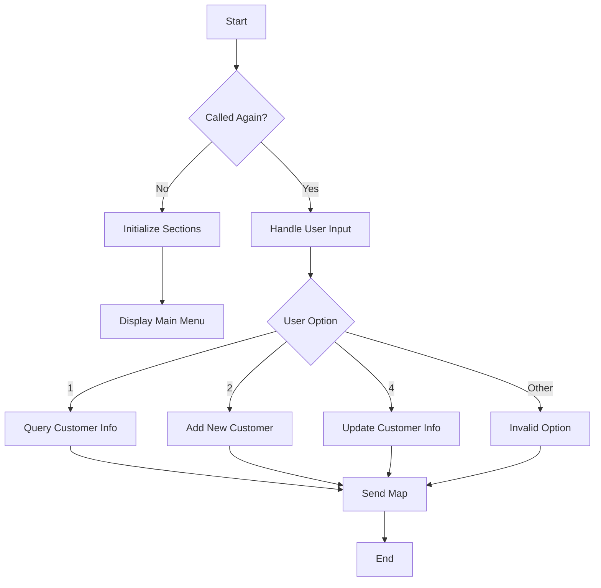

This document will cover the <SwmToken path="base/src/lgtestc1.cbl" pos="11:6:6" line-data="       PROGRAM-ID. LGTESTC1.">`LGTESTC1`</SwmToken> program. We'll cover:

1. What the Program Does
2. Program Flow
3. Program Sections

## What the Program Does

The <SwmToken path="base/src/lgtestc1.cbl" pos="11:6:6" line-data="       PROGRAM-ID. LGTESTC1.">`LGTESTC1`</SwmToken> program is a customer menu for handling customer transactions. It allows users to perform various operations such as querying customer information, adding new customers, and updating existing customer details. The program interacts with different CICS programs to achieve these operations.

## Program Flow

The program starts by checking if it is being called again. If not, it initializes various sections and displays the main menu. The user input is then evaluated to determine the operation to be performed. Depending on the input, the program either queries customer information, adds a new customer, or updates existing customer details. The program then sends the appropriate map back to the user.



<SwmSnippet path="/base/src/lgtestc1.cbl" line="53">

---

### MAINLINE SECTION

First, the program checks if it is being called again by evaluating <SwmToken path="base/src/lgtestc1.cbl" pos="55:3:3" line-data="           IF EIBCALEN &gt; 0">`EIBCALEN`</SwmToken>. If it is not, it initializes various sections and displays the main menu using the <SwmToken path="base/src/lgtestc1.cbl" pos="64:11:11" line-data="           EXEC CICS SEND MAP (&#39;SSMAPC1&#39;)">`SSMAPC1`</SwmToken> map.

```cobol
       MAINLINE SECTION.

           IF EIBCALEN > 0
              GO TO A-GAIN.

           Initialize SSMAPC1I.
           Initialize SSMAPC1O.
           Initialize COMM-AREA.
           MOVE '0000000000'   To ENT1CNOO

      * Display Main Menu
           EXEC CICS SEND MAP ('SSMAPC1')
                     FROM(SSMAPC1O)
                     MAPSET ('SSMAP')
                     ERASE
                     END-EXEC.
```

---

</SwmSnippet>

<SwmSnippet path="/base/src/lgtestc1.cbl" line="70">

---

### <SwmToken path="base/src/lgtestc1.cbl" pos="70:1:3" line-data="       A-GAIN.">`A-GAIN`</SwmToken>

Now, the program handles user input by setting up AID and condition handlers. It then receives the user input into the <SwmToken path="base/src/lgtestc1.cbl" pos="80:3:3" line-data="                     INTO(SSMAPC1I) ASIS">`SSMAPC1I`</SwmToken> map.

```cobol
       A-GAIN.

           EXEC CICS HANDLE AID
                     CLEAR(CLEARIT)
                     PF3(ENDIT) END-EXEC.
           EXEC CICS HANDLE CONDITION
                     MAPFAIL(ENDIT)
                     END-EXEC.

           EXEC CICS RECEIVE MAP('SSMAPC1')
                     INTO(SSMAPC1I) ASIS
                     MAPSET('SSMAP') END-EXEC.
```

---

</SwmSnippet>

<SwmSnippet path="/base/src/lgtestc1.cbl" line="84">

---

### EVALUATE <SwmToken path="base/src/lgtestc1.cbl" pos="84:3:3" line-data="           EVALUATE ENT1OPTO">`ENT1OPTO`</SwmToken>

Then, the program evaluates the user input (<SwmToken path="base/src/lgtestc1.cbl" pos="84:3:3" line-data="           EVALUATE ENT1OPTO">`ENT1OPTO`</SwmToken>) to determine the operation to be performed. It handles options for querying customer information, adding a new customer, updating existing customer details, and invalid options.

```cobol
           EVALUATE ENT1OPTO

             WHEN '1'
                 Move '01ICUS'   To CA-REQUEST-ID
                 Move ENT1CNOO   To CA-CUSTOMER-NUM
                 EXEC CICS LINK PROGRAM('LGICUS01')
                           COMMAREA(COMM-AREA)
                           LENGTH(32500)
                 END-EXEC

                 IF CA-RETURN-CODE > 0
                   GO TO NO-DATA
                 END-IF

                 Move CA-FIRST-NAME to ENT1FNAI
                 Move CA-LAST-NAME  to ENT1LNAI
                 Move CA-DOB        to ENT1DOBI
                 Move CA-HOUSE-NAME to ENT1HNMI
                 Move CA-HOUSE-NUM  to ENT1HNOI
                 Move CA-POSTCODE   to ENT1HPCI
                 Move CA-PHONE-HOME    to ENT1HP1I
```

---

</SwmSnippet>

<SwmSnippet path="/base/src/lgtestc1.cbl" line="230">

---

### <SwmToken path="base/src/lgtestc1.cbl" pos="230:1:3" line-data="       ENDIT-STARTIT.">`ENDIT-STARTIT`</SwmToken>

Finally, the program sends the map back to the user and returns control to CICS.

```cobol
       ENDIT-STARTIT.
           EXEC CICS RETURN
                TRANSID('SSC1')
                COMMAREA(COMM-AREA)
                END-EXEC.
```

---

</SwmSnippet>

<SwmSnippet path="/base/src/lgtestc1.cbl" line="283">

---

### <SwmToken path="base/src/lgtestc1.cbl" pos="283:1:3" line-data="       WRITE-GENACNTL.">`WRITE-GENACNTL`</SwmToken>

Going into the <SwmToken path="base/src/lgtestc1.cbl" pos="283:1:3" line-data="       WRITE-GENACNTL.">`WRITE-GENACNTL`</SwmToken> section, the program handles writing to the temporary storage queue (TSQ) named <SwmToken path="base/src/lgtestc1.cbl" pos="283:3:3" line-data="       WRITE-GENACNTL.">`GENACNTL`</SwmToken>. It ensures that the high and low customer numbers are updated in the TSQ.

```cobol
       WRITE-GENACNTL.

           EXEC CICS ENQ Resource(STSQ-NAME)
                         Length(Length Of STSQ-NAME)
           END-EXEC.
           Move 'Y' To WS-FLAG-TSQH
           Move 1   To WS-Item-Count
           Exec CICS ReadQ TS Queue(STSQ-NAME)
                     Into(READ-MSG)
                     Resp(WS-RESP)
                     Item(1)
           End-Exec.
           If WS-RESP = DFHRESP(NORMAL)
              Perform With Test after Until WS-RESP > 0
                 Exec CICS ReadQ TS Queue(STSQ-NAME)
                     Into(READ-MSG)
                     Resp(WS-RESP)
                     Next
                 End-Exec
                 Add 1 To WS-Item-Count
                 If WS-RESP = DFHRESP(NORMAL) And
```

---

</SwmSnippet>

&nbsp;

*This is an auto-generated document by Swimm 🌊 and has not yet been verified by a human*

<SwmMeta version="3.0.0" repo-id="Z2l0aHViJTNBJTNBa3luZHJ5bC1jaWNzLWdlbmFwcCUzQSUzQVN3aW1tLURlbW8=" repo-name="kyndryl-cics-genapp"><sup>Powered by [Swimm](/)</sup></SwmMeta>
