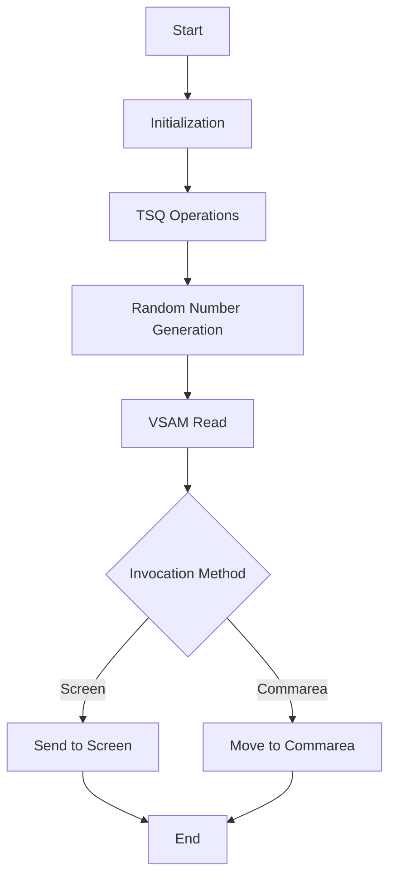

The <SwmToken path="base/src/lgicvs01.cbl" pos="17:6:6" line-data="       PROGRAM-ID. LGICVS01.">`LGICVS01`</SwmToken> program is a COBOL application designed to return a random customer number from a VSAM KSDS Customer dataset. This document will cover the following aspects of the program:

1. What the Program Does
2. Program Flow
3. Program Sections

## What the Program Does

The <SwmToken path="base/src/lgicvs01.cbl" pos="17:6:6" line-data="       PROGRAM-ID. LGICVS01.">`LGICVS01`</SwmToken> program retrieves a random customer number from a VSAM KSDS Customer dataset. It uses a random seed obtained from a control TSQ to perform the read operation. The program can be invoked by either LINK or TRAN and returns the result via Commarea or screen display.

## Program Flow

The program flow of <SwmToken path="base/src/lgicvs01.cbl" pos="17:6:6" line-data="       PROGRAM-ID. LGICVS01.">`LGICVS01`</SwmToken> involves several key steps:

1. Initialization: The program initializes various working-storage variables and assigns system-related values.
2. TSQ Operations: It performs enqueue and dequeue operations on a temporary storage queue (TSQ) to manage customer data.
3. Random Number Generation: The program computes a random customer number within a specified range.
4. VSAM Read: It reads the customer data from the VSAM KSDS dataset using the generated random number.
5. Output: Depending on the invocation method, the program either sends the result to the screen or moves it to the Commarea.
6. Termination: The program ends by returning control to the calling program.



<SwmSnippet path="/base/src/lgicvs01.cbl" line="90">

---

## Program Sections

First, the program initializes various working-storage variables and assigns system-related values such as SYSID, STARTCODE, and Invokingprog. It also determines the invocation method and prepares the Commarea or receives data into <SwmToken path="base/src/lgicvs01.cbl" pos="95:7:9" line-data="           MOVE SPACES TO WS-RECV.">`WS-RECV`</SwmToken>.

```cobol
       PROCEDURE DIVISION.

      *---------------------------------------------------------------*
       MAINLINE SECTION.
      *
           MOVE SPACES TO WS-RECV.

           EXEC CICS ASSIGN SYSID(WS-SYSID)
                RESP(WS-RESP)
           END-EXEC.

           EXEC CICS ASSIGN STARTCODE(WS-STARTCODE)
                RESP(WS-RESP)
           END-EXEC.

           EXEC CICS ASSIGN Invokingprog(WS-Invokeprog)
                RESP(WS-RESP)
           END-EXEC.
           IF WS-STARTCODE(1:1) = 'D' or
              WS-Invokeprog Not = Spaces
              MOVE 'C' To WS-FLAG
```

---

</SwmSnippet>

<SwmSnippet path="/base/src/lgicvs01.cbl" line="122">

---

Now, the program sets initial values for customer range variables and flags for TSQ operations.

```cobol
      *
           Move 0001000001 to WS-Cust-Low
           Move 0001000001 to WS-Cust-High
           Move 'Y'        to WS-FLAG-TSQE
           Move 'Y'        to WS-FLAG-TSQH
           Move 'Y'        to WS-FLAG-TSQL
      *
```

---

</SwmSnippet>

<SwmSnippet path="/base/src/lgicvs01.cbl" line="129">

---

Then, the program performs enqueue and dequeue operations on the TSQ to manage customer data. It reads messages from the TSQ and updates the customer range variables accordingly.

```cobol
           EXEC CICS ENQ Resource(STSQ-NAME)
                         Length(Length Of STSQ-NAME)
           END-EXEC.
           Exec CICS ReadQ TS Queue(STSQ-NAME)
                     Into(READ-MSG)
                     Resp(WS-RESP)
                     Item(1)
           End-Exec.
           If WS-RESP = DFHRESP(NORMAL)
              Move Space to WS-FLAG-TSQE
              Perform With Test after Until WS-RESP > 0
                 Exec CICS ReadQ TS Queue(STSQ-NAME)
                     Into(READ-MSG)
                     Resp(WS-RESP)
                     Next
                 End-Exec
                 If WS-RESP = DFHRESP(NORMAL) And
                      Read-Msg-Msg(1:12) = 'LOW CUSTOMER'
                      Move READ-CUST-LOW to WS-Cust-Low
                      Move Space to WS-FLAG-TSQL
                 End-If
```

---

</SwmSnippet>

<SwmSnippet path="/base/src/lgicvs01.cbl" line="157">

---

Going into the next section, the program writes messages to the TSQ based on the flags set earlier. This ensures that the customer range data is updated in the TSQ.

```cobol
      *
           Move WS-Cust-Low to WRITE-MSG-LOW
           Move WS-Cust-High to WRITE-MSG-HIGH
      *
      *
           If WS-FLAG-TSQE = 'Y'
             EXEC CICS WRITEQ TS QUEUE(STSQ-NAME)
                       FROM(WRITE-MSG-E)
                       RESP(WS-RESP)
                       NOSUSPEND
                       LENGTH(20)
             END-EXEC
           End-If.
      *
           If WS-FLAG-TSQL = 'Y'
             EXEC CICS WRITEQ TS QUEUE(STSQ-NAME)
                       FROM(WRITE-MSG-L)
                       RESP(WS-RESP)
                       NOSUSPEND
                       LENGTH(23)
             END-EXEC
```

---

</SwmSnippet>

<SwmSnippet path="/base/src/lgicvs01.cbl" line="187">

---

Next, the program performs a dequeue operation to release the TSQ resource.

```cobol
           End-If.

           EXEC CICS DEQ Resource(STSQ-NAME)
                         Length(Length Of STSQ-NAME)
           END-EXEC.
```

---

</SwmSnippet>

<SwmSnippet path="/base/src/lgicvs01.cbl" line="192">

---

Now, the program computes a random customer number within the specified range and reads the corresponding customer data from the VSAM KSDS dataset.

```cobol

           Compute WS-Random-Number = Function Integer((
                     Function Random(EIBTASKN) *
                       (ws-cust-high - ws-cust-low)) +
                          WS-Cust-Low)
           Move WS-Random-Number to WRITE-MSG-HIGH

           Exec CICS Read File('KSDSCUST')
                     Into(CA-AREA)
                     Length(F82)
                     Ridfld(WRITE-MSG-HIGH)
                     KeyLength(F10)
                     RESP(WS-RESP)
                     GTEQ
           End-Exec.
           If WS-RESP = DFHRESP(NORMAL)
             Move CA-Customer-Num to WRITE-MSG-HIGH
           End-if.
```

---

</SwmSnippet>

<SwmSnippet path="/base/src/lgicvs01.cbl" line="210">

---

Finally, the program sends the result to the screen or moves it to the Commarea based on the invocation method.

```cobol

           If WS-FLAG = 'R' Then
             EXEC CICS SEND TEXT FROM(WRITE-MSG-H)
              WAIT
              ERASE
              LENGTH(24)
              FREEKB
             END-EXEC
           Else
             Move Spaces To COMMA-Data
             Move Write-Msg-H    To COMMA-Data-H
             Move Write-Msg-High To COMMA-Data-High
           End-If.
```

---

</SwmSnippet>

<SwmSnippet path="/base/src/lgicvs01.cbl" line="223">

---

The program terminates by returning control to the calling program.

```cobol

           EXEC CICS RETURN
           END-EXEC.
```

---

</SwmSnippet>

&nbsp;

*This is an auto-generated document by Swimm 🌊 and has not yet been verified by a human*

<SwmMeta version="3.0.0" repo-id="Z2l0aHViJTNBJTNBa3luZHJ5bC1jaWNzLWdlbmFwcCUzQSUzQVN3aW1tLURlbW8=" repo-name="kyndryl-cics-genapp"><sup>Powered by [Swimm](/)</sup></SwmMeta>
