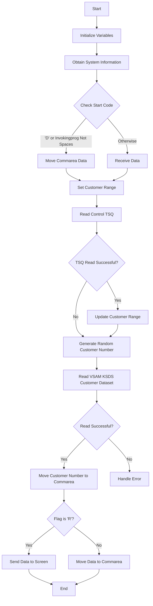

The <SwmToken path="base/src/lgicvs01.cbl" pos="17:6:6" line-data="       PROGRAM-ID. LGICVS01.">`LGICVS01`</SwmToken> program is a COBOL application designed to return a random customer number from a VSAM KSDS Customer dataset. This document will cover:

1. What the Program Does
2. Program Flow
3. Program Sections

## What the Program Does

The <SwmToken path="base/src/lgicvs01.cbl" pos="17:6:6" line-data="       PROGRAM-ID. LGICVS01.">`LGICVS01`</SwmToken> program retrieves a random customer number from the VSAM KSDS Customer dataset. It uses a random seed obtained from a control TSQ to perform the read operation. The program can be called by LINK or TRAN and returns the result via Commarea or Screen display.

## Program Flow

The program starts by initializing necessary variables and obtaining system information. It then reads a control TSQ to get the range of customer numbers. Using this range, it generates a random customer number and reads the corresponding record from the VSAM KSDS Customer dataset. Finally, it returns the customer number either through Commarea or by displaying it on the screen.



<SwmSnippet path="/base/src/lgicvs01.cbl" line="93">

---

## Program Sections

First, the program initializes variables and obtains system information such as SYSID, STARTCODE, and Invokingprog. It then checks the STARTCODE and Invokingprog to determine the source of the data (Commarea or Screen).

```cobol
       MAINLINE SECTION.
      *
           MOVE SPACES TO WS-RECV.

           EXEC CICS ASSIGN SYSID(WS-SYSID)
                RESP(WS-RESP)
           END-EXEC.

           EXEC CICS ASSIGN STARTCODE(WS-STARTCODE)
                RESP(WS-RESP)
           END-EXEC.

           EXEC CICS ASSIGN Invokingprog(WS-Invokeprog)
                RESP(WS-RESP)
           END-EXEC.
           IF WS-STARTCODE(1:1) = 'D' or
              WS-Invokeprog Not = Spaces
              MOVE 'C' To WS-FLAG
              MOVE COMMA-DATA  TO WS-COMMAREA
              MOVE EIBCALEN    TO WS-RECV-LEN
           ELSE
```

---

</SwmSnippet>

<SwmSnippet path="/base/src/lgicvs01.cbl" line="123">

---

Next, the program sets the initial range for customer numbers and flags for reading the control TSQ.

```cobol
           Move 0001000001 to WS-Cust-Low
           Move 0001000001 to WS-Cust-High
           Move 'Y'        to WS-FLAG-TSQE
           Move 'Y'        to WS-FLAG-TSQH
           Move 'Y'        to WS-FLAG-TSQL
      *
```

---

</SwmSnippet>

<SwmSnippet path="/base/src/lgicvs01.cbl" line="129">

---

Then, the program reads the control TSQ to get the range of customer numbers. If the read is successful, it updates the customer range based on the data read from the TSQ.

```cobol
           EXEC CICS ENQ Resource(STSQ-NAME)
                         Length(Length Of STSQ-NAME)
           END-EXEC.
           Exec CICS ReadQ TS Queue(STSQ-NAME)
                     Into(READ-MSG)
                     Resp(WS-RESP)
                     Item(1)
           End-Exec.
           If WS-RESP = DFHRESP(NORMAL)
              Move Space to WS-FLAG-TSQE
              Perform With Test after Until WS-RESP > 0
                 Exec CICS ReadQ TS Queue(STSQ-NAME)
                     Into(READ-MSG)
                     Resp(WS-RESP)
                     Next
                 End-Exec
                 If WS-RESP = DFHRESP(NORMAL) And
                      Read-Msg-Msg(1:12) = 'LOW CUSTOMER'
                      Move READ-CUST-LOW to WS-Cust-Low
                      Move Space to WS-FLAG-TSQL
                 End-If
```

---

</SwmSnippet>

<SwmSnippet path="/base/src/lgicvs01.cbl" line="158">

---

Going into the next section, the program writes back to the control TSQ if necessary, based on the flags set earlier.

```cobol
           Move WS-Cust-Low to WRITE-MSG-LOW
           Move WS-Cust-High to WRITE-MSG-HIGH
      *
      *
           If WS-FLAG-TSQE = 'Y'
             EXEC CICS WRITEQ TS QUEUE(STSQ-NAME)
                       FROM(WRITE-MSG-E)
                       RESP(WS-RESP)
                       NOSUSPEND
                       LENGTH(20)
             END-EXEC
           End-If.
      *
           If WS-FLAG-TSQL = 'Y'
             EXEC CICS WRITEQ TS QUEUE(STSQ-NAME)
                       FROM(WRITE-MSG-L)
                       RESP(WS-RESP)
                       NOSUSPEND
                       LENGTH(23)
             END-EXEC
           End-If.
```

---

</SwmSnippet>

<SwmSnippet path="/base/src/lgicvs01.cbl" line="189">

---

Finally, the program generates a random customer number within the specified range and reads the corresponding record from the VSAM KSDS Customer dataset. It then returns the customer number either through Commarea or by displaying it on the screen.

```cobol
           EXEC CICS DEQ Resource(STSQ-NAME)
                         Length(Length Of STSQ-NAME)
           END-EXEC.

           Compute WS-Random-Number = Function Integer((
                     Function Random(EIBTASKN) *
                       (ws-cust-high - ws-cust-low)) +
                          WS-Cust-Low)
           Move WS-Random-Number to WRITE-MSG-HIGH

           Exec CICS Read File('KSDSCUST')
                     Into(CA-AREA)
                     Length(F82)
                     Ridfld(WRITE-MSG-HIGH)
                     KeyLength(F10)
                     RESP(WS-RESP)
                     GTEQ
           End-Exec.
           If WS-RESP = DFHRESP(NORMAL)
             Move CA-Customer-Num to WRITE-MSG-HIGH
           End-if.
```

---

</SwmSnippet>

&nbsp;

*This is an auto-generated document by Swimm 🌊 and has not yet been verified by a human*

<SwmMeta version="3.0.0" repo-id="Z2l0aHViJTNBJTNBa3luZHJ5bC1jaWNzLWdlbmFwcCUzQSUzQVN3aW1tLURlbW8=" repo-name="kyndryl-cics-genapp"><sup>Powered by [Swimm](/)</sup></SwmMeta>
