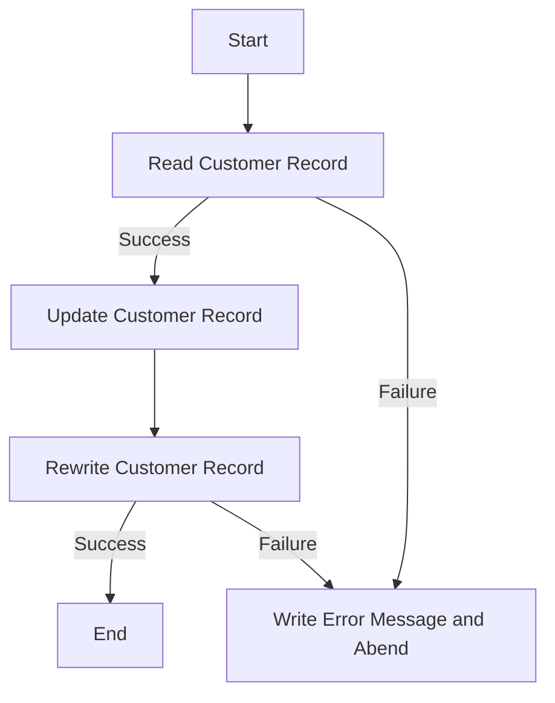

This document will cover the <SwmToken path="base/src/lgucvs01.cbl" pos="11:6:6" line-data="       PROGRAM-ID. LGUCVS01.">`LGUCVS01`</SwmToken> program. We'll cover:

1. What the Program Does
2. Program Flow
3. Program Sections

## What the Program Does

The <SwmToken path="base/src/lgucvs01.cbl" pos="11:6:6" line-data="       PROGRAM-ID. LGUCVS01.">`LGUCVS01`</SwmToken> program is designed to update customer records in a VSAM Key-Sequenced Data Set (KSDS). It reads a customer record from the KSDS file, updates it, and then rewrites the updated record back to the file. The program handles errors by writing error messages and abending if necessary.

## Program Flow

The program flow of <SwmToken path="base/src/lgucvs01.cbl" pos="11:6:6" line-data="       PROGRAM-ID. LGUCVS01.">`LGUCVS01`</SwmToken> is as follows:

1. Read the customer record from the KSDS file.
2. If the read operation is successful, proceed to update the record.
3. Rewrite the updated customer record back to the KSDS file.
4. If any operation fails, write an error message and abend the program.



<SwmSnippet path="/base/src/lgucvs01.cbl" line="64">

---

### MAINLINE SECTION

First, the program reads the customer record from the KSDS file using the <SwmToken path="base/src/lgucvs01.cbl" pos="69:1:7" line-data="           Exec CICS Read File(&#39;KSDSCUST&#39;)">`Exec CICS Read File`</SwmToken> command. If the read operation is not successful, it moves the response code to <SwmToken path="base/src/lgucvs01.cbl" pos="78:7:9" line-data="             Move EIBRESP2 To WS-RESP2">`WS-RESP2`</SwmToken>, sets the return code to '81', performs the <SwmToken path="base/src/lgucvs01.cbl" pos="80:3:7" line-data="             PERFORM WRITE-ERROR-MESSAGE">`WRITE-ERROR-MESSAGE`</SwmToken> section, and abends the program with the code <SwmToken path="base/src/lgucvs01.cbl" pos="81:10:10" line-data="             EXEC CICS ABEND ABCODE(&#39;LGV1&#39;) NODUMP END-EXEC">`LGV1`</SwmToken>.

```cobol
       MAINLINE SECTION.
      *
      *---------------------------------------------------------------*
           Move EIBCALEN To WS-Commarea-Len.
      *---------------------------------------------------------------*
           Exec CICS Read File('KSDSCUST')
                     Into(WS-Customer-Area)
                     Length(WS-Commarea-Len)
                     Ridfld(CA-Customer-Num)
                     KeyLength(10)
                     RESP(WS-RESP)
                     Update
           End-Exec.
           If WS-RESP Not = DFHRESP(NORMAL)
             Move EIBRESP2 To WS-RESP2
             MOVE '81' TO CA-RETURN-CODE
             PERFORM WRITE-ERROR-MESSAGE
             EXEC CICS ABEND ABCODE('LGV1') NODUMP END-EXEC
             EXEC CICS RETURN END-EXEC
           End-If.
```

---

</SwmSnippet>

<SwmSnippet path="/base/src/lgucvs01.cbl" line="85">

---

Now, the program rewrites the updated customer record back to the KSDS file using the <SwmToken path="base/src/lgucvs01.cbl" pos="85:1:7" line-data="           Exec CICS ReWrite File(&#39;KSDSCUST&#39;)">`Exec CICS ReWrite File`</SwmToken> command. If the rewrite operation is not successful, it moves the response code to <SwmToken path="base/src/lgucvs01.cbl" pos="91:7:9" line-data="             Move EIBRESP2 To WS-RESP2">`WS-RESP2`</SwmToken>, sets the return code to '82', performs the <SwmToken path="base/src/lgucvs01.cbl" pos="93:3:7" line-data="             PERFORM WRITE-ERROR-MESSAGE">`WRITE-ERROR-MESSAGE`</SwmToken> section, and abends the program with the code <SwmToken path="base/src/lgucvs01.cbl" pos="94:10:10" line-data="             EXEC CICS ABEND ABCODE(&#39;LGV2&#39;) NODUMP END-EXEC">`LGV2`</SwmToken>.

```cobol
           Exec CICS ReWrite File('KSDSCUST')
                     From(CA-Customer-Num)
                     Length(CUSTOMER-RECORD-SIZE)
                     RESP(WS-RESP)
           End-Exec.
           If WS-RESP Not = DFHRESP(NORMAL)
             Move EIBRESP2 To WS-RESP2
             MOVE '82' TO CA-RETURN-CODE
             PERFORM WRITE-ERROR-MESSAGE
             EXEC CICS ABEND ABCODE('LGV2') NODUMP END-EXEC
             EXEC CICS RETURN END-EXEC
           End-If.
```

---

</SwmSnippet>

<SwmSnippet path="/base/src/lgucvs01.cbl" line="104">

---

Then, the <SwmToken path="base/src/lgucvs01.cbl" pos="104:1:5" line-data="       WRITE-ERROR-MESSAGE.">`WRITE-ERROR-MESSAGE`</SwmToken> section is executed when an error occurs. It retrieves the current date and time, formats them, and moves them to the error message structure. It then links to the <SwmToken path="base/src/lgucvs01.cbl" pos="117:10:10" line-data="           EXEC CICS LINK PROGRAM(&#39;LGSTSQ&#39;)">`LGSTSQ`</SwmToken> program to log the error message. If the length of the communication area is greater than zero, it moves the communication area data to <SwmToken path="base/src/lgucvs01.cbl" pos="123:12:14" line-data="               MOVE DFHCOMMAREA(1:EIBCALEN) TO CA-DATA">`CA-DATA`</SwmToken> and links to the <SwmToken path="base/src/lgucvs01.cbl" pos="117:10:10" line-data="           EXEC CICS LINK PROGRAM(&#39;LGSTSQ&#39;)">`LGSTSQ`</SwmToken> program again to log the communication area error message.

```cobol
       WRITE-ERROR-MESSAGE.
           EXEC CICS ASKTIME ABSTIME(WS-ABSTIME)
           END-EXEC
           EXEC CICS FORMATTIME ABSTIME(WS-ABSTIME)
                     MMDDYYYY(WS-DATE)
                     TIME(WS-TIME)
           END-EXEC
      *
           MOVE WS-DATE TO EM-DATE
           MOVE WS-TIME TO EM-TIME
           Move CA-Customer-Num To EM-Cusnum
           Move WS-RESP         To EM-RespRC
           Move WS-RESP2        To EM-Resp2RC
           EXEC CICS LINK PROGRAM('LGSTSQ')
                     COMMAREA(ERROR-MSG)
                     LENGTH(LENGTH OF ERROR-MSG)
           END-EXEC.
           IF EIBCALEN > 0 THEN
             IF EIBCALEN < 91 THEN
               MOVE DFHCOMMAREA(1:EIBCALEN) TO CA-DATA
               EXEC CICS LINK PROGRAM('LGSTSQ')
```

---

</SwmSnippet>

&nbsp;

*This is an auto-generated document by Swimm 🌊 and has not yet been verified by a human*

<SwmMeta version="3.0.0" repo-id="Z2l0aHViJTNBJTNBa3luZHJ5bC1jaWNzLWdlbmFwcCUzQSUzQVN3aW1tLURlbW8=" repo-name="kyndryl-cics-genapp"><sup>Powered by [Swimm](/)</sup></SwmMeta>
