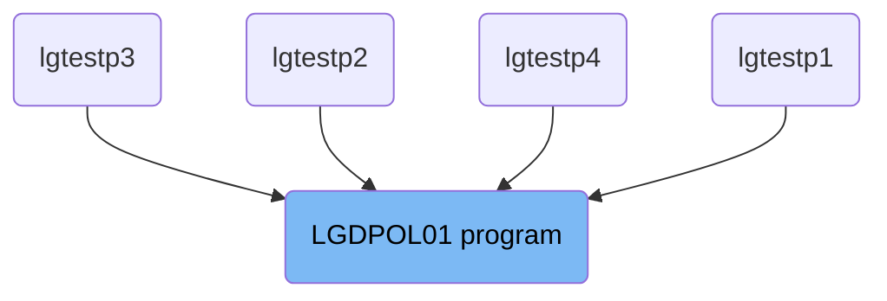
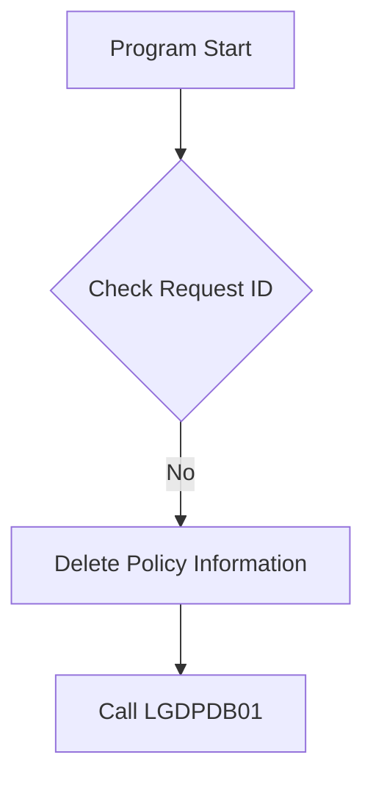

The <SwmToken path="base/src/lgdpol01.cbl" pos="11:6:6" line-data="       PROGRAM-ID. LGDPOL01.">`LGDPOL01`</SwmToken> program is responsible for deleting policy information in the system. This is achieved by checking the request ID, validating the commarea, and calling the <SwmToken path="base/src/lgdpol01.cbl" pos="141:9:9" line-data="           EXEC CICS LINK PROGRAM(LGDPDB01)">`LGDPDB01`</SwmToken> program to perform the actual deletion from the database.

The flow starts by initializing working storage variables and checking if the commarea is received. If the commarea is valid, the program checks the request ID. If the request ID is recognized, it proceeds to delete the policy information by calling the <SwmToken path="base/src/lgdpol01.cbl" pos="141:9:9" line-data="           EXEC CICS LINK PROGRAM(LGDPDB01)">`LGDPDB01`</SwmToken> program.

# Where is this program used?

This program is used multiple times in the codebase as represented in the following diagram:



Lets' zoom into the flow:



<SwmSnippet path="/base/src/lgdpol01.cbl" line="83">

---

## Initializing Working Storage Variables

First, the program initializes the working storage variables. This includes setting up general variables such as <SwmToken path="base/src/lgdpol01.cbl" pos="86:7:9" line-data="           MOVE EIBTRNID TO WS-TRANSID.">`WS-TRANSID`</SwmToken>, <SwmToken path="base/src/lgdpol01.cbl" pos="87:7:9" line-data="           MOVE EIBTRMID TO WS-TERMID.">`WS-TERMID`</SwmToken>, and <SwmToken path="base/src/lgdpol01.cbl" pos="88:7:9" line-data="           MOVE EIBTASKN TO WS-TASKNUM.">`WS-TASKNUM`</SwmToken> which are essential for tracking the transaction, terminal, and task number respectively.

```cobol
      * initialize working storage variables
           INITIALIZE WS-HEADER.
      * set up general variable
           MOVE EIBTRNID TO WS-TRANSID.
           MOVE EIBTRMID TO WS-TERMID.
           MOVE EIBTASKN TO WS-TASKNUM.
```

---

</SwmSnippet>

<SwmSnippet path="/base/src/lgdpol01.cbl" line="92">

---

## Checking Commarea

Next, the program checks if the commarea is received. If no commarea is received, it issues an ABEND (abnormal end) with the code 'LGCA'. If the commarea is received but is not large enough, it sets the return code to '98' and returns to the caller.

```cobol
      * Check commarea and obtain required details                     *
      *----------------------------------------------------------------*
      * If NO commarea received issue an ABEND
           IF EIBCALEN IS EQUAL TO ZERO
               MOVE ' NO COMMAREA RECEIVED' TO EM-VARIABLE
               PERFORM WRITE-ERROR-MESSAGE
               EXEC CICS ABEND ABCODE('LGCA') NODUMP END-EXEC
           END-IF

      * initialize commarea return code to zero
           MOVE '00' TO CA-RETURN-CODE
           MOVE EIBCALEN TO WS-CALEN.
           SET WS-ADDR-DFHCOMMAREA TO ADDRESS OF DFHCOMMAREA.

      * Check commarea is large enough
           IF EIBCALEN IS LESS THAN WS-CA-HEADER-LEN
             MOVE '98' TO CA-RETURN-CODE
             EXEC CICS RETURN END-EXEC
           END-IF
```

---

</SwmSnippet>

<SwmSnippet path="/base/src/lgdpol01.cbl" line="113">

---

## Handling Request ID

Then, the program checks the request ID in the commarea. If the request ID is not recognized (i.e., not one of <SwmToken path="base/src/lgdpol01.cbl" pos="119:18:18" line-data="           IF ( CA-REQUEST-ID NOT EQUAL TO &#39;01DEND&#39; AND">`01DEND`</SwmToken>, <SwmToken path="base/src/lgdpol01.cbl" pos="120:14:14" line-data="                CA-REQUEST-ID NOT EQUAL TO &#39;01DMOT&#39; AND">`01DMOT`</SwmToken>, <SwmToken path="base/src/lgdpol01.cbl" pos="121:14:14" line-data="                CA-REQUEST-ID NOT EQUAL TO &#39;01DHOU&#39; AND">`01DHOU`</SwmToken>, <SwmToken path="base/src/lgdpol01.cbl" pos="122:14:14" line-data="                CA-REQUEST-ID NOT EQUAL TO &#39;01DCOM&#39; )">`01DCOM`</SwmToken>), it sets the return code to '99'. Otherwise, it performs the <SwmToken path="base/src/lgdpol01.cbl" pos="126:3:9" line-data="               PERFORM DELETE-POLICY-DB2-INFO">`DELETE-POLICY-DB2-INFO`</SwmToken> routine to delete the policy information.

```cobol
      * Check request-id in commarea and if recognised ...             *
      * Call routine to delete row from policy table                   *
      *----------------------------------------------------------------*
      * Upper case value passed in Request Id field                    *
           MOVE FUNCTION UPPER-CASE(CA-REQUEST-ID) TO CA-REQUEST-ID

           IF ( CA-REQUEST-ID NOT EQUAL TO '01DEND' AND
                CA-REQUEST-ID NOT EQUAL TO '01DMOT' AND
                CA-REQUEST-ID NOT EQUAL TO '01DHOU' AND
                CA-REQUEST-ID NOT EQUAL TO '01DCOM' )
      *        Request is not recognised or supported
               MOVE '99' TO CA-RETURN-CODE
           ELSE
               PERFORM DELETE-POLICY-DB2-INFO
               If CA-RETURN-CODE > 0
                 EXEC CICS RETURN END-EXEC
               End-if
           END-IF
```

---

</SwmSnippet>

<SwmSnippet path="/base/src/lgdpol01.cbl" line="139">

---

## Deleting Policy Information

The <SwmToken path="base/src/lgdpol01.cbl" pos="139:1:7" line-data="       DELETE-POLICY-DB2-INFO.">`DELETE-POLICY-DB2-INFO`</SwmToken> routine calls the <SwmToken path="base/src/lgdpol01.cbl" pos="141:9:9" line-data="           EXEC CICS LINK PROGRAM(LGDPDB01)">`LGDPDB01`</SwmToken> program to delete the policy information from the database. This is done by linking to the <SwmToken path="base/src/lgdpol01.cbl" pos="141:9:9" line-data="           EXEC CICS LINK PROGRAM(LGDPDB01)">`LGDPDB01`</SwmToken> program and passing the commarea.

More about <SwmToken path="base/src/lgdpol01.cbl" pos="141:9:9" line-data="           EXEC CICS LINK PROGRAM(LGDPDB01)">`LGDPDB01`</SwmToken>: <SwmLink doc-title="Deleting Policy Records (LGDPDB01)">[Deleting Policy Records (LGDPDB01)](/.swm/deleting-policy-records-lgdpdb01.6f0ohhon.sw.md)</SwmLink>

```cobol
       DELETE-POLICY-DB2-INFO.

           EXEC CICS LINK PROGRAM(LGDPDB01)
                Commarea(DFHCOMMAREA)
                LENGTH(32500)
           END-EXEC.

           EXIT.
```

---

</SwmSnippet>

&nbsp;

*This is an auto-generated document by Swimm 🌊 and has not yet been verified by a human*

<SwmMeta version="3.0.0" repo-id="Z2l0aHViJTNBJTNBa3luZHJ5bC1jaWNzLWdlbmFwcCUzQSUzQVN3aW1tLURlbW8=" repo-name="kyndryl-cics-genapp"><sup>Powered by [Swimm](/)</sup></SwmMeta>
