The <SwmToken path="base/src/lgdpdb01.cbl" pos="13:6:6" line-data="       PROGRAM-ID. LGDPDB01.">`LGDPDB01`</SwmToken> program is a COBOL application designed to delete policy information from a <SwmToken path="base/src/lgdpdb01.cbl" pos="124:5:5" line-data="      * initialize DB2 host variables">`DB2`</SwmToken> database. This document will cover the following aspects of the <SwmToken path="base/src/lgdpdb01.cbl" pos="13:6:6" line-data="       PROGRAM-ID. LGDPDB01.">`LGDPDB01`</SwmToken> program:

1. What the Program Does
2. Program Flow
3. Program Sections

## What the Program Does

The <SwmToken path="base/src/lgdpdb01.cbl" pos="13:6:6" line-data="       PROGRAM-ID. LGDPDB01.">`LGDPDB01`</SwmToken> program is responsible for deleting policy information from the <SwmToken path="base/src/lgdpdb01.cbl" pos="124:5:5" line-data="      * initialize DB2 host variables">`DB2`</SwmToken> database. It checks the communication area (commarea) for the request ID and, if recognized, deletes the corresponding row from the POLICY table. The program handles different types of policies, including Endowment, House, Motor, and Commercial policies. If the request ID is not recognized, it sets an error return code.

## Program Flow

The program flow of <SwmToken path="base/src/lgdpdb01.cbl" pos="13:6:6" line-data="       PROGRAM-ID. LGDPDB01.">`LGDPDB01`</SwmToken> can be summarized as follows:

1. Initialize working storage and <SwmToken path="base/src/lgdpdb01.cbl" pos="124:5:5" line-data="      * initialize DB2 host variables">`DB2`</SwmToken> host variables.
2. Check if the commarea is received and is of sufficient length.
3. Convert customer and policy numbers from the commarea to <SwmToken path="base/src/lgdpdb01.cbl" pos="124:5:5" line-data="      * initialize DB2 host variables">`DB2`</SwmToken> integer format.
4. Check the request ID in the commarea.
5. If the request ID is recognized, delete the corresponding row from the POLICY table and call the <SwmToken path="base/src/lgdpdb01.cbl" pos="59:3:3" line-data="       01 LGDPVS01                  PIC x(8) Value &#39;LGDPVS01&#39;.">`LGDPVS01`</SwmToken> program.
6. Return to the caller.

```mermaid
graph TD
  A[Start] --> B[Initialize Variables]
  B --> C{Commarea Received?}
  C -->|No| D[Issue ABEND]
  C -->|Yes| E[Check Commarea Length]
  E --> F[Convert Customer & Policy Numbers]
  F --> G{Request ID Recognized?}
  G -->|No| H[Set Error Return Code]
  G -->|Yes| I[Delete Policy from DB2]
  I --> J[Call LGDPVS01 Program]
  J --> K[Return to Caller]

%% Swimm:
%% graph TD
%%   A[Start] --> B[Initialize Variables]
%%   B --> C{Commarea Received?}
%%   C -->|No| D[Issue ABEND]
%%   C -->|Yes| E[Check Commarea Length]
%%   E --> F[Convert Customer & Policy Numbers]
%%   F --> G{Request ID Recognized?}
%%   G -->|No| H[Set Error Return Code]
%%   G -->|Yes| I[Delete Policy from DB2]
%%   I --> J[Call <SwmToken path="base/src/lgdpdb01.cbl" pos="59:3:3" line-data="       01 LGDPVS01                  PIC x(8) Value &#39;LGDPVS01&#39;.">`LGDPVS01`</SwmToken> Program]
%%   J --> K[Return to Caller]
```



<SwmSnippet path="/base/src/lgdpdb01.cbl" line="111">

---

### MAINLINE SECTION

First, the MAINLINE SECTION initializes working storage variables and <SwmToken path="base/src/lgdpdb01.cbl" pos="124:5:5" line-data="      * initialize DB2 host variables">`DB2`</SwmToken> host variables. It then checks if the commarea is received and is of sufficient length. If not, it issues an ABEND or sets an error return code. If the commarea is valid, it converts the customer and policy numbers to <SwmToken path="base/src/lgdpdb01.cbl" pos="124:5:5" line-data="      * initialize DB2 host variables">`DB2`</SwmToken> integer format and checks the request ID. If the request ID is recognized, it performs the <SwmToken path="base/src/lgdpdb01.cbl" pos="186:1:7" line-data="       DELETE-POLICY-DB2-INFO.">`DELETE-POLICY-DB2-INFO`</SwmToken> section and calls the <SwmToken path="base/src/lgdpdb01.cbl" pos="59:3:3" line-data="       01 LGDPVS01                  PIC x(8) Value &#39;LGDPVS01&#39;.">`LGDPVS01`</SwmToken> program.

```cobol
       MAINLINE SECTION.

      *----------------------------------------------------------------*
      * Common code                                                    *
      *----------------------------------------------------------------*
      * initialize working storage variables
           INITIALIZE WS-HEADER.
      * set up general variable
           MOVE EIBTRNID TO WS-TRANSID.
           MOVE EIBTRMID TO WS-TERMID.
           MOVE EIBTASKN TO WS-TASKNUM.
      *----------------------------------------------------------------*

      * initialize DB2 host variables
           INITIALIZE DB2-IN-INTEGERS.

      *----------------------------------------------------------------*
      * Check commarea and obtain required details                     *
      *----------------------------------------------------------------*
      * If NO commarea received issue an ABEND
           IF EIBCALEN IS EQUAL TO ZERO
```

---

</SwmSnippet>

<SwmSnippet path="/base/src/lgdpdb01.cbl" line="186">

---

### <SwmToken path="base/src/lgdpdb01.cbl" pos="186:1:7" line-data="       DELETE-POLICY-DB2-INFO.">`DELETE-POLICY-DB2-INFO`</SwmToken>

Now, the <SwmToken path="base/src/lgdpdb01.cbl" pos="186:1:7" line-data="       DELETE-POLICY-DB2-INFO.">`DELETE-POLICY-DB2-INFO`</SwmToken> section deletes the appropriate row from the POLICY table based on the customer and policy numbers. If the SQLCODE is not 0, it sets an error return code and performs the <SwmToken path="base/src/lgdpdb01.cbl" pos="200:3:7" line-data="               PERFORM WRITE-ERROR-MESSAGE">`WRITE-ERROR-MESSAGE`</SwmToken> section.

```cobol
       DELETE-POLICY-DB2-INFO.

           MOVE ' DELETE POLICY  ' TO EM-SQLREQ
           EXEC SQL
             DELETE
               FROM POLICY
               WHERE ( CUSTOMERNUMBER = :DB2-CUSTOMERNUM-INT AND
                       POLICYNUMBER  = :DB2-POLICYNUM-INT      )
           END-EXEC

      *    Treat SQLCODE 0 and SQLCODE 100 (record not found) as
      *    successful - end result is record does not exist
           IF SQLCODE NOT EQUAL 0 Then
               MOVE '90' TO CA-RETURN-CODE
               PERFORM WRITE-ERROR-MESSAGE
               EXEC CICS RETURN END-EXEC
           END-IF.

           EXIT.

```

---

</SwmSnippet>

<SwmSnippet path="/base/src/lgdpdb01.cbl" line="212">

---

### <SwmToken path="base/src/lgdpdb01.cbl" pos="212:1:5" line-data="       WRITE-ERROR-MESSAGE.">`WRITE-ERROR-MESSAGE`</SwmToken>

Then, the <SwmToken path="base/src/lgdpdb01.cbl" pos="212:1:5" line-data="       WRITE-ERROR-MESSAGE.">`WRITE-ERROR-MESSAGE`</SwmToken> section writes an error message to the queues, including the date, time, program name, customer number, policy number, and SQLCODE. It also writes the commarea to the queues if it is received.

```cobol
       WRITE-ERROR-MESSAGE.
      * Save SQLCODE in message
           MOVE SQLCODE TO EM-SQLRC
      * Obtain and format current time and date
           EXEC CICS ASKTIME ABSTIME(WS-ABSTIME)
           END-EXEC
           EXEC CICS FORMATTIME ABSTIME(Ws-ABSTIME)
                     MMDDYYYY(WS-DATE)
                     TIME(WS-TIME)
           END-EXEC
           MOVE WS-DATE TO EM-DATE
           MOVE WS-TIME TO EM-TIME
      * Write output message to TDQ
           EXEC CICS LINK PROGRAM('LGSTSQ')
                     COMMAREA(ERROR-MSG)
                     LENGTH(LENGTH OF ERROR-MSG)
           END-EXEC.
      * Write 90 bytes or as much as we have of commarea to TDQ
           IF EIBCALEN > 0 THEN
             IF EIBCALEN < 91 THEN
               MOVE DFHCOMMAREA(1:EIBCALEN) TO CA-DATA
```

---

</SwmSnippet>

&nbsp;

*This is an auto-generated document by Swimm 🌊 and has not yet been verified by a human*

<SwmMeta version="3.0.0" repo-id="Z2l0aHViJTNBJTNBa3luZHJ5bC1jaWNzLWdlbmFwcCUzQSUzQVN3aW1tLURlbW8=" repo-name="kyndryl-cics-genapp"><sup>Powered by [Swimm](/)</sup></SwmMeta>
